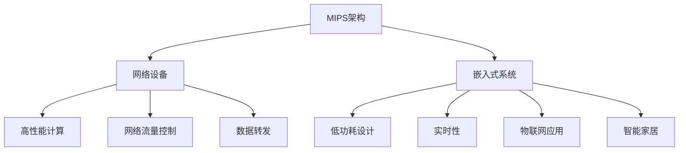

                 

# MIPS架构：网络设备和嵌入式系统的选择

> 关键词：MIPS架构,网络设备,嵌入式系统,高性能计算,低功耗设计

## 1. 背景介绍

### 1.1 问题由来

随着互联网和物联网技术的迅猛发展，网络设备和嵌入式系统在各个领域得到了广泛的应用。这些设备需要具备高性能计算、低功耗设计、快速响应等特性，以满足用户对数据处理、通信和控制的要求。然而，选择适合的网络设备和嵌入式系统的处理器架构一直是设计师面临的难题。

目前，主流处理器架构主要有x86、ARM和MIPS等。x86架构主要应用于通用计算和服务器市场，具有强大的计算能力和丰富的软件生态。ARM架构则广泛应用于移动设备和嵌入式系统，具有低功耗、高集成度和出色的性能。而MIPS架构作为一种高性能计算和低功耗设计的理想选择，在网络设备和嵌入式系统中的应用逐渐受到关注。

### 1.2 问题核心关键点

选择MIPS架构作为网络设备和嵌入式系统处理器的核心，需要考虑以下几个关键点：
1. **性能与功耗平衡**：MIPS架构在处理速度和功耗之间取得了一个良好的平衡，适合高并发、低延迟的计算需求。
2. **硬件成本与扩展性**：MIPS架构的硬件成本相对较低，且易于扩展，支持多核、多处理器系统。
3. **软件生态与兼容性**：MIPS架构有丰富的软件生态系统，且与主流操作系统和应用软件具有良好的兼容性。
4. **安全性与可靠性**：MIPS架构具有较高的安全性，适用于军事、航空、医疗等对数据安全要求较高的领域。
5. **定制化与灵活性**：MIPS架构支持高度定制化设计，可以根据具体应用场景进行调整。

本文将深入探讨MIPS架构在网络设备和嵌入式系统中的选择和应用，从原理、操作步骤、数学模型、项目实践、实际应用场景等多个角度进行全面分析。

## 2. 核心概念与联系

### 2.1 核心概念概述

为更好地理解MIPS架构在网络设备和嵌入式系统中的应用，本节将介绍几个密切相关的核心概念：

- **MIPS架构**：由MIPS科技公司开发的精简指令集计算机（RISC）架构，以其高效、易扩展、低功耗等特点著称。
- **网络设备**：如路由器、交换机、防火墙等，用于连接网络、传输数据、控制流量等。
- **嵌入式系统**：如物联网设备、智能家居、移动设备等，具备嵌入式操作系统和专门的应用软件。
- **高性能计算**：在网络设备中，需要处理大量的数据和复杂的算法，需要高性能计算能力的支持。
- **低功耗设计**：嵌入式系统往往需要长时间运行，要求处理器具有低功耗设计。
- **实时性**：网络设备和嵌入式系统需要快速响应用户请求，保证系统的实时性。

这些核心概念之间的逻辑关系可以通过以下Mermaid流程图来展示：



这个流程图展示了大语言模型的核心概念及其之间的关系：

1. MIPS架构被广泛应用于网络设备和嵌入式系统中。
2. 网络设备需要高性能计算和低功耗设计，以满足高并发、低延迟的需求。
3. 嵌入式系统要求实时性，以快速响应用户请求。
4. 高性能计算、低功耗设计和实时性共同构成网络设备和嵌入式系统的关键特性。

## 3. 核心算法原理 & 具体操作步骤

### 3.1 算法原理概述

MIPS架构的网络设备和嵌入式系统设计，基于高性能计算和低功耗设计的双重目标。其核心思想是通过优化指令集和硬件架构，在保证高性能计算的同时，尽可能减少功耗和面积。具体来说，MIPS架构采用了以下策略：

1. **精简指令集（RISC）**：MIPS架构采用精简指令集，减少指令数量，简化硬件设计，提高计算效率。
2. **流水线技术**：MIPS架构采用多级流水线，将指令执行过程分为多个阶段，并行处理多条指令，提高处理速度。
3. **嵌入式缓存**：MIPS架构采用嵌入式缓存，将常用数据存储在缓存中，减少访问主存的延迟，提高访问速度。
4. **功耗优化**：MIPS架构采用动态电压和频率调节技术（DVFS），根据当前负载自动调整电压和频率，优化功耗。

### 3.2 算法步骤详解

MIPS架构的网络设备和嵌入式系统设计，可以分为以下几个关键步骤：

**Step 1: 需求分析**
- 确定网络设备和嵌入式系统的功能需求、性能指标和功耗要求。
- 分析数据流量、计算复杂度和实时性要求，评估处理器性能需求。

**Step 2: 架构选择**
- 根据需求分析，选择合适的MIPS架构处理器。
- 考虑多核、多处理器系统，以满足高并发和计算需求。

**Step 3: 硬件设计**
- 根据选定的处理器架构，进行硬件设计。
- 设计嵌入式缓存、内存管理、I/O接口等组件，优化功耗和性能。

**Step 4: 软件优化**
- 开发适合MIPS架构的操作系统和应用软件。
- 优化程序代码，减少指令数和数据访问延迟，提高计算效率。

**Step 5: 测试与验证**
- 在测试环境中验证系统性能和稳定性。
- 根据测试结果进行优化，确保系统满足设计要求。

**Step 6: 部署与应用**
- 将系统部署到实际应用环境中。
- 监控系统运行状态，调整参数，保障系统稳定性和性能。

### 3.3 算法优缺点

MIPS架构的网络设备和嵌入式系统设计具有以下优点：
1. **高性能计算**：MIPS架构的高性能计算能力，适合处理高并发、低延迟的计算任务。
2. **低功耗设计**：MIPS架构的低功耗设计，适用于长期运行的嵌入式系统。
3. **易于扩展**：MIPS架构的易扩展性，支持多核、多处理器系统，满足复杂计算需求。
4. **灵活性高**：MIPS架构支持高度定制化设计，可以根据具体应用场景进行调整。

同时，该架构也存在一定的局限性：
1. **软件生态不完善**：MIPS架构的软件生态系统相对x86和ARM较不完善，可能影响系统开发效率。
2. **市场份额小**：MIPS架构的市场份额较小，硬件供应商和开发资源相对较少。
3. **竞争力不足**：与x86和ARM架构相比，MIPS架构在计算性能和功耗效率上的竞争力有待提升。

### 3.4 算法应用领域

MIPS架构的网络设备和嵌入式系统设计，在多个领域得到了广泛应用：

1. **通信设备**：如路由器、交换机、防火墙等，需要处理大量的数据和复杂的算法，适合MIPS架构的高性能计算能力。
2. **嵌入式系统**：如智能家居、物联网设备、工业控制等，需要长时间运行和低功耗设计，适合MIPS架构的低功耗特性。
3. **医疗设备**：如医疗影像设备、健康监测设备等，需要处理大量的数据和复杂的算法，适合MIPS架构的高性能计算能力。
4. **航空航天**：如无人机、卫星等，需要高性能计算和实时性，适合MIPS架构的实时性和高并发特性。

此外，MIPS架构还被应用于科学研究、军事防御、安全监控等领域，其高性能计算和低功耗设计使其在这些高要求的应用场景中具有独特的优势。

## 4. 数学模型和公式 & 详细讲解 & 举例说明

### 4.1 数学模型构建

MIPS架构的网络设备和嵌入式系统设计，需要考虑多个性能指标，如处理速度、功耗、面积等。以下建立一个数学模型，用于评估MIPS架构的系统性能：

设系统处理速度为$V$，功耗为$P$，面积为$A$，定义为：

$$
V = f \times N \times T \times C
$$

$$
P = V \times T \times P_{elec}
$$

$$
A = N \times A_{core} \times A_{mem}
$$

其中，$f$为处理器主频，$N$为核数，$T$为时钟周期，$C$为指令周期，$P_{elec}$为电子功耗，$A_{core}$为处理器核心面积，$A_{mem}$为内存面积。

### 4.2 公式推导过程

根据以上数学模型，我们可以推导出MIPS架构的性能指标：

1. **处理速度**：

$$
V = f \times N \times T \times C
$$

2. **功耗**：

$$
P = V \times T \times P_{elec} = f \times N \times T \times C \times T \times P_{elec}
$$

3. **面积**：

$$
A = N \times A_{core} \times A_{mem} = N \times A_{core} \times N \times T \times P_{elec}
$$

通过对以上公式的推导，我们可以看出，MIPS架构的系统性能主要取决于主频、核数、指令周期和电子功耗等因素。在实际应用中，需要根据具体需求进行优化设计，以达到性能和功耗的最优平衡。

### 4.3 案例分析与讲解

以路由器为例，分析MIPS架构的应用：

1. **性能需求**：路由器需要处理大量的数据包，进行复杂的路由算法，具有高并发、低延迟的需求。

2. **功耗需求**：路由器需要长时间运行，且通常处于待机状态，对功耗要求较高。

3. **面积需求**：路由器需要小型化设计，以适应各种安装环境。

根据以上需求，我们可以选择高性能、低功耗的MIPS处理器，如MIPS64架构的处理器。设计时，可以采用多核设计，提高处理速度；采用动态电压和频率调节技术，优化功耗；采用嵌入式缓存和高速内存，减少数据访问延迟。通过这些优化措施，可以实现高性能、低功耗、小型化的路由器设计。

## 5. 项目实践：代码实例和详细解释说明

### 5.1 开发环境搭建

在进行MIPS架构的网络设备和嵌入式系统设计时，需要搭建适合MIPS架构的开发环境。以下是使用MIPS架构的开发环境配置流程：

1. 安装MIPS架构的开发工具链和编译器。
2. 配置MIPS架构的仿真环境和测试平台。
3. 安装操作系统和应用软件。
4. 编写适合MIPS架构的程序代码。

### 5.2 源代码详细实现

以下是一个简单的MIPS汇编代码示例，用于计算数组的和：

```assembly
main:
    la $t0, array     # 加载数组地址
    li $t1, 0        # 初始化计数器
    li $t2, 0        # 初始化和
    li $t3, 10       # 循环次数

loop:
    lw $t4, 0($t0)   # 加载数组元素
    add $t2, $t2, $t4 # 累加元素
    addi $t0, $t0, 4  # 指针加4
    addi $t1, $t1, 1  # 计数器加1
    blt $t1, $t3, loop # 判断是否结束

    sw $t2, result   # 存储结果

exit:
    li $v0, 10      # 退出指令
    syscall

array: 0, 1, 2, 3, 4, 5, 6, 7, 8, 9, 10
```

### 5.3 代码解读与分析

1. **la指令**：加载数组地址，$la $t0, array表示将数组首地址加载到$t0寄存器中。
2. **lw指令**：从内存中读取数据，$lw $t4, 0($t0)表示从$t0寄存器指向的内存地址读取一个32位数据到$t4寄存器中。
3. **add指令**：加法操作，$add $t2, $t2, $t4表示将$t2寄存器的值与$t4寄存器的值相加，结果存回$t2寄存器中。
4. **sw指令**：将数据写入内存，$sw $t2, result表示将$t2寄存器的值写入result地址中。
5. **li指令**：立即数加载，$li $t1, 0和$li $t2, 0分别将0加载到$t1和$t2寄存器中。
6. **blt指令**：分支指令，$blt $t1, $t3, loop表示如果$t1小于$t3，则跳转到loop标记。
7. **exit指令**：退出系统调用，$li $v0, 10和syscall表示退出程序。

## 6. 实际应用场景

### 6.1 智能家居

智能家居系统需要处理大量的传感器数据，进行复杂的数据分析和处理，同时需要低功耗设计以保证系统的长时间运行。MIPS架构的高性能计算能力和低功耗设计，使其成为智能家居系统处理器的理想选择。

具体实现时，可以将智能家居系统的核心处理器设计为MIPS架构，通过多核设计提高计算速度，采用嵌入式缓存和动态电压调节技术优化功耗。通过开发适合MIPS架构的操作系统和应用软件，可以实现智能家居系统的高效运行和稳定管理。

### 6.2 工业控制

工业控制系统需要处理大量的传感器数据和复杂的控制算法，具有高并发、低延迟的需求。MIPS架构的高性能计算能力和易扩展性，使其成为工业控制系统的理想选择。

在实际应用中，可以将工业控制系统的核心处理器设计为MIPS架构，通过多核设计和多处理器系统满足高并发需求。采用嵌入式缓存和高速内存，减少数据访问延迟，提高控制算法的执行效率。通过开发适合MIPS架构的操作系统和应用软件，可以实现工业控制系统的稳定运行和高效控制。

### 6.3 医疗设备

医疗设备需要处理大量的医疗影像数据和复杂的算法，具有高并发、低延迟的需求。MIPS架构的高性能计算能力和低功耗设计，使其成为医疗设备的理想选择。

具体实现时，可以将医疗设备的核心处理器设计为MIPS架构，通过多核设计和嵌入式缓存优化功耗和性能。开发适合MIPS架构的操作系统和应用软件，可以实现医疗影像数据的快速处理和复杂算法的实时计算。通过动态电压调节技术，优化功耗，延长设备运行时间。

## 7. 工具和资源推荐

### 7.1 学习资源推荐

为了帮助开发者系统掌握MIPS架构的应用，这里推荐一些优质的学习资源：

1. MIPS架构官方文档：MIPS科技公司提供的官方文档，包含MIPS架构的详细介绍、开发工具链和示例代码。
2. MIPS架构课程：多所大学和在线教育平台提供的MIPS架构课程，涵盖MIPS架构的基本概念、设计原理和实际应用。
3. MIPS架构书籍：《MIPS Assembly Language Programming》等经典书籍，详细介绍MIPS汇编语言和编程技巧。
4. MIPS架构论坛和社区：MIPS架构的开发者论坛和社区，交流MIPS架构的开发经验和疑难问题。
5. MIPS架构工具链：MIPS科技公司提供的开发工具链和编译器，用于编写和调试MIPS汇编代码。

通过对这些资源的学习实践，相信你一定能够快速掌握MIPS架构的精髓，并用于解决实际的系统设计问题。

### 7.2 开发工具推荐

高效的开发离不开优秀的工具支持。以下是几款用于MIPS架构开发的工具：

1. MIPS开发环境：由MIPS科技公司提供的开发环境，支持MIPS架构的仿真和测试。
2. MIPS编译器：由MIPS科技公司提供的编译器，支持MIPS汇编语言的编译和优化。
3. MIPS模拟器：用于模拟MIPS指令执行过程的工具，支持单核和双核模拟。
4. MIPS调试器：用于调试MIPS汇编代码的工具，支持断点设置、单步执行和数据监视等功能。
5. MIPS调试台：用于调试MIPS处理器和系统的工具，支持硬件调试和系统监控。

合理利用这些工具，可以显著提升MIPS架构的开发效率，加快创新迭代的步伐。

### 7.3 相关论文推荐

MIPS架构的研究涉及多个领域，以下是几篇奠基性的相关论文，推荐阅读：

1. "A Case Study of MIPS32R4 Processor Family"：MIPS科技公司的技术报告，详细介绍了MIPS32R4处理器系列的设计原理和性能评估。
2. "MIPS32R6 Architecture"：MIPS科技公司的技术报告，介绍了MIPS32R6处理器架构的详细设计。
3. "MIPS64 Architecture"：MIPS科技公司的技术报告，介绍了MIPS64处理器架构的详细设计。
4. "Performance Optimization of MIPS-Based Embedded System"：关于MIPS架构嵌入式系统性能优化的研究论文。
5. "Design and Implementation of MIPS-Based Real-Time System"：关于MIPS架构实时系统设计和实现的研究论文。

这些论文代表了大语言模型微调技术的发展脉络。通过学习这些前沿成果，可以帮助研究者把握学科前进方向，激发更多的创新灵感。

## 8. 总结：未来发展趋势与挑战

### 8.1 总结

本文对MIPS架构在网络设备和嵌入式系统中的应用进行了全面系统的介绍。首先阐述了MIPS架构和网络设备、嵌入式系统的关系，明确了MIPS架构在性能、功耗、实时性等方面的独特优势。其次，从原理到实践，详细讲解了MIPS架构的设计步骤和关键技术，给出了MIPS汇编代码的详细实现。同时，本文还探讨了MIPS架构在智能家居、工业控制、医疗设备等领域的实际应用，展示了MIPS架构的广阔应用前景。此外，本文精选了MIPS架构的学习资源，力求为读者提供全方位的技术指引。

通过本文的系统梳理，可以看到，MIPS架构作为高性能计算和低功耗设计的理想选择，在网络设备和嵌入式系统中具有独特的优势。未来，伴随MIPS架构的持续演进和优化，相信其应用场景将进一步拓展，成为高性能计算和低功耗设计的重要选择。

### 8.2 未来发展趋势

展望未来，MIPS架构的网络设备和嵌入式系统设计将呈现以下几个发展趋势：

1. **多核与多处理器系统**：随着处理器性能需求的提高，MIPS架构的多核与多处理器系统设计将得到广泛应用。多核设计可以提高处理速度，多处理器系统可以实现更高的并发性能。
2. **定制化设计**：MIPS架构的定制化设计能力将进一步提升，开发者可以根据具体应用场景进行优化设计，满足不同应用的需求。
3. **低功耗优化**：MIPS架构的低功耗优化将得到更深入的探索，采用更先进的动态电压调节技术和功耗管理策略，进一步降低系统功耗。
4. **硬件加速**：MIPS架构的硬件加速技术将得到更广泛的应用，如GPU、FPGA等加速器的集成，提升处理速度和效率。
5. **软件生态系统**：MIPS架构的软件生态系统将得到更广泛的发展，开发更多适合MIPS架构的操作系统和应用软件，提高系统开发效率和兼容性。

以上趋势凸显了MIPS架构的广阔应用前景。这些方向的探索发展，必将进一步提升MIPS架构的系统性能和应用范围，为网络设备和嵌入式系统的设计提供新的思路和方案。

### 8.3 面临的挑战

尽管MIPS架构在网络设备和嵌入式系统设计中具有独特的优势，但在迈向更加智能化、普适化应用的过程中，仍面临一些挑战：

1. **软件生态不完善**：MIPS架构的软件生态系统相对x86和ARM较不完善，可能影响系统开发效率。
2. **市场份额小**：MIPS架构的市场份额较小，硬件供应商和开发资源相对较少。
3. **竞争力不足**：与x86和ARM架构相比，MIPS架构在计算性能和功耗效率上的竞争力有待提升。
4. **系统开发难度**：MIPS架构的系统设计需要更高的技术要求，系统开发难度较大，开发周期较长。

### 8.4 研究展望

面对MIPS架构设计中的挑战，未来的研究需要在以下几个方面寻求新的突破：

1. **优化多核与多处理器系统**：进一步优化多核与多处理器系统设计，提高并发性能和系统稳定性。
2. **探索新型处理器架构**：探索新型处理器架构，如类GPU架构和类FPGA架构，提升处理速度和效率。
3. **提高软件生态系统**：开发更多适合MIPS架构的操作系统和应用软件，提升系统开发效率和兼容性。
4. **研究低功耗优化技术**：研究新的低功耗优化技术，如动态功耗管理、自适应功耗调节等，进一步降低系统功耗。
5. **提升系统开发效率**：开发更多工具和框架，提高系统开发效率和调试便利性，降低开发难度。

这些研究方向的探索，必将引领MIPS架构设计向更高的台阶迈进，为网络设备和嵌入式系统带来新的突破和发展。

## 9. 附录：常见问题与解答

**Q1：MIPS架构在网络设备和嵌入式系统中有什么优势？**

A: MIPS架构在网络设备和嵌入式系统中的应用具有以下优势：
1. **高性能计算**：MIPS架构的高性能计算能力，适合处理高并发、低延迟的计算任务。
2. **低功耗设计**：MIPS架构的低功耗设计，适用于长时间运行的嵌入式系统。
3. **易于扩展**：MIPS架构的易扩展性，支持多核、多处理器系统，满足复杂计算需求。
4. **灵活性高**：MIPS架构支持高度定制化设计，可以根据具体应用场景进行调整。

**Q2：如何选择MIPS架构的处理器？**

A: 选择MIPS架构的处理器时，需要考虑以下几个因素：
1. **性能需求**：根据系统的计算需求，选择性能合适的MIPS处理器。
2. **功耗要求**：根据系统的功耗要求，选择低功耗的MIPS处理器。
3. **面积限制**：根据系统的面积限制，选择适合尺寸的MIPS处理器。
4. **开发资源**：根据开发资源和技术能力，选择适合开发效率的MIPS处理器。

**Q3：MIPS架构的开发难度大吗？**

A: MIPS架构的开发难度相对较大，需要较高的技术要求和开发经验。开发者需要具备MIPS汇编语言和系统设计的知识，才能进行高效开发。建议通过系统学习MIPS架构的基础知识，掌握MIPS开发环境、工具链和编译器，逐步积累开发经验。

**Q4：MIPS架构的市场前景如何？**

A: 尽管MIPS架构的市场份额较小，但其高性能计算和低功耗设计具有独特的优势，未来市场前景广阔。随着网络设备和嵌入式系统对计算能力和功耗要求不断提升，MIPS架构的应用将得到进一步拓展，市场规模有望持续扩大。

**Q5：MIPS架构的系统开发工具有哪些？**

A: MIPS架构的系统开发工具包括：
1. MIPS开发环境：用于仿真和测试的开发环境。
2. MIPS编译器：用于编译MIPS汇编代码的工具。
3. MIPS模拟器：用于模拟MIPS指令执行过程的工具。
4. MIPS调试器：用于调试MIPS汇编代码的工具。
5. MIPS调试台：用于调试MIPS处理器和系统的工具。

以上是关于MIPS架构在网络设备和嵌入式系统中的应用和设计的基本介绍。通过系统的学习与实践，相信你能够深入理解MIPS架构的精髓，并应用于实际的系统设计中。

