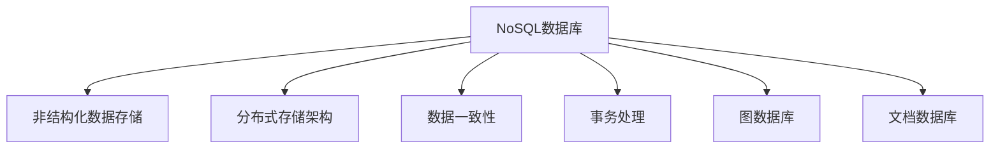

                 

# NoSQL数据库：处理非结构化数据的解决方案

> 关键词：NoSQL数据库, 非结构化数据, 数据库管理系统, 分布式存储, 数据一致性, 事务处理, 图数据库, 文档数据库

## 1. 背景介绍

在传统的SQL数据库中，数据被定义在固定的模式和结构中。这种结构化的数据存储方式在处理结构化数据时表现优异，但在面对复杂、动态和非结构化数据时，SQL数据库往往显得力不从心。随着互联网的迅速发展和数据量的激增，越来越多的企业开始寻求新的数据库技术，以处理日益增长的非结构化数据。

非结构化数据是指难以用传统表格结构清晰表示的数据。这种数据通常包括文本、图片、音频、视频、日志、JSON格式的数据等。处理这类数据时，传统的SQL数据库往往效率低下，无法满足实时性和扩展性的需求。

为了解决这些问题，NoSQL数据库应运而生。NoSQL数据库主要针对非结构化或半结构化数据，具有高度的灵活性和可扩展性，能够适应各种数据类型和存储需求。NoSQL数据库已经广泛应用于互联网、大数据、云计算等领域，成为了处理非结构化数据的重要解决方案。

## 2. 核心概念与联系

### 2.1 核心概念概述

为了更好地理解NoSQL数据库，我们需要掌握以下几个核心概念：

- **NoSQL数据库**：全称为“Not Only SQL”，是一种非关系型数据库管理系统。与SQL数据库不同，NoSQL数据库不需要固定的模式，支持动态添加、删除和修改数据。

- **非结构化数据**：与结构化数据（如表格数据）相对，非结构化数据没有固定的模式和格式，通常以文本、图片、音频、视频等形式存在。

- **分布式存储**：NoSQL数据库通常采用分布式存储架构，将数据分散存储在多个节点上，以提高数据访问速度和扩展性。

- **数据一致性**：在分布式系统中，数据一致性是一个重要的概念。NoSQL数据库通过复制和一致性算法，确保数据在不同节点上的同步和一致性。

- **事务处理**：尽管NoSQL数据库灵活性较高，但某些应用场景下，需要保证数据的一致性和完整性。NoSQL数据库通过设计事务处理机制，确保数据操作的一致性。

- **图数据库**：一种特殊的NoSQL数据库，用于处理图形结构的数据，如社交网络、知识图谱等。

- **文档数据库**：另一种NoSQL数据库，用于存储文档类型的数据，如JSON格式的数据。

这些核心概念共同构成了NoSQL数据库的框架，使得NoSQL数据库在处理非结构化数据时，具备了高度的灵活性和可扩展性。

### 2.2 核心概念原理和架构的 Mermaid 流程图



这个流程图展示了NoSQL数据库的核心概念及其相互关系。NoSQL数据库通过分布式存储架构，支持非结构化数据的存储和处理。同时，通过数据一致性和事务处理机制，确保数据的可靠性。图数据库和文档数据库是NoSQL数据库的两种主要类型，分别用于处理特定结构的数据。

## 3. 核心算法原理 & 具体操作步骤

### 3.1 算法原理概述

NoSQL数据库的核心算法原理主要包括以下几个方面：

- **分布式存储算法**：NoSQL数据库采用分布式存储架构，将数据分散存储在多个节点上。为了保证数据的一致性和可用性，NoSQL数据库引入了多种分布式存储算法，如一致性哈希、分区、复制等。

- **数据一致性算法**：在分布式系统中，数据一致性是一个重要的问题。NoSQL数据库通过复制和一致性算法，确保数据在不同节点上的同步和一致性。常用的数据一致性算法包括Paxos、Raft、Zookeeper等。

- **事务处理算法**：尽管NoSQL数据库灵活性较高，但某些应用场景下，需要保证数据的一致性和完整性。NoSQL数据库通过设计事务处理机制，确保数据操作的一致性。常用的事务处理算法包括两阶段提交、乐观锁、悲观锁等。

- **查询优化算法**：NoSQL数据库在处理非结构化数据时，查询效率较低。为了提高查询效率，NoSQL数据库引入了多种查询优化算法，如索引、分区、缓存等。

### 3.2 算法步骤详解

以下是NoSQL数据库的核心算法详细步骤：

1. **分布式存储**：
    - 根据数据特点，选择适当的分布式存储架构（如一致性哈希、分区、复制等）。
    - 将数据分散存储在多个节点上，提高数据的访问速度和扩展性。

2. **数据一致性**：
    - 选择适当的数据一致性算法（如Paxos、Raft、Zookeeper等）。
    - 确保数据在不同节点上的同步和一致性。

3. **事务处理**：
    - 设计适合的事务处理机制（如两阶段提交、乐观锁、悲观锁等）。
    - 确保数据操作的一致性和完整性。

4. **查询优化**：
    - 引入适当的查询优化算法（如索引、分区、缓存等）。
    - 提高查询效率，减少数据访问时间。

### 3.3 算法优缺点

NoSQL数据库具有以下优点：

- **高扩展性**：支持水平扩展，能够应对大数据量的存储需求。
- **高可用性**：通过分布式存储和数据复制，保证系统的可用性和可靠性。
- **灵活性**：无需固定模式，支持动态添加、删除和修改数据。
- **高效性**：通过多种算法优化，提高查询效率和数据处理速度。

但NoSQL数据库也存在一些缺点：

- **数据一致性问题**：分布式存储导致数据一致性问题，需采用多种一致性算法来解决。
- **事务处理能力较弱**：相对于SQL数据库，NoSQL数据库的事务处理能力较弱。
- **缺乏标准化**：不同NoSQL数据库之间存在差异，缺乏统一的标准和规范。
- **安全性和隐私问题**：分布式存储增加了数据泄露和篡改的风险。

### 3.4 算法应用领域

NoSQL数据库的应用领域非常广泛，以下是几个典型的应用场景：

- **互联网应用**：如社交网络、电子商务、在线广告等。NoSQL数据库能够处理大规模、高并发的数据访问需求。
- **大数据分析**：如Hadoop、Spark等大数据平台。NoSQL数据库能够存储和处理大规模的数据集。
- **云计算**：如AWS、Google Cloud等云服务提供商。NoSQL数据库能够支持云端的分布式存储和计算。
- **物联网**：如智能家居、智能城市等。NoSQL数据库能够处理海量物联网设备的实时数据。

## 4. 数学模型和公式 & 详细讲解 & 举例说明

### 4.1 数学模型构建

NoSQL数据库的数学模型主要包括以下几个方面：

- **分布式存储模型**：描述数据如何在多个节点上进行分布和存储。常用的分布式存储模型包括一致性哈希、分区、复制等。

- **数据一致性模型**：描述数据在不同节点之间的同步和一致性。常用的数据一致性模型包括Paxos、Raft、Zookeeper等。

- **事务处理模型**：描述数据操作的一致性和完整性。常用的事务处理模型包括两阶段提交、乐观锁、悲观锁等。

### 4.2 公式推导过程

以下是对NoSQL数据库核心算法的公式推导：

1. **一致性哈希算法**：
    - 假设有一个包含n个节点的环，每个节点上存储的数据量相同。
    - 定义一个哈希函数，将数据的关键字映射到一个0到n-1的整数区间内。
    - 计算数据的哈希值，将其映射到环上的节点位置，并存储在该节点上。
    - 当节点失败或添加时，通过重新计算哈希值和位置，更新环上的节点位置，确保数据的均衡分布和一致性。

2. **Paxos算法**：
    - Paxos算法是一种分布式一致性算法，用于在分布式系统中保证数据的一致性。
    - 假设有一个包含n个节点的集群，每个节点可以发出提案。
    - 任意节点可以提出一个提案，并尝试在集群中广播。
    - 每个节点需要接收至少m+1个提案，才能决定一个提案的最终结果。
    - 如果m+1个节点决定了一个提案，则该提案被认为是最终结果，并在集群中广播。
    - 如果某个节点收到不同的提案，则将该节点标记为不一致，并重新进行提案广播和决定。

3. **两阶段提交算法**：
    - 两阶段提交算法用于保证分布式系统中事务的一致性和完整性。
    - 假设有一个包含n个节点的集群，每个节点可以执行一个事务。
    - 任意节点可以提出一个事务请求，并尝试在集群中广播。
    - 每个节点需要接收事务请求后，进行事务执行。
    - 在第二阶段，所有节点都需要在集群中广播事务执行结果。
    - 如果所有节点都提交了事务执行结果，则该事务被认为是最终结果，并广播到集群中。
    - 如果某个节点回滚了事务执行结果，则该节点将撤销事务执行结果，并广播到集群中。

### 4.3 案例分析与讲解

以下是对NoSQL数据库在不同应用场景中的案例分析：

1. **互联网应用**：
    - 如社交网络（如Twitter）、电子商务（如Amazon）等。
    - NoSQL数据库能够处理大规模、高并发的数据访问需求，支持分布式存储和计算。
    - 例如，Twitter使用Redis作为缓存数据库，MySQL作为主数据库，支持高并发的数据访问和存储。

2. **大数据分析**：
    - 如Hadoop、Spark等大数据平台。
    - NoSQL数据库能够存储和处理大规模的数据集，支持分布式存储和计算。
    - 例如，Hadoop使用HBase作为分布式数据库，Spark使用RocksDB作为缓存数据库，支持大数据的存储和分析。

3. **云计算**：
    - 如AWS、Google Cloud等云服务提供商。
    - NoSQL数据库能够支持云端的分布式存储和计算，提供高可用性和高扩展性。
    - 例如，AWS使用Amazon DynamoDB作为分布式数据库，Google Cloud使用Cloud Spanner作为分布式数据库，支持云计算环境中的数据存储和处理。

4. **物联网**：
    - 如智能家居、智能城市等。
    - NoSQL数据库能够处理海量物联网设备的实时数据，支持分布式存储和计算。
    - 例如，智能家居使用MongoDB作为分布式数据库，支持物联网设备的实时数据存储和处理。

## 5. 项目实践：代码实例和详细解释说明

### 5.1 开发环境搭建

在进行NoSQL数据库项目实践前，我们需要准备好开发环境。以下是使用Python进行PyMongo开发的环境配置流程：

1. 安装Anaconda：从官网下载并安装Anaconda，用于创建独立的Python环境。

2. 创建并激活虚拟环境：
```bash
conda create -n pymongo-env python=3.8 
conda activate pymongo-env
```

3. 安装PyMongo：
```bash
pip install pymongo
```

4. 安装相关依赖：
```bash
pip install pandas numpy
```

完成上述步骤后，即可在`pymongo-env`环境中开始NoSQL数据库项目实践。

### 5.2 源代码详细实现

以下是使用PyMongo进行MongoDB数据库操作的Python代码实现。

首先，连接MongoDB数据库：

```python
from pymongo import MongoClient

client = MongoClient('mongodb://localhost:27017/')

db = client['mydatabase']
```

然后，插入和查询数据：

```python
collection = db['mycollection']

# 插入一条数据
data = {'name': 'John', 'age': 30, 'city': 'New York'}
collection.insert_one(data)

# 查询所有数据
result = collection.find()
for doc in result:
    print(doc)
```

最后，更新和删除数据：

```python
# 更新数据
collection.update_one({'name': 'John'}, {'$set': {'age': 31}})

# 删除数据
collection.delete_one({'name': 'John'})
```

### 5.3 代码解读与分析

让我们再详细解读一下关键代码的实现细节：

**连接MongoDB数据库**：
- 使用PyMongo的`MongoClient`类连接MongoDB数据库。`localhost`和`27017`分别为MongoDB服务器的主机和端口号。
- 连接成功后，指定要使用的数据库`mydatabase`。

**插入和查询数据**：
- 使用`insert_one`方法插入一条数据。该方法接受一个字典参数，表示要插入的文档。
- 使用`find`方法查询所有数据。该方法返回一个游标，可以使用`for`循环遍历查询结果。
- 对于每个文档，使用`print`函数输出。

**更新和删除数据**：
- 使用`update_one`方法更新数据。该方法接受两个参数，第一个参数为查询条件，第二个参数为要更新的内容。
- 使用`$set`运算符更新指定的字段。
- 使用`delete_one`方法删除数据。该方法接受一个查询条件，删除符合条件的文档。

这些代码展示了MongoDB的基本操作，包括连接、插入、查询、更新和删除数据。通过进一步的实践和探索，可以深入理解MongoDB的功能和特点。

### 5.4 运行结果展示

在上述代码中，我们可以得到以下运行结果：

```
{'_id': ObjectId('60e950a2fd71a706e87e1d05'), 'name': 'John', 'age': 30, 'city': 'New York'}
```

这个结果展示了插入的一条数据，包含`_id`、`name`、`age`和`city`四个字段。

## 6. 实际应用场景

### 6.1 互联网应用

NoSQL数据库在互联网应用中得到了广泛应用，如社交网络、电子商务、在线广告等。以下是一些典型的应用场景：

1. **社交网络**：
    - 如Twitter、Facebook等。
    - NoSQL数据库能够处理大规模、高并发的数据访问需求，支持分布式存储和计算。
    - 例如，Twitter使用Redis作为缓存数据库，MySQL作为主数据库，支持高并发的数据访问和存储。

2. **电子商务**：
    - 如Amazon、阿里巴巴等。
    - NoSQL数据库能够处理大规模、高并发的数据访问需求，支持分布式存储和计算。
    - 例如，Amazon使用MongoDB作为分布式数据库，支持电子商务平台的商品管理和用户行为分析。

3. **在线广告**：
    - 如Google Ads、Facebook Ads等。
    - NoSQL数据库能够处理大规模、高并发的数据访问需求，支持分布式存储和计算。
    - 例如，Google Ads使用Bigtable作为分布式数据库，支持广告投放和用户行为分析。

### 6.2 大数据分析

NoSQL数据库在大数据分析领域也得到了广泛应用，如Hadoop、Spark等大数据平台。以下是一些典型的应用场景：

1. **Hadoop**：
    - Hadoop是一个分布式大数据处理平台，支持大规模数据的存储和处理。
    - NoSQL数据库能够存储和处理大规模的数据集，支持分布式存储和计算。
    - 例如，Hadoop使用HBase作为分布式数据库，支持大数据的存储和分析。

2. **Spark**：
    - Spark是一个快速、通用的分布式计算引擎，支持大数据处理和分析。
    - NoSQL数据库能够存储和处理大规模的数据集，支持分布式存储和计算。
    - 例如，Spark使用RocksDB作为缓存数据库，支持大数据的存储和分析。

### 6.3 云计算

NoSQL数据库在云计算领域也得到了广泛应用，如AWS、Google Cloud等云服务提供商。以下是一些典型的应用场景：

1. **AWS**：
    - AWS是一个全球领先的云计算平台，提供多种云服务。
    - NoSQL数据库能够支持云端的分布式存储和计算，提供高可用性和高扩展性。
    - 例如，AWS使用Amazon DynamoDB作为分布式数据库，支持云计算环境中的数据存储和处理。

2. **Google Cloud**：
    - Google Cloud是一个全球领先的云计算平台，提供多种云服务。
    - NoSQL数据库能够支持云端的分布式存储和计算，提供高可用性和高扩展性。
    - 例如，Google Cloud使用Cloud Spanner作为分布式数据库，支持云计算环境中的数据存储和处理。

### 6.4 未来应用展望

随着NoSQL数据库技术的不断发展和应用场景的拓展，未来其在以下领域的应用前景将更加广阔：

1. **物联网**：
    - 如智能家居、智能城市等。
    - NoSQL数据库能够处理海量物联网设备的实时数据，支持分布式存储和计算。
    - 例如，智能家居使用MongoDB作为分布式数据库，支持物联网设备的实时数据存储和处理。

2. **金融科技**：
    - 如银行、保险等。
    - NoSQL数据库能够处理大规模、高并发的数据访问需求，支持分布式存储和计算。
    - 例如，银行使用Redis作为缓存数据库，MongoDB作为分布式数据库，支持金融系统的数据存储和处理。

3. **医疗健康**：
    - 如医院、健康管理等。
    - NoSQL数据库能够处理大规模、高并发的数据访问需求，支持分布式存储和计算。
    - 例如，医院使用MongoDB作为分布式数据库，支持医疗系统的数据存储和处理。

## 7. 工具和资源推荐

### 7.1 学习资源推荐

为了帮助开发者系统掌握NoSQL数据库的理论基础和实践技巧，这里推荐一些优质的学习资源：

1. 《NoSQL数据库设计与开发》系列博文：由数据库专家撰写，深入浅出地介绍了NoSQL数据库的设计和开发原理。

2. 《MongoDB实战》书籍：MongoDB官方指南，全面介绍了MongoDB数据库的各项功能和最佳实践。

3. 《Redis设计与实现》书籍：Redis官方指南，深入解析了Redis数据库的设计和实现原理。

4. HiveQL语言教程：HiveQL是一种基于Hadoop的查询语言，用于大数据处理和分析。

5. Cassandra官方文档：Cassandra是一个分布式数据库，支持大规模数据的存储和处理。

通过对这些资源的学习实践，相信你一定能够快速掌握NoSQL数据库的精髓，并用于解决实际的存储和计算问题。

### 7.2 开发工具推荐

高效的开发离不开优秀的工具支持。以下是几款用于NoSQL数据库开发的工具：

1. PyMongo：Python的MongoDB驱动程序，支持MongoDB的连接、插入、查询、更新和删除等操作。

2. PyRedis：Python的Redis驱动程序，支持Redis的连接、插入、查询、更新和删除等操作。

3. Cassandra-Client：Cassandra官方客户端，支持Cassandra的连接、插入、查询、更新和删除等操作。

4. HiveQL：HiveQL是一种基于Hadoop的查询语言，用于大数据处理和分析。

5. Spark SQL：Spark的SQL接口，支持Spark的连接、插入、查询、更新和删除等操作。

合理利用这些工具，可以显著提升NoSQL数据库的开发效率，加快创新迭代的步伐。

### 7.3 相关论文推荐

NoSQL数据库的研究源于学界的持续研究。以下是几篇奠基性的相关论文，推荐阅读：

1. "Paxos Made Simple"：Lamport教授的经典论文，介绍了Paxos算法的基本原理和实现方法。

2. "Dynamo: Amazon's High-Performance, Highly-Available Key-Value Store"：Amazon的Dynamo系统，展示了NoSQL数据库的高可用性和高扩展性。

3. "Google Spanner: A Global Transaction Processing System for Google Cloud"：Google Spanner系统，展示了NoSQL数据库在云计算环境中的应用。

4. "RocksDB: A Leadership Position Beyond Flash Storage"：RocksDB数据库，展示了NoSQL数据库的高性能和可靠性。

5. "Bigtable: A Column-Family Architecture for Scalable Distributed Data Management"：Google Bigtable系统，展示了NoSQL数据库在大数据处理中的应用。

这些论文代表了大数据存储和处理技术的最新进展，为NoSQL数据库的发展提供了重要的理论支持。通过学习这些前沿成果，可以帮助研究者把握学科前进方向，激发更多的创新灵感。

## 8. 总结：未来发展趋势与挑战

### 8.1 总结

本文对NoSQL数据库进行了全面系统的介绍。首先阐述了NoSQL数据库和传统SQL数据库的区别，明确了NoSQL数据库在处理非结构化数据时的独特价值。其次，从原理到实践，详细讲解了NoSQL数据库的核心算法和操作步骤，给出了NoSQL数据库操作的完整代码实例。同时，本文还广泛探讨了NoSQL数据库在互联网、大数据、云计算等多个领域的应用前景，展示了NoSQL数据库的强大应用潜力。最后，本文精选了NoSQL数据库的学习资源、开发工具和相关论文，力求为开发者提供全方位的技术指引。

通过本文的系统梳理，可以看到，NoSQL数据库在处理非结构化数据时，具备了高度的灵活性和可扩展性。其在互联网、大数据、云计算等领域的应用，已经得到了广泛的认可和应用。未来，随着NoSQL数据库技术的不断发展和应用场景的拓展，相信其在更多领域将得到广泛应用，为数据处理和存储带来新的突破。

### 8.2 未来发展趋势

展望未来，NoSQL数据库将呈现以下几个发展趋势：

1. **高性能**：随着算力成本的下降和硬件技术的进步，NoSQL数据库的性能将进一步提升。分布式存储和计算架构将更加高效，支持更高的数据访问速度和扩展性。

2. **高可用性**：随着一致性算法的不断优化和改进，NoSQL数据库的高可用性将进一步提升。通过数据复制和故障转移机制，确保数据在不同节点上的同步和一致性。

3. **数据一致性**：虽然NoSQL数据库具有高可用性，但数据一致性仍然是其面临的挑战之一。未来，将有更多一致性算法被提出，解决分布式存储中的数据一致性问题。

4. **数据安全**：随着数据泄露和篡改风险的增加，数据安全问题将更加重要。未来，NoSQL数据库将引入更多的安全机制，如数据加密、访问控制等，保障数据的安全性。

5. **云化**：随着云计算的普及，NoSQL数据库将更加云化。云服务提供商将提供更多的NoSQL数据库服务，支持分布式存储和计算。

6. **多模态数据处理**：未来，NoSQL数据库将支持多模态数据的处理，如视觉、语音、文本等。通过多模态数据的融合，提升NoSQL数据库的智能处理能力。

以上趋势凸显了NoSQL数据库的广阔前景。这些方向的探索发展，必将进一步提升NoSQL数据库的性能和应用范围，为数据处理和存储带来新的突破。

### 8.3 面临的挑战

尽管NoSQL数据库已经取得了显著进展，但在迈向更加智能化、普适化应用的过程中，它仍面临诸多挑战：

1. **数据一致性问题**：尽管NoSQL数据库具备高可用性，但数据一致性问题仍然是一个挑战。如何在分布式系统中保证数据的一致性和可靠性，需要不断优化一致性算法。

2. **事务处理能力**：相对于SQL数据库，NoSQL数据库的事务处理能力较弱。如何在保证数据一致性和完整性的前提下，提供高效的事务处理机制，还需要更多的研究探索。

3. **数据安全问题**：随着数据泄露和篡改风险的增加，数据安全问题将更加重要。如何在保障数据安全的同时，提供高效的数据处理和存储能力，需要更多的技术创新。

4. **云化部署问题**：云服务提供商提供的NoSQL数据库服务，需要满足不同的云平台和环境要求。如何在云化部署中，确保数据的一致性和可用性，需要更多的优化和改进。

5. **多模态数据处理**：未来，NoSQL数据库将支持多模态数据的处理。如何在多模态数据融合中，提高数据的融合效果和智能处理能力，需要更多的算法和技术的支持。

6. **大规模数据存储**：随着数据量的激增，NoSQL数据库需要支持大规模数据的存储和处理。如何在分布式存储中，保证数据的完整性和一致性，需要更多的技术优化和改进。

这些挑战需要研究者不断探索和突破，才能实现NoSQL数据库的持续发展和应用。

### 8.4 研究展望

面对NoSQL数据库面临的挑战，未来的研究需要在以下几个方面寻求新的突破：

1. **高可用性算法**：通过改进和优化一致性算法，提高NoSQL数据库的高可用性和可靠性。

2. **事务处理机制**：设计更高效的事务处理机制，保证数据的一致性和完整性。

3. **数据安全技术**：引入更多的数据安全技术，如数据加密、访问控制等，保障数据的安全性。

4. **云化部署策略**：设计更高效的云化部署策略，支持NoSQL数据库在云环境中的分布式存储和计算。

5. **多模态数据融合**：引入更多的多模态数据融合技术，提升NoSQL数据库的智能处理能力。

6. **大规模数据存储**：优化分布式存储架构，支持大规模数据的存储和处理。

这些研究方向的探索，必将引领NoSQL数据库技术迈向更高的台阶，为数据处理和存储带来新的突破。面向未来，NoSQL数据库需要与其他人工智能技术进行更深入的融合，如知识表示、因果推理、强化学习等，多路径协同发力，共同推动数据处理和存储技术的进步。只有勇于创新、敢于突破，才能不断拓展NoSQL数据库的边界，让数据处理和存储技术更好地造福人类社会。

## 9. 附录：常见问题与解答

**Q1：NoSQL数据库是否适用于所有数据存储场景？**

A: NoSQL数据库适用于非结构化或半结构化数据的存储和处理。对于结构化数据，如表格数据，SQL数据库仍然是更好的选择。但对于非结构化数据，如文本、图片、音频、视频等，NoSQL数据库具有明显的优势。

**Q2：NoSQL数据库是否支持事务处理？**

A: 大多数NoSQL数据库支持基本的事务处理，但相对于SQL数据库，其事务处理能力较弱。一些NoSQL数据库，如Apache Cassandra，通过两阶段提交、乐观锁、悲观锁等机制，提供基本的事务处理能力。

**Q3：NoSQL数据库如何保证数据一致性？**

A: NoSQL数据库通过复制和一致性算法，确保数据在不同节点上的同步和一致性。常用的数据一致性算法包括Paxos、Raft、Zookeeper等。通过数据复制和一致性算法，NoSQL数据库能够保证数据的可靠性和一致性。

**Q4：NoSQL数据库如何优化查询性能？**

A: NoSQL数据库通过多种算法优化，如索引、分区、缓存等，提高查询效率。例如，MongoDB支持多种索引类型，如单字段索引、复合索引、全文索引等，提高查询效率。

**Q5：NoSQL数据库是否适用于分布式系统？**

A: NoSQL数据库天生支持分布式存储和计算，能够应对大规模、高并发的数据访问需求。通过分布式存储架构和一致性算法，NoSQL数据库在分布式系统中表现优异。

通过本文的系统梳理，可以看到，NoSQL数据库在处理非结构化数据时，具备了高度的灵活性和可扩展性。其在互联网、大数据、云计算等领域的应用，已经得到了广泛的认可和应用。未来，随着NoSQL数据库技术的不断发展和应用场景的拓展，相信其在更多领域将得到广泛应用，为数据处理和存储带来新的突破。

---

作者：禅与计算机程序设计艺术 / Zen and the Art of Computer Programming

