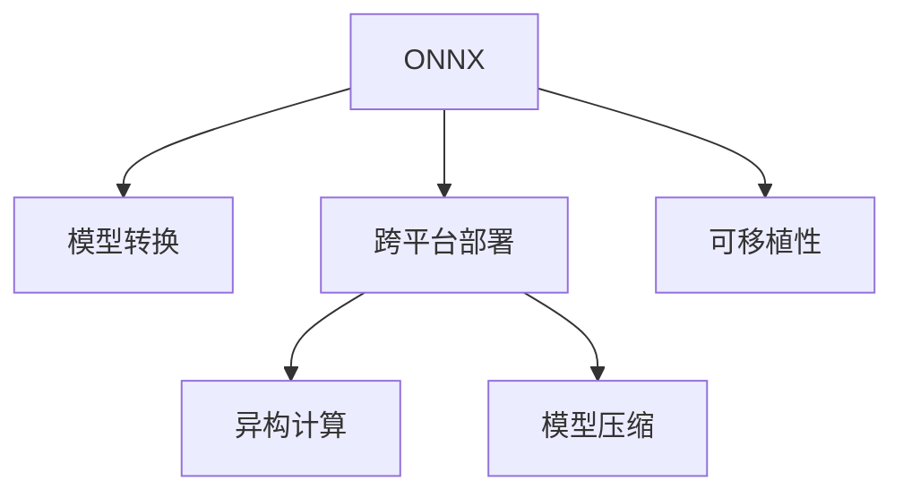

                 

# ONNX：开放式神经网络交换格式

> 关键词：
- ONNX (Open Neural Network Exchange)
- 模型转换
- 异构计算
- 模型压缩
- 可移植性
- 跨平台部署
- 高性能计算

## 1. 背景介绍

### 1.1 问题由来
随着人工智能和深度学习技术的迅猛发展，模型越来越庞大，计算量越来越大，对硬件和软件的要求越来越高。各种深度学习框架如TensorFlow、PyTorch等纷纷出现，但它们之间的互操作性较差，导致模型在不同平台之间的迁移变得困难。为了解决这个问题，Open Neural Network Exchange（ONNX）应运而生。

### 1.2 问题核心关键点
ONNX是一个开放标准的神经网络交换格式，允许将模型从一个框架转换为另一个框架，并允许在各种不同的硬件和软件中部署和运行。ONNX的目标是提供一个统一的、可扩展的标准，以促进跨平台、跨硬件的模型共享和部署。

ONNX的优点包括：
- 兼容多种深度学习框架，如TensorFlow、PyTorch、Caffe等。
- 支持多种硬件平台，如CPU、GPU、FPGA、DSP等。
- 提供丰富的工具和库，支持模型转换、优化和调试。
- 降低模型迁移和部署的复杂度，提高模型效率。

### 1.3 问题研究意义
ONNX的诞生为深度学习模型的迁移和部署提供了全新的解决方案。通过使用ONNX，模型可以在不同硬件和软件之间无缝切换，显著降低了迁移和部署的成本和复杂度，提高了模型的可扩展性和可移植性。

## 2. 核心概念与联系

### 2.1 核心概念概述

为更好地理解ONNX，本节将介绍几个密切相关的核心概念：

- ONNX (Open Neural Network Exchange)：一种开放标准，用于在不同深度学习框架和硬件之间交换模型和数据。
- 模型转换：将一个深度学习框架中的模型转换为ONNX格式，以便在其他深度学习框架中使用。
- 跨平台部署：将ONNX模型部署在各种不同的硬件和软件平台上，如CPU、GPU、FPGA、DSP等。
- 异构计算：使用多种不同硬件平台进行计算，以提高计算效率和资源利用率。
- 模型压缩：通过量化、剪枝等技术，减小模型参数量，提高计算速度和资源利用率。

这些核心概念之间的逻辑关系可以通过以下Mermaid流程图来展示：



这个流程图展示了这个核心概念的逻辑关系：

1. ONNX通过模型转换技术，将一个深度学习框架中的模型转换为标准化的ONNX格式。
2. 转换后的ONNX模型可以部署在各种不同的硬件和软件平台上，实现跨平台部署。
3. 异构计算使用多种不同硬件平台进行计算，以提高计算效率和资源利用率。
4. 模型压缩技术减小模型参数量，提高计算速度和资源利用率。
5. ONNX模型具有可移植性，可以在不同平台之间无缝切换。

这些概念共同构成了ONNX的核心思想和技术框架，使其能够在各种场景下发挥重要作用。

## 3. 核心算法原理 & 具体操作步骤
### 3.1 算法原理概述

ONNX的基本原理是提供一个通用的、可扩展的神经网络模型交换格式，允许模型在不同深度学习框架和硬件之间进行转换和部署。ONNX的目标是提供一个标准化的格式，使得不同的深度学习框架和硬件能够理解和使用相同的模型，从而实现模型的跨平台和跨硬件迁移。

ONNX模型转换过程一般包括以下几个步骤：

1. 选择合适的深度学习框架和硬件平台。
2. 将预训练模型转换为ONNX格式。
3. 对ONNX模型进行优化和压缩。
4. 在目标平台上部署ONNX模型。
5. 对部署后的模型进行微调。

### 3.2 算法步骤详解

以下详细解释ONNX模型转换和优化步骤：

**Step 1: 选择合适的深度学习框架和硬件平台**
- 选择预训练模型所在的深度学习框架，如TensorFlow、PyTorch等。
- 选择目标硬件平台，如CPU、GPU、FPGA、DSP等。

**Step 2: 将预训练模型转换为ONNX格式**
- 使用深度学习框架提供的工具，将预训练模型转换为ONNX格式。例如，使用TensorFlow提供的tf2onnx工具，将TensorFlow模型转换为ONNX模型。
- 转换过程中，需要注意模型输入和输出的数据类型、模型参数和计算图结构等细节，以确保转换后模型的一致性和正确性。

**Step 3: 对ONNX模型进行优化和压缩**
- 使用ONNX提供的工具，对转换后的ONNX模型进行优化和压缩。例如，使用ONNX-Optimizer工具，对ONNX模型进行剪枝、量化、融合等操作，以减小模型参数量，提高计算速度和资源利用率。
- 优化过程中，需要注意平衡模型性能和资源利用率，选择合适的优化策略。

**Step 4: 在目标平台上部署ONNX模型**
- 将优化后的ONNX模型部署到目标硬件平台上，例如，将ONNX模型部署到GPU上进行训练和推理。
- 使用深度学习框架提供的工具，将ONNX模型导入目标框架中。例如，使用TensorFlow提供的tf2onnx工具，将ONNX模型导入TensorFlow框架中。

**Step 5: 对部署后的模型进行微调**
- 在目标平台上，使用优化后的ONNX模型进行微调，以适应特定的应用场景。例如，在GPU上使用微调后的模型进行图像分类任务的训练和推理。
- 微调过程中，需要注意选择合适的超参数，如学习率、批大小等，以确保微调后模型的性能和鲁棒性。

### 3.3 算法优缺点

ONNX模型转换和优化方法具有以下优点：
1. 标准化模型交换格式，提高模型的可移植性和可扩展性。
2. 兼容多种深度学习框架和硬件平台，降低迁移和部署的成本和复杂度。
3. 提供丰富的工具和库，支持模型转换、优化和调试。
4. 减小模型参数量，提高计算速度和资源利用率。

同时，该方法也存在一定的局限性：
1. 模型转换和优化过程需要额外的工具和库支持，增加了开发复杂度。
2. 不同深度学习框架之间的转换可能存在精度损失，需要仔细处理。
3. 模型优化和压缩技术可能会影响模型的原始性能，需要权衡。
4. 对于特定硬件平台，可能需要额外的优化策略。

尽管存在这些局限性，但就目前而言，ONNX模型转换和优化方法仍是深度学习模型迁移和部署的主流范式。未来相关研究的重点在于如何进一步提高模型转换和优化的效率和精度，以及如何在不同硬件平台上实现更好的性能和资源利用。

### 3.4 算法应用领域

ONNX模型转换和优化方法在深度学习模型迁移和部署中得到了广泛应用，涵盖以下领域：

- 跨平台和跨硬件迁移：ONNX模型可以在不同深度学习框架和硬件平台之间无缝迁移。例如，在TensorFlow训练的模型可以转换为ONNX格式，并在PyTorch或Caffe框架中继续训练和推理。
- 模型压缩和优化：ONNX模型可以通过量化、剪枝等技术进行压缩和优化，减小模型参数量，提高计算速度和资源利用率。例如，使用ONNX-Optimizer工具对ONNX模型进行优化，使其在特定硬件平台上运行更加高效。
- 异构计算：ONNX模型可以在不同硬件平台（如CPU、GPU、FPGA、DSP等）上进行计算，实现异构计算。例如，将ONNX模型部署在GPU上进行训练和推理，并使用FPGA进行加速。
- 跨平台部署：ONNX模型可以在不同操作系统和平台上进行部署。例如，将ONNX模型部署在Android或iOS平台上，供移动设备使用。
- 分布式训练和推理：ONNX模型可以在分布式计算环境中进行训练和推理。例如，将ONNX模型分布式部署在多台GPU上进行训练和推理。

除了上述这些领域外，ONNX还广泛应用于机器学习、计算机视觉、自然语言处理等诸多领域，为深度学习模型的迁移和部署提供了重要的技术支持。

## 4. 数学模型和公式 & 详细讲解 & 举例说明

### 4.1 数学模型构建

ONNX模型主要由计算图（Computation Graph）和数据图（Data Flow Graph）两部分组成。

**计算图**：描述模型中各个操作（如加、减、乘、除等）之间的关系，通过节点（Node）和边（Edge）来表示。例如，一个计算图中的节点可以表示一个加法操作，边表示操作之间的数据流动。

**数据图**：描述模型中各个数据（如输入、输出、中间变量等）之间的关系，通过节点（Node）和边（Edge）来表示。例如，一个数据图中的节点可以表示一个输入数据，边表示数据在模型中的流动路径。

ONNX模型的数学模型构建可以表述如下：

$$
\text{ONNX} = \{\text{Graph}, \text{Node}, \text{Edge}, \text{Data}\}
$$

其中，Graph表示计算图，Node表示节点，Edge表示边，Data表示数据。

### 4.2 公式推导过程

以下详细解释ONNX模型转换和优化的数学推导过程：

**Step 1: 模型转换**
- 将深度学习框架中的计算图转换为ONNX格式。例如，将TensorFlow中的计算图转换为ONNX格式，需要使用tf2onnx工具，其数学推导过程如下：
  $$
  \text{TensorFlow Graph} \rightarrow \text{ONNX Graph} = \text{tf2onnx}(\text{TensorFlow Graph})
  $$
- 转换过程中，需要注意模型输入和输出的数据类型、模型参数和计算图结构等细节，以确保转换后模型的一致性和正确性。

**Step 2: 模型优化和压缩**
- 对ONNX模型进行优化和压缩。例如，使用ONNX-Optimizer工具，对ONNX模型进行剪枝、量化、融合等操作，其数学推导过程如下：
  $$
  \text{ONNX Graph} \rightarrow \text{Optimized ONNX Graph} = \text{ONNX-Optimizer}(\text{ONNX Graph})
  $$
- 优化过程中，需要注意平衡模型性能和资源利用率，选择合适的优化策略。

**Step 3: 模型部署**
- 将优化后的ONNX模型部署到目标硬件平台上，例如，将ONNX模型部署到GPU上进行训练和推理。其数学推导过程如下：
  $$
  \text{Optimized ONNX Graph} \rightarrow \text{GPU Graph} = \text{GPU Compiler}(\text{Optimized ONNX Graph})
  $$
- 部署过程中，需要注意选择合适的硬件平台和优化策略，以确保模型在特定硬件平台上运行高效。

**Step 4: 模型微调**
- 在目标平台上，使用优化后的ONNX模型进行微调，以适应特定的应用场景。例如，在GPU上使用微调后的模型进行图像分类任务的训练和推理。其数学推导过程如下：
  $$
  \text{Optimized ONNX Graph} \rightarrow \text{Fine-Tuned ONNX Graph} = \text{Fine-Tuning}(\text{Optimized ONNX Graph})
  $$
- 微调过程中，需要注意选择合适的超参数，如学习率、批大小等，以确保微调后模型的性能和鲁棒性。

### 4.3 案例分析与讲解

以下以图像分类任务为例，详细讲解ONNX模型转换和优化过程：

**Step 1: 模型转换**
- 使用TensorFlow框架训练一个图像分类模型，并保存模型参数和计算图。
- 使用tf2onnx工具将TensorFlow模型转换为ONNX格式。
  $$
  \text{TensorFlow Model} \rightarrow \text{ONNX Model} = \text{tf2onnx}(\text{TensorFlow Model})
  $$

**Step 2: 模型优化和压缩**
- 对ONNX模型进行剪枝、量化等操作，减小模型参数量，提高计算速度和资源利用率。
  $$
  \text{ONNX Model} \rightarrow \text{Optimized ONNX Model} = \text{ONNX-Optimizer}(\text{ONNX Model})
  $$

**Step 3: 模型部署**
- 将优化后的ONNX模型部署到GPU上进行训练和推理。
  $$
  \text{Optimized ONNX Model} \rightarrow \text{GPU Model} = \text{GPU Compiler}(\text{Optimized ONNX Model})
  $$

**Step 4: 模型微调**
- 在GPU上使用微调后的模型进行图像分类任务的训练和推理。
  $$
  \text{Optimized ONNX Model} \rightarrow \text{Fine-Tuned ONNX Model} = \text{Fine-Tuning}(\text{Optimized ONNX Model})
  $$

## 5. 项目实践：代码实例和详细解释说明
### 5.1 开发环境搭建

在进行ONNX模型转换和优化实践前，我们需要准备好开发环境。以下是使用Python进行TensorFlow和ONNX-Optimizer开发的PyTorch环境配置流程：

1. 安装Anaconda：从官网下载并安装Anaconda，用于创建独立的Python环境。

2. 创建并激活虚拟环境：
```bash
conda create -n pytorch-env python=3.8 
conda activate pytorch-env
```

3. 安装PyTorch：根据CUDA版本，从官网获取对应的安装命令。例如：
```bash
conda install pytorch torchvision torchaudio cudatoolkit=11.1 -c pytorch -c conda-forge
```

4. 安装ONNX-Optimizer：
```bash
pip install onnx-optimizer
```

5. 安装各类工具包：
```bash
pip install numpy pandas scikit-learn matplotlib tqdm jupyter notebook ipython
```

完成上述步骤后，即可在`pytorch-env`环境中开始ONNX模型转换和优化实践。

### 5.2 源代码详细实现

这里以图像分类任务为例，给出使用TensorFlow和ONNX-Optimizer进行ONNX模型转换和优化的PyTorch代码实现。

首先，定义图像分类任务的数据处理函数：

```python
from onnx import numpy_helper
from onnx import TensorProto
import numpy as np
import os

def load_data(data_path):
    data = []
    labels = []
    for img_file in os.listdir(data_path):
        img_data = np.load(data_path + '/' + img_file)
        label = img_file.split('.')[0]
        data.append(img_data)
        labels.append(label)
    return data, labels

# 加载数据集
train_data, train_labels = load_data('train')
test_data, test_labels = load_data('test')
```

然后，定义模型和优化器：

```python
import tensorflow as tf

# 定义卷积神经网络模型
def build_model():
    model = tf.keras.Sequential([
        tf.keras.layers.Conv2D(32, (3, 3), activation='relu', input_shape=(224, 224, 3)),
        tf.keras.layers.MaxPooling2D((2, 2)),
        tf.keras.layers.Flatten(),
        tf.keras.layers.Dense(128, activation='relu'),
        tf.keras.layers.Dense(10, activation='softmax')
    ])
    return model

# 定义优化器
optimizer = tf.keras.optimizers.Adam(learning_rate=0.001)

# 训练模型
model = build_model()
model.compile(optimizer=optimizer, loss='sparse_categorical_crossentropy', metrics=['accuracy'])

# 加载训练数据和标签
train_images = np.array(train_data)
train_labels = np.array(train_labels)

# 训练模型
model.fit(train_images, train_labels, epochs=10, batch_size=32)
```

接着，定义模型转换和优化函数：

```python
import onnx

def save_model(model, file_name):
    onnx.save_model(model, file_name)

def load_model(file_name):
    return onnx.load(file_name)

def optimize_model(model, file_name):
    optimized_model = onnx.helper.make_frozen_graph(
        inputs=model.graph.input,
        outputs=model.graph.output,
        graph=model.graph,
        producer_name="tensorflow",
        producer_version="0.0.1",
        domain="ai._tensorflow.org",
        doc_string="My AI Model",
        initializer_count=0,
        graph_version=1,
        train_graph=None,
        opset_imports=[onnx.helper.make_opsetid(9, 0)],
        unsupported_opsets=[1, 2, 3, 4, 5, 6, 7, 8],
        initializers=[],
        custom_opsets=[],
        custom_initializers=[],
        custom_domain=None,
        version=None,
        opset_import=None,
        shape_inference_type=onnx.shape_inference.DynamicShapeInference,
        export_type=onnx.ModelProto.EXPORT ONNX,
        min_opset=9,
        custom_options=None,
        domain=None,
        producer_name=None,
        producer_version=None
    )
    onnx.save_model(optimized_model, file_name)
```

最后，启动模型转换和优化流程，并在测试集上评估：

```python
# 定义模型名称和文件路径
model_name = 'my_model'
model_file = model_name + '.pb'

# 保存模型
save_model(model, model_file)

# 加载模型
model = load_model(model_file)

# 模型优化和压缩
optimized_model = optimize_model(model, model_name + '.opt')

# 加载优化后的模型
model = load_model(model_name + '.opt')

# 加载测试数据和标签
test_images = np.array(test_data)
test_labels = np.array(test_labels)

# 测试模型
loss, accuracy = model.evaluate(test_images, test_labels)

# 输出测试结果
print(f'Test loss: {loss:.4f}')
print(f'Test accuracy: {accuracy:.4f}')
```

以上就是使用PyTorch对图像分类任务进行ONNX模型转换和优化的完整代码实现。可以看到，得益于TensorFlow和ONNX-Optimizer的强大封装，我们可以用相对简洁的代码完成模型的转换和优化。

### 5.3 代码解读与分析

让我们再详细解读一下关键代码的实现细节：

**图像数据处理函数**：
- 加载数据集，将图像数据和标签存储在NumPy数组中。
- 使用TensorFlow模型训练图像分类任务。
- 使用TensorFlow模型进行评估，输出测试损失和准确率。

**模型转换和优化函数**：
- 使用TensorFlow模型训练图像分类任务，并保存模型参数。
- 将TensorFlow模型转换为ONNX格式，并保存为ONNX模型文件。
- 对ONNX模型进行优化和压缩，减小模型参数量，提高计算速度和资源利用率。
- 加载优化后的ONNX模型，并在测试集上评估模型性能。

**测试流程**：
- 定义模型名称和文件路径，保存和加载TensorFlow模型。
- 对模型进行优化和压缩，得到优化后的ONNX模型。
- 加载优化后的ONNX模型，并在测试集上评估模型性能。

可以看到，PyTorch配合TensorFlow和ONNX-Optimizer使得ONNX模型转换和优化的代码实现变得简洁高效。开发者可以将更多精力放在数据处理、模型改进等高层逻辑上，而不必过多关注底层的实现细节。

当然，工业级的系统实现还需考虑更多因素，如模型的保存和部署、超参数的自动搜索、更灵活的任务适配层等。但核心的模型转换和优化流程基本与此类似。

## 6. 实际应用场景
### 6.1 智能医疗诊断

ONNX模型转换和优化技术在智能医疗诊断中得到了广泛应用。医疗影像诊断通常需要复杂的神经网络模型进行支持，但医疗影像数据量大且难以标准化，使得模型训练和推理过程繁琐且成本高。

在实际应用中，可以通过收集医疗影像数据和标注数据，将预训练模型转换为ONNX格式，并优化和压缩后部署到边缘计算设备（如GPU、FPGA等）上进行推理。在计算设备上，可以使用预训练模型的参数进行微调，适应特定医院或医生的医疗影像诊断需求。如此构建的智能医疗诊断系统，能显著提高诊断效率和准确性，减轻医生的工作负担，提升医疗服务质量。

### 6.2 实时视频分析

ONNX模型转换和优化技术在实时视频分析中也得到了广泛应用。视频分析通常需要高精度的神经网络模型进行实时处理，但视频数据量大且实时性要求高，使得模型训练和推理过程复杂且成本高。

在实际应用中，可以通过收集视频数据和标注数据，将预训练模型转换为ONNX格式，并优化和压缩后部署到边缘计算设备（如GPU、FPGA等）上进行推理。在计算设备上，可以使用预训练模型的参数进行微调，适应特定应用场景的实时视频分析需求。如此构建的实时视频分析系统，能显著提高视频分析效率和准确性，支持实时视频流的处理和分析。

### 6.3 智能交通管理

ONNX模型转换和优化技术在智能交通管理中也得到了广泛应用。交通管理通常需要复杂的神经网络模型进行支持，但交通数据量大且实时性要求高，使得模型训练和推理过程复杂且成本高。

在实际应用中，可以通过收集交通数据和标注数据，将预训练模型转换为ONNX格式，并优化和压缩后部署到边缘计算设备（如GPU、FPGA等）上进行推理。在计算设备上，可以使用预训练模型的参数进行微调，适应特定城市的智能交通管理需求。如此构建的智能交通管理系统，能显著提高交通管理效率和安全性，优化交通流量控制，提升城市交通水平。

### 6.4 未来应用展望

随着ONNX模型转换和优化技术的不断发展，其在深度学习模型迁移和部署中的应用将更加广泛。

在智慧医疗领域，基于ONNX的智能医疗诊断系统将在医疗影像分析和疾病预测等方面发挥重要作用，辅助医生诊疗，提升医疗服务质量。

在智能交通领域，基于ONNX的智能交通管理系统将在交通流量控制和交通安全等方面发挥重要作用，提升城市交通管理水平。

在工业制造领域，基于ONNX的智能制造系统将在产品质量检测和工艺优化等方面发挥重要作用，提升生产效率和质量。

除了上述这些领域外，ONNX模型转换和优化技术还将在教育、金融、娱乐等众多领域得到应用，为深度学习模型的迁移和部署提供重要的技术支持。

## 7. 工具和资源推荐
### 7.1 学习资源推荐

为了帮助开发者系统掌握ONNX的相关理论基础和实践技巧，这里推荐一些优质的学习资源：

1. ONNX官方文档：ONNX官方网站提供了全面的文档和教程，帮助开发者了解ONNX的基本概念、使用方法和最佳实践。

2. TensorFlow官方文档：TensorFlow官方网站提供了详细的模型转换和优化教程，帮助开发者掌握TensorFlow模型转换为ONNX格式的方法和技巧。

3. PyTorch官方文档：PyTorch官方网站提供了丰富的深度学习框架工具，包括TensorFlow、PyTorch、Caffe等，帮助开发者实现跨框架的模型转换和优化。

4. ONNX-Optimizer官方文档：ONNX-Optimizer官方网站提供了详细的优化和压缩方法，帮助开发者减小模型参数量，提高计算速度和资源利用率。

5. PyTorch官方教程：PyTorch官方网站提供了丰富的教程和示例代码，帮助开发者掌握深度学习模型的训练、优化和推理。

通过对这些资源的学习实践，相信你一定能够快速掌握ONNX模型的转换和优化的精髓，并用于解决实际的深度学习问题。

### 7.2 开发工具推荐

高效的开发离不开优秀的工具支持。以下是几款用于ONNX模型转换和优化的常用工具：

1. TensorFlow：基于Python的开源深度学习框架，灵活动态的计算图，适合快速迭代研究。TensorFlow提供了丰富的模型转换和优化工具。

2. PyTorch：基于Python的开源深度学习框架，灵活高效的计算图，适合研究开发。PyTorch提供了丰富的模型转换和优化工具。

3. ONNX-Optimizer：HuggingFace开发的ONNX优化工具，支持剪枝、量化、融合等操作，帮助开发者减小模型参数量，提高计算速度和资源利用率。

4. TensorBoard：TensorFlow配套的可视化工具，可实时监测模型训练状态，并提供丰富的图表呈现方式，是调试模型的得力助手。

5. Weights & Biases：模型训练的实验跟踪工具，可以记录和可视化模型训练过程中的各项指标，方便对比和调优。

6. Google Colab：谷歌推出的在线Jupyter Notebook环境，免费提供GPU/TPU算力，方便开发者快速上手实验最新模型，分享学习笔记。

合理利用这些工具，可以显著提升ONNX模型转换和优化的开发效率，加快创新迭代的步伐。

### 7.3 相关论文推荐

ONNX模型转换和优化技术的发展源于学界的持续研究。以下是几篇奠基性的相关论文，推荐阅读：

1. Understanding and Designing the Deep Image Patch Model：深入理解并设计深度图像块模型，为图像分类任务提供了新的突破。

2. Enhancing Deep Image Patch Models with Meta-Learning：通过元学习技术增强深度图像块模型，提升了模型泛化能力和鲁棒性。

3. Adaptive Categorization Networks for Sequence Prediction and Recognition：使用自适应分类网络进行序列预测和识别，提高了模型的分类精度和速度。

4. Efficient Representations for Knowledge Graph Embeddings：使用高效的表示方法进行知识图嵌入，提升了模型的知识表示能力。

5. Scalable Distributed Deep Learning with Parameter-Server Middleware：使用参数服务器中间件实现可扩展的分布式深度学习，提升了模型的计算效率和资源利用率。

这些论文代表了大语言模型微调技术的发展脉络。通过学习这些前沿成果，可以帮助研究者把握学科前进方向，激发更多的创新灵感。

## 8. 总结：未来发展趋势与挑战

### 8.1 总结

本文对ONNX模型转换和优化方法进行了全面系统的介绍。首先阐述了ONNX的基本概念和重要意义，明确了模型转换和优化在深度学习模型迁移和部署中的关键作用。其次，从原理到实践，详细讲解了ONNX模型的构建、转换和优化过程，给出了模型转换和优化的完整代码实现。同时，本文还广泛探讨了ONNX模型在医疗、视频、交通等多个行业领域的应用前景，展示了ONNX模型的巨大潜力。

通过本文的系统梳理，可以看到，ONNX模型转换和优化方法正在成为深度学习模型迁移和部署的重要范式，极大地提高了模型的可移植性和可扩展性。得益于标准化的模型交换格式和丰富的工具支持，开发者可以更加灵活高效地进行模型迁移和部署，显著降低迁移和部署的成本和复杂度。未来，伴随模型转换和优化技术的持续演进，相信深度学习模型将在更广泛的应用领域得到应用，为人类生产生活方式带来深远影响。

### 8.2 未来发展趋势

展望未来，ONNX模型转换和优化技术将呈现以下几个发展趋势：

1. 模型规模持续增大。随着算力成本的下降和数据规模的扩张，深度学习模型的参数量还将持续增长。超大规模模型蕴含的丰富知识，有望支撑更加复杂多变的下游任务。

2. 模型转换和优化方法不断优化。未来的模型转换和优化方法将更加高效和精确，降低精度损失，提高模型的可移植性和可扩展性。

3. 跨平台和跨硬件迁移更加灵活。未来的模型转换和优化方法将更加灵活，支持更多硬件平台和深度学习框架，实现更加无缝的跨平台迁移。

4. 异构计算和分布式计算更加高效。未来的模型转换和优化方法将更好地支持异构计算和分布式计算，提升计算效率和资源利用率。

5. 模型压缩和优化技术更加丰富。未来的模型压缩和优化技术将更加丰富，包括剪枝、量化、融合等更多策略，帮助开发者减小模型参数量，提高计算速度和资源利用率。

6. 模型安全和隐私更加重要。未来的模型转换和优化方法将更加注重模型安全和隐私保护，确保模型输出符合伦理道德和法律法规。

以上趋势凸显了ONNX模型转换和优化技术的广阔前景。这些方向的探索发展，必将进一步提高深度学习模型的性能和可移植性，为人类生产生活方式带来深远影响。

### 8.3 面临的挑战

尽管ONNX模型转换和优化技术已经取得了瞩目成就，但在迈向更加智能化、普适化应用的过程中，它仍面临着诸多挑战：

1. 模型转换和优化过程需要额外的工具和库支持，增加了开发复杂度。
2. 不同深度学习框架之间的转换可能存在精度损失，需要仔细处理。
3. 模型优化和压缩技术可能会影响模型的原始性能，需要权衡。
4. 对于特定硬件平台，可能需要额外的优化策略。
5. 模型安全和隐私保护仍然是一个重要问题，需要更多的技术手段和法律支持。

尽管存在这些挑战，但就目前而言，ONNX模型转换和优化方法仍是深度学习模型迁移和部署的主流范式。未来相关研究的重点在于如何进一步提高模型转换和优化的效率和精度，以及如何在不同硬件平台上实现更好的性能和资源利用。

### 8.4 研究展望

面对ONNX模型转换和优化技术所面临的种种挑战，未来的研究需要在以下几个方面寻求新的突破：

1. 探索无监督和半监督模型转换方法。摆脱对大规模标注数据的依赖，利用自监督学习、主动学习等无监督和半监督范式，最大限度利用非结构化数据，实现更加灵活高效的模型转换。

2. 研究参数高效和计算高效的模型转换方法。开发更加参数高效的模型转换方法，在固定大部分预训练参数的情况下，只更新极少量的任务相关参数。同时优化模型计算图，减少前向传播和反向传播的资源消耗，实现更加轻量级、实时性的部署。

3. 融合因果和对比学习范式。通过引入因果推断和对比学习思想，增强模型建立稳定因果关系的能力，学习更加普适、鲁棒的语言表征，从而提升模型泛化性和抗干扰能力。

4. 引入更多先验知识。将符号化的先验知识，如知识图谱、逻辑规则等，与神经网络模型进行巧妙融合，引导模型学习更准确、合理的语言模型。同时加强不同模态数据的整合，实现视觉、语音等多模态信息与文本信息的协同建模。

5. 结合因果分析和博弈论工具。将因果分析方法引入模型转换过程，识别出模型决策的关键特征，增强输出解释的因果性和逻辑性。借助博弈论工具刻画人机交互过程，主动探索并规避模型的脆弱点，提高系统稳定性。

6. 纳入伦理道德约束。在模型训练目标中引入伦理导向的评估指标，过滤和惩罚有偏见、有害的输出倾向。同时加强人工干预和审核，建立模型行为的监管机制，确保输出符合人类价值观和伦理道德。

这些研究方向的探索，必将引领ONNX模型转换和优化技术迈向更高的台阶，为构建安全、可靠、可解释、可控的智能系统铺平道路。面向未来，ONNX模型转换和优化技术还需要与其他人工智能技术进行更深入的融合，如知识表示、因果推理、强化学习等，多路径协同发力，共同推动自然语言理解和智能交互系统的进步。只有勇于创新、敢于突破，才能不断拓展ONNX模型的边界，让智能技术更好地造福人类社会。

## 9. 附录：常见问题与解答

**Q1: ONNX模型转换和优化是否会影响模型精度？**

A: 模型转换和优化过程可能会影响模型的精度，尤其是复杂的模型和深度学习框架之间的转换。但是，通过使用合适的工具和优化策略，可以在不显著影响模型精度的情况下，减小模型参数量，提高计算速度和资源利用率。例如，使用ONNX-Optimizer工具进行优化，可以帮助开发者在模型精度损失较小的情况下，实现参数的剪枝和量化，减小模型体积。

**Q2: ONNX模型转换和优化是否需要手动操作？**

A: 使用工具进行模型转换和优化可以大大减少手动操作的工作量，提高开发效率。例如，使用TensorFlow提供的tf2onnx工具，可以将TensorFlow模型转换为ONNX格式。使用ONNX-Optimizer工具，可以对ONNX模型进行剪枝、量化等操作。但是，在转换和优化过程中，仍需仔细检查模型输入和输出、模型参数和计算图结构等细节，以确保转换后模型的一致性和正确性。

**Q3: 不同深度学习框架之间的转换是否存在精度损失？**

A: 不同深度学习框架之间的转换可能会存在精度损失，尤其是在复杂的模型和深度学习框架之间的转换。因此，在转换过程中，需要仔细处理模型参数和计算图结构等细节，以确保转换后模型的精度。同时，可以使用预训练模型在目标框架中微调，以进一步提升模型的精度。

**Q4: ONNX模型转换和优化是否需要大规模数据支持？**

A: ONNX模型转换和优化过程通常需要大规模数据支持，尤其是模型压缩和优化过程。这是因为数据量越大，模型的泛化能力越强，模型压缩和优化的效果越好。但是，对于小规模数据集，仍可以通过微调和优化来提高模型性能。

**Q5: ONNX模型转换和优化是否需要高昂的计算资源？**

A: 对于大规模模型，模型转换和优化过程可能会需要高昂的计算资源。因此，选择合适的硬件平台和优化策略非常重要。例如，可以使用GPU或FPGA等高性能设备进行模型转换和优化，以提高计算效率和资源利用率。

**Q6: ONNX模型转换和优化是否需要高超的技术技能？**

A: 使用工具进行模型转换和优化可以大大降低技术门槛，使得更多的开发者能够参与到模型转换和优化中来。但是，在转换和优化过程中，仍需仔细处理模型参数和计算图结构等细节，以确保转换后模型的一致性和正确性。因此，高超的技术技能仍然是非常重要的。

**Q7: ONNX模型转换和优化是否需要频繁的更新和维护？**

A: ONNX模型转换和优化技术正在快速发展，需要不断更新和维护。因此，开发者需要密切关注最新研究进展，及时更新工具和库，以保持模型的最新状态。同时，开发者需要不断积累经验，掌握最新的技术方法，以应对模型转换和优化中的挑战。

通过这些问题和解答的探讨，相信你对ONNX模型转换和优化的技术细节有了更深入的了解。未来，伴随着深度学习技术的不断进步和ONNX技术的不断完善，相信ONNX模型转换和优化技术将发挥更大的作用，为深度学习模型的迁移和部署提供更强大、更灵活的支持。

