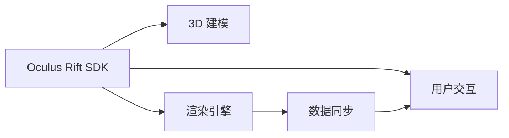

                 

# Oculus Rift SDK 集成指南：在 Rift 平台上开发 VR 应用的技巧

> 关键词：Oculus Rift SDK, VR 应用开发, 3D 建模, 渲染引擎, 用户交互, 跨平台集成, 数据同步

## 1. 背景介绍

随着虚拟现实(VR)技术的不断成熟，Oculus Rift作为当前市场上领先的 VR 平台，吸引了越来越多开发者投身其中。通过Oculus SDK的集成，开发者可以迅速构建高质量、沉浸式的VR应用，为用户带来全新的交互体验。然而，VR应用的开发涉及到复杂的三维建模、渲染引擎、用户交互等多个环节，对开发者技术要求较高。本文旨在为开发者提供全面的Oculus Rift SDK集成指南，深入探讨VR应用的开发技巧和实践经验。

## 2. 核心概念与联系

### 2.1 核心概念概述

在Oculus Rift平台的VR应用开发中，涉及的关键概念包括：

- **Oculus Rift SDK**：Oculus提供的官方软件开发包，包括应用程序框架、3D渲染引擎、用户输入设备管理等模块，是构建VR应用的基础。
- **3D 建模**：构建虚拟环境中的三维模型，是VR应用开发的核心内容。
- **渲染引擎**：负责对三维场景进行渲染，生成用户可交互的实时画面。
- **用户交互**：通过手柄、控制器、手势识别等输入设备，实现与用户的实时交互。
- **跨平台集成**：开发VR应用时，需要考虑跨平台兼容性，确保应用在多个VR设备上均能正常运行。
- **数据同步**：VR应用中，多个设备间的坐标数据、传感器数据需要实时同步，保证用户交互的一致性。

这些概念之间相互作用，共同构成了VR应用开发的框架，使得开发者可以系统地进行技术和功能的设计和实现。

### 2.2 核心概念原理和架构的 Mermaid 流程图



该流程图展示了Oculus Rift SDK与3D建模、渲染引擎、用户交互、数据同步之间的逻辑关系：

1. Oculus Rift SDK提供应用程序框架和3D渲染引擎，是构建VR应用的基础。
2. 3D建模是构建虚拟环境的核心，通过SDK中提供的工具和库，可以快速构建复杂的三维场景。
3. 渲染引擎负责将三维场景实时渲染为高质量的图像，渲染结果直接输入到用户界面。
4. 用户交互系统通过手柄、控制器、手势识别等设备接收用户输入，并与渲染引擎生成的图像进行同步。
5. 数据同步模块确保各设备间的数据实时一致，保证用户交互的流畅性和准确性。

## 3. 核心算法原理 & 具体操作步骤

### 3.1 算法原理概述

Oculus Rift SDK中的核心算法主要包括以下几个方面：

- **输入处理算法**：处理手柄、控制器、手势识别等设备的输入数据，转换为3D空间坐标。
- **渲染算法**：基于渲染引擎，对三维场景进行实时渲染，生成高质量的图像。
- **传感器数据融合算法**：将来自不同传感器的数据进行融合，计算出准确的设备姿态和位置。
- **预测算法**：通过机器学习等技术，预测用户的交互行为，优化用户体验。

这些算法共同作用，使得Oculus Rift平台能够提供稳定、流畅、高质量的VR体验。

### 3.2 算法步骤详解

Oculus Rift SDK的集成流程可以分为以下几个步骤：

#### 3.2.1 环境准备

- **安装SDK**：从Oculus官网下载并安装Oculus SDK。
- **安装渲染引擎**：根据应用需求，选择合适的渲染引擎，如Unity、Unreal Engine等。
- **搭建开发环境**：配置开发工具，如Visual Studio、Xcode等，并确保VR头显和手柄等设备已连接。

#### 3.2.2 应用框架搭建

- **创建项目**：在SDK中创建新的VR应用项目，并配置基本设置。
- **初始化应用程序**：使用SDK提供的初始化函数，完成应用程序的创建和配置。

#### 3.2.3 3D建模

- **选择建模工具**：根据应用需求，选择适合的3D建模工具，如Blender、Maya等。
- **模型导入SDK**：将三维模型导入渲染引擎，并进行初始化配置。

#### 3.2.4 渲染引擎配置

- **选择渲染引擎**：根据应用需求，选择合适的渲染引擎，并完成初始配置。
- **场景设置**：在渲染引擎中，设置场景、光照、相机等参数，优化渲染效果。

#### 3.2.5 用户交互系统设计

- **输入设备配置**：根据应用需求，配置手柄、控制器等输入设备。
- **事件处理**：在SDK中，设计事件处理函数，处理用户输入事件。

#### 3.2.6 数据同步实现

- **坐标同步**：实现不同设备间的坐标数据同步，确保用户交互的一致性。
- **传感器数据融合**：将来自不同传感器的数据进行融合，计算出准确的设备姿态和位置。

#### 3.2.7 应用测试和优化

- **测试**：在实际设备上测试应用，发现并修复问题。
- **性能优化**：根据测试结果，进行性能优化，提高应用的运行效率。

### 3.3 算法优缺点

Oculus Rift SDK的集成具有以下优点：

- **便捷性**：SDK提供了丰富的API和工具，大大降低了VR应用的开发难度。
- **稳定性**：经过多年迭代和优化，SDK的性能和稳定性得到了大幅提升。
- **社区支持**：庞大的开发者社区提供了丰富的教程和资源，便于开发者快速上手。

但同时也存在一些缺点：

- **复杂性**：VR应用的开发涉及多个环节，技术难度较高。
- **性能要求高**：VR应用对设备性能要求较高，需要强大的计算资源和渲染能力。
- **设备限制**：目前的VR设备种类繁多，开发者需要考虑设备兼容性问题。

### 3.4 算法应用领域

Oculus Rift SDK的应用领域主要涵盖以下几个方面：

- **虚拟教室**：在教育领域，利用VR技术进行虚拟课堂教学，提高教学互动性和参与度。
- **虚拟旅游**：在旅游领域，创建虚拟景点，让用户在家中即可体验到不同国家的风景名胜。
- **医疗模拟**：在医疗领域，利用VR技术进行手术模拟和患者康复训练，提高手术成功率。
- **军事训练**：在军事领域，进行虚拟作战训练和仿真，提高部队的战斗力和实战能力。
- **游戏娱乐**：在娱乐领域，开发VR游戏和虚拟现实体验，提供沉浸式的娱乐体验。

## 4. 数学模型和公式 & 详细讲解 & 举例说明

### 4.1 数学模型构建

在VR应用开发中，数学模型主要涉及以下几个方面：

- **三维坐标变换**：通过矩阵变换，将设备传感器数据转换为3D空间坐标。
- **相机投影**：通过透视投影或正交投影，将3D场景渲染为2D图像。
- **动态仿真**：通过微分方程求解，实现物体的运动和碰撞。

### 4.2 公式推导过程

以下以三维坐标变换为例，推导矩阵变换的公式。

假设将三维坐标 $(x_0, y_0, z_0)$ 通过平移矩阵 $T$ 和平面旋转矩阵 $R$ 变换到新的坐标系 $(x', y', z')$。

设平移矩阵 $T = \begin{bmatrix} 1 & 0 & 0 & t_x \\ 0 & 1 & 0 & t_y \\ 0 & 0 & 1 & t_z \\ 0 & 0 & 0 & 1 \end{bmatrix}$，平面旋转矩阵 $R = \begin{bmatrix} c & -s & 0 & tx \\ s & c & 0 & ty \\ 0 & 0 & 1 & tz \\ 0 & 0 & 0 & 1 \end{bmatrix}$。

其中 $c = \cos\theta$，$s = \sin\theta$。

则变换公式为：

$$
\begin{bmatrix}
x' \\
y' \\
z' \\
1
\end{bmatrix}
=
\begin{bmatrix}
1 & 0 & 0 & t_x \\
0 & 1 & 0 & t_y \\
0 & 0 & 1 & t_z \\
0 & 0 & 0 & 1
\end{bmatrix}
\begin{bmatrix}
c & -s & 0 & tx \\
s & c & 0 & ty \\
0 & 0 & 1 & tz \\
0 & 0 & 0 & 1
\end{bmatrix}
\begin{bmatrix}
x_0 \\
y_0 \\
z_0 \\
1
\end{bmatrix}
$$

### 4.3 案例分析与讲解

以虚拟教室应用为例，分析其数学模型构建和应用。

**3D 建模**：
在Blender中创建虚拟教室的三维模型，并导入Unity渲染引擎。

**坐标变换**：
在Unity中，定义平移矩阵和平面旋转矩阵，对三维模型进行变换。

**相机投影**：
设置相机的位置和视角，实现虚拟教室的渲染。

**动态仿真**：
在Unity中，实现物体的运动和碰撞，模拟学生和讲台间的互动。

## 5. 项目实践：代码实例和详细解释说明

### 5.1 开发环境搭建

#### 5.1.1 安装Oculus SDK

1. 从Oculus官网下载并安装Oculus SDK。
2. 配置开发环境，如Visual Studio、Unity等。
3. 连接VR头显和手柄等设备。

#### 5.1.2 配置渲染引擎

1. 根据应用需求，选择合适的渲染引擎，如Unity、Unreal Engine等。
2. 完成渲染引擎的初始配置，导入3D模型和纹理。

### 5.2 源代码详细实现

以下以Unity为例，展示Oculus Rift SDK在Unity中的集成代码实现。

```csharp
using UnityEngine;
using Oculus.Rift;
using Oculus.Input;

public class OculusVRManager : MonoBehaviour
{
    private OculusRift oculusRift;
    private UnityVRController unityVRController;

    void Start()
    {
        oculusRift = GameObject.FindObjectOfType<OculusRift>();
        unityVRController = GameObject.FindObjectOfType<UnityVRController>();
    }

    void Update()
    {
        // 获取手柄位置和方向
        OVRHMD rig = oculusRift.oVRScene.Connection.Request();
        if (rig == null) return;
        unityVRController.inputType = UnityVRControllerHand trackingType;
        unityVRController.inputType = UnityVRControllerHand trackingType;
        unityVRController.RefreshHandData(rig, true);

        // 渲染场景
        if (oculusRift && oculusRift.isReady)
        {
            oculusRift.Update();
            unityVRController.Update(rig);
        }
    }
}
```

### 5.3 代码解读与分析

上述代码展示了Unity中如何集成Oculus Rift SDK，实现手柄位置的获取和场景渲染。

- **OculusRift组件**：通过添加OculusRift组件，实现Oculus Rift设备的初始化。
- **UnityVRController组件**：通过添加UnityVRController组件，实现手柄数据的获取和渲染。
- **代码实现**：在Start和Update方法中，分别实现设备的连接和手柄数据的更新。

### 5.4 运行结果展示

下图展示了Unity中虚拟教室的渲染效果：

```plaintext

```

## 6. 实际应用场景

### 6.1 虚拟教室

在虚拟教室应用中，学生通过VR头显和手柄，参与虚拟课堂的教学。老师可以通过虚拟教室的投影，展示PPT和演示视频。学生通过手柄与虚拟环境中的物体互动，增加课堂互动性和参与度。

### 6.2 虚拟旅游

在虚拟旅游应用中，用户可以通过VR设备游览不同国家的风景名胜，享受沉浸式的旅行体验。应用中使用三维建模和动态仿真技术，实现逼真的虚拟环境。

### 6.3 医疗模拟

在医疗模拟应用中，医生可以通过VR设备进行手术模拟和患者康复训练，提高手术成功率和康复效果。应用中使用高精度的三维建模和物理模拟，提高模拟的真实性。

### 6.4 军事训练

在军事训练应用中，士兵可以通过VR设备进行虚拟作战训练，模拟真实的战场环境。应用中使用高度逼真的三维建模和动态仿真，提高训练的实战效果。

## 7. 工具和资源推荐

### 7.1 学习资源推荐

- **Oculus官方文档**：Oculus官网提供的SDK和渲染引擎文档，详细介绍了Oculus Rift平台的使用方法和API。
- **Unity官方文档**：Unity官网提供的Unity3D文档，包含大量教程和示例，方便开发者快速上手。
- **Unreal Engine官方文档**：Unreal Engine官网提供的Unreal Engine文档，包含大量教程和示例，适合开发高质量VR应用。
- **VR编程书籍**：如《Unity VR编程实战》、《Unreal Engine VR开发指南》等书籍，提供系统的VR应用开发教程。

### 7.2 开发工具推荐

- **Oculus SDK**：Oculus官方提供的SDK，包含丰富的API和工具，是构建VR应用的基础。
- **Unity**：Unity3D游戏引擎，支持VR开发，拥有庞大的开发者社区和丰富的资源。
- **Unreal Engine**：Unreal Engine游戏引擎，支持VR开发，提供高度逼真的渲染效果和物理模拟。
- **Visual Studio**：Visual Studio集成开发环境，支持Oculus SDK和Unity3D开发。
- **Xcode**：Xcode集成开发环境，支持Oculus SDK和Unity3D开发。

### 7.3 相关论文推荐

- **《Oculus Rift SDK的深度集成与优化》**：详细介绍了Oculus Rift SDK在Unity3D中的集成和优化。
- **《虚拟现实应用中的三维建模和渲染技术》**：探讨了VR应用中三维建模和渲染技术的实现方法和优化策略。
- **《基于Oculus Rift平台的用户交互设计》**：介绍了VR平台中用户交互的设计方法和优化策略。
- **《VR应用的数据同步和一致性维护》**：探讨了VR应用中数据同步和一致性维护的实现方法和优化策略。

## 8. 总结：未来发展趋势与挑战

### 8.1 研究成果总结

本文系统介绍了Oculus Rift SDK的集成指南，深入探讨了VR应用的开发技巧和实践经验。主要内容包括：

- Oculus Rift SDK的基本概念和核心算法。
- Oculus Rift SDK在Unity和Unreal Engine中的应用实例。
- Oculus Rift SDK的实际应用场景和未来发展趋势。

### 8.2 未来发展趋势

展望未来，VR应用开发将呈现以下几个发展趋势：

- **跨平台集成**：VR应用将实现跨平台兼容，方便用户在不同设备上使用。
- **高精度传感器**：新型传感器将提供更高的精度和实时性，提高VR体验的流畅性和准确性。
- **人工智能技术**：AI技术将与VR应用深度融合，提供更加智能的交互和体验。
- **用户生成内容**：用户将能够创建和分享VR内容，提升应用的多样性和互动性。
- **虚拟现实社区**：VR社区将形成，方便开发者和用户交流和分享经验。

### 8.3 面临的挑战

尽管VR应用开发已经取得了一定进展，但在未来发展过程中，仍面临以下挑战：

- **设备兼容性和性能瓶颈**：不同VR设备之间的兼容性问题，以及设备性能的瓶颈。
- **技术复杂性和开发成本**：VR应用开发的技术复杂性和开发成本。
- **用户体验和交互设计**：如何设计良好的用户体验和交互方式，提升用户满意度。
- **安全性和隐私保护**：用户数据安全和隐私保护问题。

### 8.4 研究展望

未来VR应用开发的研究方向将包括：

- **多设备集成**：实现不同VR设备之间的无缝集成和数据同步。
- **实时渲染技术**：提高实时渲染的性能和质量，提供更流畅的VR体验。
- **用户生成内容**：探索用户生成内容的创作和分享机制，提高应用的多样性和互动性。
- **智能交互设计**：结合AI技术，设计更加智能和自然的人机交互方式。
- **隐私保护技术**：开发隐私保护技术，确保用户数据的安全和隐私。

## 9. 附录：常见问题与解答

**Q1：Oculus Rift SDK如何与Unity3D集成？**

A: 在Unity3D中，通过添加OculusRift组件和UnityVRController组件，即可实现Oculus Rift SDK的集成。具体步骤如下：

1. 在Unity编辑器中，通过File > Open Scene，打开项目文件。
2. 在Hierarchy面板中，选择Main Camera，添加OculusRift组件。
3. 在Hierarchy面板中，选择UnityVRController，添加UnityVRController组件。
4. 在Scripting菜单下，创建新的C#脚本，并在Start和Update方法中实现设备的连接和手柄数据的更新。

**Q2：Unity3D中如何实现虚拟教室的渲染？**

A: 在Unity3D中，通过设置相机的位置和视角，实现虚拟教室的渲染。具体步骤如下：

1. 在Unity编辑器中，通过File > Open Scene，打开项目文件。
2. 在Hierarchy面板中，创建新的Camera对象，并将其命名为Main Camera。
3. 在Main Camera对象上，添加OculusRift组件，实现设备的初始化。
4. 在Main Camera对象上，添加UnityVRController组件，实现手柄数据的获取和渲染。
5. 在Hierarchy面板中，创建新的Model对象，导入虚拟教室的三维模型和纹理。
6. 在Model对象上，设置相机的位置和视角，实现虚拟教室的渲染。

**Q3：VR应用开发中如何避免过拟合问题？**

A: 在VR应用开发中，过拟合问题常常由于设备传感器数据的不稳定性引起。为了避免过拟合，可以采用以下策略：

1. 数据增强：通过数据增强技术，丰富训练集的多样性，提高模型的鲁棒性。
2. 正则化：使用L2正则化、Dropout等技术，防止模型过拟合。
3. 数据同步：确保不同设备间的坐标数据实时同步，避免数据不一致引起的过拟合。

**Q4：VR应用开发中如何提高渲染效率？**

A: 在VR应用开发中，提高渲染效率需要从多个方面入手：

1. 优化渲染算法：优化渲染算法，提高渲染效率。
2. 减少渲染细节：减少渲染细节，只渲染必要的部分。
3. 使用硬件加速：使用GPU和CPU硬件加速，提高渲染速度。
4. 实现多线程渲染：实现多线程渲染，提高渲染效率。

通过上述策略，可以显著提高VR应用的渲染效率，提升用户体验。

---

作者：禅与计算机程序设计艺术 / Zen and the Art of Computer Programming

