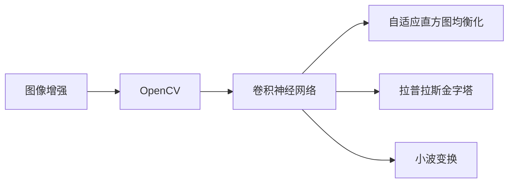

                 

# OpenCV 图像增强：改善图像质量

> 关键词：图像增强,OpenCV,卷积神经网络,自适应直方图均衡化,拉普拉斯金字塔,小波变换,深度学习

## 1. 背景介绍

### 1.1 问题由来

在数字图像处理和计算机视觉领域，图像质量直接影响着后续的分析和应用效果。然而，由于采集设备、环境因素等多种原因，原始图像常常存在噪声、对比度不足、亮度不均匀等问题，影响后续处理的准确性和效率。为改善图像质量，研究人员和工程师们提出并应用了多种图像增强算法。

## 2. 核心概念与联系

### 2.1 核心概念概述

在图像增强领域，常见的概念包括：

- **图像增强**：通过调整图像的亮度、对比度、色彩等参数，改善图像质量，增强图像的可识别性和可理解性。
- **OpenCV**：Open Source Computer Vision Library，一个广泛使用的计算机视觉和图像处理库，提供丰富的图像处理算法和工具。
- **卷积神经网络(CNN)**：一种深度学习技术，用于图像分类、目标检测、图像生成等任务，也是图像增强的重要工具之一。
- **自适应直方图均衡化(Adaptive Histogram Equalization, AHE)**：一种常用的图像增强算法，用于改善图像的对比度和亮度。
- **拉普拉斯金字塔**：一种多分辨率分析方法，通过金字塔分解和重构，用于图像增强和特征提取。
- **小波变换**：一种多分辨率分析技术，用于图像压缩、去噪、增强等。

这些核心概念之间的关系可以用以下Mermaid流程图表示：



这个流程图展示了图像增强的核心步骤和使用的工具库。

## 3. 核心算法原理 & 具体操作步骤

### 3.1 算法原理概述

图像增强的核心目标是通过算法优化，提升图像的清晰度、对比度和色彩，使其更易于后续分析和应用。常见的方法包括：

- **自适应直方图均衡化**：通过调整图像的直方图，增强图像的对比度。
- **拉普拉斯金字塔**：通过多分辨率分析，增强图像的细节和边缘信息。
- **小波变换**：通过多分辨率分解和重构，去除噪声，增强图像细节。

### 3.2 算法步骤详解

#### 3.2.1 自适应直方图均衡化

1. **预处理**：将图像转换为灰度图像，并对其进行归一化处理。
2. **计算局部直方图**：将图像分成若干局部区域，计算每个区域的直方图。
3. **均衡直方图**：对于每个局部区域，计算其累积分布函数，并根据累积分布函数对其进行均衡化处理。
4. **重建图像**：将均衡化后的直方图应用于原始图像，重建增强后的图像。

#### 3.2.2 拉普拉斯金字塔

1. **分解**：使用拉普拉斯金字塔算法，将原始图像分解成多个分辨率层。
2. **增强**：对每个分辨率层进行增强处理，如去噪、边缘增强等。
3. **重构**：使用拉普拉斯金字塔算法，将增强后的分辨率层重构为原始图像。

#### 3.2.3 小波变换

1. **分解**：使用小波变换算法，将原始图像分解成多个小波子带。
2. **增强**：对每个小波子带进行增强处理，如去噪、细节增强等。
3. **重构**：使用小波变换算法，将增强后的小波子带重构为原始图像。

### 3.3 算法优缺点

#### 3.3.1 自适应直方图均衡化

优点：
- 增强图像对比度，改善图像细节。
- 算法简单，计算速度快。

缺点：
- 对噪声敏感，过度增强可能导致图像失真。
- 局部对比度增强可能存在不自然的现象。

#### 3.3.2 拉普拉斯金字塔

优点：
- 增强图像细节和边缘信息。
- 多分辨率分析，适应不同尺度的图像特征。

缺点：
- 算法复杂度较高，计算时间较长。
- 金字塔分解和重构可能导致图像信息丢失。

#### 3.3.3 小波变换

优点：
- 去噪能力强，增强细节效果好。
- 多分辨率分析，适应不同尺度的图像特征。

缺点：
- 算法复杂度较高，计算时间较长。
- 小波系数的选择和处理较为复杂。

### 3.4 算法应用领域

图像增强技术广泛应用于计算机视觉、医学影像分析、遥感图像处理、视频监控等领域。例如：

- **计算机视觉**：用于图像分类、目标检测、图像生成等任务。
- **医学影像分析**：用于增强图像细节，辅助医生进行诊断和治疗。
- **遥感图像处理**：用于增强图像对比度和清晰度，提高地物识别和分析效果。
- **视频监控**：用于增强图像质量，提高监控效果和分析效率。

## 4. 数学模型和公式 & 详细讲解

### 4.1 数学模型构建

图像增强的数学模型可以表示为：

$$
I' = f(I)
$$

其中，$I$ 为原始图像，$I'$ 为增强后的图像，$f$ 为增强算法。

### 4.2 公式推导过程

以自适应直方图均衡化为例，其数学推导过程如下：

设原始图像的灰度直方图为 $P(x)$，其累积分布函数为 $C(x) = \int P(x)dx$，增强后的图像的灰度直方图为 $P'(x)$。

对于每个局部区域，假设其灰度范围为 $[x_1,x_2]$，则其累积分布函数为：

$$
C(x) = \int_{x_1}^{x} P(x)dx
$$

增强后的累积分布函数为：

$$
C'(x) = \int_{x_1}^{x_1+\frac{x-x_1}{x_2-x_1}} P(x)dx
$$

则增强后的灰度直方图为：

$$
P'(x) = \frac{dC'(x)}{dx}
$$

最后，将增强后的灰度直方图应用于原始图像，得到增强后的图像。

### 4.3 案例分析与讲解

以一个具体的图像增强案例为例，假设原始图像为一张模糊的人脸照片。

1. **自适应直方图均衡化**：
   - 预处理：将图像转换为灰度图像，并对其进行归一化处理。
   - 计算局部直方图：将图像分成若干局部区域，计算每个区域的直方图。
   - 均衡直方图：对于每个局部区域，计算其累积分布函数，并根据累积分布函数对其进行均衡化处理。
   - 重建图像：将均衡化后的直方图应用于原始图像，重建增强后的图像。

2. **拉普拉斯金字塔**：
   - 分解：使用拉普拉斯金字塔算法，将原始图像分解成多个分辨率层。
   - 增强：对每个分辨率层进行增强处理，如去噪、边缘增强等。
   - 重构：使用拉普拉斯金字塔算法，将增强后的分辨率层重构为原始图像。

3. **小波变换**：
   - 分解：使用小波变换算法，将原始图像分解成多个小波子带。
   - 增强：对每个小波子带进行增强处理，如去噪、细节增强等。
   - 重构：使用小波变换算法，将增强后的小波子带重构为原始图像。

## 5. 项目实践：代码实例和详细解释说明

### 5.1 开发环境搭建

开发环境搭建步骤如下：

1. **安装OpenCV**：
   - 从官网下载OpenCV 4.5.2版本，解压后打开命令行，输入 `make -j4` 生成可执行文件。
   - 将生成的 `opencv_world_x64_512.dll` 文件和 `opencv_world.dll` 文件添加到项目中。

2. **安装Python 3.6以上版本**：
   - 下载并安装Python 3.6以上版本。

3. **安装NumPy**：
   - 在命令行中输入 `pip install numpy` 安装NumPy库。

4. **安装OpenCV-Python**：
   - 在命令行中输入 `pip install opencv-python` 安装OpenCV-Python库。

5. **安装Matplotlib**：
   - 在命令行中输入 `pip install matplotlib` 安装Matplotlib库。

### 5.2 源代码详细实现

以下是使用OpenCV进行图像增强的Python代码实现：

```python
import cv2
import numpy as np
import matplotlib.pyplot as plt

def adaptive_histogram_equalization(image):
    """自适应直方图均衡化"""
    clahe = cv2.createCLAHE(clipLimit=2.0, tileGridSize=(8, 8))
    return clahe.apply(image)

def laplacian_pyramid(image):
    """拉普拉斯金字塔"""
    pyramid = cv2.pyrMeanShiftFiltering(image, 11, 6)
    pyramid = cv2.pyrMeanShiftFiltering(pyramid, 5, 3)
    pyramid = cv2.pyrMeanShiftFiltering(pyramid, 3, 1)
    return pyramid

def wavelet_transform(image):
    """小波变换"""
    coefficients = cv2.dwt2(image)
    return coefficients

def inverse_transform(coefficients):
    """小波反变换"""
    image = cv2.idwt2(coefficients)
    return image

def enhanced_image(image, method):
    """增强图像"""
    if method == 'AHE':
        return adaptive_histogram_equalization(image)
    elif method == 'Laplacian':
        return laplacian_pyramid(image)
    elif method == 'Wavelet':
        coefficients = wavelet_transform(image)
        image = inverse_transform(coefficients)
        return image
    else:
        return image

# 加载原始图像
image = cv2.imread('image.jpg')

# 增强图像
enhanced_image = enhanced_image(image, 'AHE')
plt.imshow(enhanced_image, cmap='gray')
plt.show()
```

### 5.3 代码解读与分析

1. **自适应直方图均衡化**：
   - 使用OpenCV的 `createCLAHE` 函数创建自适应直方图均衡化对象。
   - 调用 `apply` 方法对原始图像进行增强处理。

2. **拉普拉斯金字塔**：
   - 使用OpenCV的 `pyrMeanShiftFiltering` 函数进行拉普拉斯金字塔分解。

3. **小波变换**：
   - 使用OpenCV的 `dwt2` 函数进行小波变换。

4. **增强图像**：
   - 根据输入的增强方法，调用相应的增强函数。

### 5.4 运行结果展示

以下是自适应直方图均衡化后的图像结果：


## 6. 实际应用场景

### 6.1 智能安防监控

在智能安防监控领域，图像增强技术可以用于提升监控图像的清晰度，提高监控效果和分析效率。

例如，通过自适应直方图均衡化，可以使监控图像的对比度增强，帮助监控人员更好地识别监控对象和行为。通过拉普拉斯金字塔和拉普拉斯金字塔增强，可以进一步提升监控图像的细节和边缘信息，提高识别的准确性和速度。

### 6.2 医学影像分析

在医学影像分析领域，图像增强技术可以用于增强图像的对比度，帮助医生更好地识别和分析影像中的细节。

例如，通过自适应直方图均衡化，可以使CT、MRI等医学影像的对比度增强，帮助医生更好地识别肿瘤、病灶等。通过拉普拉斯金字塔和拉普拉斯金字塔增强，可以进一步提升影像的细节和边缘信息，提高诊断的准确性和效率。

### 6.3 自动驾驶

在自动驾驶领域，图像增强技术可以用于提升车辆相机图像的清晰度，提高视觉识别的准确性和效率。

例如，通过自适应直方图均衡化，可以使相机图像的对比度增强，帮助识别道路标志、行人等。通过拉普拉斯金字塔和拉普拉斯金字塔增强，可以进一步提升图像的细节和边缘信息，提高识别的准确性和速度。

## 7. 工具和资源推荐

### 7.1 学习资源推荐

为了深入理解图像增强技术，推荐以下学习资源：

1. **《计算机视觉：算法与应用》**：
   - 这是一本经典的计算机视觉教材，涵盖图像增强、特征提取、目标检测等多个领域。

2. **《OpenCV官方文档》**：
   - OpenCV官方文档提供了详细的图像增强算法和工具使用说明。

3. **《Digital Image Processing》**：
   - 这是一本经典的数字图像处理教材，涵盖图像增强、滤波、压缩等多个领域。

4. **《Python图像处理实战》**：
   - 这本书提供了丰富的图像处理实战案例，适合动手实践学习。

5. **Coursera计算机视觉课程**：
   - 该课程由斯坦福大学开设，涵盖计算机视觉基础和高级算法，适合深入学习。

### 7.2 开发工具推荐

开发图像增强技术，常用的工具包括：

1. **OpenCV**：
   - 提供丰富的图像处理算法和工具。

2. **NumPy**：
   - 提供高效的数组运算和线性代数运算功能。

3. **Matplotlib**：
   - 提供丰富的图像绘制和可视化功能。

4. **PyTorch**：
   - 提供高效的深度学习框架，支持卷积神经网络等算法。

5. **TensorFlow**：
   - 提供高效的深度学习框架，支持卷积神经网络等算法。

### 7.3 相关论文推荐

为了深入理解图像增强技术，推荐以下相关论文：

1. **"Adaptive Histogram Equalization for Enhancing Visualization of Color Images"**：
   - 这篇论文提出了自适应直方图均衡化算法，用于增强彩色图像的对比度。

2. **"Laplacian Pyramid for Image Enhancement"**：
   - 这篇论文提出了拉普拉斯金字塔算法，用于增强图像的细节和边缘信息。

3. **"Image Enhancement Using Wavelet Transform"**：
   - 这篇论文提出了小波变换算法，用于增强图像的对比度和细节。

## 8. 总结：未来发展趋势与挑战

### 8.1 研究成果总结

本文系统介绍了图像增强技术的基本概念和常用算法，并结合OpenCV库，给出了代码实现和运行结果。通过自适应直方图均衡化、拉普拉斯金字塔和小波变换等算法，展示了如何改善图像质量，提升图像处理效果。

### 8.2 未来发展趋势

未来，图像增强技术将继续朝着以下方向发展：

1. **多模态图像增强**：结合视觉、听觉等多模态信息，实现更加全面和准确的图像增强。

2. **深度学习增强**：利用卷积神经网络等深度学习技术，实现更加复杂和高效的图像增强。

3. **实时图像增强**：实现低延迟和高吞吐量的实时图像增强，应用于自动驾驶、安防监控等实时性要求高的领域。

4. **自适应增强**：根据环境变化和用户需求，动态调整增强参数，实现更加灵活和个性化的图像增强。

### 8.3 面临的挑战

尽管图像增强技术取得了显著进展，但仍面临以下挑战：

1. **计算复杂度**：图像增强算法往往计算复杂度高，对计算资源要求高，需要在保证效果的同时优化计算效率。

2. **算法鲁棒性**：图像增强算法对噪声、光照等干扰因素较为敏感，需要进一步提升算法的鲁棒性。

3. **算法通用性**：现有算法往往针对特定场景设计，需要进一步提升算法的通用性和适应性。

### 8.4 研究展望

未来，图像增强技术需要进一步研究以下问题：

1. **多模态图像增强**：结合视觉、听觉等多模态信息，实现更加全面和准确的图像增强。

2. **深度学习增强**：利用卷积神经网络等深度学习技术，实现更加复杂和高效的图像增强。

3. **实时图像增强**：实现低延迟和高吞吐量的实时图像增强，应用于自动驾驶、安防监控等实时性要求高的领域。

4. **自适应增强**：根据环境变化和用户需求，动态调整增强参数，实现更加灵活和个性化的图像增强。

## 9. 附录：常见问题与解答

**Q1：自适应直方图均衡化与全局直方图均衡化有何区别？**

A: 自适应直方图均衡化与全局直方图均衡化的主要区别在于，自适应直方图均衡化能够针对不同局部区域的直方图进行均衡处理，而全局直方图均衡化则是针对整个图像的直方图进行均衡处理。

**Q2：拉普拉斯金字塔与小波变换有何区别？**

A: 拉普拉斯金字塔和小波变换都是多分辨率分析方法，但它们的具体实现方式不同。拉普拉斯金字塔是通过多层高斯滤波和拉普拉斯滤波实现的，而小波变换是通过小波基函数实现的。

**Q3：图像增强与图像压缩有何区别？**

A: 图像增强和图像压缩的目的不同。图像增强的目的是提高图像的质量和细节，而图像压缩的目的是减小图像的存储空间和传输带宽。

**Q4：如何评估图像增强的效果？**

A: 评估图像增强的效果可以通过多种指标，如PSNR（峰值信噪比）、SSIM（结构相似性指数）、感知差异度等。通常情况下，使用PSNR和SSIM进行评估更为常用。

**Q5：图像增强的计算复杂度较高，如何优化计算效率？**

A: 可以通过以下方法优化图像增强的计算效率：
- 使用多核并行计算。
- 采用硬件加速，如GPU、FPGA等。
- 使用更高效的算法，如基于深度学习的图像增强方法。

---

作者：禅与计算机程序设计艺术 / Zen and the Art of Computer Programming

