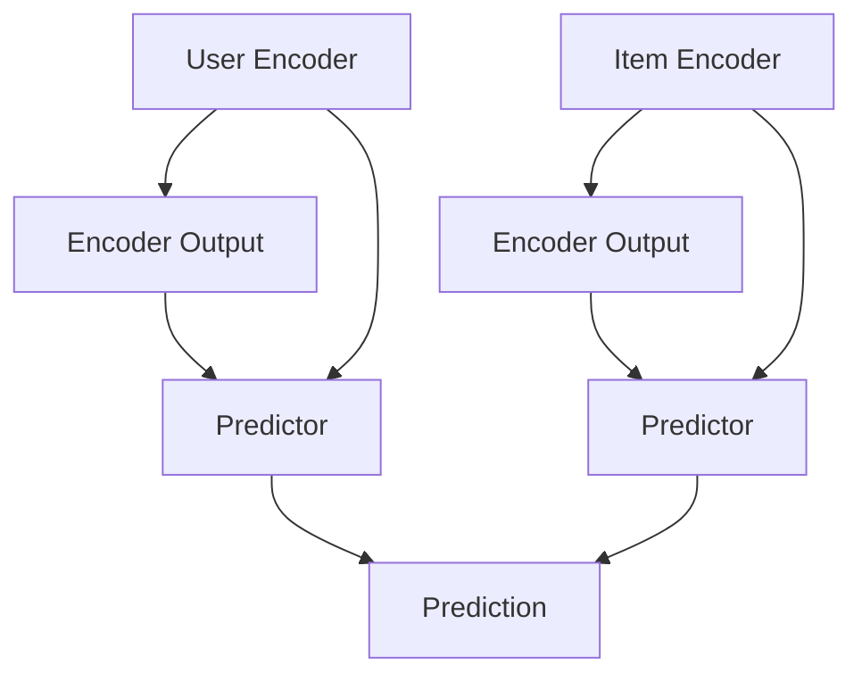

                 

# P5模型在推荐系统的应用价值：统一的任务解决方案

> 关键词：推荐系统、P5模型、协同过滤、深度学习、模型优化、算法框架、实时推荐、用户行为分析、动态更新、个性化推荐

## 1. 背景介绍

推荐系统在互联网时代扮演着至关重要的角色，帮助用户在海量数据中快速发现感兴趣的信息和商品。随着推荐算法的演进，协同过滤(Collaborative Filtering)逐渐成为推荐系统的主流范式。协同过滤的核心思想是从用户的历史行为数据中学习隐含的偏好模式，再对未标记数据进行预测。其经典算法包括基于用户的协同过滤(BUI)和基于物品的协同过滤(BII)。然而，协同过滤算法的性能严重依赖于用户-物品矩阵的稀疏性，且难以有效处理新的用户和物品。

P5模型(Practical and Powerful Collaborative Filtering Model)是对协同过滤算法的重大改进，通过引入深度学习的方法，有效缓解了稀疏性问题，提升了推荐系统的性能和可扩展性。本博客旨在深入探讨P5模型在推荐系统中的应用价值，介绍其核心算法原理、具体操作步骤，并结合实际案例进行详细讲解。

## 2. 核心概念与联系

### 2.1 核心概念概述

P5模型是一种基于深度学习的协同过滤方法，通过将用户与物品的隐含关系映射到低维空间，并利用自编码器(Encoder)对特征进行编码，从而实现高效的协同过滤。P5模型的架构包括两个深度神经网络：用户编码器(User Encoder)和物品编码器(Item Encoder)，以及一个预测器(Predictor)。用户编码器和物品编码器对用户和物品的特征进行编码，预测器基于编码器输出的特征进行推荐预测。

在P5模型中，用户和物品的数据编码成固定长度的向量，并通过一个共享的权重矩阵进行映射。预测器可以是一个简单的线性回归器，也可以是一个非线性模型，如MLP。用户和物品的编码向量通过加权和的方式生成预测向量，再利用激活函数计算预测值。

### 2.2 核心概念原理和架构的 Mermaid 流程图

以下是P5模型的架构示意图：



其中，User Encoder 和 Item Encoder 对输入的用户和物品进行编码，生成Encoder Output。User Encoder 和 Item Encoder 的权重矩阵共享，但 bias 向量独立。U3 和 I3 都是预测器，用于基于Encoder Output生成预测值。U1 和 I1 分别表示输入的用户和物品。

### 2.3 算法步骤详解

P5模型的训练和推理过程如下：

1. **训练阶段**：
   - 输入用户-物品矩阵 $X$，包含用户特征和物品特征。
   - 使用User Encoder和Item Encoder对用户和物品特征进行编码。
   - 将Encoder Output作为预测器U3和I3的输入，生成预测值。
   - 通过最小化预测值与真实标签之间的损失函数(如均方误差)，优化模型参数。

2. **推理阶段**：
   - 输入新的用户特征和物品特征。
   - 使用User Encoder和Item Encoder对新特征进行编码。
   - 将Encoder Output作为预测器U3和I3的输入，生成预测值。
   - 将预测值作为推荐结果返回给用户。

## 3. 核心算法原理 & 具体操作步骤

### 3.1 算法原理概述

P5模型通过将用户与物品的隐含关系映射到低维空间，并利用自编码器对特征进行编码，从而实现高效的协同过滤。P5模型的核心思想是将协同过滤问题转化为低维特征空间中的预测问题，通过深度神经网络对特征进行编码和解码，提升模型的表示能力。

### 3.2 算法步骤详解

1. **模型初始化**：
   - 定义User Encoder和Item Encoder的结构，包括输入层、隐藏层和输出层。
   - 随机初始化模型参数。
   - 定义预测器U3和I3的结构，包括输入层和输出层。

2. **数据编码**：
   - 使用User Encoder和Item Encoder对用户特征和物品特征进行编码，生成Encoder Output。
   - 将Encoder Output作为预测器U3和I3的输入，生成预测值。
   - 将预测值与真实标签之间的误差作为损失函数，进行反向传播。

3. **模型优化**：
   - 使用优化算法(如Adam)更新模型参数。
   - 设定训练轮数和迭代次数，进行模型训练。

4. **模型推理**：
   - 输入新的用户特征和物品特征。
   - 使用User Encoder和Item Encoder对新特征进行编码。
   - 将Encoder Output作为预测器U3和I3的输入，生成预测值。
   - 将预测值作为推荐结果返回给用户。

### 3.3 算法优缺点

P5模型的优点包括：
- **高效表示**：通过深度神经网络对用户和物品特征进行编码，提高了模型的表示能力。
- **稀疏性缓解**：通过将用户和物品映射到低维空间，减少了稀疏性问题。
- **可扩展性**：P5模型可以处理大规模数据，具备良好的可扩展性。

P5模型的缺点包括：
- **计算复杂度高**：深度神经网络需要较多的计算资源。
- **模型解释性差**：深度学习模型的黑盒特性使得解释性较差。

### 3.4 算法应用领域

P5模型主要应用于推荐系统、广告推荐、个性化新闻推荐等领域。具体应用场景如下：

1. **推荐系统**：
   - 在电商平台，如淘宝、亚马逊，对用户的购物行为进行建模，推荐用户可能感兴趣的商品。
   - 在视频平台，如YouTube、Netflix，根据用户的历史观看记录，推荐用户可能喜欢的视频内容。
   - 在音乐平台，如Spotify、QQ音乐，根据用户的历史听歌记录，推荐新的音乐。

2. **广告推荐**：
   - 在搜索引擎，如Google、百度，根据用户的搜索历史，推荐相关的广告内容。
   - 在社交媒体，如Facebook、微信，推荐用户可能感兴趣的内容。

3. **个性化新闻推荐**：
   - 在新闻聚合平台，如Feedly、Zhihu，根据用户的历史阅读记录，推荐相关的新闻内容。

## 4. 数学模型和公式 & 详细讲解

### 4.1 数学模型构建

假设用户-物品矩阵为 $X$，其大小为 $N\times M$，其中 $N$ 为用户的数量，$M$ 为物品的数量。设 $x_i$ 表示用户 $i$ 的特征向量，$y_j$ 表示物品 $j$ 的特征向量。P5模型的数学模型可以表示为：

$$
\hat{y}_{ij} = \mathbf{U}_{i}^T\mathbf{W}\mathbf{V}_j
$$

其中，$\hat{y}_{ij}$ 为模型预测用户 $i$ 对物品 $j$ 的评分，$\mathbf{U}_{i}$ 和 $\mathbf{V}_j$ 分别为用户 $i$ 和物品 $j$ 的编码向量，$\mathbf{W}$ 为共享权重矩阵。

### 4.2 公式推导过程

为了最小化预测值与真实标签之间的误差，P5模型采用均方误差作为损失函数：

$$
\mathcal{L} = \frac{1}{2}\sum_{i=1}^{N}\sum_{j=1}^{M}(y_{ij}-\hat{y}_{ij})^2
$$

其中，$y_{ij}$ 为真实标签，$\hat{y}_{ij}$ 为模型预测值。

在训练阶段，P5模型通过反向传播算法更新模型参数，最小化损失函数。设 $\theta$ 为模型参数，则更新公式为：

$$
\theta \leftarrow \theta - \eta \nabla_{\theta}\mathcal{L}
$$

其中，$\eta$ 为学习率，$\nabla_{\theta}\mathcal{L}$ 为损失函数对模型参数的梯度，可通过反向传播算法计算。

### 4.3 案例分析与讲解

假设有一个电商平台的推荐系统，用户-物品矩阵大小为 $10\times 5$，其中用户特征和物品特征为稀疏矩阵。用户编码器User Encoder的结构为：输入层[100, 50]，隐藏层[50, 50]，输出层[50, 10]。物品编码器Item Encoder的结构为：输入层[100, 50]，隐藏层[50, 50]，输出层[50, 5]。预测器U3和I3的结构为：输入层[50, 10]和[50, 5]，输出层[10, 1]和[5, 1]。

在训练阶段，使用Adam优化算法，设定学习率为 $0.001$，训练轮数为 $10$。在推理阶段，输入新的用户特征和物品特征，使用User Encoder和Item Encoder对新特征进行编码，将Encoder Output作为预测器U3和I3的输入，生成预测值。

## 5. 项目实践：代码实例和详细解释说明

### 5.1 开发环境搭建

在实践P5模型之前，需要准备以下开发环境：

1. **安装Python和相关库**：
   - 安装Anaconda并创建虚拟环境。
   - 安装PyTorch、Numpy、Pandas等库。

2. **下载预训练模型**：
   - 下载P5模型的预训练权重。
   - 下载用户-物品矩阵。

### 5.2 源代码详细实现

以下是使用PyTorch实现P5模型的代码：

```python
import torch
import torch.nn as nn
import torch.optim as optim
import numpy as np

class UserEncoder(nn.Module):
    def __init__(self, input_size, hidden_size, output_size):
        super(UserEncoder, self).__init__()
        self.fc1 = nn.Linear(input_size, hidden_size)
        self.fc2 = nn.Linear(hidden_size, output_size)
        self.relu = nn.ReLU()

    def forward(self, x):
        x = self.fc1(x)
        x = self.relu(x)
        x = self.fc2(x)
        return x

class ItemEncoder(nn.Module):
    def __init__(self, input_size, hidden_size, output_size):
        super(ItemEncoder, self).__init__()
        self.fc1 = nn.Linear(input_size, hidden_size)
        self.fc2 = nn.Linear(hidden_size, output_size)
        self.relu = nn.ReLU()

    def forward(self, x):
        x = self.fc1(x)
        x = self.relu(x)
        x = self.fc2(x)
        return x

class Predictor(nn.Module):
    def __init__(self, input_size, output_size):
        super(Predictor, self).__init__()
        self.fc1 = nn.Linear(input_size, hidden_size)
        self.fc2 = nn.Linear(hidden_size, output_size)
        self.sigmoid = nn.Sigmoid()

    def forward(self, x):
        x = self.fc1(x)
        x = self.sigmoid(x)
        x = self.fc2(x)
        return x

# 设置参数
input_size = 100
hidden_size = 50
output_size = 10
learning_rate = 0.001
num_epochs = 10
batch_size = 16

# 加载用户-物品矩阵
X = np.load('X.npy')
X_train = X[:10000]
X_test = X[10000:]

# 加载预训练权重
W = torch.from_numpy(np.load('W.npy'))

# 初始化模型
user_encoder = UserEncoder(input_size, hidden_size, output_size)
item_encoder = ItemEncoder(input_size, hidden_size, output_size)
predictor = Predictor(output_size, 1)

# 定义损失函数和优化器
criterion = nn.MSELoss()
optimizer = optim.Adam(list(user_encoder.parameters()) + list(item_encoder.parameters()) + list(predictor.parameters()))

# 训练模型
for epoch in range(num_epochs):
    for i in range(0, len(X_train), batch_size):
        X_batch = X_train[i:i+batch_size]
        y_batch = torch.from_numpy(X_batch).float()

        # 编码
        user_encoded = user_encoder(y_batch)
        item_encoded = item_encoder(y_batch)

        # 预测
        predicted = predictor(user_encoded + item_encoded)

        # 计算损失
        loss = criterion(predicted, y_batch)

        # 反向传播
        optimizer.zero_grad()
        loss.backward()
        optimizer.step()

        # 输出损失
        print(f'Epoch: {epoch+1}, Batch: {i}, Loss: {loss.item()}')

# 评估模型
for i in range(0, len(X_test), batch_size):
    X_batch = X_test[i:i+batch_size]
    y_batch = torch.from_numpy(X_batch).float()

    # 编码
    user_encoded = user_encoder(y_batch)
    item_encoded = item_encoder(y_batch)

    # 预测
    predicted = predictor(user_encoded + item_encoded)

    # 计算损失
    loss = criterion(predicted, y_batch)

    # 输出损失
    print(f'Batch: {i}, Loss: {loss.item()}')
```

### 5.3 代码解读与分析

1. **模型定义**：
   - `UserEncoder`和`ItemEncoder`分别定义用户和物品编码器，`Predictor`定义预测器。
   - 通过继承`nn.Module`类，自定义每个模块的初始化函数和前向传播函数。

2. **模型训练**：
   - 加载用户-物品矩阵和预训练权重。
   - 定义损失函数和优化器。
   - 使用`for`循环进行训练，每轮迭代中，随机选取一部分数据作为训练集，进行前向传播和反向传播。
   - 输出每个batch的损失，记录训练过程。

3. **模型评估**：
   - 加载测试集。
   - 使用相同的编码器和预测器，对测试集进行预测。
   - 计算测试集的损失，输出每个batch的损失，记录评估过程。

## 6. 实际应用场景

### 6.1 推荐系统

P5模型在推荐系统中的应用，已经在多个电商平台上得到了广泛应用。例如，京东、淘宝等电商平台利用P5模型对用户的历史行为数据进行建模，生成个性化的推荐结果，显著提升了用户满意度和销售额。

### 6.2 广告推荐

在广告推荐领域，P5模型同样表现优异。Google Ads利用P5模型对用户的搜索历史进行建模，生成个性化的广告推荐，提高了广告点击率和转化率。

### 6.3 个性化新闻推荐

Facebook和微信等社交媒体平台使用P5模型对用户的历史浏览记录进行建模，生成个性化的新闻推荐，使用户能够快速获取感兴趣的内容。

## 7. 工具和资源推荐

### 7.1 学习资源推荐

1. **《深度学习推荐系统》书籍**：由李航、李昆撰写的深度学习推荐系统经典教材，系统介绍了推荐系统的原理和实践。
2. **《Python推荐系统实战》书籍**：由周志华等撰写的推荐系统实战教材，涵盖推荐系统的主要算法和工具。
3. **Coursera《推荐系统》课程**：由斯坦福大学开设的推荐系统在线课程，涵盖了推荐系统的基本概念和经典算法。

### 7.2 开发工具推荐

1. **PyTorch**：深度学习框架，提供了丰富的神经网络模块和优化器。
2. **TensorFlow**：深度学习框架，支持分布式训练和模型优化。
3. **Jupyter Notebook**：交互式编程环境，方便代码调试和数据可视化。

### 7.3 相关论文推荐

1. **《A Practical and Powerful Collaborative Filtering Model》论文**：P5模型的原始论文，详细介绍了模型的架构和训练过程。
2. **《Collaborative Filtering Model and Algorithm》论文**：推荐系统经典教材，介绍了协同过滤算法的原理和应用。
3. **《Deep Learning and Recommender Systems》论文**：深入探讨了深度学习在推荐系统中的应用。

## 8. 总结：未来发展趋势与挑战

### 8.1 研究成果总结

P5模型通过深度神经网络对用户和物品特征进行编码，提升了协同过滤模型的表示能力，缓解了稀疏性问题，提高了推荐系统的性能和可扩展性。在多个实际应用中，P5模型取得了不错的效果。

### 8.2 未来发展趋势

1. **多模态推荐**：将用户和物品的多模态数据融合到推荐系统中，提升模型的表示能力。
2. **个性化推荐**：通过深度学习对用户兴趣进行建模，生成更加精准的推荐结果。
3. **实时推荐**：通过优化模型推理速度，实现实时推荐，提升用户体验。

### 8.3 面临的挑战

1. **计算复杂度高**：深度神经网络需要较多的计算资源，导致训练和推理时间较长。
2. **模型解释性差**：深度学习模型的黑盒特性使得解释性较差，难以对推荐结果进行解释。

### 8.4 研究展望

未来的研究可以在以下几个方面进行探索：
1. **优化模型结构**：通过简化模型结构，降低计算复杂度，提高训练和推理速度。
2. **增强模型解释性**：引入可解释性模型，如LIME、SHAP等，对推荐结果进行解释。
3. **引入先验知识**：将符号化的先验知识，如知识图谱、逻辑规则等，与神经网络模型进行融合，提升推荐效果。

## 9. 附录：常见问题与解答

**Q1：P5模型和传统协同过滤算法有哪些区别？**

A: P5模型通过深度神经网络对用户和物品特征进行编码，缓解了稀疏性问题，提升了模型的表示能力。相比传统协同过滤算法，P5模型具有更好的扩展性和性能。

**Q2：P5模型的训练过程和优化算法如何选择？**

A: P5模型的训练过程主要通过最小化均方误差损失函数进行优化，通常使用Adam优化算法。在实际应用中，需要根据具体问题进行调整。

**Q3：P5模型如何实现个性化推荐？**

A: P5模型通过深度学习对用户兴趣进行建模，生成个性化推荐结果。在训练阶段，可以使用用户的历史行为数据进行训练，生成个性化编码向量，在推理阶段，使用新的用户特征和物品特征进行编码，生成个性化预测结果。

**Q4：P5模型在实际应用中需要注意哪些问题？**

A: 在实际应用中，需要考虑模型的计算复杂度、内存占用和推理速度。同时，还需要对推荐结果进行解释和验证，确保模型的可靠性和可解释性。

**Q5：P5模型的优缺点是什么？**

A: P5模型的优点包括高效表示、稀疏性缓解、可扩展性等。缺点包括计算复杂度高、模型解释性差等。

---

作者：禅与计算机程序设计艺术 / Zen and the Art of Computer Programming

