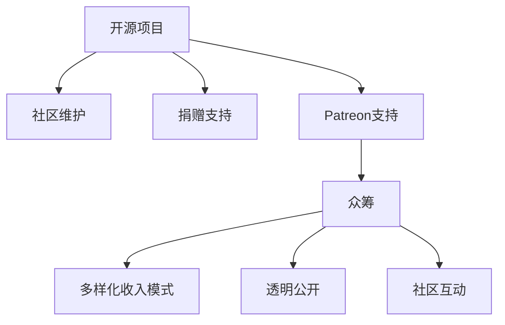

                 

# Patreon平台：开源项目的众筹策略

> 关键词：Patreon, 开源项目, 众筹, 社区维护, 捐赠支持

## 1. 背景介绍

### 1.1 问题由来

近年来，开源项目在软件开发和创新中扮演了越来越重要的角色。从Apache到MIT再到GPL，开源社区为软件开发提供了丰富的资源和工具，加速了技术进步和普及。然而，开源项目往往依赖于少数核心的开发者和志愿者，资源和资金的缺乏常常成为制约项目发展的瓶颈。在这样的背景下，众筹成为了一种新的项目维护和资金支持方式。

Patreon是一个全球知名的众筹平台，允许创作者通过提供内容、服务或产品，从粉丝和支持者那里获得持续的资金支持。这一模式不仅提高了开源项目的可持续性，还增强了开发者和用户之间的互动。本文将探讨Patreon平台如何为开源项目的众筹提供支撑，分析其优势和挑战，并展望未来发展的可能性。

### 1.2 问题核心关键点

Patreon为开源项目提供的核心优势包括：

1. **多样化收入模式**：开源项目除了传统的捐赠和赞助外，可以通过提供独家内容、产品或服务，吸引支持者定期支付费用。
2. **社区互动**：Patreon鼓励创作者和支持者之间建立紧密的联系，增强社区凝聚力和互动性。
3. **透明公开**：Patreon提供详细的财务和项目进展报告，增加项目的透明度和信任度。

然而，Patreon平台也面临一些挑战：

1. **门槛问题**：平台对于创作者和项目的审核标准较高，部分开源项目难以满足这些要求。
2. **资金管理**：如何高效管理和利用众筹资金，确保项目能够持续运营，是一大难题。
3. **利益冲突**：开源项目面临商业化倾向和社区利益之间的平衡，需要谨慎处理。

## 2. 核心概念与联系

### 2.1 核心概念概述

为更好地理解Patreon平台在开源项目中的应用，本节将介绍几个密切相关的核心概念：

- **开源项目(Open Source Project)**：指在开源许可证下发布的代码和资源，任何人可以自由使用、修改和分发。
- **众筹(Crowdfunding)**：指通过互联网平台，向公众筹集小额资金，支持项目的开发和运营。
- **社区维护(Community Maintenance)**：指开源项目通过社区的协作和贡献，实现持续的更新和改进。
- **捐赠支持(Donation Support)**：指用户通过定期或一次性捐赠，支持项目的资金需求。

这些概念之间通过Patreon平台实现了有效的结合，为开源项目的众筹提供了新的解决方案。

### 2.2 核心概念原理和架构的 Mermaid 流程图



这个流程图展示了大语言模型的核心概念及其之间的关系：

1. 开源项目通过社区维护和捐赠支持获得稳定的资源和资金。
2. 利用Patreon平台进行众筹，吸引了更多支持者的定期资金投入。
3. 众筹收入通过多样化收入模式和透明公开等策略，实现资金的可持续利用。
4. 社区互动增强了项目与支持者之间的联系，提升了项目的凝聚力和活跃度。

这些概念共同构成了开源项目通过Patreon平台进行众筹的基础框架，使其能够在更广泛、更稳定的环境中成长。

## 3. 核心算法原理 & 具体操作步骤

### 3.1 算法原理概述

Patreon平台的众筹模式，其核心原理在于通过持续的资金支持，减少开源项目对一次性捐赠和赞助的依赖。通过设立不同层级的支持者，并根据其贡献大小提供相应的回报，平台在保障项目资金持续性的同时，也促进了项目和支持者之间的紧密互动。

开源项目的资金需求通常随时间变化，Patreon通过“目标金额”和“每月收入”的设置，帮助项目灵活调整资金计划。支持者可以根据项目的进展和需求，通过不同层级的支持（如一个月支付一次）来稳定地为项目提供资金。

### 3.2 算法步骤详解

Patreon平台的众筹操作通常包括以下关键步骤：

1. **项目创建**：开发者创建Patreon项目，提交项目描述、财务目标、支持者层级等详细信息。
2. **支持者招募**：通过社交媒体、开源社区等渠道，吸引潜在的支持者关注并支持项目。
3. **资金管理**：Patreon平台定期向支持者提供财务报告和项目进展，确保资金的透明和高效使用。
4. **回报机制**：根据支持者层级，提供不同形式的回报，如代码贡献、技术支持、专属内容等。

### 3.3 算法优缺点

Patreon平台在开源项目众筹方面的优势：

- **可持续性**：通过多样化收入模式和定期支付，确保项目资金的持续稳定。
- **社区互动**：支持者和开发者之间的密切互动，增强了项目的社区粘性和参与感。
- **透明公开**：详细的财务和项目报告，提升了项目的透明度和信任度。

然而，平台也存在以下缺点：

- **门槛较高**：项目需要满足一定的标准和审核要求，部分开源项目可能难以达标。
- **依赖粉丝**：支持者的质量和数量直接影响项目的可持续性，需依赖粉丝群体的稳定支持。
- **利益冲突**：开源项目需平衡商业化倾向和社区利益，避免对社区维护产生负面影响。

### 3.4 算法应用领域

Patreon平台的众筹模式已经在多个开源项目中得到应用，涵盖了软件开发、数据科学、网络安全等多个领域。这些项目通过Patreon获得了持续的资金支持，实现了稳定的社区维护和发展。

- **软件开发**：如OpenSSL、Requests等项目，通过Patreon获取资金，用于开发和维护高质量的开源库。
- **数据科学**：如TensorFlow、PyTorch等项目，通过Patreon吸引支持者，实现技术的持续优化和迭代。
- **网络安全**：如OpenSSH、Wireshark等项目，通过Patreon获取支持，加强社区的协作和贡献。

此外，Patreon平台也逐步拓展到更多开源领域，为更多项目提供了资金支持和社区互动的新途径。

## 4. 数学模型和公式 & 详细讲解 & 举例说明

### 4.1 数学模型构建

Patreon平台的众筹模型可以通过以下数学模型来描述：

设开源项目的总资金需求为 $T$，每月资金需求为 $M$，目标金额为 $G$，每月收入为 $I$。则：

$$
M = \frac{T}{\text{月份数}}
$$

$$
I = \frac{G}{N} \times \text{支持者数量}
$$

其中 $N$ 表示支持者层级的数量，$G$ 表示每个层级的目标金额。

### 4.2 公式推导过程

通过上述模型，可以推导出支持者每月支付金额的计算公式：

$$
C = \frac{I}{\text{支持者数量}} = \frac{G}{N}
$$

这意味着，当支持者数量达到 $N$ 时，项目每月的收入恰好等于目标金额 $G$。

### 4.3 案例分析与讲解

假设一个开源项目的目标金额为 $G=5000$ 美元，每月资金需求为 $M=500$ 美元，支持者层级为 $N=5$。如果平台吸引了 $N=50$ 个支持者，则每月收入为：

$$
I = \frac{G}{N} \times \text{支持者数量} = \frac{5000}{5} \times 50 = 5000 \text{美元}
$$

这满足了项目每月的资金需求 $M=500$ 美元。

## 5. 项目实践：代码实例和详细解释说明

### 5.1 开发环境搭建

在进行Patreon平台众筹的开发实践前，需要先准备好开发环境。以下是使用Python进行Patreon平台众筹开发的流程：

1. 安装Patreon API：从Patreon官网下载并安装API客户端，获取API密钥。
2. 创建Patreon账号：在Patreon官网注册账号，创建项目并获取API密钥。
3. 安装相关库：使用pip安装requests和json库，用于与Patreon API进行通信。

```bash
pip install requests json
```

### 5.2 源代码详细实现

以下是一个简单的Patreon平台众筹开发示例代码，用于查询和更新支持者信息：

```python
import requests
import json

# 设置API密钥和URL
API_KEY = 'your_api_key'
URL = 'https://www.patreon.com/api'

# 定义API请求函数
def make_request(path, method='GET', data=None):
    headers = {'Authorization': 'Bearer {}'.format(API_KEY)}
    response = requests.request(method, URL + path, headers=headers, json=data)
    return response.json()

# 查询支持者信息
def get_supporters():
    path = '/me/supporters'
    data = None
    response = make_request(path)
    return response

# 更新支持者信息
def update_supporters():
    path = '/me/supporters'
    data = {'id': 'your_supporter_id', 'level': '1'}
    response = make_request(path, method='POST', data=data)
    return response

# 测试代码
supporters = get_supporters()
for supporter in supporters:
    print(supporter)
    update_supporters()
```

### 5.3 代码解读与分析

让我们详细解读一下代码的关键实现细节：

- `make_request`函数：封装了API请求的逻辑，通过指定API密钥和URL，使用requests库进行HTTP请求，并返回JSON格式的数据。
- `get_supporters`函数：用于查询当前支持者信息，通过GET请求获取支持者列表。
- `update_supporters`函数：用于更新支持者信息，通过POST请求提交新的支持者数据。

这些函数可以方便地与Patreon API进行交互，实现对支持者信息的查询和更新。

### 5.4 运行结果展示

运行上述代码，可以获取当前支持者列表并尝试更新支持者信息。成功更新后，将在Patreon平台上看到相应的支持者层级变化。

## 6. 实际应用场景

### 6.1 开源软件项目

开源软件项目如Apache、Ubuntu等，通过Patreon平台获得了大量的资金支持。例如，Ubuntu项目在2016年通过Patreon筹集了超过5万美元，用于开发和维护其软件生态系统。这种持续的资金支持使得开源项目能够长期稳定地运行和发展。

### 6.2 数据科学项目

数据科学项目如TensorFlow、PyTorch等，通过Patreon平台吸引了大量支持者，确保了技术的持续优化和迭代。例如，TensorFlow项目在2016年通过Patreon筹集了超过1万美元，用于支持其社区建设和开发工作。

### 6.3 网络安全项目

网络安全项目如OpenSSH、Wireshark等，通过Patreon平台获取了持续的资金支持，加强了社区的协作和贡献。例如，OpenSSH项目通过Patreon筹集了超过1万美元，用于开发和维护其开源工具。

### 6.4 未来应用展望

Patreon平台的众筹模式将随着开源社区的发展，进一步拓展到更多的领域和项目。未来，Patreon将如何为开源项目提供更加多样化和高效的支持，值得我们持续关注和探索。

## 7. 工具和资源推荐

### 7.1 学习资源推荐

为了帮助开发者系统掌握Patreon平台的众筹技术，这里推荐一些优质的学习资源：

1. Patreon API官方文档：详细介绍了Patreon API的使用方法、参数说明和示例代码，是进行开发的基础资料。
2. GitHub上的开源Patreon项目：如Patreon-Creators、Patreon-Rewards等，提供了Patreon众筹的具体实现和最佳实践。
3. Udemy上的相关课程：如《Patreon for Creators》课程，介绍了如何创建和管理Patreon项目，是新手入门的绝佳选择。
4. YouTube上的Patreon教程：如Patreon Creators、Patreon Rewards等频道，提供了丰富的众筹技巧和案例分析。

### 7.2 开发工具推荐

Patreon平台的众筹开发通常涉及API调用、数据处理等操作，以下是几款常用的开发工具：

1. PyCharm：一款功能强大的Python开发工具，支持代码调试、版本控制等，是进行Patreon开发的首选IDE。
2. VSCode：一款轻量级的代码编辑器，支持多语言和扩展，可以快速原型开发。
3. Postman：一款HTTP请求测试工具，用于测试API接口和调试开发。
4. Sublime Text：一款轻量级的文本编辑器，支持代码高亮、宏操作等，适合快速编写代码。

合理利用这些工具，可以显著提升Patreon平台众筹任务的开发效率，加快创新迭代的步伐。

### 7.3 相关论文推荐

Patreon平台的众筹模式源于学界的持续研究。以下是几篇奠基性的相关论文，推荐阅读：

1. Crowdfunding in the Digital Age: A Survey of Crowdfunding Platforms（Dove and Gupta, 2016）：提供了关于众筹平台的全面综述，包括Patreon在内的多个平台。
2. The Impact of Crowdfunding on Social Innovation（Doostabadi et al., 2018）：探讨了众筹对社会创新和技术发展的积极影响。
3. Crowdfunding in the Creative Industries: A Study of its Impact on Creative Professionals（Lipke et al., 2019）：研究了众筹在创意产业中的实际应用及其影响。

这些论文代表了Patreon平台众筹技术的发展脉络。通过学习这些前沿成果，可以帮助研究者把握学科前进方向，激发更多的创新灵感。

## 8. 总结：未来发展趋势与挑战

### 8.1 总结

本文对Patreon平台在开源项目众筹中的应用进行了全面系统的介绍。首先阐述了Patreon平台在开源项目中的重要性和优势，明确了其在开源社区和资金支持方面的关键作用。其次，从原理到实践，详细讲解了Patreon众筹模型的构建和实现，给出了具体的代码示例。同时，本文还广泛探讨了众筹模式在开源项目中的应用场景，展示了其广泛的应用潜力。此外，本文精选了Patreon平台的各类学习资源，力求为读者提供全方位的技术指引。

通过本文的系统梳理，可以看到，Patreon平台为开源项目提供了全新的资金支持和社区互动方式，显著提升了开源项目的可持续性和社区参与度。未来的发展趋势表明，Patreon平台将继续扩展其在开源社区的应用，成为开源项目的重要合作伙伴。

### 8.2 未来发展趋势

展望未来，Patreon平台的众筹模式将呈现以下几个发展趋势：

1. **多渠道融合**：Patreon将进一步与其他众筹平台（如Kickstarter、Indiegogo等）合作，提供多元化的资金筹集渠道。
2. **透明度提升**：通过引入区块链等技术，Patreon将增强资金流动的透明性和安全性。
3. **社区互动加强**：Patreon将增强创作者与支持者之间的互动机制，提供更多的社区活动和奖励。
4. **商业化拓展**：Patreon将探索更多的商业化途径，为创作者提供更多的市场机会。

这些趋势将进一步丰富Patreon平台的众筹模式，使其在开源项目中发挥更大的作用。

### 8.3 面临的挑战

尽管Patreon平台在开源项目众筹方面取得了显著成效，但在进一步拓展和优化的过程中，仍面临一些挑战：

1. **生态平衡**：如何平衡开源社区和商业化倾向，避免对社区生态造成负面影响。
2. **资金管理**：如何高效管理和利用众筹资金，确保项目的可持续运营。
3. **用户激励**：如何设计有效的激励机制，鼓励更多的支持者参与和持续支持。
4. **平台拓展**：如何拓展到更多国家和地区，适应不同文化背景下的资金需求和社区特点。

这些挑战需要Patreon平台和开源社区共同努力，通过不断的技术创新和社区协作，实现平台的持续发展和优化。

### 8.4 研究展望

面对Patreon平台众筹面临的挑战，未来的研究需要在以下几个方面寻求新的突破：

1. **社区治理**：探索社区治理的新模型，增强社区成员的参与感和责任感。
2. **资金管理**：研究新的资金管理策略，提高资金使用的效率和透明度。
3. **激励机制**：设计更加多样化和公平的激励机制，鼓励更多的支持者参与和贡献。
4. **平台优化**：优化Patreon平台的界面和功能，提供更友好、更高效的用户体验。

这些研究方向的探索，必将引领Patreon平台众筹技术迈向更高的台阶，为开源项目提供更加稳定、高效、安全的资金支持。面向未来，Patreon平台将继续探索新的模式和技术，与开源社区携手共进，共同推动开源技术的进步和创新。

## 9. 附录：常见问题与解答

**Q1：Patreon平台对开源项目的支持有哪些形式？**

A: Patreon平台对开源项目的支持主要通过两种形式：

1. **资金支持**：支持者通过定期支付，为开源项目提供持续的资金支持。
2. **社区互动**：支持者通过评论、反馈等形式，增强与开源项目和创作者的互动，提升社区的活跃度。

**Q2：开源项目如何通过Patreon平台获得最大化的支持？**

A: 开源项目可以通过以下方式最大化通过Patreon平台获得支持：

1. **详细描述项目**：在项目页面上详细介绍项目的目标、进展和需求，吸引更多支持者关注。
2. **设定明确的目标**：设定具体的资金目标，并定期更新项目进展，增加支持者的信心。
3. **多样化回报机制**：提供不同层级的回报，如代码贡献、技术支持、专属内容等，吸引更多支持者参与。

**Q3：Patreon平台有哪些挑战需要克服？**

A: Patreon平台在开源项目众筹方面面临以下挑战：

1. **门槛较高**：平台对项目和创作者有较高的审核要求，部分开源项目可能难以达标。
2. **资金管理**：如何高效管理和利用众筹资金，确保项目能够持续运营。
3. **利益冲突**：开源项目需平衡商业化倾向和社区利益，避免对社区维护产生负面影响。

**Q4：开源项目如何平衡社区维护和商业化倾向？**

A: 开源项目在平衡社区维护和商业化倾向时，可以采取以下策略：

1. **社区优先**：确保社区的长期发展和维护是项目的首要目标，避免过度商业化。
2. **透明公开**：保持财务和项目的透明度，增强社区成员的信任和支持。
3. **激励机制**：设计多样化的激励机制，鼓励社区成员的积极参与和贡献。

**Q5：Patreon平台未来有哪些可能的优化方向？**

A: Patreon平台未来可能的优化方向包括：

1. **多渠道融合**：与其他众筹平台合作，提供多元化的资金筹集渠道。
2. **透明度提升**：引入区块链等技术，增强资金流动的透明性和安全性。
3. **社区互动加强**：增强创作者与支持者之间的互动机制，提供更多的社区活动和奖励。
4. **商业化拓展**：探索更多的商业化途径，为创作者提供更多的市场机会。

通过这些优化，Patreon平台将为开源项目提供更加多样化和高效的支持，进一步提升开源社区的活力和发展潜力。

---

作者：禅与计算机程序设计艺术 / Zen and the Art of Computer Programming

