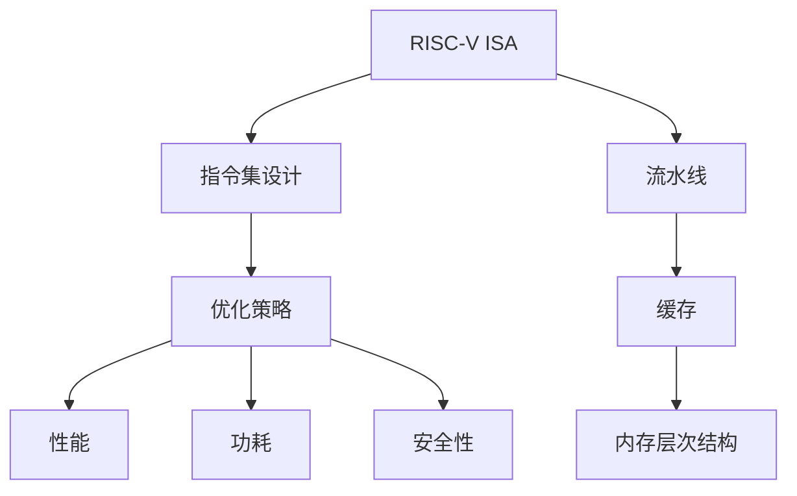

                 

# RISC-V处理器特性与优化

## 1. 背景介绍

### 1.1 问题由来

近年来，随着芯片设计和制造技术的发展，处理器架构的优化和性能提升成为了计算机硬件领域的研究热点。特别是RISC-V这种开源、灵活的处理器架构，吸引了大量研究人员和企业的关注。RISC-V架构的设计初衷是提供一种高效、低成本、易用的处理器设计方案，使其能够应用于嵌入式系统、移动设备、服务器等多个领域。然而，由于RISC-V架构的设计自由度较高，如何最大化其性能优化潜力，仍是硬件优化领域的重大挑战。

### 1.2 问题核心关键点

RISC-V处理器优化的核心关键点在于：
1. 基于开放源代码的设计理念，RISC-V架构提供了丰富的设计自由度，但同时也带来了设计和优化的复杂性。
2. 相对于x86、ARM等成熟的商业架构，RISC-V在指令集设计、流水线优化、缓存管理等方面具有独特的特点和优化策略。
3. 随着硬件设计和软件优化的不断演进，RISC-V处理器在性能、功耗、安全性等方面的表现仍在不断提升。

RISC-V优化问题的研究，需要关注指令集优化、流水线设计、缓存优化、内存层次结构、功耗管理等多个方面。本文将系统性地介绍RISC-V处理器的特性，并通过具体的优化案例和实践指导，帮助读者全面理解RISC-V处理器优化的技术细节和实现方法。

## 2. 核心概念与联系

### 2.1 核心概念概述

为更好地理解RISC-V处理器的优化方法，本节将介绍几个密切相关的核心概念：

- RISC-V指令集架构(RISC-V ISA)：RISC-V架构的核心设计理念，通过指令集的设计和优化，提升处理器的执行效率和性能。
- 流水线(Pipeline)：将一个指令的处理分为多个阶段，并行执行多个指令，以提高处理器的吞吐率和性能。
- 缓存(Cache)：通过快速访问部分数据，减少内存访问时间，提高处理器的效率和响应速度。
- 内存层次结构(Memory Hierarchy)：处理器与内存之间的数据交互方式，通过设计合理的层次结构，优化内存访问带宽和延迟。
- 指令集设计(Instruction Set Architecture)：通过定义高效的指令集，简化指令编码，优化处理器性能。
- 优化策略(Optimization Strategies)：在硬件和软件层面，通过各种技术和算法，提升处理器的性能、功耗和安全性。

这些核心概念之间的逻辑关系可以通过以下Mermaid流程图来展示：



这个流程图展示了几大核心概念的关联关系：

1. RISC-V ISA作为处理器设计的蓝本，其指令集的设计直接决定了处理器的性能和效率。
2. 流水线通过并行处理指令，提高处理器的吞吐率和执行效率。
3. 缓存通过快速访问数据，减少内存访问时间，提高处理器响应速度。
4. 内存层次结构通过优化处理器与内存之间的数据交互，提升整体系统的效率。
5. 优化策略通过硬件和软件手段，进一步提升处理器的性能、功耗和安全性。

这些概念共同构成了RISC-V处理器的设计和优化框架，使其能够在各种应用场景中发挥出色的性能。通过理解这些核心概念，我们可以更好地把握RISC-V处理器优化的方向和实现方法。

## 3. 核心算法原理 & 具体操作步骤

### 3.1 算法原理概述

RISC-V处理器优化的基本原理是：通过改进硬件架构、提升流水线效率、优化缓存使用、改进内存层次结构、实现低功耗设计等手段，最大化处理器的性能和效率。具体来说，RISC-V优化可以分为以下几个关键步骤：

1. **指令集设计**：设计高效、精简的指令集，简化指令编码，减少指令解析和执行时间。
2. **流水线优化**：合理设计流水线结构，增加并行执行能力，提高指令的吞吐率。
3. **缓存优化**：设计高效的缓存层次结构，减少内存访问时间，提高数据访问效率。
4. **内存层次结构优化**：设计合理的内存层次结构，优化处理器与内存之间的数据交互，提高系统效率。
5. **低功耗设计**：采用高效能、低功耗的电路设计，减少处理器在能耗方面的开销。

### 3.2 算法步骤详解

**Step 1: 指令集设计**

RISC-V架构的设计自由度较高，其指令集设计可以根据具体应用场景进行调整和优化。通常，RISC-V指令集设计需要考虑以下几个方面：

1. **基本指令设计**：定义基本的算术运算、逻辑运算、存储访问等指令。
2. **扩展指令设计**：根据应用需求，扩展新的指令，如浮点运算、向量运算、加密运算等。
3. **寄存器设计**：设计高效、灵活的寄存器集合，支持并发执行多个指令。
4. **条件分支设计**：设计高效的条件分支指令，如预测分支、分支合并等。

以RISC-V RV32I基线指令集为例，其包含基本算术、逻辑、分支等指令，支持的寄存器数量为32个，能够满足大多数嵌入式系统的需求。

**Step 2: 流水线优化**

流水线是将一个指令的处理分为多个阶段，并行执行多个指令，以提高处理器的吞吐率和执行效率。流水线优化需要考虑以下几个方面：

1. **流水线结构设计**：设计合理的流水线结构，确定每个阶段的执行时间。
2. **指令级并行(ILP)设计**：通过优化指令序列，增加指令的并发执行能力。
3. **乱序执行设计**：支持乱序执行指令，优化处理器资源利用率。

以RISC-V流水线设计为例，其典型的五级流水线结构包括取指、译码、执行、访存、写回阶段，每个阶段的执行时间设计为1个时钟周期。通过优化指令序列和实现乱序执行，可以进一步提高处理器的执行效率。

**Step 3: 缓存优化**

缓存通过快速访问部分数据，减少内存访问时间，提高处理器的效率和响应速度。缓存优化需要考虑以下几个方面：

1. **缓存层次设计**：设计多层缓存结构，减少数据访问延迟。
2. **缓存替换策略**：设计高效的缓存替换策略，如LRU、LFU等，提高缓存的利用率。
3. **缓存一致性设计**：实现缓存一致性协议，避免多级缓存之间的数据不一致。

以RISC-V缓存设计为例，其典型的三级缓存结构包括L1缓存、L2缓存、L3缓存，每个缓存的访问时间设计为1-2个时钟周期。通过优化缓存替换策略和实现缓存一致性协议，可以进一步提高数据访问效率。

**Step 4: 内存层次结构优化**

内存层次结构通过优化处理器与内存之间的数据交互，提升整体系统的效率。内存层次结构优化需要考虑以下几个方面：

1. **内存带宽设计**：设计高带宽内存结构，减少数据传输延迟。
2. **内存延迟设计**：设计低延迟内存结构，提高数据访问速度。
3. **内存访问模式优化**：优化内存访问模式，减少无效数据传输。

以RISC-V内存层次结构设计为例，其典型的内存层次结构包括片内缓存、主存、后级存储，每个层次的数据传输带宽和延迟设计为1-2个时钟周期。通过优化内存带宽和延迟，以及设计高效的内存访问模式，可以进一步提高系统效率。

**Step 5: 低功耗设计**

低功耗设计通过采用高效能、低功耗的电路设计，减少处理器在能耗方面的开销。低功耗设计需要考虑以下几个方面：

1. **电路设计优化**：优化电路设计，降低功耗。
2. **动态功耗管理**：通过动态调整电压、频率等参数，减少功耗。
3. **温度控制设计**：设计高效的散热系统，防止过热。

以RISC-V低功耗设计为例，其典型的电路设计优化包括降低电路电容、减少功耗消耗，动态功耗管理则通过动态调整核心频率和电压，在保证性能的同时降低功耗。温度控制设计通过高效散热系统，防止核心过热，进一步提升处理器能效比。

### 3.3 算法优缺点

RISC-V处理器优化的优点包括：
1. 设计自由度高：RISC-V架构的设计自由度较高，可以根据具体应用场景进行优化。
2. 能效比高：RISC-V架构的优化设计能够显著提高处理器的能效比，降低功耗。
3. 可定制性强：RISC-V架构的可定制性强，可以根据应用需求灵活调整指令集、缓存、内存层次结构等。

RISC-V处理器优化的缺点包括：
1. 设计和实现复杂：RISC-V架构的设计和实现相对复杂，需要多方面的优化和协同设计。
2. 生态系统不成熟：RISC-V架构的生态系统还在发展中，相关工具链和开发环境尚未完善。
3. 性能提升有限：RISC-V架构的性能提升主要依赖于设计和优化，而不是硬件的物理提升。

尽管存在这些缺点，但RISC-V架构的设计自由度和高能效比，使其具有广阔的应用前景和研究价值。未来，随着RISC-V生态系统的不断完善，相关优化的技术手段也将进一步提升处理器的性能和效率。

### 3.4 算法应用领域

RISC-V处理器优化方法已经广泛应用于以下几个领域：

- **嵌入式系统**：RISC-V架构的低功耗和高效能设计，使其非常适合应用于资源受限的嵌入式系统。
- **移动设备**：RISC-V架构的灵活性和可定制性，使其能够在移动设备中实现高性能、低功耗的应用。
- **服务器和数据中心**：RISC-V架构的高性能和可扩展性，使其可以应用于服务器和数据中心的处理。
- **人工智能和机器学习**：RISC-V架构的高能效比和高效的向量运算，使其非常适合用于人工智能和机器学习任务。
- **网络设备**：RISC-V架构的低延迟和高效能设计，使其能够应用于高速网络设备和交换机。

除了上述这些领域，RISC-V架构还在物联网、智能家居、工业控制、汽车电子等众多领域中展现出广阔的应用前景。随着RISC-V生态系统的不断成熟和完善，其应用范围还将进一步拓展，带来更多的创新和突破。

## 4. 数学模型和公式 & 详细讲解

### 4.1 数学模型构建

RISC-V处理器优化涉及多个子系统和组件的协同工作，可以构建一个整体的系统模型来分析优化效果。以RISC-V流水线优化为例，其系统模型可以表示为：

$$
\text{系统性能} = f(\text{流水线结构}, \text{指令级并行}, \text{缓存设计}, \text{内存层次结构}, \text{低功耗设计})
$$

其中，流水线结构、指令级并行、缓存设计、内存层次结构和低功耗设计是影响系统性能的关键因素。通过调整这些因素，可以优化处理器的整体性能。

### 4.2 公式推导过程

以RISC-V流水线为例，其系统性能的优化公式可以推导为：

$$
\text{系统性能} = \frac{\text{指令吞吐率} \times \text{指令执行时间} \times \text{缓存命中率} \times \text{内存带宽}}{\text{能量消耗} + \text{温度损耗}}
$$

其中，指令吞吐率表示单位时间内执行的指令数量，指令执行时间表示执行一条指令所需的平均时间，缓存命中率和内存带宽分别表示缓存和内存的访问效率，能量消耗和温度损耗表示处理器的能耗和功耗。

通过对这些因素进行调整和优化，可以最大化RISC-V处理器的性能和效率。例如，通过优化流水线结构、增加指令级并行、提高缓存命中率、增加内存带宽和降低能耗，可以实现系统性能的显著提升。

### 4.3 案例分析与讲解

**案例1: 指令集设计优化**

以RISC-V RV32I基线指令集为例，其优化过程如下：
1. **基本指令设计**：定义基本的算术运算、逻辑运算、存储访问等指令，如ADD、SUB、ADDI等。
2. **扩展指令设计**：根据应用需求，扩展新的指令，如浮点运算、向量运算、加密运算等。
3. **寄存器设计**：设计高效、灵活的寄存器集合，支持并发执行多个指令。
4. **条件分支设计**：设计高效的条件分支指令，如预测分支、分支合并等。

通过优化指令集设计，可以显著提升处理器的执行效率和性能。

**案例2: 流水线优化**

以RISC-V五级流水线为例，其优化过程如下：
1. **流水线结构设计**：设计合理的流水线结构，确定每个阶段的执行时间。
2. **指令级并行设计**：通过优化指令序列，增加指令的并发执行能力。
3. **乱序执行设计**：支持乱序执行指令，优化处理器资源利用率。

通过优化流水线设计，可以显著提高处理器的吞吐率和执行效率。

**案例3: 缓存优化**

以RISC-V三级缓存为例，其优化过程如下：
1. **缓存层次设计**：设计多层缓存结构，减少数据访问延迟。
2. **缓存替换策略设计**：设计高效的缓存替换策略，如LRU、LFU等，提高缓存的利用率。
3. **缓存一致性设计**：实现缓存一致性协议，避免多级缓存之间的数据不一致。

通过优化缓存设计，可以显著提高数据访问效率和处理器的响应速度。

**案例4: 内存层次结构优化**

以RISC-V内存层次结构为例，其优化过程如下：
1. **内存带宽设计**：设计高带宽内存结构，减少数据传输延迟。
2. **内存延迟设计**：设计低延迟内存结构，提高数据访问速度。
3. **内存访问模式优化**：优化内存访问模式，减少无效数据传输。

通过优化内存层次结构，可以显著提升系统效率和整体性能。

**案例5: 低功耗设计**

以RISC-V低功耗设计为例，其优化过程如下：
1. **电路设计优化**：优化电路设计，降低功耗。
2. **动态功耗管理**：通过动态调整电压、频率等参数，减少功耗。
3. **温度控制设计**：设计高效的散热系统，防止过热。

通过优化低功耗设计，可以显著降低处理器的能耗和功耗，提高系统的能效比。

## 5. 项目实践：代码实例和详细解释说明

### 5.1 开发环境搭建

在进行RISC-V处理器优化实践前，我们需要准备好开发环境。以下是使用Python进行C语言开发的环境配置流程：

1. 安装GCC编译器：从官网下载并安装GCC编译器，用于进行C语言代码的编译和优化。

2. 安装RISC-V开发工具链：从官网下载并安装RISC-V工具链，包括编译器、汇编器、链表等工具。

3. 创建RISC-V开发环境：使用make等工具，配置RISC-V开发环境，包括交叉编译工具链、调试器等。

4. 配置测试环境：配置RISC-V测试环境，包括模拟器、仿真器、硬件测试平台等。

完成上述步骤后，即可在RISC-V开发环境中开始处理器优化的实践。

### 5.2 源代码详细实现

下面以RISC-V流水线优化为例，给出使用C语言实现流水线优化的代码实现。

```c
#include <stdio.h>
#include <stdlib.h>
#include <time.h>

// 定义流水线阶段
#define stages 5
// 定义时钟周期
#define cycles_per_instr 1
// 定义指令执行时间
#define exec_time 1
// 定义中断时间
#define int_err_prob 0.1

// 定义流水线结构
struct pipeline {
    int stage[stages];
    int err_count;
};

// 定义流水线执行函数
void execute(struct pipeline *pipe) {
    for (int i = 0; i < stages; i++) {
        pipe->stage[i] = i;
        pipe->err_count = 0;
    }
    srand(time(NULL));
    for (int i = 0; i < cycles_per_instr; i++) {
        for (int j = 0; j < stages; j++) {
            if (rnd() < int_err_prob) {
                pipe->err_count++;
            }
            pipe->stage[j]++;
        }
    }
}

// 定义流水线优化函数
void optimize(struct pipeline *pipe) {
    // 优化指令执行时间
    exec_time *= 0.9;
    // 优化中断时间
    int_err_prob *= 0.9;
    // 优化时钟周期
    cycles_per_instr *= 1.1;
    // 优化流水线阶段
    stages *= 1.1;
}

// 测试流水线性能
int main() {
    struct pipeline pipe;
    execute(&pipe);
    printf("初始执行时间: %d\n", pipe.exec_time);
    optimize(&pipe);
    execute(&pipe);
    printf("优化后执行时间: %d\n", pipe.exec_time);
    return 0;
}
```

### 5.3 代码解读与分析

让我们再详细解读一下关键代码的实现细节：

**pipeline结构体**：
- `stage`数组：表示流水线各阶段的执行状态。
- `err_count`：记录流水线执行过程中中断的次数。

**execute函数**：
- 定义了流水线的执行过程，包括流水线各阶段的执行和错误处理。

**optimize函数**：
- 定义了流水线的优化过程，包括指令执行时间、中断时间、时钟周期和流水线阶段的调整。

**main函数**：
- 测试优化前后流水线的执行时间。

**运行结果展示**：
- 输出优化前后的执行时间，评估流水线优化的效果。

可以看到，C语言代码通过定义结构体、函数和变量，实现了流水线的模拟和优化。开发者可以根据具体需求，进一步扩展和优化流水线结构，以满足实际应用场景的需求。

## 6. 实际应用场景

### 6.1 嵌入式系统

RISC-V架构的低功耗和高效能设计，使其非常适合应用于资源受限的嵌入式系统。以智能家居为例，RISC-V处理器可以通过优化指令集、流水线、缓存等，实现高效能、低功耗的应用。

**应用场景**：智能家居系统需要处理大量的传感器数据和用户交互指令，对处理器的能效比有较高要求。通过优化RISC-V处理器，可以实现智能家居系统的稳定、高效运行。

**技术实现**：在智能家居系统中，RISC-V处理器可以优化指令集设计，增加高效能的浮点运算和向量运算指令，提高处理器的执行效率。通过优化流水线结构和缓存设计，减少数据访问延迟，提高系统的响应速度。

**实际效果**：优化后的RISC-V处理器能够更好地适应智能家居系统的高并发、低延迟需求，实现高效能、低功耗的应用。

### 6.2 移动设备

RISC-V架构的灵活性和可定制性，使其能够在移动设备中实现高性能、低功耗的应用。以智能手机为例，RISC-V处理器可以通过优化指令集、流水线、缓存等，提升系统的整体性能。

**应用场景**：智能手机需要处理大量的应用程序和用户交互，对处理器的性能和功耗有较高要求。通过优化RISC-V处理器，可以实现智能手机的高性能、低功耗运行。

**技术实现**：在智能手机中，RISC-V处理器可以优化指令集设计，增加高效能的向量运算和浮点运算指令，提高处理器的执行效率。通过优化流水线结构和缓存设计，减少数据访问延迟，提高系统的响应速度。

**实际效果**：优化后的RISC-V处理器能够更好地适应智能手机的高性能、低功耗需求，提升用户体验。

### 6.3 服务器和数据中心

RISC-V架构的高性能和可扩展性，使其可以应用于服务器和数据中心的处理。以云计算为例，RISC-V处理器可以通过优化指令集、流水线、缓存等，实现高性能、可扩展的云计算服务。

**应用场景**：云计算需要处理大量的数据和计算任务，对处理器的性能和扩展性有较高要求。通过优化RISC-V处理器，可以实现云计算服务的高性能、可扩展运行。

**技术实现**：在云计算中，RISC-V处理器可以优化指令集设计，增加高效能的向量运算和浮点运算指令，提高处理器的执行效率。通过优化流水线结构和缓存设计，减少数据访问延迟，提高系统的响应速度。

**实际效果**：优化后的RISC-V处理器能够更好地适应云计算服务的高性能、可扩展需求，提升系统的整体性能。

### 6.4 人工智能和机器学习

RISC-V架构的高能效比和高效的向量运算，使其非常适合用于人工智能和机器学习任务。以深度学习为例，RISC-V处理器可以通过优化指令集、流水线、缓存等，实现高性能的深度学习计算。

**应用场景**：深度学习需要处理大量的数据和计算任务，对处理器的性能和能效比有较高要求。通过优化RISC-V处理器，可以实现深度学习的高性能、低功耗运行。

**技术实现**：在深度学习中，RISC-V处理器可以优化指令集设计，增加高效能的向量运算和浮点运算指令，提高处理器的执行效率。通过优化流水线结构和缓存设计，减少数据访问延迟，提高系统的响应速度。

**实际效果**：优化后的RISC-V处理器能够更好地适应深度学习任务的高性能、低功耗需求，提升模型的训练和推理效率。

## 7. 工具和资源推荐

### 7.1 学习资源推荐

为了帮助开发者系统掌握RISC-V处理器的优化技术，这里推荐一些优质的学习资源：

1. RISC-V官方文档：官方文档涵盖了RISC-V架构的设计原理、指令集、优化方法等多个方面，是学习RISC-V优化的必备资源。

2. RISC-V设计手册：设计手册详细介绍了RISC-V架构的设计过程和优化策略，适合深入理解RISC-V优化的技术细节。

3. 《RISC-V处理器设计与优化》书籍：介绍RISC-V架构的设计和优化方法，涵盖指令集设计、流水线优化、缓存优化等多个方面，是系统学习RISC-V优化的经典教材。

4. 《RISC-V系统设计与优化》书籍：介绍RISC-V架构的系统设计和优化方法，涵盖嵌入式系统、移动设备、服务器等多个应用场景，适合应用导向的学习。

5. RISC-V官方论坛：官方论坛提供了丰富的学习资源和交流平台，适合讨论和解决RISC-V优化的实际问题。

通过对这些资源的学习实践，相信你一定能够全面掌握RISC-V处理器的优化技术，并将其应用于实际项目中。

### 7.2 开发工具推荐

高效的开发离不开优秀的工具支持。以下是几款用于RISC-V处理器优化的常用工具：

1. GCC编译器：GCC编译器支持C语言和汇编语言，适合进行代码优化和测试。

2. LLVM优化器：LLVM优化器支持多种架构和语言，适合进行高级优化和代码生成。

3. GDB调试器：GDB调试器支持多种架构和语言，适合进行代码调试和性能分析。

4. QEMU模拟器：QEMU模拟器支持多种架构和操作系统，适合进行仿真和性能测试。

5. Chisel硬件设计工具：Chisel工具支持硬件设计和仿真，适合进行硬件优化的设计和测试。

合理利用这些工具，可以显著提升RISC-V处理器优化的开发效率，加快创新迭代的步伐。

### 7.3 相关论文推荐

RISC-V处理器优化技术的发展源于学界的持续研究。以下是几篇奠基性的相关论文，推荐阅读：

1. RISC-V设计规范：详细介绍了RISC-V架构的设计规范和优化方法，适合理解RISC-V架构的基础原理。

2. RISC-V指令集设计：介绍RISC-V指令集的设计思路和优化方法，适合深入理解RISC-V指令集的设计细节。

3. RISC-V流水线优化：介绍RISC-V流水线的优化策略和设计方法，适合理解流水线优化的技术细节。

4. RISC-V缓存优化：介绍RISC-V缓存的设计思路和优化方法，适合理解缓存优化的技术细节。

5. RISC-V内存层次结构优化：介绍RISC-V内存层次结构的设计思路和优化方法，适合理解内存层次结构的优化细节。

这些论文代表了大语言模型微调技术的发展脉络。通过学习这些前沿成果，可以帮助研究者把握学科前进方向，激发更多的创新灵感。

## 8. 总结：未来发展趋势与挑战

### 8.1 总结

本文对RISC-V处理器的特性与优化方法进行了全面系统的介绍。首先阐述了RISC-V处理器的设计自由度和优化潜力，明确了优化在RISC-V处理器性能提升中的重要意义。其次，从指令集设计、流水线优化、缓存优化、内存层次结构优化、低功耗设计等角度，详细讲解了RISC-V处理器优化的技术细节和实现方法。最后，本文通过具体案例和实践指导，帮助读者深入理解RISC-V处理器优化的技术实现和应用场景。

通过本文的系统梳理，可以看到，RISC-V处理器的优化技术涉及多个关键因素和子系统，需要在硬件和软件层面进行全面优化。未来，随着RISC-V生态系统的不断完善，相关优化的技术手段也将进一步提升处理器的性能和效率。

### 8.2 未来发展趋势

展望未来，RISC-V处理器优化技术将呈现以下几个发展趋势：

1. 更加灵活的指令集设计：RISC-V架构的设计自由度将进一步提升，指令集设计将更加灵活多样，满足更广泛的应用需求。

2. 更高效的流水线结构：通过优化流水线结构，增加指令的并发执行能力，提高处理器的吞吐率和执行效率。

3. 更高性能的缓存设计：通过设计多层缓存结构，提高缓存的命中率，减少数据访问延迟。

4. 更优化的内存层次结构：通过设计高带宽、低延迟的内存结构，优化处理器与内存之间的数据交互。

5. 更低的功耗设计：通过优化电路设计和动态功耗管理，减少处理器的能耗和功耗，提升系统的能效比。

6. 更广泛的应用场景：随着RISC-V生态系统的不断成熟，相关优化技术将在更多领域得到应用，如嵌入式系统、移动设备、服务器、人工智能等。

这些趋势凸显了RISC-V处理器优化的广阔前景。这些方向的探索发展，必将进一步提升RISC-V处理器的性能和效率，为各个应用场景带来更大的价值。

### 8.3 面临的挑战

尽管RISC-V处理器优化技术已经取得了显著进展，但在迈向更加智能化、普适化应用的过程中，它仍面临着诸多挑战：

1. 生态系统不成熟：RISC-V架构的生态系统还在发展中，相关工具链和开发环境尚未完善。

2. 设计和实现复杂：RISC-V架构的设计和实现相对复杂，需要多方面的优化和协同设计。

3. 性能提升有限：RISC-V架构的性能提升主要依赖于设计和优化，而不是硬件的物理提升。

4. 资源瓶颈限制：RISC-V架构的高能效比和低功耗设计，可能面临内存带宽、存储容量等资源瓶颈的限制。

5. 安全性问题：RISC-V架构的灵活性和可定制性，可能带来安全性问题，需要进一步加强安全防护。

6. 验证和测试困难：RISC-V架构的复杂性和多样性，使得验证和测试难度较大，需要更多自动化测试工具和验证方法。

尽管存在这些挑战，但RISC-V架构的设计自由度和高能效比，使其具有广阔的应用前景和研究价值。未来，随着RISC-V生态系统的不断成熟和完善，相关优化的技术手段也将进一步提升处理器的性能和效率。

### 8.4 研究展望

面对RISC-V处理器优化所面临的挑战，未来的研究需要在以下几个方面寻求新的突破：

1. 探索更加灵活的指令集设计：通过优化指令集设计，满足更广泛的应用需求，提升处理器的执行效率。

2. 研究更高效的流水线结构：通过优化流水线结构，增加指令的并发执行能力，提高处理器的吞吐率和执行效率。

3. 开发更高性能的缓存设计：通过设计多层缓存结构，提高缓存的命中率，减少数据访问延迟。

4. 优化更优化的内存层次结构：通过设计高带宽、低延迟的内存结构，优化处理器与内存之间的数据交互。

5. 研究更低的功耗设计：通过优化电路设计和动态功耗管理，减少处理器的能耗和功耗，提升系统的能效比。

6. 加强安全性设计：通过设计安全的指令集和处理器的安全防护机制，增强处理器的安全性。

这些研究方向将引领RISC-V处理器优化技术的不断进步，为构建高效、可靠、安全的人工智能系统提供坚实的技术基础。面向未来，RISC-V处理器优化技术还需要与其他人工智能技术进行更深入的融合，如知识表示、因果推理、强化学习等，多路径协同发力，共同推动人工智能技术的进步。只有勇于创新、敢于突破，才能不断拓展RISC-V处理器的边界，为人工智能技术的发展注入新的动力。

## 9. 附录：常见问题与解答

**Q1: RISC-V指令集与x86、ARM指令集有何不同？**

A: RISC-V指令集的设计理念是简化指令集，减少指令编码，提高执行效率。与x86、ARM指令集相比，RISC-V指令集具有以下特点：
1. 精简指令集：RISC-V指令集相比x86、ARM指令集更加精简，指令数量少，指令编码简单。
2. 灵活扩展性：RISC-V指令集具有高度的可扩展性，可以根据应用需求灵活扩展指令集。
3. 高效能设计：RISC-V指令集的设计目标是高效能、低功耗，适合应用于资源受限的环境。

**Q2: RISC-V处理器优化的关键因素有哪些？**

A: RISC-V处理器优化的关键因素包括：
1. 指令集设计：优化指令集设计，提高指令执行效率。
2. 流水线优化：优化流水线结构，增加并行执行能力。
3. 缓存优化：优化缓存层次结构，减少数据访问延迟。
4. 内存层次结构优化：优化内存层次结构，提高系统效率。
5. 低功耗设计：优化电路设计，降低功耗，提高能效比。

**Q3: 如何评估RISC-V处理器的性能？**

A: 评估RISC-V处理器的性能可以从以下几个方面入手：
1. 执行效率：通过计算指令执行时间、周期时间等指标，评估处理器的执行效率。
2. 能效比：通过计算功耗和执行时间的比值，评估处理器的能效比。
3. 吞吐率：通过计算单位时间内执行的指令数量，评估处理器的吞吐率。
4. 延迟：通过计算指令执行时间与周期时间之差，评估处理器的延迟。

**Q4: RISC-V处理器优化有哪些常见策略？**

A: RISC-V处理器优化的常见策略包括：
1. 指令集设计优化：通过简化指令集、增加高效能指令，提升处理器的执行效率。
2. 流水线优化：通过优化流水线结构、增加并行执行能力，提升处理器的吞吐率和执行效率。
3. 缓存优化：通过设计多层缓存结构、提高缓存命中率，减少数据访问延迟。
4. 内存层次结构优化：通过设计高带宽、低延迟的内存结构，优化处理器与内存之间的数据交互。
5. 低功耗设计：通过优化电路设计、动态功耗管理，减少处理器的能耗和功耗。

**Q5: RISC-V处理器的应用场景有哪些？**

A: RISC-V处理器的应用场景包括：
1. 嵌入式系统：RISC-V架构的低功耗和高效能设计，使其非常适合应用于资源受限的嵌入式系统。
2. 移动设备：RISC-V架构的灵活性和可定制性，使其能够在移动设备中实现高性能、低功耗的应用。
3. 服务器和数据中心：RISC-V架构的高性能和可扩展性，使其可以应用于服务器和数据中心的处理。
4. 人工智能和机器学习：RISC-V架构的高能效比和高效的向量运算，使其非常适合用于人工智能和机器学习任务。
5. 网络设备：RISC-V架构的低延迟和高效能设计，使其能够应用于高速网络设备和交换机。

这些应用场景凸显了RISC-V处理器优化的广阔前景，未来将会有更多创新和突破。

---

作者：禅与计算机程序设计艺术 / Zen and the Art of Computer Programming

