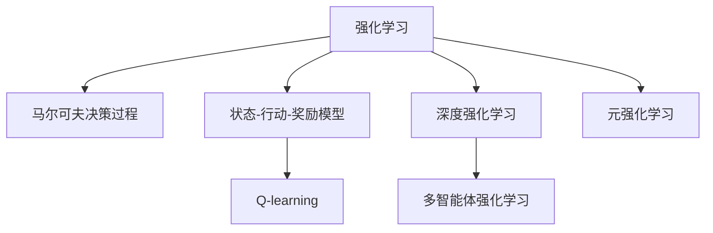

                 

## 1. 背景介绍

### 1.1 问题由来

强化学习（Reinforcement Learning，简称 RL）是一种基于试错的学习方法，主要应用于智能体与环境交互的场景中。它通过智能体采取行动、接收环境反馈，逐步学习最优的策略来达成预定的目标。在游戏和机器人领域，强化学习被广泛应用于智能决策、控制和导航等方面，展现出了显著的效果。

### 1.2 问题核心关键点

强化学习在游戏和机器人中的应用，关键在于以下几个方面：

1. **智能决策**：在游戏中，强化学习可以用于角色控制、任务规划、策略优化等。在机器人中，则用于路径规划、避障、任务执行等。
2. **自适应学习**：智能体能够根据环境的反馈，不断调整策略，以适应不同的环境和需求。
3. **多目标优化**：游戏和机器人任务通常涉及多个目标，强化学习能够同时优化多个指标，达成综合效果。
4. **稀疏奖励**：许多游戏和机器人任务中，智能体的行为对奖励的获得是稀疏的，强化学习能够处理这种不确定性。
5. **动态环境**：游戏和机器人所处的环境是动态变化的，强化学习能够适应这种不确定性，不断学习最优策略。

### 1.3 问题研究意义

研究强化学习在游戏和机器人中的应用，对于拓展这些领域的人工智能技术，提升决策和执行的智能水平，具有重要意义：

1. **提升游戏体验**：通过智能决策和策略优化，增强游戏的交互性和挑战性，提升玩家的游戏体验。
2. **增强机器人功能**：通过路径规划和避障等任务优化，使机器人能够更加自主和高效地完成任务，提升实际应用价值。
3. **促进创新发展**：强化学习的应用探索，为游戏和机器人领域带来了新的技术手段和方法，推动相关技术的创新发展。
4. **应用场景多样化**：强化学习在游戏和机器人中的应用，为这些领域带来了新的应用场景，拓展了人工智能的边界。
5. **理论研究和实际应用的双重推动**：理论研究的深入，有助于指导实际应用，而实际应用的成功，也为理论研究提供了丰富的数据和案例。

## 2. 核心概念与联系

### 2.1 核心概念概述

为更好地理解强化学习在游戏和机器人中的应用，本节将介绍几个密切相关的核心概念：

- **强化学习**：通过智能体与环境的交互，智能体根据环境反馈，调整自身行为策略，以最大化长期奖励的一种学习方式。
- **马尔可夫决策过程**：强化学习的数学模型，描述智能体在马尔可夫环境下，通过一系列行动和状态转移，最大化长期奖励的过程。
- **状态-行动-奖励（SAR）模型**：强化学习的核心组件，表示智能体在不同状态下采取行动后，获得的环境奖励。
- **Q-learning**：强化学习的一种经典算法，通过状态-行动对（SAR）的奖励值，学习最优策略。
- **深度强化学习**：结合深度神经网络，使智能体在处理复杂非线性问题时具有更高的表现。
- **多智能体强化学习**：涉及多个智能体之间的协同学习，用于团队决策、协作任务等。
- **元强化学习**：研究如何通过学习如何学习，提升智能体在不同环境和任务上的适应性。

这些核心概念之间的逻辑关系可以通过以下Mermaid流程图来展示：



这个流程图展示了一组强化学习的核心概念及其之间的关系：

1. 强化学习通过智能体与环境的交互学习最优策略。
2. 马尔可夫决策过程是强化学习的数学模型。
3. 状态-行动-奖励模型描述智能体在不同状态下的行为和奖励。
4. Q-learning 是强化学习的经典算法，用于学习最优策略。
5. 深度强化学习通过神经网络提高智能体的表现能力。
6. 多智能体强化学习涉及多个智能体之间的协同学习。
7. 元强化学习研究如何通过学习如何学习，提升智能体的适应性。

这些概念共同构成了强化学习的理论框架，使其能够在游戏和机器人等领域广泛应用。通过理解这些核心概念，我们可以更好地把握强化学习的工作原理和优化方向。

## 3. 核心算法原理 & 具体操作步骤

### 3.1 算法原理概述

强化学习在游戏和机器人中的应用，主要是通过智能体与环境交互，逐步优化决策策略的过程。其核心在于以下几个步骤：

1. **环境感知**：智能体通过传感器获取环境信息，理解当前状态。
2. **策略执行**：智能体根据当前的策略，选择最优行动，并执行该行动。
3. **环境反馈**：环境根据智能体的行动，产生状态转移和奖励。
4. **策略更新**：智能体根据奖励信息，更新策略，以适应新的环境状态。

强化学习的目标是通过不断迭代，使得智能体能够学习到最优的策略，最大化长期奖励。

### 3.2 算法步骤详解

强化学习在游戏和机器人中的应用，一般包括以下几个关键步骤：

**Step 1: 设计环境与状态空间**

- 首先，需要明确智能体所处的环境及其状态空间。例如，在游戏环境中，智能体的状态可能是角色的位置、生命值、得分等。在机器人环境中，状态可能是位置、速度、电池电量等。

**Step 2: 设计奖励函数**

- 设计合理的奖励函数，用于衡量智能体行为的好坏。奖励函数通常是任务的完成情况、目标的达成度等。

**Step 3: 选择算法和参数**

- 选择合适的强化学习算法，如Q-learning、策略梯度等。
- 设置相关参数，如学习率、折扣因子、探索率等，以优化训练过程。

**Step 4: 训练与评估**

- 在环境中进行训练，智能体根据当前状态选择最优行动，并接收环境反馈。
- 根据奖励函数更新智能体的策略，以提高未来的行为表现。
- 定期评估智能体的性能，通过验证集或测试集检验其策略的有效性。

**Step 5: 部署与优化**

- 将训练好的智能体部署到实际环境中，进行实时交互和优化。
- 根据实际反馈，不断调整策略和参数，以适应不断变化的环境。

### 3.3 算法优缺点

强化学习在游戏和机器人中的应用，具有以下优点：

1. **自适应性强**：智能体能够根据环境反馈，不断调整策略，适应不同的环境和需求。
2. **鲁棒性高**：强化学习对环境不确定性具有很强的鲁棒性，能够处理稀疏奖励和多目标优化等问题。
3. **可扩展性好**：强化学习可以应用于各种复杂的环境和任务，具有较高的可扩展性。

同时，该方法也存在一定的局限性：

1. **训练过程复杂**：强化学习的训练过程通常较慢，需要大量时间和计算资源。
2. **模型复杂度高**：在处理复杂非线性问题时，深度强化学习模型的参数量往往很大。
3. **探索与利用平衡**：在训练初期，智能体需要进行探索，以发现最优策略。但过度探索可能导致训练效率低下，过度利用可能导致策略单调。
4. **环境安全性问题**：在实际应用中，智能体的行为可能对环境产生不良影响，需要考虑安全性问题。

尽管存在这些局限性，但就目前而言，强化学习在游戏和机器人领域仍是最主流的研究范式。未来相关研究的重点在于如何进一步提升训练效率，优化模型结构，同时兼顾探索与利用之间的平衡。

### 3.4 算法应用领域

强化学习在游戏和机器人中的应用，覆盖了各种场景，例如：

- **游戏AI**：在游戏中，强化学习被用于角色控制、任务规划、策略优化等。例如，AlphaGo在围棋中的应用，通过强化学习优化了围棋策略，达到了人类水平。
- **机器人导航**：在机器人中，强化学习被用于路径规划、避障、任务执行等。例如，ROS-Gazebo 平台上的室内机器人，通过强化学习实现了自主导航。
- **自主驾驶**：在自动驾驶中，强化学习被用于车辆控制、路径规划、交通规则遵守等。例如，Waymo的自动驾驶系统，通过强化学习优化了车辆行为策略。
- **工业自动化**：在工业自动化中，强化学习被用于设备控制、任务执行、质量控制等。例如，Kuka公司的工业机器人，通过强化学习优化了装配流程。
- **智能协作**：在智能协作中，强化学习被用于团队决策、协作任务等。例如，Lumeo公司的社交机器人，通过强化学习优化了团队协作策略。

除了上述这些经典应用外，强化学习在游戏和机器人中的应用还在不断扩展，为这些领域带来了新的突破。

## 4. 数学模型和公式 & 详细讲解

### 4.1 数学模型构建

强化学习的数学模型可以表示为：

- 状态集合 $S$，表示智能体可以处于的所有可能状态。
- 行动集合 $A$，表示智能体可以采取的所有可能行动。
- 奖励函数 $R: S \times A \rightarrow [0, 1]$，用于衡量智能体采取行动后的奖励。
- 状态转移函数 $P: S \times A \rightarrow S$，表示智能体在采取行动后，状态如何转移。

其中，智能体的行为策略可以表示为 $\pi: S \rightarrow A$，即在给定状态下，智能体选择行动的概率分布。

### 4.2 公式推导过程

以下是强化学习的核心算法——Q-learning的推导过程。

Q-learning 算法的目标是学习最优的策略 $\pi^*$，使得智能体在每个状态下，采取行动的期望收益最大。设 $Q(s, a)$ 为智能体在状态 $s$ 下，采取行动 $a$ 的期望收益，则有：

$$
Q(s, a) = \sum_{s'} P(s' | s, a) [R(s, a, s') + \gamma \max_{a'} Q(s', a')] \tag{1}
$$

其中，$P(s' | s, a)$ 表示在状态 $s$ 下，采取行动 $a$ 后，状态转移到 $s'$ 的概率。$\gamma$ 为折扣因子，用于平衡短期和长期奖励。

Q-learning 通过迭代更新 $Q(s, a)$，逐步优化智能体的策略。具体更新公式为：

$$
Q(s, a) \leftarrow Q(s, a) + \alpha \left[R(s, a, s') + \gamma \max_{a'} Q(s', a') - Q(s, a)\right] \tag{2}
$$

其中，$\alpha$ 为学习率，用于控制更新速度。

通过不断迭代公式（2），Q-learning 逐步学习到最优的策略 $\pi^*$。

### 4.3 案例分析与讲解

以下是一个简单的强化学习案例分析。

**案例：无人车避障**

- **环境设计**：无人车在固定道路环境中行驶，道路上有障碍物。状态集合 $S$ 包括无人车的位置、速度和方向，行动集合 $A$ 包括加速、减速和转向。
- **奖励函数**：当无人车成功避开障碍物，到达终点时，给予高奖励；否则，给予低奖励。
- **策略学习**：通过Q-learning算法，智能体学习到最优的避障策略，能够在复杂环境中快速、安全地行驶。

## 5. 项目实践：代码实例和详细解释说明

### 5.1 开发环境搭建

在进行强化学习项目实践前，我们需要准备好开发环境。以下是使用Python进行OpenAI Gym开发的环境配置流程：

1. 安装Anaconda：从官网下载并安装Anaconda，用于创建独立的Python环境。

2. 创建并激活虚拟环境：
```bash
conda create -n gym-env python=3.8 
conda activate gym-env
```

3. 安装OpenAI Gym：
```bash
conda install gym
```

4. 安装相关依赖：
```bash
pip install numpy scipy
```

完成上述步骤后，即可在`gym-env`环境中开始强化学习实践。

### 5.2 源代码详细实现

下面以无人车避障为例，给出使用OpenAI Gym进行Q-learning的Python代码实现。

首先，定义无人车避障环境：

```python
import gym
import numpy as np

env = gym.make('CarRacing-v0')

state_dim = env.observation_space.shape[0]
action_dim = env.action_space.n
```

然后，定义Q-learning算法：

```python
class QLearning:
    def __init__(self, state_dim, action_dim, alpha=0.1, gamma=0.9, epsilon=0.1):
        self.state_dim = state_dim
        self.action_dim = action_dim
        self.alpha = alpha
        self.gamma = gamma
        self.epsilon = epsilon
        self.Q = np.zeros((state_dim, action_dim))
    
    def choose_action(self, state):
        if np.random.uniform(0, 1) < self.epsilon:
            action = np.random.randint(self.action_dim)
        else:
            action = np.argmax(self.Q[state])
        return action
    
    def update_Q(self, state, action, reward, next_state):
        Q_sa = self.Q[state, action]
        max_Q_sa_next = np.max(self.Q[next_state])
        self.Q[state, action] += self.alpha * (reward + self.gamma * max_Q_sa_next - Q_sa)
    
    def train(self, total_episodes=1000):
        for episode in range(total_episodes):
            state = env.reset()
            done = False
            while not done:
                action = self.choose_action(state)
                next_state, reward, done, info = env.step(action)
                self.update_Q(state, action, reward, next_state)
                state = next_state
```

接着，启动训练流程：

```python
agent = QLearning(state_dim, action_dim)
agent.train()
```

在训练结束后，可以可视化无人车的避障过程：

```python
import matplotlib.pyplot as plt

plt.plot(range(total_episodes), [agent.Q[state_dim - 1, action_dim - 1] for episode in range(total_episodes)])
plt.xlabel('Episode')
plt.ylabel('Q-value')
plt.show()
```

### 5.3 代码解读与分析

让我们再详细解读一下关键代码的实现细节：

**无人车避障环境定义**：
- `gym.make('CarRacing-v0')`：创建无人车避障环境的实例，并获取状态和行动空间。
- `state_dim` 和 `action_dim`：定义状态和行动的维度。

**Q-learning算法实现**：
- `__init__` 方法：初始化算法参数，包括学习率、折扣因子、探索率等。
- `choose_action` 方法：根据探索策略选择行动。
- `update_Q` 方法：根据Q-learning公式更新Q值。
- `train` 方法：进行Q-learning训练。

**训练过程**：
- 在每个回合中，智能体根据当前状态选择行动，接收环境反馈，并更新Q值。
- 训练过程中，智能体的策略会逐步优化，直到达到最优状态。

可以看到，通过Python和OpenAI Gym库，我们可以快速实现强化学习的代码实现，并对其进行可视化分析。

## 6. 实际应用场景

### 6.1 智能游戏

强化学习在游戏领域中的应用，已经取得了显著的成果。通过智能游戏AI，游戏角色能够表现出更加智能和自适应的行为，提升了游戏的趣味性和挑战性。

- **策略优化**：在游戏中，智能体可以通过强化学习优化策略，提升游戏难度和趣味性。例如，AlphaGo在围棋中的应用，通过强化学习优化了围棋策略，达到了人类水平。
- **角色控制**：智能体能够通过强化学习，实现角色的自主控制和行为优化。例如，OpenAI的Dota 2智能体，通过强化学习实现了对游戏角色的智能控制。
- **任务规划**：智能体能够通过强化学习，实现任务的自主规划和执行。例如，OpenAI的Super Mario AI，通过强化学习实现了游戏的自主探索和任务执行。

### 6.2 工业自动化

强化学习在工业自动化中的应用，使得机器人能够自主地完成复杂任务，提升了生产效率和安全性。

- **路径规划**：机器人能够通过强化学习，自主规划最优路径，完成物料搬运、装配等任务。例如，Kuka公司的工业机器人，通过强化学习优化了装配流程。
- **质量控制**：机器人能够通过强化学习，自主完成质量检测和缺陷识别。例如，Bosch公司的质量检测机器人，通过强化学习提高了检测精度和效率。
- **环境适应**：机器人能够通过强化学习，适应复杂多变的生产环境，完成自动化的生产任务。例如，Geoffrey Hinton的研究团队开发的工业机器人，通过强化学习实现了在未标注数据上的自主学习。

### 6.3 无人驾驶

强化学习在无人驾驶中的应用，使得车辆能够自主决策和控制，提升了驾驶的安全性和效率。

- **路径规划**：车辆能够通过强化学习，自主规划最优路径，避开障碍物，完成自动驾驶。例如，Waymo的自动驾驶系统，通过强化学习优化了车辆行为策略。
- **交通规则遵守**：车辆能够通过强化学习，自主遵守交通规则，完成安全的驾驶行为。例如，Uber的自动驾驶系统，通过强化学习实现了对交通信号的识别和遵守。
- **多车协同**：车辆能够通过强化学习，实现多车之间的协同控制，完成复杂的交通场景。例如，Uber的Car Team项目，通过强化学习实现了多车协同驾驶。

### 6.4 未来应用展望

随着强化学习技术的不断发展，其在游戏和机器人领域的应用前景将更加广阔。

- **多模态交互**：强化学习将逐步扩展到多模态交互，结合视觉、听觉等多种传感器信息，提升智能体的感知能力和决策能力。
- **动态环境适应**：强化学习将逐步应用于动态变化的环境，通过实时学习，提升智能体的适应性和鲁棒性。
- **分布式协同**：强化学习将逐步应用于分布式协同系统，实现多智能体之间的协同控制和任务分配。
- **模型优化**：强化学习将逐步结合深度学习、进化算法等，优化模型结构和参数，提升智能体的表现能力。
- **跨领域应用**：强化学习将逐步应用于更广泛的领域，如医疗、金融、农业等，拓展其应用边界。

## 7. 工具和资源推荐

### 7.1 学习资源推荐

为了帮助开发者系统掌握强化学习在游戏和机器人中的应用，这里推荐一些优质的学习资源：

1. **强化学习课程**：斯坦福大学的CS229强化学习课程，由Sebastian Thrun教授讲授，内容全面、深入。
2. **强化学习书籍**：《Reinforcement Learning: An Introduction》，由Richard S. Sutton和Andrew G. Barto合著，是强化学习领域的经典教材。
3. **强化学习平台**：OpenAI Gym，提供了丰富的游戏和模拟环境，方便进行强化学习实验。
4. **强化学习库**：TensorFlow、PyTorch等深度学习框架提供了强大的强化学习支持，方便进行模型训练和优化。
5. **强化学习论文**：DeepMind、OpenAI等机构的强化学习论文，展示了最新的研究成果和技术进展。

通过对这些资源的学习实践，相信你一定能够快速掌握强化学习在游戏和机器人中的应用，并用于解决实际问题。

### 7.2 开发工具推荐

高效的开发离不开优秀的工具支持。以下是几款用于强化学习开发的常用工具：

1. **OpenAI Gym**：提供了丰富的游戏和模拟环境，方便进行强化学习实验。
2. **TensorFlow**：由Google开发的深度学习框架，提供了强大的强化学习支持，方便进行模型训练和优化。
3. **PyTorch**：由Facebook开发的深度学习框架，提供了灵活的动态计算图，方便进行模型设计和优化。
4. **Caffe2**：由Facebook开发的深度学习框架，提供了高效的模型训练和推理支持。
5. **ROS**：机器人操作系统，提供了丰富的传感器和算法支持，方便进行机器人开发和实验。

合理利用这些工具，可以显著提升强化学习的开发效率，加快创新迭代的步伐。

### 7.3 相关论文推荐

强化学习在游戏和机器人领域的发展，离不开学界和工业界的持续研究。以下是几篇奠基性的相关论文，推荐阅读：

1. **Deep Q-Networks**：Hassan Gabus和Geoffrey Hinton在2013年提出的Q-learning的深度学习版本，通过深度神经网络实现Q值预测，提升了强化学习的表现能力。
2. **AlphaGo**：DeepMind公司在2016年提出的AlphaGo系统，通过强化学习优化了围棋策略，达到了人类水平。
3. **OpenAI Gym**：OpenAI公司在2016年提出的OpenAI Gym环境库，为强化学习研究提供了丰富的模拟环境和工具支持。
4. **Policy Gradients**：Ian Goodfellow在2013年提出的策略梯度算法，通过参数更新实现策略优化，提升了强化学习的学习速度。
5. **Multi-Agent Systems**：Russell S. Sutton和A. Grune在1998年提出的多智能体强化学习理论，为协同任务和团队决策提供了理论支持。

这些论文代表了大强化学习在游戏和机器人领域的发展脉络。通过学习这些前沿成果，可以帮助研究者把握学科前进方向，激发更多的创新灵感。

## 8. 总结：未来发展趋势与挑战

### 8.1 总结

本文对强化学习在游戏和机器人中的应用进行了全面系统的介绍。首先阐述了强化学习的背景和意义，明确了其在游戏和机器人领域的独特价值。其次，从原理到实践，详细讲解了强化学习的数学模型和核心算法，给出了强化学习任务开发的完整代码实例。同时，本文还广泛探讨了强化学习在游戏、工业自动化、无人驾驶等多个领域的应用前景，展示了强化学习的广泛应用潜力。此外，本文精选了强化学习的各类学习资源，力求为读者提供全方位的技术指引。

通过本文的系统梳理，可以看到，强化学习在游戏和机器人领域的应用已经成为一种强大的技术手段，极大地提升了决策和执行的智能水平。在实际应用中，如何优化训练过程，提高模型的泛化能力，提升系统的安全性，是未来需要不断探索和解决的问题。相信随着技术的不断进步，强化学习在游戏和机器人领域的应用将更加广泛和深入。

### 8.2 未来发展趋势

展望未来，强化学习在游戏和机器人领域将呈现以下几个发展趋势：

1. **多模态交互**：结合视觉、听觉等多种传感器信息，提升智能体的感知能力和决策能力。
2. **动态环境适应**：通过实时学习，提升智能体的适应性和鲁棒性，应对动态变化的环境。
3. **分布式协同**：实现多智能体之间的协同控制和任务分配，提升系统的协作能力。
4. **模型优化**：结合深度学习、进化算法等，优化模型结构和参数，提升智能体的表现能力。
5. **跨领域应用**：拓展强化学习在医疗、金融、农业等领域的适用性，推动技术的普适性发展。

以上趋势凸显了强化学习在游戏和机器人领域的广阔前景。这些方向的探索发展，必将进一步提升系统的智能水平，拓展其应用范围，为相关领域的创新发展注入新的动力。

### 8.3 面临的挑战

尽管强化学习在游戏和机器人领域已经取得了显著的成果，但在迈向更加智能化、普适化应用的过程中，仍面临着诸多挑战：

1. **训练复杂度高**：强化学习的训练过程通常较慢，需要大量时间和计算资源。
2. **模型复杂度高**：在处理复杂非线性问题时，深度强化学习模型的参数量往往很大。
3. **探索与利用平衡**：在训练初期，智能体需要进行探索，以发现最优策略。但过度探索可能导致训练效率低下，过度利用可能导致策略单调。
4. **环境安全性问题**：在实际应用中，智能体的行为可能对环境产生不良影响，需要考虑安全性问题。
5. **模型鲁棒性不足**：当前强化学习模型面对环境不确定性时，泛化性能往往较差。

尽管存在这些挑战，但强化学习在游戏和机器人领域仍是最主流的研究范式。未来相关研究的重点在于如何进一步提升训练效率，优化模型结构，同时兼顾探索与利用之间的平衡。

### 8.4 研究展望

面对强化学习在游戏和机器人领域面临的挑战，未来的研究需要在以下几个方面寻求新的突破：

1. **强化学习与深度学习的结合**：将深度学习引入强化学习，提高智能体的感知能力和决策能力。
2. **多智能体协同学习**：研究多智能体之间的协同学习，提升系统的协作能力和团队决策能力。
3. **自适应学习**：研究智能体的自适应学习能力，提升系统的鲁棒性和泛化能力。
4. **分布式强化学习**：研究分布式强化学习算法，提升系统的可扩展性和并行性。
5. **模型压缩与优化**：研究模型压缩和优化技术，提高智能体的表现能力和计算效率。

这些研究方向将引领强化学习在游戏和机器人领域的发展，推动技术的不断进步，为相关领域带来更多的创新和突破。

## 9. 附录：常见问题与解答

**Q1：强化学习在游戏和机器人中如何应用？**

A: 强化学习在游戏和机器人中的应用，主要是通过智能体与环境的交互，逐步优化决策策略的过程。在游戏中，智能体通过强化学习优化策略，提升游戏难度和趣味性。在机器人中，智能体通过强化学习完成路径规划、避障、任务执行等任务。

**Q2：强化学习在游戏和机器人中的训练过程如何设计？**

A: 强化学习的训练过程包括以下步骤：
1. 设计环境与状态空间。
2. 设计奖励函数。
3. 选择算法和参数。
4. 训练与评估。
5. 部署与优化。

**Q3：强化学习在游戏和机器人中面临哪些挑战？**

A: 强化学习在游戏和机器人领域面临的挑战包括：
1. 训练复杂度高。
2. 模型复杂度高。
3. 探索与利用平衡。
4. 环境安全性问题。
5. 模型鲁棒性不足。

尽管存在这些挑战，但通过不断探索和研究，强化学习在游戏和机器人领域仍具有广阔的应用前景。

**Q4：强化学习在游戏和机器人中如何提高模型泛化能力？**

A: 提高模型泛化能力的方法包括：
1. 使用多种环境进行训练。
2. 设计合理的奖励函数。
3. 引入多模态信息。
4. 使用自适应学习算法。

通过这些方法，可以提升强化学习模型的泛化能力和鲁棒性，使其在不同环境中表现稳定。

**Q5：强化学习在游戏和机器人中如何提升系统安全性？**

A: 提升系统安全性的方法包括：
1. 设计合理的奖励函数，避免智能体对环境产生不良影响。
2. 使用安全验证技术，确保智能体的行为符合安全要求。
3. 引入监管机制，对智能体的行为进行监督和控制。

通过这些方法，可以提升强化学习系统的安全性，确保其行为符合实际应用需求。

---

作者：禅与计算机程序设计艺术 / Zen and the Art of Computer Programming

