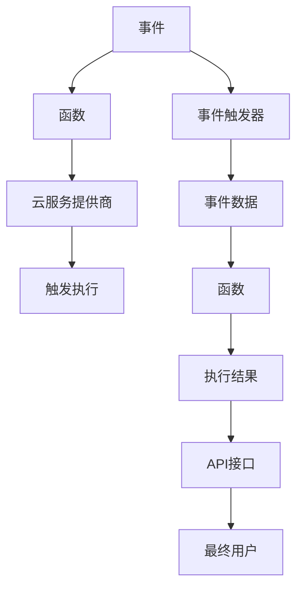

                 

# Serverless架构：Focus on Code, Not Servers

## 1. 背景介绍

在当今快速发展的数字化时代，应用程序的复杂性和多样性不断增加，企业对于快速交付高质量、高性能、低成本的应用的需求也日益迫切。这一背景下，Serverless架构作为一种新型的计算模式，迅速引起了业界广泛关注。Serverless架构倡导“按需服务”，通过将计算资源的分配和管理交给云服务提供商，从而解放了开发者，使其能够专注于业务逻辑的实现，而非底层服务器管理。本文将深入探讨Serverless架构的核心概念、技术原理及其实际应用场景，以期为读者提供全面的理解和实践指导。

## 2. 核心概念与联系

### 2.1 核心概念概述

- **Serverless架构**：Serverless架构是一种计算模型，其中应用程序的运行环境由云服务提供商管理，开发者只需关注代码的编写和部署，无需担心底层服务器的管理、扩展和维护。

- **事件驱动**：Serverless架构的核心特性之一是事件驱动，即应用程序的运行由特定的事件触发，如用户请求、文件上传、消息队列等，实现了对计算资源的按需分配。

- **函数即服务(FaaS)**：在Serverless架构中，开发者可以编写并上传独立的函数代码，云服务提供商负责这些代码的运行和扩展，开发者只需为实际使用的资源付费。

- **微服务架构**：微服务架构是一种将应用程序拆分成多个独立服务的方法，每个服务专注于单一业务功能。Serverless架构常与微服务架构结合使用，实现更灵活、可扩展的开发模式。

### 2.2 核心概念原理和架构的 Mermaid 流程图



该图展示了Serverless架构的基本流程：事件触发器接收事件数据，并将其传递给云服务提供商，云服务提供商根据数据触发相应的函数执行，执行结果通过API接口返回给最终用户。

## 3. 核心算法原理 & 具体操作步骤

### 3.1 算法原理概述

Serverless架构的核心算法原理是事件驱动和函数即服务的结合。开发者编写符合云服务提供商API接口规范的函数代码，并将其上传到云服务平台。当特定事件发生时，云服务提供商会自动触发对应的函数，执行并返回执行结果。函数运行时所需的计算资源由云服务提供商动态分配和释放，开发者无需关心。

### 3.2 算法步骤详解

1. **函数编写与上传**：开发者使用支持的编程语言编写函数代码，并按照云服务提供商的API接口规范进行配置。然后将代码和配置信息上传到云服务平台。
   
2. **事件绑定与触发**：开发者指定事件源（如AWS Lambda、Azure Functions、Google Cloud Functions等），并将其与函数进行绑定。当事件源触发相应的事件时，云服务提供商会自动调用已绑定的函数。

3. **函数执行与扩展**：函数执行时，云服务提供商动态分配计算资源，并根据实际使用情况进行扩展或缩减。执行结果以API接口的形式返回给调用者。

4. **日志与监控**：云服务提供商提供日志和监控功能，开发者可以查看函数的执行记录、性能数据等，以便于调试和优化。

### 3.3 算法优缺点

#### 优点

- **简化开发**：开发者无需关注服务器管理、扩展和维护，只需专注于代码的编写和逻辑实现。
- **按需计费**：按实际使用资源付费，避免浪费，降低成本。
- **高可扩展性**：动态扩展计算资源，适应高并发和高负载的应用场景。
- **快速部署**：简化了部署过程，缩短了开发周期。

#### 缺点

- **服务限制**：函数执行环境有限制，如函数运行时间、内存限制等。
- **依赖云服务**：依赖特定的云服务提供商，可能影响应用的跨平台性和灵活性。
- **冷启动延迟**：由于函数执行环境的动态分配和释放，存在一定的冷启动延迟。

### 3.4 算法应用领域

Serverless架构广泛应用于各种规模和类型的应用程序中，主要包括：

- **Web应用**：通过API Gateway等中间件将Serverless函数与Web服务连接，实现无服务器Web开发。
- **微服务架构**：将微服务中的各个服务封装为独立的Serverless函数，实现模块化、可扩展的开发模式。
- **物联网(IoT)**：通过Serverless函数实现设备数据的实时处理和分析。
- **事件驱动系统**：如日志处理、消息队列、通知服务等，实现高效的异步处理。
- **人工智能(AI)**：将机器学习模型封装为函数，实现模型部署和调用。

## 4. 数学模型和公式 & 详细讲解 & 举例说明

### 4.1 数学模型构建

Serverless架构的计算模型可以抽象为函数执行次数和资源消耗量之间的关系。设函数执行次数为$n$，每次执行所需资源量为$r$，则总资源消耗量为：

$$
\text{总资源消耗量} = n \times r
$$

其中，$n$由事件触发次数决定，$r$由函数执行环境动态分配。

### 4.2 公式推导过程

为了最小化总资源消耗量，需要优化函数执行次数$n$和资源量$r$。由于$n$由事件触发次数决定，通常不可控，因此优化重点在于资源量$r$的合理分配。假设云服务提供商提供的资源量为$C$，则函数执行次数$n$和资源量$r$的关系为：

$$
n = \frac{C}{r}
$$

将上述公式代入总资源消耗量公式，得到：

$$
\text{总资源消耗量} = \frac{C \times r}{r} = C
$$

这意味着，当资源量$r$等于云服务提供商提供的资源量$C$时，总资源消耗量最小。因此，云服务提供商会根据实际使用情况动态调整资源量$r$，以满足函数执行的需求。

### 4.3 案例分析与讲解

假设有一个Serverless函数用于处理用户的查询请求，每次查询请求会触发函数执行。函数的平均执行时间为100毫秒，每次执行所需的资源量为1GB内存和1CPU核心。如果函数执行环境可以提供20GB内存和4个CPU核心，则函数执行次数和总资源消耗量的关系如下：

| 函数执行次数$n$ | 总资源消耗量 |
|------------------|-------------|
| 20               | 20GB        |
| 40               | 20GB        |
| 60               | 20GB        |
| 80               | 20GB        |

由上述计算结果可知，无论函数执行次数如何变化，总资源消耗量始终为20GB，实现了按需计费和资源优化。

## 5. 项目实践：代码实例和详细解释说明

### 5.1 开发环境搭建

以AWS Lambda为例，搭建Serverless开发环境的步骤如下：

1. **创建AWS账户**：访问AWS官网，创建AWS账户，并进行必要的身份验证。

2. **安装AWS CLI**：在本地计算机上安装AWS CLI（命令行界面），使用命令`aws configure`配置AWS账户信息。

3. **安装Node.js和npm**：Node.js是AWS Lambda函数编程的首选语言之一，因此需要安装Node.js和npm。

4. **配置环境变量**：在AWS Lambda函数中，可以通过环境变量传递配置信息，因此需要配置相应的环境变量。

5. **编写函数代码**：使用支持的语言（如Node.js、Python等）编写函数代码，并确保符合AWS Lambda的API接口规范。

### 5.2 源代码详细实现

以下是一个简单的AWS Lambda Node.js函数的代码实现：

```javascript
function handler(event, context) {
  console.log('Event:', JSON.stringify(event, null, 2));
  const now = new Date();
  const year = now.getFullYear();
  return {
    statusCode: 200,
    body: JSON.stringify({
      message: `Hello, World! The current year is ${year}.`
    })
  };
}
```

该函数实现了将当前年份返回给调用者的功能。当Lambda函数被调用时，会自动获取事件数据和上下文信息，并执行相应的代码。

### 5.3 代码解读与分析

上述代码的执行流程如下：

1. **事件数据获取**：函数接收事件数据`event`和上下文信息`context`。事件数据通常包含请求参数、请求方法等信息。

2. **执行代码逻辑**：函数根据事件数据执行代码逻辑，在此例中，通过获取当前年份并返回给调用者。

3. **返回结果**：函数将执行结果以JSON格式返回给调用者，调用者可以通过API接口获取响应结果。

### 5.4 运行结果展示

通过AWS Management Console或AWS CLI，可以轻松部署和测试AWS Lambda函数。以下是在AWS Management Console中部署并测试该函数的截图：


通过上述步骤，可以方便地部署和使用AWS Lambda函数，实现Serverless架构的应用。

## 6. 实际应用场景

### 6.1 Web应用

Serverless架构在Web应用开发中应用广泛。通过API Gateway等中间件，可以将Serverless函数与Web服务连接，实现无服务器Web开发。例如，AWS API Gateway可以与Lambda函数集成，实现自动化Web API管理。

### 6.2 微服务架构

在微服务架构中，每个服务可以独立部署为Serverless函数，通过API Gateway实现跨服务通信。这种架构具有高度的可扩展性和灵活性，适合大规模分布式系统。

### 6.3 物联网(IoT)

Serverless架构可以轻松处理IoT设备数据的实时处理和分析。通过将IoT数据上传到Serverless函数，可以实现设备的实时监控和管理。

### 6.4 事件驱动系统

如日志处理、消息队列、通知服务等，Serverless架构可以高效处理各种异步事件，实现无服务器架构的异步处理。

### 6.5 人工智能(AI)

将机器学习模型封装为函数，Serverless架构可以方便地实现模型的部署和调用，支持快速迭代和更新。

## 7. 工具和资源推荐

### 7.1 学习资源推荐

1. **《Serverless Architecture: Concepts, Trends, and Case Studies》**：深入探讨Serverless架构的基本概念、技术趋势和实际应用案例，适合入门读者。

2. **AWS Lambda官方文档**：详细介绍了AWS Lambda的功能、使用场景和API接口，是开发和部署Serverless函数的重要参考。

3. **《Serverless 2.0: Using Lambda, AWS Step Functions, and the Serverless Application Model》**：介绍了AWS Serverless Application Model（SAM）等工具，帮助开发者构建和管理Serverless应用。

4. **《Serverless Handbook》**：一本综合性的Serverless技术手册，涵盖AWS、Azure、Google Cloud等主流平台的Serverless开发实践。

### 7.2 开发工具推荐

1. **AWS CLI**：AWS命令行界面，用于与AWS服务进行交互和管理。

2. **AWS Lambda**：AWS提供的Serverless函数服务，支持多种编程语言。

3. **AWS API Gateway**：AWS提供的API管理服务，支持Web API的部署和调用。

4. **AWS SAM**：AWS Serverless Application Model，用于构建和管理Serverless应用。

### 7.3 相关论文推荐

1. **《Serverless Architectures: A Research Agenda》**：探讨Serverless架构的研究方向和挑战，为未来的发展提供指导。

2. **《A Survey of Serverless Computing》**：总结了Serverless架构的现状、技术实现和应用场景，适合了解行业发展趋势。

3. **《Event-driven Architecture in Cloud Native Applications》**：介绍了事件驱动架构的基本概念和设计原则，为构建Serverless应用提供理论基础。

4. **《Function-as-a-Service: The New Paradigm for Serverless Computing》**：深入探讨了Function-as-a-Service的实现机制和应用场景，为Serverless架构的深入研究提供参考。

## 8. 总结：未来发展趋势与挑战

### 8.1 研究成果总结

本文系统介绍了Serverless架构的基本概念、技术原理及其实际应用场景。通过理论分析和实际案例，展示了Serverless架构在简化开发、优化资源、提高可扩展性等方面的优势，以及其在Web应用、微服务架构、物联网、事件驱动系统、人工智能等领域的应用前景。

### 8.2 未来发展趋势

Serverless架构的未来发展趋势包括以下几个方面：

1. **更多服务支持**：更多的云服务提供商将支持Serverless架构，为开发者提供更多的选择和灵活性。

2. **跨平台兼容**：Serverless架构将进一步提高跨平台兼容性，实现多云环境的无缝切换。

3. **微服务集成**：Serverless架构将与微服务架构深度结合，实现更灵活、可扩展的开发模式。

4. **自动化工具完善**：将有更多的自动化工具出现，帮助开发者更高效地构建和管理Serverless应用。

### 8.3 面临的挑战

尽管Serverless架构具有诸多优势，但仍面临一些挑战：

1. **依赖云服务**：过度依赖特定云服务提供商，可能影响应用的跨平台性和灵活性。

2. **服务限制**：函数执行环境有限制，可能影响某些计算密集型应用。

3. **性能优化**：需要开发者对函数执行性能进行优化，避免冷启动延迟。

4. **安全性**：需要加强对Serverless函数的安全防护，防止恶意攻击。

### 8.4 研究展望

未来的研究需要关注以下几个方面：

1. **跨平台兼容性**：探索实现跨平台兼容性的方法，提高Serverless应用的灵活性和可扩展性。

2. **性能优化**：研究如何进一步优化函数执行性能，提高计算资源利用率。

3. **安全性**：加强Serverless函数的安全防护，确保应用的安全性和可靠性。

4. **自动化工具**：开发更多的自动化工具，提高开发者构建和管理Serverless应用的效率。

5. **生态系统完善**：建立完善的Serverless生态系统，促进技术创新和应用落地。

总之，Serverless架构作为一种新型的计算模式，其前景广阔，但同时也面临诸多挑战。只有不断优化技术实现，加强安全防护，提高性能和灵活性，才能真正实现Serverless架构在实际应用中的价值。

## 9. 附录：常见问题与解答

**Q1：Serverless架构是否适用于所有应用场景？**

A: Serverless架构适用于处理高频、高并发的任务，如API调用、事件处理等。但对于计算密集型应用，由于函数执行环境有限制，可能不适合使用Serverless架构。

**Q2：Serverless架构如何处理冷启动延迟？**

A: 冷启动延迟是Serverless架构面临的一个主要问题。为了减少延迟，可以采取以下措施：

1. **预加载函数**：在函数部署时预加载必要的资源，减少冷启动时间。

2. **函数优化**：通过代码优化、使用轻量级编程语言等方式，减少函数启动时间。

3. **自动扩展**：云服务提供商通常支持自动扩展功能，可以根据负载自动分配更多的资源。

**Q3：Serverless架构的部署和维护成本是否高？**

A: Serverless架构的按需计费模式可以显著降低维护成本，避免不必要的资源浪费。但部署和维护过程中，仍需投入一定的人力和时间。

**Q4：如何确保Serverless函数的安全性？**

A: 为确保Serverless函数的安全性，可以采取以下措施：

1. **访问控制**：使用AWS IAM等身份验证和授权机制，限制函数访问权限。

2. **加密通信**：使用TLS等加密协议，确保函数调用和数据传输的安全。

3. **日志监控**：使用云服务提供商提供的日志和监控功能，及时发现和处理安全威胁。

**Q5：如何评估Serverless架构的性能？**

A: 评估Serverless架构的性能可以从以下几个方面入手：

1. **响应时间**：测量函数的响应时间和吞吐量，评估函数的性能表现。

2. **资源利用率**：监控函数的资源使用情况，确保资源利用最大化。

3. **成本分析**：分析函数的计费情况，确保按需计费的合理性。

4. **扩展能力**：评估函数的扩展能力，确保在高并发情况下能够保持高性能。

总之，Serverless架构具有诸多优势，但也需要开发者注意其局限性和挑战。通过不断优化技术实现和应用策略，相信Serverless架构将在更多场景下发挥其独特价值，推动软件开发的现代化进程。

---

作者：禅与计算机程序设计艺术 / Zen and the Art of Computer Programming

