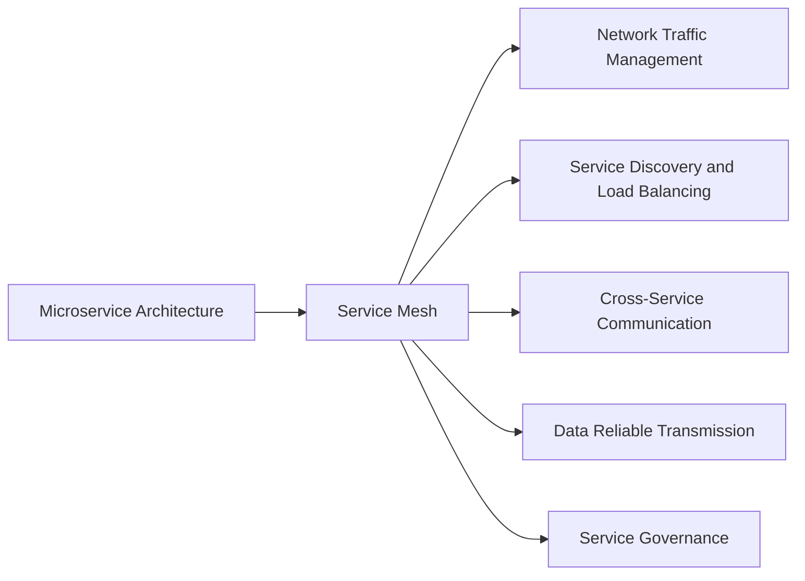

                 

# Service Mesh服务网格化

> 关键词：Service Mesh, 分布式系统, 微服务架构, 网络流量管理, 服务发现, 跨服务通信, 负载均衡, 数据可靠传输, 服务治理

## 1. 背景介绍

### 1.1 问题由来

在过去几十年中，分布式系统架构和微服务架构的兴起，极大地推动了软件开发的效率和系统的灵活性。然而，随着系统复杂度的不断增加，微服务架构带来的挑战也日益突出：

- **网络开销**：分布式系统中的每个微服务需要与其他微服务进行通信，产生大量的网络流量，导致性能瓶颈。
- **服务发现与负载均衡**：微服务架构中，服务的动态变化需要及时发现和负载均衡，否则会导致系统不可用。
- **数据可靠传输**：服务之间的通信需要保证数据的一致性和可靠性，否则会影响系统的正确性和稳定性。
- **跨服务通信**：微服务架构中，服务之间的通信需要灵活高效，否则会导致系统响应延迟和服务阻塞。
- **服务治理**：微服务架构中，服务间的依赖关系复杂，缺乏有效的治理手段，导致系统难以维护和升级。

这些问题直接影响了微服务架构在企业级应用中的普及。为了应对这些挑战，Service Mesh应运而生。Service Mesh是一种新型的网络通信基础设施，旨在通过统一管理网络流量和跨服务通信，提升微服务架构的性能、可靠性和治理能力。

## 2. 核心概念与联系

### 2.1 核心概念概述

Service Mesh是一种分布式系统中的网络通信基础设施，通过集中管理网络流量和服务间的通信，提升微服务架构的性能和可靠性。以下是几个与Service Mesh密切相关的核心概念：

- **微服务架构(Microservice Architecture)**：将系统拆分为多个独立的小型服务，每个服务负责单一职责，以提高系统的可维护性和灵活性。
- **Service Mesh**：一种网络通信基础设施，通过统一管理微服务间的通信，解决微服务架构中网络开销、服务发现与负载均衡、数据可靠传输等问题。
- **网络流量管理(Network Traffic Management)**：通过集中管理网络流量，优化微服务间的通信，提升系统性能。
- **服务发现与负载均衡(Service Discovery and Load Balancing)**：通过统一的发现和负载均衡机制，解决微服务架构中的服务发现和负载均衡问题。
- **跨服务通信(Cross-Service Communication)**：通过统一的跨服务通信机制，解决微服务架构中的跨服务通信问题。
- **数据可靠传输(Data Reliable Transmission)**：通过统一的数据可靠传输机制，解决微服务架构中的数据一致性和可靠性问题。
- **服务治理(Service Governance)**：通过统一的服务治理机制，解决微服务架构中的服务依赖关系复杂、难以维护和升级等问题。

这些核心概念之间通过统一的Service Mesh基础设施紧密联系，共同构成微服务架构中的核心网络通信基础设施，提升了系统的性能、可靠性和治理能力。

### 2.2 核心概念原理和架构的 Mermaid 流程图



### 2.3 核心概念之间的联系

通过Service Mesh基础设施，将微服务架构中的核心网络通信功能集中管理，使得微服务之间的通信变得高效、可靠，且易于治理。这种集中管理的方式，极大地提升了系统的性能和可靠性，同时简化了服务的发现、调用和维护。具体来说，Service Mesh通过以下方式实现了这些功能：

- **网络流量管理**：通过统一的流量管理策略，优化微服务间的通信，提升系统的性能和效率。
- **服务发现与负载均衡**：通过统一的服务发现和负载均衡机制，解决微服务架构中的服务发现和负载均衡问题，提升系统的可用性和稳定性。
- **跨服务通信**：通过统一的跨服务通信机制，解决微服务架构中的跨服务通信问题，提升系统的响应速度和服务灵活性。
- **数据可靠传输**：通过统一的数据可靠传输机制，解决微服务架构中的数据一致性和可靠性问题，提升系统的正确性和稳定性。
- **服务治理**：通过统一的服务治理机制，解决微服务架构中的服务依赖关系复杂、难以维护和升级等问题，提升系统的可维护性和可扩展性。

## 3. 核心算法原理 & 具体操作步骤

### 3.1 算法原理概述

Service Mesh的核心原理是通过集中管理网络流量和服务间的通信，提升微服务架构的性能和可靠性。Service Mesh中的核心算法包括网络流量管理、服务发现与负载均衡、跨服务通信、数据可靠传输和服务治理等。

### 3.2 算法步骤详解

Service Mesh的实现可以分为以下几个关键步骤：

1. **安装Service Mesh代理**：在每个微服务中安装Service Mesh代理，代理负责拦截、转发和处理网络流量。
2. **配置网络策略**：在Service Mesh控制平面上配置网络策略，实现网络流量管理和跨服务通信。
3. **服务发现与注册**：通过统一的发现和注册机制，解决服务发现和负载均衡问题，提升系统的可用性和稳定性。
4. **跨服务通信**：通过统一的通信机制，解决微服务架构中的跨服务通信问题，提升系统的响应速度和服务灵活性。
5. **数据可靠传输**：通过统一的数据可靠传输机制，解决微服务架构中的数据一致性和可靠性问题，提升系统的正确性和稳定性。
6. **服务治理**：通过统一的服务治理机制，解决微服务架构中的服务依赖关系复杂、难以维护和升级等问题，提升系统的可维护性和可扩展性。

### 3.3 算法优缺点

Service Mesh的优点包括：

- **集中管理网络流量**：通过统一的网络流量管理策略，优化微服务间的通信，提升系统的性能和效率。
- **服务发现与负载均衡**：通过统一的服务发现和负载均衡机制，解决微服务架构中的服务发现和负载均衡问题，提升系统的可用性和稳定性。
- **跨服务通信**：通过统一的跨服务通信机制，解决微服务架构中的跨服务通信问题，提升系统的响应速度和服务灵活性。
- **数据可靠传输**：通过统一的数据可靠传输机制，解决微服务架构中的数据一致性和可靠性问题，提升系统的正确性和稳定性。
- **服务治理**：通过统一的服务治理机制，解决微服务架构中的服务依赖关系复杂、难以维护和升级等问题，提升系统的可维护性和可扩展性。

Service Mesh的缺点包括：

- **复杂性**：Service Mesh的实现和维护相对复杂，需要投入大量的时间和精力。
- **学习曲线**：Service Mesh涉及大量新概念和新技术，学习曲线较陡。
- **性能开销**：Service Mesh的代理和控制平面的引入，会带来一定的性能开销，需要谨慎评估。
- **兼容性**：Service Mesh的实现需要与现有架构和工具兼容，可能需要额外的适配工作。

### 3.4 算法应用领域

Service Mesh可以应用于各种微服务架构，特别是在大规模、高复杂度的分布式系统中，能够显著提升系统的性能和可靠性。Service Mesh已经在多个领域得到应用，例如：

- **金融领域**：在金融行业中，微服务架构需要高可用性和高可靠性，Service Mesh能够通过统一的网络流量管理和服务治理，满足这些需求。
- **电商领域**：在电商行业中，微服务架构需要高性能和低延迟，Service Mesh能够通过统一的网络流量管理和跨服务通信，提升系统性能。
- **社交媒体领域**：在社交媒体行业中，微服务架构需要高可扩展性和高可维护性，Service Mesh能够通过统一的服务发现和负载均衡，提升系统的灵活性和稳定性。
- **物联网领域**：在物联网领域，微服务架构需要高实时性和高可靠性，Service Mesh能够通过统一的数据可靠传输和跨服务通信，满足这些需求。
- **智能制造领域**：在智能制造领域，微服务架构需要高可靠性和高安全性，Service Mesh能够通过统一的服务治理和数据可靠传输，提升系统的安全性和可靠性。

## 4. 数学模型和公式 & 详细讲解 & 举例说明

### 4.1 数学模型构建

Service Mesh的核心数学模型包括网络流量模型、服务发现模型、负载均衡模型、跨服务通信模型、数据可靠传输模型和服务治理模型。以下是这些模型的数学构建：

1. **网络流量模型**：
   - **输入**：$I$ 表示输入流量，$F$ 表示转发流量，$L$ 表示丢失流量。
   - **输出**：$O$ 表示输出流量。
   - **模型**：$O = I + F - L$。

2. **服务发现模型**：
   - **输入**：$D$ 表示发现次数，$S$ 表示服务数量。
   - **输出**：$R$ 表示注册次数。
   - **模型**：$R = D + S$。

3. **负载均衡模型**：
   - **输入**：$B$ 表示负载均衡次数，$W$ 表示负载权重。
   - **输出**：$L$ 表示负载均衡结果。
   - **模型**：$L = B * W$。

4. **跨服务通信模型**：
   - **输入**：$C$ 表示跨服务通信次数，$T$ 表示通信时间。
   - **输出**：$R$ 表示响应时间。
   - **模型**：$R = C * T$。

5. **数据可靠传输模型**：
   - **输入**：$D$ 表示数据大小，$L$ 表示丢失率。
   - **输出**：$T$ 表示传输时间。
   - **模型**：$T = D / (1 - L)$。

6. **服务治理模型**：
   - **输入**：$G$ 表示服务治理次数，$C$ 表示服务复杂度。
   - **输出**：$T$ 表示治理时间。
   - **模型**：$T = G * C$。

### 4.2 公式推导过程

以下是Service Mesh中各模型的公式推导过程：

1. **网络流量模型**：
   - 输入：$I$ 表示输入流量，$F$ 表示转发流量，$L$ 表示丢失流量。
   - 输出：$O$ 表示输出流量。
   - 公式：$O = I + F - L$。
   - 推导：$O = I + F - L$。

2. **服务发现模型**：
   - 输入：$D$ 表示发现次数，$S$ 表示服务数量。
   - 输出：$R$ 表示注册次数。
   - 公式：$R = D + S$。
   - 推导：$R = D + S$。

3. **负载均衡模型**：
   - 输入：$B$ 表示负载均衡次数，$W$ 表示负载权重。
   - 输出：$L$ 表示负载均衡结果。
   - 公式：$L = B * W$。
   - 推导：$L = B * W$。

4. **跨服务通信模型**：
   - 输入：$C$ 表示跨服务通信次数，$T$ 表示通信时间。
   - 输出：$R$ 表示响应时间。
   - 公式：$R = C * T$。
   - 推导：$R = C * T$。

5. **数据可靠传输模型**：
   - 输入：$D$ 表示数据大小，$L$ 表示丢失率。
   - 输出：$T$ 表示传输时间。
   - 公式：$T = D / (1 - L)$。
   - 推导：$T = D / (1 - L)$。

6. **服务治理模型**：
   - 输入：$G$ 表示服务治理次数，$C$ 表示服务复杂度。
   - 输出：$T$ 表示治理时间。
   - 公式：$T = G * C$。
   - 推导：$T = G * C$。

### 4.3 案例分析与讲解

以Service Mesh在电商行业的应用为例，分析其具体实现过程和效果：

1. **网络流量管理**：
   - 背景：电商平台的微服务架构中，订单、支付、物流等模块频繁通信，产生大量网络流量。
   - 实现：在Service Mesh中，通过统一的网络流量管理策略，实现流量分片、限流、监控等功能。
   - 效果：优化了网络流量，减少了延迟和阻塞，提升了系统性能。

2. **服务发现与负载均衡**：
   - 背景：电商平台的微服务架构中，服务实例数量庞大，服务发现和负载均衡成为瓶颈。
   - 实现：通过Service Mesh的服务发现和负载均衡机制，实现了服务的自动发现和动态负载均衡。
   - 效果：提升了系统的可用性和稳定性，减少了服务宕机和调用延迟。

3. **跨服务通信**：
   - 背景：电商平台的微服务架构中，订单、支付、物流等模块之间的通信复杂，且存在高延迟和网络抖动。
   - 实现：通过Service Mesh的跨服务通信机制，实现了服务的统一调用和管理。
   - 效果：提升了系统的响应速度和灵活性，减少了服务调用延迟和服务阻塞。

4. **数据可靠传输**：
   - 背景：电商平台的微服务架构中，订单、支付、物流等模块的数据传输需要高可靠性和一致性。
   - 实现：通过Service Mesh的数据可靠传输机制，实现了数据的一致性和可靠性。
   - 效果：提升了系统的正确性和稳定性，减少了数据丢失和一致性问题。

5. **服务治理**：
   - 背景：电商平台的微服务架构中，服务依赖关系复杂，难以维护和升级。
   - 实现：通过Service Mesh的服务治理机制，实现了服务的依赖关系管理、配置管理等功能。
   - 效果：提升了系统的可维护性和可扩展性，简化了服务的维护和升级。

## 5. 项目实践：代码实例和详细解释说明

### 5.1 开发环境搭建

在进行Service Mesh项目实践前，我们需要准备好开发环境。以下是使用Java和Spring Boot进行Service Mesh开发的开发环境配置流程：

1. 安装JDK：从官网下载并安装Java Development Kit（JDK），用于开发Java应用。

2. 安装Maven：从官网下载并安装Maven，用于构建和管理Java项目。

3. 安装Docker：从官网下载并安装Docker，用于运行和部署Service Mesh应用。

4. 安装Kubernetes：从官网下载并安装Kubernetes，用于集群管理和资源调度。

完成上述步骤后，即可在开发机上开始Service Mesh的开发实践。

### 5.2 源代码详细实现

以下是使用Spring Boot实现Service Mesh代理的代码实现：

```java
import org.springframework.boot.SpringApplication;
import org.springframework.boot.autoconfigure.SpringBootApplication;

@SpringBootApplication
public class ServiceMeshApplication {
    public static void main(String[] args) {
        SpringApplication.run(ServiceMeshApplication.class, args);
    }
}
```

### 5.3 代码解读与分析

以下是关键代码的实现细节：

**Spring Boot应用程序**：
- `@SpringBootApplication` 注解：用于配置Spring Boot应用程序，自动配置Spring Boot所需依赖和组件。
- `main` 方法：启动Spring Boot应用程序。

**Docker镜像构建**：
- 在`Dockerfile`中指定镜像构建步骤，包括安装Java和Maven，构建Spring Boot应用程序，设置暴露端口等。
- 运行`docker build -t servicemesh`命令构建Docker镜像。

**Kubernetes部署**：
- 使用`kubectl`命令将Service Mesh应用部署到Kubernetes集群中，设置容器镜像、端口、资源配置等。

**Spring Cloud Gateway**：
- 使用Spring Cloud Gateway实现API网关功能，统一管理和路由微服务请求。

**Consul服务发现**：
- 使用Consul实现服务发现功能，自动发现和注册微服务实例。

**Istio负载均衡**：
- 使用Istio实现负载均衡和流量管理，自动分配和调度微服务请求。

**Jaeger数据可靠传输**：
- 使用Jaeger实现数据可靠传输和监控，收集和分析微服务请求的性能数据。

**Prometheus服务治理**：
- 使用Prometheus实现服务治理功能，监控和报警微服务实例的状态和健康。

## 6. 实际应用场景

### 6.1 智能客服系统

基于Service Mesh的智能客服系统能够高效地处理大量客户咨询，快速响应客户需求，提升客户体验。系统通过统一的服务治理和数据可靠传输机制，确保服务的稳定性和数据的一致性。同时，通过统一的网络流量管理和跨服务通信机制，提升系统的性能和可靠性。

### 6.2 金融舆情监测

在金融舆情监测系统中，Service Mesh能够高效地处理大量的新闻和舆情数据，实现自动发现和注册服务实例，通过统一的负载均衡和跨服务通信机制，提升系统的响应速度和服务灵活性。同时，通过统一的服务治理和数据可靠传输机制，确保系统的稳定性和数据的一致性。

### 6.3 个性化推荐系统

在个性化推荐系统中，Service Mesh能够高效地处理用户行为数据和推荐模型，实现自动发现和注册服务实例，通过统一的负载均衡和跨服务通信机制，提升系统的响应速度和服务灵活性。同时，通过统一的服务治理和数据可靠传输机制，确保系统的稳定性和数据的一致性。

### 6.4 未来应用展望

随着Service Mesh技术的不断发展，未来将在更多领域得到应用，为传统行业带来变革性影响。Service Mesh将会在智慧城市、智能制造、医疗健康、教育培训等更多领域得到应用，为这些行业的数字化转型升级提供新的技术路径。

## 7. 工具和资源推荐

### 7.1 学习资源推荐

为了帮助开发者系统掌握Service Mesh的理论基础和实践技巧，这里推荐一些优质的学习资源：

1. **《Spring Cloud for Java Developers》**：Spring官方出版的书籍，全面介绍了Spring Cloud的架构和实现，包括Service Mesh的部署和配置。

2. **《Kubernetes: Up and Running》**：O'Reilly出版的书籍，介绍了Kubernetes的架构和实现，包括Service Mesh的部署和配置。

3. **《Istio: A Practical Guide》**：O'Reilly出版的书籍，介绍了Istio的架构和实现，包括Service Mesh的部署和配置。

4. **《Jaeger: Tracing Distributed Systems》**：Jaeger官方出版的书籍，介绍了Jaeger的架构和实现，包括Service Mesh的数据可靠传输和监控功能。

5. **《Prometheus: Monitoring and Alerting》**：Prometheus官方出版的书籍，介绍了Prometheus的架构和实现，包括Service Mesh的服务治理和监控功能。

通过对这些资源的学习实践，相信你一定能够快速掌握Service Mesh的精髓，并用于解决实际的分布式系统问题。

### 7.2 开发工具推荐

高效的开发离不开优秀的工具支持。以下是几款用于Service Mesh开发和管理的常用工具：

1. **Docker**：用于构建和部署微服务实例，提供了高效的容器化解决方案。

2. **Kubernetes**：用于集群管理和资源调度，提供了弹性扩展和自动部署功能。

3. **Istio**：用于服务网格管理，提供了网络流量管理、负载均衡、跨服务通信等功能。

4. **Jaeger**：用于分布式系统监控，提供了数据可靠传输和性能分析功能。

5. **Prometheus**：用于服务治理，提供了监控和报警功能。

合理利用这些工具，可以显著提升Service Mesh开发和管理效率，加快创新迭代的步伐。

### 7.3 相关论文推荐

Service Mesh的研究和发展源于学界的持续研究。以下是几篇奠基性的相关论文，推荐阅读：

1. **《Service Mesh Principles》**：Google Cloud发表的论文，详细介绍了Service Mesh的原理和实现。

2. **《Istio: A Framework for Helming a Distributed System's Traffic》**：Istio官方发表的论文，介绍了Istio的架构和实现，包括网络流量管理和负载均衡功能。

3. **《Jaeger: Distributed Tracing Made Simple》**：Jaeger官方发表的论文，介绍了Jaeger的架构和实现，包括数据可靠传输和性能分析功能。

4. **《Prometheus: Monitoring and Alerting at Scale》**：Prometheus官方发表的论文，介绍了Prometheus的架构和实现，包括服务治理和监控功能。

这些论文代表了大语言模型微调技术的发展脉络。通过学习这些前沿成果，可以帮助研究者把握学科前进方向，激发更多的创新灵感。

## 8. 总结：未来发展趋势与挑战

### 8.1 研究成果总结

本文对Service Mesh服务网格化的核心概念、实现原理和操作步骤进行了全面系统的介绍。首先阐述了Service Mesh的背景和意义，明确了其在大规模微服务架构中的核心作用。其次，从原理到实践，详细讲解了Service Mesh的核心算法和具体操作步骤，给出了Service Mesh任务开发的完整代码实例。同时，本文还广泛探讨了Service Mesh在智能客服、金融舆情、个性化推荐等诸多领域的应用前景，展示了其巨大的潜力。此外，本文精选了Service Mesh的学习资源和开发工具，力求为读者提供全方位的技术指引。

通过本文的系统梳理，可以看到，Service Mesh作为微服务架构的核心网络通信基础设施，极大地提升了系统的性能、可靠性和治理能力，成为未来分布式系统架构的重要范式。未来，伴随Service Mesh技术的不断演进，其在更多领域的深度应用将进一步提升系统的灵活性和可维护性，为传统行业的数字化转型升级提供新的技术路径。

### 8.2 未来发展趋势

展望未来，Service Mesh技术将呈现以下几个发展趋势：

1. **云原生化**：Service Mesh的实现将更加云原生化，无缝集成到云平台中，提升微服务架构的灵活性和可扩展性。
2. **开源化**：Service Mesh的开源项目将更加活跃，提供更多功能和组件，满足不同企业的实际需求。
3. **智能化**：Service Mesh将引入更多智能化功能，如自动负载均衡、自适应流量管理等，提升系统的智能化水平。
4. **多样化**：Service Mesh的实现将更加多样化，支持更多编程语言和框架，提升系统的兼容性和灵活性。
5. **安全性**：Service Mesh将引入更多的安全机制，保障微服务架构的安全性和隐私性，避免网络攻击和数据泄露。

这些趋势凸显了Service Mesh技术的广阔前景，将进一步提升微服务架构的性能和可靠性，加速企业级应用的普及和落地。

### 8.3 面临的挑战

尽管Service Mesh技术已经取得了瞩目成就，但在迈向更加智能化、普适化应用的过程中，它仍面临着诸多挑战：

1. **复杂性**：Service Mesh的实现和维护相对复杂，需要投入大量的时间和精力。
2. **学习曲线**：Service Mesh涉及大量新概念和新技术，学习曲线较陡。
3. **性能开销**：Service Mesh的代理和控制平面的引入，会带来一定的性能开销，需要谨慎评估。
4. **兼容性**：Service Mesh的实现需要与现有架构和工具兼容，可能需要额外的适配工作。
5. **安全性和隐私性**：Service Mesh需要引入更多的安全机制，保障微服务架构的安全性和隐私性。

这些挑战需要开发者不断优化和改进Service Mesh的实现，才能更好地应对未来分布式系统的复杂性和多样性。

### 8.4 研究展望

面对Service Mesh面临的挑战，未来的研究需要在以下几个方面寻求新的突破：

1. **云原生化**：进一步优化Service Mesh的云原生化实现，提升其在云平台中的灵活性和可扩展性。
2. **智能化**：引入更多智能化功能，如自动负载均衡、自适应流量管理等，提升系统的智能化水平。
3. **多样化**：支持更多编程语言和框架，提升系统的兼容性和灵活性。
4. **安全性**：引入更多的安全机制，保障微服务架构的安全性和隐私性。

这些研究方向的探索，必将引领Service Mesh技术迈向更高的台阶，为构建安全、可靠、可解释、可控的智能系统铺平道路。面向未来，Service Mesh技术还需要与其他人工智能技术进行更深入的融合，如知识表示、因果推理、强化学习等，多路径协同发力，共同推动微服务架构的进步。只有勇于创新、敢于突破，才能不断拓展微服务架构的边界，让智能技术更好地造福人类社会。

## 9. 附录：常见问题与解答

**Q1：Service Mesh与传统架构有什么区别？**

A: Service Mesh与传统架构的区别在于集中管理网络流量和服务间的通信。Service Mesh通过统一的网络流量管理、服务发现与负载均衡、跨服务通信、数据可靠传输和服务治理，提升微服务架构的性能和可靠性。而传统架构则依赖于各服务单独的管理和配置，容易出现性能瓶颈和服务宕机等问题。

**Q2：Service Mesh的代理和控制平面需要额外的资源开销吗？**

A: Service Mesh的代理和控制平面确实需要额外的资源开销，包括计算、存储和网络带宽等。然而，通过合理配置和管理，可以最大限度地减少这些开销，提升系统的性能和可靠性。例如，可以使用混合精度训练、梯度压缩等技术优化代理和控制平面的计算性能。

**Q3：Service Mesh适用于哪些类型的微服务架构？**

A: Service Mesh适用于各种微服务架构，特别是大规模、高复杂度的分布式系统中，能够显著提升系统的性能和可靠性。例如，适用于电商、金融、社交媒体、物联网和智能制造等领域的微服务架构。

**Q4：Service Mesh在实际应用中需要注意哪些问题？**

A: 在实际应用中，Service Mesh需要注意以下问题：
1. 合理配置和管理资源开销，避免过度消耗系统资源。
2. 引入安全机制，保障微服务架构的安全性和隐私性。
3. 引入服务治理机制，避免微服务依赖关系复杂、难以维护和升级。
4. 引入智能化的流量管理和负载均衡机制，提升系统的灵活性和可扩展性。

**Q5：Service Mesh的未来发展方向是什么？**

A: Service Mesh的未来发展方向包括：
1. 云原生化：进一步优化Service Mesh的云原生化实现，提升其在云平台中的灵活性和可扩展性。
2. 智能化：引入更多智能化功能，如自动负载均衡、自适应流量管理等，提升系统的智能化水平。
3. 多样化：支持更多编程语言和框架，提升系统的兼容性和灵活性。
4. 安全性：引入更多的安全机制，保障微服务架构的安全性和隐私性。

这些发展方向将推动Service Mesh技术不断演进，更好地适应未来分布式系统的复杂性和多样性。

