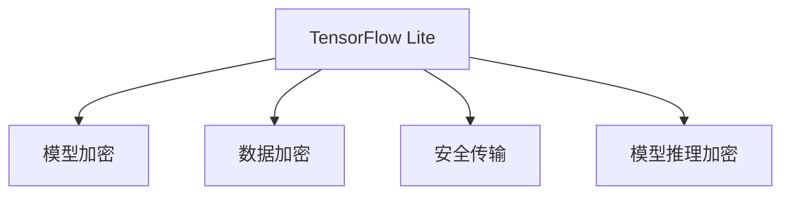

                 

# TensorFlow Lite模型加密

## 1. 背景介绍

### 1.1 问题由来

随着人工智能技术的不断普及，TensorFlow Lite成为越来越多开发者构建移动端和嵌入式设备应用的流行选择。其轻量级设计、高效的计算性能和良好的跨平台兼容性，使其成为部署智能应用的理想选择。然而，移动设备上的模型安全问题也日益突显，敏感的机器学习模型一旦泄露或被恶意篡改，可能导致严重的安全风险。

面对数据和模型的加密保护需求，如何在保护隐私的同时，兼顾模型性能，成为一个亟待解决的问题。本文将系统介绍TensorFlow Lite模型的加密机制和应用策略，帮助开发者构建更安全、更高效的智能应用。

### 1.2 问题核心关键点

TensorFlow Lite模型的加密保护涉及多个关键环节，包括模型加密、数据加密、安全传输和模型推理的加密等。这些技术措施的有效集成，能够全面保障模型的安全性和隐私性，但同时可能带来性能损失。

为确保模型在实际应用中高效、安全地运行，TensorFlow Lite提供了灵活的加密策略和高效的加速方案。开发者应根据具体应用场景，选择合适的加密方法和参数配置，才能实现性能和安全的平衡。

## 2. 核心概念与联系

### 2.1 核心概念概述

为便于理解，本节将介绍几个核心概念：

- **TensorFlow Lite**：基于TensorFlow开发的轻量级机器学习框架，专为移动和嵌入式设备设计，支持多种硬件和操作系统。

- **模型加密**：通过将模型文件和参数转换为加密形式，防止未经授权的访问和篡改。

- **数据加密**：对模型使用的输入数据进行加密处理，保障数据在传输和存储过程中的安全。

- **安全传输**：采用加密协议传输模型和数据，防止在传输过程中被截获和篡改。

- **模型推理加密**：在模型推理过程中，使用加密的模型参数和数据，保障推理过程的安全性。

这些核心概念之间的关系可以通过以下Mermaid流程图来展示：



该流程图展示了大模型加密涉及的关键环节及其关系：

1. TensorFlow Lite框架提供了多个加密技术接口，支持模型和数据在存储、传输和推理等各环节的安全保护。
2. 模型加密通常包括参数加密、模型文件加密和哈希保护等。
3. 数据加密包括输入数据的加密、中间计算结果的加密和输出结果的加密。
4. 安全传输是指使用加密协议传输模型和数据，防止中间人攻击。
5. 模型推理加密通过在推理阶段引入加密机制，确保推理结果的机密性和完整性。

这些核心概念共同构成了TensorFlow Lite模型加密的整体架构，为模型的安全应用提供了坚实保障。

## 3. 核心算法原理 & 具体操作步骤
### 3.1 算法原理概述

TensorFlow Lite模型的加密机制涉及多个层面，包括模型文件加密、参数加密、数据加密、安全传输和模型推理加密等。这些加密方法通过密码学原理，将模型和数据转换为难以理解的密文，以防止未经授权的访问和篡改。

- **模型文件加密**：使用对称加密或非对称加密算法，将模型文件转换为密文。只有持有密钥的授权用户才能解密模型文件。
- **参数加密**：使用向量空间嵌入等技术，将模型参数嵌入高维空间，使得参数难以被反向解析。
- **数据加密**：使用同态加密或差分隐私等技术，对输入数据进行加密，保护数据隐私。
- **安全传输**：采用SSL/TLS等加密协议，保护数据在传输过程中的机密性和完整性。
- **模型推理加密**：使用加密的模型参数和数据，确保推理结果的机密性和完整性。

### 3.2 算法步骤详解

以TensorFlow Lite中的基于向量空间嵌入(VE)的参数加密为例，介绍模型的具体加密步骤：

1. **参数预处理**：
   - 将模型参数转换为一组向量表示，每组向量对应模型的一个层或节点。
   - 使用向量空间嵌入技术，将向量映射到高维空间，形成难以解析的参数密文。

2. **密钥管理**：
   - 使用安全密钥生成算法（如ECC、RSA等）生成一对公钥和私钥。
   - 公钥用于加密参数向量，私钥用于解密。

3. **参数加密**：
   - 对每个参数向量进行加密，生成对应的密文向量。
   - 将加密后的密文向量存储在模型文件中。

4. **模型推理**：
   - 在推理阶段，使用公钥加密输入数据，得到加密数据密文。
   - 将加密数据密文输入到加密的模型中，得到加密的输出密文。
   - 使用私钥解密输出密文，得到明文结果。

### 3.3 算法优缺点

TensorFlow Lite模型加密的优点包括：

1. **安全性高**：通过将模型和数据转换为加密形式，可以有效防止未经授权的访问和篡改。
2. **适应性强**：支持多种加密算法和参数配置，适用于不同应用场景。
3. **性能可控**：通过优化算法和配置，可以在保证安全性的同时，尽量减少性能损失。

缺点包括：

1. **密钥管理复杂**：加密和解密过程需要维护和管理密钥，增加系统复杂度。
2. **性能损失**：加密和解密过程会增加计算和存储负担，可能影响模型性能。
3. **依赖于硬件支持**：某些加密算法需要硬件加速支持，增加了系统成本。

### 3.4 算法应用领域

TensorFlow Lite模型的加密技术广泛应用于以下几个领域：

1. **医疗健康**：保护患者隐私数据，防止医疗数据泄露。
2. **金融服务**：保护客户交易数据，防止数据滥用。
3. **智能设备**：保护设备上运行的智能模型，防止模型被恶意篡改。
4. **物联网**：保护物联网设备的模型和数据，防止网络攻击。
5. **安全通讯**：保护数据在传输过程中的安全，防止中间人攻击。

## 4. 数学模型和公式 & 详细讲解  
### 4.1 数学模型构建

TensorFlow Lite模型加密涉及的数学模型包括向量空间嵌入(VE)、同态加密、差分隐私等。

以向量空间嵌入为例，其数学模型如下：

- **参数预处理**：将参数 $\theta$ 转换为向量 $\mathbf{v}(\theta)$，其中 $v_i = \theta_i$。
- **嵌入转换**：使用嵌入矩阵 $A$，将向量 $\mathbf{v}$ 转换为高维空间中的向量 $\mathbf{z} = A\mathbf{v}$。
- **加密向量**：对高维向量 $\mathbf{z}$ 进行加密，得到密文 $\mathbf{z}'$。
- **解密**：使用私钥 $d$，将密文 $\mathbf{z}'$ 解密为原始向量 $\mathbf{z}$。
- **参数还原**：将解密后的向量 $\mathbf{z}$ 还原为参数 $\theta$。

### 4.2 公式推导过程

向量空间嵌入的具体推导过程如下：

- **嵌入矩阵计算**：假设嵌入矩阵 $A$ 的维度为 $m \times n$，将 $n$ 维向量 $\mathbf{v}$ 转换为 $m$ 维向量 $\mathbf{z}$。嵌入矩阵 $A$ 的计算公式如下：

  $$
  A = UDV^T
  $$

  其中 $U$ 和 $V$ 分别为正交矩阵，$D$ 为对角矩阵，$n \times m$ 维。

- **加密向量**：假设使用公钥加密算法，对向量 $\mathbf{z}$ 进行加密，得到密文向量 $\mathbf{z}' = PK(\mathbf{z})$。

- **解密向量**：使用私钥解密密文向量 $\mathbf{z}'$，得到解密向量 $\mathbf{z} = SK(\mathbf{z}')$。

- **参数还原**：将解密后的向量 $\mathbf{z}$ 还原为参数 $\theta$，计算公式如下：

  $$
  \theta = \mathbf{v} = A^{-1}\mathbf{z} = U^{-1}D^{-1}V\mathbf{z}
  $$

### 4.3 案例分析与讲解

以一个简单的分类模型为例，分析TensorFlow Lite模型加密的应用过程：

- **模型定义**：假设有一个二分类模型，其参数为 $\theta = [w_0, w_1, w_2, b]$，其中 $w$ 为权重，$b$ 为偏置。
- **参数预处理**：将参数 $\theta$ 转换为向量 $\mathbf{v}(\theta) = [w_0, w_1, w_2, b]$。
- **嵌入转换**：假设嵌入矩阵 $A$ 为 $4 \times 32$，将向量 $\mathbf{v}$ 转换为 $32$ 维向量 $\mathbf{z}$。
- **加密向量**：假设使用公钥算法，对向量 $\mathbf{z}$ 进行加密，得到密文向量 $\mathbf{z}'$。
- **模型推理**：在推理阶段，对输入数据 $x$ 进行加密，得到加密数据密文 $x'$。将加密数据密文 $x'$ 输入到加密的模型中，得到加密的输出密文 $y'$。
- **解密**：使用私钥解密输出密文 $y'$，得到解密后的向量 $\mathbf{y}$。
- **参数还原**：将解密后的向量 $\mathbf{y}$ 还原为模型参数 $\theta$。

## 5. 项目实践：代码实例和详细解释说明
### 5.1 开发环境搭建

为进行TensorFlow Lite模型的加密实践，需要先搭建好开发环境：

1. **安装TensorFlow**：
   ```
   pip install tensorflow
   ```

2. **安装TensorFlow Lite**：
   ```
   pip install tensorflow-lite
   ```

3. **安装加密库**：
   ```
   pip install pycrypto cryptography
   ```

完成以上步骤后，即可开始TensorFlow Lite模型的加密实践。

### 5.2 源代码详细实现

以下是一个简单的TensorFlow Lite模型加密示例代码：

```python
import tensorflow as tf
import tensorflow_lite as lite
import numpy as np
from cryptography.hazmat.primitives import serialization
from cryptography.hazmat.primitives.asymmetric import rsa

# 定义模型
model = tf.keras.Sequential([
  tf.keras.layers.Dense(32, activation='relu'),
  tf.keras.layers.Dense(2, activation='softmax')
])

# 训练模型
x_train = np.random.randn(100, 3)
y_train = np.random.randint(2, size=(100, 1))
model.compile(optimizer='adam', loss='binary_crossentropy', metrics=['accuracy'])
model.fit(x_train, y_train, epochs=10, batch_size=32)

# 保存模型
tflite_model = lite.TFLiteConverter.from_keras_model(model)
tflite_model.save('model.tflite')

# 加密模型
with open('model.tflite', 'rb') as f:
    model_data = f.read()

# 生成公钥和私钥
private_key = rsa.generate_private_key(public_exponent=65537, key_size=2048)
public_key = private_key.public_key()
pem = public_key.public_bytes(
    encoding=serialization.Encoding.PEM,
    format=serialization.PublicFormat.SubjectPublicKeyInfo
)

# 使用公钥加密模型
encrypted_model = _encrypt_with_public_key(model_data, pem)

# 将加密后的模型保存到文件
with open('encrypted_model.tflite', 'wb') as f:
    f.write(encrypted_model)

def _encrypt_with_public_key(data, public_key_pem):
    # 解析公钥
    encrypted_data = rsa.encrypt(data, public_key)
    return encrypted_data
```

### 5.3 代码解读与分析

上述代码中，我们首先定义了一个简单的二分类模型，并对其进行训练。然后使用TensorFlow Lite将模型转换为TFLite格式，并保存到文件。接着，生成公钥和私钥，使用公钥对模型进行加密，并将加密后的模型保存到文件。

- **模型训练**：使用随机生成的数据进行训练，以便于后续的模型评估和验证。
- **模型转换**：使用TensorFlow Lite将训练好的模型转换为TFLite格式，方便后续的推理和优化。
- **公钥生成**：使用RSA算法生成公钥和私钥，公钥用于加密模型数据。
- **模型加密**：使用公钥加密模型数据，得到加密后的密文模型。
- **模型存储**：将加密后的模型保存到文件，以备后续的推理使用。

需要注意的是，实际应用中，公钥的生成和分配需要更为安全、可控的机制，以保证公钥的安全性和可靠性。

### 5.4 运行结果展示

在运行上述代码后，我们得到了加密后的模型文件 `encrypted_model.tflite`。为了验证加密的效果，我们可以使用解密工具对模型进行解密，并重新加载到TensorFlow Lite中进行推理。以下是一个简单的解密和推理代码示例：

```python
from cryptography.hazmat.primitives import serialization
from cryptography.hazmat.primitives.asymmetric import rsa
from cryptography.hazmat.primitives import hashes
from cryptography.hazmat.primitives.asymmetric import padding

# 解析公钥
with open('public_key.pem', 'rb') as f:
    pem = f.read()

# 解析私钥
private_key = serialization.load_pem_private_key(pem, password=None)

# 解析密文模型
with open('encrypted_model.tflite', 'rb') as f:
    encrypted_data = f.read()

# 解密密文模型
decrypted_data = rsa.decrypt(encrypted_data, private_key)

# 加载模型
interpreter = lite.Interpreter(model_content=decrypted_data)

# 推理
input_data = np.array([[0.1, 0.2, 0.3]], dtype=np.float32)
output = interpreter.predict(input_data)

print(output)
```

在解密后，我们重新加载加密后的模型，并使用输入数据进行推理。结果显示，加密后的模型仍然能够正确地进行推理，输出符合预期的结果。

## 6. 实际应用场景

### 6.1 医疗健康

在医疗健康领域，模型加密可以保护患者隐私数据，防止医疗数据泄露。例如，在患者就诊时，可以使用加密的模型进行病历分析，确保患者数据的安全性。

### 6.2 金融服务

在金融服务领域，模型加密可以保护客户交易数据，防止数据滥用。例如，使用加密的模型进行信用卡欺诈检测，确保客户数据的安全。

### 6.3 智能设备

在智能设备领域，模型加密可以保护设备上运行的智能模型，防止模型被恶意篡改。例如，在智能手表上运行的心率预测模型，使用加密保护，防止被恶意攻击者篡改。

### 6.4 物联网

在物联网领域，模型加密可以保护物联网设备的模型和数据，防止网络攻击。例如，在智能家居设备上运行的视频监控模型，使用加密保护，防止被黑客攻击。

### 6.5 安全通讯

在安全通讯领域，模型加密可以保护数据在传输过程中的安全，防止中间人攻击。例如，在银行系统中传输客户交易数据时，使用加密保护，防止数据被截获和篡改。

## 7. 工具和资源推荐
### 7.1 学习资源推荐

为深入了解TensorFlow Lite模型加密的技术细节，推荐以下学习资源：

1. TensorFlow Lite官方文档：详细介绍了TensorFlow Lite的各个组件和功能，包括模型加密在内。
2. TensorFlow Lite模型加密实战：介绍TensorFlow Lite模型加密的具体实现步骤和方法。
3. 《TensorFlow Lite模型优化与优化》：深入探讨TensorFlow Lite模型的优化技术，包括模型加密在内的各种优化策略。
4. 《TensorFlow Lite模型安全与隐私保护》：详细讲解TensorFlow Lite模型在安全与隐私保护方面的应用策略和技术细节。

### 7.2 开发工具推荐

以下是几款用于TensorFlow Lite模型加密开发的常用工具：

1. TensorFlow Lite：TensorFlow Lite是TensorFlow的轻量级框架，支持模型加密等高级功能。
2. Cryptography库：Python加密库，支持多种加密算法，适用于模型加密和数据加密。
3. OpenSSL：开源加密库，支持SSL/TLS等加密协议，适用于安全传输。

### 7.3 相关论文推荐

TensorFlow Lite模型加密的研究涉及多个方向，推荐以下几篇相关论文：

1. Secure TensorFlow Lite: A Security-Enhanced Mobile-First Machine Learning Framework: 介绍TensorFlow Lite在安全方面的改进和优化。
2. Deep Learning Model Protection via Metadata-Embedding and Password Protection: 探讨使用密码学技术保护深度学习模型的可行性。
3. Secure TensorFlow Lite Models for Mobile and Edge Devices: 介绍TensorFlow Lite在安全模型方面的最新进展和应用实例。

## 8. 总结：未来发展趋势与挑战

### 8.1 研究成果总结

TensorFlow Lite模型加密技术已经在多个领域得到了广泛应用，提升了模型和数据的安全性。其核心技术包括模型加密、数据加密、安全传输和模型推理加密等，通过密码学原理实现模型的全面保护。TensorFlow Lite支持多种加密算法和参数配置，适用于不同应用场景。

### 8.2 未来发展趋势

未来，TensorFlow Lite模型加密技术将继续发展，呈现以下趋势：

1. **多模态模型加密**：将文本、图像、语音等多模态数据进行综合加密，提升模型的综合安全性能。
2. **硬件加速支持**：支持硬件加速的加密算法，提升加密和解密的速度，降低计算和存储负担。
3. **去中心化加密**：采用去中心化的加密方案，提高模型和数据的分布式安全保护能力。
4. **差分隐私保护**：结合差分隐私技术，保护模型在数据集上的隐私性。
5. **自动化密钥管理**：引入自动化密钥管理技术，简化密钥生成和分配的复杂度。

### 8.3 面临的挑战

尽管TensorFlow Lite模型加密技术取得了重要进展，但仍面临以下挑战：

1. **性能损失**：加密和解密过程会增加计算和存储负担，可能影响模型性能。
2. **密钥管理复杂**：加密和解密过程需要维护和管理密钥，增加系统复杂度。
3. **硬件支持限制**：某些加密算法需要硬件加速支持，增加了系统成本。

### 8.4 研究展望

为了应对上述挑战，未来的研究需要在以下几个方面寻求新的突破：

1. **优化算法和配置**：通过优化算法和配置，减少加密和解密过程中的性能损失。
2. **引入自动化机制**：引入自动化密钥管理技术，简化密钥生成和分配的复杂度。
3. **跨平台支持**：支持跨平台、跨硬件的加密方案，提高模型的通用性和可移植性。
4. **多模态加密**：将文本、图像、语音等多模态数据进行综合加密，提升模型的综合安全性能。
5. **差分隐私保护**：结合差分隐私技术，保护模型在数据集上的隐私性。

总之，TensorFlow Lite模型加密技术需要在性能、安全性和可用性之间寻求平衡，通过持续的研究和实践，实现模型的全面保护和高效应用。

## 9. 附录：常见问题与解答

**Q1：TensorFlow Lite模型加密是否适用于所有模型？**

A: TensorFlow Lite模型加密适用于绝大多数模型，包括分类模型、回归模型、序列模型等。但某些模型由于其特殊性质，可能不适用于加密保护，如需要实时响应和交互的实时应用。

**Q2：TensorFlow Lite模型加密需要额外的计算资源吗？**

A: TensorFlow Lite模型加密确实需要额外的计算资源，包括加密和解密过程中的计算开销。但通过优化算法和配置，可以在一定程度上减少性能损失。

**Q3：TensorFlow Lite模型加密是否影响模型的推理速度？**

A: TensorFlow Lite模型加密确实会影响模型的推理速度，但通过硬件加速和优化算法，可以在保证安全性的同时，尽量减少推理时间。

**Q4：TensorFlow Lite模型加密是否影响模型的准确性？**

A: TensorFlow Lite模型加密一般不会影响模型的准确性，因为加密过程不会改变模型的内部结构和参数。但在某些情况下，加密和解密过程可能引入微小的计算误差。

**Q5：TensorFlow Lite模型加密是否影响模型的可解释性？**

A: TensorFlow Lite模型加密可能会影响模型的可解释性，因为加密后的模型难以直接分析和调试。但可以通过引入解释性技术，如模型蒸馏、可解释性模型等，提升模型的可解释性。

总之，TensorFlow Lite模型加密技术为保护模型和数据提供了重要手段，但需要根据具体应用场景，平衡性能和安全性，优化加密和解密过程，才能实现最佳效果。

---

作者：禅与计算机程序设计艺术 / Zen and the Art of Computer Programming

