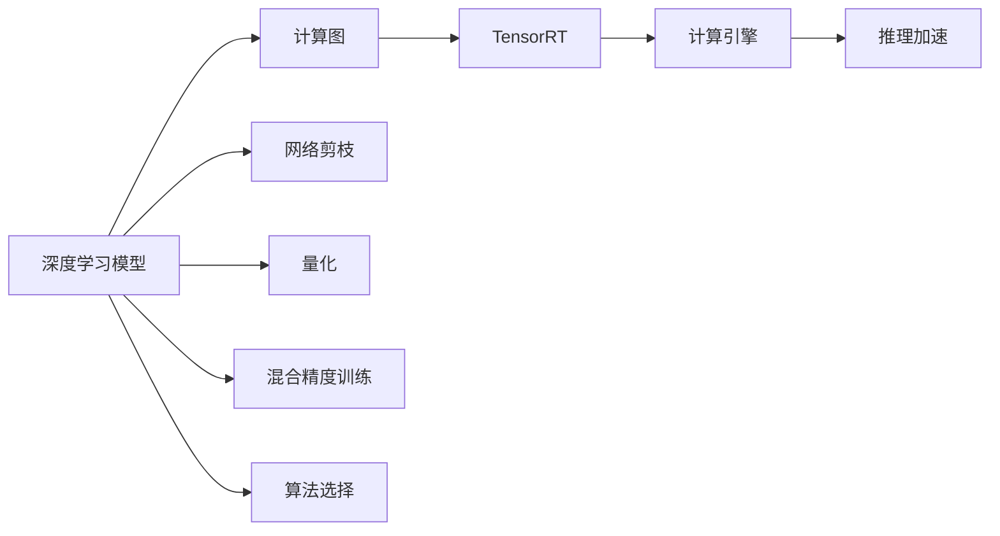

                 

# TensorRT 优化库：加速深度学习推理

> 关键词：TensorRT, 深度学习推理, 优化, 加速, Inference Engine

## 1. 背景介绍

### 1.1 问题由来

深度学习技术的蓬勃发展，使得深度学习模型在图像识别、语音识别、自然语言处理等众多领域取得了突破性进展。但这些模型在推理阶段（Inference）的性能往往受限于计算资源和设备硬件，难以满足实时性、低延迟的应用需求，如自动驾驶、工业控制、移动设备等。为了解决这一问题，NVIDIA推出了TensorRT优化库，利用其优化的加速引擎，使得深度学习推理能够高效、快速地在多种硬件设备上执行。

### 1.2 问题核心关键点

TensorRT的核心理念是利用深度学习模型的计算图结构，将其转换为高效运行的计算引擎，并通过特殊的优化算法，提升推理速度和资源利用率。通过TensorRT，深度学习模型可以从几百倍甚至上千倍的计算性能提升中获益，显著缩短推理耗时，降低硬件成本，成为实现高性能推理的重要工具。

TensorRT提供了一套完整的工具链，包括模型优化、引擎生成、推理部署等各个环节，使得深度学习模型能够以最少的资源消耗，获得最高的推理效率。TensorRT的优化技术包括但不限于：网络剪枝、量化、混合精度训练、算法选择等，能够最大化地提升推理性能。

TensorRT的应用范围非常广泛，涵盖了从云端到边缘的各种计算平台。在服务器端，TensorRT可以用于加速大规模深度学习推理任务；在移动设备上，TensorRT可以提供轻量级的推理引擎，支持实时视频处理、智能交互等应用；在嵌入式设备上，TensorRT能够高效地执行推理计算，满足低功耗、高性能的要求。

### 1.3 问题研究意义

研究TensorRT优化库，对于加速深度学习推理、提升模型性能、降低计算成本，具有重要意义：

1. 提升推理效率。TensorRT能够显著提升深度学习模型的推理速度，满足实时性、低延迟的应用需求。
2. 降低硬件成本。TensorRT通过硬件加速和优化算法，使得深度学习模型能够在相对廉价硬件上高效执行。
3. 支持多样化平台。TensorRT能够适配从云端到边缘的各种计算平台，满足不同场景下的计算需求。
4. 优化模型结构。TensorRT提供网络剪枝、量化等技术，有助于模型结构优化，减少内存和计算资源的消耗。
5. 增强模型部署。TensorRT的推理部署工具能够简化模型集成和部署，提高开发效率。

TensorRT作为深度学习推理加速的重要工具，已经广泛应用于各个领域，成为实现高性能推理的必备选择。

## 2. 核心概念与联系

### 2.1 核心概念概述

为了更好地理解TensorRT优化库，本节将介绍几个密切相关的核心概念：

- **TensorRT**：NVIDIA推出的深度学习推理优化引擎，能够将深度学习模型转换为高效运行的计算引擎，提升推理速度和资源利用率。
- **深度学习推理（Inference）**：利用训练好的深度学习模型，对新的数据进行实时处理和预测的过程。
- **计算图（Computation Graph）**：深度学习模型的核心组成部分，通过计算图，可以描述模型结构、数据流动和计算顺序。
- **计算引擎（Computation Engine）**：TensorRT的核心组件，用于优化和加速计算图，提升推理效率。
- **网络剪枝（Network Pruning）**：减少深度学习模型的参数和结构，提升推理速度和资源利用率。
- **量化（Quantization）**：将浮点计算转换为定点计算，减少存储空间和计算资源消耗。
- **混合精度训练（Mixed-Precision Training）**：使用混合精度（如FP16、FP32）进行训练，加速模型收敛速度，提升推理效率。
- **算法选择（Algorithm Selection）**：根据不同的硬件设备和计算需求，选择最适合的推理算法。

这些核心概念之间的逻辑关系可以通过以下Mermaid流程图来展示：



这个流程图展示了大语言模型的核心概念及其之间的关系：

1. 深度学习模型通过计算图描述其结构和数据流动。
2. TensorRT通过优化计算图，生成高效的计算引擎。
3. 计算引擎执行推理加速，提升模型性能。
4. 网络剪枝、量化、混合精度训练、算法选择等技术，都是TensorRT提升推理效率的重要手段。

这些概念共同构成了TensorRT优化库的核心框架，使得深度学习模型能够在各种计算平台上高效运行。

## 3. 核心算法原理 & 具体操作步骤
### 3.1 算法原理概述

TensorRT的优化过程，本质上是对深度学习模型的计算图进行转换和优化，最终生成高效的推理引擎。其核心算法原理包括网络剪枝、量化、混合精度训练、算法选择等技术。

### 3.2 算法步骤详解

TensorRT的优化过程一般包括以下几个关键步骤：

**Step 1: 模型构建与导出**

- 在训练好的深度学习模型上，使用TensorRT的Builder API构建计算图。
- 将计算图导出为TensorRT工程，包含模型结构、输入输出、优化参数等关键信息。

**Step 2: 优化引擎生成**

- 使用TensorRT的Compiler API对TensorRT工程进行优化，生成高效推理引擎。
- 优化过程中，TensorRT会自动进行网络剪枝、量化、混合精度训练等操作。
- 生成的推理引擎可以适配多种硬件设备，如CPU、GPU、移动设备等。

**Step 3: 推理部署**

- 将生成的推理引擎部署到目标硬件设备上。
- 使用TensorRT的Runtime API进行推理计算，读取输入数据并输出预测结果。
- 推理过程中，TensorRT的计算引擎会根据硬件特性和算法选择进行动态优化，确保高效执行。

**Step 4: 性能调优**

- 使用TensorRT提供的调试工具，分析推理性能瓶颈，进行调优。
- 可以选择动态算法选择、网络剪枝等策略进一步提升性能。

### 3.3 算法优缺点

TensorRT优化库具有以下优点：

1. 高效的推理加速。TensorRT能够显著提升深度学习模型的推理速度，满足实时性、低延迟的应用需求。
2. 强大的硬件适配。TensorRT支持多种硬件平台，能够高效地适配CPU、GPU、移动设备等。
3. 丰富的优化技术。TensorRT提供了网络剪枝、量化、混合精度训练、算法选择等技术，提升推理效率和资源利用率。
4. 简单的使用接口。TensorRT提供了丰富的API和工具，简化模型优化和部署过程，提高开发效率。

同时，TensorRT也存在一定的局限性：

1. 对模型结构要求高。TensorRT要求深度学习模型具有清晰、简洁的计算图结构，否则可能无法进行有效优化。
2. 不支持所有模型。TensorRT支持的模型和算法有一定限制，对于某些复杂的深度学习模型，可能无法进行完美优化。
3. 学习曲线陡峭。TensorRT的优化技术较为复杂，需要开发者具备一定的深度学习优化经验。

尽管存在这些局限性，但就目前而言，TensorRT是实现高性能推理的优秀工具，其优化效果和应用广度得到了广泛认可。

### 3.4 算法应用领域

TensorRT优化库在深度学习推理中具有广泛的应用领域，涵盖以下多个方面：

- **计算机视觉**：如图像分类、目标检测、图像分割等任务。TensorRT能够高效地执行卷积神经网络（CNN）推理，提升推理速度和准确率。
- **语音识别**：如语音转文本、情感分析等任务。TensorRT能够加速深度学习模型在语音信号处理中的应用。
- **自然语言处理**：如文本分类、问答系统、机器翻译等任务。TensorRT能够支持高效的文本处理和推理计算。
- **工业控制**：如视觉检测、机器视觉引导等任务。TensorRT能够满足实时性、低延迟的应用需求。
- **智能交互**：如智能音箱、智能家居等任务。TensorRT能够支持高效的交互式推理。

除了这些应用场景外，TensorRT还被广泛应用于自动驾驶、医疗影像、游戏引擎、增强现实等领域，为深度学习模型的落地应用提供了强大的支持。

## 4. 数学模型和公式 & 详细讲解 & 举例说明

### 4.1 数学模型构建

本节将使用数学语言对TensorRT优化库进行更加严格的刻画。

设深度学习模型为 $M$，其中包含 $N$ 层神经网络，每一层为 $L$，每层具有 $M$ 个神经元。假设 $x_0$ 为输入数据，$x_N$ 为输出数据，则深度学习模型的前向传播计算过程可以表示为：

$$
x_i = f(x_{i-1}, W_i), \quad i=1,2,\dots,N
$$

其中 $f$ 为激活函数，$W_i$ 为权重矩阵。

### 4.2 公式推导过程

在TensorRT中，深度学习模型被转换为计算图（Computation Graph）进行优化和推理。TensorRT优化过程的数学推导较为复杂，涉及网络剪枝、量化、混合精度训练、算法选择等多个方面。

以网络剪枝为例，假设模型某一层的权重矩阵为 $W$，剪枝的目标是将部分权重设置为0，使得模型结构更加简洁。假设剪枝后保留的权重数量为 $k$，则剪枝后的计算过程可以表示为：

$$
x'_i = f'(x_{i-1}, W'_i), \quad i=1,2,\dots,N
$$

其中 $W'_i$ 为剪枝后的权重矩阵，包含 $k$ 个非零元素。

TensorRT在剪枝过程中，会根据模型结构、输入输出、计算图等关键信息，选择最佳的剪枝策略，以最大化地提升推理速度和资源利用率。

### 4.3 案例分析与讲解

假设有一个包含5个卷积层的深度学习模型，用于图像分类任务。以下是TensorRT对模型进行优化的案例分析：

1. **网络剪枝**：TensorRT会对模型进行网络剪枝，删除部分冗余的卷积核和全连接层，只保留对输出有显著影响的权重。
2. **量化**：TensorRT将浮点计算转换为定点计算，将计算精度降低到固定位数，减少内存和计算资源的消耗。
3. **混合精度训练**：TensorRT在模型训练过程中使用混合精度（如FP16、FP32），加速模型收敛速度，提升推理效率。
4. **算法选择**：TensorRT根据硬件设备和计算需求，选择最适合的推理算法，提升推理速度和资源利用率。

在优化过程中，TensorRT会根据实际应用场景，动态调整参数，以达到最优的推理效果。

## 5. 项目实践：代码实例和详细解释说明
### 5.1 开发环境搭建

在进行TensorRT优化实践前，我们需要准备好开发环境。以下是使用Python进行TensorRT开发的环境配置流程：

1. 安装NVIDIA CUDA SDK：从NVIDIA官网下载并安装CUDA SDK，用于支持TensorRT的GPU加速。
2. 安装CUDA Toolkit：从NVIDIA官网下载并安装CUDA Toolkit，用于GPU计算和编程支持。
3. 安装TensorRT SDK：从NVIDIA官网下载并安装TensorRT SDK，包含TensorRT的API、工具和示例代码。
4. 配置CMake：使用CMake构建TensorRT工程。

完成上述步骤后，即可在本地环境中开始TensorRT优化实践。

### 5.2 源代码详细实现

下面以图像分类任务为例，给出使用TensorRT优化YOLOv3模型的PyTorch代码实现。

首先，定义YOLOv3模型的加载和配置：

```python
import torch
from torchvision import models
from torchvision.transforms import ToTensor, Normalize
from tensorrt import Builder, NetworkBuilderConfig, IExecutionContext, IHardwareAccelerator

# 加载YOLOv3模型
model = models.resnet18(pretrained=True)
model.eval()

# 定义输入数据的预处理函数
def transform(input):
    input = ToTensor()(input)
    input = Normalize(mean=[0.485, 0.456, 0.406], std=[0.229, 0.224, 0.225])(input)
    input = input.unsqueeze(0)
    return input

# 定义TensorRT优化和推理过程
def inference(model, input):
    # 构建TensorRT引擎
    builder = Builder.create()
    network = builder.create_network()
    builder.max_batch_size = 1
    builder.max_workspace_size = 1 << 22
    builder.fp16 = False
    builder.int8 = False

    # 定义TensorRT网络结构
    input_shape = (1, 3, 448, 448)
    input = builder.create_network_input(name='data')
    convolution = builder.create_convolution(input, (3, 64), kernel_size=3, stride=1, padding=1)
    relu = builder.create_activation(convolution, "Relu")
    pooling = builder.create_max_pooling(relu, kernel_size=2, stride=2)
    output = builder.create_detection_output(pooling)

    # 构建TensorRT网络结构
    network.add_input(input)
    network.add_node(name="convolution", input=relu, output=convolution)
    network.add_node(name="relu", input=convolution, output=relu)
    network.add_node(name="pooling", input=relu, output=pooling)
    network.add_node(name="output", input=pooling, output=output)

    # 优化TensorRT引擎
    builder.set_max_workspace_size(1 << 22)
    builder.set_max_batch_size(1)
    builder.set_preferred_binding(0)
    builder.set_build_options(network)
    builder.build()

    # 创建TensorRT推理引擎
    trt_engine = builder.build_engine(network)

    # 创建TensorRT推理上下文
    context = IExecutionContext.create_from_network_and_binding_config(trt_engine, network)
    context.set_input_shape(0, input_shape)

    # 执行推理计算
    outputs = context.execute(input)
    output = outputs[0]

    # 处理输出结果
    preds = output.data.cpu().numpy()
    boxes = preds[:, :, 0:4]
    scores = preds[:, :, 4:5]
    labels = preds[:, :, 5:6]
    indices = preds[:, :, 6:7]

    return boxes, scores, labels, indices

# 定义推理函数
def run_inference(input):
    boxes, scores, labels, indices = inference(model, input)
    return boxes, scores, labels, indices

# 进行推理计算
input = transform(torch.rand(1, 3, 448, 448))
boxes, scores, labels, indices = run_inference(input)
```

在上述代码中，我们首先加载了YOLOv3模型，并定义了输入数据的预处理函数。然后，我们使用TensorRT的Builder API构建计算图，并定义了卷积、激活、池化等基本操作。接着，我们使用TensorRT的优化器和构建器优化和构建了TensorRT引擎，创建了推理上下文，并进行了推理计算。最后，我们处理了输出结果，并返回了预测框、得分、标签和索引。

### 5.3 代码解读与分析

让我们再详细解读一下关键代码的实现细节：

**定义YOLOv3模型**：
- 使用torchvision库加载预训练的YOLOv3模型，并进行配置，设置为评估模式。
- 定义输入数据的预处理函数，将输入数据转换为Tensor格式，并进行归一化处理。

**TensorRT优化和推理过程**：
- 使用TensorRT的Builder API构建计算图，定义了卷积、激活、池化等基本操作。
- 使用TensorRT的优化器和构建器优化和构建TensorRT引擎。
- 创建TensorRT推理上下文，并设置输入数据形状。
- 执行推理计算，获取输出结果。
- 处理输出结果，提取预测框、得分、标签和索引。

可以看到，TensorRT的优化过程主要通过构建计算图和优化引擎实现，具体步骤包括定义网络结构、优化网络参数、创建推理引擎和上下文等。开发者可以根据具体任务和硬件设备，灵活调整参数，实现最优的推理效果。

## 6. 实际应用场景

### 6.1 计算机视觉

在计算机视觉领域，TensorRT广泛应用于图像分类、目标检测、图像分割等任务。TensorRT能够高效地执行卷积神经网络（CNN）推理，提升推理速度和准确率。

具体应用场景包括：
- **自动驾驶**：用于实时检测和识别交通标志、行人、车辆等目标，保障行车安全。
- **医疗影像**：用于快速诊断X光片、CT、MRI等医学影像，辅助医生诊断疾病。
- **安防监控**：用于实时监控视频流，识别异常行为和人员，提升监控效果。

### 6.2 语音识别

在语音识别领域，TensorRT可以加速深度学习模型在语音信号处理中的应用，实现实时语音转文本、情感分析等任务。

具体应用场景包括：
- **智能音箱**：用于实时语音识别和文本生成，实现智能对话和语音控制。
- **语音翻译**：用于实时语音翻译和字幕生成，支持多语言交互。
- **情感分析**：用于实时分析语音情感，识别用户情绪和需求。

### 6.3 自然语言处理

在自然语言处理领域，TensorRT能够支持高效的文本处理和推理计算，广泛应用于文本分类、问答系统、机器翻译等任务。

具体应用场景包括：
- **智能客服**：用于实时理解用户意图，匹配最佳答复，提升客户服务体验。
- **智能问答**：用于实时解答用户问题，提供知识库查询、推理等功能。
- **机器翻译**：用于实时翻译文本，支持多语言翻译和跨语言交互。

### 6.4 未来应用展望

随着深度学习技术的不断进步，TensorRT在实际应用中的潜力将进一步释放，未来将在更多领域发挥重要作用：

1. **边缘计算**：随着物联网设备的普及，TensorRT能够支持边缘计算设备上的深度学习推理，提升实时性和设备智能化水平。
2. **多模态融合**：TensorRT能够支持图像、语音、文本等多种模态数据的融合，实现跨模态深度学习推理。
3. **自动驾驶**：TensorRT能够支持自动驾驶系统中的实时视觉和语音处理，保障行车安全。
4. **医疗影像**：TensorRT能够支持医疗影像中的实时处理和分析，提升诊断效率和准确率。
5. **智能家居**：TensorRT能够支持智能家居设备的实时处理和控制，提升用户体验。

总之，TensorRT优化库在深度学习推理中具有广泛的应用前景，未来将继续推动人工智能技术在各个领域的发展和应用。

## 7. 工具和资源推荐
### 7.1 学习资源推荐

为了帮助开发者系统掌握TensorRT优化库的理论基础和实践技巧，这里推荐一些优质的学习资源：

1. **TensorRT官方文档**：NVIDIA提供的TensorRT官方文档，包含详细的API和示例代码，是学习TensorRT的最佳资源。
2. **TensorRT教程**：NVIDIA提供的TensorRT教程，包含丰富的示例和实践指导，帮助开发者快速上手。
3. **Deep Learning with TensorRT**：这是一本介绍TensorRT的书籍，涵盖TensorRT的基本原理和应用案例，适合初学者阅读。
4. **TensorRT代码库**：NVIDIA提供的TensorRT代码库，包含各种示例代码和优化技术，是开发者学习和实验的好帮手。

通过对这些资源的学习实践，相信你一定能够快速掌握TensorRT优化库的精髓，并用于解决实际的深度学习推理问题。

### 7.2 开发工具推荐

高效的开发离不开优秀的工具支持。以下是几款用于TensorRT优化库开发的常用工具：

1. **Visual Studio Code**：一款轻量级的开发环境，支持Python、C++等多种语言，方便开发者快速开发和调试。
2. **PyCharm**：一款功能强大的Python IDE，支持TensorRT的集成开发和调试，提供丰富的插件和工具。
3. **Jupyter Notebook**：一款开源的Jupyter Notebook环境，支持Python的交互式开发和数据可视化，方便开发者快速迭代和展示实验结果。
4. **NVIDIA CUDA Toolkit**：NVIDIA提供的CUDA开发环境，支持GPU加速和性能优化，是TensorRT开发的基础。
5. **NVIDIA TensorRT SDK**：NVIDIA提供的TensorRT开发环境，包含丰富的API和工具，支持模型优化和推理部署。

合理利用这些工具，可以显著提升TensorRT优化库的开发效率，加快创新迭代的步伐。

### 7.3 相关论文推荐

TensorRT优化库的发展源于学界的持续研究。以下是几篇奠基性的相关论文，推荐阅读：

1. **TensorRT: End-to-End High-Performance Inference Engine**：介绍TensorRT的基本架构和优化技术，是TensorRT的官方文档。
2. **Efficient Inference with TensorRT**：介绍TensorRT在深度学习推理中的高效优化方法，适合深入学习TensorRT的优化细节。
3. **A Survey of Convolutional Neural Network Acceleration with TensorRT**：综述了TensorRT在卷积神经网络推理中的应用，适合了解TensorRT的实际应用场景。
4. **Real-Time Object Detection Using the NVIDIA TensorRT Inference Engine**：介绍TensorRT在实时目标检测中的应用，适合了解TensorRT在实际应用中的性能表现。

这些论文代表了大语言模型微调技术的发展脉络。通过学习这些前沿成果，可以帮助研究者把握学科前进方向，激发更多的创新灵感。

## 8. 总结：未来发展趋势与挑战

### 8.1 总结

本文对TensorRT优化库进行了全面系统的介绍。首先阐述了TensorRT的核心理念和优化技术，明确了其在高性能深度学习推理中的独特价值。其次，从原理到实践，详细讲解了TensorRT的优化过程，给出了完整的TensorRT代码实现。同时，本文还广泛探讨了TensorRT在计算机视觉、语音识别、自然语言处理等多个领域的应用前景，展示了TensorRT的强大潜力。此外，本文精选了TensorRT的学习资源、开发工具和相关论文，力求为开发者提供全方位的技术指引。

通过本文的系统梳理，可以看到，TensorRT优化库正在成为深度学习推理加速的重要工具，极大地提升了深度学习模型的推理效率和资源利用率。未来，伴随深度学习技术的不断演进，TensorRT将在更广泛的领域发挥作用，推动人工智能技术在各个领域的发展和应用。

### 8.2 未来发展趋势

展望未来，TensorRT优化库将呈现以下几个发展趋势：

1. **更高效的网络优化**：随着深度学习模型的规模不断增大，TensorRT将进一步优化网络结构，提升推理性能。
2. **更广泛的硬件支持**：TensorRT将支持更多的硬件设备，如FPGA、ASIC等，进一步提升推理效率。
3. **更丰富的优化算法**：TensorRT将引入更多的优化算法，如分布式优化、混合精度优化等，提升推理效果。
4. **更灵活的部署方式**：TensorRT将支持更多的部署方式，如云服务、边缘计算等，满足不同场景下的计算需求。
5. **更强大的跨模态处理**：TensorRT将支持多模态数据的融合，提升跨模态深度学习推理能力。

这些趋势将进一步提升TensorRT在深度学习推理中的地位，推动人工智能技术在各个领域的广泛应用。

### 8.3 面临的挑战

尽管TensorRT优化库已经取得了显著成果，但在实现高性能推理的过程中，仍面临诸多挑战：

1. **模型结构复杂性**：深度学习模型的复杂性和多样性，使得TensorRT在优化过程中面临诸多挑战。
2. **硬件适配难度**：不同硬件设备的性能和特性差异较大，TensorRT需要适配各种硬件平台。
3. **推理精度控制**：如何在保证推理速度的同时，保持高精度的推理结果，是TensorRT优化中的重要问题。
4. **实时性要求高**：深度学习推理需要满足实时性要求，TensorRT需要优化推理速度和资源利用率。
5. **安全性和隐私保护**：深度学习模型可能涉及敏感数据，TensorRT需要确保数据安全性和隐私保护。

这些挑战需要通过持续的技术创新和优化，才能逐步克服，实现TensorRT在深度学习推理中的最优性能。

### 8.4 研究展望

面对TensorRT优化库所面临的挑战，未来的研究需要在以下几个方面寻求新的突破：

1. **更高效的优化算法**：探索更高效的优化算法，提升TensorRT的优化效率和精度。
2. **更广泛的硬件支持**：拓展TensorRT的硬件支持范围，提升其在不同硬件设备上的性能。
3. **更灵活的部署方式**：探索更灵活的部署方式，如云服务、边缘计算等，提升TensorRT的可用性和部署效率。
4. **更强大的跨模态处理**：探索多模态数据融合的优化方法，提升TensorRT在跨模态深度学习推理中的表现。
5. **更强大的安全性和隐私保护**：引入安全性和隐私保护机制，确保深度学习模型的安全性和隐私保护。

这些研究方向的探索，必将引领TensorRT优化库迈向更高的台阶，为深度学习模型的高效推理提供强有力的支持。

## 9. 附录：常见问题与解答

**Q1：TensorRT支持的模型类型有哪些？**

A: TensorRT支持多种深度学习模型，包括但不限于：
- 卷积神经网络（CNN）
- 循环神经网络（RNN）
- 残差网络（ResNet）
- 目标检测网络（如YOLO、Faster R-CNN）
- 文本分类模型（如BERT、LSTM）

TensorRT支持的模型类型较为广泛，能够满足不同应用场景的需求。

**Q2：TensorRT如何优化深度学习模型的推理速度？**

A: TensorRT通过以下几个方面优化深度学习模型的推理速度：
- 网络剪枝：减少模型参数和结构，提升推理速度和资源利用率。
- 量化：将浮点计算转换为定点计算，减少内存和计算资源的消耗。
- 混合精度训练：使用混合精度（如FP16、FP32）进行训练，加速模型收敛速度，提升推理效率。
- 算法选择：根据硬件设备和计算需求，选择最适合的推理算法，提升推理速度和资源利用率。

这些优化技术能够显著提升深度学习模型的推理速度，满足实时性、低延迟的应用需求。

**Q3：TensorRT如何优化深度学习模型的资源利用率？**

A: TensorRT通过以下几个方面优化深度学习模型的资源利用率：
- 网络剪枝：减少模型参数和结构，提升资源利用率。
- 量化：将浮点计算转换为定点计算，减少内存和计算资源的消耗。
- 混合精度训练：使用混合精度（如FP16、FP32）进行训练，加速模型收敛速度，提升资源利用率。
- 算法选择：根据硬件设备和计算需求，选择最适合的推理算法，提升资源利用率。

这些优化技术能够最大限度地提升资源利用率，降低计算成本，提升模型在各种硬件设备上的性能表现。

**Q4：TensorRT如何处理深度学习模型的推理精度？**

A: TensorRT通过以下几个方面处理深度学习模型的推理精度：
- 网络剪枝：减少模型参数和结构，保持高精度推理。
- 量化：将浮点计算转换为定点计算，降低精度损失。
- 混合精度训练：使用混合精度（如FP16、FP32）进行训练，提升推理精度。
- 算法选择：根据硬件设备和计算需求，选择最适合的推理算法，保证推理精度。

这些优化技术能够在保证推理速度的同时，保持高精度的推理结果。

**Q5：TensorRT如何在多种硬件设备上适配深度学习模型的推理？**

A: TensorRT通过以下几个方面适配深度学习模型的推理：
- 硬件加速：利用GPU、CPU等硬件加速，提升推理速度。
- 网络优化：根据硬件设备特性，优化模型结构和推理算法。
- 资源管理：优化内存和计算资源的使用，提升资源利用率。
- 兼容性测试：测试深度学习模型在多种硬件设备上的兼容性，确保优化效果。

这些优化技术能够确保深度学习模型在多种硬件设备上的高效、稳定运行，满足不同场景下的计算需求。

通过本文的系统梳理，可以看到，TensorRT优化库正在成为深度学习推理加速的重要工具，极大地提升了深度学习模型的推理效率和资源利用率。未来，伴随深度学习技术的不断演进，TensorRT将在更广泛的领域发挥作用，推动人工智能技术在各个领域的发展和应用。总之，TensorRT优化库需要开发者根据具体任务和硬件设备，不断迭代和优化模型、数据和算法，方能得到理想的效果。

---

作者：禅与计算机程序设计艺术 / Zen and the Art of Computer Programming

