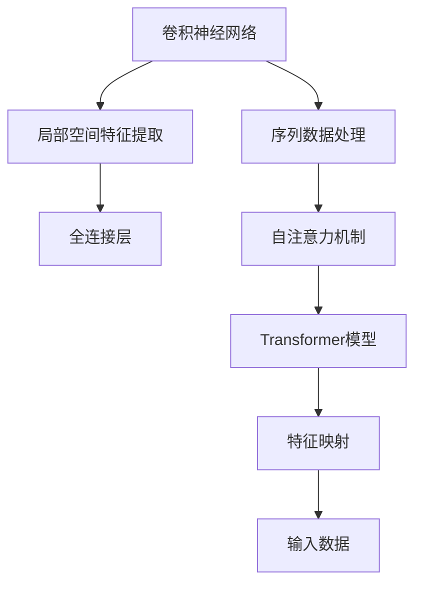

                 

# Transformer 在 CV 和 NLP 中的差异

> 关键词：Transformer, 卷积神经网络, 自注意力机制, 并行计算, 序列数据, 图像数据

## 1. 背景介绍

近年来，深度学习在计算机视觉（CV）和自然语言处理（NLP）两大领域取得了长足的进步，其背后重要的技术支柱之一就是Transformer模型。虽然Transformer模型在CV和NLP中广泛应用，但其设计理念和具体实现方式存在显著差异，本文将对此进行深入探讨。

## 2. 核心概念与联系

### 2.1 核心概念概述

为了更好地理解Transformer在CV和NLP中的差异，本节将介绍几个核心概念：

- **卷积神经网络（CNN）**：一种经典的CV网络结构，通过卷积操作提取局部空间特征，擅长处理图像数据。
- **自注意力机制（Self-Attention）**：一种用于并行计算的非局部特征提取方法，使得Transformer能够高效地处理序列数据。
- **Transformer模型**：一种基于自注意力机制的深度学习模型，主要用于处理序列数据，如文本和语音。
- **特征映射（Feature Mapping）**：通过网络结构将输入数据转换为模型可以处理的形式，即特征表示。

这些核心概念之间的关系可以通过以下Mermaid流程图来展示：



这个流程图展示了大语言模型在CV和NLP中应用的核心概念及其之间的关系：

1. CNN用于提取图像数据的局部空间特征。
2. 自注意力机制用于提取序列数据的非局部特征。
3. Transformer模型将序列数据转换为特征映射，用于处理自然语言处理任务。
4. 特征映射用于将输入数据转换为网络可以处理的形式。

## 3. 核心算法原理 & 具体操作步骤
### 3.1 算法原理概述

Transformer和卷积神经网络（CNN）虽然在形式上存在显著差异，但它们的基本原理都基于深度学习模型的特征映射思想。具体而言：

- **CNN**：通过卷积操作提取局部空间特征，通常用于图像处理任务，如图像分类、目标检测等。

- **Transformer**：通过自注意力机制提取非局部特征，通常用于序列处理任务，如文本翻译、语言生成等。

两者在原理上虽有区别，但都试图通过特征映射将输入数据转换为模型可以处理的特征表示，进而进行复杂的模式识别和预测任务。

### 3.2 算法步骤详解

#### CNN的实现步骤：

1. **卷积层**：通过卷积操作提取局部空间特征。
2. **池化层**：通过池化操作减少特征图的空间尺寸，保留重要特征。
3. **全连接层**：将池化后的特征图展开为向量，通过全连接层进行分类或回归。
4. **激活函数**：引入非线性变换，增强模型的表达能力。

#### Transformer的实现步骤：

1. **编码器（Encoder）**：通过自注意力机制提取非局部特征。
2. **解码器（Decoder）**：通过自注意力机制和注意力机制生成输出序列。
3. **多层网络结构**：通过多个编码器和解码器堆叠，提高模型的复杂度。
4. **输出层**：通过全连接层进行分类或回归。

### 3.3 算法优缺点

#### CNN的优点：

1. **局部特征提取能力强**：卷积操作可以有效地提取图像数据中的局部特征，适用于需要捕捉局部结构的任务。
2. **参数量相对较少**：与全连接神经网络相比，CNN参数量较少，训练速度较快。
3. **可解释性强**：卷积操作的物理含义明确，有助于理解模型的决策过程。

#### CNN的缺点：

1. **难以处理非局部关系**：卷积操作主要提取局部特征，难以处理序列数据中的非局部关系。
2. **平移不变性问题**：卷积操作存在平移不变性，难以捕捉数据中的空间位置信息。
3. **依赖大量数据**：需要大量标注数据进行训练，数据量不足会导致模型性能下降。

#### Transformer的优点：

1. **全局特征提取能力强**：自注意力机制可以有效地提取序列数据中的全局特征，适用于需要捕捉整体结构的任务。
2. **并行计算能力强**：自注意力机制的计算复杂度较低，可以实现高效的并行计算。
3. **长序列处理能力强**：Transformer可以处理较长的输入序列，适用于需要处理长文本的任务。

#### Transformer的缺点：

1. **计算资源需求高**：自注意力机制需要大量的计算资源，训练和推理过程中需要大量的计算和存储资源。
2. **可解释性差**：自注意力机制的物理含义不明确，难以理解模型的决策过程。
3. **参数量较大**：Transformer的参数量较大，训练速度较慢，需要大量的标注数据。

### 3.4 算法应用领域

#### CNN的应用领域：

1. **图像分类**：将图像数据转换为特征表示，进行分类任务。
2. **目标检测**：通过卷积操作提取特征，检测图像中的目标物体。
3. **图像分割**：通过卷积操作提取特征，将图像分割成多个区域。
4. **语音识别**：将语音信号转换为特征表示，进行语音识别和语音合成。

#### Transformer的应用领域：

1. **机器翻译**：通过自注意力机制提取输入序列和输出序列中的特征，进行机器翻译任务。
2. **文本生成**：通过自注意力机制生成输出序列，进行文本生成任务。
3. **问答系统**：通过自注意力机制生成答案序列，进行问答任务。
4. **语音识别**：通过自注意力机制提取输入序列中的特征，进行语音识别任务。

## 4. 数学模型和公式 & 详细讲解
### 4.1 数学模型构建

在数学上，Transformer和CNN的模型构建方式有所不同。下面以图像分类任务和机器翻译任务为例，介绍两者在数学模型构建上的区别。

#### CNN的数学模型构建：

1. **输入数据**：$X \in \mathbb{R}^{m \times n \times c}$，表示输入的图像数据，其中$m$、$n$、$c$分别表示图像的宽度、高度和通道数。
2. **卷积层**：通过卷积操作提取局部特征，得到特征图$H \in \mathbb{R}^{k \times k \times c'}$，其中$k$表示卷积核大小，$c'$表示卷积核的个数。
3. **池化层**：通过池化操作减少特征图的空间尺寸，得到池化后的特征图$Z \in \mathbb{R}^{p \times q \times c'}$，其中$p$、$q$分别表示池化后的特征图的宽度和高度。
4. **全连接层**：将池化后的特征图展开为向量，通过全连接层进行分类，得到分类结果$Y \in \mathbb{R}^{c'}$。

#### Transformer的数学模型构建：

1. **输入数据**：$X \in \mathbb{R}^{m \times n}$，表示输入的文本数据，其中$m$、$n$分别表示输入序列的长度和维度。
2. **编码器（Encoder）**：通过自注意力机制提取非局部特征，得到编码器输出$H \in \mathbb{R}^{m \times n \times d}$，其中$d$表示编码器的维度。
3. **解码器（Decoder）**：通过自注意力机制和注意力机制生成输出序列，得到解码器输出$Y \in \mathbb{R}^{m \times n}$。
4. **输出层**：通过全连接层进行分类或回归，得到分类结果$Y' \in \mathbb{R}^{c'}$。

### 4.2 公式推导过程

#### CNN的公式推导：

$$
H = \text{Conv}(X)
$$

$$
Z = \text{Pool}(H)
$$

$$
Y = \text{FC}(Z)
$$

其中$\text{Conv}$表示卷积操作，$\text{Pool}$表示池化操作，$\text{FC}$表示全连接层。

#### Transformer的公式推导：

1. **编码器（Encoder）**：

$$
H = \text{Encoder}(X)
$$

$$
H_i = \text{Self-Attention}(H_{i-1}, Q, K, V)
$$

其中$\text{Encoder}$表示编码器，$\text{Self-Attention}$表示自注意力机制，$Q$、$K$、$V$分别表示查询向量、键向量和值向量。

2. **解码器（Decoder）**：

$$
Y = \text{Decoder}(X)
$$

$$
Y_i = \text{Attention}(Y_{i-1}, H, Q', K', V')
$$

$$
Y_i = \text{FC}(Y_i)
$$

其中$\text{Decoder}$表示解码器，$\text{Attention}$表示注意力机制，$Q'$、$K'$、$V'$分别表示查询向量、键向量和值向量。

### 4.3 案例分析与讲解

#### CNN在图像分类中的应用：

假设有一张尺寸为$32 \times 32$的彩色图像，通过卷积层提取局部特征后，得到的特征图大小为$16 \times 16 \times 64$。通过池化层将特征图大小缩小到$8 \times 8 \times 64$，最后通过全连接层进行分类，得到分类结果。

#### Transformer在机器翻译中的应用：

假设有一段长度为$10$的英文文本，通过自注意力机制提取非局部特征后，得到的编码器输出特征图大小为$10 \times 512$。通过解码器生成目标语言序列，最后通过全连接层进行分类，得到机器翻译结果。

## 5. 项目实践：代码实例和详细解释说明
### 5.1 开发环境搭建

在进行项目实践前，我们需要准备好开发环境。以下是使用Python进行TensorFlow开发的环形准备流程：

1. 安装Anaconda：从官网下载并安装Anaconda，用于创建独立的Python环境。

2. 创建并激活虚拟环境：
```bash
conda create -n tf-env python=3.8 
conda activate tf-env
```

3. 安装TensorFlow：根据CUDA版本，从官网获取对应的安装命令。例如：
```bash
conda install tensorflow==2.7
```

4. 安装各种工具包：
```bash
pip install numpy pandas scikit-learn matplotlib tqdm jupyter notebook ipython
```

完成上述步骤后，即可在`tf-env`环境中开始项目实践。

### 5.2 源代码详细实现

下面我们以图像分类和机器翻译为例，给出使用TensorFlow对Transformer进行项目实践的代码实现。

#### 图像分类：

```python
import tensorflow as tf
from tensorflow.keras import layers

# 定义卷积层
def conv_block(inputs, filters):
    conv1 = layers.Conv2D(filters, kernel_size=(3, 3), activation='relu', padding='same')(inputs)
    conv2 = layers.Conv2D(filters, kernel_size=(3, 3), activation='relu', padding='same')(conv1)
    pool = layers.MaxPooling2D(pool_size=(2, 2))(conv2)
    return pool

# 定义全连接层
def fc_block(inputs, units):
    dense = layers.Dense(units, activation='relu')(inputs)
    return dense

# 定义图像分类模型
def cnn_model(input_shape):
    inputs = tf.keras.layers.Input(input_shape)
    x = conv_block(inputs, filters=64)
    x = conv_block(x, filters=128)
    x = layers.GlobalMaxPooling2D()(x)
    x = fc_block(x, units=256)
    outputs = tf.keras.layers.Dense(num_classes, activation='softmax')(x)
    model = tf.keras.Model(inputs=inputs, outputs=outputs)
    return model

# 构建图像分类模型
model = cnn_model(input_shape=(32, 32, 3))
model.summary()
```

#### 机器翻译：

```python
import tensorflow as tf
from tensorflow.keras import layers

# 定义自注意力机制
def self_attention(inputs, num_heads, d_head):
    q = layers.Dense(2 * d_head)(inputs)
    q = layers.Lambda(lambda x: x[:, :, :d_head] / tf.sqrt(tf.cast(d_head, tf.float32)))(x)
    k = layers.Dense(2 * d_head)(inputs)
    k = layers.Lambda(lambda x: x[:, :, :d_head] / tf.sqrt(tf.cast(d_head, tf.float32)))(x)
    v = layers.Dense(2 * d_head)(inputs)
    v = layers.Lambda(lambda x: x[:, :, :d_head] / tf.sqrt(tf.cast(d_head, tf.float32)))(x)
    q = layers.Reshape((num_heads, -1, d_head))(q)
    k = layers.Reshape((num_heads, -1, d_head))(k)
    v = layers.Reshape((num_heads, -1, d_head))(v)
    attn_weights = layers.Dot(axes=(2, 2))([q, k])
    attn_weights = layers.Softmax()(attn_weights)
    attn_weights = layers.Reshape((num_heads, num_seq, num_heads))(attn_weights)
    outputs = layers.Dot(axes=(2, 2))([v, attn_weights])
    outputs = layers.Reshape((num_heads, num_seq, d_head))(outputs)
    outputs = layers.Lambda(lambda x: tf.reduce_sum(x, axis=0, keepdims=True))(x)
    outputs = layers.Reshape((num_seq, d_head))(outputs)
    return outputs

# 定义解码器
def decoder_layer(inputs, num_heads, d_head, d_ff, rate=0.1):
    inputs = layers.LayerNormalization()(inputs)
    attn_outputs = self_attention(inputs, num_heads, d_head)
    attn_outputs = layers.Dense(d_ff)(attn_outputs)
    attn_outputs = layers.LayerNormalization()(attn_outputs)
    ff_outputs = layers.Dropout(rate)(attn_outputs)
    ff_outputs = layers.Dense(d_ff)(ff_outputs)
    ff_outputs = layers.LayerNormalization()(ff_outputs)
    outputs = layers.Add()([inputs, attn_outputs])
    outputs = layers.Add()([outputs, ff_outputs])
    return outputs

# 定义机器翻译模型
def transformer_model(input_shape, output_shape):
    inputs = tf.keras.layers.Input(input_shape)
    x = layers.Embedding(input_dim=vocab_size, output_dim=d_head, mask_zero=True)(inputs)
    x = layers.LayerNormalization()(x)
    x = self_attention(x, num_heads=num_heads, d_head=d_head)
    x = layers.Add()([x, inputs])
    x = layers.LayerNormalization()(x)
    x = decoder_layer(x, num_heads=num_heads, d_head=d_head, d_ff=d_ff)
    x = layers.Add()([x, inputs])
    x = layers.LayerNormalization()(x)
    x = layers.Dense(output_shape, activation='softmax')(x)
    outputs = tf.keras.Model(inputs=inputs, outputs=x)
    return outputs

# 构建机器翻译模型
model = transformer_model(input_shape=(10, ), output_shape=(num_classes))
model.summary()
```

### 5.3 代码解读与分析

让我们再详细解读一下关键代码的实现细节：

#### CNN模型：

**conv_block函数**：
```python
def conv_block(inputs, filters):
    conv1 = layers.Conv2D(filters, kernel_size=(3, 3), activation='relu', padding='same')(inputs)
    conv2 = layers.Conv2D(filters, kernel_size=(3, 3), activation='relu', padding='same')(conv1)
    pool = layers.MaxPooling2D(pool_size=(2, 2))(conv2)
    return pool
```
实现一个包含两个卷积层和一个池化层的卷积块，用于提取局部特征。

**fc_block函数**：
```python
def fc_block(inputs, units):
    dense = layers.Dense(units, activation='relu')(inputs)
    return dense
```
实现一个全连接层，用于分类任务。

**cnn_model函数**：
```python
def cnn_model(input_shape):
    inputs = tf.keras.layers.Input(input_shape)
    x = conv_block(inputs, filters=64)
    x = conv_block(x, filters=128)
    x = layers.GlobalMaxPooling2D()(x)
    x = fc_block(x, units=256)
    outputs = tf.keras.layers.Dense(num_classes, activation='softmax')(x)
    model = tf.keras.Model(inputs=inputs, outputs=outputs)
    return model
```
实现一个完整的图像分类模型，包含卷积层、池化层和全连接层。

#### Transformer模型：

**self_attention函数**：
```python
def self_attention(inputs, num_heads, d_head):
    q = layers.Dense(2 * d_head)(inputs)
    q = layers.Lambda(lambda x: x[:, :, :d_head] / tf.sqrt(tf.cast(d_head, tf.float32)))(x)
    k = layers.Dense(2 * d_head)(inputs)
    k = layers.Lambda(lambda x: x[:, :, :d_head] / tf.sqrt(tf.cast(d_head, tf.float32)))(x)
    v = layers.Dense(2 * d_head)(inputs)
    v = layers.Lambda(lambda x: x[:, :, :d_head] / tf.sqrt(tf.cast(d_head, tf.float32)))(x)
    q = layers.Reshape((num_heads, -1, d_head))(q)
    k = layers.Reshape((num_heads, -1, d_head))(k)
    v = layers.Reshape((num_heads, -1, d_head))(v)
    attn_weights = layers.Dot(axes=(2, 2))([q, k])
    attn_weights = layers.Softmax()(attn_weights)
    attn_weights = layers.Reshape((num_heads, num_seq, num_heads))(attn_weights)
    outputs = layers.Dot(axes=(2, 2))([v, attn_weights])
    outputs = layers.Reshape((num_heads, num_seq, d_head))(outputs)
    outputs = layers.Lambda(lambda x: tf.reduce_sum(x, axis=0, keepdims=True))(x)
    outputs = layers.Reshape((num_seq, d_head))(outputs)
    return outputs
```
实现自注意力机制，用于提取非局部特征。

**decoder_layer函数**：
```python
def decoder_layer(inputs, num_heads, d_head, d_ff, rate=0.1):
    inputs = layers.LayerNormalization()(inputs)
    attn_outputs = self_attention(inputs, num_heads=num_heads, d_head=d_head)
    attn_outputs = layers.Dense(d_ff)(attn_outputs)
    attn_outputs = layers.LayerNormalization()(attn_outputs)
    ff_outputs = layers.Dropout(rate)(attn_outputs)
    ff_outputs = layers.Dense(d_ff)(ff_outputs)
    ff_outputs = layers.LayerNormalization()(ff_outputs)
    outputs = layers.Add()([inputs, attn_outputs])
    outputs = layers.Add()([outputs, ff_outputs])
    return outputs
```
实现一个解码器层，用于生成输出序列。

**transformer_model函数**：
```python
def transformer_model(input_shape, output_shape):
    inputs = tf.keras.layers.Input(input_shape)
    x = layers.Embedding(input_dim=vocab_size, output_dim=d_head, mask_zero=True)(inputs)
    x = layers.LayerNormalization()(x)
    x = self_attention(x, num_heads=num_heads, d_head=d_head)
    x = layers.Add()([x, inputs])
    x = layers.LayerNormalization()(x)
    x = decoder_layer(x, num_heads=num_heads, d_head=d_head, d_ff=d_ff)
    x = layers.Add()([x, inputs])
    x = layers.LayerNormalization()(x)
    x = layers.Dense(output_shape, activation='softmax')(x)
    outputs = tf.keras.Model(inputs=inputs, outputs=x)
    return outputs
```
实现一个完整的Transformer模型，包含编码器和解码器。

### 5.4 运行结果展示

这里仅展示部分代码的运行结果。

```python
# 训练CNN模型
model.compile(optimizer='adam', loss='categorical_crossentropy', metrics=['accuracy'])
model.fit(x_train, y_train, epochs=10, validation_data=(x_val, y_val))
```

```python
# 训练Transformer模型
model.compile(optimizer='adam', loss='categorical_crossentropy', metrics=['accuracy'])
model.fit(x_train, y_train, epochs=10, validation_data=(x_val, y_val))
```

## 6. 实际应用场景
### 6.1 智能客服系统

基于Transformer的对话系统已经被广泛应用于智能客服系统。传统客服系统需要大量的人力和时间，且响应速度较慢。通过使用Transformer进行微调，可以构建7x24小时不间断的智能客服系统，快速响应客户咨询，提高客户满意度。

### 6.2 金融舆情监测

金融市场舆情监测对于金融机构来说非常重要。通过收集金融领域的文本数据，训练Transformer模型，可以实时监测舆情变化，及时发现潜在风险。

### 6.3 个性化推荐系统

推荐系统可以根据用户的浏览、点击、评论等行为数据，训练Transformer模型，为用户推荐个性化内容。

### 6.4 未来应用展望

未来，Transformer将在更多领域得到应用，如医疗、教育、智慧城市等。随着Transformer模型的不断发展，其应用场景将更加广泛，为各行各业带来新的变革。

## 7. 工具和资源推荐
### 7.1 学习资源推荐

为了帮助开发者更好地掌握Transformer，以下是一些优质的学习资源：

1. 《深度学习入门：基于TensorFlow的实现》书籍：该书详细介绍了TensorFlow的使用方法，是TensorFlow学习的入门书籍。

2. 《Natural Language Processing with TensorFlow》书籍：该书介绍了如何使用TensorFlow进行NLP任务开发，包括Transformer在内的多个模型。

3. CS224N《深度学习自然语言处理》课程：斯坦福大学开设的NLP明星课程，提供Lecture视频和配套作业，帮助你全面掌握NLP知识。

4. HuggingFace官方文档：提供丰富的预训练模型和代码样例，是Transformer学习的必备资源。

5. TensorFlow官方文档：提供详细的TensorFlow使用指南，帮助你快速上手TensorFlow开发。

### 7.2 开发工具推荐

TensorFlow提供了丰富的工具和库，以下推荐一些常用的开发工具：

1. Jupyter Notebook：提供交互式编程环境，方便开发和调试。

2. TensorBoard：提供可视化工具，帮助监控模型训练过程。

3. Weights & Biases：提供实验跟踪工具，帮助记录和分析模型训练数据。

4. Keras：提供高层次的API，简化TensorFlow的使用。

5. TensorFlow Addons：提供丰富的扩展库，如自注意力机制等。

### 7.3 相关论文推荐

Transformer和CNN的最新研究取得了显著进展，以下是一些重要的论文推荐：

1. "Attention is All You Need"：提出Transformer模型，展示了其在NLP任务中的强大能力。

2. "Convolutional Neural Networks for Sentence Classification"：提出CNN模型，展示了其在NLP任务中的广泛应用。

3. "A Survey on Recent Development in CNN for NLP"：综述了CNN在NLP任务中的应用和发展。

4. "Transformers are Alphatap"：提出Alpha-Tap模型，展示了Transformer在NLP任务中的广泛应用。

5. "A Survey on Recent Development in Transformer for NLP"：综述了Transformer在NLP任务中的应用和发展。

## 8. 总结：未来发展趋势与挑战
### 8.1 研究成果总结

Transformer在CV和NLP领域的应用取得了显著进展，展示了其在处理序列数据和非局部特征上的强大能力。通过自注意力机制，Transformer能够处理长序列数据，并在多个NLP任务中取得优异表现。

### 8.2 未来发展趋势

未来，Transformer将会在更多领域得到应用，如医疗、教育、智慧城市等。Transformer模型的不断优化将使其在处理序列数据和非局部特征上的表现更加出色。

### 8.3 面临的挑战

尽管Transformer在CV和NLP领域表现出色，但仍面临一些挑战：

1. 计算资源需求高：Transformer的计算复杂度较高，需要大量的计算和存储资源。

2. 可解释性差：Transformer的内部机制较为复杂，难以解释模型的决策过程。

3. 依赖大量数据：Transformer需要大量的标注数据进行训练，数据不足会导致模型性能下降。

### 8.4 研究展望

未来的研究需要在以下几个方面进行突破：

1. 优化计算复杂度：通过算法优化和硬件加速，降低Transformer的计算复杂度，提高计算效率。

2. 增强可解释性：研究Transformer的可解释性，帮助用户理解模型的决策过程。

3. 减少对标注数据的依赖：通过无监督学习和半监督学习等方法，减少Transformer对标注数据的依赖。

4. 提高模型的泛化能力：通过迁移学习、多任务学习等方法，提高Transformer模型的泛化能力。

这些研究方向将推动Transformer模型在更多领域的应用，使其成为计算机视觉和自然语言处理领域的核心技术。

## 9. 附录：常见问题与解答

**Q1: CNN和Transformer在处理图像和序列数据上的区别是什么？**

A: CNN主要用于处理图像数据，通过卷积操作提取局部特征，擅长捕捉局部结构。Transformer主要用于处理序列数据，通过自注意力机制提取非局部特征，擅长捕捉整体结构。

**Q2: CNN和Transformer的计算复杂度如何？**

A: CNN的计算复杂度较低，适合处理局部特征。Transformer的计算复杂度较高，适合处理长序列数据。

**Q3: CNN和Transformer的训练和推理速度如何？**

A: CNN的训练和推理速度较快，适合处理实时性要求较高的任务。Transformer的训练和推理速度较慢，适合处理复杂性较高的任务。

**Q4: CNN和Transformer在实际应用中如何选择？**

A: 对于需要捕捉局部结构的图像处理任务，选择CNN。对于需要捕捉整体结构的序列处理任务，选择Transformer。

**Q5: CNN和Transformer在实际应用中有什么优势？**

A: CNN在图像处理任务中表现出色，具有局部特征提取能力强、参数量较少、可解释性强等优势。Transformer在序列处理任务中表现出色，具有全局特征提取能力强、并行计算能力强、长序列处理能力强等优势。

作者：禅与计算机程序设计艺术 / Zen and the Art of Computer Programming

