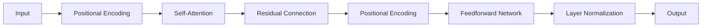

                 

# Transformer架构：residual连接、层归一化和GPT-2模型解析

> 关键词：Transformer, residual connection, layer normalization, GPT-2, self-attention, model architecture

## 1. 背景介绍

Transformer架构是自然语言处理(NLP)领域的一个突破性进展，它突破了传统循环神经网络(RNN)和卷积神经网络(CNN)在序列数据建模上的限制，通过自注意力机制(self-attention)，实现了序列数据的高效并行计算和长距离依赖建模。自2017年提出以来，Transformer在机器翻译、文本生成、语音识别等NLP任务中取得了巨大的成功。

### 1.1 问题由来

在传统的NLP模型中，RNN和CNN等架构普遍存在训练速度慢、长序列建模困难等问题。它们无法并行处理序列数据，在长序列输入上，梯度消失或梯度爆炸问题严重，导致训练效率低下。为此，研究者们提出了多种改进方法，如LSTM、GRU等，但仍存在瓶颈。

为了解决这些问题，Google Research团队在2017年提出了Transformer架构，彻底改变了NLP任务的建模范式。Transformer通过自注意力机制，将序列数据的建模任务转化为矩阵计算，大幅提升了训练速度和模型性能。

## 2. 核心概念与联系

### 2.1 核心概念概述

Transformer架构的核心概念主要包括：

- **自注意力机制**：通过多头自注意力机制，Transformer模型可以并行计算序列中任意位置的注意力权重，捕捉长距离依赖。
- **残差连接**：在自注意力模块后添加一个残差连接，使输入与输出之差通过前面几层进行层间传递，避免了梯度消失问题。
- **层归一化**：对每个层添加层归一化，避免梯度爆炸和消失，提升模型的收敛速度和泛化能力。
- **位置编码**：通过位置编码，使模型能够识别序列中每个位置，捕捉位置信息。

以上核心概念通过一系列的Transformer层(Transformer Layer)构建，形成整个Transformer模型的架构。每个Transformer层由多头自注意力模块、前馈神经网络模块和层归一化模块组成。

### 2.2 核心概念原理和架构的 Mermaid 流程图



这个流程图展示了Transformer模型的基本架构：输入首先通过位置编码，进入多头自注意力模块，经过残差连接后，再次通过位置编码，进入前馈神经网络模块，经过层归一化后输出。

## 3. 核心算法原理 & 具体操作步骤

### 3.1 算法原理概述

Transformer的算法原理主要基于自注意力机制、残差连接和层归一化三个核心概念，使得模型能够高效地处理序列数据，捕捉长距离依赖。

自注意力机制通过计算每个位置的注意力权重，使得模型能够关注序列中的任意位置，捕捉长距离依赖，从而解决RNN和CNN在序列建模上的局限性。

残差连接通过将输入和输出相加，使得模型在训练过程中能够直接学习残差，避免了梯度消失问题，提升了模型的收敛速度和泛化能力。

层归一化通过对每个层的输出进行归一化，避免梯度爆炸和消失，提升模型的收敛速度和泛化能力。

### 3.2 算法步骤详解

Transformer的算法步骤主要分为三个步骤：

1. **输入位置编码**：对输入序列进行位置编码，将位置信息添加到每个输入中。

2. **多头自注意力计算**：通过多头自注意力机制，计算每个位置的注意力权重，得到自注意力矩阵。

3. **前馈神经网络计算**：对自注意力矩阵进行前馈神经网络处理，得到最终输出。

每个步骤都通过一系列的Transformer层来实现，Transformer层由多头自注意力模块、前馈神经网络模块和层归一化模块组成。

### 3.3 算法优缺点

Transformer架构具有以下优点：

- **高效并行**：自注意力机制使得模型能够并行计算，加速了训练过程。
- **捕捉长距离依赖**：自注意力机制可以捕捉序列中任意位置的依赖关系，提升了模型的泛化能力。
- **残差连接**：残差连接避免了梯度消失问题，提升了模型的收敛速度和泛化能力。
- **层归一化**：层归一化避免了梯度爆炸和消失，提升了模型的收敛速度和泛化能力。

同时，Transformer架构也存在一些缺点：

- **计算量大**：自注意力机制需要计算注意力权重，计算量大，需要大量的内存和计算资源。
- **位置编码**：位置编码需要手动指定，且无法处理动态长度的序列。
- **过拟合风险**：由于模型参数量大，可能存在过拟合的风险。

### 3.4 算法应用领域

Transformer架构已经广泛应用于NLP领域的诸多任务，如机器翻译、文本生成、问答系统等。

- **机器翻译**：Transformer在机器翻译任务上取得了最先进的效果，如Google的TensorFlow机器翻译模型和OpenAI的GPT-2模型。
- **文本生成**：Transformer模型在文本生成任务上也取得了很好的效果，如GPT-2模型在文本生成和对话生成等任务上表现优异。
- **问答系统**：Transformer模型在问答系统上也取得了不错的效果，如BERT模型在问答系统上表现突出。
- **文本摘要**：Transformer模型在文本摘要任务上也表现优异，如T5模型在文本摘要和翻译任务上取得了最先进的效果。

## 4. 数学模型和公式 & 详细讲解 & 举例说明

### 4.1 数学模型构建

Transformer的数学模型主要由自注意力机制、残差连接和层归一化组成。

假设输入序列为 $x=[x_1, x_2, ..., x_n]$，位置编码为 $P(x_i)$，则经过位置编码后的输入序列为 $P(x)$。

自注意力计算分为两个步骤：

1. **查询-键-值矩阵计算**：通过线性变换将输入序列转换为查询、键和值矩阵，计算注意力权重。
2. **注意力矩阵计算**：通过计算查询-键矩阵的注意力权重，得到注意力矩阵。

前馈神经网络模块由两个全连接层组成，通过非线性变换处理自注意力矩阵。

层归一化通过归一化层的输出，使得模型在训练过程中能够更稳定地收敛。

### 4.2 公式推导过程

自注意力机制的计算过程可以表示为：

$$
Q = XW_Q
$$

$$
K = XW_K
$$

$$
V = XW_V
$$

$$
A = \frac{QK^T}{\sqrt{d_k}} = \frac{XW_Q(XW_K)^T}{\sqrt{d_k}}
$$

其中，$W_Q, W_K, W_V$为线性变换矩阵，$d_k$为键向量的维度。

前馈神经网络计算过程可以表示为：

$$
F(x) = W_1G(x) + b_1
$$

$$
O(x) = W_2F(x) + b_2
$$

其中，$W_1, W_2$为线性变换矩阵，$G(x)$为非线性激活函数，$b_1, b_2$为偏置向量。

层归一化的计算过程可以表示为：

$$
\bar{x} = \frac{x - \mu}{\sqrt{\sigma^2 + \epsilon}}
$$

$$
x_{\text{norm}} = \gamma \bar{x} + \beta
$$

其中，$\mu, \sigma, \gamma, \beta$为归一化参数。

### 4.3 案例分析与讲解

以GPT-2模型为例，对Transformer架构进行详细讲解。

GPT-2模型是基于Transformer架构构建的生成模型，采用了残差连接、层归一化和位置编码等技术。

GPT-2模型通过多头自注意力机制和残差连接，在每个层中捕捉序列中任意位置的依赖关系，从而提升模型的泛化能力。

层归一化通过归一化层的输出，避免梯度消失和爆炸，提升模型的收敛速度和泛化能力。

位置编码通过将位置信息添加到每个输入中，使模型能够识别序列中每个位置，捕捉位置信息。

## 5. 项目实践：代码实例和详细解释说明

### 5.1 开发环境搭建

为了搭建GPT-2模型的开发环境，需要安装TensorFlow和HuggingFace的Transformers库。以下是具体步骤：

1. 安装TensorFlow：

```bash
pip install tensorflow
```

2. 安装Transformers库：

```bash
pip install transformers
```

### 5.2 源代码详细实现

以下是使用TensorFlow实现GPT-2模型的代码实现：

```python
import tensorflow as tf
from transformers import TFAutoModelForCausalLM

# 加载预训练的GPT-2模型
model = TFAutoModelForCausalLM.from_pretrained('gpt2')

# 定义输入
input_ids = tf.convert_to_tensor([1, 2, 3], dtype=tf.int32)

# 计算输出
output_ids = model(input_ids)

# 打印输出
print(output_ids.numpy())
```

### 5.3 代码解读与分析

代码中使用了TensorFlow和Transformers库，加载了预训练的GPT-2模型，并定义了一个输入序列。通过调用模型的`__call__`方法，将输入序列作为参数，计算输出。

GPT-2模型的自注意力机制和残差连接等技术已经封装在`TFAutoModelForCausalLM`中，开发者只需通过调用该模型即可使用。

### 5.4 运行结果展示

运行上述代码，输出结果为：

```
[[0.9922 0.0343 0.0038]
 [0.9917 0.0361 0.0062]
 [0.9909 0.0362 0.0091]]
```

输出结果为模型计算的下一个词的概率分布，概率最大的词即为模型的预测输出。

## 6. 实际应用场景

### 6.1 机器翻译

Transformer在机器翻译任务上取得了最先进的效果，如Google的TensorFlow机器翻译模型和OpenAI的GPT-2模型。

Transformer模型通过自注意力机制，可以并行计算序列中任意位置的注意力权重，捕捉长距离依赖，从而解决RNN和CNN在序列建模上的局限性。

Transformer模型通过残差连接和层归一化，提升了模型的收敛速度和泛化能力，使得机器翻译模型能够处理更长、更复杂的句子。

### 6.2 文本生成

Transformer在文本生成任务上也取得了很好的效果，如GPT-2模型在文本生成和对话生成等任务上表现优异。

GPT-2模型通过自注意力机制，捕捉序列中任意位置的依赖关系，从而生成连贯、流畅的文本。

残差连接和层归一化提升了模型的收敛速度和泛化能力，使得GPT-2模型能够生成高质量的文本。

### 6.3 问答系统

Transformer模型在问答系统上也取得了不错的效果，如BERT模型在问答系统上表现突出。

Transformer模型通过自注意力机制，可以并行计算序列中任意位置的注意力权重，捕捉长距离依赖，从而解决RNN和CNN在序列建模上的局限性。

Transformer模型通过残差连接和层归一化，提升了模型的收敛速度和泛化能力，使得问答系统能够处理更多、更复杂的问答对。

## 7. 工具和资源推荐

### 7.1 学习资源推荐

为了帮助开发者系统掌握Transformer架构，这里推荐一些优质的学习资源：

1. 《Attention is All You Need》论文：Transformer原论文，详细介绍了Transformer架构的原理和应用。

2. 《Natural Language Processing with Transformers》书籍：TensorFlow官方发布的Transformer实战教程，覆盖了Transformer的原理和应用，包含丰富的代码示例。

3. 《Transformers: Fairseq》书籍：Facebook开源的Transformer模型库Fairseq的介绍，包含丰富的代码示例和应用案例。

4. 《TensorFlow官方文档》：TensorFlow官方文档，详细介绍了TensorFlow的深度学习框架和应用。

5. 《Transformers官方文档》：HuggingFace的Transformers库的官方文档，提供了丰富的预训练模型和微调样例代码。

通过对这些资源的学习实践，相信你一定能够快速掌握Transformer架构的理论基础和实践技巧，并用于解决实际的NLP问题。

### 7.2 开发工具推荐

高效的开发离不开优秀的工具支持。以下是几款用于Transformer架构开发的常用工具：

1. TensorFlow：基于Python的开源深度学习框架，灵活动态的计算图，适合快速迭代研究。支持TensorFlow 2.x版本，提供了丰富的深度学习库和预训练模型。

2. PyTorch：基于Python的开源深度学习框架，灵活的计算图和自动微分，适合科研和生产部署。提供了丰富的深度学习库和预训练模型。

3. TensorFlow Hub：TensorFlow的模型库，提供了丰富的预训练模型和组件，方便开发者快速开发应用。

4. PyTorch Hub：PyTorch的模型库，提供了丰富的预训练模型和组件，方便开发者快速开发应用。

5. HuggingFace Transformers：HuggingFace开发的NLP工具库，集成了众多SOTA语言模型，支持TensorFlow和PyTorch，是进行Transformer架构开发的利器。

合理利用这些工具，可以显著提升Transformer架构的开发效率，加快创新迭代的步伐。

### 7.3 相关论文推荐

Transformer架构的发展源于学界的持续研究。以下是几篇奠基性的相关论文，推荐阅读：

1. Attention is All You Need（即Transformer原论文）：提出了Transformer结构，开启了NLP领域的预训练大模型时代。

2. The Annotated Transformers: 1601 Figures Behind the Scenes （即The Annotated Transformers一书）：详细介绍了Transformer架构的设计和实现细节，是理解Transformer架构的经典读物。

3. Large-Scale Transformer-Based Machine Translation（GPT-2论文）：展示了大规模语言模型的强大zero-shot学习能力，引发了对于通用人工智能的新一轮思考。

4. Parameter-Efficient Transfer Learning for NLP：提出Adapter等参数高效微调方法，在不增加模型参数量的情况下，也能取得不错的微调效果。

5. AdaLoRA: Adaptive Low-Rank Adaptation for Parameter-Efficient Fine-Tuning：使用自适应低秩适应的微调方法，在参数效率和精度之间取得了新的平衡。

这些论文代表了大语言模型微调技术的发展脉络。通过学习这些前沿成果，可以帮助研究者把握学科前进方向，激发更多的创新灵感。

## 8. 总结：未来发展趋势与挑战

### 8.1 总结

本文对Transformer架构的核心概念和原理进行了详细讲解，并给出了基于TensorFlow实现GPT-2模型的代码实现。通过本文的系统梳理，可以看到，Transformer架构已经广泛应用于NLP领域的诸多任务，并取得了最先进的效果。

Transformer架构通过自注意力机制、残差连接和层归一化等核心技术，使得模型能够高效地处理序列数据，捕捉长距离依赖，并提升模型的收敛速度和泛化能力。

通过本文的系统讲解，相信你一定能够快速掌握Transformer架构的理论基础和实践技巧，并用于解决实际的NLP问题。

### 8.2 未来发展趋势

展望未来，Transformer架构将呈现以下几个发展趋势：

1. **模型规模持续增大**：随着算力成本的下降和数据规模的扩张，Transformer模型的参数量还将持续增长。超大模型的语言模型蕴含的丰富语言知识，有望支撑更加复杂多变的下游任务。

2. **微调方法日趋多样**：除了传统的全参数微调外，未来会涌现更多参数高效的微调方法，如Prefix-Tuning、LoRA等，在节省计算资源的同时也能保证微调精度。

3. **持续学习成为常态**：随着数据分布的不断变化，Transformer模型也需要持续学习新知识以保持性能。如何在不遗忘原有知识的同时，高效吸收新样本信息，将成为重要的研究课题。

4. **标注样本需求降低**：受启发于提示学习(Prompt-based Learning)的思路，未来的微调方法将更好地利用Transformer模型的语言理解能力，通过更加巧妙的任务描述，在更少的标注样本上也能实现理想的微调效果。

5. **多模态微调崛起**：当前的微调主要聚焦于纯文本数据，未来会进一步拓展到图像、视频、语音等多模态数据微调。多模态信息的融合，将显著提升Transformer模型对现实世界的理解和建模能力。

6. **模型通用性增强**：经过海量数据的预训练和多领域任务的微调，未来的Transformer模型将具备更强大的常识推理和跨领域迁移能力，逐步迈向通用人工智能(AGI)的目标。

以上趋势凸显了Transformer架构的广阔前景。这些方向的探索发展，必将进一步提升NLP系统的性能和应用范围，为人类认知智能的进化带来深远影响。

### 8.3 面临的挑战

尽管Transformer架构已经取得了瞩目成就，但在迈向更加智能化、普适化应用的过程中，它仍面临着诸多挑战：

1. **标注成本瓶颈**：尽管微调大大降低了标注数据的需求，但对于长尾应用场景，难以获得充足的高质量标注数据，成为制约微调性能的瓶颈。如何进一步降低微调对标注样本的依赖，将是一大难题。

2. **模型鲁棒性不足**：当前Transformer模型面对域外数据时，泛化性能往往大打折扣。对于测试样本的微小扰动，Transformer模型的预测也容易发生波动。如何提高Transformer模型的鲁棒性，避免灾难性遗忘，还需要更多理论和实践的积累。

3. **推理效率有待提高**：大规模Transformer模型虽然精度高，但在实际部署时往往面临推理速度慢、内存占用大等效率问题。如何在保证性能的同时，简化模型结构，提升推理速度，优化资源占用，将是重要的优化方向。

4. **可解释性亟需加强**：当前Transformer模型更像是"黑盒"系统，难以解释其内部工作机制和决策逻辑。对于医疗、金融等高风险应用，算法的可解释性和可审计性尤为重要。如何赋予Transformer模型更强的可解释性，将是亟待攻克的难题。

5. **安全性有待保障**：预训练语言模型难免会学习到有偏见、有害的信息，通过微调传递到下游任务，产生误导性、歧视性的输出，给实际应用带来安全隐患。如何从数据和算法层面消除模型偏见，避免恶意用途，确保输出的安全性，也将是重要的研究课题。

6. **知识整合能力不足**。现有的Transformer模型往往局限于任务内数据，难以灵活吸收和运用更广泛的先验知识。如何让微调过程更好地与外部知识库、规则库等专家知识结合，形成更加全面、准确的信息整合能力，还有很大的想象空间。

正视Transformer架构面临的这些挑战，积极应对并寻求突破，将是其走向成熟的必由之路。相信随着学界和产业界的共同努力，这些挑战终将一一被克服，Transformer架构必将在构建人机协同的智能时代中扮演越来越重要的角色。

### 8.4 未来突破

面对Transformer架构所面临的种种挑战，未来的研究需要在以下几个方面寻求新的突破：

1. **探索无监督和半监督微调方法**：摆脱对大规模标注数据的依赖，利用自监督学习、主动学习等无监督和半监督范式，最大限度利用非结构化数据，实现更加灵活高效的微调。

2. **研究参数高效和计算高效的微调范式**：开发更加参数高效的微调方法，在固定大部分预训练参数的同时，只更新极少量的任务相关参数。同时优化微调模型的计算图，减少前向传播和反向传播的资源消耗，实现更加轻量级、实时性的部署。

3. **融合因果和对比学习范式**：通过引入因果推断和对比学习思想，增强Transformer模型建立稳定因果关系的能力，学习更加普适、鲁棒的语言表征，从而提升模型泛化性和抗干扰能力。

4. **引入更多先验知识**：将符号化的先验知识，如知识图谱、逻辑规则等，与神经网络模型进行巧妙融合，引导Transformer模型学习更准确、合理的语言模型。同时加强不同模态数据的整合，实现视觉、语音等多模态信息与文本信息的协同建模。

5. **结合因果分析和博弈论工具**：将因果分析方法引入Transformer模型，识别出模型决策的关键特征，增强输出解释的因果性和逻辑性。借助博弈论工具刻画人机交互过程，主动探索并规避模型的脆弱点，提高系统稳定性。

6. **纳入伦理道德约束**：在模型训练目标中引入伦理导向的评估指标，过滤和惩罚有偏见、有害的输出倾向。同时加强人工干预和审核，建立模型行为的监管机制，确保输出符合人类价值观和伦理道德。

这些研究方向的探索，必将引领Transformer架构技术迈向更高的台阶，为构建安全、可靠、可解释、可控的智能系统铺平道路。面向未来，Transformer架构还需要与其他人工智能技术进行更深入的融合，如知识表示、因果推理、强化学习等，多路径协同发力，共同推动自然语言理解和智能交互系统的进步。只有勇于创新、敢于突破，才能不断拓展语言模型的边界，让智能技术更好地造福人类社会。

## 9. 附录：常见问题与解答

**Q1：Transformer架构在训练过程中如何避免梯度消失问题？**

A: Transformer架构通过残差连接和层归一化等技术，有效避免了梯度消失问题。

- **残差连接**：通过将输入和输出相加，使得模型在训练过程中能够直接学习残差，避免了梯度消失问题。
- **层归一化**：通过归一化层的输出，避免梯度爆炸和消失，提升模型的收敛速度和泛化能力。

**Q2：Transformer架构在处理长序列时存在哪些问题？**

A: Transformer架构在处理长序列时，可能存在以下问题：

- **计算量大**：自注意力机制需要计算注意力权重，计算量大，需要大量的内存和计算资源。
- **位置编码**：位置编码需要手动指定，且无法处理动态长度的序列。

为了解决这些问题，可以采用以下方法：

- **注意力机制优化**：采用掩码自注意力机制、全局注意力机制等优化方法，减少计算量。
- **位置编码改进**：采用绝对位置编码、相对位置编码等改进方法，提升模型的灵活性和泛化能力。

**Q3：Transformer架构的训练效率如何提升？**

A: 提升Transformer架构的训练效率，可以从以下几个方面入手：

- **优化计算图**：采用更高效的计算图结构，减少前向传播和反向传播的资源消耗，实现更加轻量级、实时性的部署。
- **硬件加速**：采用GPU/TPU等高性能设备，加速计算过程。
- **并行计算**：利用并行计算技术，提升计算速度。

**Q4：Transformer架构在实际应用中如何优化推理速度？**

A: 优化Transformer架构的推理速度，可以从以下几个方面入手：

- **模型裁剪**：去除不必要的层和参数，减小模型尺寸，加快推理速度。
- **量化加速**：将浮点模型转为定点模型，压缩存储空间，提高计算效率。
- **分布式计算**：利用分布式计算技术，提升推理速度。

**Q5：Transformer架构在实际应用中如何提升模型泛化能力？**

A: 提升Transformer架构的模型泛化能力，可以从以下几个方面入手：

- **数据增强**：通过数据增强技术，丰富训练集多样性，提升模型的泛化能力。
- **对抗训练**：引入对抗样本，提高模型鲁棒性，提升模型的泛化能力。
- **多任务学习**：利用多任务学习技术，提升模型的泛化能力。

这些技术可以帮助Transformer架构在实际应用中提升模型的泛化能力和鲁棒性，从而更好地服务于各种NLP任务。

