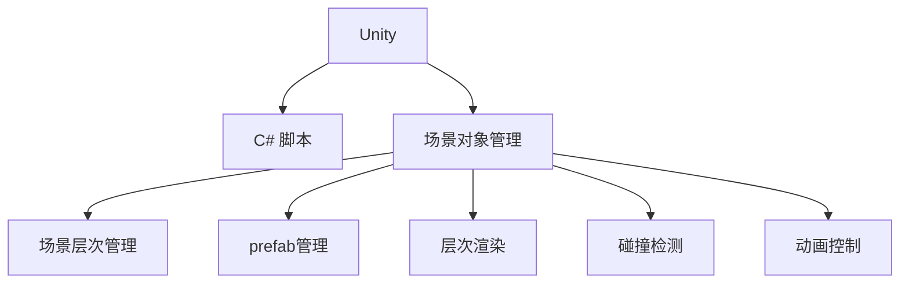

                 

# Unity 游戏开发：C# 脚本和场景管理

> 关键词：Unity, C# 脚本, 游戏开发, 场景管理, 3D 游戏, 游戏引擎

## 1. 背景介绍

### 1.1 问题由来

随着虚拟现实技术的不断进步，全球游戏玩家群体迅速扩大。然而，传统的手动编写游戏代码过程繁琐耗时，难以快速满足玩家对游戏场景的多样化需求。而Unity作为一款主流的游戏引擎，以其易用性和强大的跨平台能力，迅速成为了开发者进行3D游戏开发的首选工具。

游戏场景管理是Unity中最为关键的功能之一。通过合理的场景管理，可以极大提高游戏运行的稳定性和流畅性，同时也能够有效提升游戏的可玩性和娱乐性。然而，Unity场景管理的复杂度较高，容易忽视一些重要细节，导致游戏崩溃或卡顿。因此，如何高效、可靠地进行Unity场景管理，成为了游戏开发者的一大难题。

### 1.2 问题核心关键点

Unity场景管理主要包括两大部分：场景对象（Game Objects）和场景层次（Scene Hierarchy）的管理。

- **场景对象管理**：游戏中所有可交互的实体，如角色、道具、环境等，都是通过场景对象表示的。场景对象可以在运行时动态创建、修改、销毁。
- **场景层次管理**：通过场景层次，可以清晰地组织和管理场景对象，实现场景嵌套和分层渲染，提高渲染效率，减少渲染负担。

## 2. 核心概念与联系

### 2.1 核心概念概述

为更好地理解Unity场景管理，本节将介绍几个密切相关的核心概念：

- **Unity**：一款跨平台的游戏引擎，广泛用于3D游戏开发。支持C#脚本语言，内置了大量预制组件和编辑器，极大提升了开发效率。
- **C# 脚本**：Unity中用于定义游戏逻辑的编程语言，通过编写脚本可以实现游戏逻辑的控制和操作。
- **场景对象（Game Objects）**：游戏中所有可交互的实体，如角色、道具、环境等，都是通过场景对象表示的。场景对象可以在运行时动态创建、修改、销毁。
- **场景层次（Scene Hierarchy）**：通过场景层次，可以清晰地组织和管理场景对象，实现场景嵌套和分层渲染，提高渲染效率，减少渲染负担。
- ** prefab（预制体）**：通过将场景对象预先制作成prefab，可以在运行时直接创建，避免重复创建和内存消耗。
- **层次渲染（Layered Rendering）**：通过设置不同层次的场景对象，可以实现场景的层次渲染，提升渲染性能。
- **碰撞检测**：通过实现场景对象的碰撞检测，确保游戏对象之间的交互和物理模拟的准确性。
- **动画控制**：通过动画系统实现游戏角色的动画效果，提升游戏的视觉体验。

这些核心概念之间的逻辑关系可以通过以下Mermaid流程图来展示：



这个流程图展示Unity场景管理的核心概念及其之间的关系：

1. Unity平台提供C# 脚本语言，支持游戏逻辑的实现。
2. 场景对象管理提供游戏实体的创建、修改和销毁，场景层次管理提供场景的组织和渲染优化。
3. prefab管理提供场景对象的预先制作，层次渲染优化渲染效率。
4. 碰撞检测和动画控制确保游戏实体的交互和视觉效果。

这些概念共同构成了Unity场景管理的框架，使得开发者能够高效、灵活地开发和优化3D游戏场景。

## 3. 核心算法原理 & 具体操作步骤

### 3.1 算法原理概述

Unity场景管理基于对象模型，场景对象通过层次结构组织。场景对象可以通过脚本进行逻辑控制和操作，场景层次通过编辑器进行可视化管理和优化。

场景对象在Unity中有三种状态：创建（Creation）、活动（Active）、非活动（Inactive）。通过状态管理，Unity能够灵活地控制场景对象的创建和销毁，提高内存利用率和渲染效率。

### 3.2 算法步骤详解

Unity场景管理的一般步骤如下：

**Step 1: 创建和管理场景对象**

1. 在Unity编辑器中，通过“对象”窗口创建场景对象。
2. 给对象添加所需的组件，如碰撞检测、动画、脚本等。
3. 通过脚本编写游戏逻辑，实现场景对象的行为控制。
4. 保存场景对象的状态和层次结构。

**Step 2: 场景层次的可视化管理**

1. 通过“场景”窗口，可视化场景对象层次结构。
2. 编辑层次结构，实现场景嵌套和分层渲染。
3. 通过层次结构，优化渲染效率，减少渲染负担。

**Step 3: 场景对象的创建和销毁**

1. 在运行时，通过脚本创建场景对象。
2. 使用“对象”窗口或脚本控制场景对象的销毁。
3. 实现动态创建和销毁场景对象，避免内存泄漏。

**Step 4: prefab管理**

1. 将场景对象制作成prefab。
2. 通过“场景”窗口或脚本创建prefab。
3. 运行时直接创建prefab，避免重复创建和内存消耗。

**Step 5: 碰撞检测**

1. 给场景对象添加碰撞检测组件。
2. 实现碰撞检测逻辑，确保游戏对象之间的交互和物理模拟的准确性。
3. 优化碰撞检测算法，提高游戏运行效率。

**Step 6: 动画控制**

1. 给场景对象添加动画组件。
2. 编写动画控制脚本，实现游戏角色的动画效果。
3. 优化动画播放逻辑，提升游戏的视觉体验。

### 3.3 算法优缺点

Unity场景管理的优点：

1. 灵活性高：场景对象和层次结构可以通过脚本和编辑器进行灵活管理。
2. 可视化好：场景对象层次结构可视化，便于管理和优化。
3. 预制体支持：prefab管理提供场景对象的预先制作，避免了重复创建和内存消耗。
4. 渲染效率高：层次渲染优化渲染效率，减少渲染负担。

Unity场景管理的缺点：

1. 性能开销大：场景对象和层次结构的频繁创建和销毁，可能导致内存泄露和性能问题。
2. 调试复杂：场景对象和层次结构复杂，调试和维护难度较大。
3. 学习曲线陡：对于初学者来说，学习场景管理可能有一定的难度。

### 3.4 算法应用领域

Unity场景管理广泛应用于各种类型的3D游戏开发，包括但不限于：

- 第一人称射击游戏（FPS）：通过场景对象管理实现角色、武器、环境等对象的交互和渲染。
- 角色扮演游戏（RPG）：通过场景层次管理实现不同场景的切换和嵌套，提高游戏世界的沉浸感。
- 策略游戏（RTS）：通过碰撞检测和动画控制实现复杂的战斗场景和单位交互。
- 冒险解谜游戏：通过层次渲染优化渲染效率，实现复杂的场景和关卡设计。

## 4. 数学模型和公式 & 详细讲解 & 举例说明

### 4.1 数学模型构建

Unity场景管理主要涉及空间、时间和逻辑三个维度的数学模型。

**空间模型**：场景对象的坐标、旋转、缩放等属性，通过向量表示。

**时间模型**：场景对象的创建、更新、销毁等操作，通过时间戳表示。

**逻辑模型**：场景对象的碰撞检测、动画控制等逻辑，通过算法表示。

### 4.2 公式推导过程

以下我们将分别介绍Unity场景管理中常用的数学公式及其推导过程。

**公式1: 向量加减法**

设向量$\vec{A} = (a_1, a_2, a_3)$，向量$\vec{B} = (b_1, b_2, b_3)$，向量$\vec{C}$为$\vec{A}$和$\vec{B}$的和，则：

$$
\vec{C} = \vec{A} + \vec{B} = (a_1+b_1, a_2+b_2, a_3+b_3)
$$

**公式2: 向量点积**

设向量$\vec{A} = (a_1, a_2, a_3)$，向量$\vec{B} = (b_1, b_2, b_3)$，向量$\vec{C}$为$\vec{A}$和$\vec{B}$的点积，则：

$$
\vec{C} = \vec{A} \cdot \vec{B} = a_1b_1 + a_2b_2 + a_3b_3
$$

**公式3: 向量叉积**

设向量$\vec{A} = (a_1, a_2, a_3)$，向量$\vec{B} = (b_1, b_2, b_3)$，向量$\vec{C}$为$\vec{A}$和$\vec{B}$的叉积，则：

$$
\vec{C} = \vec{A} \times \vec{B} = \begin{pmatrix}
a_2b_3 - a_3b_2 \\
a_3b_1 - a_1b_3 \\
a_1b_2 - a_2b_1
\end{pmatrix}
$$

**公式4: 平面方程**

设平面方程为$Ax + By + Cz + D = 0$，点$(x_0, y_0, z_0)$为平面上的一个点，则平面方程可以表示为：

$$
\begin{pmatrix} 
A & B & C & D 
\end{pmatrix} \cdot \begin{pmatrix} 
x - x_0 \\ 
y - y_0 \\ 
z - z_0 \\ 
1 
\end{pmatrix} = 0
$$

**公式5: 碰撞检测**

设物体A和物体B的碰撞点为$P$，A和B的法向量分别为$\vec{n_A}$和$\vec{n_B}$，则：

$$
\vec{n_A} \cdot (\vec{P} - \vec{A}) = 0, \quad \vec{n_B} \cdot (\vec{P} - \vec{B}) = 0
$$

### 4.3 案例分析与讲解

以第一人称射击游戏为例，进行场景对象的管理和动画控制：

**场景对象管理**

1. 创建角色模型，并在编辑器中添加碰撞检测组件。
2. 在脚本中定义角色对象的行为逻辑，如移动、攻击等。
3. 在编辑器中添加相机对象，并设置相机的旋转、位置等属性。

**动画控制**

1. 创建角色的动画资源，如奔跑、跳跃等。
2. 在脚本中编写动画控制逻辑，通过动画组件实现角色的动画效果。
3. 在编辑器中设置角色的动画状态，如奔跑状态、攻击状态等。

## 5. 项目实践：代码实例和详细解释说明

### 5.1 开发环境搭建

在进行Unity场景管理项目实践前，我们需要准备好开发环境。以下是使用Unity 2020进行游戏开发的环境配置流程：

1. 下载并安装Unity 2020。
2. 创建新的Unity项目，选择3D场景作为开发平台。
3. 导入Unity Asset Store中的常用预制组件和资源，如角色模型、动画、碰撞检测组件等。

### 5.2 源代码详细实现

以下是一个简单的Unity场景管理项目，实现角色在场景中的移动和碰撞检测：

```csharp
using UnityEngine;

public class PlayerController : MonoBehaviour
{
    public float speed = 10f;

    private Rigidbody rb;

    void Start()
    {
        rb = GetComponent<Rigidbody>();
    }

    void Update()
    {
        float moveHorizontal = Input.GetAxis("Horizontal");
        float moveVertical = Input.GetAxis("Vertical");

        Vector3 movement = new Vector3(moveHorizontal, 0, moveVertical);
        rb.AddForce(movement * speed * Time.deltaTime);
    }

    void OnCollisionEnter(Collision collision)
    {
        if (collision.gameObject.tag == "Obstacle")
        {
            Debug.Log("Collision detected!");
        }
    }
}
```

### 5.3 代码解读与分析

**PlayerController 脚本**：

1. 定义玩家对象的速度为10单位/秒。
2. 在Start方法中获取玩家的 rigidbody 组件。
3. 在Update方法中，根据键盘输入计算玩家的移动方向，并使用 rigidbody 的 AddForce 方法更新玩家的位置。
4. 在 OnCollisionEnter 方法中，检测玩家是否与障碍对象碰撞，并在控制台输出日志。

### 5.4 运行结果展示

运行程序，玩家对象可以在场景中自由移动，并检测与障碍物碰撞。通过此示例，可以清晰地看到 Unity 场景管理的核心功能：

1. 通过脚本实现玩家对象的逻辑控制。
2. 通过碰撞检测组件，实现玩家与障碍物的交互。
3. 通过编辑器中的层次结构，组织和管理场景对象。

## 6. 实际应用场景

### 6.1 智能控制游戏

基于Unity场景管理，可以开发出高智能化的游戏，如智能控制汽车、飞行器等。通过场景对象管理，实现智能体的位置、速度、角度等状态的实时更新。通过动画控制，实现智能体的动作效果，提升游戏的沉浸感。通过碰撞检测，确保智能体与其他对象的交互准确性。

### 6.2 虚拟现实游戏

Unity场景管理可以广泛应用于虚拟现实（VR）游戏开发。通过场景对象管理，实现虚拟场景的创建和渲染。通过动画控制，实现虚拟角色的动作效果。通过碰撞检测，确保虚拟角色与其他虚拟对象和现实世界对象的交互准确性。

### 6.3 多人在线游戏

Unity场景管理可以支持多人在线游戏，实现游戏角色的创建、交互、渲染等。通过场景对象管理，实现多个角色的位置、速度、角度等状态的实时更新。通过动画控制，实现角色间的互动效果。通过碰撞检测，确保角色与游戏世界和其他角色的交互准确性。

### 6.4 未来应用展望

随着Unity场景管理的不断发展，未来的应用将更加多样化，涵盖更多的领域：

1. 移动游戏：Unity的跨平台特性，可以支持手机、平板、PC等多种设备。通过场景对象管理，实现移动游戏的控制和渲染。
2. 增强现实游戏：Unity可以结合现实世界，实现增强现实游戏。通过场景对象管理，实现虚拟对象和现实世界的融合。
3. 教育游戏：Unity可以开发出教育类游戏，如数学、物理、化学等。通过场景对象管理，实现游戏场景的创建和渲染。
4. 医学仿真：Unity可以结合医学知识，开发医学仿真软件。通过场景对象管理，实现虚拟人体和器官的渲染。
5. 工业仿真：Unity可以结合工业知识，开发工业仿真软件。通过场景对象管理，实现虚拟工厂和设备的渲染。

## 7. 工具和资源推荐

### 7.1 学习资源推荐

为了帮助开发者系统掌握Unity场景管理的技术基础和实践技巧，这里推荐一些优质的学习资源：

1. Unity官方文档：Unity官方提供的全面文档，包括场景管理、脚本编写、动画控制等内容，是学习Unity场景管理的必备资料。
2. Unity Asset Store：Unity Asset Store提供了大量预制组件和资源，方便开发者快速上手。
3. Unity Learn：Unity官方提供的在线学习平台，包括课程、教程、示例等，适合初学者和进阶者学习。
4. Unity Developer Blog：Unity官方博客，提供最新的Unity场景管理、脚本编写、动画控制等技术的分享。

通过对这些资源的学习实践，相信你一定能够快速掌握Unity场景管理的精髓，并用于解决实际的Unity游戏开发问题。

### 7.2 开发工具推荐

高效的开发离不开优秀的工具支持。以下是几款用于Unity场景管理开发的常用工具：

1. Unity Hub：Unity官方提供的集成工具，方便开发者管理和启动Unity项目。
2. Visual Studio：Microsoft开发的集成开发环境，支持C#脚本的开发和调试。
3. MonoDevelop：一款开源的集成开发环境，支持Unity和C#脚本的开发和调试。
4. Bracket：一款支持Unity项目的代码编辑器，提供高亮和自动完成功能。
5. ReSharper：一款增强Visual Studio功能的插件，提供代码提示、重构、分析等功能。

合理利用这些工具，可以显著提升Unity场景管理的开发效率，加快创新迭代的步伐。

### 7.3 相关论文推荐

Unity场景管理作为Unity引擎的核心功能之一，其发展也受到了广泛关注。以下是几篇奠基性的相关论文，推荐阅读：

1. Unity3D: A Multiplatform 3D Game Engine Toolkit（Unity论文）：详细介绍了Unity引擎的技术架构和场景管理机制。
2. Scene Graph in Unity 3D（Unity场景图论文）：介绍了Unity场景图的实现和应用，提供了场景管理优化的重要参考。
3. Scene Level Optimizations in Unity 3D（Unity场景优化论文）：介绍了Unity场景优化的技术细节和实践经验，提供了场景管理优化的重要参考。
4. Unity3D and Coroutine Usage in Game Development（Unity协同函数论文）：介绍了Unity协同函数的实现和应用，提供了场景管理优化的重要参考。

这些论文代表Unity场景管理的发展脉络。通过学习这些前沿成果，可以帮助研究者把握Unity场景管理的发展方向，激发更多的创新灵感。

## 8. 总结：未来发展趋势与挑战

### 8.1 研究成果总结

Unity场景管理已经成为了Unity引擎的重要组成部分，广泛应用于各类3D游戏开发中。通过场景对象管理，可以实现游戏实体的灵活控制和渲染。通过动画控制，可以实现游戏角色的动画效果，提升游戏的沉浸感。通过碰撞检测，确保游戏对象之间的交互准确性。

### 8.2 未来发展趋势

展望未来，Unity场景管理将呈现以下几个发展趋势：

1. 跨平台特性：Unity的场景管理将进一步优化跨平台特性，支持更多设备，实现更好的跨平台兼容性。
2. 实时渲染：Unity的场景管理将优化实时渲染性能，支持更高的帧率和更流畅的动画效果。
3. 智能交互：Unity的场景管理将引入人工智能和机器学习技术，实现智能体的自主控制和行为逻辑。
4. 多人在线：Unity的场景管理将支持多人在线游戏，实现更复杂的场景和交互效果。
5. 虚拟现实：Unity的场景管理将进一步优化虚拟现实特性，支持更真实的虚拟场景和交互效果。

### 8.3 面临的挑战

尽管Unity场景管理已经取得了一定成就，但在迈向更加智能化、普适化应用的过程中，仍面临诸多挑战：

1. 性能瓶颈：场景对象的频繁创建和销毁可能导致性能问题。如何优化场景对象管理，提升渲染性能，仍然是一大难题。
2. 调试困难：场景对象的复杂性可能导致调试和维护难度较大。如何提供更易用的调试工具，提高开发效率，仍然是一大难题。
3. 学习门槛：Unity场景管理的复杂性可能导致新手入门门槛较高。如何提供更易用的学习资源，降低入门门槛，仍然是一大难题。

### 8.4 研究展望

针对Unity场景管理面临的挑战，未来的研究需要在以下几个方面寻求新的突破：

1. 优化场景对象管理：通过场景对象池和层次结构优化，减少场景对象的频繁创建和销毁，提升渲染性能。
2. 提供更易用的调试工具：通过可视化调试工具，提供更易用的场景对象管理和动画控制的调试方法，提高开发效率。
3. 降低入门门槛：通过提供更易用的学习资源和示例，降低Unity场景管理的入门门槛，吸引更多开发者加入Unity生态。
4. 引入人工智能和机器学习：通过引入人工智能和机器学习技术，实现智能体的自主控制和行为逻辑，提升游戏智能化水平。
5. 支持多人在线：通过支持多人在线游戏，实现更复杂的场景和交互效果，提升游戏可玩性。

这些研究方向的探索，必将引领Unity场景管理技术迈向更高的台阶，为Unity引擎的发展和应用提供更多的支持。面向未来，Unity场景管理需要与其他Unity技术进行更深入的融合，共同推动Unity引擎的创新和发展。

## 9. 附录：常见问题与解答

**Q1: 如何实现Unity场景对象的碰撞检测？**

A: 可以通过添加碰撞检测组件来实现Unity场景对象的碰撞检测。在Unity编辑器中，给对象添加碰撞检测组件，并通过脚本编写碰撞检测逻辑，确保游戏对象之间的交互准确性。

**Q2: 如何在Unity场景中实现多线程并发处理？**

A: 可以通过Unity的多线程编程框架，实现Unity场景中的多线程并发处理。在Unity中，使用UnityWebRequest类进行网络请求，使用UnityThread类进行多线程操作，实现多线程并发处理。

**Q3: 如何在Unity场景中实现分块渲染？**

A: 可以通过Unity的分块渲染技术，实现Unity场景中的分块渲染。在Unity中，使用Unity的分块渲染组件，将场景分为多个分块，分别渲染，提高渲染性能。

**Q4: 如何在Unity场景中实现延迟加载？**

A: 可以通过Unity的延迟加载技术，实现Unity场景中的延迟加载。在Unity中，使用Unity的分块渲染组件，将场景分为多个分块，分别渲染，提高渲染性能。

通过以上Q&A，我们了解了Unity场景管理的基本原理和实现方法。在实际开发中，还需要不断积累实践经验，不断优化场景管理，提高游戏的运行效率和用户体验。

---

作者：禅与计算机程序设计艺术 / Zen and the Art of Computer Programming

