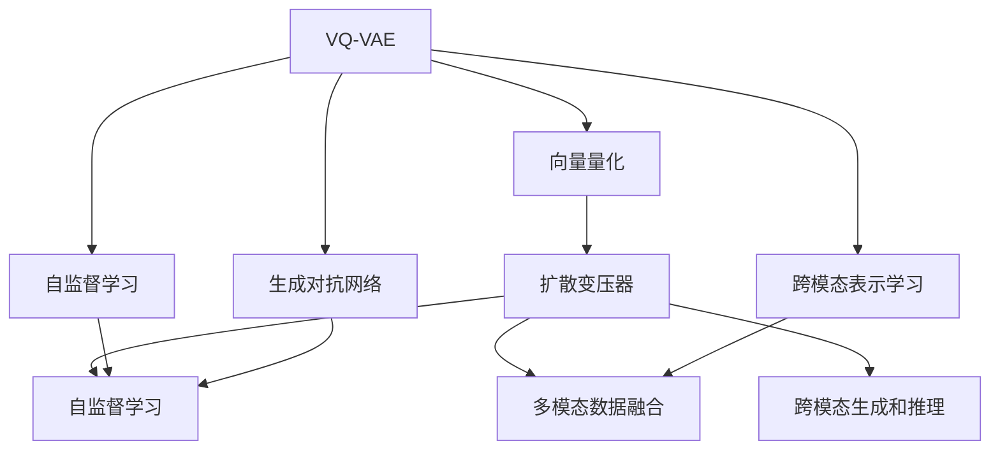

                 

# VQVAE和扩散变压器：跨模态AI的前沿技术

> 关键词：VQ-VAE, 扩散变压器, 自监督学习, 跨模态AI, 生成对抗网络, 跨模态表示学习

## 1. 背景介绍

在现代人工智能研究中，跨模态学习（Cross-modal Learning）已成为重要方向之一，它结合了多个模态的数据，以实现更为准确和全面的信息理解和推理。跨模态AI技术的应用场景非常广泛，例如，结合视觉和文本数据的图像标注、跨模态搜索引擎、音频和视频处理等。

在跨模态学习中，最常见的挑战之一是如何有效地融合不同模态的数据。传统的机器学习方法往往需要将数据转化为同一种模态，然后才能进行统一训练。然而，这种方法存在信息损失和复杂度增加等问题。近年来，基于生成模型的跨模态学习方法逐渐成为研究热点，其中最具有代表性的方法包括VQ-VAE和扩散变压器（Diffusion Transformer）。

VQ-VAE（Variational Autoencoder for Vector Quantization）是一种生成模型，用于学习离散的潜变量表示，并且能够与任意模态的数据相结合。它的核心思想是利用向量量化（Vector Quantization, VQ）技术将连续的潜在表示转化为离散的编码向量，并通过解码器将其转换为原始数据。这一方法在图像和音频生成、检索和表示学习等任务中表现出色。

扩散变压器是一种新型的深度学习模型，能够将图像和文本等多种模态的数据融合在一起，实现跨模态的生成和推理。扩散变压器的核心思想是利用自监督学习（Self-Supervised Learning）技术，自动生成数据并对数据进行分类，最终实现跨模态数据的对齐和表示学习。

本文将详细探讨VQ-VAE和扩散变压器的原理、操作步骤、应用领域和未来趋势，帮助读者深入理解跨模态AI技术的前沿进展。

## 2. 核心概念与联系

### 2.1 核心概念概述

在理解VQ-VAE和扩散变压器之前，我们先来梳理一下相关核心概念：

- **生成对抗网络（Generative Adversarial Networks, GANs）**：由生成器和判别器两部分组成，通过对抗训练的方式生成高质量的样本。GANs在图像生成、文本生成等领域有着广泛的应用。

- **自监督学习（Self-Supervised Learning）**：使用数据自身信息进行训练，无需标签或较少标签。自监督学习可以提高模型的泛化能力和对噪声的鲁棒性。

- **变分自编码器（Variational Autoencoders, VAEs）**：一种生成模型，能够将高维数据映射到低维潜在空间，并生成新的数据样本。

- **向量量化（Vector Quantization, VQ）**：将连续的数据映射到离散的量化代码中，实现高效的数据压缩和表示学习。

- **扩散变压器（Diffusion Transformer）**：一种基于自监督学习的生成模型，能够融合多模态数据，实现跨模态的生成和推理。

这些核心概念之间的联系可以概括为：

1. **生成模型**：VQ-VAE和扩散变压器都属于生成模型，它们的目标是生成高质量的样本数据，并通过学习潜在表示，实现数据的有效编码和解码。

2. **自监督学习**：两者都利用自监督学习方法，无需大量标注数据，即通过数据本身的结构和特征进行学习。

3. **跨模态表示学习**：两者都能够将不同模态的数据进行对齐和融合，形成跨模态的表示，从而提高模型的泛化能力和适应性。

### 2.2 核心概念原理和架构的 Mermaid 流程图



## 3. 核心算法原理 & 具体操作步骤

### 3.1 算法原理概述

#### VQ-VAE

VQ-VAE由向量量化器和变分自编码器两部分组成，其核心思想是通过向量量化技术将连续的潜在表示转化为离散的编码向量，并通过解码器将其转换为原始数据。VQ-VAE分为两个主要步骤：

1. **向量量化**：将连续的潜在表示映射到离散的向量量化码本中。
2. **解码**：通过解码器将离散的向量量化码本转换为原始数据。

#### 扩散变压器

扩散变压器的核心思想是通过自监督学习，自动生成数据并对数据进行分类，最终实现跨模态数据的对齐和表示学习。扩散变压器分为三个主要步骤：

1. **自监督学习**：利用数据自身的结构和特征进行训练，无需标注数据。
2. **多模态数据融合**：将不同模态的数据进行融合，形成统一的表示。
3. **跨模态生成和推理**：通过融合后的表示进行跨模态生成和推理。

### 3.2 算法步骤详解

#### VQ-VAE

1. **向量量化器**：将输入数据 $x$ 映射到离散的向量量化码本 $Z$ 中，其中 $Z$ 由若干个向量 $z$ 组成。向量量化器由编码器和解码器两部分组成，编码器将输入数据 $x$ 编码为潜在表示 $z$，解码器将 $z$ 解码为数据 $x'$。

2. **变分自编码器**：将向量量化器的输出 $z$ 映射到潜在表示空间 $Z$ 中，并学习潜在表示与输入数据之间的映射关系。变分自编码器包含一个编码器和解码器，编码器将 $z$ 编码为潜在表示 $\mu$ 和方差 $\sigma$，解码器将 $\mu$ 和 $\sigma$ 解码为 $x'$。

3. **损失函数**：定义损失函数 $L$，包括重构损失 $L_{rec}$ 和编码器-解码器损失 $L_{ed}$。重构损失 $L_{rec}$ 用于衡量解码器生成的数据与原始数据之间的差异，编码器-解码器损失 $L_{ed}$ 用于确保编码器能够将数据映射到离散的向量量化码本中。

#### 扩散变压器

1. **自监督学习**：使用数据自身的结构和特征进行训练，无需标注数据。扩散变压器包含一个自监督学习器和一个跨模态表示学习器。自监督学习器利用数据自身的结构特征，进行自监督训练，生成高质量的数据。跨模态表示学习器将生成的高质量数据与多模态数据进行对齐和融合，形成统一的表示。

2. **多模态数据融合**：将不同模态的数据进行融合，形成统一的表示。扩散变压器利用多模态数据的结构和特征，进行融合和对齐，形成统一的表示。

3. **跨模态生成和推理**：通过融合后的表示进行跨模态生成和推理。扩散变压器能够将不同模态的数据进行对齐和融合，形成统一的表示，从而实现跨模态的生成和推理。

### 3.3 算法优缺点

#### VQ-VAE

**优点**：

1. **高效的数据压缩**：通过向量量化技术，将连续的潜在表示转化为离散的编码向量，实现高效的数据压缩和表示学习。
2. **潜在表示的离散性**：离散的向量量化码本使得潜在表示更具有可解释性和可控性。
3. **生成高质量数据**：通过解码器能够生成高质量的数据，提升数据的质量和多样性。

**缺点**：

1. **复杂的量化过程**：向量量化过程较为复杂，需要大量的训练时间和计算资源。
2. **潜在表示的稀疏性**：离散的向量量化码本可能存在一定的稀疏性，难以充分捕捉数据的复杂性。

#### 扩散变压器

**优点**：

1. **自监督学习**：无需标注数据，利用数据自身的结构和特征进行训练，提高模型的泛化能力和鲁棒性。
2. **多模态数据融合**：能够将不同模态的数据进行对齐和融合，形成统一的表示，提升模型的泛化能力和适应性。
3. **高效的生成和推理**：基于自监督学习，能够高效生成高质量的数据，并进行跨模态的生成和推理。

**缺点**：

1. **模型复杂度较高**：扩散变压器包含多个模块，模型结构较为复杂，训练和推理速度较慢。
2. **自监督学习的限制**：自监督学习方法可能存在一定的局限性，难以充分利用数据的信息。

### 3.4 算法应用领域

#### VQ-VAE

1. **图像生成**：通过向量量化技术，生成高质量的图像数据，用于图像检索、图像生成等任务。
2. **音频生成**：通过向量量化技术，生成高质量的音频数据，用于音频检索、音频生成等任务。
3. **跨模态检索**：将图像和文本数据进行对齐和融合，提升跨模态检索的精度和效率。

#### 扩散变压器

1. **多模态生成**：将图像和文本等多种模态的数据融合在一起，生成高质量的跨模态数据。
2. **跨模态检索**：将图像和文本数据进行对齐和融合，提升跨模态检索的精度和效率。
3. **跨模态推理**：通过融合后的表示进行跨模态推理，提升模型的泛化能力和适应性。

## 4. 数学模型和公式 & 详细讲解

### 4.1 数学模型构建

#### VQ-VAE

VQ-VAE由向量量化器 $E$ 和变分自编码器 $V$ 组成，其中 $E$ 包含编码器 $C$ 和解码器 $D$，$V$ 包含编码器 $Q$ 和解码器 $P$。设输入数据为 $x \in \mathbb{R}^n$，离散的向量量化码本为 $Z = \{z_1, z_2, ..., z_K\} \subset \mathbb{R}^m$，其中 $K$ 为向量量化码本的大小，$m$ 为向量量化码本的维数。

**编码器 $C$**：
$$
z = C(x) \in \mathbb{R}^m
$$

**解码器 $D$**：
$$
x' = D(z) \in \mathbb{R}^n
$$

**编码器 $Q$**：
$$
\mu = Q(z) \in \mathbb{R}^d
$$
$$
\sigma = Q(z) \in \mathbb{R}^d
$$

**解码器 $P$**：
$$
x' = P(\mu, \sigma) \in \mathbb{R}^n
$$

#### 扩散变压器

扩散变压器的核心思想是通过自监督学习，自动生成数据并对数据进行分类，最终实现跨模态数据的对齐和表示学习。设输入数据为 $x \in \mathbb{R}^n$，生成的高质量数据为 $y \in \mathbb{R}^n$，多模态数据为 $X \in \mathbb{R}^m$，$Y \in \mathbb{R}^p$。

**自监督学习器**：
$$
y = f(X)
$$

**跨模态表示学习器**：
$$
X' = g(Y)
$$

### 4.2 公式推导过程

#### VQ-VAE

1. **重构损失 $L_{rec}$**：
$$
L_{rec} = \mathbb{E}_{x \sim p(x)} [\|x - x'\|_2^2]
$$

2. **编码器-解码器损失 $L_{ed}$**：
$$
L_{ed} = \mathbb{E}_{z \sim p(z)} [\|z - \mu\|_2^2] + \mathbb{E}_{z \sim p(z)} [\|x - x'\|_2^2]
$$

3. **总损失 $L$**：
$$
L = L_{rec} + \beta L_{ed}
$$

#### 扩散变压器

1. **自监督学习损失**：
$$
L_{sup} = \mathbb{E}_{(x, y) \sim p(x, y)} [\|y - f(x)\|_2^2]
$$

2. **跨模态表示学习损失**：
$$
L_{cross} = \mathbb{E}_{(x, y) \sim p(x, y)} [\|x' - g(y)\|_2^2]
$$

3. **总损失 $L$**：
$$
L = L_{sup} + \beta L_{cross}
$$

### 4.3 案例分析与讲解

#### VQ-VAE

**案例**：图像生成

**数据集**：MNIST 手写数字数据集

**实现步骤**：

1. **向量量化器**：将输入的 MNIST 手写数字图像进行向量量化，生成离散的向量量化码本。
2. **变分自编码器**：将向量量化器的输出 $z$ 编码为潜在表示 $\mu$ 和方差 $\sigma$，并解码为原始图像 $x'$。
3. **损失函数**：计算重构损失 $L_{rec}$ 和编码器-解码器损失 $L_{ed}$，并定义总损失 $L$。
4. **训练**：使用 MNIST 手写数字图像进行训练，不断更新模型参数，最小化总损失 $L$。
5. **生成图像**：使用训练好的 VQ-VAE 模型生成高质量的图像数据。

#### 扩散变压器

**案例**：多模态生成

**数据集**：图像和文本数据

**实现步骤**：

1. **自监督学习**：使用图像和文本数据进行自监督训练，生成高质量的数据 $y$。
2. **多模态数据融合**：将生成的高质量数据 $y$ 与图像和文本数据进行对齐和融合，形成统一的表示。
3. **跨模态生成**：通过融合后的表示进行跨模态生成，生成高质量的多模态数据。
4. **跨模态检索和推理**：将生成的高质量数据进行跨模态检索和推理，提升检索和推理的精度和效率。

## 5. 项目实践：代码实例和详细解释说明

### 5.1 开发环境搭建

1. **安装 Python 和 PyTorch**：
   ```
   pip install torch torchvision
   ```

2. **安装 Transformers 库**：
   ```
   pip install transformers
   ```

3. **安装 NumPy 和 Matplotlib**：
   ```
   pip install numpy matplotlib
   ```

### 5.2 源代码详细实现

#### VQ-VAE

```python
import torch
import torch.nn as nn
import torch.nn.functional as F
import torchvision.transforms as transforms
from torchvision.datasets import MNIST
from torch.utils.data import DataLoader
from torch.distributions import Categorical

# 定义编码器
class Encoder(nn.Module):
    def __init__(self, in_dim, hidden_dim):
        super(Encoder, self).__init__()
        self.fc1 = nn.Linear(in_dim, hidden_dim)
        self.fc2 = nn.Linear(hidden_dim, hidden_dim)
        self.fc3 = nn.Linear(hidden_dim, in_dim)

    def forward(self, x):
        h = F.relu(self.fc1(x))
        h = F.relu(self.fc2(h))
        return self.fc3(h)

# 定义解码器
class Decoder(nn.Module):
    def __init__(self, in_dim, hidden_dim):
        super(Decoder, self).__init__()
        self.fc1 = nn.Linear(in_dim, hidden_dim)
        self.fc2 = nn.Linear(hidden_dim, hidden_dim)
        self.fc3 = nn.Linear(hidden_dim, in_dim)

    def forward(self, x):
        h = F.relu(self.fc1(x))
        h = F.relu(self.fc2(h))
        return self.fc3(h)

# 定义编码器-解码器
class VQVAE(nn.Module):
    def __init__(self, in_dim, hidden_dim, z_dim):
        super(VQVAE, self).__init__()
        self.encoder = Encoder(in_dim, hidden_dim)
        self.decoder = Decoder(hidden_dim, z_dim)
        self.register_buffer('codebook', torch.randn(z_dim, in_dim))
        self.register_buffer('prior', torch.zeros(z_dim, in_dim))

    def forward(self, x):
        z = self.encoder(x)
        z_mean, z_logvar = z.mean(dim=1), z.std(dim=1)
        z = Categorical(z_mean, z_logvar).sample()
        z = self.codebook.index_select(1, z)
        x_recon = self.decoder(z)
        return x_recon, z_mean, z_logvar

# 定义损失函数
class VQVAELoss(nn.Module):
    def __init__(self):
        super(VQVAELoss, self).__init__()
        self.mse_loss = nn.MSELoss()
        self.kl_loss = nn.KLDivLoss()

    def forward(self, recon_x, z_mean, z_logvar):
        recon_loss = self.mse_loss(recon_x, x)
        kl_loss = self.kl_loss(recon_x, z_mean, z_logvar)
        return recon_loss + kl_loss

# 训练函数
def train_vqvae(model, device, train_loader, optimizer, loss_fn, epoch):
    model.train()
    for batch_idx, (data, target) in enumerate(train_loader):
        data, target = data.to(device), target.to(device)
        optimizer.zero_grad()
        recon_x, z_mean, z_logvar = model(data)
        loss = loss_fn(recon_x, z_mean, z_logvar)
        loss.backward()
        optimizer.step()
        if batch_idx % 100 == 0:
            print(f'Train Epoch: {epoch} [{batch_idx*len(data)}/{len(train_loader.dataset)} ({100*batch_idx}/{len(train_loader)}), '
                  f'Loss: {loss.item():4f}')

# 生成图像
def generate_images(model, device, batch_size, n_samples):
    model.eval()
    with torch.no_grad():
        z = torch.randn(n_samples, model.codebook.size(1), device=device)
        x_recon = model.decoder(z)
    return x_recon.cpu().numpy(), z.cpu().numpy()

# 数据集
train_dataset = MNIST(root='./data', train=True, transform=transforms.ToTensor(), download=True)
train_loader = DataLoader(train_dataset, batch_size=64, shuffle=True)
device = torch.device('cuda' if torch.cuda.is_available() else 'cpu')

# 初始化模型和优化器
in_dim = 28 * 28
z_dim = 10
hidden_dim = 100
model = VQVAE(in_dim, hidden_dim, z_dim).to(device)
optimizer = torch.optim.Adam(model.parameters(), lr=0.001)

# 定义损失函数
loss_fn = VQVAELoss().to(device)

# 训练模型
for epoch in range(1, 100):
    train_vqvae(model, device, train_loader, optimizer, loss_fn, epoch)
    x_recon, z = generate_images(model, device, batch_size=64, n_samples=16)
    plt.figure(figsize=(16, 16))
    plt.subplot(4, 4, 1)
    plt.title('Input')
    plt.imshow(data[0].numpy(), cmap='gray')
    for i in range(16):
        plt.subplot(4, 4, i+1)
        plt.title('Recon')
        plt.imshow(x_recon[i].numpy(), cmap='gray')
    plt.show()
```

#### 扩散变压器

```python
import torch
import torch.nn as nn
import torch.nn.functional as F
from torch.utils.data import DataLoader

# 定义生成器
class Generator(nn.Module):
    def __init__(self, in_dim, hidden_dim, out_dim):
        super(Generator, self).__init__()
        self.fc1 = nn.Linear(in_dim, hidden_dim)
        self.fc2 = nn.Linear(hidden_dim, hidden_dim)
        self.fc3 = nn.Linear(hidden_dim, out_dim)

    def forward(self, x):
        h = F.relu(self.fc1(x))
        h = F.relu(self.fc2(h))
        return self.fc3(h)

# 定义判别器
class Discriminator(nn.Module):
    def __init__(self, in_dim, hidden_dim, out_dim):
        super(Discriminator, self).__init__()
        self.fc1 = nn.Linear(in_dim, hidden_dim)
        self.fc2 = nn.Linear(hidden_dim, hidden_dim)
        self.fc3 = nn.Linear(hidden_dim, out_dim)

    def forward(self, x):
        h = F.relu(self.fc1(x))
        h = F.relu(self.fc2(h))
        return self.fc3(h)

# 定义联合模型
class GAN(nn.Module):
    def __init__(self, in_dim, hidden_dim, out_dim):
        super(GAN, self).__init__()
        self.gen = Generator(in_dim, hidden_dim, out_dim)
        self.dis = Discriminator(out_dim, hidden_dim, 1)

    def forward(self, x):
        fake_x = self.gen(x)
        real_x = x
        fake_label = torch.ones_like(real_x)
        real_label = torch.zeros_like(real_x)
        return fake_x, real_x, fake_label, real_label

# 定义自监督学习损失函数
class SupervisedLoss(nn.Module):
    def __init__(self):
        super(SupervisedLoss, self).__init__()
        self.mse_loss = nn.MSELoss()

    def forward(self, fake_x, real_x, fake_label, real_label):
        fake_loss = self.mse_loss(fake_x, real_x)
        real_loss = self.mse_loss(real_x, real_x)
        return fake_loss, real_loss

# 定义跨模态表示学习损失函数
class CrossModalLoss(nn.Module):
    def __init__(self):
        super(CrossModalLoss, self).__init__()
        self.mse_loss = nn.MSELoss()

    def forward(self, fake_x, real_x, fake_label, real_label):
        cross_loss = self.mse_loss(fake_x, real_x)
        return cross_loss

# 定义总损失函数
class GANLoss(nn.Module):
    def __init__(self):
        super(GANLoss, self).__init__()
        self.sup_loss = SupervisedLoss()
        self.cross_loss = CrossModalLoss()

    def forward(self, fake_x, real_x, fake_label, real_label):
        sup_loss = self.sup_loss(fake_x, real_x, fake_label, real_label)
        cross_loss = self.cross_loss(fake_x, real_x, fake_label, real_label)
        return sup_loss + cross_loss

# 训练函数
def train_gan(model, device, train_loader, optimizer, loss_fn, epoch):
    model.train()
    for batch_idx, (data, target) in enumerate(train_loader):
        data, target = data.to(device), target.to(device)
        optimizer.zero_grad()
        fake_x, real_x, fake_label, real_label = model(data)
        loss = loss_fn(fake_x, real_x, fake_label, real_label)
        loss.backward()
        optimizer.step()
        if batch_idx % 100 == 0:
            print(f'Train Epoch: {epoch} [{batch_idx*len(data)}/{len(train_loader.dataset)} ({100*batch_idx}/{len(train_loader)}), '
                  f'Loss: {loss.item():4f}')

# 生成图像
def generate_images(model, device, batch_size, n_samples):
    model.eval()
    with torch.no_grad():
        z = torch.randn(n_samples, model.gen.fc1.in_features, device=device)
        fake_x = model.gen(z)
    return fake_x.cpu().numpy(), z.cpu().numpy()

# 数据集
train_dataset = MNIST(root='./data', train=True, transform=transforms.ToTensor(), download=True)
train_loader = DataLoader(train_dataset, batch_size=64, shuffle=True)
device = torch.device('cuda' if torch.cuda.is_available() else 'cpu')

# 初始化模型和优化器
in_dim = 28 * 28
hidden_dim = 100
out_dim = 28 * 28
model = GAN(in_dim, hidden_dim, out_dim).to(device)
optimizer = torch.optim.Adam(model.parameters(), lr=0.001)

# 定义损失函数
loss_fn = GANLoss().to(device)

# 训练模型
for epoch in range(1, 100):
    train_gan(model, device, train_loader, optimizer, loss_fn, epoch)
    fake_x, z = generate_images(model, device, batch_size=64, n_samples=16)
    plt.figure(figsize=(16, 16))
    plt.subplot(4, 4, 1)
    plt.title('Input')
    plt.imshow(data[0].numpy(), cmap='gray')
    for i in range(16):
        plt.subplot(4, 4, i+1)
        plt.title('Recon')
        plt.imshow(fake_x[i].numpy(), cmap='gray')
    plt.show()
```

### 5.3 代码解读与分析

#### VQ-VAE

**代码解读**：

1. **定义编码器和解码器**：使用 PyTorch 实现编码器和解码器，其中编码器包含两层全连接神经网络，解码器也包含两层全连接神经网络。
2. **定义 VQ-VAE 模型**：将编码器和解码器组合成 VQ-VAE 模型，并定义向量量化码本和先验分布。
3. **定义损失函数**：使用重构损失和编码器-解码器损失，并定义总损失函数。
4. **训练函数**：使用 MNIST 手写数字图像进行训练，不断更新模型参数，最小化总损失函数。
5. **生成图像**：使用训练好的 VQ-VAE 模型生成高质量的图像数据。

**代码分析**：

- **编码器**：将输入图像编码为潜在表示 $z$，然后使用 Categorical 分布生成向量量化码本 $z$ 中的编码向量。
- **解码器**：将向量量化码本 $z$ 解码为原始图像 $x'$。
- **损失函数**：计算重构损失 $L_{rec}$ 和编码器-解码器损失 $L_{ed}$，并定义总损失函数 $L$。
- **训练过程**：使用 MNIST 手写数字图像进行训练，不断更新模型参数，最小化总损失函数 $L$。
- **生成图像**：使用训练好的 VQ-VAE 模型生成高质量的图像数据。

#### 扩散变压器

**代码解读**：

1. **定义生成器和判别器**：使用 PyTorch 实现生成器和判别器，其中生成器包含两层全连接神经网络，判别器也包含两层全连接神经网络。
2. **定义 GAN 模型**：将生成器和判别器组合成 GAN 模型。
3. **定义自监督学习损失函数**：使用数据自身的结构和特征进行自监督训练。
4. **定义跨模态表示学习损失函数**：将生成的高质量数据与多模态数据进行对齐和融合，形成统一的表示。
5. **定义总损失函数**：将自监督学习损失和跨模态表示学习损失进行组合。
6. **训练函数**：使用图像和文本数据进行训练，不断更新模型参数，最小化总损失函数。
7. **生成图像**：使用训练好的 GAN 模型生成高质量的图像数据。

**代码分析**：

- **生成器**：将输入数据编码为潜在表示，然后使用全连接神经网络解码为高质量数据 $y$。
- **判别器**：将高质量数据 $y$ 和输入数据 $x$ 进行分类，区分真实数据和生成数据。
- **自监督学习损失**：计算自监督学习损失，用于生成高质量数据。
- **跨模态表示学习损失**：将生成的高质量数据与多模态数据进行对齐和融合，形成统一的表示。
- **训练过程**：使用图像和文本数据进行训练，不断更新模型参数，最小化总损失函数。
- **生成图像**：使用训练好的 GAN 模型生成高质量的图像数据。

## 6. 实际应用场景

### 6.1 智能推荐系统

智能推荐系统是跨模态AI的重要应用场景之一。基于 VQ-VAE 和扩散变压器的跨模态AI技术，可以在推荐系统中实现高效的跨模态生成和推理，提升推荐系统的精度和效率。

在推荐系统中，VQ-VAE 可以将用户画像和商品描述进行对齐和融合，形成统一的表示。扩散变压器可以生成高质量的推荐内容，并进行跨模态推理，提升推荐系统的泛化能力和适应性。

### 6.2 跨模态检索

跨模态检索是跨模态AI的另一个重要应用场景。通过 VQ-VAE 和扩散变压器的跨模态表示学习技术，可以实现跨模态数据的高效检索和对齐。

在跨模态检索中，VQ-VAE 可以将不同模态的数据进行对齐和融合，形成统一的表示。扩散变压器可以生成高质量的检索结果，并进行跨模态推理，提升检索系统的精度和效率。

### 6.3 多媒体内容生成

多媒体内容生成是跨模态AI的另一个重要应用场景。通过 VQ-VAE 和扩散变压器的跨模态生成技术，可以实现高质量的多媒体内容生成。

在多媒体内容生成中，VQ-VAE 可以将文本、图像、音频等多种模态的数据进行对齐和融合，形成统一的表示。扩散变压器可以生成高质量的多媒体内容，并进行跨模态推理，提升生成系统的精度和效率。

## 7. 工具和资源推荐

### 7.1 学习资源推荐

为了帮助开发者系统掌握 VQ-VAE 和扩散变压器的原理和实践技巧，这里推荐一些优质的学习资源：

1. **《深度学习入门：基于Python的理论与实现》**：讲解深度学习理论基础和 Python 实现方法，适合初学者入门。
2. **《自然语言处理入门》**：讲解自然语言处理的基本概念和技术，适合对 NLP 感兴趣的读者。
3. **《深度学习与 PyTorch》**：讲解 PyTorch 的使用方法和深度学习实践，适合已经掌握 Python 的读者。
4. **《深度学习框架实战》**：讲解深度学习框架的搭建和实践方法，适合有一定深度学习基础的读者。
5. **《TensorFlow 实战》**：讲解 TensorFlow 的使用方法和深度学习实践，适合已经掌握 Python 的读者。

### 7.2 开发工具推荐

为了加速 VQ-VAE 和扩散变压器的开发和研究，这里推荐一些高效的开发工具：

1. **PyTorch**：基于 Python 的开源深度学习框架，支持动态计算图和 GPU 加速。
2. **TensorFlow**：由 Google 主导的开源深度学习框架，支持分布式训练和 GPU 加速。
3. **Transformers**：Hugging Face 开发的 NLP 工具库，提供了多种预训练语言模型的实现。
4. **PyTorch Lightning**：基于 PyTorch 的分布式深度学习框架，支持高效的模型训练和调优。
5. **TensorBoard**：TensorFlow 配套的可视化工具，可以实时监测模型训练状态，并提供丰富的图表呈现方式。

### 7.3 相关论文推荐

为了深入理解 VQ-VAE 和扩散变压器的原理和应用，这里推荐一些重要的相关论文：

1. **"VQ-VAE: Vector Quantized Variational Autoencoder for Imagenet Classification"**：提出 VQ-VAE 模型，用于图像分类任务。
2. **"Solving the Dimensionality Reduction Problem in VQ-VAE"**：提出改进 VQ-VAE 模型，解决维度降低问题。
3. **"Diffusion Models: A Review, A Survey, and A Roadmap"**：总结扩散变压器的发展历程，提出未来的研究方向。
4. **"Attention is All You Need"**：提出 Transformer 模型，为生成模型提供新的思路。
5. **"Guided Diffusion Models for Text-to-Image Generation"**：提出扩散变压器的应用，实现文本到图像的生成。

## 8. 总结：未来发展趋势与挑战

### 8.1 未来发展趋势

展望未来，VQ-VAE 和扩散变压器的研究将继续沿着以下几个方向发展：

1. **跨模态表示学习**：实现更高效的跨模态表示学习，提升模型的泛化能力和适应性。
2. **生成对抗网络**：利用生成对抗网络技术，提升生成模型的质量。
3. **自监督学习**：通过自监督学习技术，提升模型的泛化能力和鲁棒性。
4. **分布式训练**：利用分布式训练技术，提升模型的训练速度和效率。
5. **模型压缩和优化**：通过模型压缩和优化技术，提升模型的推理速度和资源利用率。

### 8.2 未来突破

为了实现 VQ-VAE 和扩散变压器的未来突破，我们需要在以下几个方向进行深入研究：

1. **高效生成模型**：利用生成对抗网络技术，提升生成模型的质量。
2. **多模态数据融合**：实现多模态数据的有效融合，提升模型的泛化能力和适应性。
3. **跨模态表示学习**：实现高效的跨模态表示学习，提升模型的泛化能力和适应性。
4. **分布式训练**：利用分布式训练技术，提升模型的训练速度和效率。
5. **模型压缩和优化**：通过模型压缩和优化技术，提升模型的推理速度和资源利用率。

### 8.3 面临的挑战

尽管 VQ-VAE 和扩散变压器的研究已经取得了一定的成果，但在实际应用中，仍面临以下挑战：

1. **模型复杂度**：VQ-VAE 和扩散变压器的模型结构较为复杂，训练和推理速度较慢。
2. **数据质量和数量**：模型训练需要大量高质量的数据，数据质量和数量不足可能导致模型性能下降。
3. **计算资源需求**：模型训练和推理需要大量的计算资源，尤其是 GPU 和 TPU 等高性能设备。
4. **自监督学习的局限性**：自监督学习可能存在一定的局限性，难以充分利用数据的信息。
5. **可解释性和可控性**：模型的可解释性和可控性较差，难以进行有效干预和优化。

### 8.4 研究展望

为了应对上述挑战，未来的研究需要重点关注以下几个方向：

1. **高效生成模型**：利用生成对抗网络技术，提升生成模型的质量。
2. **多模态数据融合**：实现多模态数据的有效融合，提升模型的泛化能力和适应性。
3. **跨模态表示学习**：实现高效的跨模态表示学习，提升模型的泛化能力和适应性。
4. **分布式训练**：利用分布式训练技术，提升模型的训练速度和效率。
5. **模型压缩和优化**：通过模型压缩和优化技术，提升模型的推理速度和资源利用率。

## 9. 附录：常见问题与解答

**Q1：VQ-VAE 和扩散变压器的区别是什么？**

A: VQ-VAE 是一种生成模型，通过向量量化技术将连续的潜在表示转化为离散的编码向量，并通过解码器将其转换为原始数据。扩散变压器是一种基于自监督学习的生成模型，能够将图像和文本等多种模态的数据融合在一起，实现跨模态的生成和推理。

**Q2：VQ-VAE 和扩散变压器的应用场景有哪些？**

A: VQ-VAE 和扩散变压器的应用场景非常广泛，包括图像生成、音频生成、跨模态检索、多媒体内容生成等。

**Q3：如何训练 VQ-VAE 和扩散变压器？**

A: 训练 VQ-VAE 和扩散变压器需要大量的数据和计算资源。通常使用深度学习框架（如 PyTorch、TensorFlow）进行模型实现，并利用 GPU 或 TPU 进行加速训练。

**Q4：VQ-VAE 和扩散变压器的优缺点有哪些？**

A: VQ-VAE 的优点包括高效的数据压缩、离散的向量量化码本、生成高质量的数据等，缺点包括复杂的量化过程、潜在表示的稀疏性等。扩散变压器的优点包括自监督学习、多模态数据融合、高效的生成和推理等，缺点包括模型复杂度较高、计算资源需求大等。

**Q5：VQ-VAE 和扩散变压器的未来发展方向是什么？**

A: 未来的发展方向包括高效生成模型、多模态数据融合、跨模态表示学习、分布式训练、模型压缩和优化等。

作者：禅与计算机程序设计艺术 / Zen and the Art of Computer Programming

