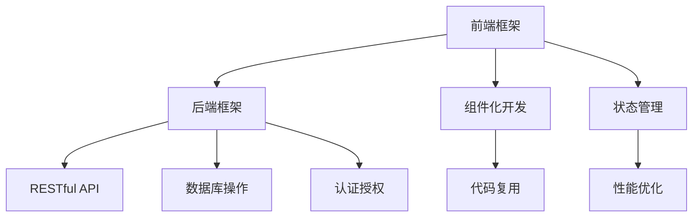

                 

## Web 开发框架：提升网站开发效率

> 关键词：Web 开发框架, 网站开发效率, 前后端分离, 前端框架, 后端框架, RESTful API, 代码复用, 性能优化

### 1. 背景介绍

在现代社会，网站作为信息交流、商业交易的重要平台，其开发效率直接影响着企业的竞争力和用户体验。传统的网站开发模式需要前后端开发者独立开发、调试，导致开发周期长、成本高、维护困难。Web 开发框架的诞生，为解决这一问题提供了重要的技术手段。本文将介绍当前流行的Web开发框架，并探讨其如何提升网站开发效率。

### 2. 核心概念与联系

#### 2.1 核心概念概述

- **Web 开发框架**：一种用于构建 Web 应用程序的软件工具，封装了前后端开发的基础功能，如路由、模板、表单处理等，简化了开发流程，提高了开发效率。
- **前后端分离**：将前端代码和后端代码分离，前端负责界面展示和用户体验，后端负责业务逻辑和数据处理，实现清晰的分工与协作。
- **前端框架**：如React、Vue等，用于构建用户界面，支持组件化开发、状态管理等特性。
- **后端框架**：如Django、Flask等，用于处理后端逻辑，提供RESTful API接口，支持数据库操作、认证授权等功能。
- **RESTful API**：基于REST架构风格的API设计，支持多种数据格式，易于扩展和维护。
- **代码复用**：通过框架提供的组件和功能，实现代码的快速复用，减少重复开发，提高开发效率。
- **性能优化**：通过框架提供的技术手段，如缓存、负载均衡等，优化Web应用性能，提升用户体验。

#### 2.2 核心概念原理和架构的 Mermaid 流程图



### 3. 核心算法原理 & 具体操作步骤

#### 3.1 算法原理概述

Web 开发框架通过封装前后端开发的基础功能，提供了一组API，使开发者可以快速构建、调试、部署Web应用。其核心算法原理包括：

- **路由**：根据URL路径，匹配对应的控制器和操作，实现请求分发。
- **模板引擎**：将动态生成的数据填充到静态模板中，生成HTML页面。
- **表单处理**：自动解析HTTP请求中的表单数据，简化数据获取过程。
- **认证授权**：通过HTTP认证头或Token等机制，实现用户身份验证和权限控制。
- **缓存**：利用内存、Redis等缓存机制，提高数据读取速度，减少服务器压力。
- **负载均衡**：通过DNS轮询、Nginx代理等技术，实现请求分发，提高系统可靠性。

#### 3.2 算法步骤详解

1. **需求分析**：明确项目需求，确定功能模块和界面设计。
2. **选择框架**：根据项目需求和技术栈，选择适合的前端和后端框架。
3. **环境搭建**：配置开发环境，安装必要的依赖库和工具。
4. **项目结构设计**：设计项目文件结构，实现前后端分离。
5. **前后端协作**：通过RESTful API接口，实现前后端数据交互。
6. **代码编写**：根据框架提供的API，编写前后端代码。
7. **测试与调试**：对代码进行单元测试和集成测试，修复bug和性能问题。
8. **部署上线**：将代码部署到服务器，进行性能优化和安全加固。

#### 3.3 算法优缺点

##### 优点

- **提高开发效率**：框架提供了一组API，使开发者可以快速构建Web应用。
- **降低开发成本**：框架封装了常见功能，减少了重复开发的工作量。
- **提升代码质量**：框架遵循良好的开发规范，提高代码的可读性和可维护性。
- **优化用户体验**：框架提供了丰富的UI组件和性能优化手段，提升用户体验。

##### 缺点

- **学习成本高**：初学者需要掌握框架的API和最佳实践。
- **灵活性不足**：框架的规范限制了开发者的自由度。
- **性能问题**：框架本身可能带来一定的性能开销。

#### 3.4 算法应用领域

Web 开发框架广泛应用于各种Web应用的开发，包括电商、社交、教育、政府等。在实际应用中，前端框架如React、Vue等主要用于前端界面的开发，后端框架如Django、Flask等主要用于后端逻辑和API接口的处理。

### 4. 数学模型和公式 & 详细讲解 & 举例说明

#### 4.1 数学模型构建

假设一个Web应用需要实现用户登录功能，可以使用Django框架构建后端逻辑。以下是基本的Django模型和视图代码：

```python
# models.py
from django.db import models

class User(models.Model):
    username = models.CharField(max_length=30)
    password = models.CharField(max_length=30)

# views.py
from django.shortcuts import render
from django.contrib.auth import authenticate, login

def login_view(request):
    if request.method == 'POST':
        username = request.POST['username']
        password = request.POST['password']
        user = authenticate(request, username=username, password=password)
        if user is not None:
            login(request, user)
            return redirect('home')
    return render(request, 'login.html')
```

#### 4.2 公式推导过程

假设用户输入的登录信息为`username`和`password`，后端逻辑如下：

1. 从数据库中查询用户信息，获取用户密码`hash_password`。
2. 对用户输入的密码进行加密，得到`encrypted_password`。
3. 比较`hash_password`和`encrypted_password`是否相等，若相等，则登录成功。

公式推导如下：

$$
\text{hash\_password} = \text{SHA256}(\text{password})
$$

$$
\text{encrypted\_password} = \text{AES}(\text{username}, \text{password})
$$

$$
\text{is\_valid} = \text{hash\_password} == \text{encrypted\_password}
$$

#### 4.3 案例分析与讲解

在实际应用中，Django框架提供了许多便捷的功能，如表单处理、认证授权、缓存等，使得用户登录功能的开发变得非常简单。以下是Django框架提供的登录功能示例：

```python
# views.py
from django.contrib.auth import authenticate, login

def login_view(request):
    if request.method == 'POST':
        username = request.POST['username']
        password = request.POST['password']
        user = authenticate(request, username=username, password=password)
        if user is not None:
            login(request, user)
            return redirect('home')
    return render(request, 'login.html')
```

### 5. 项目实践：代码实例和详细解释说明

#### 5.1 开发环境搭建

以下是使用Django框架搭建Web应用的示例：

1. 安装Django：`pip install django`
2. 创建项目：`django-admin startproject myproject`
3. 创建应用：`python manage.py startapp myapp`
4. 配置数据库：`settings.py`中配置数据库连接信息。
5. 编写模型和视图代码。
6. 运行测试：`python manage.py test myapp`
7. 部署项目：使用Gunicorn或Nginx等工具部署到服务器。

#### 5.2 源代码详细实现

以下是使用Django框架搭建用户登录功能的示例代码：

```python
# models.py
from django.db import models

class User(models.Model):
    username = models.CharField(max_length=30)
    password = models.CharField(max_length=30)

# views.py
from django.shortcuts import render
from django.contrib.auth import authenticate, login

def login_view(request):
    if request.method == 'POST':
        username = request.POST['username']
        password = request.POST['password']
        user = authenticate(request, username=username, password=password)
        if user is not None:
            login(request, user)
            return redirect('home')
    return render(request, 'login.html')
```

#### 5.3 代码解读与分析

代码主要包含以下几个部分：

1. 在`models.py`中定义了一个`User`模型，包含用户名和密码字段。
2. 在`views.py`中定义了一个`login_view`视图函数，接收POST请求，获取用户名和密码，进行认证登录。
3. 使用Django的`authenticate`函数进行用户认证，成功则调用`login`函数登录。
4. 如果认证失败，则返回登录页面。

#### 5.4 运行结果展示

运行测试：`python manage.py test myapp`，如果没有报错，则说明代码正确。

### 6. 实际应用场景

Web 开发框架在各种场景下都有广泛应用，以下是几个典型的应用场景：

#### 6.1 电商网站

电商网站需要处理大量用户数据和订单信息，使用Django、Flask等框架可以快速搭建后台管理系统，处理数据存储和业务逻辑。

#### 6.2 社交平台

社交平台需要处理用户数据和消息，使用React、Vue等前端框架可以快速构建前端界面，使用Django、Flask等后端框架处理后台逻辑和数据存储。

#### 6.3 政府网站

政府网站需要处理大量公共数据和信息，使用Django、Flask等框架可以快速搭建后台管理系统，处理数据存储和业务逻辑。

#### 6.4 未来应用展望

未来，Web 开发框架将继续演进，支持更多的功能特性，如无代码开发、低代码开发等，使开发者能够更高效地开发Web应用。

### 7. 工具和资源推荐

#### 7.1 学习资源推荐

1. **《Web 开发框架实战》**：详细介绍了Django、Flask等主流Web框架的使用方法和最佳实践。
2. **《JavaScript框架与设计模式》**：介绍了React、Vue等前端框架的设计思想和开发技巧。
3. **《Django实战》**：讲解了Django框架的核心功能和应用场景。
4. **《Flask实战》**：讲解了Flask框架的核心功能和应用场景。
5. **《RESTful API开发》**：讲解了RESTful API的设计和实现方法。

#### 7.2 开发工具推荐

1. **PyCharm**：流行的Python IDE，支持Django、Flask等框架的开发调试。
2. **Visual Studio Code**：轻量级代码编辑器，支持多种编程语言和扩展插件。
3. **Git**：版本控制工具，支持代码协作和版本管理。
4. **JIRA**：项目管理工具，支持任务分配和进度跟踪。
5. **Postman**：API测试工具，支持RESTful API的调试和测试。

#### 7.3 相关论文推荐

1. **《Django框架设计思想》**：探讨了Django框架的设计理念和核心功能。
2. **《React框架核心技术》**：介绍了React框架的核心技术和应用场景。
3. **《Flask框架设计模式》**：讲解了Flask框架的设计模式和最佳实践。
4. **《RESTful API设计规范》**：探讨了RESTful API的设计规范和实现方法。

### 8. 总结：未来发展趋势与挑战

#### 8.1 研究成果总结

Web 开发框架通过封装前后端开发的基础功能，显著提高了网站开发效率，推动了Web应用的发展。Django、Flask等框架在实际应用中表现优异，被广泛应用于各类Web应用开发。

#### 8.2 未来发展趋势

未来，Web 开发框架将继续演进，支持更多的功能特性，如无代码开发、低代码开发等，使开发者能够更高效地开发Web应用。

#### 8.3 面临的挑战

尽管Web 开发框架提高了开发效率，但也面临一些挑战，如学习成本高、灵活性不足、性能问题等。需要开发者不断探索和优化，才能实现更高效的开发。

#### 8.4 研究展望

未来，Web 开发框架的研究方向将集中在以下几个方面：

1. **无代码开发**：通过可视化的界面和配置工具，实现代码的自动生成和部署。
2. **低代码开发**：使用低代码平台，快速搭建Web应用。
3. **多语言支持**：支持多种编程语言，提升开发效率。
4. **智能开发**：使用人工智能技术，辅助代码生成和调试。

通过这些研究方向，Web 开发框架将进一步提升开发效率，使Web应用开发变得更加简单和高效。

### 9. 附录：常见问题与解答

**Q1: 如何选择合适的Web开发框架？**

A: 根据项目需求和技术栈，选择适合的前端和后端框架。一般而言，Django适合后端开发，React、Vue适合前端开发。

**Q2: 使用Web开发框架是否会影响性能？**

A: 合理的配置和使用Web开发框架，不会对性能造成显著影响。反而，框架提供的数据缓存、负载均衡等功能，可以优化Web应用性能。

**Q3: Web 开发框架的学习成本高吗？**

A: 是的，Web 开发框架的学习成本较高，需要掌握框架的API和最佳实践。但一旦掌握了框架的使用方法，可以大大提高开发效率。

**Q4: 使用Web开发框架有什么优点？**

A: 使用Web开发框架可以大大提高开发效率，减少重复开发的工作量，提升代码质量和用户体验。

**Q5: Web 开发框架的缺点是什么？**

A: 框架的规范限制了开发者的自由度，学习成本高，灵活性不足，可能带来一定的性能开销。

---

作者：禅与计算机程序设计艺术 / Zen and the Art of Computer Programming

