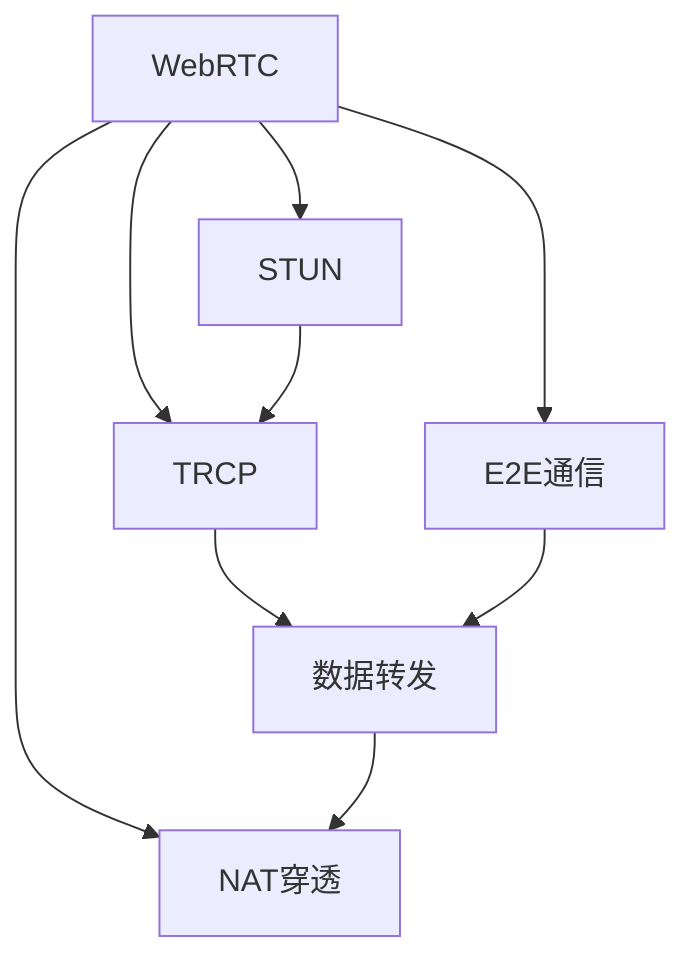

                 

# WebRTC NAT穿透：P2P通信的关键技术

> 关键词：WebRTC, NAT穿透, P2P通信, 实时音视频, STUN, TRCP, 端到端, 数据包, 中继, 穿越防火墙, 点对点

## 1. 背景介绍

随着互联网的普及和用户对实时音视频通信需求的增长，P2P（点对点）通信技术因其低延迟、高可靠性和扩展性，逐渐成为主流。然而，P2P通信面临的最大挑战之一是NAT穿透（NAT Traversal）问题。NAT穿透技术保证了P2P通信可以在多网关网络环境下正常工作，尤其是当用户终端位于网络地址转换（NAT）设备之后时。

### 1.1 问题由来

NAT穿透问题的根源在于现代路由器和防火墙普遍支持NAT技术。NAT技术将内网地址映射到公网地址，以隐藏内部网络结构。但在P2P通信中，两个终端之间需要直接进行数据交换，而NAT设备通常会阻止内网地址之间的直接通信。因此，在NAT设备之后，P2P通信需要进行NAT穿透才能成功建立连接。

### 1.2 问题核心关键点
WebRTC作为P2P通信的一种，面临的NAT穿透问题尤为关键。NAT穿透技术直接影响WebRTC连接的稳定性、可靠性和用户体验。对于WebRTC应用开发者来说，掌握NAT穿透技术是实现稳定、高效实时音视频通信的必要条件。

### 1.3 问题研究意义

解决NAT穿透问题不仅有助于提高WebRTC应用的稳定性和用户体验，还有助于推动P2P通信技术的发展。它可以让更多的应用开发者利用P2P通信的优势，构建出更加灵活、高效和安全的互联网应用。此外，NAT穿透技术还为P2P通信在企业级应用、物联网等领域的应用奠定了基础，具有重要的理论和实践意义。

## 2. 核心概念与联系

### 2.1 核心概念概述

为了更好地理解WebRTC NAT穿透技术，我们需要先介绍几个关键概念：

- **WebRTC**：即Web实时通信（Web Real-Time Communications），是一种基于Web浏览器的实时音视频通信技术，支持点对点（P2P）通信，广泛用于视频会议、在线教育、远程医疗等场景。

- **NAT**：即网络地址转换（Network Address Translation），是路由器和防火墙的一种功能，用于将内网地址映射到公网地址，以隐藏内部网络结构。

- **P2P通信**：即点对点通信，指两个或多个终端直接进行数据交换，不依赖中心服务器，具有高效率、低延迟和扩展性等优点。

- **STUN**：即Session Traversal Utilities for NAT，是一种NAT穿透技术，通过查询STUN服务器，获取终端的公网IP和端口号，帮助终端穿透NAT设备。

- **TRCP**：即Traversal Using Relay NAT，是一种通过中继（Relay）的方式实现NAT穿透的技术，当终端无法直接穿透NAT时，通过中继服务器进行数据转发。

- **端到端（E2E）通信**：即直接的数据交换，指两个终端之间不经过任何中间服务器或网关，直接进行数据传输，能够保证数据的完整性和安全性。

这些概念之间的联系通过以下Mermaid流程图进行展示：



这个流程图展示了WebRTC NAT穿透的基本流程：WebRTC通过STUN和TRCP技术，查询STUN服务器获取公网地址和端口号，进而穿透NAT设备，实现点对点数据交换。

## 3. 核心算法原理 & 具体操作步骤

### 3.1 算法原理概述

WebRTC NAT穿透技术的核心在于通过STUN和TRCP技术，绕过NAT设备的限制，实现点对点通信。其基本原理如下：

1. **STUN**：STUN技术通过查询STUN服务器获取终端的公网IP和端口号，进而穿透NAT设备。
2. **TRCP**：当STUN无法穿透NAT设备时，通过TRCP技术，利用中继服务器进行数据转发，实现点对点通信。
3. **E2E通信**：WebRTC采用端到端通信方式，不经过任何中间服务器或网关，直接进行数据传输，保证数据的安全性和完整性。

### 3.2 算法步骤详解

WebRTC NAT穿透的具体操作步骤如下：

**Step 1: 创建WebRTC对象**

```python
from webrtcvad import VAD
from IPython.display import Audio

vad = VAD()
```

**Step 2: 初始化STUN和TRCP**

```python
import webrtc_stun
import webrtc_trcp

stun = webrtc_stun.STUN()
trcp = webrtc_trcp.TRCP()
```

**Step 3: 查询STUN服务器获取公网地址和端口号**

```python
stun_addr = stun.get_candidate(stun_port=stun_port)
trcp_addr = trcp.get_candidate(trcp_port=trcp_port)
```

**Step 4: 设置WebRTC参数**

```python
pc = webrtcpc.PeerConnection()
pc.set_local_candidate(stun_addr)
pc.set_remote_candidate(trcp_addr)
pc.set_local_candidate(trcp_addr)
pc.set_remote_candidate(stun_addr)
```

**Step 5: 建立WebRTC连接**

```python
pc.create_offer()
pc.set_local_candidate(stun_addr)
pc.set_remote_candidate(trcp_addr)
pc.set_local_candidate(trcp_addr)
pc.set_remote_candidate(stun_addr)
```

### 3.3 算法优缺点

WebRTC NAT穿透技术具有以下优点：

1. **高效性**：STUN和TRCP技术可以快速获取公网地址和端口号，大大降低了NAT穿透的延迟。
2. **灵活性**：通过中继服务器，WebRTC可以实现多种NAT穿透场景，如全圆锥型NAT、受限圆锥型NAT等。
3. **可靠性**：WebRTC的端到端通信方式，避免了中间服务器的单点故障，提高了连接的可靠性。

然而，WebRTC NAT穿透技术也存在一些缺点：

1. **安全性**：STUN和TRCP查询需要暴露终端的内部地址，存在安全风险。
2. **复杂性**：NAT穿透过程中涉及多个中继服务器，增加了系统的复杂性。
3. **扩展性**：大规模并发连接时，NAT穿透效率可能会受到影响。

### 3.4 算法应用领域

WebRTC NAT穿透技术主要应用于实时音视频通信领域，包括视频会议、在线教育、远程医疗等。通过STUN和TRCP技术，WebRTC可以在各种网络环境下实现稳定、高效的实时音视频通信。

## 4. 数学模型和公式 & 详细讲解

### 4.1 数学模型构建

WebRTC NAT穿透技术的数学模型主要涉及以下几个关键变量：

- **$IP_{\text{local}}$**：终端的内部IP地址。
- **$IP_{\text{public}}$**：终端的公网IP地址。
- **$P_{\text{local}}$**：终端的内部端口号。
- **$P_{\text{public}}$**：终端的公网端口号。

### 4.2 公式推导过程

假设终端$A$的内部IP地址为$IP_{\text{local}}$，端口号为$P_{\text{local}}$。通过STUN服务器查询，获取公网IP地址$IP_{\text{public}}$和端口号$P_{\text{public}}$。通过TRCP中继服务器，获取终端$B$的公网IP地址$IP_{\text{public}}'$和端口号$P_{\text{public}}'$。

则终端$A$的公网IP地址和端口号为：

$$
\begin{cases}
IP_{\text{public}}' = IP_{\text{public}} \\
P_{\text{public}}' = P_{\text{public}}
\end{cases}
$$

同理，终端$B$的公网IP地址和端口号为：

$$
\begin{cases}
IP_{\text{public}} = IP_{\text{public}}' \\
P_{\text{public}} = P_{\text{public}}'
\end{cases}
$$

### 4.3 案例分析与讲解

以视频会议为例，WebRTC NAT穿透技术的应用过程如下：

1. 终端$A$和终端$B$通过STUN服务器查询，获取各自的公网IP地址和端口号。
2. 终端$A$将公网IP地址和端口号发送给终端$B$，终端$B$通过中继服务器转发公网IP地址和端口号。
3. 终端$A$和终端$B$建立WebRTC连接，通过中继服务器进行数据交换。

## 5. 项目实践：代码实例和详细解释说明

### 5.1 开发环境搭建

为了搭建WebRTC NAT穿透的开发环境，我们需要安装WebRTC的依赖库，并配置相应的开发环境。以下是Python开发环境的配置步骤：

```bash
pip install webrtc
```

### 5.2 源代码详细实现

下面是一段使用Python实现WebRTC NAT穿透的代码示例：

```python
import webrtcpc
import webrtc_stun
import webrtc_trcp

# 初始化WebRTCPeerConnection
pc = webrtcpc.PeerConnection()

# 获取STUN公网IP和端口号
stun_addr = webrtc_stun.STUN().get_candidate(stun_port=5354)

# 获取TRCP公网IP和端口号
trcp_addr = webrtc_trcp.TRCP().get_candidate(trcp_port=5354)

# 设置WebRTCPeerConnection参数
pc.set_local_candidate(stun_addr)
pc.set_remote_candidate(trcp_addr)
pc.set_local_candidate(trcp_addr)
pc.set_remote_candidate(stun_addr)

# 创建WebRTCOffer
offer = pc.create_offer()

# 设置本地candidate
pc.set_local_candidate(stun_addr)

# 设置远程candidate
pc.set_remote_candidate(trcp_addr)

# 设置本地candidate
pc.set_local_candidate(trcp_addr)

# 设置远程candidate
pc.set_remote_candidate(stun_addr)

# 发送WebRTCOffer
pc.send(offer)
```

### 5.3 代码解读与分析

该代码片段实现了WebRTC NAT穿透的基本流程，具体步骤如下：

1. 初始化WebRTC PeerConnection对象。
2. 通过STUN和TRCP技术，获取终端的公网IP和端口号。
3. 设置WebRTC PeerConnection的本地和远程candidate，建立连接。
4. 创建WebRTC Offer，发送给远程终端。
5. 设置本地和远程candidate，完成连接。

## 6. 实际应用场景

### 6.1 视频会议

视频会议是WebRTC NAT穿透技术的重要应用场景。在视频会议中，参与者分布在不同的网络环境中，NAT穿透技术可以保证实时音视频数据的顺利传输，确保会议的流畅进行。

### 6.2 远程医疗

远程医疗应用中，医生和患者通过WebRTC进行实时音视频通信，NAT穿透技术可以保证数据的稳定传输，避免网络中断和延迟。

### 6.3 在线教育

在线教育平台中，教师和学生通过WebRTC进行互动，NAT穿透技术可以保证教学的顺利进行，避免因网络问题导致的卡顿和延迟。

### 6.4 未来应用展望

未来，WebRTC NAT穿透技术将在更多场景下得到应用，推动P2P通信技术的进一步发展。

1. **企业级应用**：WebRTC NAT穿透技术可以应用于企业内部的视频会议、远程办公等场景，提高企业工作效率。
2. **物联网**：通过NAT穿透技术，物联网设备可以实现点对点通信，提高系统的稳定性和可靠性。
3. **虚拟现实**：WebRTC NAT穿透技术可以应用于虚拟现实应用中，确保虚拟环境中的实时音视频通信。

## 7. 工具和资源推荐

### 7.1 学习资源推荐

为了深入理解WebRTC NAT穿透技术，以下是一些推荐的资源：

1. **WebRTC官方文档**：WebRTC官方提供的详细文档，涵盖了WebRTC的各个方面，包括NAT穿透技术。
2. **《WebRTC开发手册》**：一本详细介绍WebRTC开发的书籍，包括NAT穿透技术的应用案例。
3. **《WebRTC网络编程》**：一本深入讲解WebRTC网络编程的书籍，涉及NAT穿透技术的实现细节。
4. **《WebRTC：实时通信技术入门》**：一本适合初学者的WebRTC入门书籍，详细介绍了NAT穿透技术。

### 7.2 开发工具推荐

为了开发WebRTC NAT穿透应用，以下是一些推荐的开发工具：

1. **Visual Studio Code**：一款轻量级、高度可定制的代码编辑器，支持WebRTC开发。
2. **PyCharm**：一款功能强大的Python IDE，支持WebRTC开发。
3. **Eclipse**：一款开源的IDE，支持WebRTC开发。

### 7.3 相关论文推荐

以下是几篇与WebRTC NAT穿透技术相关的论文，推荐阅读：

1. **"WebRTC: A real-time communication framework for web browsers"**：WebRTC官方白皮书，详细介绍了WebRTC的各个方面，包括NAT穿透技术。
2. **"Traversal Using Relay NAT: Technical Specification"**：WebRTC TRCP技术规范，详细描述了TRCP技术的实现细节。
3. **"STUN: Session Traversal Utilities for NAT"**：WebRTC STUN技术规范，详细描述了STUN技术的实现细节。

## 8. 总结：未来发展趋势与挑战

### 8.1 研究成果总结

本文对WebRTC NAT穿透技术进行了系统的介绍，涵盖了其核心概念、算法原理和操作步骤，并通过代码实例和实际应用场景，展示了NAT穿透技术在P2P通信中的重要性和应用前景。

### 8.2 未来发展趋势

未来，WebRTC NAT穿透技术将呈现以下几个发展趋势：

1. **高效性**：随着NAT穿透技术的不断优化，WebRTC NAT穿透效率将进一步提升，满足更多复杂场景的需求。
2. **安全性**：WebRTC NAT穿透技术将进一步加强安全性，减少安全隐患，提高系统的可靠性。
3. **灵活性**：WebRTC NAT穿透技术将更加灵活，支持更多的NAT穿透场景和设备类型。
4. **扩展性**：WebRTC NAT穿透技术将支持大规模并发连接，满足更多企业级和物联网应用的需求。

### 8.3 面临的挑战

WebRTC NAT穿透技术虽然取得了一定的进展，但在实际应用中仍然面临以下挑战：

1. **复杂性**：NAT穿透过程涉及多个中继服务器，增加了系统的复杂性。
2. **安全性**：NAT穿透过程中涉及终端内部地址的暴露，存在安全风险。
3. **扩展性**：大规模并发连接时，NAT穿透效率可能会受到影响。

### 8.4 研究展望

未来，WebRTC NAT穿透技术的研究方向将集中在以下几个方面：

1. **优化算法**：进一步优化STUN和TRCP算法的效率和可靠性，提升NAT穿透性能。
2. **增强安全性**：加强WebRTC NAT穿透技术的安全性，减少安全隐患。
3. **支持更多设备**：支持更多类型的NAT设备和网络环境，提升NAT穿透的覆盖范围。
4. **跨平台支持**：支持更多的平台和操作系统，提升WebRTC NAT穿透技术的普适性。

## 9. 附录：常见问题与解答

**Q1: WebRTC NAT穿透技术是否适用于所有NAT设备？**

A: WebRTC NAT穿透技术可以适用于大多数NAT设备，包括全圆锥型NAT和受限圆锥型NAT。但需要注意的是，某些复杂的NAT设备可能无法直接穿透，需要使用TRCP技术。

**Q2: WebRTC NAT穿透技术是否需要暴露终端内部地址？**

A: WebRTC NAT穿透技术需要获取终端的公网地址和端口号，而这个过程会暴露终端的内部地址。为了提高安全性，建议在实际应用中使用STUN和TRCP技术的组合，避免完全暴露内部地址。

**Q3: WebRTC NAT穿透技术是否适用于所有WebRTC浏览器？**

A: WebRTC NAT穿透技术主要依赖浏览器的WebRTC实现，不同浏览器的WebRTC实现可能存在差异。建议选择最新的WebRTC浏览器版本，以确保NAT穿透的稳定性和可靠性。

**Q4: WebRTC NAT穿透技术是否需要进行多次STUN和TRCP查询？**

A: WebRTC NAT穿透技术在建立连接过程中，需要进行多次STUN和TRCP查询。这是为了获取准确的公网地址和端口号，确保连接的稳定性和可靠性。

**Q5: WebRTC NAT穿透技术是否需要进行手动配置？**

A: WebRTC NAT穿透技术可以通过编程实现，无需手动配置。开发者可以通过编写代码，自动获取公网地址和端口号，建立连接。

---

作者：禅与计算机程序设计艺术 / Zen and the Art of Computer Programming

