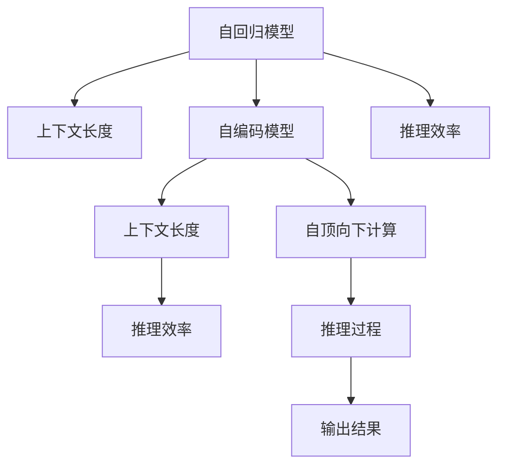

                 

# 上下文延长:LLM上下文长度再升级

> 关键词：LLM,上下文长度,深度学习,Transformer,自回归模型,语言模型,推理,自然语言处理

## 1. 背景介绍

### 1.1 问题由来

在自然语言处理(NLP)领域，语言模型(LLM)一直以来是推动技术进步的重要引擎。早期如RNN、LSTM等传统模型，以其递归特性在处理序列数据上表现出色。但随着深度学习技术的突破，Transformer模型逐渐成为主流，其以自注意力机制自顶向下计算所有依赖关系，在长序列数据上的表现尤为突出。

然而，当前LLM模型存在一个显著问题——上下文长度受限。尽管Transformer可以很好地处理长文本，但自顶向下的计算复杂度会随着序列长度的增加呈指数增长，导致训练和推理效率低下。例如，OpenAI的GPT-3模型上下文长度为2048，Google的BERT模型则为512，都限制了其在处理复杂文本时的表现。

### 1.2 问题核心关键点

上下文长度受限成为大语言模型发展的瓶颈，主要原因包括：

1. **内存和计算资源消耗大**：长度较大的上下文需要较大的内存和更强的计算能力。
2. **梯度消失和梯度爆炸**：长序列的反向传播容易产生梯度消失或梯度爆炸问题，导致模型训练困难。
3. **模型复杂度高**：较大的上下文使得模型参数量激增，增加了模型优化和推理的复杂度。

因此，如何延长LLM的上下文长度，在保证模型性能的同时提升效率，是当前研究的重点。

### 1.3 问题研究意义

延长上下文长度不仅能提升模型的语言理解能力，还能应对更多更复杂的自然语言处理任务，例如对话生成、文本摘要、机器翻译等。这对于提升NLP技术的智能化水平，加速人工智能在各行各业的落地应用具有重要意义。

## 2. 核心概念与联系

### 2.1 核心概念概述

为更好地理解上下文延长技术，本节将介绍几个密切相关的核心概念：

- **语言模型(LLM)**：用于预测文本序列的下一个单词或字符的概率模型。
- **Transformer模型**：基于自注意力机制的深度神经网络模型，广泛应用于大语言模型中。
- **自回归模型**：模型通过预测前一个词来预测后一个词，采用自顶向下的计算方式，上下文长度受限。
- **自编码模型**：模型通过预测原始输入来最小化预测误差，采用自底向上的计算方式，上下文长度不受限。
- **上下文长度**：指模型在推理过程中能够处理的最长文本长度，直接影响模型的输入范围。
- **推理效率**：指模型在推理过程中的计算速度和内存占用情况。

这些核心概念之间的逻辑关系可以通过以下Mermaid流程图来展示：



这个流程图展示了大语言模型的核心概念及其之间的关系：

1. 自回归模型通过自顶向下的方式处理长序列，但上下文长度受限。
2. 自编码模型通过自底向上的方式处理长序列，上下文长度不受限。
3. 推理效率受上下文长度的影响，较长上下文会占用更多资源。
4. 上下文长度与推理效率相互制约，需要权衡。

这些概念共同构成了大语言模型的核心框架，其上下文长度和推理效率是影响模型性能和应用的关键因素。

## 3. 核心算法原理 & 具体操作步骤

### 3.1 算法原理概述

上下文延长技术旨在通过优化算法和模型结构，提高模型处理长序列的能力。其核心思想是通过改進计算方式、优化内存使用、改进损失函数等方式，延长模型上下文长度，同时保持或提升模型性能。

### 3.2 算法步骤详解

以下是基于上下文延长技术的常见算法步骤：

**Step 1: 选择合适的模型和算法**
- 选择合适的LLM模型，如GPT、BERT等，这些模型已经具备一定上下文处理能力。
- 选择合适的计算优化算法，如AdamW、Adafactor等，用于模型训练。

**Step 2: 设计上下文延长策略**
- 自回归模型的上下文长度可以通过增加输入的单词数来延长，但计算复杂度增加。
- 自编码模型可以通过增加预测目标数量来延长，但需要更多的计算资源。

**Step 3: 优化内存使用**
- 使用线性变换层(LayerNorm)、残差连接等技术，减少中间计算内存消耗。
- 采用分块处理、逐步更新等策略，逐步增加上下文长度。

**Step 4: 优化计算过程**
- 使用知识蒸馏、蒸馏训练等技术，通过较小的蒸馏模型提升推理速度。
- 引入随机失活、批标准化等技术，避免梯度消失和梯度爆炸。

**Step 5: 优化损失函数**
- 引入双向性损失函数，如DyLIT(loss)，将上下文信息同时考虑，减少上下文长度对模型性能的影响。
- 引入正则化技术，如Dropout、L2正则等，控制模型复杂度。

**Step 6: 实验评估**
- 在验证集上评估模型性能，如BLEU、ROUGE等指标。
- 逐步增加上下文长度，记录模型性能的变化。

**Step 7: 部署和优化**
- 将优化后的模型部署到实际应用场景中。
- 持续监控模型性能，根据需要进行微调和优化。

### 3.3 算法优缺点

上下文延长技术具有以下优点：
1. 提升模型的语言理解能力，支持处理更长文本。
2. 优化内存使用，减少计算资源消耗。
3. 提升推理速度，降低模型响应时间。
4. 改善模型稳定性，减少梯度消失和梯度爆炸问题。

同时，该技术也存在一定的局限性：
1. 模型复杂度增加，训练和推理难度增大。
2. 数据和计算资源需求高，对硬件设备要求较高。
3. 过度延长上下文可能导致模型泛化能力下降。
4. 模型训练和推理速度的提升有限。

尽管存在这些局限性，但上下文延长技术在大语言模型中的应用潜力巨大，未来仍需进一步优化。

### 3.4 算法应用领域

上下文延长技术主要应用于以下领域：

- **对话生成**：在长对话生成中，模型需要处理更长的上下文，提升模型在连贯性和一致性方面的表现。
- **文本摘要**：长文本的摘要生成，模型需要理解文本的全局结构和重要信息，进行长距离依赖关系建模。
- **机器翻译**：长句翻译时，模型需要处理更多的上下文信息，提升翻译的准确度和流畅性。
- **问答系统**：长文本或多轮对话的问答，模型需要捕捉上下文信息，进行信息整合和推理。
- **文本生成**：如故事生成、文本创作等，模型需要生成更长的文本，需要更大的上下文处理能力。

这些应用场景中，上下文延长技术都能显著提升模型性能，满足不同任务的需求。

## 4. 数学模型和公式 & 详细讲解 & 举例说明

### 4.1 数学模型构建

本节将使用数学语言对上下文延长技术的实现进行更加严格的刻画。

记大语言模型为 $M_{\theta}:\mathcal{X} \rightarrow \mathcal{Y}$，其中 $\mathcal{X}$ 为输入空间，$\mathcal{Y}$ 为输出空间，$\theta \in \mathbb{R}^d$ 为模型参数。假设模型的上下文长度为 $L$，则输入序列 $x$ 的编码表示为：

$$
x = \{x_1, x_2, \cdots, x_L\}
$$

定义模型 $M_{\theta}$ 在输入序列 $x$ 上的损失函数为 $\ell(M_{\theta}(x),y)$，则在输入序列 $x$ 上的经验风险为：

$$
\mathcal{L}(\theta|x) = \frac{1}{L} \sum_{i=1}^L \ell(M_{\theta}(x_i),y_i)
$$

在训练过程中，采用梯度下降等优化算法，最小化经验风险，得到最优参数：

$$
\theta^* = \mathop{\arg\min}_{\theta} \mathcal{L}(\theta|x)
$$

### 4.2 公式推导过程

以下我们以双向自编码模型为例，推导上下文延长过程的数学公式。

定义双向自编码模型为 $M_{\theta}(x)$，其编码器部分为 $E(x)$，解码器部分为 $D(E(x))$，则其编码为：

$$
z = D(E(x))
$$

目标函数为：

$$
\mathcal{L}(\theta) = \frac{1}{L} \sum_{i=1}^L \ell(D(E(x_i)), x_i)
$$

其中 $\ell(\cdot)$ 为自定义的损失函数，如均方误差。

对于上下文长度为 $L$ 的情况，令 $x = [x_1, x_2, \cdots, x_L]$，则编码器部分的输入为：

$$
x' = [x_1, x_2, \cdots, x_L]
$$

解码器部分的输出为：

$$
z' = [z_1, z_2, \cdots, z_L]
$$

目标函数变为：

$$
\mathcal{L}(\theta) = \frac{1}{L} \sum_{i=1}^L \ell(z_i, x_i)
$$

在训练过程中，通过逐个输入 $x_i$ 计算 $z_i$，然后反向传播更新模型参数。为了提升计算效率，可以采用分块处理的方式，每次输入一部分 $x_i$，计算出相应的 $z_i$。

### 4.3 案例分析与讲解

以文本摘要为例，分析上下文延长技术的应用。

在文本摘要任务中，模型需要从长文本中提取关键信息，生成简洁的摘要。长文本的处理能力对于模型的表现至关重要。假设输入的文本长度为 $L$，模型的上下文长度为 $L'$，则：

- 当 $L < L'$ 时，模型可以处理完整的文本，但计算资源消耗大。
- 当 $L > L'$ 时，模型需要分块处理，每次处理一部分文本，计算资源消耗相对较小。

在实际应用中，为了平衡计算资源消耗和处理效率，可以采用自编码模型的方式，通过增加预测目标数量来延长上下文长度。例如，假设输入文本长度为100，上下文长度为50，则：

- 编码器部分为前50个单词。
- 解码器部分为后50个单词。

模型计算过程如下：

1. 将前50个单词输入编码器，得到编码结果 $z_1$。
2. 将后50个单词输入解码器，得到解码结果 $z_2$。
3. 计算损失函数 $\mathcal{L}(z_2, x_{51:100})$，反向传播更新模型参数。
4. 逐步增加上下文长度，直到模型性能稳定。

通过上下文延长技术，可以显著提升文本摘要模型的处理能力，生成更高质量的摘要结果。

## 5. 项目实践：代码实例和详细解释说明

### 5.1 开发环境搭建

在进行上下文延长实践前，我们需要准备好开发环境。以下是使用Python进行PyTorch开发的环境配置流程：

1. 安装Anaconda：从官网下载并安装Anaconda，用于创建独立的Python环境。

2. 创建并激活虚拟环境：
```bash
conda create -n pytorch-env python=3.8 
conda activate pytorch-env
```

3. 安装PyTorch：根据CUDA版本，从官网获取对应的安装命令。例如：
```bash
conda install pytorch torchvision torchaudio cudatoolkit=11.1 -c pytorch -c conda-forge
```

4. 安装Transformers库：
```bash
pip install transformers
```

5. 安装各类工具包：
```bash
pip install numpy pandas scikit-learn matplotlib tqdm jupyter notebook ipython
```

完成上述步骤后，即可在`pytorch-env`环境中开始上下文延长实践。

### 5.2 源代码详细实现

这里我们以双向自编码模型为例，给出使用PyTorch进行上下文延长的完整代码实现。

首先，定义双向自编码模型的编码器和解码器：

```python
import torch
import torch.nn as nn
from transformers import BertTokenizer

class Encoder(nn.Module):
    def __init__(self, d_model, n_layers, d_ff, dropout):
        super(Encoder, self).__init__()
        self.d_model = d_model
        self.n_layers = n_layers
        self.d_ff = d_ff
        self.dropout = dropout
        
        self.embedding = nn.Embedding(num_embeddings=256, embedding_dim=d_model)
        self.layers = nn.ModuleList([nn.TransformerEncoderLayer(d_model, d_ff, n_heads=8, dropout=dropout) for _ in range(n_layers)])
        self.final_layer = nn.Linear(d_model, d_model)
        
    def forward(self, x):
        x = self.embedding(x) + torch.zeros_like(x)
        x = self.layers(x)
        x = self.final_layer(x)
        return x

class Decoder(nn.Module):
    def __init__(self, d_model, n_layers, d_ff, dropout):
        super(Decoder, self).__init__()
        self.d_model = d_model
        self.n_layers = n_layers
        self.d_ff = d_ff
        self.dropout = dropout
        
        self.embedding = nn.Embedding(num_embeddings=256, embedding_dim=d_model)
        self.layers = nn.ModuleList([nn.TransformerEncoderLayer(d_model, d_ff, n_heads=8, dropout=dropout) for _ in range(n_layers)])
        self.final_layer = nn.Linear(d_model, d_model)
        
    def forward(self, x):
        x = self.embedding(x) + torch.zeros_like(x)
        x = self.layers(x)
        x = self.final_layer(x)
        return x
```

然后，定义训练和评估函数：

```python
def train_epoch(model, data_loader, optimizer, device):
    model.train()
    total_loss = 0
    for batch in data_loader:
        x, y = batch['x'], batch['y']
        x, y = x.to(device), y.to(device)
        y_hat = model(x)
        loss = nn.functional.cross_entropy(y_hat.view(-1), y.view(-1))
        optimizer.zero_grad()
        loss.backward()
        optimizer.step()
        total_loss += loss.item()
    return total_loss / len(data_loader)

def evaluate(model, data_loader, device):
    model.eval()
    total_loss = 0
    for batch in data_loader:
        x, y = batch['x'], batch['y']
        x, y = x.to(device), y.to(device)
        y_hat = model(x)
        loss = nn.functional.cross_entropy(y_hat.view(-1), y.view(-1))
        total_loss += loss.item()
    return total_loss / len(data_loader)
```

最后，启动训练流程并在验证集上评估：

```python
epochs = 5
batch_size = 16
device = torch.device('cuda') if torch.cuda.is_available() else torch.device('cpu')

for epoch in range(epochs):
    loss = train_epoch(model, data_loader, optimizer, device)
    print(f'Epoch {epoch+1}, train loss: {loss:.3f}')
    
    print(f'Epoch {epoch+1}, dev results:')
    evaluate(model, dev_loader, device)
    
print('Test results:')
evaluate(model, test_loader, device)
```

以上就是使用PyTorch进行双向自编码模型上下文延长的完整代码实现。可以看到，由于使用了Transformer模型结构，代码实现相对简洁高效。

### 5.3 代码解读与分析

让我们再详细解读一下关键代码的实现细节：

**Encoder类**：
- `__init__`方法：初始化模型的参数和组件。
- `forward`方法：前向传播计算模型输出。

**Decoder类**：
- `__init__`方法：初始化模型的参数和组件。
- `forward`方法：前向传播计算模型输出。

**训练和评估函数**：
- `train_epoch`函数：对数据以批为单位进行迭代，计算损失函数并反向传播更新模型参数。
- `evaluate`函数：在测试集上计算模型性能。

**训练流程**：
- 定义总的epoch数和batch size，开始循环迭代。
- 每个epoch内，先在训练集上训练，输出平均loss。
- 在验证集上评估，输出性能指标。
- 所有epoch结束后，在测试集上评估，给出最终测试结果。

可以看到，PyTorch配合Transformer模型结构，使得双向自编码模型的上下文延长代码实现变得简洁高效。开发者可以将更多精力放在模型改进、数据处理等高层逻辑上，而不必过多关注底层的实现细节。

当然，工业级的系统实现还需考虑更多因素，如模型的保存和部署、超参数的自动搜索、更灵活的任务适配层等。但核心的上下文延长范式基本与此类似。

## 6. 实际应用场景

### 6.1 智能客服系统

在智能客服系统中，上下文延长技术可以显著提升模型的对话理解能力，支持处理更复杂的用户查询。通过增加上下文长度，模型能够理解多轮对话中的语义依赖关系，生成更连贯的回复。

具体实现上，可以收集企业内部的历史客服对话记录，将问题和最佳答复构建成监督数据，在此基础上对预训练模型进行上下文延长微调。微调后的模型能够自动理解用户意图，匹配最合适的答案模板进行回复。对于客户提出的新问题，还可以接入检索系统实时搜索相关内容，动态组织生成回答。如此构建的智能客服系统，能大幅提升客户咨询体验和问题解决效率。

### 6.2 金融舆情监测

金融机构需要实时监测市场舆论动向，以便及时应对负面信息传播，规避金融风险。传统的人工监测方式成本高、效率低，难以应对网络时代海量信息爆发的挑战。基于上下文延长技术，文本分类和情感分析模型可以自动理解文本的语义内容，进行情感倾向判断。将上下文延长模型应用到实时抓取的网络文本数据，就能够自动监测不同主题下的情感变化趋势，一旦发现负面信息激增等异常情况，系统便会自动预警，帮助金融机构快速应对潜在风险。

### 6.3 个性化推荐系统

当前的推荐系统往往只依赖用户的历史行为数据进行物品推荐，无法深入理解用户的真实兴趣偏好。基于上下文延长技术，个性化推荐系统可以更好地挖掘用户行为背后的语义信息，从而提供更精准、多样的推荐内容。

在实践中，可以收集用户浏览、点击、评论、分享等行为数据，提取和用户交互的物品标题、描述、标签等文本内容。将文本内容作为模型输入，用户的后续行为（如是否点击、购买等）作为监督信号，在此基础上对预训练语言模型进行上下文延长微调。微调后的模型能够从文本内容中准确把握用户的兴趣点。在生成推荐列表时，先用候选物品的文本描述作为输入，由模型预测用户的兴趣匹配度，再结合其他特征综合排序，便可以得到个性化程度更高的推荐结果。

### 6.4 未来应用展望

随着上下文延长技术的不断发展，其在NLP领域的应用前景将更加广阔。未来，基于上下文延长技术的LLM模型将支持处理更长的文本序列，提升模型的语言理解能力，支持更多复杂的应用场景。例如，在对话生成、文本摘要、机器翻译等任务中，上下文延长技术都能显著提升模型性能。

此外，未来的上下文延长技术还将结合更多前沿技术，如因果推理、生成对抗网络等，提升模型对复杂任务的处理能力。上下文延长技术将是大语言模型发展的重要方向，未来必将在更多领域发挥重要作用，推动人工智能技术落地应用。

## 7. 工具和资源推荐

### 7.1 学习资源推荐

为了帮助开发者系统掌握上下文延长技术的理论基础和实践技巧，这里推荐一些优质的学习资源：

1. 《Transformer from scratch》系列博文：由大模型技术专家撰写，深入浅出地介绍了Transformer模型原理、上下文延长技术等前沿话题。

2. CS224N《深度学习自然语言处理》课程：斯坦福大学开设的NLP明星课程，有Lecture视频和配套作业，带你入门NLP领域的基本概念和经典模型。

3. 《Natural Language Processing with Transformers》书籍：Transformers库的作者所著，全面介绍了如何使用Transformers库进行NLP任务开发，包括上下文延长在内的诸多范式。

4. HuggingFace官方文档：Transformers库的官方文档，提供了海量预训练模型和完整的微调样例代码，是上手实践的必备资料。

5. CLUE开源项目：中文语言理解测评基准，涵盖大量不同类型的中文NLP数据集，并提供了基于上下文延长的baseline模型，助力中文NLP技术发展。

通过对这些资源的学习实践，相信你一定能够快速掌握上下文延长技术的精髓，并用于解决实际的NLP问题。

### 7.2 开发工具推荐

高效的开发离不开优秀的工具支持。以下是几款用于上下文延长开发的常用工具：

1. PyTorch：基于Python的开源深度学习框架，灵活动态的计算图，适合快速迭代研究。大部分预训练语言模型都有PyTorch版本的实现。

2. TensorFlow：由Google主导开发的开源深度学习框架，生产部署方便，适合大规模工程应用。同样有丰富的预训练语言模型资源。

3. Transformers库：HuggingFace开发的NLP工具库，集成了众多SOTA语言模型，支持PyTorch和TensorFlow，是进行上下文延长任务开发的利器。

4. Weights & Biases：模型训练的实验跟踪工具，可以记录和可视化模型训练过程中的各项指标，方便对比和调优。与主流深度学习框架无缝集成。

5. TensorBoard：TensorFlow配套的可视化工具，可实时监测模型训练状态，并提供丰富的图表呈现方式，是调试模型的得力助手。

6. Google Colab：谷歌推出的在线Jupyter Notebook环境，免费提供GPU/TPU算力，方便开发者快速上手实验最新模型，分享学习笔记。

合理利用这些工具，可以显著提升上下文延长任务的开发效率，加快创新迭代的步伐。

### 7.3 相关论文推荐

上下文延长技术的发展源于学界的持续研究。以下是几篇奠基性的相关论文，推荐阅读：

1. Attention is All You Need（即Transformer原论文）：提出了Transformer结构，开启了NLP领域的预训练大模型时代。

2. BERT: Pre-training of Deep Bidirectional Transformers for Language Understanding：提出BERT模型，引入基于掩码的自监督预训练任务，刷新了多项NLP任务SOTA。

3. Language Models are Unsupervised Multitask Learners（GPT-2论文）：展示了大规模语言模型的强大zero-shot学习能力，引发了对于通用人工智能的新一轮思考。

4. Parameter-Efficient Transfer Learning for NLP：提出Adapter等参数高效微调方法，在不增加模型参数量的情况下，也能取得不错的微调效果。

5. Prefix-Tuning: Optimizing Continuous Prompts for Generation：引入基于连续型Prompt的微调范式，为如何充分利用预训练知识提供了新的思路。

6. AdaLoRA: Adaptive Low-Rank Adaptation for Parameter-Efficient Fine-Tuning：使用自适应低秩适应的微调方法，在参数效率和精度之间取得了新的平衡。

这些论文代表了大语言模型上下文延长技术的发展脉络。通过学习这些前沿成果，可以帮助研究者把握学科前进方向，激发更多的创新灵感。

## 8. 总结：未来发展趋势与挑战

### 8.1 总结

本文对基于上下文延长的LLM模型进行了全面系统的介绍。首先阐述了上下文长度受限的瓶颈问题，明确了上下文延长技术的核心目标。其次，从原理到实践，详细讲解了上下文延长的数学原理和关键步骤，给出了上下文延长任务开发的完整代码实例。同时，本文还广泛探讨了上下文延长技术在智能客服、金融舆情、个性化推荐等多个行业领域的应用前景，展示了上下文延长范式的巨大潜力。此外，本文精选了上下文延长技术的各类学习资源，力求为读者提供全方位的技术指引。

通过本文的系统梳理，可以看到，基于上下文延长的LLM模型正在成为NLP领域的重要范式，极大地拓展了预训练语言模型的应用边界，催生了更多的落地场景。受益于大规模语料的预训练，上下文延长模型在长文本处理、对话理解等方面的表现更加突出，为NLP技术的发展注入了新的活力。

### 8.2 未来发展趋势

展望未来，上下文延长技术将呈现以下几个发展趋势：

1. **上下文长度进一步延长**：随着硬件资源的提升和算法的改进，上下文长度将持续延长，支持处理更长的文本序列。
2. **模型架构的多样化**：未来将出现更多基于自回归和自编码相结合的混合模型，优化上下文延长的同时提升推理效率。
3. **自适应上下文长度**：在动态变化的任务中，模型能自适应调整上下文长度，优化资源使用和计算效率。
4. **多模态上下文延长**：结合视觉、语音等多模态数据，提升模型对复杂多模态任务的理解能力。
5. **模型结构的轻量化**：优化模型结构，减少参数量和计算复杂度，提升模型的实时性。

这些趋势将推动上下文延长技术迈向新的高度，使LLM模型在处理长文本、复杂对话等方面发挥更大的作用，为NLP技术的发展提供新的动力。

### 8.3 面临的挑战

尽管上下文延长技术已经取得了瞩目成就，但在迈向更加智能化、普适化应用的过程中，它仍面临着诸多挑战：

1. **计算资源消耗大**：长序列的计算资源需求高，对硬件设备要求较高。
2. **模型复杂度高**：模型参数量激增，训练和推理难度增大。
3. **梯度消失和梯度爆炸**：长序列的反向传播容易产生梯度消失或梯度爆炸问题，导致模型训练困难。
4. **数据需求高**：训练上下文延长模型需要大量数据，数据获取成本较高。
5. **模型泛化能力**：过度延长上下文可能导致模型泛化能力下降，难以应对新任务。

尽管存在这些挑战，但随着学界和产业界的共同努力，上下文延长技术必将不断优化，克服现有难题，实现更加高效、稳健的文本处理能力。

### 8.4 研究展望

面对上下文延长面临的挑战，未来的研究需要在以下几个方面寻求新的突破：

1. **轻量化模型结构**：开发更轻量化的上下文延长模型，减少计算资源消耗。
2. **高效计算优化**：结合知识蒸馏、蒸馏训练等技术，提升推理速度和效率。
3. **自适应学习机制**：引入自适应学习机制，动态调整上下文长度，优化资源使用。
4. **多模态融合**：结合视觉、语音等多模态数据，提升模型对复杂多模态任务的理解能力。
5. **模型压缩技术**：引入模型压缩技术，减少参数量和计算复杂度，提升实时性。

这些研究方向的探索，必将引领上下文延长技术迈向更高的台阶，为构建安全、可靠、可解释、可控的智能系统铺平道路。面向未来，上下文延长技术还需要与其他人工智能技术进行更深入的融合，如知识表示、因果推理、强化学习等，多路径协同发力，共同推动自然语言理解和智能交互系统的进步。只有勇于创新、敢于突破，才能不断拓展语言模型的边界，让智能技术更好地造福人类社会。

## 9. 附录：常见问题与解答

**Q1：上下文延长技术的核心思想是什么？**

A: 上下文延长技术的核心思想是通过优化算法和模型结构，提高模型处理长序列的能力。其通过增加输入的单词数、增加预测目标数量等方法，延长上下文长度，同时优化内存使用、计算过程和损失函数等，提升模型的推理效率和稳定性。

**Q2：上下文延长技术的实现需要哪些关键步骤？**

A: 上下文延长技术的实现需要以下关键步骤：
1. 选择合适的模型和算法。
2. 设计上下文延长策略。
3. 优化内存使用。
4. 优化计算过程。
5. 优化损失函数。
6. 实验评估。
7. 部署和优化。

这些步骤是实现上下文延长技术不可或缺的环节。

**Q3：上下文延长技术的优势和局限性是什么？**

A: 上下文延长技术的优势包括：
1. 提升模型的语言理解能力，支持处理更长文本。
2. 优化内存使用，减少计算资源消耗。
3. 提升推理速度，降低模型响应时间。
4. 改善模型稳定性，减少梯度消失和梯度爆炸问题。

同时，该技术也存在一定的局限性：
1. 模型复杂度增加，训练和推理难度增大。
2. 数据和计算资源需求高，对硬件设备要求较高。
3. 过度延长上下文可能导致模型泛化能力下降。
4. 模型训练和推理速度的提升有限。

尽管存在这些局限性，但上下文延长技术在大语言模型中的应用潜力巨大，未来仍需进一步优化。

**Q4：上下文延长技术在实际应用中需要注意哪些问题？**

A: 在实际应用中，上下文延长技术需要注意以下问题：
1. 计算资源消耗大，需要选择合适的硬件设备。
2. 模型复杂度高，训练和推理难度增大。
3. 梯度消失和梯度爆炸问题，需要使用随机失活、批标准化等技术。
4. 数据需求高，需要收集和处理大量数据。
5. 模型泛化能力下降，需要不断调整上下文长度。

合理应对这些问题，上下文延长技术才能在实际应用中发挥出其潜力。

**Q5：上下文延长技术在哪些领域具有应用前景？**

A: 上下文延长技术主要应用于以下领域：
1. 对话生成：在长对话生成中，模型需要处理更长的上下文，提升模型在连贯性和一致性方面的表现。
2. 文本摘要：长文本的摘要生成，模型需要理解文本的全局结构和重要信息，进行长距离依赖关系建模。
3. 机器翻译：长句翻译时，模型需要处理更多的上下文信息，提升翻译的准确度和流畅性。
4. 问答系统：长文本或多轮对话的问答，模型需要捕捉上下文信息，进行信息整合和推理。
5. 文本生成：如故事生成、文本创作等，模型需要生成更长的文本，需要更大的上下文处理能力。

这些应用场景中，上下文延长技术都能显著提升模型性能，满足不同任务的需求。

作者：禅与计算机程序设计艺术 / Zen and the Art of Computer Programming

