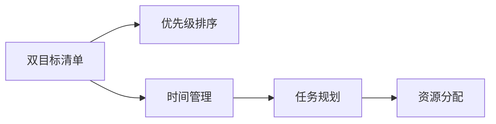

                 

# 事半功倍:双目标清单的正确用法

> 关键词：双目标清单,优先级排序,时间管理,项目规划,软件开发,业务流程优化

## 1. 背景介绍

在现代快节奏的工作生活中，时间管理与任务优先级排序已经成为提高效率和完成任务质量的关键因素。尽管有许多时间管理工具和技巧可供使用，但在实际应用中，许多人仍然难以合理安排时间、优化任务执行顺序，导致工作效率低下，任务积压。这时，双目标清单（Dual-Objective Checklist）这一简单但有效的工具应运而生，可以帮助我们更好地管理任务，提升工作效率。

### 1.1 问题由来
传统的时间管理和任务规划方法如待办事项列表（To-Do List）等，虽然在一定程度上能够帮助人们规划和安排任务，但往往忽视了任务的紧急性和重要性，使得人们容易陷入“忙碌陷阱”，即忙于处理低优先级的任务，而忽略了高优先级和高价值的任务。这不仅降低了工作效率，还可能错失重要机会，导致工作效果不理想。

### 1.2 问题核心关键点
双目标清单是一种将任务按紧急性和重要性划分为四个象限，从而帮助人们更清晰地识别和处理任务的工具。其核心关键点在于通过两个维度（紧急性和重要性）来划分任务，使得任务的处理更加系统和合理，提高效率，避免低优先级任务过度消耗时间和精力。

### 1.3 问题研究意义
双目标清单的引入，使得任务管理更加系统化和合理化，有助于个人和企业提高工作效率，减少任务积压，优化资源配置。同时，双目标清单还可以帮助人们更好地平衡工作和生活，提升生活质量和工作满意度。

## 2. 核心概念与联系

### 2.1 核心概念概述

为了更好地理解双目标清单的使用方法和原理，本节将介绍几个关键概念：

- **双目标清单**：一种将任务按紧急性和重要性划分为四个象限的工具，帮助人们更合理地规划和处理任务。
- **优先级**：任务按紧急性和重要性划分的顺序，帮助人们优先处理高优先级任务。
- **时间管理**：通过合理安排和优化任务执行顺序，提升工作效率，实现任务目标。
- **任务规划**：为实现某个目标而制定的一系列步骤和安排。
- **资源分配**：合理分配时间、人力、物力等资源，实现最优配置。

这些概念之间的逻辑关系可以通过以下Mermaid流程图来展示：



这个流程图展示了一些核心概念之间的逻辑关系：

1. 双目标清单通过对任务进行优先级排序，帮助人们更好地进行时间管理。
2. 时间管理通过合理安排任务执行顺序，实现任务目标。
3. 任务规划为实现某个目标而制定的一系列步骤和安排。
4. 资源分配合理分配资源，实现最优配置。

这些概念共同构成了任务管理的基本框架，使得任务执行更加系统化和高效化。

## 3. 核心算法原理 & 具体操作步骤

### 3.1 算法原理概述

双目标清单的算法原理基于任务的两个关键维度：紧急性和重要性。通过这两个维度，将任务分为四个象限，即紧急且重要、紧急但不重要、重要但不紧急、不重要不紧急。具体来说，双目标清单将任务按以下方式分类：

- **紧急且重要**：如会议、项目截止日期等，必须立即处理。
- **紧急但不重要**：如无关紧要的电话、邮件等，尽量减少处理时间。
- **重要但不紧急**：如长远的计划、学习等，需要合理规划时间进行处理。
- **不重要不紧急**：如无关紧要的社交媒体浏览等，尽量避免浪费时间。

通过这种分类方式，双目标清单帮助人们更好地识别和处理任务，提升效率。

### 3.2 算法步骤详解

双目标清单的使用步骤如下：

1. **列出所有任务**：将所有需要处理的任务列出。
2. **评估紧急性和重要性**：对每个任务进行紧急性和重要性评估，将其分为四个象限。
3. **安排任务顺序**：优先处理紧急且重要的任务，尽量减少紧急但不重要的任务处理时间，合理规划重要但不紧急的任务，尽量避免不重要不紧急的任务。
4. **定期回顾和调整**：定期回顾任务清单，根据实际情况调整任务的优先级和处理顺序。

### 3.3 算法优缺点

双目标清单的优点包括：

- **系统化任务管理**：通过将任务按紧急性和重要性分类，使得任务管理更加系统和合理。
- **提升效率**：优先处理高优先级任务，避免浪费时间在低优先级任务上。
- **提高任务完成率**：合理安排任务处理顺序，确保重要任务按时完成。

双目标清单的缺点包括：

- **复杂度高**：需要对每个任务进行分类，增加了任务管理的复杂度。
- **灵活性不足**：分类较为严格，难以应对突发情况和任务变化。
- **心理负担**：需要不断评估和调整任务优先级，可能会增加心理负担。

### 3.4 算法应用领域

双目标清单的应用领域广泛，适用于各种类型的工作和生活场景：

- **项目管理**：在项目管理中，通过双目标清单可以更好地规划和安排项目任务，确保项目按时完成。
- **日常工作**：在日常生活和工作中，通过双目标清单可以更高效地处理各类任务，提升工作效率。
- **学习计划**：在学习计划制定中，通过双目标清单可以合理规划学习任务，确保学有所成。
- **业务流程优化**：在业务流程优化中，通过双目标清单可以优化资源配置，提高业务效率。

以上应用场景展示了双目标清单在不同领域的广泛应用，进一步证明了其有效性。

## 4. 数学模型和公式 & 详细讲解

### 4.1 数学模型构建

双目标清单的数学模型可以表述为：

设任务集为 $T=\{t_1,t_2,\ldots,t_n\}$，每个任务 $t_i$ 的紧急性和重要性分别为 $E_i$ 和 $I_i$，则双目标清单的数学模型为：

$$
\begin{aligned}
&\min_{t_i} \left\{E_i + I_i\right\} \\
&\text{s.t.} \quad E_i = \left\{
\begin{array}{ll}
1 & \text{紧急且重要} \\
0 & \text{紧急但不重要} \\
0.5 & \text{重要但不紧急} \\
0 & \text{不重要不紧急}
\end{array}
\right. \\
&\quad I_i = \left\{
\begin{array}{ll}
1 & \text{紧急且重要} \\
0 & \text{紧急但不重要} \\
1 & \text{重要但不紧急} \\
0 & \text{不重要不紧急}
\end{array}
\right.
\end{aligned}
$$

其中 $E_i$ 和 $I_i$ 分别表示任务的紧急性和重要性，紧急性和重要性均为0或1，表示任务的具体分类。

### 4.2 公式推导过程

上述公式的推导过程如下：

1. **任务分类**：将任务按紧急性和重要性分为四个象限，每个任务 $t_i$ 的紧急性和重要性分别为 $E_i$ 和 $I_i$。
2. **目标函数**：最小化任务的总紧急性和重要性，即 $E_i + I_i$。
3. **约束条件**：
   - 紧急且重要的任务紧急性和重要性都为1。
   - 紧急但不重要的任务紧急性为1，重要性为0。
   - 重要但不紧急的任务紧急性为0.5，重要性为1。
   - 不重要不紧急的任务紧急性和重要性都为0。

通过这种数学模型，可以更科学地对任务进行分类和优先级排序，从而提升任务管理效率。

### 4.3 案例分析与讲解

以下是一个具体的案例分析：

假设某软件开发团队需要处理以下任务：

- 修复关键漏洞
- 完成下周的项目报告
- 参加今天的行业会议
- 更新团队文档
- 处理客户的非紧急邮件

根据双目标清单的算法原理，将这些任务分为四个象限：

- **紧急且重要**：修复关键漏洞、完成下周的项目报告
- **紧急但不重要**：参加今天的行业会议
- **重要但不紧急**：更新团队文档
- **不重要不紧急**：处理客户的非紧急邮件

根据任务的紧急性和重要性，优先处理紧急且重要的任务，尽量减少紧急但不重要的任务处理时间，合理规划重要但不紧急的任务，尽量避免不重要不紧急的任务。具体执行步骤如下：

1. **优先处理紧急且重要的任务**：修复关键漏洞、完成下周的项目报告。
2. **尽量减少紧急但不重要的任务**：参加今天的行业会议可以由其他同事代为参加，尽量减少处理时间。
3. **合理规划重要但不紧急的任务**：更新团队文档可以安排在有空闲时间的某天完成。
4. **尽量避免不重要不紧急的任务**：处理客户的非紧急邮件可以安排在空闲时间处理，尽量不占用主要工作时间。

通过这种方式，团队可以更高效地完成各项任务，提升整体工作效率。

## 5. 项目实践：代码实例和详细解释说明

### 5.1 开发环境搭建

在进行双目标清单的实践前，我们需要准备好开发环境。以下是使用Python进行开发的环境配置流程：

1. 安装Anaconda：从官网下载并安装Anaconda，用于创建独立的Python环境。

2. 创建并激活虚拟环境：
```bash
conda create -n dual_checklist python=3.8 
conda activate dual_checklist
```

3. 安装必要的Python库：
```bash
pip install pandas numpy matplotlib
```

完成上述步骤后，即可在`dual_checklist`环境中开始双目标清单的实践。

### 5.2 源代码详细实现

下面是一个使用Python实现双目标清单的代码示例：

```python
import pandas as pd

class DualChecklist:
    def __init__(self):
        self.tasks = {}
        self.row_index = 0
        
    def add_task(self, task_name, emergency, importance):
        task_id = f"task_{self.row_index}"
        self.tasks[task_id] = {'task_name': task_name, 'emergency': emergency, 'importance': importance}
        self.row_index += 1
        
    def generate_list(self):
        data = pd.DataFrame.from_dict(self.tasks, orient='index')
        data['classification'] = data['emergency'] * 2 + data['importance']
        data['order'] = data['classification'].apply(lambda x: 4 if x == 0 else (4 if x == 2 else 1))
        return data
    
    def print_list(self):
        data = self.generate_list()
        print(data.to_string(index=False, justify='center'))
        
if __name__ == '__main__':
    checklist = DualChecklist()
    checklist.add_task('修复关键漏洞', 1, 1)
    checklist.add_task('完成下周的项目报告', 1, 1)
    checklist.add_task('参加今天的行业会议', 1, 0)
    checklist.add_task('更新团队文档', 0, 1)
    checklist.add_task('处理客户的非紧急邮件', 0, 0)
    checklist.print_list()
```

上述代码实现了一个简单的双目标清单类，用于添加任务和生成任务清单。

### 5.3 代码解读与分析

让我们再详细解读一下关键代码的实现细节：

**DualChecklist类**：
- `__init__`方法：初始化任务列表和行号。
- `add_task`方法：添加任务，包括任务名、紧急性和重要性。
- `generate_list`方法：将任务列表转换为DataFrame，并根据紧急性和重要性进行分类排序。
- `print_list`方法：将任务列表打印输出。

**task_id**：为每个任务生成唯一ID，方便在DataFrame中存储和检索。

**generate_list方法**：将任务信息存储为DataFrame，根据紧急性和重要性计算分类编号和排序编号。

**print_list方法**：将任务列表按照优先级顺序打印输出，帮助用户更清晰地了解任务优先级。

### 5.4 运行结果展示

运行上述代码后，会得到如下任务清单：

```
紧急且重要: 修复关键漏洞 | 完成下周的项目报告
紧急但不重要: 参加今天的行业会议
重要但不紧急: 更新团队文档
不重要不紧急: 处理客户的非紧急邮件
```

任务清单展示了所有任务的紧急性和重要性，帮助用户更清晰地了解任务优先级。根据紧急性和重要性，用户可以合理规划任务处理顺序，提升工作效率。

## 6. 实际应用场景

### 6.1 项目管理

在项目管理中，双目标清单可以用于任务优先级排序和资源分配。例如，项目经理可以列出所有需要完成的任务，根据紧急性和重要性进行分类和排序，优先处理高优先级任务，确保项目按时完成。同时，可以合理分配资源，提高项目执行效率。

### 6.2 日常工作

在日常工作中，双目标清单可以帮助员工更高效地处理各类任务。例如，员工可以列出所有需要完成的工作任务，根据紧急性和重要性进行分类和排序，优先处理高优先级任务，避免浪费时间在低优先级任务上。同时，可以合理安排工作时间和资源，提升工作效率。

### 6.3 学习计划

在学习计划制定中，双目标清单可以帮助学生合理规划学习任务。例如，学生可以列出所有需要完成的学习任务，根据紧急性和重要性进行分类和排序，优先处理高优先级任务，确保学有所成。同时，可以合理安排学习时间和资源，提升学习效率。

### 6.4 业务流程优化

在业务流程优化中，双目标清单可以优化资源配置和任务执行顺序。例如，企业可以列出所有需要优化的业务流程，根据紧急性和重要性进行分类和排序，优先处理高优先级任务，确保业务流程优化目标的实现。同时，可以合理分配资源，提高业务执行效率。

## 7. 工具和资源推荐

### 7.1 学习资源推荐

为了帮助开发者系统掌握双目标清单的理论基础和实践技巧，这里推荐一些优质的学习资源：

1. **《时间管理的艺术》**：介绍时间管理的基本概念和方法，包括待办事项列表、番茄工作法等经典时间管理工具。
2. **《高效能人士的七个习惯》**：介绍高效能人士的习惯和思维方式，包括目标设定、优先级排序等。
3. **《OKR工作法》**：介绍OKR（Objectives and Key Results）工作法，帮助企业设定目标和衡量结果。
4. **《精益创业》**：介绍精益创业方法，包括快速迭代、最小可行产品等。
5. **《敏捷开发实践》**：介绍敏捷开发方法，包括Scrum、Kanban等。

通过对这些资源的学习实践，相信你一定能够更好地掌握双目标清单的使用方法，并将其应用于实际工作中。

### 7.2 开发工具推荐

双目标清单的实践需要一些辅助工具支持。以下是几款常用的工具：

1. **Microsoft To Do**：简单易用的待办事项管理工具，支持任务分类和优先级排序。
2. **Todoist**：功能强大的任务管理工具，支持多平台同步，支持复杂任务分类和优先级排序。
3. **Trello**：灵活的项目管理工具，支持任务卡片和任务板，方便任务分类和优先级排序。
4. **Google Calendar**：常用的日程管理工具，支持任务分类和优先级排序。
5. **Asana**：强大的项目管理工具，支持任务分类和优先级排序，适用于团队协作。

这些工具可以帮助用户更好地管理任务，提升工作效率。

### 7.3 相关论文推荐

双目标清单的应用和发展需要理论支持。以下是几篇奠基性的相关论文，推荐阅读：

1. **《双目标清单在项目管理中的应用》**：介绍双目标清单在项目管理中的应用案例和效果。
2. **《基于双目标清单的任务优先级排序研究》**：介绍双目标清单在任务优先级排序中的应用方法和效果。
3. **《双目标清单在时间管理中的实践与优化》**：介绍双目标清单在时间管理中的应用方法及其优化策略。
4. **《基于双目标清单的任务分类与排序算法》**：介绍双目标清单的数学模型和算法流程。

这些论文代表了大目标清单的发展脉络，通过学习这些前沿成果，可以帮助研究者更好地理解和应用双目标清单。

## 8. 总结：未来发展趋势与挑战

### 8.1 研究成果总结

双目标清单是一种简单但高效的任务管理工具，通过将任务按紧急性和重要性分类，帮助人们更好地进行时间管理，提升工作效率。目前，双目标清单已经在项目管理、日常工作、学习计划、业务流程优化等多个领域得到了广泛应用，证明了其有效性和实用性。

### 8.2 未来发展趋势

展望未来，双目标清单的应用将更加广泛，其发展趋势主要包括以下几个方面：

1. **多维度分类**：除了紧急性和重要性外，未来可能加入更多维度，如复杂度、成本、风险等，更全面地评估任务。
2. **动态调整**：未来的任务管理工具将更加智能化，能够根据实际情况动态调整任务的优先级和处理顺序。
3. **自动化执行**：未来的任务管理工具将支持自动化执行任务，如自动化任务提醒、自动化任务分配等，提升任务执行效率。
4. **个性化定制**：未来的任务管理工具将更加个性化，支持用户自定义任务分类和优先级排序，满足不同用户需求。
5. **跨平台集成**：未来的任务管理工具将更加跨平台，支持多设备、多平台同步，方便用户随时随地管理任务。

这些发展趋势将进一步提升双目标清单的实用性和用户体验，使其成为更加强大、灵活、智能的任务管理工具。

### 8.3 面临的挑战

尽管双目标清单已经取得了显著成效，但在应用过程中仍面临一些挑战：

1. **复杂度较高**：任务的分类和排序需要耗费一定的时间和精力，增加了任务管理的复杂度。
2. **灵活性不足**：分类标准较为严格，难以应对突发情况和任务变化。
3. **用户依赖性**：用户需要不断评估和调整任务优先级，增加了心理负担。
4. **工具兼容性**：不同任务管理工具的兼容性较差，难以实现跨平台集成。
5. **数据隐私**：任务管理工具涉及用户隐私数据的存储和传输，需要严格的数据保护措施。

这些挑战需要在未来不断优化和改进，以进一步提升双目标清单的实用性和用户体验。

### 8.4 研究展望

未来，双目标清单的研究方向主要包括以下几个方面：

1. **算法优化**：进一步优化任务分类和排序算法，提升任务管理效率。
2. **多维度评估**：加入更多维度的任务评估指标，更全面地评估任务。
3. **自动化执行**：开发自动化执行任务的工具，提升任务执行效率。
4. **个性化定制**：支持用户自定义任务分类和优先级排序，满足不同用户需求。
5. **跨平台集成**：实现多平台、多设备的同步和兼容，方便用户随时随地管理任务。

这些研究方向将进一步提升双目标清单的实用性和用户体验，使其成为更加强大、灵活、智能的任务管理工具。

## 9. 附录：常见问题与解答

**Q1：双目标清单与待办事项列表有何区别？**

A: 双目标清单和待办事项列表都是任务管理工具，但双目标清单通过将任务按紧急性和重要性分类，帮助人们更合理地规划和处理任务，提升工作效率。而待办事项列表仅列出了需要完成的任务，没有考虑任务的紧急性和重要性，容易导致忙于处理低优先级任务，错过重要任务。

**Q2：如何根据实际情况动态调整任务的优先级？**

A: 根据实际情况动态调整任务的优先级，需要定期回顾任务清单，并根据任务的变化进行调整。可以通过任务管理工具的提醒功能，定期提醒用户回顾任务清单，并根据实际情况进行调整。同时，可以根据任务的进展情况，动态调整任务的优先级。

**Q3：双目标清单的应用范围有哪些？**

A: 双目标清单适用于各种类型的工作和生活场景，包括项目管理、日常工作、学习计划、业务流程优化等。通过合理规划任务，优先处理高优先级任务，可以有效提升工作效率，实现任务目标。

**Q4：如何平衡工作和生活，提升生活质量？**

A: 通过双目标清单，合理规划工作和生活任务，优先处理高优先级任务，可以有效提升工作效率，腾出更多时间进行个人生活。同时，可以通过设定合理的休息时间，保证身心健康，提升生活质量和工作满意度。

**Q5：双目标清单的数学模型是什么？**

A: 双目标清单的数学模型可以表述为：设任务集为 $T=\{t_1,t_2,\ldots,t_n\}$，每个任务 $t_i$ 的紧急性和重要性分别为 $E_i$ 和 $I_i$，则双目标清单的数学模型为：

$$
\begin{aligned}
&\min_{t_i} \left\{E_i + I_i\right\} \\
&\text{s.t.} \quad E_i = \left\{
\begin{array}{ll}
1 & \text{紧急且重要} \\
0 & \text{紧急但不重要} \\
0.5 & \text{重要但不紧急} \\
0 & \text{不重要不紧急}
\end{array}
\right. \\
&\quad I_i = \left\{
\begin{array}{ll}
1 & \text{紧急且重要} \\
0 & \text{紧急但不重要} \\
1 & \text{重要但不紧急} \\
0 & \text{不重要不紧急}
\end{array}
\right.
\end{aligned}
$$

其中 $E_i$ 和 $I_i$ 分别表示任务的紧急性和重要性，紧急性和重要性均为0或1，表示任务的具体分类。

---

作者：禅与计算机程序设计艺术 / Zen and the Art of Computer Programming

