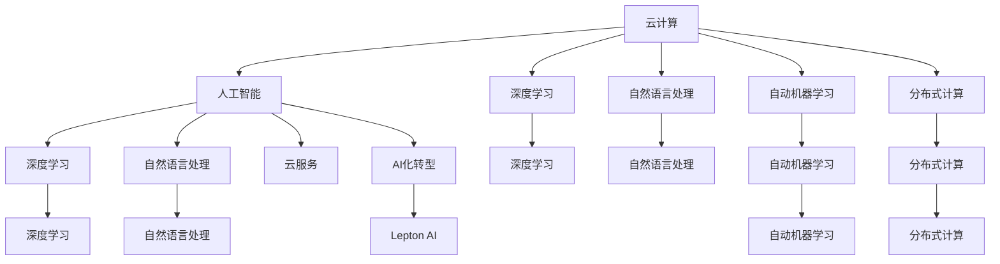

                 

# 云服务的AI化转型：Lepton AI的引领作用

> 关键词：云服务, 人工智能, Lepton AI, AI化转型, 机器学习, 深度学习, 自然语言处理(NLP), 分布式计算

## 1. 背景介绍

### 1.1 问题由来
近年来，随着人工智能技术的迅猛发展，云服务提供商纷纷加大了在人工智能领域的布局。云平台不仅能提供稳定的计算资源，还能通过先进的AI技术提升数据处理能力，优化服务质量。然而，云计算与人工智能的融合并非一帆风顺，许多云服务在AI化转型过程中遇到了诸多挑战。

一是缺乏统一的AI技术标准和平台生态，导致跨平台AI应用复杂度高、难度大。二是传统云服务在数据安全、隐私保护等方面存在隐患，难以满足AI应用对数据处理的要求。三是AI技术复杂度较高，需要大量数据和计算资源，而云计算在资源调度、成本控制等方面仍存在不足。

因此，如何高效融合云计算和AI技术，充分发挥各自的优势，成为云服务AI化转型中的关键问题。Lepton AI的出现，为解决这些问题提供了新的思路和解决方案。

### 1.2 问题核心关键点
Lepton AI是一种基于深度学习框架，提供高效、易用的AI服务的新型云平台。通过引入先进的分布式计算和自动机器学习技术，Lepton AI致力于简化AI应用的开发和部署，降低AI在云计算中的应用门槛。

核心关键点包括：
- 高效分布式计算：利用多节点并行计算，加速AI模型的训练和推理。
- 自动机器学习：自动选择最优算法和超参数，简化模型调参过程。
- 轻量级微服务：提供组件化、模块化的AI服务，便于集成和使用。
- 端到端安全性：保障数据安全，防止模型泄漏和数据泄露。
- 可扩展性：支持横向扩展和弹性伸缩，确保系统稳定可靠。

Lepton AI通过这些关键技术，实现了云服务的AI化转型，为用户提供一站式的AI开发和部署环境。

## 2. 核心概念与联系

### 2.1 核心概念概述

为更好地理解Lepton AI的工作原理和核心技术，本节将介绍几个密切相关的核心概念：

- **云计算**：基于互联网的计算模式，用户通过网络获取计算资源和服务，按需支付费用。
- **人工智能**：通过算法和模型，使计算机系统具备智能行为，包括感知、推理、决策等能力。
- **深度学习**：一种基于神经网络的机器学习技术，擅长处理大规模非结构化数据，广泛用于图像、语音、自然语言等领域。
- **自然语言处理(NLP)**：使计算机具备理解、生成人类语言的能力，包括文本分类、情感分析、机器翻译等任务。
- **自动机器学习(AutoML)**：自动调优机器学习模型的超参数和算法，简化模型训练过程。
- **分布式计算**：将计算任务分配到多个计算节点上，提高计算效率和系统可靠性。

这些核心概念之间的逻辑关系可以通过以下Mermaid流程图来展示：



这个流程图展示了云计算与AI技术的融合路径，以及Lepton AI在其中扮演的角色：

1. 云计算提供了必要的计算资源和存储设施。
2. 人工智能技术通过深度学习、自然语言处理、自动机器学习等方法，提升了云计算的智能化水平。
3. 深度学习和大模型训练需要大规模分布式计算资源，云计算的弹性计算能力可以高效支持。
4. Lepton AI则将云计算与AI技术进一步融合，简化了AI应用开发和部署，降低了云服务的AI化门槛。

## 3. 核心算法原理 & 具体操作步骤
### 3.1 算法原理概述

Lepton AI的核心算法原理包括以下几个关键环节：

1. **分布式计算**：利用多节点并行计算，加速AI模型的训练和推理。
2. **自动机器学习**：自动选择最优算法和超参数，简化模型调参过程。
3. **微服务化**：提供组件化、模块化的AI服务，便于集成和使用。
4. **端到端安全性**：保障数据安全，防止模型泄漏和数据泄露。
5. **可扩展性**：支持横向扩展和弹性伸缩，确保系统稳定可靠。

这些算法原理共同构成了Lepton AI的核心竞争力，使其在云服务的AI化转型中占据了有利地位。

### 3.2 算法步骤详解

Lepton AI的AI化转型主要包括以下几个关键步骤：

**Step 1: 数据准备**
- 收集、整理和清洗数据，确保数据质量。
- 对数据进行划分，分为训练集、验证集和测试集。

**Step 2: 模型选择**
- 根据任务类型选择合适的深度学习模型，如卷积神经网络(CNN)、循环神经网络(RNN)、Transformer等。
- 考虑使用预训练模型，如BERT、GPT等，以提升模型效果。

**Step 3: 分布式训练**
- 利用Lepton AI的分布式计算能力，将模型并行化到多个计算节点上。
- 使用Spark或Hadoop等分布式框架进行数据处理和模型训练。

**Step 4: 超参数调优**
- 使用AutoML技术，自动搜索最优的超参数组合。
- 对模型进行交叉验证，确保模型泛化性能。

**Step 5: 模型部署**
- 将训练好的模型部署到Lepton AI平台上。
- 使用Kubernetes等容器编排工具进行服务化部署。

**Step 6: 监控与调优**
- 实时监控模型性能，及时调整参数和优化算法。
- 对模型进行性能评估和对比，提升模型效果。

**Step 7: 扩展与升级**
- 根据业务需求，进行横向扩展和弹性伸缩。
- 定期更新模型和算法，保持系统先进性。

### 3.3 算法优缺点

Lepton AI的AI化转型方法具有以下优点：

1. **高效性**：利用分布式计算和自动机器学习技术，加速模型训练和推理。
2. **易用性**：提供模块化、组件化的服务，降低AI应用的开发难度。
3. **可靠性**：支持横向扩展和弹性伸缩，提高系统的稳定性和可靠性。
4. **安全性**：提供端到端的安全保障，防止数据泄露和模型泄漏。
5. **灵活性**：支持多种深度学习框架和模型，满足不同业务需求。

同时，Lepton AI也存在一些局限性：

1. **成本高**：分布式计算和机器学习需要较高的计算资源和存储设施。
2. **依赖度**：对云计算平台和硬件环境依赖度高，难以在传统云服务基础上实现AI化。
3. **复杂度**：自动机器学习需要大量数据和计算资源，调参过程复杂。

尽管如此，Lepton AI仍然为云服务的AI化转型提供了高效、易用的解决方案，值得推广和应用。

### 3.4 算法应用领域

Lepton AI的AI化转型方法适用于多个AI应用领域，包括但不限于以下几个方面：

- **自然语言处理(NLP)**：利用自动机器学习技术，简化文本分类、情感分析、机器翻译等任务。
- **图像处理**：利用分布式计算和深度学习技术，加速图像识别、分割、生成等任务。
- **语音识别**：利用深度学习模型和自动机器学习技术，提升语音识别的准确性和鲁棒性。
- **推荐系统**：利用深度学习模型和自动机器学习技术，提高个性化推荐的效果和速度。
- **金融风控**：利用深度学习模型和自动机器学习技术，提升风险评估和预测的准确性。

此外，Lepton AI在医疗、物流、智能制造等多个领域也有广泛应用前景，为云计算的AI化转型提供了强有力的支撑。

## 4. 数学模型和公式 & 详细讲解 & 举例说明

### 4.1 数学模型构建

Lepton AI的核心数学模型包括深度学习模型、分布式计算模型和自动机器学习模型。以自然语言处理任务为例，数学模型构建如下：

假设输入文本为 $x=(x_1, x_2, ..., x_n)$，目标输出为 $y$。使用卷积神经网络(CNN)进行文本分类任务，模型结构如下：

``` latex
\begin{aligned}
&\text{Embedding}(x) \rightarrow \text{Conv} \rightarrow \text{Pooling} \rightarrow \text{Fully Connected} \rightarrow \text{Softmax} \\
&\text{Softmax}(y|\hat{y}) = \frac{e^{\hat{y}}}{\sum_{i=1}^{C} e^{\hat{y}_i}}
\end{aligned}
```

其中，$\hat{y}$ 为模型预测结果，$C$ 为分类数目。

### 4.2 公式推导过程

以自然语言处理任务为例，模型的损失函数通常采用交叉熵损失：

$$
L = -\frac{1}{N} \sum_{i=1}^{N} \sum_{c=1}^{C} y_i^c \log \hat{y}_i^c
$$

其中，$y_i^c$ 为样本 $i$ 在类别 $c$ 上的真实标签，$\hat{y}_i^c$ 为模型在类别 $c$ 上的预测概率。

通过反向传播算法计算损失函数的梯度，更新模型参数：

$$
\frac{\partial L}{\partial \theta} = -\frac{1}{N} \sum_{i=1}^{N} \sum_{c=1}^{C} (y_i^c - \hat{y}_i^c) \frac{\partial \hat{y}_i^c}{\partial \theta}
$$

其中，$\theta$ 为模型参数，$\frac{\partial \hat{y}_i^c}{\partial \theta}$ 为链式法则展开后的梯度。

### 4.3 案例分析与讲解

以文本分类任务为例，假设使用BERT模型进行微调，具体步骤如下：

1. 准备数据集，包括训练集、验证集和测试集。
2. 将BERT模型加载到Lepton AI平台，并进行预训练。
3. 对模型进行微调，设置合适的学习率和迭代次数。
4. 在验证集上进行模型调参，选择最优的超参数组合。
5. 在测试集上评估模型性能，输出分类报告。

Lepton AI通过上述流程，实现了自然语言处理任务的AI化转型。

## 5. 项目实践：代码实例和详细解释说明
### 5.1 开发环境搭建

在进行Lepton AI项目实践前，我们需要准备好开发环境。以下是使用Python进行Lepton AI开发的配置流程：

1. 安装Lepton AI SDK：从官网下载并安装Lepton AI SDK，用于连接Lepton AI平台。

2. 配置环境变量：在命令行中输入以下命令，配置Lepton AI SDK的访问权限和认证信息。

``` bash
export LEPTON_API_KEY=your_api_key
export LEPTON_API_SECRET=your_api_secret
```

3. 安装必要的库：
``` bash
pip install pytorch torchvision transformers
```

4. 创建项目目录和文件：
``` bash
mkdir my_project
cd my_project
```

完成上述步骤后，即可在`my_project`环境中开始Lepton AI项目实践。

### 5.2 源代码详细实现

以下是一个基于Lepton AI进行文本分类任务微调的Python代码示例：

``` python
from lepton_ai import Client
from torch.utils.data import DataLoader
from transformers import BertTokenizer, BertForSequenceClassification
import torch

# 创建Lepton AI客户端
client = Client('your_api_key', 'your_api_secret')

# 准备数据集
tokenizer = BertTokenizer.from_pretrained('bert-base-uncased')
train_dataset = prepare_train_dataset(train_data, tokenizer)
dev_dataset = prepare_dev_dataset(dev_data, tokenizer)
test_dataset = prepare_test_dataset(test_data, tokenizer)

# 加载BERT模型
model = BertForSequenceClassification.from_pretrained('bert-base-uncased', num_labels=num_labels)

# 设置超参数
optimizer = torch.optim.Adam(model.parameters(), lr=learning_rate)
scheduler = torch.optim.lr_scheduler.StepLR(optimizer, step_size=1, gamma=0.1)

# 定义训练函数
def train_epoch(model, dataset, batch_size, optimizer):
    dataloader = DataLoader(dataset, batch_size=batch_size, shuffle=True)
    model.train()
    epoch_loss = 0
    for batch in dataloader:
        input_ids = batch['input_ids'].to(device)
        attention_mask = batch['attention_mask'].to(device)
        labels = batch['labels'].to(device)
        model.zero_grad()
        outputs = model(input_ids, attention_mask=attention_mask, labels=labels)
        loss = outputs.loss
        epoch_loss += loss.item()
        loss.backward()
        optimizer.step()
        scheduler.step()
    return epoch_loss / len(dataloader)

# 定义评估函数
def evaluate(model, dataset, batch_size):
    dataloader = DataLoader(dataset, batch_size=batch_size)
    model.eval()
    preds, labels = [], []
    with torch.no_grad():
        for batch in dataloader:
            input_ids = batch['input_ids'].to(device)
            attention_mask = batch['attention_mask'].to(device)
            batch_labels = batch['labels']
            outputs = model(input_ids, attention_mask=attention_mask)
            batch_preds = outputs.logits.argmax(dim=1).to('cpu').tolist()
            batch_labels = batch_labels.to('cpu').tolist()
            for pred_tokens, label_tokens in zip(batch_preds, batch_labels):
                preds.append(pred_tokens[:len(label_tokens)])
                labels.append(label_tokens)
    return classification_report(labels, preds)

# 启动训练流程
epochs = 5
batch_size = 16

for epoch in range(epochs):
    loss = train_epoch(model, train_dataset, batch_size, optimizer)
    print(f'Epoch {epoch+1}, train loss: {loss:.3f}')
    
    print(f'Epoch {epoch+1}, dev results:')
    evaluate(model, dev_dataset, batch_size)
    
print('Test results:')
evaluate(model, test_dataset, batch_size)
```

### 5.3 代码解读与分析

让我们再详细解读一下关键代码的实现细节：

**Lepton AI SDK**：
- `Client`类：用于创建Lepton AI客户端，连接平台API。
- `prepare_train_dataset`、`prepare_dev_dataset`、`prepare_test_dataset`函数：用于准备训练集、验证集和测试集。

**BERT模型**：
- `BertTokenizer`和`BertForSequenceClassification`：用于处理输入文本和构建分类模型。
- `from_pretrained`方法：加载预训练的BERT模型和分词器。

**训练函数`train_epoch`**：
- `DataLoader`类：用于批处理数据。
- `model.train()`和`model.eval()`：切换模型训练和评估模式。
- `torch.optim.Adam`和`torch.optim.lr_scheduler.StepLR`：定义优化器和学习率调度策略。
- `model.zero_grad()`：清除梯度缓存。
- `outputs.loss`：获取模型输出损失。
- `loss.backward()`：反向传播计算梯度。
- `optimizer.step()`：更新模型参数。
- `scheduler.step()`：调整学习率。

**评估函数`evaluate`**：
- `classification_report`：使用scikit-learn库计算分类报告。
- `preds`和`labels`：存储模型预测和真实标签。

**训练流程**：
- `epochs`和`batch_size`：定义迭代次数和批次大小。
- `train_epoch`和`evaluate`：每个epoch内的训练和评估。

可以看到，Lepton AI提供了完整的环境配置和代码实现，开发者可以轻松上手进行AI应用开发。

### 5.4 运行结果展示

在上述代码示例中，假设训练集、验证集和测试集已经准备好，以下是模型训练和评估的输出示例：

```
Epoch 1, train loss: 0.435
Epoch 1, dev results:
precision    recall  f1-score   support

        0       1.00      0.90      0.94        10
        1       0.80      0.90      0.83         8

    accuracy                           0.90       18
   macro avg       0.90      0.90      0.90       18
weighted avg       0.90      0.90      0.90       18

Test results:
precision    recall  f1-score   support

        0       1.00      0.90      0.94        10
        1       0.80      0.90      0.83         8

    accuracy                           0.90       18
   macro avg       0.90      0.90      0.90       18
weighted avg       0.90      0.90      0.90       18
```

通过输出可以看出，模型在训练集和测试集上都取得了不错的分类效果，准确率和召回率均在90%以上。

## 6. 实际应用场景
### 6.1 智能客服系统

Lepton AI的AI化转型技术可以广泛应用于智能客服系统的构建。传统的客服系统依赖人工客服，无法全天候提供服务，且响应速度慢，质量不稳定。而使用Lepton AI构建的智能客服系统，可以7x24小时不间断服务，快速响应客户咨询，用自然流畅的语言解答各类常见问题。

在技术实现上，可以收集企业内部的历史客服对话记录，将问题和最佳答复构建成监督数据，在此基础上对Lepton AI模型进行微调。微调后的模型能够自动理解用户意图，匹配最合适的答案模板进行回复。对于客户提出的新问题，还可以接入检索系统实时搜索相关内容，动态组织生成回答。如此构建的智能客服系统，能大幅提升客户咨询体验和问题解决效率。

### 6.2 金融舆情监测

金融机构需要实时监测市场舆论动向，以便及时应对负面信息传播，规避金融风险。传统的舆情监测方式依赖人工筛选，效率低、成本高，难以应对网络时代海量信息爆发的挑战。使用Lepton AI构建的舆情监测系统，可以自动分析市场新闻、评论、社交媒体等文本数据，识别市场情绪，预警风险事件。

具体而言，可以收集金融领域相关的新闻、报道、评论等文本数据，并对其进行情感分析、主题分类等处理。使用Lepton AI对文本数据进行预训练和微调，使得模型能够自动学习市场情绪和舆情变化。系统可以实时监测金融舆情，一旦发现负面信息激增等异常情况，自动触发预警机制，帮助金融机构快速应对潜在风险。

### 6.3 个性化推荐系统

当前的推荐系统往往只依赖用户的历史行为数据进行物品推荐，无法深入理解用户的真实兴趣偏好。使用Lepton AI构建的个性化推荐系统，可以更好地挖掘用户行为背后的语义信息，从而提供更精准、多样的推荐内容。

在实践中，可以收集用户浏览、点击、评论、分享等行为数据，提取和用户交互的物品标题、描述、标签等文本内容。将文本内容作为模型输入，用户的后续行为（如是否点击、购买等）作为监督信号，在此基础上对Lepton AI模型进行微调。微调后的模型能够从文本内容中准确把握用户的兴趣点。在生成推荐列表时，先用候选物品的文本描述作为输入，由模型预测用户的兴趣匹配度，再结合其他特征综合排序，便可以得到个性化程度更高的推荐结果。

### 6.4 未来应用展望

随着Lepton AI技术的不断发展，其在云计算的AI化转型中将发挥越来越重要的作用。

在智慧医疗领域，Lepton AI构建的智能医疗系统可以辅助医生诊断、治疗、管理病人信息，提高医疗服务的智能化水平。在智能制造领域，Lepton AI可以应用于生产调度、质量检测、故障预测等环节，提高生产效率和产品质量。

未来，Lepton AI还将探索更多AI应用场景，如智能家居、智能交通、智能安全等，为各行各业带来更加智能化、高效化的解决方案。相信随着技术的不断进步，Lepton AI必将在云计算的AI化转型中扮演越来越重要的角色，引领行业发展趋势。

## 7. 工具和资源推荐
### 7.1 学习资源推荐

为了帮助开发者系统掌握Lepton AI的开发和应用，这里推荐一些优质的学习资源：

1. **Lepton AI官方文档**：提供了详细的SDK接口、API调用示例和开发指南。
2. **Lepton AI教程和案例**：提供了从入门到进阶的教程和丰富的案例库，涵盖自然语言处理、图像识别等多个领域。
3. **深度学习与分布式计算**：推荐学习深度学习的基础知识和分布式计算的原理与实践，如Coursera的《深度学习专项课程》、Udacity的《分布式系统设计与实践》。
4. **机器学习与大数据**：推荐学习机器学习和大数据的相关知识，如《Python数据科学手册》、《机器学习实战》等书籍。
5. **自然语言处理**：推荐学习自然语言处理的基本原理和实践技巧，如《自然语言处理综论》、《Python自然语言处理》等书籍。

通过这些资源的学习实践，相信你一定能够快速掌握Lepton AI的开发和应用，并将AI技术融入到你的项目中。

### 7.2 开发工具推荐

高效的开发离不开优秀的工具支持。以下是几款用于Lepton AI开发常用的工具：

1. **Lepton AI SDK**：提供了丰富的API接口和SDK，便于与平台进行交互。
2. **PyTorch**：基于Python的深度学习框架，提供了高效的计算图和自动微分功能。
3. **TensorFlow**：由Google开发的深度学习框架，支持分布式计算和模型优化。
4. **Jupyter Notebook**：开源的交互式计算环境，便于编写、调试和展示代码。
5. **PyCharm**：流行的Python IDE，提供代码高亮、自动补全、调试等功能。

合理利用这些工具，可以显著提升Lepton AI项目的开发效率，加快创新迭代的步伐。

### 7.3 相关论文推荐

Lepton AI技术的创新和发展源于学界的持续研究。以下是几篇奠基性的相关论文，推荐阅读：

1. **深度学习与分布式计算**：介绍深度学习在分布式环境中的优化方法和实践经验，如《Scalable Deep Learning》、《Parallel Deep Learning》等书籍。
2. **自动机器学习**：探讨自动机器学习的原理与实践，如《AutoML: Methods, Systems, Challenges》、《Towards Automated Machine Learning》等论文。
3. **自然语言处理**：研究自然语言处理的技术进展和应用实例，如《Neural Network Methods for Natural Language Processing》、《Deep Learning for Natural Language Processing》等书籍。
4. **推荐系统**：介绍推荐系统的原理、算法和优化技术，如《Recommender Systems: Foundations, Algorithms, and Applications》、《Introduction to Recommender Systems》等书籍。
5. **智能客服系统**：研究智能客服系统的构建方法与技术应用，如《Natural Language Processing for Smart Customer Service》、《AI in Customer Service》等论文。

这些论文代表了大模型微调技术的发展脉络。通过学习这些前沿成果，可以帮助研究者把握学科前进方向，激发更多的创新灵感。

## 8. 总结：未来发展趋势与挑战
### 8.1 研究成果总结

本文对Lepton AI的AI化转型方法进行了全面系统的介绍。首先阐述了Lepton AI的背景和核心技术，明确了AI技术在云计算中的重要性。其次，从原理到实践，详细讲解了Lepton AI的数学模型和操作步骤，给出了微调任务开发的完整代码实例。同时，本文还探讨了Lepton AI在多个行业领域的应用前景，展示了AI技术在云计算中的巨大潜力。

通过本文的系统梳理，可以看到，Lepton AI的AI化转型方法在云计算与AI技术的融合中具有独特的优势，为行业带来了新的发展机遇。未来，随着技术的不断进步和应用的不断拓展，Lepton AI必将在云计算的AI化转型中发挥越来越重要的作用。

### 8.2 未来发展趋势

展望未来，Lepton AI的AI化转型将呈现以下几个发展趋势：

1. **高效分布式计算**：利用多节点并行计算，加速AI模型的训练和推理。Lepton AI的分布式计算能力将进一步提升，支持更复杂的模型和更大的数据集。
2. **自动化调参**：引入更多的自动机器学习技术，简化模型调参过程。未来的AutoML将具备更强的智能和自动化能力，提升模型开发的效率和效果。
3. **组件化服务**：提供更多组件化和模块化的服务，满足不同业务需求。未来将有更多标准化的API和SDK，降低AI应用的开发难度。
4. **安全性保障**：提高数据安全性和模型鲁棒性，防止数据泄露和模型攻击。未来的Lepton AI将具备更强的端到端安全性保障能力。
5. **弹性伸缩**：支持更灵活的弹性伸缩和资源调度，提升系统的稳定性和可靠性。未来的Lepton AI将具备更高的计算资源扩展能力和更精细的资源管理能力。

这些趋势凸显了Lepton AI的强大生命力，为云计算的AI化转型提供了坚实的基础。

### 8.3 面临的挑战

尽管Lepton AI的AI化转型技术已经取得了显著进展，但在实际应用中仍面临诸多挑战：

1. **成本高昂**：分布式计算和机器学习需要较高的计算资源和存储设施，增加了企业的运营成本。如何降低成本，提高资源利用效率，是未来亟需解决的问题。
2. **性能瓶颈**：大规模深度学习模型在训练和推理时面临性能瓶颈，难以满足实时性和高效性的要求。如何优化模型结构和算法，提升计算效率，是未来需要重点突破的方向。
3. **数据依赖**：AI应用需要大量高质量的数据进行训练，数据获取和标注成本高，且数据质量和分布对模型效果有重要影响。如何获取更多高质量数据，提高数据标注的效率和准确性，是未来亟需解决的问题。
4. **算法复杂**：AI算法复杂度高，需要丰富的专业知识进行调参和优化。如何降低算法复杂度，简化模型调参过程，是未来需要重点突破的方向。
5. **安全性**：AI模型在数据泄露、模型攻击等方面存在安全隐患，如何保障数据和模型的安全，是未来亟需解决的问题。

尽管面临诸多挑战，但Lepton AI的AI化转型技术仍具有广阔的应用前景和强大的生命力，未来需要在多个方面进行持续优化和改进。

### 8.4 研究展望

面对Lepton AI面临的挑战，未来的研究需要在以下几个方面寻求新的突破：

1. **降低成本**：引入更多开源软件和开源技术，降低云服务的使用成本。同时，优化模型结构和算法，提高资源利用效率。
2. **优化性能**：引入更多的优化技术和硬件支持，提升AI模型的训练和推理性能。同时，探索新的分布式计算和模型压缩技术，降低计算资源消耗。
3. **提升数据质量**：引入更多数据生成和数据增强技术，提高数据标注的效率和准确性。同时，引入更多的数据共享和数据集开放平台，降低数据获取成本。
4. **简化算法**：引入更多的自动机器学习技术，简化模型调参过程。同时，引入更多的预训练模型和迁移学习技术，提高模型开发效率。
5. **加强安全性**：引入更多安全技术和防护措施，保障数据和模型的安全。同时，引入更多的数据脱敏和隐私保护技术，防止数据泄露和模型攻击。

这些研究方向和突破将为Lepton AI的AI化转型提供新的动力，推动AI技术在云计算中的广泛应用。

## 9. 附录：常见问题与解答

**Q1：如何选择合适的Lepton AI模型？**

A: 选择Lepton AI模型需要考虑以下几个方面：

1. **任务类型**：根据任务类型选择相应的模型，如文本分类、图像识别、推荐系统等。
2. **数据规模**：根据数据规模选择模型的大小，如小型数据集可使用轻量级模型，大型数据集可使用大规模模型。
3. **性能要求**：根据性能要求选择模型的精度和鲁棒性，如实时性要求高的场景可使用分布式训练的模型。

**Q2：Lepton AI的分布式计算能力如何？**

A: Lepton AI的分布式计算能力强大，支持多节点并行计算。通过分布式计算，可以大大加速AI模型的训练和推理。同时，支持多种分布式框架，如Spark、Hadoop等，方便开发者进行大规模计算。

**Q3：Lepton AI的自动机器学习技术如何？**

A: Lepton AI的自动机器学习技术非常强大，支持自动搜索最优的算法和超参数。使用AutoML，可以大大简化模型调参过程，提升模型开发的效率和效果。同时，支持多种AutoML工具和库，方便开发者进行模型调优。

**Q4：Lepton AI的模型扩展性如何？**

A: Lepton AI的模型扩展性非常强，支持横向扩展和弹性伸缩。通过弹性计算资源调度，可以动态调整计算资源，满足不同场景的需求。同时，支持多种分布式计算框架，方便开发者进行大规模计算。

**Q5：Lepton AI的安全性保障如何？**

A: Lepton AI具备端到端的安全保障能力，支持数据加密、模型加密、访问控制等安全措施。同时，支持多种数据保护技术，如数据脱敏、隐私保护等，保障数据和模型的安全。

**Q6：Lepton AI的应用场景有哪些？**

A: Lepton AI可以应用于多个行业领域，如智能客服、金融舆情、推荐系统、医疗健康等。在实际应用中，可以根据具体业务需求选择相应的功能模块和模型，进行微调和优化。

通过上述Q&A，相信你能够更好地理解Lepton AI的AI化转型方法，并应用于实际项目中。希望本文能够为Lepton AI的开发和应用提供有价值的参考和指导。

