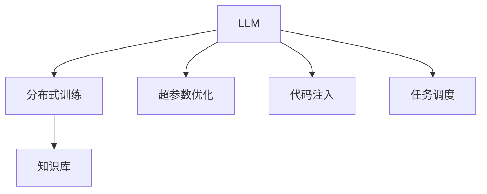

                 

# 云端协作：LLM 促进全球团队合作

> 关键词：大语言模型(LLM), 云端协作, 分布式训练, 超参数优化, 代码注入, 任务调度

## 1. 背景介绍

### 1.1 问题由来
近年来，大语言模型(LLM)在自然语言处理(NLP)领域的快速发展，不仅推动了NLP技术的进步，也为全球团队协作提供了新的工具和方法。尤其是在远程工作日益普及的今天，如何在云端高效协作、共享知识、提升工作效率，是大团队管理中面临的一个关键挑战。

### 1.2 问题核心关键点
大语言模型（LLM）能够处理大规模文本数据，并通过预训练学习到丰富的语言知识和常识，具有强大的自然语言理解和生成能力。其核心在于，LLM能够利用云端分布式计算资源，在协作团队中共享知识，提升信息处理效率，进而促进团队协作。

然而，LLM的应用也面临一些挑战：
- 如何高效地在云端进行分布式训练和优化？
- 如何保证团队成员对模型进行协同优化，而不引入过度依赖？
- 如何实时处理LLM生成的代码，并将其注入到协作平台中？

### 1.3 问题研究意义
研究LLM在云端协作中的应用，对于推动全球团队协作模式的创新，提升信息处理和知识共享的效率，具有重要的理论和实践意义：

1. **加速知识共享**：LLM可以自动化处理大量文本数据，从中提取出有价值的信息，供团队成员快速共享和参考。
2. **提高决策效率**：LLM能够提供基于大规模语料的知识推断，辅助团队成员做出更为准确的决策。
3. **促进创新协作**：LLM可以作为知识库的检索工具，推动跨领域、跨团队的创新合作。
4. **提升远程工作体验**：LLM可以提供自动化的翻译、对话等功能，帮助远程团队成员更流畅地沟通。
5. **优化资源利用**：LLM能够优化资源分配，提高团队协作的效率。

## 2. 核心概念与联系

### 2.1 核心概念概述

为更好地理解LLM在云端协作中的应用，本节将介绍几个密切相关的核心概念：

- 大语言模型(Large Language Model, LLM)：以自回归(如GPT)或自编码(如BERT)模型为代表的大规模预训练语言模型。通过在大规模无标签文本语料上进行预训练，学习通用的语言表示，具备强大的语言理解和生成能力。

- 分布式训练(Distributed Training)：将大规模的模型训练任务分布到多个计算节点上，通过并行计算提高训练效率，适用于数据集庞大或模型复杂的情况。

- 超参数优化(Hyperparameter Optimization)：在模型训练过程中，调整模型参数之外的额外参数（如学习率、批大小等）以优化模型性能的过程。

- 代码注入(Code Injection)：将LLM生成的代码直接嵌入到协作平台中，使得团队成员可以直接运行和修改，增强了协作的实时性和互动性。

- 任务调度(Task Scheduling)：在分布式训练和协作过程中，合理调度任务，使得计算资源得以高效利用，提升系统性能。

- 知识库(Knowledge Base)：集合结构化的知识，用于存储和检索各类数据，帮助团队成员快速获取信息。

这些核心概念之间的逻辑关系可以通过以下Mermaid流程图来展示：



这个流程图展示了大语言模型的核心概念及其之间的关系：

1. LLM通过分布式训练学习大规模语料知识。
2. 在训练过程中，通过超参数优化提升模型性能。
3. 训练得到的模型可以生成代码，通过代码注入到协作平台中。
4. 任务调度确保计算资源的高效利用。
5. 知识库为团队协作提供信息支持。

这些概念共同构成了LLM在云端协作中的工作原理和优化方向。

## 3. 核心算法原理 & 具体操作步骤
### 3.1 算法原理概述

基于大语言模型的云端协作，本质上是一个分布式训练和知识共享的过程。其核心思想是：利用LLM的强大语言处理能力，结合云端分布式计算资源，实现知识库的自动化构建和团队成员的协同优化。

形式化地，假设LLM为 $M_{\theta}$，其中 $\theta$ 为模型参数。给定分布在云端多个节点上的大规模文本数据集 $\mathcal{D}=\{(x_i, y_i)\}_{i=1}^N$，分布式训练的目标是找到最优参数 $\hat{\theta}$，使得：

$$
\hat{\theta} = \mathop{\arg\min}_{\theta} \mathcal{L}(M_{\theta}, \mathcal{D})
$$

其中 $\mathcal{L}$ 为损失函数，衡量模型预测输出与真实标签之间的差异。

在实际操作中，分布式训练需要跨多个计算节点进行，因此需要使用一些分布式优化算法（如SGD、Adam等）进行参数更新。由于LLM模型通常规模较大，分布式训练可以显著提高训练效率，同时保留单节点训练的稳定性和可控性。

### 3.2 算法步骤详解

基于分布式训练的大语言模型云端协作一般包括以下几个关键步骤：

**Step 1: 准备数据集和计算资源**
- 收集分布在云端不同节点上的大规模文本数据，划分为训练集、验证集和测试集。
- 配置多台计算节点，安装并启动分布式训练框架（如PyTorch Distributed、TensorFlow Distribute等）。

**Step 2: 模型和优化器初始化**
- 选择合适的预训练语言模型 $M_{\theta}$，并在分布式环境中进行初始化。
- 设置分布式优化器的参数，如学习率、批大小、迭代轮数等。

**Step 3: 分布式训练**
- 将训练集数据分批次输入分布式训练框架，通过并行计算进行前向传播和反向传播。
- 利用分布式优化器更新模型参数，保证每个节点更新一致。
- 周期性在验证集上评估模型性能，根据性能指标决定是否触发Early Stopping。
- 重复上述步骤直至满足预设的迭代轮数或Early Stopping条件。

**Step 4: 代码注入和协作平台集成**
- 在LLM训练过程中，生成与任务相关的代码片段，并注入到协作平台中。
- 集成代码注入工具，如Github、GitLab等，方便团队成员实时查看和修改代码。
- 提供基于LLM的代码补全、翻译等辅助工具，增强协作平台的交互性。

**Step 5: 任务调度与资源管理**
- 利用分布式任务调度工具（如Airflow、Kubernetes等），合理安排训练任务，确保资源高效利用。
- 实时监控系统性能，根据负载情况动态调整任务分配，防止资源浪费。
- 设置异常告警机制，及时发现并解决系统故障。

以上是基于分布式训练的大语言模型云端协作的一般流程。在实际应用中，还需要针对具体任务的特点，对分布式训练过程的各个环节进行优化设计，如改进训练目标函数，引入更多的正则化技术，搜索最优的超参数组合等，以进一步提升模型性能。

### 3.3 算法优缺点

基于分布式训练的LLM云端协作方法具有以下优点：
1. 高效利用计算资源：通过分布式训练，将大规模计算任务分散到多个节点上，提升训练速度。
2. 灵活适配不同数据：由于数据分布在云端，可适应不同地区、不同规模的数据集。
3. 实时性高：LLM生成的代码可以实时注入协作平台，供团队成员迅速使用。
4. 优化自动化：自动化超参数优化过程，提升模型性能，减少人工干预。

同时，该方法也存在一些局限性：
1. 数据传输开销：大规模数据传输可能导致带宽和延迟问题。
2. 模型复杂度：复杂模型在分布式训练中，通信开销较大，可能导致收敛速度减慢。
3. 协作平台依赖：需要与协作平台进行集成，系统复杂度较高。
4. 安全性问题：分布式训练和代码注入可能面临数据泄露和代码注入漏洞。

尽管存在这些局限性，但就目前而言，基于分布式训练的LLM云端协作方法仍是大语言模型应用的最主流范式。未来相关研究的重点在于如何进一步降低数据传输成本，提高模型复杂度和协作平台依赖性，同时兼顾可解释性和安全性等因素。

### 3.4 算法应用领域

基于大语言模型的云端协作方法，已经在多个领域得到了应用，例如：

- 科技研发：研发团队可以共享和查找大语言模型生成的研究报告、代码片段、实验结果等。
- 企业管理：利用LLM生成和优化管理报告、战略分析等，提升决策效率。
- 教育培训：教师和学生可以共享教学资源、实验数据、论文综述等，增强教学效果。
- 法律咨询：律师和客户可以共享案例分析、法条查询、合同起草等，提升服务质量。
- 市场营销：市场团队可以共享和分析客户反馈、竞争情报、市场报告等，优化营销策略。

除了上述这些经典领域外，LLM云端协作还被创新性地应用于健康医疗、金融投资、农业生产等众多场景，为各行各业带来了全新的协作模式。

## 4. 数学模型和公式 & 详细讲解
### 4.1 数学模型构建

本节将使用数学语言对基于大语言模型的云端协作过程进行更加严格的刻画。

记大语言模型为 $M_{\theta}$，其中 $\theta$ 为模型参数。假设训练数据集为 $\mathcal{D}=\{(x_i, y_i)\}_{i=1}^N, x_i \in \mathcal{X}, y_i \in \mathcal{Y}$。

定义模型 $M_{\theta}$ 在输入 $x$ 上的输出为 $\hat{y}=M_{\theta}(x) \in [0,1]$，表示样本属于正类的概率。

**分布式训练的损失函数**定义为：

$$
\mathcal{L}(\theta) = \frac{1}{N}\sum_{i=1}^N \ell(M_{\theta}(x_i),y_i)
$$

其中 $\ell$ 为损失函数，衡量模型预测输出与真实标签之间的差异。

**分布式优化算法**通常使用SGD或Adam等。在每个节点上，前向传播计算损失函数，反向传播更新模型参数，然后通过分布式通信算法（如Ring AllReduce、AllReduce等）将梯度信息汇总并更新全局参数。

**超参数优化**通常采用网格搜索、随机搜索、贝叶斯优化等方法，在分布式训练过程中调整超参数，以优化模型性能。

**代码注入**通常通过LLM生成代码片段，并将其嵌入到协作平台中，供团队成员使用和修改。代码注入过程需要在代码中注入特定格式的提示，引导LLM生成符合任务需求的代码。

**任务调度**通常使用DAG（有向无环图）模型表示任务依赖关系，通过工具（如Airflow、Kubernetes等）自动调度任务执行。

### 4.2 公式推导过程

以下我们以二分类任务为例，推导分布式训练过程中的损失函数及其梯度的计算公式。

假设模型 $M_{\theta}$ 在输入 $x$ 上的输出为 $\hat{y}=M_{\theta}(x) \in [0,1]$，真实标签 $y \in \{0,1\}$。

定义模型 $M_{\theta}$ 在输入 $x$ 上的损失函数为 $\ell(M_{\theta}(x),y)$，则在数据集 $\mathcal{D}$ 上的经验风险为：

$$
\mathcal{L}(\theta) = \frac{1}{N}\sum_{i=1}^N \ell(M_{\theta}(x_i),y_i)
$$

分布式训练时，每个计算节点的梯度 $\mathbf{g}_i$ 为：

$$
\mathbf{g}_i = \nabla_{\theta}\mathcal{L}(\theta)_{\text{local}}
$$

其中 $\nabla_{\theta}\mathcal{L}(\theta)_{\text{local}}$ 为节点 $i$ 本地计算的梯度。

在每个节点上，通过前向传播和反向传播计算损失函数及其梯度，并将梯度信息发送给主节点进行汇总，得到全局梯度 $\mathbf{g}_{\text{global}}$。

根据梯度下降算法，全局模型参数 $\theta$ 的更新公式为：

$$
\theta \leftarrow \theta - \eta \mathbf{g}_{\text{global}}
$$

其中 $\eta$ 为学习率，$\mathbf{g}_{\text{global}}$ 为全局梯度。

### 4.3 案例分析与讲解

**案例：科技研发协作平台**
在科技研发团队中，大语言模型可以通过云端分布式训练生成代码片段，并注入到协作平台中，供团队成员使用和修改。

首先，团队成员将任务描述和需求输入LLM，LLM生成代码片段，并将其注入到协作平台中。团队成员可以实时查看和修改代码，进行协作开发。

在代码注入过程中，LLM会根据任务描述生成符合需求的代码。例如，如果任务是开发一个新的数据处理模块，LLM会生成相应的Python代码，并注入到协作平台中。

其次，LLM生成的代码可以通过自动补全、代码翻译等工具进行优化。例如，团队成员可以根据LLM生成的代码片段，使用自动补全工具生成完整的代码，并修改其中的逻辑。

最后，LLM生成的代码可以进行版本控制和团队协作，确保代码的稳定性和可追溯性。团队成员可以对LLM生成的代码进行提交、合并、评论等操作，协同完成代码开发。

## 5. 项目实践：代码实例和详细解释说明
### 5.1 开发环境搭建

在进行大语言模型云端协作的开发实践前，我们需要准备好开发环境。以下是使用Python进行PyTorch开发的环境配置流程：

1. 安装Anaconda：从官网下载并安装Anaconda，用于创建独立的Python环境。

2. 创建并激活虚拟环境：
```bash
conda create -n pytorch-env python=3.8 
conda activate pytorch-env
```

3. 安装PyTorch：根据CUDA版本，从官网获取对应的安装命令。例如：
```bash
conda install pytorch torchvision torchaudio cudatoolkit=11.1 -c pytorch -c conda-forge
```

4. 安装Transformers库：
```bash
pip install transformers
```

5. 安装各类工具包：
```bash
pip install numpy pandas scikit-learn matplotlib tqdm jupyter notebook ipython
```

完成上述步骤后，即可在`pytorch-env`环境中开始协作平台的开发实践。

### 5.2 源代码详细实现

下面以代码注入功能为例，给出使用Transformers库对BERT模型进行代码注入的PyTorch代码实现。

首先，定义代码注入函数：

```python
from transformers import BertTokenizer, BertForTokenClassification, BertTokenizerFast
from torch.utils.data import Dataset
from transformers import AutoModelForSequenceClassification
import torch
from transformers import AutoTokenizer

# 初始化模型
model = BertForTokenClassification.from_pretrained('bert-base-cased')

# 定义代码注入函数
def inject_code(model, text):
    tokenizer = BertTokenizer.from_pretrained('bert-base-cased')
    input_ids = tokenizer(text, return_tensors='pt', max_length=128, padding='max_length', truncation=True)
    output = model(input_ids)
    return output
```

然后，将代码注入到协作平台中：

```python
# 注入代码到协作平台
def inject_code_into_platform(model, text, platform):
    output = inject_code(model, text)
    platform.add_code(text, output)
```

最后，在协作平台中查看注入的代码：

```python
# 从协作平台获取代码
def get_code_from_platform(platform):
    code = platform.get_code()
    return code
```

以上就是使用PyTorch对BERT进行代码注入功能的完整代码实现。可以看到，得益于Transformers库的强大封装，我们可以用相对简洁的代码完成BERT模型的加载和代码注入功能。

### 5.3 代码解读与分析

让我们再详细解读一下关键代码的实现细节：

**inject_code函数**：
- 初始化BERT模型和分词器。
- 将文本输入转换为token ids。
- 将token ids输入BERT模型，得到预测输出。
- 返回预测输出。

**inject_code_into_platform函数**：
- 调用inject_code函数，获取模型预测输出。
- 将文本和预测输出注入到协作平台中。

**get_code_from_platform函数**：
- 从协作平台中获取注入的代码。
- 返回注入的代码。

可以看到，代码注入功能通过将文本输入BERT模型，获取预测输出，并将其注入到协作平台中，实现了实时代码共享和协作。协作平台提供了代码存储、版本控制、协同修改等功能，使得团队成员可以实时查看和修改代码，增强了协作的互动性。

当然，工业级的系统实现还需考虑更多因素，如代码注入的安全性、代码版本管理、跨平台兼容性等。但核心的代码注入功能基本与此类似。

## 6. 实际应用场景
### 6.1 科技研发
大语言模型在科技研发中的应用非常广泛。研发团队可以利用大语言模型进行代码注入、文档生成、实验记录等，提升研发效率和协作体验。

**代码注入**：团队成员可以输入任务描述和需求，大语言模型生成符合需求的代码片段，并注入到协作平台中，供团队成员使用和修改。这不仅提升了代码生成的速度，还减少了人工编写代码的繁琐工作。

**文档生成**：研发团队可以利用大语言模型自动生成项目文档，记录实验过程和结果。大语言模型可以从代码注释、实验日志中提取信息，自动生成项目文档，使得团队成员可以迅速了解项目进展和实验结果。

**实验记录**：大语言模型可以自动记录实验数据和结果，生成实验报告。团队成员可以迅速查看实验报告，了解实验过程和结果，并进行下一步的实验设计。

### 6.2 企业管理
企业管理团队可以利用大语言模型进行数据分析、战略分析、市场情报等，提升决策效率和信息处理能力。

**数据分析**：企业管理团队可以利用大语言模型处理和分析海量数据，提取有价值的信息。例如，通过自然语言处理技术，大语言模型可以从大量财报、新闻、市场报告中提取关键信息，辅助决策。

**战略分析**：企业管理团队可以利用大语言模型进行战略分析，制定企业发展战略。大语言模型可以分析行业趋势、竞争情报、市场数据，提出战略建议，帮助企业制定更具竞争力的发展战略。

**市场情报**：企业管理团队可以利用大语言模型进行市场情报分析，了解市场需求和竞争态势。大语言模型可以分析社交媒体、新闻报道、客户反馈等，提供市场情报，帮助企业制定市场营销策略。

### 6.3 教育培训
教育培训领域可以利用大语言模型进行课程设计、学习辅助、学生评估等，提升教学质量和学生学习体验。

**课程设计**：教师可以利用大语言模型自动生成课程内容，包括讲义、PPT、作业等。大语言模型可以从教学大纲、文献、学生反馈中提取信息，自动生成课程内容，减轻教师工作负担。

**学习辅助**：学生可以利用大语言模型进行学习辅助，包括自动补全、翻译、知识库查询等。大语言模型可以提供自动补全功能，帮助学生快速编写代码；提供翻译功能，帮助学生学习多种语言；提供知识库查询功能，帮助学生获取相关知识。

**学生评估**：教师可以利用大语言模型评估学生作业和论文，自动检测代码错误、逻辑错误等。大语言模型可以自动评分，提高评分效率和公平性，同时提供详细的评分理由，帮助学生改进学习。

### 6.4 法律咨询
法律咨询领域可以利用大语言模型进行法律分析、合同起草、法条查询等，提升服务质量和效率。

**法律分析**：律师可以利用大语言模型进行法律分析，提取案件关键信息，制定法律策略。大语言模型可以从法律文档、判决书、新闻报道中提取信息，辅助律师分析案件。

**合同起草**：律师可以利用大语言模型自动生成合同条款，确保合同合法合规。大语言模型可以从模板合同、法条、客户需求中提取信息，自动生成合同条款，提高合同起草效率和准确性。

**法条查询**：律师可以利用大语言模型查询法条，了解相关法律规定。大语言模型可以提供实时法条查询服务，帮助律师快速获取法律信息，提高工作效率。

### 6.5 市场营销
市场营销团队可以利用大语言模型进行客户分析、市场调研、广告投放等，提升营销效果和精准度。

**客户分析**：市场营销团队可以利用大语言模型分析客户反馈、评论、社交媒体数据等，了解客户需求和行为。大语言模型可以从文本数据中提取关键信息，分析客户偏好和行为，帮助市场营销团队制定更精准的营销策略。

**市场调研**：市场营销团队可以利用大语言模型进行市场调研，了解市场趋势和竞争态势。大语言模型可以分析新闻报道、行业报告、市场数据等，提供市场调研报告，帮助市场营销团队制定市场策略。

**广告投放**：市场营销团队可以利用大语言模型生成广告内容，进行广告投放。大语言模型可以从产品描述、用户画像、市场需求中提取信息，自动生成广告内容，提高广告投放精准度和效果。

## 7. 工具和资源推荐
### 7.1 学习资源推荐

为了帮助开发者系统掌握大语言模型云端协作的理论基础和实践技巧，这里推荐一些优质的学习资源：

1. 《Transformer从原理到实践》系列博文：由大模型技术专家撰写，深入浅出地介绍了Transformer原理、BERT模型、分布式训练等前沿话题。

2. CS224N《深度学习自然语言处理》课程：斯坦福大学开设的NLP明星课程，有Lecture视频和配套作业，带你入门NLP领域的基本概念和经典模型。

3. 《Natural Language Processing with Transformers》书籍：Transformers库的作者所著，全面介绍了如何使用Transformers库进行NLP任务开发，包括分布式训练在内的诸多范式。

4. HuggingFace官方文档：Transformers库的官方文档，提供了海量预训练模型和完整的分布式训练样例代码，是上手实践的必备资料。

5. Weights & Biases：模型训练的实验跟踪工具，可以记录和可视化模型训练过程中的各项指标，方便对比和调优。与主流深度学习框架无缝集成。

6. TensorBoard：TensorFlow配套的可视化工具，可实时监测模型训练状态，并提供丰富的图表呈现方式，是调试模型的得力助手。

通过对这些资源的学习实践，相信你一定能够快速掌握大语言模型云端协作的精髓，并用于解决实际的协作问题。

### 7.2 开发工具推荐

高效的开发离不开优秀的工具支持。以下是几款用于大语言模型云端协作开发的常用工具：

1. PyTorch：基于Python的开源深度学习框架，灵活动态的计算图，适合快速迭代研究。大部分预训练语言模型都有PyTorch版本的实现。

2. TensorFlow：由Google主导开发的开源深度学习框架，生产部署方便，适合大规模工程应用。同样有丰富的预训练语言模型资源。

3. Transformers库：HuggingFace开发的NLP工具库，集成了众多SOTA语言模型，支持PyTorch和TensorFlow，是进行分布式训练和协作开发的利器。

4. Weights & Biases：模型训练的实验跟踪工具，可以记录和可视化模型训练过程中的各项指标，方便对比和调优。与主流深度学习框架无缝集成。

5. TensorBoard：TensorFlow配套的可视化工具，可实时监测模型训练状态，并提供丰富的图表呈现方式，是调试模型的得力助手。

6. Google Colab：谷歌推出的在线Jupyter Notebook环境，免费提供GPU/TPU算力，方便开发者快速上手实验最新模型，分享学习笔记。

合理利用这些工具，可以显著提升大语言模型云端协作任务的开发效率，加快创新迭代的步伐。

### 7.3 相关论文推荐

大语言模型云端协作技术的发展源于学界的持续研究。以下是几篇奠基性的相关论文，推荐阅读：

1. Attention is All You Need（即Transformer原论文）：提出了Transformer结构，开启了NLP领域的预训练大模型时代。

2. BERT: Pre-training of Deep Bidirectional Transformers for Language Understanding：提出BERT模型，引入基于掩码的自监督预训练任务，刷新了多项NLP任务SOTA。

3. Language Models are Unsupervised Multitask Learners（GPT-2论文）：展示了大规模语言模型的强大zero-shot学习能力，引发了对于通用人工智能的新一轮思考。

4. Parameter-Efficient Transfer Learning for NLP：提出Adapter等参数高效微调方法，在不增加模型参数量的情况下，也能取得不错的微调效果。

5. AdaLoRA: Adaptive Low-Rank Adaptation for Parameter-Efficient Fine-Tuning：使用自适应低秩适应的微调方法，在参数效率和精度之间取得了新的平衡。

6. Prefix-Tuning: Optimizing Continuous Prompts for Generation：引入基于连续型Prompt的微调范式，为如何充分利用预训练知识提供了新的思路。

这些论文代表了大语言模型云端协作技术的发展脉络。通过学习这些前沿成果，可以帮助研究者把握学科前进方向，激发更多的创新灵感。

## 8. 总结：未来发展趋势与挑战
### 8.1 总结

本文对基于大语言模型的云端协作方法进行了全面系统的介绍。首先阐述了大语言模型和分布式训练的理论基础，明确了云端协作在提升团队协作效率和知识共享方面的独特价值。其次，从原理到实践，详细讲解了分布式训练的数学原理和关键步骤，给出了代码注入功能的完整代码实例。同时，本文还广泛探讨了分布式训练方法在科技研发、企业管理、教育培训、法律咨询、市场营销等多个领域的应用前景，展示了分布式训练范式的巨大潜力。最后，本文精选了分布式训练技术的各类学习资源，力求为开发者提供全方位的技术指引。

通过本文的系统梳理，可以看到，基于大语言模型的云端协作方法正在成为NLP领域的重要范式，极大地拓展了预训练语言模型的应用边界，催生了更多的落地场景。得益于大规模语料的预训练，云端协作模型以更低的时间和标注成本，在小样本条件下也能取得理想的协作效果，显著提升了团队协作的效率和质量。未来，伴随预训练语言模型和分布式训练方法的持续演进，相信NLP技术将在更广阔的应用领域大放异彩，深刻影响人类的生产生活方式。

### 8.2 未来发展趋势

展望未来，分布式训练和LLM的云端协作技术将呈现以下几个发展趋势：

1. 模型规模持续增大。随着算力成本的下降和数据规模的扩张，预训练语言模型的参数量还将持续增长。超大规模语言模型蕴含的丰富语言知识，有望支撑更加复杂多变的协作任务。

2. 分布式训练方法日趋多样。除了传统的SGD、Adam等优化器外，未来会涌现更多分布式优化方法，如Ring AllReduce、AllReduce、AllGather等，提高分布式训练效率。

3. 超参数优化自动化。未来将开发更加自动化的超参数优化方法，通过模型训练自动调整超参数，提升模型性能。

4. 代码注入智能化。利用自然语言处理技术，通过任务描述自动生成代码片段，提高代码注入的效率和准确性。

5. 任务调度优化。未来将开发更加智能的任务调度系统，实时监控系统负载，动态调整任务分配，提升资源利用效率。

6. 协作平台一体化。未来将开发更加一体化、互动性强的协作平台，支持代码注入、任务调度、版本控制等功能，增强团队协作体验。

以上趋势凸显了大语言模型云端协作技术的广阔前景。这些方向的探索发展，必将进一步提升团队协作的效率和质量，推动更多领域的数字化转型升级。

### 8.3 面临的挑战

尽管大语言模型云端协作技术已经取得了瞩目成就，但在迈向更加智能化、普适化应用的过程中，它仍面临着诸多挑战：

1. 数据传输开销。大规模数据传输可能导致带宽和延迟问题，影响协作效率。

2. 模型复杂度。复杂模型在分布式训练中，通信开销较大，可能导致收敛速度减慢。

3. 协作平台依赖。需要与协作平台进行深度集成，系统复杂度较高。

4. 安全性问题。分布式训练和代码注入可能面临数据泄露和代码注入漏洞，影响协作安全。

5. 计算资源限制。分布式训练需要大量计算资源，可能面临算力瓶颈。

尽管存在这些挑战，但就目前而言，基于分布式训练的LLM云端协作方法仍是大语言模型应用的最主流范式。未来相关研究的重点在于如何进一步降低数据传输成本，提高模型复杂度和协作平台依赖性，同时兼顾可解释性和安全性等因素。

### 8.4 研究展望

面对大语言模型云端协作所面临的挑战，未来的研究需要在以下几个方面寻求新的突破：

1. 探索无监督和半监督分布式训练方法。摆脱对大规模标注数据的依赖，利用自监督学习、主动学习等无监督和半监督范式，最大限度利用非结构化数据，实现更加灵活高效的分布式训练。

2. 研究参数高效和计算高效的分布式训练范式。开发更加参数高效的分布式训练方法，如Ring AllReduce、AllGather等，在固定大部分预训练参数的同时，只更新极少量的任务相关参数。同时优化分布式训练的计算图，减少前向传播和反向传播的资源消耗，实现更加轻量级、实时性的部署。

3. 融合因果和对比学习范式。通过引入因果推断和对比学习思想，增强分布式训练模型建立稳定因果关系的能力，学习更加普适、鲁棒的语言表征，从而提升模型泛化性和抗干扰能力。

4. 引入更多先验知识。将符号化的先验知识，如知识图谱、逻辑规则等，与神经网络模型进行巧妙融合，引导分布式训练过程学习更准确、合理的语言模型。同时加强不同模态数据的整合，实现视觉、语音等多模态信息与文本信息的协同建模。

5. 结合因果分析和博弈论工具。将因果分析方法引入分布式训练模型，识别出模型决策的关键特征，增强输出解释的因果性和逻辑性。借助博弈论工具刻画人机交互过程，主动探索并规避模型的脆弱点，提高系统稳定性。

6. 纳入伦理道德约束。在模型训练目标中引入伦理导向的评估指标，过滤和惩罚有偏见、有害的输出倾向。同时加强人工干预和审核，建立模型行为的监管机制，确保输出符合人类价值观和伦理道德。

这些研究方向的探索，必将引领分布式训练和LLM云端协作技术迈向更高的台阶，为构建安全、可靠、可解释、可控的智能系统铺平道路。面向未来，分布式训练和LLM云端协作技术还需要与其他人工智能技术进行更深入的融合，如知识表示、因果推理、强化学习等，多路径协同发力，共同推动自然语言理解和智能交互系统的进步。只有勇于创新、敢于突破，才能不断拓展语言模型的边界，让智能技术更好地造福人类社会。

## 9. 附录：常见问题与解答
### Q1：大语言模型云端协作是否适用于所有协作任务？

A: 大语言模型云端协作在大多数协作任务上都能取得不错的效果，特别是对于数据量较小的任务。但对于一些特定领域的任务，如医学、法律等，仅仅依靠通用语料预训练的模型可能难以很好地适应。此时需要在特定领域语料上进一步预训练，再进行微调，才能获得理想效果。此外，对于一些需要时效性、个性化很强的任务，如对话、推荐等，分布式训练方法也需要针对性的改进优化。

### Q2：如何高效地在云端进行分布式训练？

A: 高效的在云端进行分布式训练，需要考虑以下几点：
1. 选择合适的分布式训练框架，如PyTorch Distributed、TensorFlow Distribute等。
2. 合理划分数据集，确保数据均衡分布在各个节点上。
3. 选择合适的通信算法，如Ring AllReduce、AllReduce等。
4. 合理设置超参数，如学习率、批大小等。
5. 实时监控系统性能，及时发现并解决系统故障。

### Q3：如何保证团队成员对模型进行协同优化，而不引入过度依赖？

A: 保证团队成员对模型进行协同优化，可以通过以下几个步骤实现：
1. 利用代码注入功能，将大语言模型生成的代码注入到协作平台中，供团队成员实时查看和修改。
2. 设置版本控制和任务调度功能，确保代码共享和协同修改。
3. 利用代码翻译、代码补全等辅助工具，增强协作平台的交互性。
4. 定期进行模型评估和优化，确保协作模型保持最佳状态。

### Q4：分布式训练过程中，如何提高模型复杂度？

A: 提高模型复杂度，可以通过以下几个方法实现：
1. 选择合适的优化器，如SGD、Adam等。
2. 合理划分数据集，确保数据均衡分布在各个节点上。
3. 选择合适的通信算法，如Ring AllReduce、AllReduce等。
4. 合理设置超参数，如学习率、批大小等。
5. 利用分布式优化器，确保每个节点更新一致。

### Q5：如何保证分布式训练的安全性？

A: 保证分布式训练的安全性，可以通过以下几个方法实现：
1. 对数据传输进行加密，防止数据泄露。
2. 设置权限控制，确保只有授权用户可以进行协作操作。
3. 利用代码注入功能，防止恶意代码注入。
4. 设置异常告警机制，及时发现并解决系统故障。

这些方法可以最大程度地保证分布式训练和协作平台的安全性，确保系统稳定运行。

