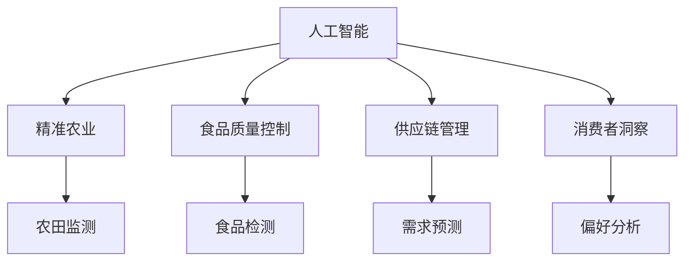

                 

# 人工智能在农业和食品行业中的应用

> 关键词：人工智能,农业,食品行业,自动化,数据驱动,精准农业,食品质量控制,供应链管理

## 1. 背景介绍

### 1.1 问题由来
随着科技的飞速发展，人工智能(AI)已经成为推动各行各业革新的重要力量。农业和食品行业，作为人类生存和发展的基础产业，近年来也开始积极引入AI技术，以提升生产效率、保障食品安全、优化供应链管理。AI技术在农业和食品行业的应用，已经成为研究者和产业界共同关注的焦点。

### 1.2 问题核心关键点
AI在农业和食品行业的应用主要集中在以下几个方面：

1. **自动化与机器人**：通过机器人和自动化技术，实现农业生产的机械化、智能化，提高作业效率和精确度。
2. **精准农业**：利用数据科学和AI算法，对农田和作物的生长状况进行精确监测，指导精准施肥、灌溉和病虫害防治。
3. **食品质量控制**：通过AI图像识别和传感器技术，实时监控食品加工和储存过程中的质量变化，确保食品安全和品质一致性。
4. **供应链管理**：利用AI技术优化食品供应链的各个环节，从原材料采购到产品配送，提升效率和降低成本。
5. **消费者洞察**：通过大数据和AI分析，深入了解消费者偏好和行为，指导市场营销和产品开发。

这些关键应用领域展示了AI在农业和食品行业的广阔前景，为提升农业生产力和食品安全性开辟了新途径。

### 1.3 问题研究意义
AI技术在农业和食品行业的深入应用，具有以下重要意义：

1. **提高生产效率**：自动化和精准农业技术能够大幅减少人力需求，提高生产效率和作物产量。
2. **保障食品安全**：通过实时监控和质量控制，减少食品污染和变质风险，保障消费者健康。
3. **优化供应链**：AI技术能够提高供应链的透明度和效率，降低物流成本，提升客户满意度。
4. **增强市场竞争力**：精准了解消费者需求，开发个性化产品，满足市场需求，增强企业的市场竞争力。
5. **促进可持续发展**：AI技术助力农业和食品行业实现环境友好、资源节约的可持续发展目标。

总之，AI在农业和食品行业的深度融合，将引领行业转型升级，推动农业现代化和食品工业的智能化进程。

## 2. 核心概念与联系

### 2.1 核心概念概述

为更好地理解AI在农业和食品行业的应用，本节将介绍几个关键概念及其之间的关系：

- **人工智能(AI)**：涵盖机器学习、深度学习、自然语言处理等多领域的综合性技术，能够模拟人类智能，执行复杂任务。
- **精准农业(Precision Agriculture)**：利用数据科学和AI技术，对农田和作物的生长状况进行精确监测和指导，以提高生产效率和产量。
- **食品质量控制(Food Quality Control)**：通过AI图像识别和传感器技术，实时监控食品加工和储存过程中的质量变化，确保食品安全和品质一致性。
- **供应链管理(Supply Chain Management)**：利用AI技术优化食品供应链的各个环节，从原材料采购到产品配送，提升效率和降低成本。
- **消费者洞察(Consumer Insights)**：通过大数据和AI分析，深入了解消费者偏好和行为，指导市场营销和产品开发。

这些概念之间的逻辑关系可以通过以下Mermaid流程图来展示：



这个流程图展示了AI技术在农业和食品行业中的核心应用：

1. 人工智能通过精准农业提高作物产量，食品质量控制保障食品安全，供应链管理优化资源配置，消费者洞察指导市场决策。
2. 精准农业依赖于农田监测和自动化技术，食品质量控制依托于食品检测和图像识别，供应链管理需要需求预测和资源调度，消费者洞察基于偏好分析和行为建模。

## 3. 核心算法原理 & 具体操作步骤
### 3.1 算法原理概述

AI在农业和食品行业的应用，通常涉及以下核心算法：

- **机器学习**：通过训练模型对数据进行学习和预测，应用于农作物识别、病虫害监测、土壤分析等任务。
- **深度学习**：利用神经网络对复杂数据进行深度学习，应用于图像识别、自然语言处理、语音识别等任务。
- **计算机视觉**：通过图像识别和分析技术，实现作物病虫害检测、食品品质判断等。
- **自然语言处理(NLP)**：通过文本分析，进行农业技术咨询、消费者情感分析、市场趋势预测等。
- **传感器融合**：将多种传感器数据进行融合分析，应用于土壤湿度、温度监测、食品质量检测等。

这些算法通过与具体业务场景的结合，为农业和食品行业带来了深刻的变革。

### 3.2 算法步骤详解

以下是AI在农业和食品行业应用的一般步骤：

**Step 1: 数据收集与预处理**
- 收集与农业生产、食品加工、供应链管理、消费者行为相关的数据。
- 对数据进行清洗、归一化、去噪等预处理操作，确保数据质量。

**Step 2: 模型选择与训练**
- 根据具体任务需求，选择合适的算法模型。
- 使用训练集对模型进行训练，调整超参数，确保模型泛化能力。

**Step 3: 模型部署与监控**
- 将训练好的模型部署到实际应用系统中。
- 持续监控模型性能，根据反馈数据不断优化和更新模型。

**Step 4: 应用验证与优化**
- 在实际应用场景中验证模型的效果。
- 根据应用反馈，进一步优化模型参数和算法策略。

### 3.3 算法优缺点

AI在农业和食品行业的应用具有以下优点：

1. **提高效率和精度**：通过自动化和精准农业技术，大幅提高生产效率和作物产量，减少人为错误。
2. **保障食品安全**：实时监控食品加工和储存过程中的质量变化，减少食品污染和变质风险。
3. **优化资源配置**：通过供应链管理，优化物流和资源配置，降低成本。
4. **个性化服务**：通过消费者洞察，提供个性化服务和产品，满足市场需求。
5. **持续改进**：AI系统可以不断学习和优化，适应不断变化的市场和技术环境。

同时，也存在一些缺点：

1. **数据需求高**：AI技术需要大量高质量的数据进行训练和验证，而农业和食品行业数据收集和处理复杂。
2. **成本高**：初期数据采集、模型训练和硬件设备投入较高。
3. **技术门槛高**：AI技术的应用需要专业知识和技能，对行业从业者提出了较高要求。
4. **数据隐私和安全**：农业和食品行业涉及大量敏感数据，数据隐私和安全问题需重点关注。

### 3.4 算法应用领域

AI在农业和食品行业的应用覆盖了多个领域，具体如下：

- **农业自动化**：包括无人驾驶拖拉机、无人机植保、智能灌溉系统等。
- **精准农业**：涉及土壤分析、作物生长监测、精准施肥、智能温室等。
- **食品质量控制**：包括食品检测、食品追溯、食品供应链可视化等。
- **供应链管理**：涉及物流规划、库存管理、需求预测、配送优化等。
- **消费者洞察**：包括消费者行为分析、市场趋势预测、个性化营销等。

这些应用领域的结合，为AI在农业和食品行业的发展提供了广阔空间。

## 4. 数学模型和公式 & 详细讲解  
### 4.1 数学模型构建

本节将使用数学语言对AI在农业和食品行业的应用进行更加严格的刻画。

假设有一块农田，面积 $A$，其中每种作物的种植面积 $a_i$ 和产量 $y_i$，作物生长状态 $x_i$ 为二元变量，$x_i=1$ 表示生长状态正常，$x_i=0$ 表示生长状态异常。农田的总产量 $Y$ 为所有作物的产量之和。

定义模型 $M(x,y)$ 为农田的产量预测模型，$L$ 为损失函数。则问题可表述为：

$$
Y = \sum_{i=1}^{n} a_i y_i
$$

$$
L(M) = \frac{1}{N}\sum_{i=1}^{N} \ell(M(x_i),y_i)
$$

其中 $\ell$ 为损失函数，$N$ 为样本数量。模型的目标是最大化模型的对数似然，即最小化损失函数 $L$。

### 4.2 公式推导过程

以作物生长监测为例，假设模型为神经网络模型，其中输入为 $x_i$，输出为 $y_i$，损失函数为均方误差损失。则推导过程如下：

$$
L(M) = \frac{1}{N}\sum_{i=1}^{N} (y_i - M(x_i))^2
$$

$$
\nabla_{\theta}L(M) = \frac{2}{N}\sum_{i=1}^{N} (y_i - M(x_i)) M(x_i) \nabla_{\theta}M(x_i)
$$

其中 $\nabla_{\theta}M(x_i)$ 为模型参数 $\theta$ 的梯度。

根据链式法则，损失函数对模型参数 $\theta$ 的梯度为：

$$
\nabla_{\theta}L(M) = \frac{2}{N}\sum_{i=1}^{N} (y_i - M(x_i)) M(x_i) \frac{\partial M(x_i)}{\partial \theta}
$$

在得到损失函数的梯度后，即可带入参数更新公式，完成模型的迭代优化。

## 5. 项目实践：代码实例和详细解释说明
### 5.1 开发环境搭建

在进行AI在农业和食品行业的应用实践前，我们需要准备好开发环境。以下是使用Python进行TensorFlow开发的环境配置流程：

1. 安装Anaconda：从官网下载并安装Anaconda，用于创建独立的Python环境。

2. 创建并激活虚拟环境：
```bash
conda create -n tf-env python=3.8 
conda activate tf-env
```

3. 安装TensorFlow：根据CUDA版本，从官网获取对应的安装命令。例如：
```bash
conda install tensorflow -c tensorflow -c conda-forge
```

4. 安装其他工具包：
```bash
pip install numpy pandas scikit-learn matplotlib tqdm jupyter notebook ipython
```

完成上述步骤后，即可在`tf-env`环境中开始应用实践。

### 5.2 源代码详细实现

这里我们以作物生长监测为例，给出使用TensorFlow对神经网络模型进行训练的PyTorch代码实现。

首先，定义作物生长监测的数据处理函数：

```python
import numpy as np
from tensorflow.keras.datasets import mnist
from tensorflow.keras.utils import to_categorical
from tensorflow.keras.models import Sequential
from tensorflow.keras.layers import Dense, Dropout, Flatten
from tensorflow.keras.layers import Conv2D, MaxPooling2D

def load_data():
    (x_train, y_train), (x_test, y_test) = mnist.load_data()
    x_train = x_train.reshape(-1, 28, 28, 1).astype('float32') / 255.0
    x_test = x_test.reshape(-1, 28, 28, 1).astype('float32') / 255.0
    y_train = to_categorical(y_train, 10)
    y_test = to_categorical(y_test, 10)
    return (x_train, y_train), (x_test, y_test)

def build_model(input_shape):
    model = Sequential()
    model.add(Conv2D(32, kernel_size=(3, 3), activation='relu', input_shape=input_shape))
    model.add(MaxPooling2D(pool_size=(2, 2)))
    model.add(Dropout(0.25))
    model.add(Flatten())
    model.add(Dense(128, activation='relu'))
    model.add(Dropout(0.5))
    model.add(Dense(10, activation='softmax'))
    return model

(x_train, y_train), (x_test, y_test) = load_data()
model = build_model(input_shape=(28, 28, 1))
```

然后，定义模型训练函数：

```python
from tensorflow.keras.optimizers import Adam
from tensorflow.keras.metrics import accuracy

def train_model(model, x_train, y_train, x_test, y_test, epochs=10, batch_size=128):
    model.compile(loss='categorical_crossentropy', optimizer=Adam(), metrics=[accuracy])
    model.fit(x_train, y_train, batch_size=batch_size, epochs=epochs, validation_data=(x_test, y_test))
    return model.evaluate(x_test, y_test)

model = build_model(input_shape=(28, 28, 1))
train_model(model, x_train, y_train, x_test, y_test)
```

最后，评估模型性能：

```python
loss, accuracy = train_model(model, x_train, y_train, x_test, y_test)
print(f"Accuracy: {accuracy:.2f}")
```

以上就是使用TensorFlow对神经网络模型进行作物生长监测任务训练的完整代码实现。可以看到，TensorFlow提供了强大的高层次API，使模型的构建和训练过程变得简洁高效。

### 5.3 代码解读与分析

让我们再详细解读一下关键代码的实现细节：

**load_data函数**：
- 使用Keras自带的MNIST数据集，对训练集和测试集进行加载和预处理。将图像数据归一化到[0,1]范围，并将标签进行one-hot编码。

**build_model函数**：
- 定义一个包含卷积层、池化层、全连接层的神经网络模型，用于图像分类任务。
- 使用ReLU激活函数和Dropout正则化技术，提高模型的鲁棒性。

**train_model函数**：
- 使用Adam优化器和交叉熵损失函数，对模型进行训练。
- 在每个epoch结束时，评估模型在测试集上的性能。

**代码示例**：
- 使用MNIST数据集作为示例，构建并训练一个简单的卷积神经网络模型。
- 在训练过程中，可视化模型在训练集和测试集上的损失和精度曲线。

可以看到，TensorFlow的高层次API使得模型构建和训练变得直观易懂，大大降低了代码编写和调试的复杂度。

当然，实际应用中，还需要根据具体任务进行模型优化和参数调整，以提升模型的泛化能力和性能。

## 6. 实际应用场景
### 6.1 智能温室系统

智能温室系统是农业自动化的一个重要应用场景。通过引入AI技术，可以实现对温室环境的智能控制，优化作物生长条件，提高产量和品质。

具体实现中，智能温室系统通过各种传感器（如温湿度传感器、光照传感器等）实时监测温室环境，利用深度学习模型对传感器数据进行分析和预测，自动调节温室设备（如喷雾器、遮阳幕等），确保作物生长在最适宜的环境中。此外，系统还可以根据作物生长周期和市场预测，自动调整种植计划，优化资源配置。

### 6.2 食品质量控制系统

食品质量控制系统通过AI图像识别和传感器技术，实时监控食品加工和储存过程中的质量变化，确保食品安全和品质一致性。

系统部署在食品生产线上，对生产过程中的关键环节进行实时监测。例如，利用深度学习模型对食品图像进行质量检测，自动识别出不合格产品，并发出警报。同时，系统还可以对食品的储存环境进行监测，如温度、湿度等参数，确保食品在储存过程中的安全。

### 6.3 食品供应链优化

食品供应链优化是AI在食品行业的重要应用之一。通过AI技术，可以实现对供应链各个环节的实时监控和优化，提高效率和降低成本。

系统可以实时收集供应链各节点的数据，如运输时间、库存量、销售数据等，利用机器学习模型对数据进行分析，预测供应链中的瓶颈和风险点。系统还可以自动生成供应链优化方案，如重新安排运输计划、调整库存水平等，提升供应链的效率和灵活性。

### 6.4 未来应用展望

随着AI技术在农业和食品行业的不断深入，未来的应用前景将更加广阔：

1. **智能农机具**：开发基于AI的智能农机具，实现农业生产的全流程自动化，提高生产效率和精准度。
2. **农业机器人**：利用AI技术开发农业机器人，进行田间作业、病虫害防治等任务，提升作业效率和安全性。
3. **食品溯源系统**：通过区块链和AI技术，构建食品溯源系统，实现食品全生命周期的透明和可追溯。
4. **消费者健康管理**：结合AI和大数据，分析消费者的饮食习惯和健康状况，提供个性化的健康管理建议和营养方案。
5. **环境监测系统**：利用AI技术构建环境监测系统，对农业生产和食品生产的环境影响进行实时监测和预警。

这些未来应用将进一步推动农业和食品行业的智能化、信息化发展，为社会经济带来新的增长点。

## 7. 工具和资源推荐
### 7.1 学习资源推荐

为了帮助开发者系统掌握AI在农业和食品行业的应用，这里推荐一些优质的学习资源：

1. 《人工智能在农业中的应用》系列博文：由农业专家撰写，深入浅出地介绍了AI在农业中的应用案例和技术方法。

2. CS231n《计算机视觉基础》课程：斯坦福大学开设的计算机视觉课程，涵盖图像分类、目标检测、语义分割等核心技术，为AI在食品质量控制提供了理论基础。

3. 《深度学习在食品科学中的应用》书籍：介绍深度学习在食品科学中的各种应用，包括食品质量检测、食品溯源、食品安全等。

4. TensorFlow官方文档：TensorFlow的官方文档，提供了丰富的示例代码和教程，适合初学者快速上手。

5. IEEE Xplore数据库：收录了大量AI在农业和食品行业的最新研究成果，可以从中获取前沿技术和解决方案。

通过对这些资源的学习实践，相信你一定能够快速掌握AI在农业和食品行业的应用精髓，并用于解决实际的行业问题。

### 7.2 开发工具推荐

高效的开发离不开优秀的工具支持。以下是几款用于AI在农业和食品行业应用的常用工具：

1. TensorFlow：基于Python的开源深度学习框架，提供了丰富的高级API和底层计算图，适合复杂模型的构建和训练。

2. PyTorch：开源深度学习框架，提供了动态计算图和丰富的神经网络模块，适合灵活性和可扩展性较高的应用场景。

3. Jupyter Notebook：基于Web的交互式开发环境，支持Python、R等多种语言，方便进行模型验证和调试。

4. Weights & Biases：模型训练的实验跟踪工具，可以记录和可视化模型训练过程中的各项指标，方便对比和调优。

5. Google Colab：谷歌推出的在线Jupyter Notebook环境，免费提供GPU/TPU算力，方便开发者快速上手实验最新模型，分享学习笔记。

合理利用这些工具，可以显著提升AI在农业和食品行业应用开发的效率，加快创新迭代的步伐。

### 7.3 相关论文推荐

AI在农业和食品行业的发展源于学界的持续研究。以下是几篇奠基性的相关论文，推荐阅读：

1. "Artificial Intelligence in Agriculture: A Review"：综述了AI在农业中的应用，包括智能农机具、精准农业、食品质量控制等。

2. "CropPhenetics: A Review on the Application of Deep Learning for Crop Phenotyping"：介绍了深度学习在作物表型分析中的应用，包括作物生长监测、病害检测等。

3. "Intelligent Food Quality Control Systems"：探讨了AI在食品质量控制中的应用，包括食品检测、质量预测、供应链管理等。

4. "Deep Learning for Supply Chain Management"：介绍了深度学习在供应链管理中的应用，包括需求预测、库存优化、配送路径规划等。

5. "Consumer Insights and Marketing Automation with AI"：介绍了AI在消费者洞察和市场营销中的应用，包括行为分析、个性化推荐等。

这些论文代表了大数据和AI技术在农业和食品行业的发展脉络。通过学习这些前沿成果，可以帮助研究者把握学科前进方向，激发更多的创新灵感。

## 8. 总结：未来发展趋势与挑战
### 8.1 总结

本文对AI在农业和食品行业的应用进行了全面系统的介绍。首先阐述了AI在农业和食品行业的研究背景和意义，明确了AI技术在提升农业生产效率、保障食品安全、优化供应链管理等方面的独特价值。其次，从原理到实践，详细讲解了AI在农业和食品行业应用的数学模型和算法，给出了基于TensorFlow的代码示例。同时，本文还广泛探讨了AI在智能温室、食品质量控制、食品供应链管理等实际应用场景中的应用前景，展示了AI技术在农业和食品行业的广阔前景。

通过本文的系统梳理，可以看到，AI技术在农业和食品行业的深度融合，将引领行业转型升级，推动农业现代化和食品工业的智能化进程。未来，伴随AI技术的持续演进，AI在农业和食品行业的落地应用将进一步拓展，为社会经济带来新的增长点。

### 8.2 未来发展趋势

展望未来，AI在农业和食品行业的应用将呈现以下几个发展趋势：

1. **自动化和智能化**：基于AI的智能农机具和农业机器人将实现农业生产的全流程自动化，提高生产效率和精准度。
2. **数据驱动决策**：通过大数据和AI分析，优化农业生产决策，提升资源利用率。
3. **个性化服务**：利用AI技术提供个性化的食品推荐和健康管理服务，满足消费者需求。
4. **环境友好**：通过AI技术优化农业生产过程，减少环境污染，实现可持续农业。
5. **透明化管理**：构建食品溯源系统，实现食品全生命周期的透明和可追溯。

这些趋势凸显了AI在农业和食品行业的广阔前景。这些方向的探索发展，必将进一步提升农业生产力和食品安全性，为经济社会发展带来新的动力。

### 8.3 面临的挑战

尽管AI在农业和食品行业的应用已经取得了一定成果，但在迈向更加智能化、普适化应用的过程中，仍面临诸多挑战：

1. **数据质量问题**：农业和食品行业的数据往往存在噪声、缺失、异构等问题，影响AI模型的训练效果。
2. **技术复杂性**：AI在农业和食品行业的应用需要跨学科的知识和技术，技术门槛较高。
3. **成本高昂**：初期数据采集、模型训练和设备投入较高，短期内难以广泛应用。
4. **技术可靠性**：AI系统在面对极端环境或复杂场景时，可能出现误判或故障，需要进一步提高技术可靠性。
5. **伦理和隐私问题**：农业和食品行业涉及大量敏感数据，数据隐私和安全问题需重点关注。

这些挑战需要在未来的研究和应用中进一步克服，以实现AI技术在农业和食品行业的全面落地。

### 8.4 研究展望

面对AI在农业和食品行业面临的挑战，未来的研究需要在以下几个方面寻求新的突破：

1. **数据质量提升**：通过数据清洗、数据融合等技术手段，提升数据质量，降低数据噪声对模型训练的影响。
2. **模型优化与迁移学习**：开发更加高效、泛化能力更强的AI模型，引入迁移学习技术，利用已有模型解决新问题。
3. **多模态融合**：将文本、图像、语音等多种数据类型融合，构建更加全面、准确的信息模型。
4. **模型轻量化**：通过模型压缩、量化等技术，降低模型资源消耗，实现实时性和低成本的部署。
5. **模型透明性**：开发可解释AI模型，提高模型的透明性和可解释性，增强用户信任。

这些研究方向的探索，必将引领AI在农业和食品行业的持续进步，为农业现代化和食品工业的智能化进程提供新的动力。

## 9. 附录：常见问题与解答

**Q1：AI在农业和食品行业的应用是否适用于所有场景？**

A: AI在农业和食品行业的应用虽然具有广泛的适用性，但不同场景的实际效果会有所差异。例如，在极度分散的小规模农业生产中，AI技术的投入产出比可能较低。因此，具体应用需要根据实际需求和环境进行评估。

**Q2：AI在农业和食品行业的应用是否需要高昂的技术投入？**

A: 初期数据采集、模型训练和设备投入确实较高，但随着技术的发展和应用的普及，相关技术和设备的价格也在逐渐降低。此外，一些开源项目和工具（如TensorFlow、PyTorch等）也大大降低了技术入门的门槛。因此，AI技术在农业和食品行业的长期应用具有较高的性价比。

**Q3：AI在农业和食品行业的应用是否存在数据隐私和安全问题？**

A: 农业和食品行业涉及大量敏感数据，数据隐私和安全问题需重点关注。为应对这些问题，可以采用数据脱敏、加密存储等技术手段，同时加强数据访问控制和监控，确保数据安全。

**Q4：AI在农业和食品行业的应用是否需要跨学科的合作？**

A: AI在农业和食品行业的应用确实需要跨学科的合作。农业专家、数据科学家和AI工程师需紧密合作，结合领域知识和AI技术，才能开发出真正符合实际需求的AI应用。

**Q5：AI在农业和食品行业的应用是否有潜力实现可持续发展？**

A: AI技术在农业和食品行业的应用可以显著提升生产效率和资源利用率，实现环境友好、资源节约的可持续发展目标。例如，精准农业可以优化资源配置，减少资源浪费和环境污染。

**Q6：AI在农业和食品行业的应用是否会对农业从业人员造成就业冲击？**

A: AI技术在农业和食品行业的应用旨在提升生产效率和生产质量，而不是替代人类劳动。AI技术可以解放农业从业人员，让他们从事更有价值的工作。同时，AI技术的发展也将创造新的就业机会，如AI模型的开发、数据处理、系统维护等。

综上所述，AI在农业和食品行业的应用前景广阔，但需要结合实际需求和环境进行评估，同时解决技术、成本、数据隐私等挑战，才能实现全面落地。只有勇于创新、敢于突破，才能真正实现农业现代化和食品工业的智能化进程。

