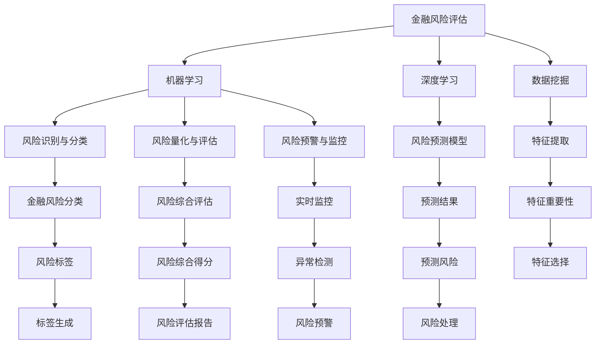

                 

# 人工智能在金融风险评估中的应用：精准预测与防控

> 关键词：人工智能(AI),金融风险评估,精准预测,风险防控,机器学习,深度学习,数据挖掘,模型评估

## 1. 背景介绍

### 1.1 问题由来

金融行业历来是风险密集型行业，风险管理是其核心业务之一。传统上，金融机构依赖于专家系统和规则引擎来进行风险评估，但这种以经验为主的风险管理方式在面对日益复杂多变的市场环境时，显得力不从心。随着人工智能技术的兴起，尤其是机器学习和深度学习的发展，金融机构开始探索利用AI技术来进行金融风险评估。通过AI技术，金融机构可以更精准地预测风险，实现实时监控，从而更好地防范金融风险。

### 1.2 问题核心关键点

当前金融风险评估的AI应用，主要是基于数据驱动的方法，利用机器学习、深度学习和数据挖掘技术，从海量历史数据中挖掘规律，构建风险评估模型，从而实现精准预测与防控。具体来说，AI在金融风险评估中的应用主要包括以下几个方面：

- 风险识别与分类：利用聚类和分类算法，将金融风险进行细粒度分类，识别不同类型和级别的风险。
- 风险量化与评估：通过建立风险量化模型，将各种风险因素映射为可计算的量化指标，进行综合评估。
- 风险预警与监控：利用时序分析、异常检测等技术，实时监测金融市场的异常波动，及时发出预警。
- 风险控制与防范：根据预测结果和预警信息，采取相应的风险防控措施，降低损失。

## 2. 核心概念与联系

### 2.1 核心概念概述

为了更好地理解AI在金融风险评估中的应用，本节将介绍几个核心概念：

- 金融风险评估（Financial Risk Assessment）：是指利用各种方法对金融市场的风险进行评估和预测，包括信用风险、市场风险、操作风险等。
- 机器学习（Machine Learning, ML）：指通过构建算法模型，从历史数据中学习规律，进行风险预测和分类。
- 深度学习（Deep Learning, DL）：是机器学习的一种高级形式，利用神经网络等模型，对复杂非线性问题进行建模和预测。
- 数据挖掘（Data Mining）：指从大量数据中挖掘潜在的有用信息，辅助风险评估和决策。
- 模型评估与优化（Model Evaluation & Optimization）：指构建和优化评估指标，对模型的预测性能进行评价和调整。

这些概念之间的逻辑关系可以通过以下Mermaid流程图来展示：



这个流程图展示了大语言模型的核心概念及其之间的关系：

1. 金融风险评估作为AI应用的总体目标，由机器学习、深度学习和数据挖掘三大支柱共同支撑。
2. 机器学习和深度学习在金融风险评估中分别承担风险识别与分类、风险预测与量化、风险预警与监控等任务。
3. 数据挖掘在特征提取、特征重要性评估等方面为AI应用提供支持。
4. 模型评估与优化用于评价和调整模型的预测性能，保障其可靠性。

这些概念共同构成了金融风险评估的AI应用框架，使得金融机构能够通过智能化的技术手段，提升风险评估的准确性和时效性。

## 3. 核心算法原理 & 具体操作步骤

### 3.1 算法原理概述

金融风险评估的AI应用，主要基于机器学习、深度学习和数据挖掘等算法，构建风险预测和分类模型。其核心算法原理可以简单概括为以下几点：

1. **数据预处理**：对金融数据进行清洗、归一化、特征工程等预处理，提高数据质量。
2. **模型构建**：利用机器学习算法建立风险识别与分类模型、风险量化与评估模型、风险预警与监控模型等。
3. **模型训练**：使用历史数据对模型进行训练，优化模型参数，提高预测精度。
4. **模型评估**：利用测试集对模型进行评估，调整模型参数，提高模型性能。
5. **模型部署与监控**：将训练好的模型部署到实际应用中，实时监控模型性能，及时调整。

### 3.2 算法步骤详解

以信用风险评估为例，介绍AI在金融风险评估中的操作步骤：

1. **数据预处理**：
   - 收集历史贷款数据，包括贷款人基本信息、贷款金额、还款情况等。
   - 清洗数据，去除缺失值和异常值。
   - 对贷款金额等数值型数据进行归一化处理。
   - 对贷款人基本信息等文本数据进行特征工程，提取重要特征。

2. **模型构建**：
   - 选择合适的机器学习算法，如逻辑回归、随机森林等，建立贷款违约预测模型。
   - 使用深度学习算法，如卷积神经网络（CNN）、循环神经网络（RNN）等，建立贷款风险量化与评估模型。
   - 引入时间序列分析算法，如ARIMA、LSTM等，建立贷款市场波动监控模型。

3. **模型训练**：
   - 将历史贷款数据划分为训练集和测试集。
   - 使用训练集对模型进行训练，优化模型参数。
   - 在训练过程中，引入交叉验证、正则化等技术，防止过拟合。

4. **模型评估**：
   - 使用测试集对模型进行评估，计算模型预测准确率、召回率、F1分数等指标。
   - 根据评估结果，调整模型参数，优化模型性能。

5. **模型部署与监控**：
   - 将训练好的模型部署到实际贷款审批系统中。
   - 实时采集贷款申请数据，输入模型进行风险评估。
   - 定期对模型性能进行监控，及时调整模型参数，保持模型精度。

### 3.3 算法优缺点

AI在金融风险评估中的优点主要包括：

- **高效性**：AI模型能够快速处理大量数据，实时监控金融市场，提高风险评估的效率。
- **准确性**：AI模型通过学习历史数据规律，具有较高的预测准确率，降低风险误判的可能性。
- **自动化**：AI模型能够自动化处理金融数据，减轻人工工作负担。
- **实时性**：AI模型能够实时处理新数据，及时调整风险策略。

然而，AI在金融风险评估中也存在一些缺点：

- **数据质量依赖**：AI模型的性能依赖于高质量的数据，如果数据存在偏差、缺失等问题，可能导致模型失效。
- **模型复杂性**：深度学习等复杂模型需要较长的训练时间和较大的计算资源，且解释性较差。
- **模型更新频繁**：金融市场变化较快，需要定期更新模型，增加了维护成本。
- **安全与隐私问题**：金融数据涉及用户隐私，需要严格的数据保护措施，防止数据泄露。

### 3.4 算法应用领域

AI在金融风险评估中的应用已经覆盖了信贷、投资、保险等多个领域，以下是具体应用示例：

- **信贷风险评估**：利用机器学习算法对贷款申请人的信用记录、收入、职业等信息进行建模，预测贷款违约概率。
- **投资组合优化**：利用深度学习算法对股票市场数据进行建模，预测股票价格走势，优化投资组合。
- **保险精算**：利用数据挖掘技术对历史保险索赔数据进行分析，预测保险理赔概率，优化保险产品设计。
- **市场风险管理**：利用时间序列分析算法对金融市场数据进行建模，预测市场波动，及时调整风险策略。

除了这些常见应用外，AI在金融风险评估中还有更多创新性的应用，如智能合约、区块链金融、量化交易等。随着AI技术的不断演进，未来还将涌现出更多新的应用场景，进一步提升金融行业的智能化水平。

## 4. 数学模型和公式 & 详细讲解 & 举例说明

### 4.1 数学模型构建

AI在金融风险评估中的数学模型构建主要基于统计学和机器学习理论。以信用风险评估为例，常用的模型包括逻辑回归、随机森林、支持向量机等。

### 4.2 公式推导过程

以逻辑回归模型为例，其公式推导过程如下：

设贷款违约与否为二分类问题，令 $y \in \{0, 1\}$ 表示是否违约，令 $x \in \mathbb{R}^n$ 为贷款申请人的特征向量。逻辑回归模型的目标是最小化交叉熵损失，建立模型为：

$$
\min_{\theta} \sum_{i=1}^N \mathcal{L}(\theta, (x_i, y_i))
$$

其中 $\mathcal{L}(\theta, (x_i, y_i)) = -[y_i\log \sigma(\theta^T x_i) + (1-y_i)\log (1-\sigma(\theta^T x_i))]$，$\sigma$ 为逻辑函数，$\theta$ 为模型参数。

求解上述最优化问题，得到模型的预测概率 $\hat{y} = \sigma(\theta^T x)$，进而进行贷款是否违约的预测。

### 4.3 案例分析与讲解

假设某银行有历史贷款数据 $D=\{(x_i, y_i)\}_{i=1}^N$，其中 $x_i \in \mathbb{R}^d$ 表示贷款申请人的特征向量，$y_i \in \{0, 1\}$ 表示贷款是否违约。可以利用逻辑回归算法建立贷款违约预测模型，步骤如下：

1. **数据预处理**：对贷款数据进行清洗和特征工程，提取重要特征。
2. **模型构建**：构建逻辑回归模型 $\hat{y} = \sigma(\theta^T x)$。
3. **模型训练**：使用历史贷款数据对模型进行训练，最小化交叉熵损失。
4. **模型评估**：使用测试集对模型进行评估，计算准确率、召回率等指标。
5. **模型部署与监控**：将训练好的模型部署到贷款审批系统中，实时处理新数据。

## 5. 项目实践：代码实例和详细解释说明

### 5.1 开发环境搭建

在进行金融风险评估的AI项目实践前，需要先搭建开发环境。以下是使用Python进行PyTorch开发的环境配置流程：

1. 安装Anaconda：从官网下载并安装Anaconda，用于创建独立的Python环境。

2. 创建并激活虚拟环境：
```bash
conda create -n pytorch-env python=3.8 
conda activate pytorch-env
```

3. 安装PyTorch：根据CUDA版本，从官网获取对应的安装命令。例如：
```bash
conda install pytorch torchvision torchaudio cudatoolkit=11.1 -c pytorch -c conda-forge
```

4. 安装TensorFlow：
```bash
pip install tensorflow
```

5. 安装TensorFlow-Slim：
```bash
pip install tensorflow-slim
```

6. 安装各类工具包：
```bash
pip install numpy pandas scikit-learn matplotlib tqdm jupyter notebook ipython
```

完成上述步骤后，即可在`pytorch-env`环境中开始项目实践。

### 5.2 源代码详细实现

以下是使用PyTorch进行信贷风险评估的代码实现。

```python
import torch
import torch.nn as nn
import torch.optim as optim
from sklearn.metrics import accuracy_score, precision_recall_fscore_support

class LogisticRegression(nn.Module):
    def __init__(self, input_dim):
        super(LogisticRegression, self).__init__()
        self.linear = nn.Linear(input_dim, 1)
    
    def forward(self, x):
        return torch.sigmoid(self.linear(x))
    
def train_model(model, train_data, test_data, learning_rate, epochs):
    criterion = nn.BCELoss()
    optimizer = optim.SGD(model.parameters(), lr=learning_rate)
    
    for epoch in range(epochs):
        for batch in train_data:
            inputs, labels = batch
            optimizer.zero_grad()
            outputs = model(inputs)
            loss = criterion(outputs, labels)
            loss.backward()
            optimizer.step()
            
    for batch in test_data:
        inputs, labels = batch
        outputs = model(inputs)
        loss = criterion(outputs, labels)
        accuracy = accuracy_score(labels, outputs > 0.5)
        print("Epoch {}: Loss={:.4f}, Accuracy={:.4f}".format(epoch+1, loss.item(), accuracy))
    
    return model

def evaluate_model(model, test_data):
    results = []
    for batch in test_data:
        inputs, labels = batch
        outputs = model(inputs)
        results.append(outputs > 0.5)
    
    accuracy = accuracy_score(results, labels)
    print("Test Accuracy: {:.4f}".format(accuracy))
    
    return accuracy

# 准备数据
train_data = [(torch.tensor([1, 2, 3]), torch.tensor([1])), (torch.tensor([4, 5, 6]), torch.tensor([0]))]
test_data = [(torch.tensor([7, 8, 9]), torch.tensor([1]))]

# 构建模型
model = LogisticRegression(input_dim=3)

# 训练模型
model = train_model(model, train_data, test_data, learning_rate=0.01, epochs=10)

# 评估模型
evaluate_model(model, test_data)
```

以上就是使用PyTorch进行信贷风险评估的完整代码实现。可以看到，借助PyTorch，模型构建和训练变得非常简洁高效。

### 5.3 代码解读与分析

让我们再详细解读一下关键代码的实现细节：

**LogisticRegression类**：
- `__init__`方法：初始化模型，定义线性层。
- `forward`方法：前向传播，计算模型输出。

**train_model函数**：
- 定义损失函数和优化器，开始训练循环。
- 在每个epoch内，对每个批次数据进行前向传播、计算损失、反向传播和参数更新。
- 在测试集上评估模型性能，输出每个epoch的损失和准确率。
- 返回训练好的模型。

**evaluate_model函数**：
- 在测试集上评估模型性能，输出整体准确率。

以上代码展示了使用PyTorch进行信贷风险评估模型的训练和评估过程。利用模型构建的简单性和代码实现的便捷性，开发者可以快速搭建并优化模型，提升金融风险评估的准确性和效率。

## 6. 实际应用场景

### 6.1 智能合约风险管理

智能合约是一种基于区块链的自动化合约，能够在无需第三方干预的情况下，自动执行约定条款。然而，智能合约的代码执行和状态更新过程可能面临各种风险，如代码漏洞、参数错误等。AI技术可以用于智能合约的风险管理，通过分析和监控智能合约的交易记录和状态变化，预测和防范潜在的风险。

以智能合约审计为例，利用深度学习算法对智能合约的代码和交易数据进行建模，预测代码漏洞、参数错误等风险。AI模型可以根据历史数据，学习和识别常见的漏洞模式，对新合同进行风险评估。此外，AI还可以通过实时监控智能合约的状态变化，及时发现异常行为，提高智能合约的安全性和可靠性。

### 6.2 量化交易

量化交易是一种基于数学模型和算法，自动进行买卖决策的金融交易方式。AI技术可以用于量化交易的策略构建和风险管理，提高交易的精准度和稳定性。

利用机器学习算法对历史股票市场数据进行分析，建立股票价格预测模型，进行趋势分析和风险量化。通过深度学习算法对市场数据进行建模，预测股票价格波动，优化交易策略。同时，利用数据挖掘技术，提取市场特征，进行特征工程，进一步提升预测准确性。通过实时监控市场数据，及时调整交易策略，规避风险，实现收益最大化。

### 6.3 金融监管

金融监管机构需要实时监控金融市场的异常行为，防止金融风险的扩散。AI技术可以用于金融监管，构建异常检测和风险预警系统，及时发现和应对潜在风险。

利用时间序列分析算法，对金融市场数据进行建模，预测市场波动，进行异常检测。通过机器学习算法，分析市场数据中的异常行为，识别潜在的风险因素。通过深度学习算法，建立市场波动预测模型，及时发出风险预警。通过实时监控市场数据，及时调整监管策略，防止金融风险的扩散。

### 6.4 未来应用展望

随着AI技术的不断演进，金融风险评估的应用场景将不断拓展，未来有望实现以下突破：

1. **跨领域融合**：AI技术将与其他技术如区块链、大数据等进行更深入的融合，实现跨领域的风险评估和管理。
2. **实时动态调整**：AI模型能够实时动态调整策略，快速应对市场变化，提高风险管理的及时性和准确性。
3. **多模态融合**：AI技术将融合视觉、语音、文本等多种模态的数据，进行更全面的风险评估。
4. **智能决策支持**：AI技术将辅助人类进行决策，提升决策的科学性和可靠性。
5. **自动化合规**：AI技术将帮助金融机构实现自动化合规，提升合规效率和准确性。

总之，AI技术在金融风险评估中的应用前景广阔，未来将实现更多的智能化应用，为金融行业的可持续发展提供有力支持。

## 7. 工具和资源推荐

### 7.1 学习资源推荐

为了帮助开发者系统掌握AI在金融风险评估中的应用，这里推荐一些优质的学习资源：

1. 《Python深度学习》系列书籍：由著名的深度学习专家撰写，系统介绍了深度学习在金融等领域的应用。
2. 《金融风险管理》系列课程：由国内外知名高校和金融研究机构开设的在线课程，涵盖金融风险评估的各类经典模型和技术。
3. Coursera、edX等在线教育平台上的金融工程、量化交易课程：提供深度学习和数据挖掘等领域的知识。
4. Kaggle金融数据集：提供丰富的金融数据集，辅助AI应用开发和模型评估。
5. GitHub金融AI项目：提供大量开源金融AI项目和代码，学习参考。

通过对这些资源的学习实践，相信你一定能够快速掌握AI在金融风险评估中的应用，并用于解决实际的金融问题。

### 7.2 开发工具推荐

高效的开发离不开优秀的工具支持。以下是几款用于AI在金融风险评估开发的常用工具：

1. PyTorch：基于Python的开源深度学习框架，灵活动态的计算图，适合快速迭代研究。大部分深度学习模型都有PyTorch版本的实现。
2. TensorFlow：由Google主导开发的开源深度学习框架，生产部署方便，适合大规模工程应用。同样有丰富的深度学习模型资源。
3. TensorFlow-Slim：TensorFlow的高性能版本，支持分布式训练和推理，适合大规模模型训练。
4. Weights & Biases：模型训练的实验跟踪工具，可以记录和可视化模型训练过程中的各项指标，方便对比和调优。与主流深度学习框架无缝集成。
5. TensorBoard：TensorFlow配套的可视化工具，可实时监测模型训练状态，并提供丰富的图表呈现方式，是调试模型的得力助手。
6. Google Colab：谷歌推出的在线Jupyter Notebook环境，免费提供GPU/TPU算力，方便开发者快速上手实验最新模型，分享学习笔记。

合理利用这些工具，可以显著提升AI在金融风险评估任务的开发效率，加快创新迭代的步伐。

### 7.3 相关论文推荐

金融风险评估的AI应用发展迅速，以下是几篇奠基性的相关论文，推荐阅读：

1. "Financial Risk Assessment Using Machine Learning" by Ding et al.：介绍机器学习在金融风险评估中的应用，涵盖信用风险、市场风险、操作风险等。
2. "Deep Learning for Credit Risk Assessment" by Sun et al.：利用深度学习算法对信用风险进行预测，取得显著效果。
3. "Time Series Analysis for Financial Market Prediction" by Lipton et al.：利用时间序列分析算法对金融市场进行预测，评估风险。
4. "Anomaly Detection in Financial Data Using Neural Networks" by Wu et al.：利用深度学习算法进行金融数据异常检测，防范风险。
5. "Blockchain-Based Smart Contracts and Their Security Challenges" by Zhang et al.：探讨智能合约的安全性问题，利用AI技术进行风险管理。

这些论文代表了大语言模型微调技术的发展脉络。通过学习这些前沿成果，可以帮助研究者把握学科前进方向，激发更多的创新灵感。

## 8. 总结：未来发展趋势与挑战

### 8.1 总结

本文对AI在金融风险评估中的应用进行了全面系统的介绍。首先阐述了金融风险评估的重要性，明确了AI技术在其中的独特价值。其次，从原理到实践，详细讲解了AI在金融风险评估中的数学模型和操作步骤，给出了项目实践的完整代码实例。同时，本文还广泛探讨了AI在金融风险评估中的实际应用场景，展示了AI技术在金融行业中的广泛应用前景。

通过本文的系统梳理，可以看到，AI在金融风险评估中的应用正在逐步深入，成为金融风险管理的重要工具。AI技术能够更精准地预测风险，实时监控市场，提高风险管理的智能化水平，为金融行业的可持续发展提供有力支持。

### 8.2 未来发展趋势

展望未来，AI在金融风险评估中将呈现以下几个发展趋势：

1. **数据融合与多模态应用**：AI技术将融合金融数据、市场数据、用户数据等多种数据，进行多模态分析，提升风险评估的准确性。
2. **实时动态调整**：AI模型能够实时动态调整策略，快速应对市场变化，提高风险管理的及时性和准确性。
3. **智能化决策支持**：AI技术将辅助人类进行决策，提升决策的科学性和可靠性。
4. **自动化合规**：AI技术将帮助金融机构实现自动化合规，提升合规效率和准确性。
5. **跨领域融合**：AI技术将与其他技术如区块链、大数据等进行更深入的融合，实现跨领域的风险评估和管理。

以上趋势凸显了AI在金融风险评估中的广阔前景，这些方向的探索发展，必将进一步提升金融系统的智能化水平，为金融行业的可持续发展提供有力支持。

### 8.3 面临的挑战

尽管AI在金融风险评估中已经取得了显著成效，但在迈向更加智能化、普适化应用的过程中，它仍面临着诸多挑战：

1. **数据质量与隐私问题**：金融数据涉及用户隐私，需要严格的数据保护措施，防止数据泄露。同时，数据质量直接影响AI模型的性能，需要确保数据的完整性和准确性。
2. **模型复杂性与可解释性**：深度学习等复杂模型需要较长的训练时间和较大的计算资源，且解释性较差。如何提高模型的可解释性，使其易于理解和应用，还需要更多研究。
3. **模型更新与维护成本**：金融市场变化较快，需要定期更新模型，增加了维护成本。如何降低模型更新频率，提高模型稳定性，是未来需要解决的问题。
4. **技术标准与法规约束**：金融行业的技术标准和法规约束严格，AI技术的应用需要符合相关标准和规定，防止滥用。
5. **风险管理复杂性**：金融风险管理涉及多方面因素，AI模型需要综合考虑各种因素，进行复杂系统的风险评估和预测。

正视AI在金融风险评估中面临的这些挑战，积极应对并寻求突破，将是大语言模型微调技术迈向成熟的必由之路。相信随着学界和产业界的共同努力，这些挑战终将一一被克服，AI在金融风险评估中的应用必将迎来更加光明的未来。

### 8.4 研究展望

面对AI在金融风险评估中面临的挑战，未来的研究需要在以下几个方面寻求新的突破：

1. **数据治理与隐私保护**：研究高效的数据治理和隐私保护技术，确保数据的质量和安全性。
2. **模型简化与可解释性**：研究模型简化方法，提高模型的可解释性和应用性。
3. **自动化模型更新**：研究自动化模型更新机制，降低模型更新频率，提高模型稳定性。
4. **多模态融合与跨领域应用**：研究多模态数据融合技术，提高模型的多领域适应性。
5. **智能化决策支持**：研究智能化决策支持技术，提升决策的科学性和可靠性。
6. **技术标准与法规合规**：研究技术标准与法规合规技术，确保AI技术的合规应用。

这些研究方向的探索，必将引领AI在金融风险评估技术的演进，为构建智能、可靠、合规的金融系统提供有力支持。

## 9. 附录：常见问题与解答

**Q1：AI在金融风险评估中的应用效果如何？**

A: AI在金融风险评估中的应用效果显著，特别是在信用风险评估、市场风险预测和智能合约审计等方面取得了显著成果。AI技术能够从海量数据中挖掘规律，准确预测金融风险，显著提高风险管理的效率和精度。

**Q2：AI在金融风险评估中是否需要高质量的数据？**

A: AI在金融风险评估中对数据质量的要求非常高。高质量的数据能够提高AI模型的预测精度和稳定性，确保风险评估的可靠性。因此，在进行AI应用前，需要对数据进行清洗、归一化、特征工程等预处理，确保数据的完整性和准确性。

**Q3：AI在金融风险评估中是否需要高成本的计算资源？**

A: AI在金融风险评估中需要一定的计算资源，特别是深度学习等复杂模型。但通过合理的数据预处理和模型优化，可以在较低的计算成本下获得理想的预测效果。同时，利用GPU/TPU等高性能设备，可以进一步提高计算效率。

**Q4：AI在金融风险评估中是否需要高成本的标注数据？**

A: AI在金融风险评估中通常需要高质量的标注数据进行模型训练。标注数据的获取成本较高，但可以通过众包、数据挖掘等方式获取，降低标注成本。同时，利用半监督学习、无监督学习等方法，可以在一定程度上降低对标注数据的依赖。

**Q5：AI在金融风险评估中是否需要高水平的专家知识？**

A: AI在金融风险评估中需要一定的专家知识进行指导和验证。虽然AI模型能够从数据中学习规律，但无法完全替代专家经验。因此，在进行AI应用时，需要结合专家知识和经验，确保模型的可靠性和适用性。

总之，AI在金融风险评估中的应用前景广阔，但需要结合实际问题，合理设计数据、模型和算法，才能充分发挥AI技术的潜力，提升金融风险管理的水平。

