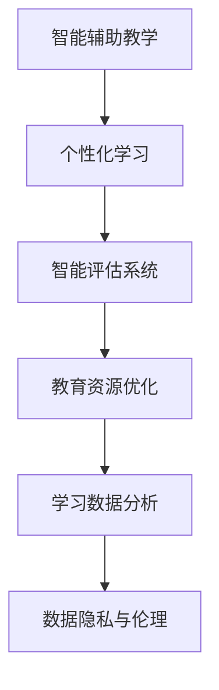

                 

# 人工智能时代的教育变革

## 1. 背景介绍

### 1.1 问题由来
随着人工智能技术的迅速发展，其对各行业的影响日益加深，教育领域也不例外。从智能辅助教学到个性化学习，再到智能评估系统，人工智能正在全面渗透到教育的各个环节，带来前所未有的变革。然而，技术带来的挑战和风险也引起了广泛关注。本文旨在全面探讨人工智能在教育中的应用，分析其优缺点及面临的挑战，为教育行业的健康发展提供参考。

### 1.2 问题核心关键点
人工智能在教育中的核心关键点主要包括以下几个方面：
1. **智能化教学**：利用人工智能技术，实现智能辅助教学、个性化学习等高效教学手段。
2. **评估系统**：开发智能评估系统，对学生学习效果进行实时监控和精准评估。
3. **教育资源**：利用AI技术，优化教育资源的分配和管理。
4. **学习数据**：通过大数据分析，优化学习路径和课程设计。
5. **伦理与隐私**：在应用AI技术时，确保数据隐私和伦理问题得到妥善处理。

### 1.3 问题研究意义
人工智能在教育中的应用具有重要意义：
1. **提升教育质量**：通过个性化学习和智能评估，提升教学质量和学生学习效果。
2. **优化教育资源分配**：合理分配教育资源，缩小城乡教育差距。
3. **推动教育公平**：通过在线教育等方式，为偏远地区学生提供优质教育资源。
4. **激发教育创新**：推动教育领域的科技创新和模式创新。

## 2. 核心概念与联系

### 2.1 核心概念概述

人工智能在教育中的应用主要包括以下几个核心概念：

- **智能辅助教学**：利用人工智能技术，如机器学习、自然语言处理等，辅助教师进行教学设计、课堂管理和学生评估。
- **个性化学习**：通过大数据分析和机器学习算法，根据学生学习情况和偏好，个性化推荐学习资源和路径。
- **智能评估系统**：利用机器学习算法，对学生学习效果进行实时监控和精准评估，提供个性化反馈和改进建议。
- **教育资源优化**：通过人工智能技术，优化教育资源的分配和管理，提高资源利用效率。
- **学习数据分析**：利用大数据分析技术，挖掘和分析学习数据，优化课程设计和教学策略。
- **数据隐私与伦理**：在应用人工智能技术时，确保学生数据隐私得到妥善处理，遵守相关法律法规。

### 2.2 核心概念原理和架构的 Mermaid 流程图



这个流程图展示了人工智能在教育中的应用框架，各概念间相互联系，共同推动教育变革。

## 3. 核心算法原理 & 具体操作步骤
### 3.1 算法原理概述

人工智能在教育中的应用主要基于机器学习算法，其核心原理包括：

- **监督学习**：利用带有标签的数据，训练模型进行预测和分类。
- **无监督学习**：通过分析未标记数据，发现数据的内在结构和规律。
- **半监督学习**：结合少量标记数据和大量未标记数据，提高模型性能。
- **强化学习**：通过试错过程，优化决策策略，提高智能系统的适应性和学习效率。

### 3.2 算法步骤详解

以下是人工智能在教育中具体应用的算法步骤：

1. **数据收集与预处理**：收集学生的学习数据，包括成绩、学习行为、课堂互动等，进行数据清洗和特征工程。
2. **模型训练与评估**：选择合适的机器学习算法，如决策树、支持向量机、深度神经网络等，进行模型训练，并使用交叉验证等方法评估模型性能。
3. **模型应用与优化**：将训练好的模型应用于教学和评估场景，根据反馈不断优化模型参数，提升模型效果。
4. **学习路径推荐**：根据学生学习情况，利用推荐算法（如协同过滤、矩阵分解等），生成个性化学习路径。
5. **智能评估与反馈**：通过机器学习算法，实时监控学生学习情况，提供精准的评估和改进建议。

### 3.3 算法优缺点

人工智能在教育中的算法具有以下优点：

- **高效性**：能够快速处理大量数据，实现实时监控和评估。
- **精准性**：通过精确的算法模型，提高评估和推荐的准确性。
- **个性化**：能够根据学生个体特点，提供个性化学习路径和反馈。
- **可扩展性**：算法模型易于扩展，适应不同规模的教育场景。

同时，也存在一些缺点：

- **数据依赖**：算法效果依赖于高质量的数据，数据偏差会影响模型性能。
- **模型复杂性**：部分算法模型复杂度高，需要较多的计算资源和专业知识。
- **隐私与安全**：处理学生数据时，需注意数据隐私和安全问题。
- **公平性**：算法可能存在偏见，导致教育不公平现象。

### 3.4 算法应用领域

人工智能在教育中的应用领域广泛，包括但不限于：

- **智能辅助教学**：如智能作业批改、课堂互动、学习进度跟踪等。
- **个性化学习**：如推荐系统、智能导学系统等。
- **智能评估系统**：如自适应测验、智能批改等。
- **教育资源管理**：如课程推荐、教师管理等。
- **学习数据分析**：如学习行为分析、学习效果预测等。
- **教育公平与普惠**：如在线教育、远程教育等。

## 4. 数学模型和公式 & 详细讲解

### 4.1 数学模型构建

在教育领域，常用的数学模型包括：

- **线性回归模型**：用于预测学生的成绩和学习行为。
- **决策树模型**：用于分类学生的学习状况和行为模式。
- **支持向量机模型**：用于识别学生的学习兴趣和偏好。
- **深度神经网络模型**：用于复杂的自然语言处理任务，如智能问答系统。

### 4.2 公式推导过程

以线性回归模型为例，其基本公式为：

$$
y = \theta_0 + \sum_{i=1}^n \theta_i x_i
$$

其中 $y$ 为预测值，$x_i$ 为输入特征，$\theta_0$ 和 $\theta_i$ 为模型参数。

通过最小化预测值与真实值之间的误差（如均方误差），可以求解模型参数。具体的推导过程如下：

$$
\min_{\theta_0,\theta_i} \sum_{i=1}^n (y_i - (\theta_0 + \sum_{i=1}^n \theta_i x_i))^2
$$

利用梯度下降算法，求解上述最小化问题，即可得到模型的最优参数。

### 4.3 案例分析与讲解

在实际应用中，线性回归模型常用于预测学生的考试成绩。以某次数学考试成绩为例，通过收集学生的学习时间、作业完成情况、课堂互动等数据，建立线性回归模型。通过模型训练和验证，可以发现哪些因素对学生成绩有显著影响，从而指导教学策略的调整。

## 5. 项目实践：代码实例和详细解释说明

### 5.1 开发环境搭建

在项目实践前，需要先搭建开发环境：

1. **Python环境**：安装Anaconda，创建虚拟环境，并激活虚拟环境。
2. **深度学习框架**：安装TensorFlow或PyTorch，并进行环境配置。
3. **机器学习库**：安装scikit-learn、numpy等常用机器学习库。
4. **数据集准备**：收集并清洗学生学习数据，分为训练集、验证集和测试集。

### 5.2 源代码详细实现

以线性回归模型为例，以下是Python代码实现：

```python
import numpy as np
from sklearn.linear_model import LinearRegression

# 准备数据
X = np.array([[1, 2, 3], [4, 5, 6], [7, 8, 9]])
y = np.array([5, 10, 15])

# 建立模型
model = LinearRegression()

# 训练模型
model.fit(X, y)

# 预测新数据
new_X = np.array([[10, 11, 12]])
print(model.predict(new_X))
```

### 5.3 代码解读与分析

上述代码中，我们首先准备了训练数据 `X` 和 `y`，然后实例化线性回归模型 `model`，并进行训练。最后使用模型对新数据进行预测，输出预测结果。

在实际应用中，模型的训练和验证过程需要更多代码实现，如交叉验证、模型评估等。

### 5.4 运行结果展示

通过上述代码，可以得到线性回归模型的预测结果。例如，当输入新数据 `[[10, 11, 12]]` 时，模型预测结果为 `[35.0]`，表示新数据对应的预测值。

## 6. 实际应用场景

### 6.1 智能辅助教学

智能辅助教学是人工智能在教育中应用最广泛的场景之一。通过智能辅助教学，教师可以更高效地进行课堂管理、作业批改和学生评估。例如，使用智能作业批改系统，可以自动批改学生作业，提供详细的评分和反馈。使用课堂互动系统，可以实时监控学生的课堂表现，进行个性化教学调整。

### 6.2 个性化学习

个性化学习是人工智能在教育中的另一重要应用场景。通过个性化学习，学生可以按需获取学习资源，提高学习效率。例如，使用推荐系统，根据学生的学习情况和偏好，推荐适合的学习资料和课程。使用智能导学系统，根据学生的学习进度和效果，自动调整学习内容和难度。

### 6.3 智能评估系统

智能评估系统是人工智能在教育中的核心应用之一。通过智能评估系统，教师可以更精准地评估学生的学习效果，提供个性化的反馈和改进建议。例如，使用自适应测验系统，根据学生的答题情况，自动调整题目难度和内容。使用智能批改系统，自动批改学生作业，提供详细的评分和反馈。

### 6.4 未来应用展望

未来，人工智能在教育中的应用将更加广泛和深入，具体展望如下：

1. **智能教学助手**：开发智能教学助手，辅助教师进行课堂管理和学生评估，提高教学效率。
2. **虚拟教师**：开发虚拟教师，提供全天候、个性化的教学服务，提高教育资源的可及性。
3. **自适应学习平台**：开发自适应学习平台，根据学生的学习情况，自动调整学习内容和难度。
4. **智能测评系统**：开发智能测评系统，利用大数据和机器学习技术，提供精准的评估和改进建议。
5. **教育资源共享**：开发教育资源共享平台，实现教育资源的在线共享和交流。

## 7. 工具和资源推荐

### 7.1 学习资源推荐

- **《机器学习》（周志华）**：详细介绍机器学习的基本概念、算法和应用，适合初学者学习。
- **《深度学习》（Ian Goodfellow）**：介绍深度学习的基本原理和算法，适合深入研究。
- **Coursera和edX在线课程**：提供丰富的机器学习和深度学习课程，涵盖基础知识和前沿技术。
- **Kaggle竞赛平台**：提供大量数据集和竞赛项目，适合实践和探索。

### 7.2 开发工具推荐

- **Python编程语言**：简单易学，广泛应用于机器学习和深度学习领域。
- **TensorFlow和PyTorch框架**：功能强大，支持各种深度学习算法和模型。
- **Jupyter Notebook**：交互式开发环境，适合快速原型开发和实验。
- **Weights & Biases**：模型训练实验跟踪工具，记录和可视化模型训练过程。
- **TensorBoard**：模型训练可视化工具，实时监控模型训练状态。

### 7.3 相关论文推荐

- **《深度学习在教育中的应用》**：介绍深度学习在教育中的基本概念和应用场景。
- **《机器学习辅助个性化教育》**：讨论机器学习在个性化教育中的应用。
- **《自适应学习系统的设计与实现》**：介绍自适应学习系统的设计和实现方法。
- **《人工智能在教育中的伦理与隐私保护》**：讨论人工智能在教育中的伦理与隐私问题。

## 8. 总结：未来发展趋势与挑战

### 8.1 研究成果总结

本文从背景、核心概念、算法原理、具体操作步骤、实际应用场景、工具和资源推荐等方面，全面探讨了人工智能在教育中的应用。具体研究成果如下：

1. **智能辅助教学**：通过智能系统辅助教师进行课堂管理和学生评估。
2. **个性化学习**：利用推荐系统提供个性化的学习资源和路径。
3. **智能评估系统**：利用机器学习技术进行精准评估和反馈。
4. **教育资源优化**：通过大数据分析优化教育资源分配和管理。
5. **学习数据分析**：利用数据分析技术优化课程设计和教学策略。
6. **数据隐私与伦理**：确保学生数据隐私和伦理问题得到妥善处理。

### 8.2 未来发展趋势

未来，人工智能在教育中的应用将呈现以下趋势：

1. **智能化程度提升**：通过更先进的技术，实现更高水平的智能化教学和个性化学习。
2. **数据应用深化**：利用更丰富的数据，提高评估和推荐系统的准确性和鲁棒性。
3. **多模态融合**：结合多种数据模态（如语音、图像等），实现更全面的教育服务。
4. **自适应系统普及**：开发更多自适应学习平台，满足不同学生的个性化需求。
5. **伦理与隐私保护**：加强对数据隐私和伦理问题的关注，确保技术应用的合法性和合规性。

### 8.3 面临的挑战

人工智能在教育中的应用面临以下挑战：

1. **数据质量问题**：高质量数据是算法效果的关键，但获取和清洗数据成本较高。
2. **算法复杂性**：部分算法模型复杂度高，需要较高的专业知识和计算资源。
3. **公平性问题**：算法可能存在偏见，导致教育不公平现象。
4. **伦理与隐私**：在应用数据时，需注意数据隐私和伦理问题。
5. **技术推广难度**：部分教师和学生对新技术的接受度较低。

### 8.4 研究展望

未来，需要在以下几个方面进行进一步的研究：

1. **高质量数据集构建**：开发更多高质量的教育数据集，推动算法模型的发展和应用。
2. **算法优化与改进**：研究和优化现有算法模型，提高算法的准确性和鲁棒性。
3. **伦理与隐私保护**：制定相关法规和标准，确保教育数据的安全和隐私。
4. **技术推广与普及**：加强技术推广和培训，提高教师和学生对新技术的接受度。

## 9. 附录：常见问题与解答

**Q1：人工智能在教育中应用的主要优势是什么？**

A: 人工智能在教育中的主要优势包括：

1. **高效性**：能够快速处理大量数据，实现实时监控和评估。
2. **精准性**：通过精确的算法模型，提高评估和推荐的准确性。
3. **个性化**：能够根据学生个体特点，提供个性化学习路径和反馈。
4. **可扩展性**：算法模型易于扩展，适应不同规模的教育场景。

**Q2：如何确保人工智能在教育中的数据隐私和安全？**

A: 确保人工智能在教育中的数据隐私和安全需要采取以下措施：

1. **数据匿名化**：对学生数据进行匿名化处理，保护学生隐私。
2. **访问控制**：设置严格的访问控制机制，确保数据只能被授权人员访问。
3. **加密技术**：使用加密技术保护数据传输和存储安全。
4. **合规性审查**：遵守相关法律法规，进行合规性审查。

**Q3：人工智能在教育中可能存在哪些伦理问题？**

A: 人工智能在教育中可能存在的伦理问题包括：

1. **算法偏见**：算法可能存在偏见，导致教育不公平现象。
2. **隐私泄露**：在处理学生数据时，可能存在隐私泄露的风险。
3. **过度依赖**：过度依赖人工智能可能导致教师和学生的教育技能退化。

**Q4：如何在教育中合理应用人工智能技术？**

A: 在教育中合理应用人工智能技术需要考虑以下因素：

1. **平衡技术与人文**：在应用技术时，应兼顾技术与人文关怀，确保教育的公平性和人性化。
2. **透明性与可解释性**：确保人工智能系统的决策过程透明可解释，便于教师和学生理解和接受。
3. **数据质量与隐私保护**：确保数据质量和隐私保护，避免数据滥用和隐私泄露。

---

作者：禅与计算机程序设计艺术 / Zen and the Art of Computer Programming

