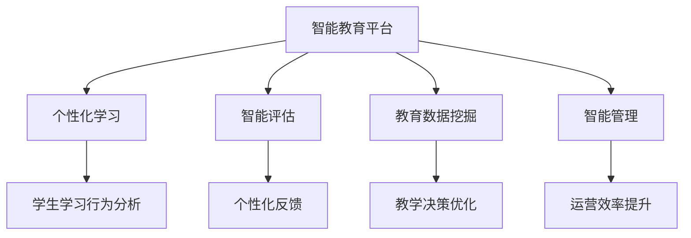

                 

# 人工智能：教育变革的催化剂

## 1. 背景介绍

### 1.1 问题由来
随着人工智能技术的快速发展，其在教育领域的应用引起了广泛关注。教育作为人类文明传承和进步的关键途径，其改革创新一直是各国政府和社会各界共同努力的方向。传统教育模式中，教师的“教”和学生的“学”之间存在明显的信息不对称，教师难以完全理解每个学生的学习需求和个体差异，导致教学效果参差不齐。同时，教育资源的分配不均衡，特别是优质教育资源在城乡、区域之间存在巨大差异，加剧了教育不公平。

人工智能的引入，为解决这些问题提供了新的可能性。通过人工智能，可以实现个性化教学、智能评估、自动化管理等功能，为教育创新提供了强大的技术支撑。本文将探讨人工智能在教育领域的变革潜力，及其在实际应用中的具体实现。

## 2. 核心概念与联系

### 2.1 核心概念概述
人工智能在教育中的应用涉及多个核心概念，包括智能教育平台、个性化学习、智能评估、教育数据挖掘、智能管理等。这些概念相互关联，共同构成了人工智能在教育中的整体应用框架。

- **智能教育平台**：基于人工智能技术的教育平台，能够实现智能推荐、智能排课、智能作业批改等功能，提高教学效率，改善学习体验。
- **个性化学习**：根据学生的学习行为、兴趣、能力等个性化特征，动态调整教学内容和难度，满足不同学生的学习需求。
- **智能评估**：通过人工智能技术，对学生的学习过程和结果进行智能化评估，提供个性化的学习反馈和建议。
- **教育数据挖掘**：利用数据挖掘技术，从海量教育数据中提取有价值的信息，支持教学决策和优化。
- **智能管理**：实现学校、教师、学生之间的智能化管理，提高学校运营效率，改善师生互动。

这些概念之间的逻辑关系可以通过以下Mermaid流程图来展示：



## 3. 核心算法原理 & 具体操作步骤

### 3.1 算法原理概述

人工智能在教育中的应用主要基于机器学习和深度学习的原理。具体而言，通过大量的教育数据，利用机器学习算法训练出能够识别和预测学生行为、学习状态和需求的模型，从而实现个性化教学、智能评估等功能。以下是几个核心算法原理的简要概述：

1. **推荐系统算法**：通过分析学生的学习历史和偏好，推荐适合的学习内容和资源，实现个性化学习路径。
2. **自然语言处理(NLP)**：利用NLP技术，对学生的作业、论文、讨论等文本数据进行自动评估和反馈，减轻教师负担。
3. **强化学习(Reinforcement Learning)**：通过不断试错和反馈，优化学习策略，适应学生个体差异，实现更高效的学习过程。
4. **知识图谱(Knowledge Graph)**：构建知识图谱，支持智能评估和个性化推荐，帮助学生更好地理解和掌握知识。

### 3.2 算法步骤详解

人工智能在教育中的具体应用步骤包括以下几个方面：

**Step 1: 数据收集与预处理**

- **数据来源**：收集学生的学习行为数据、成绩数据、作业数据、课堂互动数据等，构建教育数据仓库。
- **数据清洗**：处理缺失值、异常值，进行数据归一化处理，确保数据质量。
- **特征工程**：设计合适的特征，如学习时间、作业完成度、课堂参与度等，支持后续建模。

**Step 2: 模型训练与优化**

- **模型选择**：选择合适的机器学习或深度学习模型，如线性回归、决策树、随机森林、深度神经网络等。
- **模型训练**：利用收集到的数据训练模型，调整模型参数，提高模型预测准确率。
- **模型评估**：通过交叉验证等方法评估模型性能，选择合适的模型进行应用。

**Step 3: 应用部署与监控**

- **系统集成**：将训练好的模型集成到智能教育平台中，实现个性化推荐、智能评估等功能。
- **持续优化**：根据实际应用效果，定期更新和优化模型，确保系统持续改进。
- **性能监控**：实时监控系统运行状态，及时发现和解决异常问题，保障系统稳定。

### 3.3 算法优缺点

人工智能在教育中的应用具有以下优点：

1. **个性化学习**：能够根据学生的个性化需求提供量身定制的学习方案，提高学习效果。
2. **智能化评估**：利用智能化评估工具，提供及时的反馈和建议，帮助学生改进学习方法。
3. **教学效率提升**：通过自动化管理和推荐系统，减轻教师负担，提高教学效率。
4. **资源均衡分配**：通过数据分析和优化，合理分配教育资源，缩小城乡教育差距。

同时，也存在一些局限性：

1. **数据隐私问题**：学生的学习数据涉及隐私，需要严格的数据保护措施，确保数据安全。
2. **技术依赖问题**：人工智能系统依赖于高质量的数据和强大的计算资源，对技术和资金投入要求较高。
3. **算法公平性问题**：需要避免算法偏见，确保系统的公平性，避免对特定群体的歧视。
4. **教师角色转变**：教师需要适应新的教学模式，可能会面临技术使用上的挑战。

### 3.4 算法应用领域

人工智能在教育中的应用领域广泛，具体包括：

1. **智能推荐系统**：如智能教材推荐、智能课堂排课、智能作业推荐等，帮助学生制定高效的学习计划。
2. **智能评估系统**：如作业批改、论文评分、考试分析等，减轻教师负担，提高评估效率和准确性。
3. **个性化学习系统**：如个性化习题推荐、学习路径规划等，根据学生的学习情况动态调整学习内容。
4. **智能管理平台**：如学生考勤管理、课堂监控、课程安排等，提高学校运营效率和管理水平。

## 4. 数学模型和公式 & 详细讲解 & 举例说明

### 4.1 数学模型构建

在教育领域，常见的数学模型包括学生学习行为模型、智能推荐模型、智能评估模型等。以下以智能推荐系统为例，介绍数学模型的构建过程。

假设学生集合为 $S=\{s_1, s_2, ..., s_n\}$，课程集合为 $C=\{c_1, c_2, ..., c_m\}$。学生 $s_i$ 对课程 $c_j$ 的学习效果可以用评分 $r_{ij}$ 表示。目标是为每个学生 $s_i$ 推荐一套合适的课程集合 $C_i$，使得其总评分最大化。

**模型表示**：
$$
\max \sum_{i=1}^n \sum_{j=1}^m r_{ij} \mathbf{1}_{c_j \in C_i}
$$

其中 $\mathbf{1}_{c_j \in C_i}$ 表示课程 $c_j$ 是否包含在推荐课程集合 $C_i$ 中。

**优化目标**：
$$
\min \sum_{i=1}^n \sum_{j=1}^m r_{ij} (1 - \mathbf{1}_{c_j \in C_i})
$$

**约束条件**：
$$
\sum_{j=1}^m \mathbf{1}_{c_j \in C_i} = k_i \quad \text{(s_i 推荐k_i门课程)}
$$

### 4.2 公式推导过程

利用优化算法，如拉格朗日乘数法或梯度下降法，求解上述优化问题。首先定义拉格朗日乘子 $\lambda$，构造拉格朗日函数：
$$
\mathcal{L}(\lambda, C_i) = \sum_{i=1}^n \sum_{j=1}^m r_{ij} (1 - \mathbf{1}_{c_j \in C_i}) + \lambda \left( \sum_{j=1}^m \mathbf{1}_{c_j \in C_i} - k_i \right)
$$

对 $C_i$ 求导，得到：
$$
\frac{\partial \mathcal{L}}{\partial C_i} = -\sum_{j=1}^m r_{ij} \mathbf{1}_{c_j \in C_i} + \lambda
$$

令导数为0，解得：
$$
\mathbf{1}_{c_j \in C_i} = \frac{r_{ij}}{k_i} + \lambda
$$

代入约束条件，得：
$$
\sum_{j=1}^m \frac{r_{ij}}{k_i} + \lambda = 1
$$

解得：
$$
\lambda = 1 - \sum_{j=1}^m \frac{r_{ij}}{k_i}
$$

最终得到推荐的课程集合 $C_i$ 为：
$$
C_i = \{c_j | \frac{r_{ij}}{k_i} + \lambda > 0\}
$$

### 4.3 案例分析与讲解

假设某学生的学习数据如下表所示：

| 学生编号 | 课程编号 | 评分 |
|--------|--------|-----|
| s1     | c1     | 4   |
| s1     | c2     | 3   |
| s1     | c3     | 2   |
| s2     | c1     | 3   |
| s2     | c3     | 2   |
| s2     | c4     | 4   |

**学生s1推荐课程**：

- **评分矩阵**：
$$
R = \begin{bmatrix}
4 & 3 & 2 \\
3 & 0 & 2 \\
2 & 0 & 0
\end{bmatrix}
$$

- **约束条件**：
$$
\sum_{j=1}^3 \mathbf{1}_{c_j \in C_i} = 3
$$

- **拉格朗日乘子**：
$$
\lambda = 1 - \sum_{j=1}^3 \frac{R_{ij}}{3} = 1 - \frac{4+3+2}{3} = -1
$$

- **推荐结果**：
$$
C_1 = \{c_1, c_2\}
$$

**学生s2推荐课程**：

- **评分矩阵**：
$$
R = \begin{bmatrix}
3 & 0 & 2 \\
2 & 0 & 2 \\
0 & 4 & 0
\end{bmatrix}
$$

- **约束条件**：
$$
\sum_{j=1}^3 \mathbf{1}_{c_j \in C_i} = 3
$$

- **拉格朗日乘子**：
$$
\lambda = 1 - \sum_{j=1}^3 \frac{R_{ij}}{3} = 1 - \frac{3+0+2}{3} = 0
$$

- **推荐结果**：
$$
C_2 = \{c_1, c_3\}
$$

## 5. 项目实践：代码实例和详细解释说明

### 5.1 开发环境搭建

在进行人工智能在教育领域的应用实践前，需要先搭建好开发环境。以下是使用Python进行TensorFlow开发的Python环境配置流程：

1. 安装Anaconda：从官网下载并安装Anaconda，用于创建独立的Python环境。

2. 创建并激活虚拟环境：
```bash
conda create -n tf-env python=3.8 
conda activate tf-env
```

3. 安装TensorFlow：从官网获取对应的安装命令，例如：
```bash
conda install tensorflow -c conda-forge
```

4. 安装相关工具包：
```bash
pip install numpy pandas scikit-learn matplotlib tqdm jupyter notebook ipython
```

完成上述步骤后，即可在`tf-env`环境中开始应用实践。

### 5.2 源代码详细实现

下面我们以个性化推荐系统为例，给出使用TensorFlow实现的教育数据挖掘模型的Python代码实现。

首先，定义数据处理函数：

```python
import numpy as np
import pandas as pd

def preprocess_data(data_path):
    data = pd.read_csv(data_path)
    data['time'] = pd.to_datetime(data['time'])
    data['hour'] = data['time'].dt.hour
    data['minute'] = data['time'].dt.minute
    data['day'] = data['time'].dt.day
    data['month'] = data['time'].dt.month
    data['weekday'] = data['time'].dt.weekday
    data = data.drop(['time', 'minute'], axis=1)
    return data
```

然后，定义模型训练函数：

```python
import tensorflow as tf
from tensorflow.keras import layers

def build_model(input_shape, num_classes):
    model = tf.keras.Sequential([
        layers.Dense(64, activation='relu', input_shape=input_shape),
        layers.Dense(32, activation='relu'),
        layers.Dense(num_classes, activation='softmax')
    ])
    model.compile(optimizer='adam', loss='categorical_crossentropy', metrics=['accuracy'])
    return model

def train_model(model, X_train, y_train, X_valid, y_valid, epochs=10, batch_size=32):
    model.fit(X_train, y_train, epochs=epochs, batch_size=batch_size, validation_data=(X_valid, y_valid))
    return model
```

接着，加载数据和模型，训练模型：

```python
data = preprocess_data('data.csv')
X = data.drop(['label'], axis=1)
y = data['label']
X_train, X_valid, y_train, y_valid = train_test_split(X, y, test_size=0.2, random_state=42)

model = build_model(input_shape=(X_train.shape[1],), num_classes=3)
model = train_model(model, X_train, y_train, X_valid, y_valid)
```

最后，对测试集进行评估：

```python
X_test = preprocess_data('test.csv')
X_test = X_test.drop(['label'], axis=1)
y_test = X_test['label']
y_pred = model.predict(X_test)
print(classification_report(y_test, y_pred))
```

以上就是使用TensorFlow进行个性化推荐系统训练的完整代码实现。可以看到，TensorFlow提供了简单易用的API，使得模型构建和训练变得非常高效。

### 5.3 代码解读与分析

让我们再详细解读一下关键代码的实现细节：

**preprocess_data函数**：
- **数据处理**：将原始数据进行日期时间分割，提取出小时、分钟、日期、月份、星期等特征。
- **特征选择**：去除不相关的时间特征，保留能够反映学生学习行为的关键特征。

**build_model函数**：
- **模型定义**：构建一个简单的神经网络模型，包含两个隐藏层和一个输出层，使用ReLU激活函数和softmax输出层。
- **编译模型**：设置优化器、损失函数和评估指标。

**train_model函数**：
- **模型训练**：使用训练数据对模型进行训练，设置训练轮数和批大小，并在验证集上评估模型性能。

**测试集评估**：
- **模型预测**：对测试集数据进行预测，使用classification_report生成分类指标报告。

## 6. 实际应用场景

### 6.1 智能教育平台

智能教育平台是人工智能在教育领域最重要的应用场景之一。通过智能教育平台，可以实现个性化推荐、智能排课、智能作业批改等功能，提高教学效率和学习效果。

**个性化推荐**：平台可以根据学生的学习历史和偏好，推荐适合的学习资源和习题，帮助学生制定高效的学习计划。
**智能排课**：根据学生的出勤情况和课程需求，智能调整课程表，优化教室使用，提高教室利用率。
**智能作业批改**：利用自然语言处理技术，自动评估学生的作业和论文，提供个性化的反馈和建议，减轻教师负担。

### 6.2 智能评估系统

智能评估系统利用人工智能技术，对学生的学习过程和结果进行智能化评估，提供及时的反馈和建议，帮助学生改进学习方法。

**作业评估**：利用自然语言处理技术，自动批改学生的作业和论文，评估其语言表达能力和逻辑思维能力。
**考试评估**：利用计算机视觉技术，自动批改选择题、填空题等客观题，提高考试评分效率和准确性。
**学习行为分析**：通过分析学生的学习行为数据，如学习时间、作业完成度等，提供个性化的学习建议。

### 6.3 个性化学习系统

个性化学习系统根据学生的个性化需求，动态调整教学内容和难度，满足不同学生的学习需求。

**个性化习题推荐**：利用机器学习算法，根据学生的学习历史和表现，推荐适合的习题和知识模块。
**学习路径规划**：通过分析学生的学习进度和难点，推荐合适的学习路径，帮助学生系统地掌握知识。
**学习效果评估**：利用评估模型，实时监测学生的学习效果，及时调整学习策略。

### 6.4 未来应用展望

未来，人工智能在教育领域的应用将更加广泛和深入。以下是一些未来应用展望：

1. **AI教师**：利用自然语言处理和知识图谱技术，构建AI教师，能够自主进行教学、评估和管理，解决教师资源不足的问题。
2. **虚拟现实(VR)**：结合VR技术，创建虚拟课堂和实验室，提供沉浸式学习体验，增强学生的学习兴趣和效果。
3. **自适应学习**：利用强化学习技术，根据学生的学习行为和反馈，动态调整学习内容和难度，实现自适应学习。
4. **跨领域应用**：将人工智能技术应用于多个教育领域，如医学、艺术、体育等，拓展人工智能在教育中的应用范围。

## 7. 工具和资源推荐

### 7.1 学习资源推荐

为了帮助开发者系统掌握人工智能在教育领域的应用，这里推荐一些优质的学习资源：

1. 《机器学习在教育中的应用》系列博文：由机器学习专家撰写，介绍机器学习在教育中的多种应用，涵盖数据处理、模型构建、评估等关键环节。

2. CS221《机器学习》课程：斯坦福大学开设的机器学习课程，系统介绍机器学习的基本概念和算法，涵盖监督学习、非监督学习、强化学习等内容。

3. 《深度学习在教育中的应用》书籍：深度学习领域专家著作，详细讲解深度学习在教育中的实际应用案例，涵盖自然语言处理、计算机视觉等领域。

4. Udacity《人工智能教育》课程：Udacity平台提供的AI教育课程，涵盖人工智能在教育中的多种应用，包括智能推荐、智能评估、个性化学习等。

5. 《教育数据挖掘》书籍：教育数据挖掘领域专家著作，详细讲解教育数据挖掘的基本概念和应用，涵盖学生行为分析、智能评估、学习效果预测等内容。

通过对这些资源的学习实践，相信你一定能够快速掌握人工智能在教育领域的应用技巧，并用于解决实际的NLP问题。

### 7.2 开发工具推荐

高效的开发离不开优秀的工具支持。以下是几款用于人工智能在教育领域开发的工具：

1. TensorFlow：由Google主导开发的开源深度学习框架，生产部署方便，适合大规模工程应用。

2. PyTorch：基于Python的开源深度学习框架，灵活动态的计算图，适合快速迭代研究。

3. Weights & Biases：模型训练的实验跟踪工具，可以记录和可视化模型训练过程中的各项指标，方便对比和调优。

4. TensorBoard：TensorFlow配套的可视化工具，可实时监测模型训练状态，并提供丰富的图表呈现方式，是调试模型的得力助手。

5. Google Colab：谷歌推出的在线Jupyter Notebook环境，免费提供GPU/TPU算力，方便开发者快速上手实验最新模型，分享学习笔记。

合理利用这些工具，可以显著提升人工智能在教育领域的应用开发效率，加快创新迭代的步伐。

### 7.3 相关论文推荐

人工智能在教育领域的发展源于学界的持续研究。以下是几篇奠基性的相关论文，推荐阅读：

1. "Deep Learning in Education: A Survey"：论文综述了深度学习在教育中的多种应用，包括个性化推荐、智能评估、自适应学习等。

2. "Learning Analytics: Definitions, Perspectives, and Future Directions"：论文系统介绍学习分析的基本概念和应用，涵盖数据采集、数据分析、结果呈现等内容。

3. "A Survey on Learning Analytics: Approaches, Methods, and Tools"：论文总结了学习分析领域的研究进展，涵盖数据挖掘、自然语言处理、机器学习等多种技术。

4. "The Effectiveness of Machine Learning Approaches in Education: A Systematic Review"：论文系统评价了机器学习在教育中的应用效果，涵盖智能推荐、智能评估、个性化学习等多种应用。

5. "Towards Adaptive Learning via Machine Learning"：论文探讨了机器学习在自适应学习中的应用，提出多种基于机器学习的自适应学习模型。

这些论文代表了大语言模型微调技术的发展脉络。通过学习这些前沿成果，可以帮助研究者把握学科前进方向，激发更多的创新灵感。

## 8. 总结：未来发展趋势与挑战

### 8.1 总结

本文对人工智能在教育领域的应用进行了全面系统的介绍。首先阐述了人工智能在教育中的研究背景和意义，明确了其在个性化教学、智能评估、自动化管理等方面的重要价值。其次，从原理到实践，详细讲解了人工智能在教育中的数学模型构建和算法实现，提供了完整的代码实例。同时，本文还广泛探讨了人工智能在智能教育平台、智能评估系统、个性化学习系统等多个领域的应用前景，展示了其在教育创新中的巨大潜力。最后，本文精选了人工智能在教育领域的学习资源和开发工具，力求为读者提供全方位的技术指引。

通过本文的系统梳理，可以看到，人工智能在教育领域的应用前景广阔，其带来的个性化学习、智能评估、自动化管理等功能，正在逐步改变传统的教育模式。未来，随着技术的不断进步和应用实践的深入，人工智能必将在教育领域发挥更大的作用，推动教育事业的进步和人类文明的提升。

### 8.2 未来发展趋势

展望未来，人工智能在教育领域的应用将呈现以下几个发展趋势：

1. **个性化学习**：随着人工智能技术的发展，个性化学习将成为教育的核心。通过智能推荐和自适应学习，每个学生都能获得量身定制的学习计划和资源。

2. **智能化评估**：智能化评估系统将广泛应用，实时监测学生的学习过程和结果，提供个性化的反馈和建议，帮助学生改进学习方法。

3. **自动化管理**：教育管理将逐步智能化，实现学生考勤、课程排课、作业批改等自动化管理，提高学校运营效率和管理水平。

4. **跨领域应用**：人工智能技术将在教育领域与其他领域进行更深入的融合，如医学、艺术、体育等，拓展人工智能在教育中的应用范围。

5. **多模态学习**：结合视觉、听觉、触觉等多种感官信息，提供多模态的学习体验，增强学生的学习效果。

### 8.3 面临的挑战

尽管人工智能在教育领域的应用已经取得了显著进展，但在迈向更加智能化、普适化应用的过程中，仍然面临诸多挑战：

1. **数据隐私问题**：学生的学习数据涉及隐私，需要严格的数据保护措施，确保数据安全。

2. **技术依赖问题**：人工智能系统依赖于高质量的数据和强大的计算资源，对技术和资金投入要求较高。

3. **算法公平性问题**：需要避免算法偏见，确保系统的公平性，避免对特定群体的歧视。

4. **教师角色转变**：教师需要适应新的教学模式，可能会面临技术使用上的挑战。

5. **模型可解释性问题**：需要提高模型的可解释性，确保系统的透明性和可信度。

6. **教育资源不均问题**：需要解决教育资源的分布不均问题，确保每个学生都能获得公平的优质教育资源。

### 8.4 研究展望

面对人工智能在教育领域所面临的挑战，未来的研究需要在以下几个方面寻求新的突破：

1. **隐私保护**：研究数据隐私保护技术，确保学生学习数据的安全和隐私。

2. **多模态融合**：结合视觉、听觉、触觉等多种感官信息，实现多模态学习，增强学生的学习效果。

3. **公平性**：研究算法公平性技术，确保系统的公平性和透明性，避免对特定群体的歧视。

4. **自适应学习**：利用强化学习技术，实现自适应学习，提高学生的学习效果。

5. **跨领域应用**：将人工智能技术应用于多个教育领域，拓展人工智能在教育中的应用范围。

6. **教师辅助**：开发辅助教师的工具，帮助教师更好地进行教学和评估，减轻教师负担。

通过这些研究方向的探索，相信人工智能在教育领域的应用将更加深入和全面，为人类认知智能的进步做出更大贡献。

## 9. 附录：常见问题与解答

**Q1：如何有效地保护学生数据隐私？**

A: 保护学生数据隐私是人工智能在教育领域应用的重要前提。以下是一些常见的方法：

1. **数据匿名化**：通过数据匿名化技术，去除学生姓名、学号等敏感信息，确保数据无法反识别。

2. **差分隐私**：采用差分隐私技术，在数据处理和分析过程中加入随机噪声，保护个体隐私。

3. **访问控制**：设置严格的访问控制措施，确保只有授权人员才能访问学生数据。

4. **数据加密**：对学生数据进行加密处理，防止数据泄露。

5. **透明度和可控性**：提供数据使用透明性和可控性，让师生和家长了解数据的使用情况，确保数据的合理使用。

**Q2：如何避免算法的偏见问题？**

A: 避免算法的偏见是人工智能在教育领域应用的关键。以下是一些常见的方法：

1. **多样性数据集**：构建多样性的数据集，确保数据集能够覆盖不同的学生群体。

2. **公平性指标**：设定公平性指标，评估模型在不同群体中的表现，避免对特定群体的歧视。

3. **反偏见算法**：研究反偏见算法，修正模型中的偏见，确保模型的公平性。

4. **人工干预**：引入人工干预机制，及时发现和纠正模型的偏见。

5. **模型解释性**：提高模型的可解释性，便于理解和调整模型，减少偏见的发生。

**Q3：如何提高教师的接受度？**

A: 提高教师的接受度是人工智能在教育领域应用的重要保障。以下是一些常见的方法：

1. **培训和支持**：提供系统的培训和支持，帮助教师掌握人工智能技术的使用。

2. **交互平台**：开发易于使用的交互平台，方便教师操作和管理。

3. **反馈机制**：建立反馈机制，及时听取教师的意见和建议，不断改进系统。

4. **合作模式**：与教师合作，共同设计人工智能应用方案，确保方案的可行性和有效性。

5. **激励机制**：建立激励机制，鼓励教师积极参与人工智能应用。

通过这些方法的实施，相信教师将能够更好地适应新的教学模式，积极应用人工智能技术，提高教学效果。

**Q4：如何实现多模态学习？**

A: 实现多模态学习是人工智能在教育领域的重要方向。以下是一些常见的方法：

1. **多模态数据融合**：结合视觉、听觉、触觉等多种感官信息，提供多模态的学习体验。

2. **多模态模型**：开发多模态模型，支持多种感官数据的处理和分析。

3. **跨模态映射**：研究跨模态映射技术，实现不同模态数据之间的转换和融合。

4. **多模态评估**：结合多种感官数据，进行多模态评估，全面了解学生的学习状态。

5. **交互式学习**：开发交互式学习工具，支持多模态的学习和互动。

通过这些方法的实施，相信多模态学习将成为未来教育的重要趋势，增强学生的学习效果和兴趣。

---

作者：禅与计算机程序设计艺术 / Zen and the Art of Computer Programming

