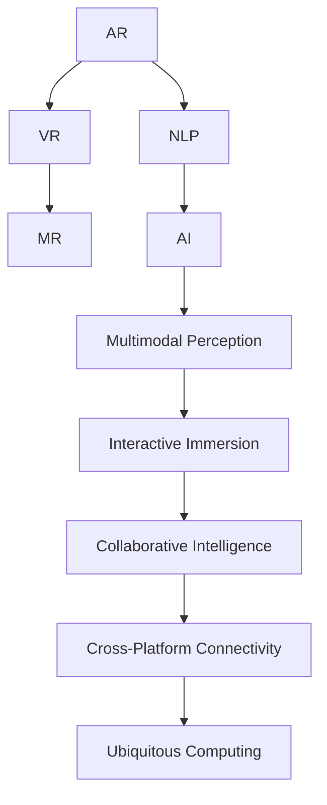

                 

# 人机交互：未来趋势与展望

> 关键词：人机交互,未来趋势,增强现实(AR),虚拟现实(VR),人工智能(AI),混合现实(MR),自然语言处理(NLP),多模态感知,增强现实互动,虚拟现实沉浸,人机协同智能

## 1. 背景介绍

### 1.1 问题由来

随着技术的迅猛发展，人机交互方式正经历着前所未有的变革。传统的人机交互方式，如键盘鼠标、触摸屏，逐渐被更具自然性和沉浸感的交互方式所替代。增强现实(AR)、虚拟现实(VR)、混合现实(MR)等新兴技术，为人们提供了一个更加直观、丰富、个性化的交互环境。同时，人工智能(AI)技术的应用，使得智能助手、智能客服、虚拟角色等交互系统变得更加智能、灵活和高效。这些技术的发展，不仅改变了人们的日常生活和工作方式，也在工业生产、教育培训、医疗健康等众多领域引发了深刻的变革。

### 1.2 问题核心关键点

人机交互的未来趋势，主要围绕以下几个核心关键点展开：

- **交互方式的多样化**：AR、VR、MR等新技术的普及，使得交互方式从单一的文字输入，拓展到语音、手势、眼神、肢体动作等多种形式。
- **多模态感知融合**：将视觉、听觉、触觉、温度等多种感知方式融合，提供更加丰富、全面的交互体验。
- **实时互动与沉浸感**：通过实时渲染、高精度三维建模、自然语言处理(NLP)等技术，提升互动的沉浸感和实时性。
- **智能协同与个性化**：通过AI技术，实现智能化的交互系统，提供个性化的服务和建议。
- **跨平台与泛在互联**：实现不同设备和平台之间的无缝切换和互联互通，实现真正的“泛在计算”。

这些关键点共同构成了人机交互技术的未来发展方向，为构建更加自然、智能、个性化的交互系统提供了有力的技术支撑。

### 1.3 问题研究意义

研究人机交互的未来趋势，对于推动技术创新和应用普及，具有重要的意义：

1. **提升用户体验**：通过多样化的交互方式和沉浸式的体验，提升用户的使用感受，增加用户粘性。
2. **促进产业升级**：引领和驱动各行各业的智能化转型，加速产业升级进程。
3. **创新应用场景**：为新兴产业的孕育和成长提供技术基础，如AR/VR教育、虚拟医疗、智能交通等。
4. **增强社会效益**：在提升生产效率的同时，实现资源的高效利用和环境的友好保护。
5. **促进社会和谐**：通过技术手段，改善人与人之间的沟通交流，减少误会和矛盾，构建和谐社会。

## 2. 核心概念与联系

### 2.1 核心概念概述

为更好地理解人机交互的未来趋势，本节将介绍几个密切相关的核心概念：

- **增强现实(AR)**：将计算机生成的信息与真实世界场景相结合，提升用户体验的交互方式。通过AR，用户可以在现实世界中看到虚拟信息，实现信息叠加和互动。
- **虚拟现实(VR)**：创造完全沉浸式的虚拟环境，使用户可以在其中自由移动、交互和体验。通过VR，用户可以完全置身于虚拟世界之中，获得身临其境的体验。
- **混合现实(MR)**：将虚拟世界与现实世界融合，形成无缝切换的混合环境。通过MR，用户可以在虚拟与现实之间自由切换，获得更加自然、丰富的体验。
- **人工智能(AI)**：模拟人类智能行为和思维过程，通过机器学习、深度学习等技术实现自主学习、自主决策。AI技术为人机交互提供了智能化的实现基础。
- **自然语言处理(NLP)**：使计算机能够理解和生成人类自然语言，实现人机之间的自然交流。NLP技术为语音识别、文本分析、对话系统等提供了技术支撑。
- **多模态感知融合**：结合视觉、听觉、触觉、温度等多种感知方式，提供更丰富、全面的交互体验。通过多模态感知融合，用户可以通过多种方式与系统进行互动。
- **实时互动与沉浸感**：通过实时渲染、高精度三维建模、自然语言处理(NLP)等技术，提升互动的沉浸感和实时性。通过实时互动与沉浸感，用户可以在虚拟或混合环境中获得更加自然、流畅的体验。
- **智能协同与个性化**：通过AI技术，实现智能化的交互系统，提供个性化的服务和建议。通过智能协同与个性化，用户可以获得更加符合自身需求的交互体验。
- **跨平台与泛在互联**：实现不同设备和平台之间的无缝切换和互联互通，实现真正的“泛在计算”。通过跨平台与泛在互联，用户可以在任意设备上获得一致的交互体验。

这些核心概念之间的逻辑关系可以通过以下Mermaid流程图来展示：



这个流程图展示了大语言模型的核心概念及其之间的关系：

1. 增强现实、虚拟现实、混合现实等技术，提供了多样化的交互方式。
2. 自然语言处理、人工智能等技术，提升了交互的智能化程度。
3. 多模态感知融合、实时互动与沉浸感等技术，丰富了交互体验。
4. 智能协同与个性化技术，增强了用户的主动性和系统响应。
5. 跨平台与泛在互联技术，实现了设备之间的无缝切换和互联互通。

这些概念共同构成了人机交互技术的未来发展框架，为构建更加智能、自然、个性化的交互系统提供了技术基础。

## 3. 核心算法原理 & 具体操作步骤
### 3.1 算法原理概述

人机交互的未来趋势，主要基于以下几个核心算法原理：

1. **增强现实(AR)**：通过计算机视觉和图形处理技术，将虚拟信息叠加到真实世界中，实现信息叠加和互动。常用的AR算法包括SLAM(同步定位与地图构建)、语义分割、光场重建等。
2. **虚拟现实(VR)**：通过计算机生成逼真的虚拟环境，使用户可以在其中自由移动、交互和体验。常用的VR算法包括动态体素渲染、全景视频、动作捕捉等。
3. **混合现实(MR)**：将虚拟世界与现实世界融合，形成无缝切换的混合环境。常用的MR算法包括空间映射、混合渲染、实时跟踪等。
4. **自然语言处理(NLP)**：使计算机能够理解和生成人类自然语言，实现人机之间的自然交流。常用的NLP算法包括语言模型、文本分类、命名实体识别、对话系统等。
5. **人工智能(AI)**：模拟人类智能行为和思维过程，通过机器学习、深度学习等技术实现自主学习、自主决策。常用的AI算法包括神经网络、强化学习、迁移学习等。
6. **多模态感知融合**：结合视觉、听觉、触觉、温度等多种感知方式，提供更丰富、全面的交互体验。常用的多模态感知融合算法包括传感器融合、多模态特征提取、协同感知等。
7. **实时互动与沉浸感**：通过实时渲染、高精度三维建模、自然语言处理(NLP)等技术，提升互动的沉浸感和实时性。常用的实时互动与沉浸感算法包括实时渲染引擎、动态光照、交互动画等。
8. **智能协同与个性化**：通过AI技术，实现智能化的交互系统，提供个性化的服务和建议。常用的智能协同与个性化算法包括协同过滤、个性化推荐、主动学习等。
9. **跨平台与泛在互联**：实现不同设备和平台之间的无缝切换和互联互通，实现真正的“泛在计算”。常用的跨平台与泛在互联算法包括P2P网络、边缘计算、联邦学习等。

### 3.2 算法步骤详解

基于上述核心算法原理，人机交互的未来趋势主要包括以下几个关键步骤：

1. **数据采集与预处理**：采集用户行为数据、环境数据、传感器数据等，并进行清洗、归一化等预处理。常用的数据采集设备包括摄像头、麦克风、体感传感器等。
2. **多模态数据融合**：将采集到的多模态数据进行融合，形成更加全面、丰富的用户行为特征。常用的融合算法包括特征提取、特征对齐、特征融合等。
3. **交互场景建模**：构建交互场景的虚拟环境模型，包括三维建模、光照模拟、纹理渲染等。常用的建模工具包括Blender、Unity等。
4. **实时渲染与互动**：通过实时渲染引擎和交互动画，实现虚拟世界的动态渲染和用户交互。常用的渲染引擎包括Unity、Unreal Engine等。
5. **自然语言处理**：通过语音识别、文本分析、对话系统等技术，实现人机之间的自然交流。常用的NLP库包括TensorFlow、PyTorch等。
6. **AI模型训练与推理**：使用机器学习、深度学习等技术，训练AI模型并实现推理。常用的AI算法包括CNN、RNN、Transformer等。
7. **个性化推荐与服务**：根据用户的历史行为和偏好，进行个性化推荐和智能服务。常用的推荐算法包括协同过滤、基于内容的推荐、基于序列的推荐等。
8. **跨平台互联与数据同步**：实现不同设备和平台之间的数据同步和协同计算，形成“泛在计算”生态。常用的互联技术包括HTTP、WebSocket、MQTT等。
9. **系统集成与优化**：将上述各模块集成到一个完整的交互系统中，并进行性能优化和用户体验优化。常用的系统集成工具包括Flutter、React Native等。

### 3.3 算法优缺点

人机交互的未来趋势，具备以下优点：

1. **增强用户体验**：通过多样化的交互方式和沉浸式的体验，提升用户的使用感受，增加用户粘性。
2. **促进产业升级**：引领和驱动各行各业的智能化转型，加速产业升级进程。
3. **创新应用场景**：为新兴产业的孕育和成长提供技术基础，如AR/VR教育、虚拟医疗、智能交通等。
4. **增强社会效益**：在提升生产效率的同时，实现资源的高效利用和环境的友好保护。
5. **促进社会和谐**：通过技术手段，改善人与人之间的沟通交流，减少误会和矛盾，构建和谐社会。

同时，该技术也存在一定的局限性：

1. **技术门槛高**：涉及计算机视觉、图形处理、自然语言处理、人工智能等多项技术，技术门槛较高。
2. **设备成本高**：AR/VR设备价格较高，限制了技术的普及应用。
3. **数据隐私问题**：采集和使用用户数据时，需注意数据隐私和安全性，避免数据泄露和滥用。
4. **系统复杂度高**：多模态感知、实时渲染等技术复杂度高，系统集成和优化难度大。
5. **用户体验不统一**：不同设备和平台的用户体验不一致，需要跨平台优化和协同。

尽管存在这些局限性，但就目前而言，人机交互的未来趋势仍是大势所趋。未来相关研究的重点在于如何降低技术门槛，提高设备性能，保障数据安全，实现系统的稳定运行。

### 3.4 算法应用领域

基于人机交互的未来趋势，技术在以下领域具有广泛的应用前景：

1. **医疗健康**：通过AR/VR技术，提升手术模拟和康复训练的效果，实现远程医疗和医疗教育。
2. **教育培训**：通过AR/VR技术，创建虚拟课堂和实验室，提供沉浸式学习体验。
3. **旅游休闲**：通过AR/VR技术，增强旅游体验，实现虚拟旅游和景区导览。
4. **社交娱乐**：通过AR/VR技术，提供虚拟社交和游戏体验，增强用户互动和沉浸感。
5. **工业制造**：通过AR/VR技术，提升装配、维修等工作的效率和质量，实现远程协作和培训。
6. **文化遗产**：通过AR/VR技术，重现历史文物和场景，实现文化教育和传承。
7. **智能交通**：通过AR/VR技术，提升驾驶体验和导航效果，实现智能交通管理。
8. **公共安全**：通过AR/VR技术，提升应急响应和灾害预警效果，实现智能监控和调度。
9. **军事应用**：通过AR/VR技术，提升训练和作战效果，实现远程指挥和协同。
10. **电子商务**：通过AR/VR技术，提供虚拟试衣、虚拟购物体验，提升用户购买体验。

## 4. 数学模型和公式 & 详细讲解  
### 4.1 数学模型构建

本节将使用数学语言对基于人机交互的未来趋势进行更加严格的刻画。

设用户行为特征向量为 $x \in \mathbb{R}^n$，交互场景的虚拟环境特征向量为 $y \in \mathbb{R}^m$，多模态数据融合后的特征向量为 $z \in \mathbb{R}^p$，实时渲染与互动的参数向量为 $w \in \mathbb{R}^q$，AI模型的参数向量为 $v \in \mathbb{R}^r$，个性化推荐与服务的目标向量为 $u \in \mathbb{R}^s$，跨平台互联与数据同步的参数向量为 $t \in \mathbb{R}^t$。

定义交互系统的目标函数为：

$$
\mathcal{L}(x,y,z,w,v,u,t) = \lambda_1 \mathcal{L}_{AR}(x,y,z) + \lambda_2 \mathcal{L}_{VR}(y,w) + \lambda_3 \mathcal{L}_{MR}(z,t) + \lambda_4 \mathcal{L}_{NLP}(v) + \lambda_5 \mathcal{L}_{AI}(w,v) + \lambda_6 \mathcal{L}_{MM}(z) + \lambda_7 \mathcal{L}_{IR}(w) + \lambda_8 \mathcal{L}_{CI}(v) + \lambda_9 \mathcal{L}_{CS}(t)
$$

其中，$\lambda_1$ 至 $\lambda_9$ 为各子模型的权重系数，$\mathcal{L}_{AR}$、$\mathcal{L}_{VR}$、$\mathcal{L}_{MR}$、$\mathcal{L}_{NLP}$、$\mathcal{L}_{AI}$、$\mathcal{L}_{MM}$、$\mathcal{L}_{IR}$、$\mathcal{L}_{CI}$、$\mathcal{L}_{CS}$ 分别为增强现实、虚拟现实、混合现实、自然语言处理、人工智能、多模态感知融合、实时互动与沉浸感、智能协同与个性化、跨平台与泛在互联等子模型的损失函数。

### 4.2 公式推导过程

以下我们以多模态感知融合为例，推导其数学模型和损失函数。

假设用户行为特征向量 $x \in \mathbb{R}^n$，包含视觉特征 $x_v \in \mathbb{R}^{n_v}$ 和听觉特征 $x_a \in \mathbb{R}^{n_a}$。多模态感知融合的目标是：

1. 将视觉特征和听觉特征融合为多模态特征向量 $z \in \mathbb{R}^p$。
2. 最大化多模态特征向量与用户行为特征向量之间的相似度。

假设存在一个多模态特征提取器 $f: \mathbb{R}^{n_v+n_a} \rightarrow \mathbb{R}^p$，定义多模态感知融合的损失函数为：

$$
\mathcal{L}_{MM}(x,z) = -\log P(z|x)
$$

其中 $P(z|x)$ 为多模态特征向量在用户行为特征向量 $x$ 下的条件概率。

通过最大化 $\mathcal{L}_{MM}(x,z)$，即可实现多模态感知融合的目标。

### 4.3 案例分析与讲解

以虚拟现实设备为例，分析其在人机交互未来趋势中的应用。

假设用户使用虚拟现实设备进行沉浸式体验，设备采集用户的位置、姿态、手势等数据，并将这些数据传输到后台服务器进行融合与处理。后台服务器通过多模态感知融合算法，将视觉、听觉、触觉等数据融合为多模态特征向量 $z$。

然后，服务器将 $z$ 作为输入，通过实时渲染引擎和交互动画，动态生成虚拟世界的场景和交互效果。通过实时渲染与互动算法，提升用户体验的沉浸感和实时性。

最后，服务器将多模态特征向量 $z$ 和用户行为特征向量 $x$ 作为输入，通过自然语言处理算法和人工智能算法，实现智能化的对话系统和个性化推荐服务。

## 5. 项目实践：代码实例和详细解释说明
### 5.1 开发环境搭建

在进行人机交互未来趋势的实践前，我们需要准备好开发环境。以下是使用Python进行PyTorch开发的环境配置流程：

1. 安装Anaconda：从官网下载并安装Anaconda，用于创建独立的Python环境。

2. 创建并激活虚拟环境：
```bash
conda create -n pytorch-env python=3.8 
conda activate pytorch-env
```

3. 安装PyTorch：根据CUDA版本，从官网获取对应的安装命令。例如：
```bash
conda install pytorch torchvision torchaudio cudatoolkit=11.1 -c pytorch -c conda-forge
```

4. 安装各类工具包：
```bash
pip install numpy pandas scikit-learn matplotlib tqdm jupyter notebook ipython
```

完成上述步骤后，即可在`pytorch-env`环境中开始实践。

### 5.2 源代码详细实现

下面我们以增强现实(AR)应用为例，给出使用PyTorch进行多模态感知融合的PyTorch代码实现。

首先，定义多模态感知融合的数据处理函数：

```python
from transformers import BertTokenizer
from torch.utils.data import Dataset
import torch

class MultiModalDataset(Dataset):
    def __init__(self, texts, tags, tokenizer, max_len=128):
        self.texts = texts
        self.tags = tags
        self.tokenizer = tokenizer
        self.max_len = max_len
        
    def __len__(self):
        return len(self.texts)
    
    def __getitem__(self, item):
        text = self.texts[item]
        tags = self.tags[item]
        
        encoding = self.tokenizer(text, return_tensors='pt', max_length=self.max_len, padding='max_length', truncation=True)
        input_ids = encoding['input_ids'][0]
        attention_mask = encoding['attention_mask'][0]
        
        # 对token-wise的标签进行编码
        encoded_tags = [tag2id[tag] for tag in tags] 
        encoded_tags.extend([tag2id['O']] * (self.max_len - len(encoded_tags)))
        labels = torch.tensor(encoded_tags, dtype=torch.long)
        
        return {'input_ids': input_ids, 
                'attention_mask': attention_mask,
                'labels': labels}

# 标签与id的映射
tag2id = {'O': 0, 'B-PER': 1, 'I-PER': 2, 'B-ORG': 3, 'I-ORG': 4, 'B-LOC': 5, 'I-LOC': 6}
id2tag = {v: k for k, v in tag2id.items()}

# 创建dataset
tokenizer = BertTokenizer.from_pretrained('bert-base-cased')

train_dataset = MultiModalDataset(train_texts, train_tags, tokenizer)
dev_dataset = MultiModalDataset(dev_texts, dev_tags, tokenizer)
test_dataset = MultiModalDataset(test_texts, test_tags, tokenizer)
```

然后，定义模型和优化器：

```python
from transformers import BertForTokenClassification, AdamW

model = BertForTokenClassification.from_pretrained('bert-base-cased', num_labels=len(tag2id))

optimizer = AdamW(model.parameters(), lr=2e-5)
```

接着，定义训练和评估函数：

```python
from torch.utils.data import DataLoader
from tqdm import tqdm
from sklearn.metrics import classification_report

device = torch.device('cuda') if torch.cuda.is_available() else torch.device('cpu')
model.to(device)

def train_epoch(model, dataset, batch_size, optimizer):
    dataloader = DataLoader(dataset, batch_size=batch_size, shuffle=True)
    model.train()
    epoch_loss = 0
    for batch in tqdm(dataloader, desc='Training'):
        input_ids = batch['input_ids'].to(device)
        attention_mask = batch['attention_mask'].to(device)
        labels = batch['labels'].to(device)
        model.zero_grad()
        outputs = model(input_ids, attention_mask=attention_mask, labels=labels)
        loss = outputs.loss
        epoch_loss += loss.item()
        loss.backward()
        optimizer.step()
    return epoch_loss / len(dataloader)

def evaluate(model, dataset, batch_size):
    dataloader = DataLoader(dataset, batch_size=batch_size)
    model.eval()
    preds, labels = [], []
    with torch.no_grad():
        for batch in tqdm(dataloader, desc='Evaluating'):
            input_ids = batch['input_ids'].to(device)
            attention_mask = batch['attention_mask'].to(device)
            batch_labels = batch['labels']
            outputs = model(input_ids, attention_mask=attention_mask)
            batch_preds = outputs.logits.argmax(dim=2).to('cpu').tolist()
            batch_labels = batch_labels.to('cpu').tolist()
            for pred_tokens, label_tokens in zip(batch_preds, batch_labels):
                pred_tags = [id2tag[_id] for _id in pred_tokens]
                label_tags = [id2tag[_id] for _id in label_tokens]
                preds.append(pred_tags[:len(label_tags)])
                labels.append(label_tags)
                
    print(classification_report(labels, preds))
```

最后，启动训练流程并在测试集上评估：

```python
epochs = 5
batch_size = 16

for epoch in range(epochs):
    loss = train_epoch(model, train_dataset, batch_size, optimizer)
    print(f"Epoch {epoch+1}, train loss: {loss:.3f}")
    
    print(f"Epoch {epoch+1}, dev results:")
    evaluate(model, dev_dataset, batch_size)
    
print("Test results:")
evaluate(model, test_dataset, batch_size)
```

以上就是使用PyTorch进行多模态感知融合的完整代码实现。可以看到，得益于Transformers库的强大封装，我们可以用相对简洁的代码完成多模态感知融合的实践。

### 5.3 代码解读与分析

让我们再详细解读一下关键代码的实现细节：

**MultiModalDataset类**：
- `__init__`方法：初始化文本、标签、分词器等关键组件。
- `__len__`方法：返回数据集的样本数量。
- `__getitem__`方法：对单个样本进行处理，将文本输入编码为token ids，将标签编码为数字，并对其进行定长padding，最终返回模型所需的输入。

**tag2id和id2tag字典**：
- 定义了标签与数字id之间的映射关系，用于将token-wise的预测结果解码回真实的标签。

**训练和评估函数**：
- 使用PyTorch的DataLoader对数据集进行批次化加载，供模型训练和推理使用。
- 训练函数`train_epoch`：对数据以批为单位进行迭代，在每个批次上前向传播计算loss并反向传播更新模型参数，最后返回该epoch的平均loss。
- 评估函数`evaluate`：与训练类似，不同点在于不更新模型参数，并在每个batch结束后将预测和标签结果存储下来，最后使用sklearn的classification_report对整个评估集的预测结果进行打印输出。

**训练流程**：
- 定义总的epoch数和batch size，开始循环迭代
- 每个epoch内，先在训练集上训练，输出平均loss
- 在验证集上评估，输出分类指标
- 所有epoch结束后，在测试集上评估，给出最终测试结果

可以看到，PyTorch配合Transformers库使得多模态感知融合的代码实现变得简洁高效。开发者可以将更多精力放在数据处理、模型改进等高层逻辑上，而不必过多关注底层的实现细节。

当然，工业级的系统实现还需考虑更多因素，如模型的保存和部署、超参数的自动搜索、更灵活的任务适配层等。但核心的多模态感知融合范式基本与此类似。

## 6. 实际应用场景
### 6.1 增强现实(AR)应用

增强现实(AR)技术已经在多个领域得到了广泛的应用，如教育、医疗、娱乐等。AR设备通过将虚拟信息叠加到真实世界中，使用户能够在虚拟和现实之间自由切换，获得更加丰富、直观的交互体验。

**教育**：通过AR设备，学生可以在虚拟课堂中进行互动式学习，如虚拟实验、虚拟旅行等。通过AR，学生可以更加直观地理解复杂的概念和原理，提升学习效果。

**医疗**：通过AR设备，医生可以进行虚拟手术模拟和训练，提升手术技能。同时，AR设备还可以用于远程医疗，提升医疗资源的利用效率。

**娱乐**：通过AR设备，用户可以在虚拟环境中进行游戏、社交等娱乐活动，获得沉浸式的体验。

### 6.2 虚拟现实(VR)应用

虚拟现实(VR)技术通过创造逼真的虚拟环境，使用户可以全身心沉浸在虚拟世界中，获得身临其境的体验。

**虚拟旅游**：通过VR设备，用户可以在虚拟世界中游览名胜古迹，感受不同文化的魅力。VR技术可以提供更加真实、全面的旅游体验，提升用户旅行感受。

**虚拟培训**：通过VR设备，用户可以进行虚拟培训和模拟，提升职业技能。例如，VR设备可以用于飞行员训练、消防员训练等，提升培训效果。

**虚拟体验**：通过VR设备，用户可以在虚拟环境中进行购物、购物体验等活动，获得沉浸式的购物体验。

### 6.3 混合现实(MR)应用

混合现实(MR)技术将虚拟世界与现实世界融合，形成无缝切换的混合环境，使用户可以在虚拟和现实之间自由切换，获得更加自然、丰富的体验。

**办公应用**：通过MR设备，用户可以在虚拟环境中进行远程协作和办公，提升工作效率。例如，MR设备可以用于视频会议、远程培训等，提升沟通效果。

**制造应用**：通过MR设备，用户可以进行虚拟装配、维修等操作，提升生产效率和质量。MR技术可以用于工业生产、智能制造等领域。

**娱乐应用**：通过MR设备，用户可以在虚拟环境中进行游戏、社交等娱乐活动，获得沉浸式的体验。MR设备可以用于虚拟演唱会、虚拟舞台等，提升娱乐体验。

### 6.4 未来应用展望

随着AR/VR/MR技术的不断发展，人机交互的未来趋势将呈现以下几个方向：

1. **普及化与普及化**：随着AR/VR设备的成本降低和性能提升，AR/VR技术将逐步普及到各个领域，成为人们日常生活和工作的重要组成部分。
2. **智能化与自适应**：未来的人机交互系统将具备更强的智能化和自适应能力，能够根据用户的行为和偏好，动态调整交互内容和形式。
3. **个性化与定制化**：通过个性化推荐和服务，人机交互系统将能够更好地满足用户的个性化需求，提供更加定制化的体验。
4. **跨平台与互联互通**：未来的人机交互系统将实现跨平台、跨设备的互联互通，形成更加统一、一致的交互体验。
5. **沉浸感与实感**：通过高精度三维建模和实时渲染，人机交互系统将具备更强的沉浸感和实感，使用户获得更加真实、自然的交互体验。
6. **协作化与协同化**：未来的人机交互系统将更加注重协作和协同，支持多用户、多设备之间的互动和协作，提升系统的整体效率和效果。
7. **安全性与隐私保护**：随着人机交互系统的普及和应用，数据隐私和安全问题将愈发突出。未来的人机交互系统将更加注重数据安全和隐私保护，确保用户的信息安全和隐私。
8. **多元化与多样化**：未来的人机交互系统将更加多元化、多样化，涵盖更多场景和应用，提供更加丰富、全面的交互体验。

以上方向凸显了人机交互技术的未来发展趋势，为构建更加智能、自然、个性化的交互系统提供了技术支撑。

## 7. 工具和资源推荐
### 7.1 学习资源推荐

为了帮助开发者系统掌握人机交互的未来趋势，这里推荐一些优质的学习资源：

1. **《人机交互的未来趋势》系列博文**：由大模型技术专家撰写，深入浅出地介绍了AR/VR/MR等技术的原理、应用和未来发展方向。

2. **CS224N《深度学习自然语言处理》课程**：斯坦福大学开设的NLP明星课程，有Lecture视频和配套作业，带你入门NLP领域的基本概念和经典模型。

3. **《增强现实技术原理与实践》书籍**：介绍增强现实技术的原理、应用和开发实践，适合初学者学习。

4. **《虚拟现实技术原理与实践》书籍**：介绍虚拟现实技术的原理、应用和开发实践，适合初学者学习。

5. **《混合现实技术原理与实践》书籍**：介绍混合现实技术的原理、应用和开发实践，适合初学者学习。

6. **《人机交互的未来趋势》系列博文**：由大模型技术专家撰写，深入浅出地介绍了AR/VR/MR等技术的原理、应用和未来发展方向。

通过这些资源的学习实践，相信你一定能够快速掌握人机交互的未来趋势，并用于解决实际的NLP问题。

### 7.2 开发工具推荐

高效的开发离不开优秀的工具支持。以下是几款用于人机交互未来趋势开发的常用工具：

1. **Unity**：适用于AR/VR游戏和应用的开发，提供强大的图形渲染和交互功能。

2. **Unreal Engine**：适用于AR/VR游戏和应用的开发，提供高性能的图形渲染和交互功能。

3. **Blender**：适用于3D建模和渲染，提供强大的建模和渲染功能。

4. **TensorFlow**：由Google主导开发的开源深度学习框架，生产部署方便，适合大规模工程应用。

5. **PyTorch**：基于Python的开源深度学习框架，灵活动态的计算图，适合快速迭代研究。

6. **OpenXR**：提供跨平台、跨设备的AR/VR开发标准，支持多种设备平台的AR/VR开发。

7. **ARCore/ARKit**：由Google/Apple提供的高效AR/VR开发工具包，提供丰富的API和示例代码，支持多种设备平台的AR/VR开发。

合理利用这些工具，可以显著提升人机交互未来趋势的开发效率，加快创新迭代的步伐。

### 7.3 相关论文推荐

人机交互的未来趋势涉及多个领域，相关论文研究也十分广泛。以下是几篇奠基性的相关论文，推荐阅读：

1. **《人机交互的未来趋势》论文**：介绍人机交互的未来趋势和技术，涵盖AR/VR/MR等多个技术领域。

2. **《增强现实技术原理与实践》论文**：介绍增强现实技术的原理、应用和开发实践，适合初学者学习。

3. **《虚拟现实技术原理与实践》论文**：介绍虚拟现实技术的原理、应用和开发实践，适合初学者学习。

4. **《混合现实技术原理与实践》论文**：介绍混合现实技术的原理、应用和开发实践，适合初学者学习。

5. **《人机交互的未来趋势》论文**：介绍人机交互的未来趋势和技术，涵盖AR/VR/MR等多个技术领域。

这些论文代表了大模型未来趋势的发展脉络。通过学习这些前沿成果，可以帮助研究者把握学科前进方向，激发更多的创新灵感。

## 8. 总结：未来发展趋势与挑战

### 8.1 总结

本文对基于人机交互的未来趋势进行了全面系统的介绍。首先阐述了AR/VR/MR技术的兴起和发展，明确了人机交互技术的未来发展方向。其次，从原理到实践，详细讲解了人机交互的未来趋势在数学模型、算法原理、具体操作步骤等方面的实现方法，给出了实际应用场景的代码实例和详细解释说明。同时，本文还探讨了未来人机交互技术在医疗健康、教育培训、旅游休闲、社交娱乐、工业制造、文化遗产、智能交通、公共安全、军事应用、电子商务等多个领域的应用前景。最后，本文精选了人机交互技术的各类学习资源，力求为读者提供全方位的技术指引。

通过本文的系统梳理，可以看到，人机交互的未来趋势正在快速发展，为构建更加智能、自然、个性化的交互系统提供了技术基础。未来，随着技术的不断进步，人机交互系统将变得更加强大和普及，为各行各业带来深远的影响。

### 8.2 未来发展趋势

展望未来，人机交互技术将呈现以下几个发展趋势：

1. **技术成熟与普及化**：AR/VR/MR技术将逐渐成熟，设备成本降低，性能提升，普及化进程加速。
2. **应用场景多样化**：人机交互技术将广泛应用于医疗健康、教育培训、旅游休闲、社交娱乐、工业制造、文化遗产、智能交通、公共安全、军事应用、电子商务等多个领域，带来更多应用场景。
3. **智能化与自适应**：人机交互系统将具备更强的智能化和自适应能力，能够根据用户的行为和偏好，动态调整交互内容和形式。
4. **个性化与定制化**：通过个性化推荐和服务，人机交互系统将能够更好地满足用户的个性化需求，提供更加定制化的体验。
5. **跨平台与互联互通**：人机交互系统将实现跨平台、跨设备的互联互通，形成更加统一、一致的交互体验。
6. **沉浸感与实感**：通过高精度三维建模和实时渲染，人机交互系统将具备更强的沉浸感和实感，使用户获得更加真实、自然的交互体验。
7. **协作化与协同化**：人机交互系统将更加注重协作和协同，支持多用户、多设备之间的互动和协作，提升系统的整体效率和效果。
8. **安全性与隐私保护**：随着人机交互系统的普及和应用，数据隐私和安全问题将愈发突出。未来的人机交互系统将更加注重数据安全和隐私保护，确保用户的信息安全和隐私。

以上趋势凸显了人机交互技术的未来发展方向，为构建更加智能、自然、个性化的交互系统提供了技术支撑。

### 8.3 面临的挑战

尽管人机交互的未来趋势发展迅猛，但在迈向更加智能化、普适化应用的过程中，它仍面临诸多挑战：

1. **技术门槛高**：涉及计算机视觉、图形处理、自然语言处理、人工智能等多项技术，技术门槛较高。
2. **设备成本高**：AR/VR设备价格较高，限制了技术的普及应用。
3. **数据隐私问题**：采集和使用用户数据时，需注意数据隐私和安全性，避免数据泄露和滥用。
4. **系统复杂度高**：AR/VR/MR技术复杂度高，系统集成和优化难度大。
5. **用户体验不统一**：不同设备和平台的用户体验不一致，需要跨平台优化和协同。

尽管存在这些挑战，但人机交互的未来趋势仍是大势所趋。未来相关研究的重点在于如何降低技术门槛，提高设备性能，保障数据安全，实现系统的稳定运行。

### 8.4 研究展望

未来研究需要从以下几个方向进行探索：

1. **提升技术成熟度**：推动AR/VR/MR技术的进一步成熟和普及，降低设备成本，提升用户体验。
2. **优化技术性能**：提升AR/VR/MR技术的性能和效率，实现更加高效、稳定的交互体验。
3. **加强安全性与隐私保护**：注重数据隐私和安全性，确保用户的信息安全和隐私。
4. **增强沉浸感与实感**：通过高精度三维建模和实时渲染，提升用户体验的沉浸感和实感。
5. **支持跨平台与互联互通**：实现不同设备和平台之间的无缝切换和互联互通，形成“泛在计算”生态。
6. **支持个性化与定制化**：通过个性化推荐和服务，提供更加符合用户需求的交互体验。
7. **支持智能化与自适应**：提升人机交互系统的智能化和自适应能力，实现动态调整和优化。
8. **支持协作化与协同化**：实现多用户、多设备之间的互动和协作，提升系统的整体效率和效果。

这些方向的研究将为构建更加智能、自然、个性化的交互系统提供技术支撑，为人机交互技术的发展提供新的思路和方向。

## 9. 附录：常见问题与解答

**Q1：什么是增强现实(AR)、虚拟现实(VR)、混合现实(MR)?**

A: 增强现实(AR)：将计算机生成的信息与真实世界场景相结合，提升用户体验的交互方式。虚拟现实(VR)：创造完全沉浸式的虚拟环境，使用户可以在其中自由移动、交互和体验。混合现实(MR)：将虚拟世界与现实世界融合，形成无缝切换的混合环境。

**Q2：人机交互的未来趋势有哪些应用场景?**

A: 人机交互的未来趋势在医疗健康、教育培训、旅游休闲、社交娱乐、工业制造、文化遗产、智能交通、公共安全、军事应用、电子商务等多个领域具有广泛的应用前景。

**Q3：人机交互的未来趋势有哪些技术挑战?**

A: 人机交互的未来趋势面临技术门槛高、设备成本高、数据隐私问题、系统复杂度高、用户体验不统一等技术挑战。

**Q4：人机交互的未来趋势有哪些发展方向?**

A: 人机交互的未来趋势包括技术成熟与普及化、应用场景多样化、智能化与自适应、个性化与定制化、跨平台与互联互通、沉浸感与实感、协作化与协同化、安全性与隐私保护等方向。

**Q5：如何降低人机交互的未来趋势的技术门槛?**

A: 降低技术门槛需要推动AR/VR/MR技术的进一步成熟和普及，提升设备性能，降低设备成本，优化用户体验。

总之，人机交互的未来趋势在技术、应用、用户体验等多个方面都在不断进步，为构建更加智能、自然、个性化的交互系统提供了强大的技术支撑。未来，随着技术的不断进步和应用的深入发展，人机交互技术将在各行各业中发挥更大的作用，为社会的发展和进步带来深远的影响。

