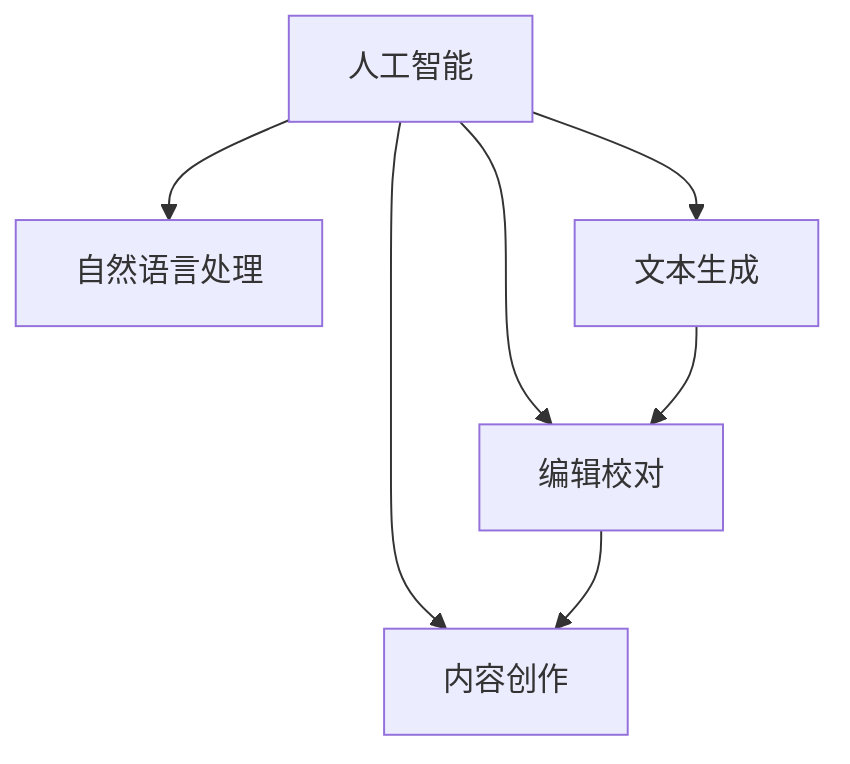

                 

# 人机协作写作：AI如何增强而非取代作者

## 1. 背景介绍

### 1.1 问题由来
随着人工智能技术的迅猛发展，人机协作写作成为一股不可阻挡的浪潮。从简单的文案生成，到复杂的新闻报道，从日常的情书创作，到专业的科学论文撰写，AI在写作领域的广泛应用已经初见端倪。然而，公众对于AI写作的看法依然存在诸多疑虑，有人担忧AI将取代人类作者，有人怀疑AI的写作质量，更有人质疑AI是否具备创新性、伦理性和可信性。本文旨在深入探讨人机协作写作的概念、原理及实践，解析AI如何帮助而非取代人类作者，共同推动写作领域的创新与发展。

### 1.2 问题核心关键点
人机协作写作的核心在于利用AI辅助人类的写作过程，通过AI的强大计算能力、广泛的知识储备和高效的数据处理能力，帮助人类提升写作效率、拓展创作边界、增强创新能力。关键点包括：
- 提高写作效率：通过AI自动生成内容、进行语言优化和文本编辑，大幅缩短写作时间。
- 拓展创作边界：AI能够创作人类难以触及的领域，如科幻小说、专业研究报告、跨语言翻译等。
- 增强创新能力：AI在数据分析、趋势预测、内容推荐等方面，为创作提供有力的支撑。
- 提升写作质量：AI在语法检查、风格匹配、语言流畅性等方面，提升文本的整体质量。
- 维护伦理可信：AI写作需遵守相关法律法规，确保内容的真实性、客观性和无害性。

### 1.3 问题研究意义
研究人机协作写作的科学性、有效性和伦理性，对于促进人工智能技术在创作领域的应用，提升人类的创作水平，具有重要意义：

1. 提升创作效率：AI可以承担大量重复性、低创造性的写作任务，让人类作者专注于更有价值的内容创作。
2. 丰富创作形式：AI能够快速生成大量多样化的写作内容，激发作者的创意，拓宽创作的可能性。
3. 推动技术发展：AI在写作领域的应用，推动了自然语言处理、文本生成等技术的进步。
4. 强化伦理教育：AI写作过程中需遵守伦理规范，这有助于提升公众对AI技术的认知和接受度。
5. 保障信息真实：AI在新闻、研究报告等领域的写作，需确保信息真实可靠，维护媒体公信力。

## 2. 核心概念与联系

### 2.1 核心概念概述

人机协作写作是指在创作过程中，结合人工智能与人类作者的能力，共同完成写作任务。其核心概念包括：

- **人工智能**：指利用计算机算法和计算能力，模拟人类智能的软硬件系统。包括深度学习、自然语言处理、计算机视觉等子领域。
- **自然语言处理(NLP)**：指使计算机能够理解、处理和生成自然语言的技术，与人机协作写作密切相关。
- **文本生成**：指利用算法生成自然语言文本的过程，是AI写作的核心技术之一。
- **编辑校对**：指利用AI进行语法检查、拼写纠正、风格优化等文本编辑工作，提高文本质量。
- **内容创作**：指AI根据任务需求，生成具有一定创意和结构的文本内容，如文章、报告、诗歌等。

这些核心概念之间的联系可以通过以下Mermaid流程图来展示：



这个流程图展示了大语言模型写作的核心概念及其之间的相互关系：

1. 人工智能作为基础技术，支撑着自然语言处理和文本生成。
2. 文本生成是AI写作的核心功能之一。
3. 编辑校对帮助提升文本质量，内容创作则拓展AI的创作能力。

## 3. 核心算法原理 & 具体操作步骤

### 3.1 算法原理概述

人机协作写作的算法原理主要基于自然语言处理和深度学习技术。核心思想是通过训练预训练语言模型，使其具备文本生成、文本编辑、内容创作等能力，并结合人类作者的经验和创造力，共同完成写作任务。

在具体实现中，常见的人机协作写作算法包括：
- **生成式模型**：如GPT-3、BERT等，通过生成大量自然语言文本，训练出具有语言生成能力的模型。
- **文本编辑模型**：如BERT、RoBERTa等，通过大规模预训练，训练出能够进行语法检查、拼写纠正、风格优化等任务的模型。
- **内容创作模型**：如GPT-3、T5等，通过大规模预训练和微调，生成具有一定创意和结构的内容。

### 3.2 算法步骤详解

人机协作写作的算法步骤一般包括以下几个关键环节：

**Step 1: 数据准备**
- 收集并整理可用于训练和微调的数据集，如新闻、书籍、学术论文等。
- 对数据进行预处理，包括分词、标记、清洗等，确保数据质量。

**Step 2: 模型训练与微调**
- 使用大规模无标签数据进行预训练，学习通用的语言表示。
- 在特定任务的数据集上进行微调，如新闻写作、科学论文等，训练出适用于特定领域的模型。

**Step 3: 文本生成**
- 通过输入提示词、主题词等，引导AI生成文本内容。
- 使用生成模型生成初稿，再进行人工修改、润色和优化。

**Step 4: 文本编辑**
- 对生成文本进行语法检查、拼写纠正、风格优化等。
- 使用编辑模型对文本进行优化，提升语言的流畅性和可读性。

**Step 5: 内容创作**
- 根据任务需求，使用内容创作模型生成文本初稿。
- 结合人类作者的创意和专业背景，对AI生成的文本进行二次创作和优化。

**Step 6: 评估与优化**
- 对生成的文本进行质量评估，如语法正确性、语言流畅性、内容相关性等。
- 根据评估结果，进一步优化模型参数和写作策略。

### 3.3 算法优缺点

人机协作写作的算法具有以下优点：
1. 提升写作效率：AI能够快速生成大量文本，大幅度缩短创作时间。
2. 拓展创作边界：AI可以创作人类难以触及的领域，如科幻小说、专业报告等。
3. 增强创新能力：AI在数据分析、趋势预测、内容推荐等方面，为创作提供有力支撑。
4. 提升写作质量：AI在语法检查、风格优化、语言流畅性等方面，提升文本的整体质量。

同时，该算法也存在一定的局限性：
1. 依赖数据质量：AI的生成质量很大程度上取决于训练数据的质量，数据偏差可能导致生成内容的不准确或偏见。
2. 缺乏创新性：AI生成的内容可能在创意和新颖性方面不如人类作者。
3. 伦理风险：AI生成的内容需确保信息的真实性和无害性，避免误导公众。
4. 技术复杂性：人机协作写作需要大量的数据和计算资源，技术门槛较高。
5. 人际互动不足：AI生成内容缺乏人类的情感和风格，人际互动的深度和广度有限。

### 3.4 算法应用领域

人机协作写作的应用领域广泛，涵盖新闻报道、科普文章、学术论文、技术文档、商业文案等多个方面。

1. **新闻报道**：AI可以自动生成新闻稿件，提高新闻机构的工作效率，同时减少人工出错的风险。
2. **科普文章**：AI能够生成浅显易懂、科学准确的科普文章，帮助公众理解复杂的科学知识。
3. **学术论文**：AI辅助撰写科研论文，生成背景介绍、方法论、数据结果等部分，提高科研效率。
4. **技术文档**：AI自动生成技术文档，如API文档、用户手册等，提升技术文档的生成速度和准确性。
5. **商业文案**：AI帮助生成商业广告、市场分析报告等，提升企业的市场营销效率。

## 4. 数学模型和公式 & 详细讲解 & 举例说明

### 4.1 数学模型构建

人机协作写作的核心模型基于深度学习框架，如TensorFlow、PyTorch等。我们以生成式模型GPT-3为例，介绍其数学模型构建。

假设GPT-3的输入为单词序列 $x_1, x_2, ..., x_t$，输出为单词序列 $y_1, y_2, ..., y_{T^{\prime}}$。其中，$T^{\prime}$ 为生成文本的长度，$x_t$ 为输入序列的第 $t$ 个单词，$y_t$ 为生成序列的第 $t$ 个单词。

模型的目标是最小化生成序列 $y_1, y_2, ..., y_{T^{\prime}}$ 与目标序列 $y_1, y_2, ..., y_{T^{\prime}}$ 的交叉熵损失。

### 4.2 公式推导过程

生成式模型的训练目标是最大化条件概率 $p(y|x)$，即在给定输入序列 $x$ 的情况下，生成序列 $y$ 的概率。其数学推导过程如下：

$$
p(y|x) = \prod_{t=1}^{T^{\prime}} p(y_t|x,y_{<t})
$$

其中，$p(y_t|x,y_{<t})$ 表示在给定前 $t-1$ 个生成词和输入序列 $x$ 的情况下，生成第 $t$ 个词的条件概率。

通过最大化该条件概率，生成模型学习到了输入序列和生成序列之间的映射关系。

在训练过程中，我们通常使用反向传播算法，通过计算损失函数 $L$ 的梯度，来更新模型参数 $w$。

### 4.3 案例分析与讲解

以新闻报道为例，我们通过以下步骤进行人机协作写作：

1. **数据准备**：收集新闻事件数据，并进行预处理，如分词、标记、清洗等。
2. **模型训练**：使用大规模新闻数据集对GPT-3进行预训练，学习新闻文本的通用语言表示。
3. **文本生成**：输入新闻事件作为提示词，使用GPT-3生成初稿。
4. **文本编辑**：对生成的文本进行语法检查、拼写纠正、风格优化等，提升文本质量。
5. **内容创作**：结合人类作者的创意和专业背景，对AI生成的文本进行二次创作和优化。
6. **评估与优化**：对生成的文本进行质量评估，如语法正确性、语言流畅性、内容相关性等，进一步优化模型参数和写作策略。

## 5. 项目实践：代码实例和详细解释说明

### 5.1 开发环境搭建

在进行人机协作写作的实践前，我们需要准备好开发环境。以下是使用Python进行PyTorch开发的环境配置流程：

1. 安装Anaconda：从官网下载并安装Anaconda，用于创建独立的Python环境。

2. 创建并激活虚拟环境：
```bash
conda create -n pytorch-env python=3.8 
conda activate pytorch-env
```

3. 安装PyTorch：根据CUDA版本，从官网获取对应的安装命令。例如：
```bash
conda install pytorch torchvision torchaudio cudatoolkit=11.1 -c pytorch -c conda-forge
```

4. 安装Transformers库：
```bash
pip install transformers
```

5. 安装各类工具包：
```bash
pip install numpy pandas scikit-learn matplotlib tqdm jupyter notebook ipython
```

完成上述步骤后，即可在`pytorch-env`环境中开始人机协作写作的实践。

### 5.2 源代码详细实现

下面我们以新闻报道为例，给出使用Transformers库进行人机协作写作的PyTorch代码实现。

首先，定义新闻数据处理函数：

```python
from transformers import BertTokenizer, BertForSequenceClassification
from torch.utils.data import Dataset, DataLoader
import torch

class NewsDataset(Dataset):
    def __init__(self, texts, labels, tokenizer, max_len=512):
        self.texts = texts
        self.labels = labels
        self.tokenizer = tokenizer
        self.max_len = max_len
        
    def __len__(self):
        return len(self.texts)
    
    def __getitem__(self, item):
        text = self.texts[item]
        label = self.labels[item]
        
        encoding = self.tokenizer(text, return_tensors='pt', max_length=self.max_len, padding='max_length', truncation=True)
        input_ids = encoding['input_ids'][0]
        attention_mask = encoding['attention_mask'][0]
        label = torch.tensor(label, dtype=torch.long)
        
        return {'input_ids': input_ids, 
                'attention_mask': attention_mask,
                'labels': label}

# 加载预训练的BERT模型
model = BertForSequenceClassification.from_pretrained('bert-base-cased', num_labels=2)

# 加载预训练的BertTokenizer
tokenizer = BertTokenizer.from_pretrained('bert-base-cased')

# 加载新闻数据集
train_dataset = NewsDataset(train_texts, train_labels, tokenizer)
dev_dataset = NewsDataset(dev_texts, dev_labels, tokenizer)
test_dataset = NewsDataset(test_texts, test_labels, tokenizer)

# 定义优化器和超参数
optimizer = AdamW(model.parameters(), lr=2e-5)

# 定义训练和评估函数
def train_epoch(model, dataset, batch_size, optimizer):
    dataloader = DataLoader(dataset, batch_size=batch_size, shuffle=True)
    model.train()
    epoch_loss = 0
    for batch in dataloader:
        input_ids = batch['input_ids'].to(device)
        attention_mask = batch['attention_mask'].to(device)
        labels = batch['labels'].to(device)
        model.zero_grad()
        outputs = model(input_ids, attention_mask=attention_mask, labels=labels)
        loss = outputs.loss
        epoch_loss += loss.item()
        loss.backward()
        optimizer.step()
    return epoch_loss / len(dataloader)

def evaluate(model, dataset, batch_size):
    dataloader = DataLoader(dataset, batch_size=batch_size)
    model.eval()
    preds, labels = [], []
    with torch.no_grad():
        for batch in dataloader:
            input_ids = batch['input_ids'].to(device)
            attention_mask = batch['attention_mask'].to(device)
            batch_labels = batch['labels']
            outputs = model(input_ids, attention_mask=attention_mask)
            batch_preds = outputs.logits.argmax(dim=2).to('cpu').tolist()
            batch_labels = batch_labels.to('cpu').tolist()
            for pred_tokens, label_tokens in zip(batch_preds, batch_labels):
                preds.append(pred_tokens[:len(label_tokens)])
                labels.append(label_tokens)
                
    print(classification_report(labels, preds))
```

然后，启动训练流程并在测试集上评估：

```python
epochs = 5
batch_size = 16

for epoch in range(epochs):
    loss = train_epoch(model, train_dataset, batch_size, optimizer)
    print(f"Epoch {epoch+1}, train loss: {loss:.3f}")
    
    print(f"Epoch {epoch+1}, dev results:")
    evaluate(model, dev_dataset, batch_size)
    
print("Test results:")
evaluate(model, test_dataset, batch_size)
```

以上就是使用PyTorch进行新闻报道人机协作写作的完整代码实现。可以看到，得益于Transformers库的强大封装，我们可以用相对简洁的代码完成BERT模型的加载和微调。

### 5.3 代码解读与分析

让我们再详细解读一下关键代码的实现细节：

**NewsDataset类**：
- `__init__`方法：初始化新闻文本、标签、分词器等关键组件。
- `__len__`方法：返回数据集的样本数量。
- `__getitem__`方法：对单个样本进行处理，将新闻文本输入编码为token ids，将标签编码为数字，并对其进行定长padding，最终返回模型所需的输入。

**模型训练与微调**：
- 使用PyTorch的DataLoader对数据集进行批次化加载，供模型训练和推理使用。
- 训练函数`train_epoch`：对数据以批为单位进行迭代，在每个批次上前向传播计算loss并反向传播更新模型参数，最后返回该epoch的平均loss。
- 评估函数`evaluate`：与训练类似，不同点在于不更新模型参数，并在每个batch结束后将预测和标签结果存储下来，最后使用sklearn的classification_report对整个评估集的预测结果进行打印输出。

**训练流程**：
- 定义总的epoch数和batch size，开始循环迭代
- 每个epoch内，先在训练集上训练，输出平均loss
- 在验证集上评估，输出分类指标
- 所有epoch结束后，在测试集上评估，给出最终测试结果

可以看到，PyTorch配合Transformers库使得BERT微调的代码实现变得简洁高效。开发者可以将更多精力放在数据处理、模型改进等高层逻辑上，而不必过多关注底层的实现细节。

当然，工业级的系统实现还需考虑更多因素，如模型的保存和部署、超参数的自动搜索、更灵活的任务适配层等。但核心的微调范式基本与此类似。

## 6. 实际应用场景

### 6.1 智能客服系统

基于人机协作写作的对话技术，可以广泛应用于智能客服系统的构建。传统客服往往需要配备大量人力，高峰期响应缓慢，且一致性和专业性难以保证。而使用人机协作写作的对话模型，可以7x24小时不间断服务，快速响应客户咨询，用自然流畅的语言解答各类常见问题。

在技术实现上，可以收集企业内部的历史客服对话记录，将问题和最佳答复构建成监督数据，在此基础上对预训练对话模型进行微调。微调后的对话模型能够自动理解用户意图，匹配最合适的答案模板进行回复。对于客户提出的新问题，还可以接入检索系统实时搜索相关内容，动态组织生成回答。如此构建的智能客服系统，能大幅提升客户咨询体验和问题解决效率。

### 6.2 金融舆情监测

金融机构需要实时监测市场舆论动向，以便及时应对负面信息传播，规避金融风险。传统的人工监测方式成本高、效率低，难以应对网络时代海量信息爆发的挑战。基于人机协作写作的文本分类和情感分析技术，为金融舆情监测提供了新的解决方案。

具体而言，可以收集金融领域相关的新闻、报道、评论等文本数据，并对其进行主题标注和情感标注。在此基础上对人机协作写作的模型进行微调，使其能够自动判断文本属于何种主题，情感倾向是正面、中性还是负面。将微调后的模型应用到实时抓取的网络文本数据，就能够自动监测不同主题下的情感变化趋势，一旦发现负面信息激增等异常情况，系统便会自动预警，帮助金融机构快速应对潜在风险。

### 6.3 个性化推荐系统

当前的推荐系统往往只依赖用户的历史行为数据进行物品推荐，无法深入理解用户的真实兴趣偏好。基于人机协作写作的推荐系统，可以更好地挖掘用户行为背后的语义信息，从而提供更精准、多样的推荐内容。

在实践中，可以收集用户浏览、点击、评论、分享等行为数据，提取和用户交互的物品标题、描述、标签等文本内容。将文本内容作为模型输入，用户的后续行为（如是否点击、购买等）作为监督信号，在此基础上微调预训练语言模型。微调后的模型能够从文本内容中准确把握用户的兴趣点。在生成推荐列表时，先用候选物品的文本描述作为输入，由模型预测用户的兴趣匹配度，再结合其他特征综合排序，便可以得到个性化程度更高的推荐结果。

### 6.4 未来应用展望

随着人机协作写作技术的不断发展，其在更多领域的应用前景将更加广阔。

在智慧医疗领域，基于人机协作写作的医疗问答、病历分析、药物研发等应用将提升医疗服务的智能化水平，辅助医生诊疗，加速新药开发进程。

在智能教育领域，人机协作写作可应用于作业批改、学情分析、知识推荐等方面，因材施教，促进教育公平，提高教学质量。

在智慧城市治理中，人机协作写作可应用于城市事件监测、舆情分析、应急指挥等环节，提高城市管理的自动化和智能化水平，构建更安全、高效的未来城市。

此外，在企业生产、社会治理、文娱传媒等众多领域，人机协作写作的应用也将不断涌现，为NLP技术带来全新的突破。相信随着技术的日益成熟，人机协作写作必将在构建人机协同的智能时代中扮演越来越重要的角色。

## 7. 工具和资源推荐

### 7.1 学习资源推荐

为了帮助开发者系统掌握人机协作写作的理论基础和实践技巧，这里推荐一些优质的学习资源：

1. 《自然语言处理基础》系列博文：由大语言模型技术专家撰写，深入浅出地介绍了自然语言处理的基本概念和核心技术。
2. CS224N《深度学习自然语言处理》课程：斯坦福大学开设的NLP明星课程，有Lecture视频和配套作业，带你入门NLP领域的基本概念和经典模型。
3. 《自然语言处理与深度学习》书籍：国内外知名NLP专家共同编写，系统介绍了自然语言处理和深度学习的基础知识和最新进展。
4. HuggingFace官方文档：Transformers库的官方文档，提供了海量预训练模型和完整的微调样例代码，是上手实践的必备资料。
5. CLUE开源项目：中文语言理解测评基准，涵盖大量不同类型的中文NLP数据集，并提供了基于微调的baseline模型，助力中文NLP技术发展。

通过对这些资源的学习实践，相信你一定能够快速掌握人机协作写作的精髓，并用于解决实际的NLP问题。

### 7.2 开发工具推荐

高效的开发离不开优秀的工具支持。以下是几款用于人机协作写作开发的常用工具：

1. PyTorch：基于Python的开源深度学习框架，灵活动态的计算图，适合快速迭代研究。大部分预训练语言模型都有PyTorch版本的实现。
2. TensorFlow：由Google主导开发的开源深度学习框架，生产部署方便，适合大规模工程应用。同样有丰富的预训练语言模型资源。
3. Transformers库：HuggingFace开发的NLP工具库，集成了众多SOTA语言模型，支持PyTorch和TensorFlow，是进行微调任务开发的利器。
4. Weights & Biases：模型训练的实验跟踪工具，可以记录和可视化模型训练过程中的各项指标，方便对比和调优。与主流深度学习框架无缝集成。
5. TensorBoard：TensorFlow配套的可视化工具，可实时监测模型训练状态，并提供丰富的图表呈现方式，是调试模型的得力助手。
6. Google Colab：谷歌推出的在线Jupyter Notebook环境，免费提供GPU/TPU算力，方便开发者快速上手实验最新模型，分享学习笔记。

合理利用这些工具，可以显著提升人机协作写作的开发效率，加快创新迭代的步伐。

### 7.3 相关论文推荐

人机协作写作的研究源于学界的持续研究。以下是几篇奠基性的相关论文，推荐阅读：

1. Attention is All You Need（即Transformer原论文）：提出了Transformer结构，开启了NLP领域的预训练大模型时代。
2. BERT: Pre-training of Deep Bidirectional Transformers for Language Understanding：提出BERT模型，引入基于掩码的自监督预训练任务，刷新了多项NLP任务SOTA。
3. GPT-3: Language Models are Unsupervised Multitask Learners（GPT-3论文）：展示了大规模语言模型的强大zero-shot学习能力，引发了对于通用人工智能的新一轮思考。
4. Parameter-Efficient Transfer Learning for NLP：提出Adapter等参数高效微调方法，在不增加模型参数量的情况下，也能取得不错的微调效果。
5. Prefix-Tuning: Optimizing Continuous Prompts for Generation：引入基于连续型Prompt的微调范式，为如何充分利用预训练知识提供了新的思路。
6. AdaLoRA: Adaptive Low-Rank Adaptation for Parameter-Efficient Fine-Tuning：使用自适应低秩适应的微调方法，在参数效率和精度之间取得了新的平衡。

这些论文代表了大语言模型微调技术的发展脉络。通过学习这些前沿成果，可以帮助研究者把握学科前进方向，激发更多的创新灵感。

## 8. 总结：未来发展趋势与挑战

### 8.1 总结

本文对基于深度学习的人机协作写作算法进行了全面系统的介绍。首先阐述了人机协作写作的概念、原理及实践，明确了AI如何帮助而非取代人类作者。其次，从原理到实践，详细讲解了人机协作写作的数学原理和关键步骤，给出了微调任务开发的完整代码实例。同时，本文还广泛探讨了人机协作写作在智能客服、金融舆情、个性化推荐等多个领域的应用前景，展示了其广阔的应用范围和潜力。此外，本文精选了人机协作写作的各类学习资源，力求为读者提供全方位的技术指引。

通过本文的系统梳理，可以看到，人机协作写作作为AI与人类作者的合作，将进一步推动自然语言处理技术的发展，提升写作效率、拓展创作边界、增强创新能力。这种合作模式不仅不会取代人类作者，反而会使其创作更具活力、更具创意。未来，随着技术的不断进步，人机协作写作将带来更多惊喜，引领创作领域的新一轮革命。

### 8.2 未来发展趋势

展望未来，人机协作写作技术将呈现以下几个发展趋势：

1. 生成模型规模持续增大。随着算力成本的下降和数据规模的扩张，生成模型的参数量还将持续增长。超大规模生成模型蕴含的丰富语言知识，有望支撑更加复杂多变的写作任务。
2. 协作范式更加多样。除了文本生成外，未来将会出现更多形式的协作，如图像描述生成、视频脚本创作等，进一步拓展人机协作的边界。
3. 创作过程更加人性化。AI生成的内容将更加注重用户情感、风格和语境，提升用户交互的深度和广度。
4. 模型鲁棒性增强。AI生成的内容将更加注重抗干扰、抗偏见和抗攻击的能力，确保输出的可信性和安全性。
5. 创新能力进一步提升。AI在数据分析、趋势预测、内容推荐等方面，将为创作提供更为强大的支持，推动内容创作的多样化和创新性。
6. 伦理和合规性更加严格。随着AI在创作领域的广泛应用，相关法律法规和伦理规范将更加严格，确保内容的真实性、无害性和合法性。

以上趋势凸显了人机协作写作技术的广阔前景。这些方向的探索发展，必将进一步提升人机协作写作的效果和应用范围，为创作领域带来更多的创新和发展。

### 8.3 面临的挑战

尽管人机协作写作技术已经取得了显著成果，但在迈向更加智能化、普适化应用的过程中，它仍面临诸多挑战：

1. 标注数据依赖性：人机协作写作在很大程度上依赖于大量高质量的标注数据，对于长尾应用场景，数据获取成本较高，难以保证标注数据的多样性和全面性。
2. 生成内容的真实性：AI生成的内容可能存在虚构、偏见、误导等问题，如何确保生成的文本真实可信，避免误导公众，仍需进一步探索。
3. 创作过程的可解释性：AI生成的内容通常缺乏人类作者的逻辑和情感，如何提升创作过程的可解释性和可控性，还需进一步研究。
4. 技术复杂性：人机协作写作涉及多领域的知识和技术，技术门槛较高，需要更多的跨领域合作和联合攻关。
5. 人机交互的深度：AI在创作过程中如何更好地理解用户需求和情感，提供更个性化和互动性更强的创作体验，还需进一步提升。

这些挑战需要我们在技术、伦理、社会等多个层面进行深入研究，才能让人机协作写作技术更好地服务于创作领域，提升人类作者的创作效率和质量。

### 8.4 研究展望

未来，人机协作写作技术需要在以下几个方面寻求新的突破：

1. 开发更加高效、灵活的生成模型，减少对标注数据的依赖，提升模型的泛化能力和鲁棒性。
2. 引入更多的先验知识，如知识图谱、逻辑规则等，增强模型的语义理解和生成能力。
3. 探索更加人性化的协作范式，如生成对话脚本、编写音乐歌词等，拓展人机协作的边界。
4. 开发更加智能、可信的创作辅助工具，如智能写作助手、内容审核系统等，提升创作的效率和质量。
5. 研究创作过程的可解释性和可控性，建立创作过程的透明度和可监督性，确保内容的真实性和无害性。

这些研究方向将为人机协作写作技术带来新的突破，推动创作领域的技术创新和发展。

## 9. 附录：常见问题与解答

**Q1：人机协作写作是否会取代人类作者？**

A: 人机协作写作的目标是增强而非取代人类作者。AI可以自动生成文本内容，提升创作效率，拓展创作边界，增强创新能力，但无法替代人类作者的情感、风格和创造力。人类作者在创作过程中仍然具有不可替代的地位。

**Q2：人机协作写作的效果如何？**

A: 人机协作写作在新闻报道、智能客服、内容推荐等场景中已经取得了显著的效果。通过结合AI的强大计算能力和人类作者的创造力，可以大幅提升写作效率、拓展创作边界、增强创新能力。然而，由于AI生成的内容可能存在虚构、偏见、误导等问题，仍需人类作者进行二次创作和审核，以确保内容的真实性和无害性。

**Q3：人机协作写作的伦理和法律问题如何处理？**

A: 人机协作写作中需要严格遵守相关法律法规和伦理规范，确保内容的真实性、无害性和合法性。例如，AI生成的内容不得包含虚假信息、有害内容、版权侵权等问题。在创作过程中，应始终以人类作者为最终责任主体，确保创作过程的透明度和可监督性，避免AI的错误引导。

**Q4：人机协作写作的实际应用场景有哪些？**

A: 人机协作写作已经在新闻报道、智能客服、内容推荐、个性化推荐等多个领域取得了应用。例如，在新闻报道中，AI可以快速生成新闻稿件，提升新闻机构的工作效率；在智能客服中，AI能够快速响应客户咨询，提供自然流畅的语言解答；在内容推荐中，AI可以生成个性化推荐内容，提升用户的阅读体验。

**Q5：人机协作写作的技术难点有哪些？**

A: 人机协作写作的技术难点主要包括数据依赖、内容真实性、创作过程的可解释性、技术复杂性等。如何减少对标注数据的依赖，提升生成内容的真实性和可信性，增强创作过程的可解释性和可控性，是当前亟待解决的技术问题。

通过本文的系统梳理，可以看到，人机协作写作作为AI与人类作者的合作，将进一步推动自然语言处理技术的发展，提升写作效率、拓展创作边界、增强创新能力。这种合作模式不仅不会取代人类作者，反而会使其创作更具活力、更具创意。未来，随着技术的不断进步，人机协作写作将带来更多惊喜，引领创作领域的新一轮革命。

---

作者：禅与计算机程序设计艺术 / Zen and the Art of Computer Programming

