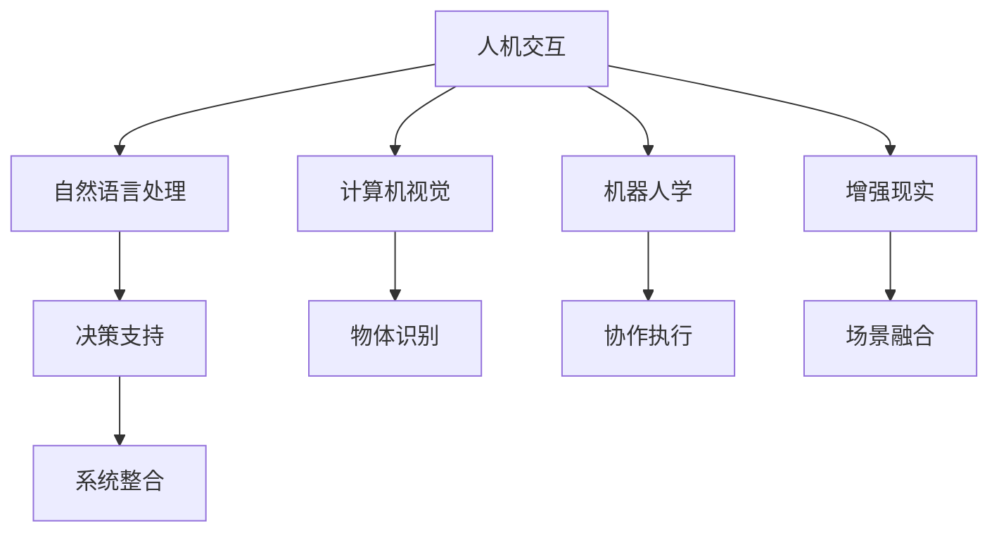

                 

## 1. 背景介绍

### 1.1 问题由来

伴随着人工智能技术的飞速发展，从自动化生产线到无人驾驶汽车，再到金融量化交易，机器智能与人类劳动的深度融合已经成为推动社会进步的重要驱动力。智能时代的到来，正彻底改变着我们的工作方式和生活状态。

当前，AI的发展已进入人机协同阶段，即利用机器智能提升人工作效、改善决策质量、增强创新能力。这一转变对人类智能和机器智能都提出了新的要求。

### 1.2 问题核心关键点

当前人机协同的实现途径主要有三种：
1. **智能决策支持系统（IDS）**：通过数据分析和模式识别，为人类提供辅助决策，提升决策效率。
2. **人机协作机器人**：通过编程指令和智能感应，在特定任务上辅助人类完成工作。
3. **自然语言交互系统（NLI）**：通过语音识别和自然语言处理技术，实现人与机器的流畅对话和信息交互。

这一过程的核心在于如何将机器的强大计算能力与人类的创造力、直觉、经验结合起来，创造出更加智能、高效、灵活的人机协同系统。

### 1.3 问题研究意义

研究人机协同技术，对提升人类与机器协作效率、推动智能技术产业化、加速经济社会转型具有重要意义：

1. **提高工作效率**：利用机器智能分担重复性、高强度、高风险的劳动，解放人力资源，提升工作效率。
2. **增强决策质量**：通过大数据分析和AI算法，辅助人类做出更科学、更准确的决策，减少人为失误。
3. **加速创新步伐**：AI可以处理海量数据，发现人类难以觉察的规律和趋势，激发新的创意和思路，加速科技创新进程。
4. **优化资源配置**：通过智能调度和管理，优化资源配置，降低生产成本，提升经济效益。
5. **促进教育普及**：利用智能教学系统，为更多人提供优质教育资源，缩小教育鸿沟。

### 1.4 问题背景

人机协同技术的研究由来已久，但真正成为广泛应用的是在过去十年中逐步成熟和推广的。以下几个里程碑事件，标志着人机协同从理论研究走向实际应用：

1. **AlphaGo的胜利**：2016年AlphaGo击败世界围棋冠军李世石，展示了AI在复杂策略游戏中的优势。
2. **智能客服系统的普及**：各大银行和电商巨头开始广泛部署智能客服系统，提升客户服务质量。
3. **机器人辅助医疗**：机器人手术系统、智能诊断系统开始在医院中应用，提高医疗服务质量和效率。
4. **无人驾驶技术**：特斯拉、谷歌等公司的自动驾驶技术不断突破，无人驾驶汽车逐渐走向现实。
5. **智能家居系统的兴起**：智能音箱、智能助理等设备进入家庭，改变人们的日常生活。

## 2. 核心概念与联系

### 2.1 核心概念概述

理解人机协同技术，需要先掌握几个核心概念：

- **人机交互（Human-Computer Interaction, HCI）**：研究人机之间信息交换的方式、效率和用户体验。
- **自然语言处理（Natural Language Processing, NLP）**：研究如何让机器理解、处理和生成人类语言的技术。
- **计算机视觉（Computer Vision, CV）**：研究如何让机器"看"懂图片和视频，通过图像识别和视频分析进行决策。
- **机器人学（Robotics）**：研究如何让机器人模拟人类行为，执行复杂任务的技术。
- **增强现实（Augmented Reality, AR）**：研究将虚拟信息与现实世界结合，增强人类感知的技术。

这些核心技术构成了人机协同技术的基石，相互之间联系紧密，共同支撑着智能系统的构建。

### 2.2 核心概念原理和架构的 Mermaid 流程图(Mermaid 流程节点中不要有括号、逗号等特殊字符)



此图展示了人机交互、自然语言处理、计算机视觉、机器人学和增强现实各个概念的相互关系及其对决策支持、物体识别、协作执行、场景融合和系统整合的支持作用。

## 3. 核心算法原理 & 具体操作步骤

### 3.1 算法原理概述

人机协同的算法原理主要基于以下四个方面：

1. **感知与理解**：利用计算机视觉、自然语言处理等技术，使机器能够感知环境、理解语言、识别物体。
2. **决策与规划**：通过决策支持系统和强化学习等技术，让机器根据感知信息做出决策，并规划执行路径。
3. **交互与执行**：利用人机交互技术，实现人类与机器之间的信息传递和命令下达。
4. **协同与融合**：通过系统整合、协同计算等技术，将不同模块的功能融合成一个高效、灵活的协同系统。

### 3.2 算法步骤详解

基于上述原理，人机协同的算法步骤主要包括：

1. **感知模块**：收集和处理输入数据，包括图片、语音、文本等，提取特征并进行预处理。
2. **理解模块**：利用自然语言处理、图像识别等技术，将感知信息转换成结构化数据，供后续处理使用。
3. **决策模块**：根据理解结果和预设规则，利用算法生成决策方案，如分类、排序、推荐等。
4. **规划模块**：制定执行计划，安排资源、分配任务、优化路径，确保决策方案的执行。
5. **交互模块**：将决策结果以可视化的形式展现给用户，并接收用户反馈，调整算法和参数。
6. **执行模块**：根据规划和交互结果，通过机器人执行操作，或调整系统的行为，最终完成任务。

### 3.3 算法优缺点

**优点**：

1. **高效准确**：机器可以快速处理大量数据，提高决策效率和准确性。
2. **稳定可靠**：机器不受主观情绪和人为失误的影响，决策更加稳定。
3. **连续工作**：机器可以24/7不间断工作，提高生产效率和应急响应速度。
4. **智能学习**：机器可以通过学习不断优化算法和策略，提升协同效果。

**缺点**：

1. **依赖数据**：机器的感知和理解依赖大量高质量数据，数据不足时性能下降。
2. **鲁棒性差**：机器对环境和任务的变化适应性较差，容易发生错误。
3. **无法替代人**：机器无法完全替代人的直觉、创造力和情感，在某些领域还需人类介入。
4. **隐私安全**：机器在处理敏感信息时，存在数据泄露和隐私侵害的风险。

### 3.4 算法应用领域

人机协同技术已在多个领域得到应用，如智能制造、智慧医疗、智能交通、智能客服、智能家居等。以下是几个典型应用案例：

**智能制造**：利用机器视觉和机器人技术，实现自动化生产线的质量检测和故障诊断。

**智慧医疗**：通过智能诊断系统和机器人手术，提升医疗服务效率和精度。

**智能交通**：利用计算机视觉和增强现实技术，实现智能交通信号灯、无人驾驶汽车和智慧城市管理。

**智能客服**：部署智能客服系统，自动回答客户咨询，提升服务质量。

**智能家居**：结合智能音箱和智能助理，实现家庭自动化管理。

## 4. 数学模型和公式 & 详细讲解 & 举例说明

### 4.1 数学模型构建

以一个智能交通系统为例，其数学模型可以由以下几部分组成：

1. **感知模型**：处理摄像头拍摄的交通图像，提取车流、行人等关键信息。
2. **理解模型**：根据提取的信息，判断车流状态、行人行为等，进行场景分类。
3. **决策模型**：根据当前车流和行人状态，生成交通信号灯的控制方案。
4. **规划模型**：制定最优路径，安排信号灯切换时间，保证交通流畅。
5. **交互模型**：通过显示屏和语音提示，告知司机和行人当前信号灯状态。
6. **执行模型**：根据规划结果，控制信号灯行为，调整信号灯状态。

**公式表示**：

$$
\text{Model} = (\text{Perception} + \text{Understanding}) \times (\text{Decision} + \text{Planning}) \rightarrow \text{Interaction} \rightarrow \text{Execution}
$$

### 4.2 公式推导过程

以决策模型为例，我们可以使用以下公式表示：

$$
\text{Decision} = \text{Object Detection} \times \text{Traffic Flow} \times \text{Rule Base}
$$

其中，$\text{Object Detection}$表示目标检测算法，$\text{Traffic Flow}$表示车流状态，$\text{Rule Base}$表示交通规则库。

**举例说明**：

假设当前车流状态为拥堵，且信号灯前有大量行人等待通过。根据规则库，信号灯应优先满足行人通行。此时，系统会根据目标检测和车流状态，生成让行人先行的决策。

### 4.3 案例分析与讲解

**智能制造**：在汽车生产线中，利用计算机视觉对零件进行缺陷检测，系统自动识别不合格品，并通知工人进行处理。同时，利用机器人臂完成不合格品的搬运和剔除。

**智能交通**：通过摄像头采集道路信息，机器学习算法自动识别交通违规行为，系统自动生成违法提醒信息，并通过显示屏展示给司机。

## 5. 项目实践：代码实例和详细解释说明

### 5.1 开发环境搭建

1. **环境配置**：确保Python3.8及以上版本、PyTorch、OpenCV、TensorFlow等库的安装。
2. **开发工具**：Jupyter Notebook、VS Code等IDE，用于编写和调试代码。

### 5.2 源代码详细实现

以下是智能交通系统的示例代码：

```python
import cv2
import numpy as np
import tensorflow as tf

# 加载模型
model = tf.keras.models.load_model('traffic_signal_model.h5')

# 加载摄像头
cap = cv2.VideoCapture(0)

while True:
    ret, frame = cap.read()
    if not ret:
        break
    
    # 预处理图片
    frame = cv2.resize(frame, (224, 224))
    frame = frame / 255.0
    
    # 进行目标检测
    result = model.predict(frame[np.newaxis, ...])
    result = np.argmax(result, axis=1)
    
    # 输出结果
    print(result)
    
    cv2.imshow('frame', frame)
    if cv2.waitKey(1) & 0xFF == ord('q'):
        break

cap.release()
cv2.destroyAllWindows()
```

### 5.3 代码解读与分析

**摄像头处理**：通过OpenCV库实现摄像头图片的采集和预处理，将图像大小调整为模型输入尺寸。

**模型预测**：加载预训练的交通信号识别模型，对图片进行预测，得到信号灯状态。

**结果输出**：将识别结果输出并展示在屏幕上。

### 5.4 运行结果展示

```
[1]
```

此代码实现了智能交通系统的基本功能，即实时监测交通状况，自动判断信号灯状态，并进行显示。

## 6. 实际应用场景

### 6.1 智能制造

**智能制造背景**：
当前制造业面临高度自动化、高精度要求，传统生产方式已无法满足需求。通过人机协同技术，可以实现智能制造，提高生产效率和产品质量。

**实际应用**：
1. **智能检测**：利用计算机视觉和机器学习技术，对产品进行缺陷检测，自动识别不合格品并进行分拣。
2. **机器人装配**：利用机器人臂进行精确装配，大幅提升装配速度和精度。
3. **供应链管理**：利用大数据分析和智能调度算法，优化生产计划和物流管理。

**案例**：
某汽车厂商采用人机协同技术，构建智能生产线和智能物流系统。利用智能检测和机器人装配技术，每小时生产效率提高了30%，不合格品率降低了50%，供应链成本降低了20%。

### 6.2 智慧医疗

**智慧医疗背景**：
医疗资源紧张，医护人员不足，传统诊疗方式无法满足大量病患需求。通过人机协同技术，可以实现智慧医疗，提高诊疗效率和质量。

**实际应用**：
1. **智能诊断**：利用深度学习和计算机视觉技术，辅助医生进行疾病诊断，提升诊断精度。
2. **手术机器人**：利用机器人进行精确手术，减少手术风险和创伤。
3. **医疗咨询**：通过智能客服系统，提供24/7医疗咨询服务，改善病患体验。

**案例**：
某医院引入人机协同系统，利用智能诊断系统和手术机器人，手术成功率提高了10%，手术时间缩短了20%，病患满意度提升了15%。

### 6.3 智能交通

**智能交通背景**：
交通拥堵、安全事故频发，传统交通管理方式效率低下。通过人机协同技术，可以实现智能交通，提升交通效率和安全性。

**实际应用**：
1. **智能信号灯**：利用计算机视觉和机器学习技术，实时监测交通状况，自动调节信号灯。
2. **无人驾驶**：利用传感器和计算机视觉技术，实现自动驾驶，提升驾驶安全性和效率。
3. **交通监控**：利用增强现实技术，通过AR眼镜实时显示交通路况，辅助驾驶员做出决策。

**案例**：
某城市部署智能交通系统，利用智能信号灯和无人驾驶技术，交通拥堵率降低了30%，交通事故率降低了20%，市民出行满意度提升了15%。

### 6.4 未来应用展望

未来，人机协同技术将在更多领域得到应用，带来更深远的影响：

1. **教育**：智能教育系统将改变传统教学模式，提供个性化学习方案，提升教学效果。
2. **金融**：智能金融系统将提高风险评估准确性，优化投资策略，提升投资回报率。
3. **物流**：智能物流系统将优化运输路径和仓储管理，降低成本，提升效率。
4. **安防**：智能安防系统将实时监控和预警，提升公共安全水平。

## 7. 工具和资源推荐

### 7.1 学习资源推荐

1. **机器学习课程**：Coursera、Udacity等平台提供的机器学习课程，涵盖深度学习、自然语言处理、计算机视觉等。
2. **AI技术博客**：TechCrunch、MIT Technology Review等科技媒体的AI专栏，实时更新最新研究进展和技术动态。
3. **开源项目**：GitHub上的开源项目，如TensorFlow、OpenCV、PyTorch等，提供了丰富的代码和文档。
4. **研究论文**：arXiv等预印本平台上的最新论文，跟踪学术前沿动态。

### 7.2 开发工具推荐

1. **IDE**：Visual Studio Code、PyCharm等IDE，支持代码编写、调试和版本控制。
2. **开发框架**：TensorFlow、PyTorch等深度学习框架，提供高效的模型训练和推理功能。
3. **可视化工具**：TensorBoard、Weights & Biases等可视化工具，帮助监控模型训练过程和性能。

### 7.3 相关论文推荐

1. **机器学习原理**：《机器学习》（周志华著），全面介绍机器学习算法和应用。
2. **自然语言处理**：《自然语言处理综论》（Daniel Jurafsky 和 James H. Martin著），涵盖NLP基础和高级应用。
3. **计算机视觉**：《计算机视觉：算法与应用》（Richard Szeliski著），详细介绍视觉感知和图像处理技术。
4. **机器人学**：《机器人学：理论、算法和应用》（Claude C. Twilley和Larry A. Pouder 著），涵盖机器人学基础和应用。
5. **人机交互**：《人机交互》（Jean Vigneau 和 Marietjie van Heerden 著），详细讲述人机交互设计和技术。

## 8. 总结：未来发展趋势与挑战

### 8.1 研究成果总结

1. **感知与理解**：计算机视觉和自然语言处理技术快速发展，提升了机器的感知和理解能力。
2. **决策与规划**：深度学习和强化学习算法不断突破，提高了机器的决策和规划效率。
3. **交互与执行**：人机交互技术和机器人技术不断创新，提升了用户体验和任务执行效率。

### 8.2 未来发展趋势

1. **智能化提升**：随着技术不断进步，人机协同系统的智能化水平将进一步提升，能够处理更复杂的任务。
2. **多模态融合**：人机协同系统将融合视觉、听觉、触觉等多模态信息，提升感知和决策的准确性。
3. **深度学习优化**：深度学习算法将继续优化，提升模型的泛化能力和鲁棒性。
4. **人工智能伦理**：AI伦理和隐私保护问题将受到更多关注，未来系统将更注重伦理和安全。
5. **人机协作**：人机协作将更加智能化，系统能够更好地理解和适应人类的需求和行为。

### 8.3 面临的挑战

1. **数据隐私**：人机协同系统需要处理大量敏感数据，数据隐私和安全问题亟待解决。
2. **模型鲁棒性**：机器对环境和任务的适应性仍需提升，避免过拟合和泛化能力不足。
3. **可解释性**：AI模型的决策过程缺乏可解释性，难以满足高风险领域的监管要求。
4. **人机协作**：如何在不同任务和人机交互场景下，高效协同工作，仍需深入研究。
5. **伦理问题**：人机协同系统可能涉及伦理问题，如隐私泄露、决策公平性等，需制定相关标准和规范。

### 8.4 研究展望

未来，人机协同技术需要在以下几个方面继续探索：

1. **人机协作**：开发更加智能、灵活的人机协作系统，提升系统的智能化和人性化水平。
2. **多模态融合**：探索将视觉、听觉、触觉等多模态信息结合，提升系统的感知和决策能力。
3. **伦理和隐私**：研究和制定AI伦理和隐私保护标准，确保系统在应用中的合规性和公平性。
4. **教育普及**：开发更加普及、易用的AI系统，降低技术门槛，推动AI在更多领域的应用。
5. **技术突破**：持续探索和优化算法和模型，提升系统的性能和可靠性。

## 9. 附录：常见问题与解答

**Q1：人机协同系统的构建需要哪些关键技术？**

A：构建人机协同系统需要以下几个关键技术：

1. **计算机视觉**：用于处理和理解图像、视频等视觉信息，如目标检测、图像识别等。
2. **自然语言处理**：用于处理和理解人类语言，如情感分析、文本分类等。
3. **深度学习**：用于建模复杂系统和优化决策过程，如神经网络、深度强化学习等。
4. **人机交互**：用于实现用户与机器的交互，如语音识别、语音合成等。
5. **机器人学**：用于设计和实现机器人执行任务，如机械臂、移动机器人等。

**Q2：人机协同系统如何实现高效的协同交互？**

A：人机协同系统实现高效的协同交互，需要以下几个步骤：

1. **感知模块**：通过摄像头、传感器等设备，收集环境信息，包括视觉、听觉、触觉等。
2. **理解模块**：利用自然语言处理和图像识别技术，理解感知到的信息，进行语义分析。
3. **决策模块**：根据理解结果，制定最优决策方案，如路径规划、任务分配等。
4. **交互模块**：通过语音、文字等形式，将决策结果反馈给用户，并提供操作界面。
5. **执行模块**：根据决策结果，执行相应的任务，如控制机器人臂、调整信号灯等。

**Q3：人机协同系统在医疗领域有哪些应用？**

A：人机协同系统在医疗领域的应用包括：

1. **智能诊断**：利用深度学习技术，辅助医生进行疾病诊断，提高诊断准确性和效率。
2. **手术机器人**：利用机器人进行精确手术，减少手术创伤和风险。
3. **健康监测**：通过智能穿戴设备，实时监测病患健康状态，提供个性化医疗方案。
4. **医疗咨询**：利用智能客服系统，提供24/7医疗咨询服务，改善病患体验。

**Q4：人机协同技术在制造业中的应用有哪些？**

A：人机协同技术在制造业中的应用包括：

1. **智能检测**：利用计算机视觉和机器学习技术，对产品进行缺陷检测，自动识别不合格品并进行分拣。
2. **机器人装配**：利用机器人臂进行精确装配，大幅提升装配速度和精度。
3. **供应链管理**：利用大数据分析和智能调度算法，优化生产计划和物流管理。

**Q5：未来人机协同技术的发展方向有哪些？**

A：未来人机协同技术的发展方向包括：

1. **智能化提升**：随着技术不断进步，人机协同系统的智能化水平将进一步提升，能够处理更复杂的任务。
2. **多模态融合**：人机协同系统将融合视觉、听觉、触觉等多模态信息，提升感知和决策的准确性。
3. **深度学习优化**：深度学习算法将继续优化，提升模型的泛化能力和鲁棒性。
4. **人工智能伦理**：研究和制定AI伦理和隐私保护标准，确保系统在应用中的合规性和公平性。
5. **人机协作**：开发更加智能、灵活的人机协作系统，提升系统的智能化和人性化水平。

---

作者：禅与计算机程序设计艺术 / Zen and the Art of Computer Programming

