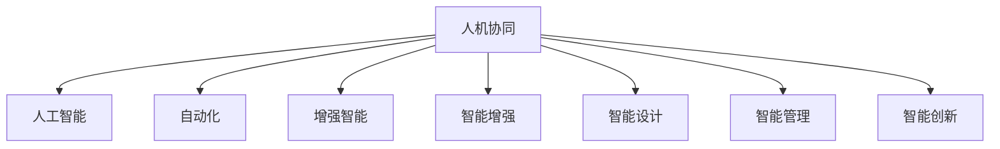

                 

# 人机协同：未来工作的关键词

> 关键词：人机协同,人工智能,未来工作,技术转型,创新生态

## 1. 背景介绍

### 1.1 问题由来
随着科技的飞速发展，尤其是人工智能(AI)技术的成熟和普及，人类工作方式正经历着前所未有的变革。人工智能不仅提高了生产效率，也带来了工作内容、协作方式、职业结构等方面的深远影响。人机协同成为未来工作的新常态，进而催生了新的工作方式、业务模式和价值链条。

在技术日新月异的背景下，如何适应并利用AI，使人类与机器高效合作，实现双赢，是当前企业和从业者共同面临的挑战。本文将详细探讨人机协同的概念、原理、方法和应用，希望能为职场转型和技术创新提供一些启示。

### 1.2 问题核心关键点
未来工作环境的核心关键点包括：
1. **人机协同**：将人工智能与人类智慧结合起来，形成互补优势，提高工作效率和质量。
2. **技术转型**：企业需要借助AI技术进行业务流程优化，提升产品和服务的智能化水平。
3. **创新生态**：AI技术的持续发展需要构建跨学科、跨行业、跨领域的创新生态，以促进技术应用和落地。
4. **人才需求**：在AI环境下，新兴职位和技术栈的需求日益增长，对人才的技能和素质提出了新的要求。
5. **伦理与责任**：在应用AI时，需考虑伦理和责任问题，避免技术滥用和数据隐私泄露。

这些关键点构成了人机协同未来工作的基本框架，并对企业、从业者和社会提出了多维度的挑战和机遇。

## 2. 核心概念与联系

### 2.1 核心概念概述

为更好地理解人机协同的未来工作模式，本节将介绍几个关键概念及其相互联系：

- **人机协同**：指人类与机器之间的协同工作，旨在通过互补优势，共同完成复杂任务。
- **人工智能**：利用机器学习、深度学习等技术，使计算机具备识别、推理、决策等类人智能。
- **自动化**：通过人工智能技术，实现重复性、结构化任务的自动化处理，减轻人力负担。
- **增强智能**：利用AI技术，增强人类的认知和决策能力，提供辅助支持。
- **智能增强**：通过人机协同，将智能增强到业务流程和产品服务中，提升用户体验和效率。
- **智能设计**：在人机协同过程中，实现基于智能分析的用户需求和业务流程优化。
- **智能管理**：应用AI技术进行资源配置、任务调度、风险控制等管理优化。
- **智能创新**：利用AI技术驱动产品创新、服务创新、模式创新，创造新的商业价值。

这些核心概念之间的逻辑关系可以通过以下Mermaid流程图来展示：



这个流程图展示了一些关键概念之间的关系：

1. 人机协同是核心，通过人工智能、自动化、增强智能等技术手段实现。
2. 智能增强、智能设计和智能管理都是基于人机协同的具体应用。
3. 智能创新是更高层次的应用，通过人机协同驱动产品和业务的创新。

## 3. 核心算法原理 & 具体操作步骤
### 3.1 算法原理概述

人机协同的未来工作模式，本质上是通过优化和扩展人类智能，提升工作质量和效率。核心算法原理包括以下几个方面：

- **自动化**：利用AI进行自动化任务处理，将人从繁琐、重复的工作中解放出来。
- **增强智能**：通过机器学习、知识图谱、推理引擎等技术，增强人类的决策和分析能力。
- **协同工作**：利用自然语言处理(NLP)、人机交互技术等手段，实现人机无缝协同，形成高效的工作流程。
- **智能反馈**：通过智能分析和用户反馈，持续优化人机协同策略和流程，提高协同效率。
- **智能决策**：结合数据分析、模型预测，辅助人类进行更精准、快速的决策。

### 3.2 算法步骤详解

人机协同的未来工作模式可以分为以下几个步骤：

**Step 1: 理解任务与需求**
- 分析任务的特点和需求，明确自动化和增强智能的适用场景。
- 收集数据，包括业务流程、用户反馈、操作日志等，为后续的AI建模提供依据。

**Step 2: 选择技术手段**
- 根据任务特点，选择合适的AI技术，如机器学习、深度学习、自然语言处理等。
- 确定算法模型和优化策略，如决策树、神经网络、强化学习等。

**Step 3: 模型训练与优化**
- 收集标注数据，进行模型训练和参数调优。
- 评估模型性能，进行超参数搜索和模型迭代。

**Step 4: 集成与部署**
- 将训练好的模型集成到业务系统中，部署到生产环境。
- 设置监控和反馈机制，持续优化协同效果。

**Step 5: 协同与反馈**
- 在实际工作场景中进行人机协同，收集用户反馈和运行数据。
- 根据反馈调整模型和策略，实现持续优化。

### 3.3 算法优缺点

人机协同的未来工作模式有以下优点：
1. 提高效率：通过自动化和增强智能，显著提升工作效率和质量。
2. 降低成本：自动化和智能增强减少了人力需求和误操作成本。
3. 提升精度：AI模型能够处理复杂数据，提供高质量的决策支持。
4. 增强创新：人机协同驱动新的业务模式和产品设计，带来新的商业机会。

同时，该方法也存在一些局限性：
1. 对数据的依赖：AI模型的效果依赖于数据的质量和多样性。
2. 技术复杂性：需要一定的技术积累和跨领域协作，实施难度较大。
3. 系统集成：将AI技术与现有系统集成，需要解决兼容性问题。
4. 伦理与隐私：AI应用需关注伦理和隐私问题，避免技术滥用。

尽管存在这些局限性，人机协同仍然是大势所趋，需要在实践中不断优化和完善。

### 3.4 算法应用领域

人机协同的未来工作模式在多个领域中有着广泛的应用，具体包括：

- **智能客服**：通过自然语言处理和机器学习，构建智能客服系统，提升客户体验和满意度。
- **智能制造**：利用工业物联网(IoT)和AI技术，实现生产线自动化和质量控制，提升生产效率和产品品质。
- **金融科技**：应用AI进行风险评估、欺诈检测、客户管理等，提高金融服务的智能化水平。
- **医疗健康**：通过AI辅助诊断、个性化推荐、患者管理等，提升医疗服务的精准性和效率。
- **智慧城市**：利用AI进行交通管理、环境监测、应急响应等，提高城市治理的智能化水平。
- **教育培训**：借助AI进行个性化学习、智能评估、内容推荐等，提升教育培训的智能化水平。

这些领域的应用展示了人机协同在未来工作的广阔前景和巨大潜力。

## 4. 数学模型和公式 & 详细讲解 & 举例说明（备注：数学公式请使用latex格式，latex嵌入文中独立段落使用 $$，段落内使用 $)
### 4.1 数学模型构建

人机协同的未来工作模式涉及到多个方面的数学模型，以下以智能客服系统的NLP模型为例，进行详细讲解：

**模型定义**：
- 输入：用户输入的文本 $x$。
- 输出：模型预测的意图和实体 $y$。
- 训练数据集：包含标注的用户意图和实体 $(x, y)$。

**目标函数**：
- 最小化交叉熵损失函数，表示模型预测与真实标签之间的差异。

$$
L(x, y; \theta) = -\sum_{i=1}^N \log P(y_i | x_i; \theta)
$$

其中 $P(y_i | x_i; \theta)$ 表示模型在给定输入 $x_i$ 下预测 $y_i$ 的概率。

**算法流程**：
1. 收集标注数据集 $D = \{(x_i, y_i)\}_{i=1}^N$。
2. 初始化模型参数 $\theta$。
3. 随机抽取训练集中的样本 $(x, y)$。
4. 前向传播：通过模型计算输出 $y'$。
5. 计算损失 $L$。
6. 反向传播：计算梯度 $\frac{\partial L}{\partial \theta}$。
7. 更新参数：$\theta \leftarrow \theta - \eta \frac{\partial L}{\partial \theta}$，其中 $\eta$ 为学习率。
8. 重复步骤4-7，直到收敛。

### 4.2 公式推导过程

以二分类问题为例，推导模型预测函数和损失函数：

**预测函数**：
$$
P(y_i = 1 | x_i; \theta) = \sigma(W^T x_i + b)
$$

其中 $\sigma$ 为sigmoid函数，$W$ 和 $b$ 为模型参数。

**交叉熵损失函数**：
$$
L(x, y; \theta) = -(y \log P(y_i=1|x_i;\theta) + (1-y) \log P(y_i=0|x_i;\theta))
$$

### 4.3 案例分析与讲解

**智能客服系统**：
- 输入：用户输入的文本，如“我想订机票”。
- 模型预测：模型根据上下文理解意图，预测为“预订机票”。
- 实体识别：模型识别出“机票”为实体。
- 输出：向用户提供预订机票的选项，如“请问您需要预订哪一天的机票？”

这个案例展示了AI在自然语言理解和处理中的作用，通过理解和预测用户意图，实现智能客服系统的自动化处理。

## 5. 项目实践：代码实例和详细解释说明
### 5.1 开发环境搭建

在进行人机协同实践前，我们需要准备好开发环境。以下是使用Python进行TensorFlow开发的环境配置流程：

1. 安装Anaconda：从官网下载并安装Anaconda，用于创建独立的Python环境。

2. 创建并激活虚拟环境：
```bash
conda create -n tf-env python=3.8 
conda activate tf-env
```

3. 安装TensorFlow：根据CUDA版本，从官网获取对应的安装命令。例如：
```bash
conda install tensorflow -c conda-forge -c pytorch -c anaconda
```

4. 安装Keras和Flax：
```bash
pip install keras flax
```

5. 安装TensorBoard：
```bash
pip install tensorboard
```

完成上述步骤后，即可在`tf-env`环境中开始人机协同的实践。

### 5.2 源代码详细实现

这里我们以智能客服系统的意图分类模型为例，给出使用TensorFlow进行NLP任务开发的PyTorch代码实现。

首先，定义意图分类模型的数据处理函数：

```python
from tensorflow.keras.preprocessing.text import Tokenizer
from tensorflow.keras.preprocessing.sequence import pad_sequences
import tensorflow as tf

def create_tokenizer(data):
    tokenizer = Tokenizer(oov_token="<OOV>")
    tokenizer.fit_on_texts(data)
    return tokenizer

def create_sequences(data, tokenizer, max_len=128):
    sequences = tokenizer.texts_to_sequences(data)
    return pad_sequences(sequences, maxlen=max_len, padding="post", truncating="post")
```

然后，定义模型和优化器：

```python
from tensorflow.keras.models import Sequential
from tensorflow.keras.layers import Dense, Embedding, LSTM

model = Sequential([
    Embedding(input_dim=tokenizer.num_words+1, output_dim=64),
    LSTM(64),
    Dense(1, activation="sigmoid")
])

model.compile(optimizer='adam', loss='binary_crossentropy', metrics=['accuracy'])
```

接着，定义训练和评估函数：

```python
def train_epoch(model, dataset, batch_size, optimizer):
    model.fit(dataset, epochs=1, batch_size=batch_size, validation_split=0.2)
    
def evaluate(model, dataset, batch_size):
    model.evaluate(dataset, batch_size=batch_size)
```

最后，启动训练流程并在测试集上评估：

```python
epochs = 5
batch_size = 16

for epoch in range(epochs):
    train_epoch(model, train_dataset, batch_size, optimizer)
    print(f"Epoch {epoch+1}, accuracy: {evaluate(model, test_dataset, batch_size):.4f}")
```

以上就是使用TensorFlow对意图分类模型进行训练和评估的完整代码实现。可以看到，TensorFlow提供了丰富的工具和组件，使得模型的训练和评估变得简洁高效。

### 5.3 代码解读与分析

让我们再详细解读一下关键代码的实现细节：

**create_tokenizer函数**：
- 使用Keras的Tokenizer对文本进行分词和编码，将未知词汇映射到特殊符号"<OOV>"。
- 使用pad_sequences对序列进行填充，使其长度一致，方便模型处理。

**模型定义**：
- 使用Keras的Sequential模型，包含嵌入层、LSTM层和全连接层。
- 嵌入层将文本转换为向量，LSTM层处理序列数据，全连接层输出二分类结果。

**训练和评估函数**：
- 使用fit方法对模型进行训练，指定epoch数、批次大小和验证集比例。
- 使用evaluate方法在测试集上评估模型性能，输出准确率。

**训练流程**：
- 定义总的epoch数和批次大小，开始循环迭代
- 每个epoch内，在训练集上进行训练，并在验证集上评估性能
- 所有epoch结束后，给出最终的准确率

可以看到，TensorFlow提供了丰富的组件和工具，使得模型训练和评估变得简洁高效。开发者可以将更多精力放在数据处理、模型改进等高层逻辑上，而不必过多关注底层的实现细节。

当然，工业级的系统实现还需考虑更多因素，如模型的保存和部署、超参数的自动搜索、更灵活的任务适配层等。但核心的协同范式基本与此类似。

## 6. 实际应用场景
### 6.1 智能客服系统

基于人机协同的未来工作模式，智能客服系统可以提供7x24小时不间断服务，快速响应客户咨询，用自然流畅的语言解答各类常见问题。具体实现包括：

- **意图分类**：使用AI模型自动识别用户意图，如查询、预订、投诉等。
- **实体识别**：识别用户输入中的关键信息，如日期、时间、地点等，用于后续处理。
- **个性化推荐**：根据用户历史行为和偏好，推荐相应的解决方案和产品。
- **智能对话**：构建多轮对话系统，提供自然流畅的对话体验，解决复杂问题。

通过人机协同，智能客服系统能够大幅提升客户咨询体验和问题解决效率。

### 6.2 金融科技

在金融科技领域，基于人机协同的未来工作模式可以实现智能风险评估、欺诈检测、客户管理等功能，提升金融服务的智能化水平。具体实现包括：

- **信用评估**：使用AI模型分析客户信用记录和行为数据，评估其信用风险。
- **欺诈检测**：利用AI模型检测异常交易和行为，及时发现和预警欺诈行为。
- **客户管理**：根据客户行为数据和历史交易，提供个性化推荐和服务。

人机协同在金融科技中的应用，能够提升金融服务的效率和安全性，帮助金融机构更好地服务客户。

### 6.3 智慧城市治理

智慧城市治理是未来工作模式的重要应用场景，通过人机协同可以显著提升城市管理的智能化水平。具体实现包括：

- **交通管理**：利用AI模型分析交通数据，优化交通信号灯和路线规划，缓解交通拥堵。
- **环境监测**：使用AI模型监测空气、水质等环境指标，预测和预警环境问题。
- **应急响应**：根据AI分析结果，及时调配应急资源，提升应急响应效率。

人机协同在智慧城市治理中的应用，能够提高城市管理的智能化水平，保障城市安全和高效运转。

### 6.4 未来应用展望

随着人机协同技术的不断发展，未来的应用场景将更加丰富和多样化，带来更多创新和突破：

- **智能生产**：通过人机协同，实现智能制造、质量控制等生产过程的自动化和智能化。
- **智能教育**：构建智能学习系统，提供个性化推荐、智能评估等功能，提升教育质量。
- **智能医疗**：应用AI辅助诊断、个性化治疗、健康管理等，提高医疗服务的智能化水平。
- **智能法律**：利用AI进行合同审核、法律咨询、案件分析等，提升法律服务的智能化水平。
- **智能农业**：通过人机协同，实现精准农业、智能灌溉、农机自动化等，提升农业生产效率和品质。

这些应用展示了人机协同在未来工作的广阔前景和巨大潜力，未来还将有更多创新和突破。

## 7. 工具和资源推荐
### 7.1 学习资源推荐

为了帮助开发者系统掌握人机协同的未来工作模式，这里推荐一些优质的学习资源：

1. **《人机协同未来工作模式》系列博文**：由大模型技术专家撰写，深入浅出地介绍了人机协同的工作模式、技术原理和应用案例。

2. **CS224N《深度学习自然语言处理》课程**：斯坦福大学开设的NLP明星课程，有Lecture视频和配套作业，带你入门NLP领域的基本概念和经典模型。

3. **《人机协同技术白皮书》**：全面介绍了人机协同的技术原理、应用场景和落地实践，适合技术从业者和企业管理者阅读。

4. **TensorFlow官方文档**：TensorFlow的官方文档，提供了丰富的API接口和代码示例，是学习和实践人机协同的必备资料。

5. **TensorFlow AI Dev Summit**：每年举办的TensorFlow开发者大会，汇集全球AI领域的顶尖专家，展示最新技术和应用。

通过对这些资源的学习实践，相信你一定能够快速掌握人机协同的未来工作模式，并用于解决实际的AI应用问题。

### 7.2 开发工具推荐

高效的开发离不开优秀的工具支持。以下是几款用于人机协同未来工作模式开发的常用工具：

1. **TensorFlow**：基于Python的开源深度学习框架，灵活的计算图和高效的计算能力，适合复杂模型的训练和推理。

2. **Keras**：高层次的深度学习框架，支持TensorFlow和其他后端，易于上手和调试。

3. **Flax**：基于JAX的深度学习框架，提供了自动微分、高效计算和组件化的设计理念，适用于高性能模型开发。

4. **TensorBoard**：TensorFlow配套的可视化工具，实时监测模型训练状态，提供丰富的图表呈现方式，方便调试和优化。

5. **Weights & Biases**：模型训练的实验跟踪工具，记录和可视化模型训练过程中的各项指标，方便对比和调优。

6. **Jupyter Notebook**：轻量级的开发环境，支持代码、文档和数据的一体化管理，便于共享和协作。

合理利用这些工具，可以显著提升人机协同未来工作模式的开发效率，加快创新迭代的步伐。

### 7.3 相关论文推荐

人机协同技术的发展源于学界的持续研究。以下是几篇奠基性的相关论文，推荐阅读：

1. **《人机协同的未来工作模式》**：论文提出了人机协同的概念和实现框架，探讨了未来工作的趋势和挑战。

2. **《深度学习在自然语言处理中的应用》**：深入分析了深度学习在NLP中的应用，包括意图分类、实体识别、情感分析等任务。

3. **《自动推理与自然语言处理》**：结合自动推理和NLP技术，提出了智能对话系统的构建方法。

4. **《智能客服系统的设计与实现》**：介绍了智能客服系统的架构和算法实现，展示了人机协同在实际应用中的效果。

5. **《智慧城市治理的智能化路径》**：研究了智慧城市治理中的人机协同应用，提出了基于AI的城市管理方案。

这些论文代表了大模型微调技术的发展脉络。通过学习这些前沿成果，可以帮助研究者把握学科前进方向，激发更多的创新灵感。

## 8. 总结：未来发展趋势与挑战

### 8.1 总结

本文对人机协同的未来工作模式进行了全面系统的介绍。首先阐述了人机协同的概念、原理和应用，明确了其在工作效率提升、成本降低、决策支持等方面的独特价值。其次，从原理到实践，详细讲解了人机协同的数学模型和关键步骤，给出了具体实现代码和详细解读。同时，本文还探讨了人机协同在多个领域的应用，展示了其广阔前景和巨大潜力。

通过本文的系统梳理，可以看到，人机协同在未来工作的变革性作用，以及其对企业和从业者提出的多维度的挑战和机遇。

### 8.2 未来发展趋势

展望未来，人机协同技术将呈现以下几个发展趋势：

1. **技术深度融合**：人机协同将更加深入地与AI技术融合，实现更全面、更高效的工作协同。
2. **多模态应用**：人机协同将拓展到视觉、语音等多模态数据，提升智能系统的感知能力和应用范围。
3. **智能决策**：基于AI模型，人机协同将具备更强大的决策能力，实现精准预测和高效决策。
4. **个性化定制**：通过AI分析用户数据，人机协同将提供更加个性化、定制化的服务体验。
5. **跨领域创新**：人机协同将在更多领域实现创新应用，推动各行业的数字化转型。

这些趋势展示了人机协同技术的广阔前景，未来将在更多场景中发挥重要作用，深刻影响人类的生产生活方式。

### 8.3 面临的挑战

尽管人机协同技术已经取得了瞩目成就，但在迈向更加智能化、普适化应用的过程中，仍面临诸多挑战：

1. **数据隐私**：AI应用需确保用户数据隐私，避免数据泄露和滥用。
2. **伦理与责任**：在应用AI时需考虑伦理和责任问题，避免技术滥用和偏见。
3. **技术复杂性**：人机协同技术需跨领域、跨学科协作，实施难度较大。
4. **系统集成**：将AI技术与现有系统集成，需要解决兼容性问题。
5. **技术门槛**：技术门槛较高，需培养更多跨领域技术人才。

这些挑战需要各方共同努力，通过技术创新、政策引导和伦理约束，推动人机协同技术的健康发展。

### 8.4 研究展望

面对人机协同技术所面临的挑战，未来的研究需要在以下几个方面寻求新的突破：

1. **隐私保护技术**：开发数据加密、差分隐私等技术，保护用户隐私和数据安全。
2. **公平与透明**：设计公平透明的AI算法，避免偏见和歧视，确保AI决策的公正性。
3. **跨领域协作**：加强跨学科、跨行业的合作，推动人机协同技术的应用落地。
4. **技术普及**：降低技术门槛，推广人机协同技术的普及和应用。
5. **智能伦理**：研究智能伦理框架，引导人机协同技术健康发展。

这些研究方向将引领人机协同技术迈向更高的台阶，为构建智能和谐的社会提供技术支撑。总之，人机协同在未来工作中的应用前景广阔，需要各方共同努力，推动技术创新和应用落地。

## 9. 附录：常见问题与解答

**Q1：人机协同的未来工作模式如何定义？**

A: 人机协同的未来工作模式是指通过人工智能技术与人类智慧结合，实现高效、精准、智能的协同工作。主要通过自动化、增强智能、智能设计等技术手段，提升工作效率和质量，优化工作流程和决策支持。

**Q2：人机协同的实现关键是什么？**

A: 人机协同的实现关键在于选择合适的技术手段，构建高效的工作模型，并实现模型的集成和优化。具体包括：
1. 选择适合的技术，如深度学习、自然语言处理等。
2. 构建高效的模型，如意图分类、实体识别等。
3. 实现模型的集成，部署到生产环境。
4. 持续优化模型，提高协同效率。

**Q3：人机协同技术的应用场景有哪些？**

A: 人机协同技术在多个领域中有着广泛的应用，具体包括：
1. 智能客服：通过自然语言处理和机器学习，构建智能客服系统，提升客户体验和满意度。
2. 智能制造：利用工业物联网和AI技术，实现生产线自动化和质量控制，提升生产效率和产品品质。
3. 金融科技：应用AI进行风险评估、欺诈检测、客户管理等，提高金融服务的智能化水平。
4. 智慧城市：利用AI进行交通管理、环境监测、应急响应等，提高城市治理的智能化水平。
5. 教育培训：借助AI进行个性化学习、智能评估、内容推荐等，提升教育培训的智能化水平。

这些应用展示了人机协同在未来工作的广阔前景和巨大潜力。

**Q4：人机协同技术有哪些优点？**

A: 人机协同技术有以下优点：
1. 提高效率：通过自动化和增强智能，显著提升工作效率和质量。
2. 降低成本：自动化和智能增强减少了人力需求和误操作成本。
3. 提升精度：AI模型能够处理复杂数据，提供高质量的决策支持。
4. 增强创新：人机协同驱动新的业务模式和产品设计，带来新的商业机会。

尽管存在一些局限性，人机协同仍然是大势所趋，需要在实践中不断优化和完善。

**Q5：人机协同技术的应用难点是什么？**

A: 人机协同技术的应用难点包括：
1. 数据隐私：AI应用需确保用户数据隐私，避免数据泄露和滥用。
2. 伦理与责任：在应用AI时需考虑伦理和责任问题，避免技术滥用和偏见。
3. 技术复杂性：人机协同技术需跨领域、跨学科协作，实施难度较大。
4. 系统集成：将AI技术与现有系统集成，需要解决兼容性问题。
5. 技术门槛：技术门槛较高，需培养更多跨领域技术人才。

这些难点需要各方共同努力，通过技术创新、政策引导和伦理约束，推动人机协同技术的健康发展。

---

作者：禅与计算机程序设计艺术 / Zen and the Art of Computer Programming

