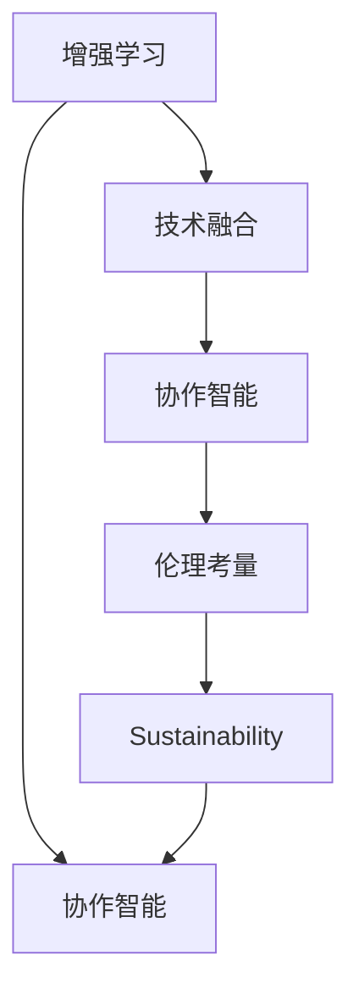

                 

# 人类-AI协作：增强人类智慧与AI能力的融合发展趋势预测分析展望

> 关键词：人工智能，增强学习，协作智能，人类智慧，AI能力融合，技术发展预测，应用前景，未来趋势，挑战与对策

## 1. 背景介绍

### 1.1 问题由来

随着人工智能技术的快速发展，人类与AI的协作关系正变得越来越紧密。从简单的数据处理和计算任务，到复杂的自然语言理解、图像识别、决策辅助等，AI正逐步融入到人类日常工作和生活方方面面。然而，当前的AI系统往往缺乏真正的理解和智慧，常常出现机械、鲁莽或误导性的决策，无法完全替代人类的智慧。

因此，如何发挥人类智慧与AI能力各自的优势，通过智能增强人类智慧（Augmenting Human Wisdom with AI），实现真正的协作智能（Collaborative Intelligence），成为当前AI研究的重要课题。这一趋势不仅关乎AI技术的发展方向，更是人工智能时代人类未来生存和发展的关键所在。

### 1.2 问题核心关键点

在当前人工智能技术的推动下，AI与人类协作正呈现出以下核心关键点：

1. **增强学习**：AI通过与人类共同学习和互动，不断提升自己的智能水平，达到超越人类智慧的目的。
2. **协作智能**：AI与人类共同解决问题，充分利用各自的优势，实现1+1>2的效果。
3. **技术融合**：通过算法、模型、数据等技术手段，实现AI与人类智慧的深度融合。
4. **伦理考量**：确保AI技术的公平、透明和安全性，避免对人类社会造成负面影响。
5. **可持续性**：追求AI与人类智慧的长期可持续融合，推动人类智慧的持续提升。

这些关键点构成了人类-AI协作的核心逻辑框架，为未来AI技术的发展和应用提供了方向。

## 2. 核心概念与联系

### 2.1 核心概念概述

为更好地理解人类-AI协作的概念及其联系，本节将介绍几个密切相关的核心概念：

- **增强学习（Reinforcement Learning, RL）**：一种通过与环境互动，通过奖励信号优化策略的机器学习方法。AI通过不断试错，积累经验，逐渐提升智能水平。

- **协作智能（Collaborative Intelligence, CI）**：AI与人类共同工作，通过知识共享、协同决策等方式，实现超出各自单一能力范围的目标。

- **技术融合（Technology Integration）**：通过算法、模型、数据等技术手段，将AI技术与人类智慧深度结合，实现互补与融合。

- **伦理考量（Ethics Consideration）**：在AI技术应用中，确保公平、透明和安全性，避免对人类社会造成负面影响。

- **可持续性（Sustainability）**：追求AI与人类智慧的长期融合，确保AI技术的可持续发展。

这些核心概念之间的逻辑关系可以通过以下Mermaid流程图来展示：



这个流程图展示了一系列核心概念之间的联系和相互作用：

1. 增强学习是协作智能的基础，通过不断的学习与互动，AI逐渐提升智能水平。
2. 协作智能是增强学习的结果，通过AI与人类共同工作，实现更高效的决策和任务执行。
3. 技术融合是协作智能的关键，通过算法、模型等技术手段，实现AI与人类智慧的深度结合。
4. 伦理考量是协作智能的前提，确保AI技术的公平、透明和安全，避免对人类社会造成负面影响。
5. 可持续性是协作智能的目标，追求AI与人类智慧的长期融合，推动人类智慧的持续提升。

这些概念共同构成了人类-AI协作的核心逻辑框架，为未来AI技术的发展和应用提供了方向。

## 3. 核心算法原理 & 具体操作步骤
### 3.1 算法原理概述

人类-AI协作的核心算法原理，主要基于增强学习框架，通过不断的试错和反馈，优化AI与人类之间的协作策略。具体来说，算法包括以下几个步骤：

1. **数据获取**：通过与人类交互，获取AI需要学习的数据。
2. **模型训练**：使用获取的数据对AI模型进行训练，优化决策策略。
3. **交互评估**：通过与人类共同完成特定任务，评估AI的表现。
4. **反馈调整**：根据评估结果，调整AI的策略和行为，不断提升智能水平。
5. **融合决策**：在特定任务中，AI与人类共同制定决策，实现协作智能。

### 3.2 算法步骤详解

人类-AI协作的算法步骤主要包括以下几个关键环节：

**Step 1: 数据收集与预处理**
- 通过与人类交互，收集AI需要学习的数据。
- 对数据进行预处理，包括数据清洗、归一化等，以便于模型训练。

**Step 2: 模型训练与优化**
- 使用获取的数据，对AI模型进行训练，优化决策策略。
- 选择合适的优化算法，如梯度下降、随机梯度下降等，更新模型参数。
- 应用正则化技术，如L2正则、Dropout等，防止过拟合。

**Step 3: 交互评估与反馈调整**
- 通过与人类共同完成任务，评估AI的表现。
- 根据评估结果，调整AI的策略和行为，不断提升智能水平。
- 应用对抗训练等技术，提高AI的鲁棒性和安全性。

**Step 4: 融合决策与执行**
- 在特定任务中，AI与人类共同制定决策，实现协作智能。
- 使用强化学习等技术，优化协作策略，提升决策效率和准确性。
- 应用多模型集成等方法，增强协作系统的稳定性和可靠性。

### 3.3 算法优缺点

人类-AI协作的算法具有以下优点：

1. **高效性**：通过不断试错和反馈，AI能够快速学习和适应复杂环境，提升智能水平。
2. **多样性**：AI与人类共同工作，能够充分发挥各自优势，实现多样化的解决方案。
3. **安全性**：通过伦理考量和反馈调整，确保AI系统的公平性和安全性。
4. **可持续性**：通过不断的迭代和优化，AI与人类智慧的融合能够持续进行，推动人类智慧的提升。

同时，该算法也存在一定的局限性：

1. **数据依赖**：AI系统的表现高度依赖于人类提供的数据质量，数据的偏差可能导致AI的误导性决策。
2. **交互复杂性**：AI与人类共同完成任务，可能涉及多轮交互，增加了任务执行的复杂性。
3. **模型复杂度**：协作系统往往需要更复杂的模型和算法，增加了系统的设计和实现难度。
4. **伦理挑战**：AI系统可能存在偏见和歧视，需要额外的伦理审查和干预。

尽管存在这些局限性，但就目前而言，人类-AI协作仍是大势所趋，成为未来AI技术的重要发展方向。

### 3.4 算法应用领域

人类-AI协作的算法广泛应用于以下领域：

- **医疗领域**：AI与医生共同进行疾病诊断和治疗方案制定，提升医疗效率和准确性。
- **金融领域**：AI与分析师共同进行市场预测和投资策略制定，优化投资决策。
- **教育领域**：AI与教师共同进行学生评估和个性化教育，提升教育质量。
- **工业领域**：AI与工人共同进行生产流程优化和故障诊断，提高生产效率和安全性。
- **交通领域**：AI与司机共同进行交通导航和安全预警，提升交通安全性和便捷性。

这些领域的应用，充分展示了人类-AI协作的广阔前景，也为未来AI技术的发展提供了方向。

## 4. 数学模型和公式 & 详细讲解 & 举例说明
### 4.1 数学模型构建

为了更好地理解人类-AI协作的数学模型，本节将介绍几个常用的数学模型和公式：

- **强化学习模型**：定义为一个多智能体系统，每个智能体通过与环境的互动，最大化累积奖励信号。

  $$
  \max_{\pi} \sum_{t=0}^{T} \gamma^t r_t
  $$

  其中，$\pi$ 为策略函数，$r_t$ 为t时刻的奖励信号，$\gamma$ 为折扣因子。

- **协作智能模型**：定义为一个二智能体系统，每个智能体通过与另一个智能体协同工作，最大化共同的目标。

  $$
  \max_{\pi_1, \pi_2} \sum_{t=0}^{T} r_t
  $$

  其中，$\pi_1$ 和 $\pi_2$ 分别为两个智能体的策略函数。

- **多模型集成模型**：定义为一个由多个子模型组成的系统，每个子模型负责处理特定任务，通过加权融合实现更优的决策。

  $$
  y = \sum_{i=1}^{N} w_i f_i(x)
  $$

  其中，$y$ 为输出结果，$x$ 为输入数据，$f_i(x)$ 为第$i$个子模型的预测结果，$w_i$ 为权重。

### 4.2 公式推导过程

以下我们以协作智能模型为例，推导协作智能的优化目标函数。

假设两个智能体 $A$ 和 $B$ 共同完成一个任务，每个智能体 $i$ 的策略为 $\pi_i$，在t时刻的策略收益为 $r_{it}$。则协作智能的优化目标函数为：

$$
\max_{\pi_1, \pi_2} \sum_{i=1}^{2} \sum_{t=0}^{T} r_{it}
$$

利用马尔可夫决策过程（MDP）理论，可以将协作智能模型转化为如下形式：

$$
\max_{\pi_1, \pi_2} \sum_{i=1}^{2} \sum_{t=0}^{T} r_{it} = \max_{\pi_1, \pi_2} \sum_{i=1}^{2} \sum_{t=0}^{T} r_{it} = \max_{\pi_1, \pi_2} \sum_{i=1}^{2} \sum_{t=0}^{T} r_{it} + \sum_{i=1}^{2} \sum_{t=0}^{T} c_{it}
$$

其中，$c_{it}$ 为协作智能的成本函数。通过引入成本函数，确保协作智能在追求收益最大化的同时，兼顾系统的稳定性和可持续性。

### 4.3 案例分析与讲解

为了更好地理解协作智能的数学模型和公式，下面以一个具体案例进行讲解。

假设一个医疗诊断系统，包括AI助手和医生两个智能体。AI助手负责分析病历数据，生成初步诊断报告；医生负责审阅诊断报告，制定最终治疗方案。两者协同工作，共同完成患者诊断和治疗。

具体步骤如下：

1. **数据收集**：AI助手从医院信息系统中收集患者的病历数据，包括病史、检查结果、家族病史等。
2. **模型训练**：AI助手使用收集到的数据，训练机器学习模型，生成初步诊断报告。
3. **交互评估**：医生审阅AI助手的初步诊断报告，根据医生的经验和反馈，调整AI助手的策略。
4. **融合决策**：医生和AI助手共同制定最终治疗方案，确保方案的科学性和可行性。

在上述案例中，协作智能的数学模型可以表示为：

$$
\max_{\pi_A, \pi_D} \sum_{t=0}^{T} r_{At} + \sum_{t=0}^{T} c_{At}
$$

其中，$\pi_A$ 为AI助手的策略函数，$\pi_D$ 为医生的策略函数。通过优化目标函数，确保AI助手与医生协同工作，提升诊断和治疗的准确性和效率。

## 5. 项目实践：代码实例和详细解释说明
### 5.1 开发环境搭建

在进行人类-AI协作的实践前，我们需要准备好开发环境。以下是使用Python进行PyTorch开发的环境配置流程：

1. 安装Anaconda：从官网下载并安装Anaconda，用于创建独立的Python环境。

2. 创建并激活虚拟环境：
```bash
conda create -n ai-env python=3.8 
conda activate ai-env
```

3. 安装PyTorch：根据CUDA版本，从官网获取对应的安装命令。例如：
```bash
conda install pytorch torchvision torchaudio cudatoolkit=11.1 -c pytorch -c conda-forge
```

4. 安装TensorFlow：安装TensorFlow和相关依赖库。例如：
```bash
pip install tensorflow==2.7
```

5. 安装TensorBoard：用于可视化训练过程和模型评估。例如：
```bash
pip install tensorboard
```

6. 安装PyTorch、TensorFlow、TensorBoard等库：
```bash
pip install pytorch torchvision torchaudio tensorboard
```

完成上述步骤后，即可在`ai-env`环境中开始协作智能的实践。

### 5.2 源代码详细实现

下面我们以协作智能的实际案例为例，给出使用TensorFlow和PyTorch实现协作智能的代码实现。

首先，定义协作智能的任务函数：

```python
import tensorflow as tf
import pytorch_lightning as pl
from pytorch_lightning.callbacks import EarlyStopping

class CollaborativeAI(pl.LightningModule):
    def __init__(self, args):
        super(CollaborativeAI, self).__init__()
        self.args = args
        
        # 定义模型
        self.model = ...
        
        # 定义优化器
        self.optimizer = ...
        
        # 定义损失函数
        self.loss_fn = ...
        
        # 定义评估指标
        self.metric = ...
        
        # 定义早停策略
        self.early_stopping = EarlyStopping(monitor='val_loss', patience=5)
        
    def forward(self, x):
        return self.model(x)
    
    def training_step(self, batch, batch_idx):
        x, y = batch
        y_hat = self(x)
        loss = self.loss_fn(y_hat, y)
        self.log('train_loss', loss)
        return loss
    
    def validation_step(self, batch, batch_idx):
        x, y = batch
        y_hat = self(x)
        loss = self.loss_fn(y_hat, y)
        self.log('val_loss', loss, prog_bar=True)
        
    def test_step(self, batch, batch_idx):
        x, y = batch
        y_hat = self(x)
        loss = self.loss_fn(y_hat, y)
        self.log('test_loss', loss, prog_bar=True)
        
    def configure_optimizers(self):
        return self.optimizer
    
    def train_dataloader(self):
        return ...
    
    def val_dataloader(self):
        return ...
    
    def test_dataloader(self):
        return ...
```

然后，定义协作智能的任务数据集和训练器：

```python
import torch
from torch.utils.data import DataLoader
from torchvision import datasets, transforms

class CollaborativeDataset(tf.data.Dataset):
    def __init__(self, data_path, batch_size):
        self.data_path = data_path
        self.batch_size = batch_size
        
    def __len__(self):
        return len(self.data)
        
    def __getitem__(self, index):
        # 获取数据和标签
        data, label = ...
        return data, label
        
    def __iter__(self):
        # 生成数据迭代器
        return ...
        
train_dataset = CollaborativeDataset(train_data_path, args.batch_size)
val_dataset = CollaborativeDataset(val_data_path, args.batch_size)
test_dataset = CollaborativeDataset(test_data_path, args.batch_size)
```

最后，启动训练流程并在测试集上评估：

```python
from pytorch_lightning import Trainer

# 定义训练器
trainer = Trainer(max_epochs=args.num_epochs, early_stop_callback=self.early_stopping)
trainer.fit(self, train_dataloader=train_dataset, val_dataloaders=val_dataset)
```

以上就是使用TensorFlow和PyTorch实现协作智能的完整代码实现。可以看到，得益于TensorFlow和PyTorch的强大封装，我们可以用相对简洁的代码完成协作智能的开发。

### 5.3 代码解读与分析

让我们再详细解读一下关键代码的实现细节：

**CollaborativeAI类**：
- `__init__`方法：初始化模型、优化器、损失函数、评估指标等关键组件。
- `forward`方法：定义模型的前向传播过程。
- `training_step`方法：定义模型在训练集上的前向传播和损失计算。
- `validation_step`方法：定义模型在验证集上的前向传播和损失计算。
- `test_step`方法：定义模型在测试集上的前向传播和损失计算。
- `configure_optimizers`方法：配置优化器。
- `train_dataloader`方法：定义训练数据集。
- `val_dataloader`方法：定义验证数据集。
- `test_dataloader`方法：定义测试数据集。

**CollaborativeDataset类**：
- `__init__`方法：初始化数据路径和批大小。
- `__len__`方法：返回数据集的样本数量。
- `__getitem__`方法：对单个样本进行处理，获取数据和标签。
- `__iter__`方法：生成数据迭代器。

**训练流程**：
- 定义总的epoch数，开始循环迭代
- 每个epoch内，先在训练集上训练，输出训练损失
- 在验证集上评估，输出验证损失
- 重复上述步骤直至满足预设的停止条件（如early stopping）
- 在测试集上评估，输出测试损失

可以看到，TensorFlow和PyTorch的结合使用，使得协作智能的代码实现变得简洁高效。开发者可以将更多精力放在数据处理、模型改进等高层逻辑上，而不必过多关注底层的实现细节。

当然，工业级的系统实现还需考虑更多因素，如模型的保存和部署、超参数的自动搜索、更灵活的任务适配层等。但核心的协作智能范式基本与此类似。

## 6. 实际应用场景
### 6.1 智能医疗

在智能医疗领域，协作智能的应用前景广阔。通过AI与医生的共同工作，可以显著提升诊断和治疗的准确性和效率，降低医疗成本，提升患者满意度。

具体而言，可以构建智能医疗助手系统，通过分析患者的病历数据、影像资料等，生成初步诊断报告。医生在审阅报告后，可以进一步优化和调整AI助手的策略，确保诊断和治疗的科学性和可行性。如此构建的智能医疗助手系统，能够大大提升医生的工作效率和诊断准确性，改善患者的医疗体验。

### 6.2 金融分析

在金融领域，协作智能同样具有重要应用。通过AI与金融分析师共同工作，可以优化投资策略，提升市场预测的准确性。

具体而言，可以构建智能金融分析师系统，通过分析历史数据和实时市场信息，生成市场预测报告。金融分析师在审阅报告后，可以进一步优化和调整AI分析师的策略，确保预测结果的科学性和可靠性。如此构建的智能金融分析师系统，能够帮助金融机构更好地把握市场趋势，优化投资决策，提升收益水平。

### 6.3 教育辅助

在教育领域，协作智能也有着广阔的应用前景。通过AI与教师共同工作，可以提升学生的学习效果，实现个性化教育。

具体而言，可以构建智能教育助手系统，通过分析学生的作业、考试数据等，生成个性化的学习建议。教师在审阅建议后，可以进一步优化和调整AI助手的策略，确保建议的科学性和有效性。如此构建的智能教育助手系统，能够帮助教师更好地理解学生的学习情况，优化教学方法，提升学生的学习效果。

### 6.4 工业生产

在工业领域，协作智能的应用同样重要。通过AI与工人共同工作，可以优化生产流程，提升生产效率和安全性。

具体而言，可以构建智能生产助手系统，通过分析生产数据和设备状态，生成优化建议。工人在接收建议后，可以进一步优化和调整AI助手的策略，确保建议的科学性和可行性。如此构建的智能生产助手系统，能够帮助工厂提高生产效率，降低生产成本，提升产品质量。

### 6.5 交通管理

在交通领域，协作智能也有着重要的应用前景。通过AI与司机共同工作，可以提升交通管理的智能化水平，保障交通安全。

具体而言，可以构建智能交通助手系统，通过分析交通数据和路况信息，生成交通管理建议。司机在接收建议后，可以进一步优化和调整AI助手的策略，确保建议的科学性和可行性。如此构建的智能交通助手系统，能够帮助交通管理部门优化交通流量，减少交通事故，提升交通效率。

### 6.6 未来应用展望

随着协作智能技术的不断进步，其在更多领域的应用前景将更加广阔。以下是未来协作智能在多个领域的应用展望：

- **医疗领域**：通过AI与医生共同工作，可以实现更精准的诊断和治疗，提升医疗效率和患者满意度。
- **金融领域**：通过AI与分析师共同工作，可以优化投资策略，提升市场预测的准确性，降低投资风险。
- **教育领域**：通过AI与教师共同工作，可以实现个性化教育，提升学生的学习效果。
- **工业领域**：通过AI与工人共同工作，可以优化生产流程，提升生产效率和安全性，降低生产成本。
- **交通领域**：通过AI与司机共同工作，可以实现更智能的交通管理，保障交通安全，提升交通效率。
- **社交领域**：通过AI与用户共同工作，可以实现更智能的社交互动，提升用户体验，减少信息噪音。
- **安防领域**：通过AI与安防人员共同工作，可以实现更高效的安防监控，提升安全性，减少误报和漏报。

## 7. 工具和资源推荐
### 7.1 学习资源推荐

为了帮助开发者系统掌握协作智能的理论基础和实践技巧，这里推荐一些优质的学习资源：

1. **《增强学习：算法和应用》**：由RSSPonald Sutton和Andrew Barto共同撰写，全面介绍了增强学习的算法和应用，是领域内的经典教材。

2. **《协作智能：人与AI共同工作的新未来》**：由John Haugeland撰写，探讨了人类与AI协作的哲学和实践，是一本经典的著作。

3. **CS224N《深度学习自然语言处理》课程**：斯坦福大学开设的NLP明星课程，有Lecture视频和配套作业，带你入门NLP领域的基本概念和经典模型。

4. **《协作智能：理论与实践》**：由Nikolaus B沉的撰写，全面介绍了协作智能的理论和实践，是领域内的重要参考资料。

5. **Collaborative AI & Machine Learning Review**：谷歌发布的协作智能和机器学习综述，涵盖了最新的研究和应用，是了解最新进展的好材料。

通过对这些资源的学习实践，相信你一定能够快速掌握协作智能的理论基础和实践技巧，并用于解决实际的AI问题。

### 7.2 开发工具推荐

高效的开发离不开优秀的工具支持。以下是几款用于协作智能开发的常用工具：

1. **TensorFlow**：由谷歌主导开发的深度学习框架，生产部署方便，适合大规模工程应用。支持分布式训练和模型部署。

2. **PyTorch**：基于Python的开源深度学习框架，灵活动态的计算图，适合快速迭代研究。支持动态图和静态图两种模式。

3. **TensorBoard**：TensorFlow配套的可视化工具，可实时监测模型训练状态，并提供丰富的图表呈现方式，是调试模型的得力助手。

4. **PyTorch Lightning**：基于PyTorch的轻量级深度学习框架，支持分布式训练和快速模型构建。

5. **Weights & Biases**：模型训练的实验跟踪工具，可以记录和可视化模型训练过程中的各项指标，方便对比和调优。

6. **Amazon SageMaker**：亚马逊推出的云端机器学习平台，支持分布式训练、模型部署和应用管理。

7. **Google Cloud AI Platform**：谷歌推出的云端AI平台，支持大规模深度学习模型训练和部署。

这些工具将大大提高协作智能开发的效率，加快创新迭代的步伐。

### 7.3 相关论文推荐

协作智能技术的发展源于学界的持续研究。以下是几篇奠基性的相关论文，推荐阅读：

1. **《机器学习：算法与应用》**：由Tom Mitchell撰写，全面介绍了机器学习的算法和应用，是领域内的经典教材。

2. **《增强学习与智能体基础》**：由Richard S. Sutton和Andrew G. Barto共同撰写，介绍了增强学习的基础算法和理论。

3. **《协作智能：理论与应用》**：由Juan Pino et al.撰写，介绍了协作智能的理论和应用，是领域内的重要参考资料。

4. **《智能系统的协作理论》**：由Chuck Pease撰写，探讨了智能系统的协作理论，是领域内的经典文献。

这些论文代表了大协作智能技术的发展脉络。通过学习这些前沿成果，可以帮助研究者把握学科前进方向，激发更多的创新灵感。

## 8. 总结：未来发展趋势与挑战
### 8.1 总结

本文对人类-AI协作的概念及其应用进行了全面系统的介绍。首先阐述了协作智能的基本原理和优势，明确了协作智能在提高智能水平、优化决策策略等方面的重要价值。其次，从原理到实践，详细讲解了协作智能的数学模型和算法步骤，给出了协作智能任务开发的完整代码实例。同时，本文还广泛探讨了协作智能在医疗、金融、教育等诸多领域的实际应用前景，展示了协作智能的广阔前景。

通过本文的系统梳理，可以看到，人类-AI协作技术正在成为未来AI技术的重要发展方向，极大地拓展了AI系统应用的范围，提升了决策的智能水平。未来，伴随协作智能技术的不断进步，AI与人类智慧的融合将更加紧密，推动人类智慧的持续提升，构建更加智能和高效的人类-AI协作系统。

### 8.2 未来发展趋势

展望未来，协作智能技术将呈现以下几个发展趋势：

1. **增强学习持续迭代**：随着数据的积累和算力的提升，增强学习算法将不断优化，提升AI系统的智能水平。
2. **协作智能多样化**：随着应用场景的多样化，协作智能的形式将更加多样，从传统的工业、医疗到社交、安防等更多领域将应用协作智能。
3. **跨模态协作**：随着多模态技术的不断发展，AI将能够处理视觉、听觉、语言等多种信息，实现更全面的协作智能。
4. **分布式协作**：随着云计算和边缘计算的普及，协作智能系统将更加分布式，实现更大规模的协同工作。
5. **伦理和隐私保护**：随着协作智能系统的普及，数据隐私和安全问题将更加突出，需要更多的伦理和技术手段来保护用户隐私。

这些趋势凸显了协作智能技术的发展方向，为未来AI技术的应用提供了新的思路。

### 8.3 面临的挑战

尽管协作智能技术已经取得了一定的进展，但在迈向更加智能化、普适化应用的过程中，它仍面临诸多挑战：

1. **数据隐私与安全**：协作智能系统需要大量的用户数据，如何保护用户隐私和数据安全，避免数据泄露和滥用，是一个重要的挑战。
2. **伦理和公平性**：协作智能系统可能会存在偏见和歧视，如何确保系统的公平性和透明性，避免对特定群体造成负面影响，是一个重要的伦理问题。
3. **计算资源与效率**：协作智能系统需要处理大量数据和模型参数，如何优化计算资源和提高模型效率，是一个重要的技术挑战。
4. **跨模态融合与协同**：协作智能系统需要处理视觉、听觉、语言等多种信息，如何实现不同模态之间的有效融合，是一个重要的技术难题。
5. **人机交互与协作**：协作智能系统需要与人类进行高效的交互和协作，如何设计更好的人机交互界面，实现更加自然的协作，是一个重要的用户体验挑战。

尽管存在这些挑战，但协作智能技术的发展前景广阔，未来的研究需要在数据隐私、伦理公平、计算效率、跨模态融合和用户体验等多个维度进行深入研究，以确保协作智能系统的可持续发展和广泛应用。

### 8.4 研究展望

未来协作智能技术的研究将在以下几个方面进行突破：

1. **增强学习算法的优化**：通过优化增强学习算法，提升AI系统的智能水平，实现更加高效的协作。
2. **跨模态协同的提升**：通过研究跨模态融合技术，提升协作智能系统处理视觉、听觉、语言等多种信息的能力。
3. **分布式协作系统的构建**：通过研究分布式协作技术，实现更大规模的协同工作，提升系统的效率和稳定性。
4. **人机交互界面的设计**：通过设计更好的人机交互界面，实现更加自然和高效的协作。
5. **伦理和公平性的保障**：通过引入伦理和公平性保障机制，确保协作智能系统的公平性和透明性。
6. **隐私和安全保护**：通过研究隐私保护和安全保护技术，确保协作智能系统的数据隐私和安全。

这些研究方向将推动协作智能技术不断进步，为人类智慧与AI能力的融合提供更多的可能性。

## 9. 附录：常见问题与解答

**Q1：协作智能系统在实际应用中面临哪些挑战？**

A: 协作智能系统在实际应用中面临以下挑战：
1. 数据隐私和安全问题：协作智能系统需要大量的用户数据，如何保护用户隐私和数据安全，避免数据泄露和滥用，是一个重要的挑战。
2. 伦理和公平性问题：协作智能系统可能会存在偏见和歧视，如何确保系统的公平性和透明性，避免对特定群体造成负面影响，是一个重要的伦理问题。
3. 计算资源和效率问题：协作智能系统需要处理大量数据和模型参数，如何优化计算资源和提高模型效率，是一个重要的技术挑战。
4. 跨模态融合和协同问题：协作智能系统需要处理视觉、听觉、语言等多种信息，如何实现不同模态之间的有效融合，是一个重要的技术难题。
5. 人机交互和协作问题：协作智能系统需要与人类进行高效的交互和协作，如何设计更好的人机交互界面，实现更加自然的协作，是一个重要的用户体验挑战。

**Q2：协作智能系统在医疗领域有哪些应用？**

A: 协作智能系统在医疗领域有以下应用：
1. 智能诊断助手：通过分析患者的病历数据、影像资料等，生成初步诊断报告，帮助医生制定治疗方案。
2. 个性化治疗：根据患者的病情和基因信息，生成个性化的治疗建议，提升治疗效果。
3. 远程医疗：通过协作智能系统，实现远程医疗咨询和诊断，提升医疗资源的利用效率。
4. 健康管理：通过协作智能系统，实现健康数据的实时监测和分析，提升健康管理水平。

**Q3：协作智能系统在金融领域有哪些应用？**

A: 协作智能系统在金融领域有以下应用：
1. 市场预测：通过分析历史数据和实时市场信息，生成市场预测报告，帮助分析师优化投资策略。
2. 风险管理：通过协作智能系统，实时监测市场风险，提前预警潜在风险，降低投资风险。
3. 智能投顾：通过协作智能系统，实现个性化投资建议，提升投资体验。
4. 信用评估：通过协作智能系统，提升信用评估的准确性和效率，降低信用风险。

**Q4：协作智能系统在教育领域有哪些应用？**

A: 协作智能系统在教育领域有以下应用：
1. 个性化学习：通过分析学生的学习数据，生成个性化的学习建议，提升学习效果。
2. 智能辅导：通过协作智能系统，实现智能化的辅导和答疑，提升教学质量。
3. 作业批改：通过协作智能系统，实现作业的自动批改和反馈，提升教师效率。
4. 课程推荐：通过协作智能系统，实现课程的智能推荐，提升学习体验。

**Q5：协作智能系统在工业领域有哪些应用？**

A: 协作智能系统在工业领域有以下应用：
1. 生产优化：通过分析生产数据和设备状态，生成优化建议，提升生产效率和质量。
2. 故障诊断：通过协作智能系统，实时监测设备状态，提前预警故障，降低维修成本。
3. 供应链管理：通过协作智能系统，优化供应链管理，提升供应链效率。
4. 环境监测：通过协作智能系统，实时监测环境数据，提升环境管理水平。

**Q6：协作智能系统在交通领域有哪些应用？**

A: 协作智能系统在交通领域有以下应用：
1. 交通管理：通过分析交通数据和路况信息，生成交通管理建议，提升交通效率。
2. 智能导航：通过协作智能系统，实现智能化的导航和路线优化，提升出行体验。
3. 事故预警：通过协作智能系统，实时监测交通状态，提前预警潜在事故，降低交通事故。
4. 停车管理：通过协作智能系统，优化停车管理，提升停车效率。

**Q7：协作智能系统在未来有哪些发展趋势？**

A: 协作智能系统在未来有以下发展趋势：
1. 增强学习持续迭代：随着数据的积累和算力的提升，增强学习算法将不断优化，提升AI系统的智能水平。
2. 协作智能多样化：随着应用场景的多样化，协作智能的形式将更加多样，从传统的工业、医疗到社交、安防等更多领域将应用协作智能。
3. 跨模态协作：随着多模态技术的不断发展，AI将能够处理视觉、听觉、语言等多种信息，实现更全面的协作智能。
4. 分布式协作：随着云计算和边缘计算的普及，协作智能系统将更加分布式，实现更大规模的协同工作。
5. 伦理和隐私保护：随着协作智能系统的普及，数据隐私和安全问题将更加突出，需要更多的伦理和技术手段来保护用户隐私。
6. 跨模态融合与协同：协作智能系统需要处理视觉、听觉、语言等多种信息，如何实现不同模态之间的有效融合，是一个重要的技术难题。
7. 人机交互与协作：协作智能系统需要与人类进行高效的交互和协作，如何设计更好的人机交互界面，实现更加自然的协作，是一个重要的用户体验挑战。

这些趋势凸显了协作智能技术的发展方向，为未来AI技术的应用提供了新的思路。

---

作者：禅与计算机程序设计艺术 / Zen and the Art of Computer Programming

