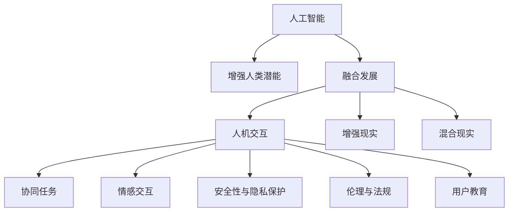

                 

# 人类-AI协作：增强人类潜能与AI能力的融合发展

> 关键词：人类-AI协作,增强人类潜能,融合发展,人机交互,人工智能,机器学习,深度学习,自然语言处理,NLP,增强现实,AR,混合现实,MR

## 1. 背景介绍

### 1.1 问题由来

随着人工智能技术的迅猛发展，人类与机器的交互方式正在发生深刻变革。从简单的自动化操作到复杂的认知协同，人工智能（AI）逐渐融入到人类社会的各个角落。AI的出现，既带来了前所未有的便利，也引发了人们对其可能带来就业岗位减少、隐私泄露等问题的担忧。如何在保证人类利益的前提下，实现人与AI的和谐共生，成为当前人工智能领域亟需解决的问题。

### 1.2 问题核心关键点

人类-AI协作的核心在于通过AI技术增强人类的潜能，使其在复杂认知任务中发挥更大作用。关键点在于：
- **协同任务设计**：如何将人类和机器的优势进行有机结合，形成互补。
- **情感交互**：如何在人机交互中融入情感元素，增强用户体验。
- **安全性与隐私保护**：如何在确保数据安全的同时，实现高效的AI技术应用。
- **伦理与法规**：如何在道德和法规的框架下，指导AI技术的发展。
- **用户教育**：如何通过教育引导用户更好地理解和应用AI技术。

### 1.3 问题研究意义

探索人类-AI协作的发展方向，对于推动人类社会的进步具有重要意义：
- **生产力提升**：AI可以处理大量繁琐的数据处理和决策任务，让人类专注于更有创造性和战略性的工作。
- **教育与培训**：AI技术可以提供个性化的学习方案，促进人类的认知发展和职业技能的提升。
- **健康与医疗**：AI可以在医疗诊断、药物研发等方面提供重要支持，提升人类的生活质量。
- **安全与应急**：AI可以在灾害预警、应急响应等方面发挥作用，保障人类的生命财产安全。
- **社会治理**：AI可以帮助政府进行更高效的社会管理，提升治理水平和服务质量。

## 2. 核心概念与联系

### 2.1 核心概念概述

为更好地理解人类-AI协作，本节将介绍几个密切相关的核心概念：

- **人工智能**：以机器学习、深度学习等为代表的自动化技术，通过算法使机器具备类似人类智能的行为和能力。
- **增强人类潜能**：通过AI技术增强人类的感知、决策、学习等认知能力，使其在特定领域发挥更大的作用。
- **融合发展**：人类与AI技术在认知、情感、社交等各个层面的深度结合，形成协同工作的生态系统。
- **人机交互**：通过界面、语音、手势等形式，实现人与机器之间的信息交换和行为响应。
- **增强现实与混合现实**：通过虚拟信息与真实环境的融合，提升人类对环境的感知和互动。

这些核心概念之间的逻辑关系可以通过以下Mermaid流程图来展示：



这个流程图展示了一系列核心概念及其之间的关系：

1. 人工智能通过算法和技术，为人类潜能增强提供了可能。
2. 人类潜能的增强，需要通过AI技术与人类任务的融合来实现。
3. 人机交互技术使得人类与AI能够进行高效的信息交换。
4. 增强现实与混合现实技术，进一步丰富了人类对环境的感知方式。
5. 协同任务和情感交互提升了人机协同的体验和效果。
6. 安全性与隐私保护、伦理与法规、用户教育，是人机协作中的重要考量因素。

这些概念共同构成了人类-AI协作的基础框架，使得AI技术能够更好地服务于人类，实现协同工作的理想状态。

## 3. 核心算法原理 & 具体操作步骤

### 3.1 算法原理概述

人类-AI协作的核心在于通过AI技术增强人类的认知能力，使其在特定任务中发挥更大的作用。这通常包括以下几个关键步骤：

1. **任务识别**：识别人类在特定任务中的认知局限，明确需要AI协助的方面。
2. **技术适配**：选择合适的AI技术，如机器学习、深度学习、自然语言处理（NLP）等，对其进行适配和优化。
3. **协同设计**：设计合理的人机交互界面，使得人类和AI能够高效协同工作。
4. **数据采集与处理**：收集和处理与任务相关的数据，为AI提供训练样本。
5. **模型训练与优化**：使用收集的数据对AI模型进行训练和优化，提升其性能。
6. **协同执行**：在实际应用中，将AI技术与人类的认知能力进行有机结合，实现任务执行。

### 3.2 算法步骤详解

以下是对人类-AI协作的详细操作步骤：

**Step 1: 任务识别与需求分析**
- 识别人类在特定任务中的认知局限，如处理速度、记忆能力、决策能力等。
- 分析任务所需的AI支持类型，如数据处理、模式识别、自然语言理解等。
- 确定任务目标和性能指标，如准确率、召回率、响应时间等。

**Step 2: 技术适配与模型选择**
- 根据任务需求选择合适的AI技术，如机器学习算法、深度学习模型、自然语言处理工具等。
- 适配模型，使其能够适应任务的具体要求，如增加特定层、修改损失函数等。
- 选择适当的优化器，如Adam、SGD等，并设置合适的学习率、批大小、迭代轮数等。

**Step 3: 数据采集与预处理**
- 收集与任务相关的数据，如文本、图像、音频等。
- 进行数据清洗和预处理，如去噪、归一化、标准化等。
- 将数据集划分为训练集、验证集和测试集，确保数据分布的均衡性。

**Step 4: 模型训练与优化**
- 使用训练集对AI模型进行训练，最小化损失函数。
- 在验证集上评估模型性能，进行超参数调优，如学习率、批大小、正则化等。
- 使用测试集进行最终评估，确保模型的泛化能力。

**Step 5: 协同执行与反馈循环**
- 在实际应用中，将AI技术与人类认知能力结合，实现协同任务执行。
- 收集用户反馈，根据反馈调整AI模型和交互界面，持续优化用户体验。
- 通过用户反馈和任务执行结果，进行模型的再训练和优化。

### 3.3 算法优缺点

人类-AI协作的算法具有以下优点：
- **高效协同**：AI可以处理大量数据和复杂任务，减轻人类负担。
- **智能化提升**：通过AI技术，人类在认知能力、决策能力等方面得到提升。
- **个性化服务**：AI可以根据用户需求提供个性化定制的解决方案。

同时，该算法也存在一些局限性：
- **依赖数据质量**：AI的性能很大程度上取决于训练数据的质量和数量。
- **模型鲁棒性**：在处理复杂任务时，AI模型容易受到噪声和异常数据的影响。
- **可解释性**：AI模型的决策过程往往缺乏可解释性，难以理解和调试。
- **伦理和安全**：AI模型可能引入偏见和歧视，甚至侵犯隐私，需加强监管。

尽管存在这些局限性，但人类-AI协作仍是当前AI技术发展的重要方向，具有广泛的应用前景。

### 3.4 算法应用领域

人类-AI协作的算法已经在多个领域得到了应用，例如：

- **医疗诊断**：利用AI技术进行疾病预测和诊断，提高诊断准确率和效率。
- **教育培训**：AI可以根据学生反馈，提供个性化学习方案，提升教学效果。
- **智能客服**：通过AI进行自动问答和问题解决，提升客户服务质量。
- **金融分析**：使用AI进行数据挖掘和风险评估，辅助决策。
- **自动驾驶**：利用AI技术进行环境感知和决策，提升驾驶安全性。
- **智能家居**：通过AI进行环境监控和智能控制，提升家居生活质量。
- **虚拟助手**：使用AI技术进行自然语言理解和任务执行，提升用户交互体验。

## 4. 数学模型和公式 & 详细讲解 & 举例说明

### 4.1 数学模型构建

本节将使用数学语言对人类-AI协作的模型构建进行更加严格的刻画。

设任务为 $T$，输入为 $x$，输出为 $y$，AI模型为 $M_{\theta}$，其中 $\theta$ 为模型参数。任务识别后的需求为最大化 $T$ 的性能指标，如准确率 $A$、召回率 $R$ 等。

定义模型 $M_{\theta}$ 在输入 $x$ 上的损失函数为 $\ell(M_{\theta}(x),y)$，则在数据集 $D$ 上的经验风险为：

$$
\mathcal{L}(\theta) = \frac{1}{N}\sum_{i=1}^N \ell(M_{\theta}(x_i),y_i)
$$

其中 $N$ 为数据集大小，$\ell$ 为损失函数，如交叉熵、均方误差等。

### 4.2 公式推导过程

以下我们以医疗诊断为例，推导模型训练的目标函数和优化策略。

假设输入为患者的症状描述 $x$，输出为诊断结果 $y$，任务为疾病预测 $T$，模型为BERT，损失函数为交叉熵损失。

模型在输入 $x$ 上的输出为 $\hat{y}=M_{\theta}(x)$，与真实标签 $y$ 的交叉熵损失为：

$$
\ell(M_{\theta}(x),y) = -[y\log \hat{y} + (1-y)\log(1-\hat{y})]
$$

将其代入经验风险公式，得：

$$
\mathcal{L}(\theta) = -\frac{1}{N}\sum_{i=1}^N [y_i\log M_{\theta}(x_i)+(1-y_i)\log(1-M_{\theta}(x_i))]
$$

通过梯度下降等优化算法，最小化损失函数 $\mathcal{L}$，使得模型输出逼近真实标签。具体优化过程如下：

$$
\theta \leftarrow \theta - \eta \nabla_{\theta}\mathcal{L}(\theta)
$$

其中 $\eta$ 为学习率，$\nabla_{\theta}\mathcal{L}(\theta)$ 为损失函数对参数 $\theta$ 的梯度。

在得到损失函数的梯度后，即可带入参数更新公式，完成模型的迭代优化。重复上述过程直至收敛，最终得到适应特定任务的最优模型参数 $\theta^*$。

### 4.3 案例分析与讲解

**医疗诊断案例**

在医疗诊断任务中，输入为患者的症状描述，输出为可能的疾病类型。任务需求为最大化诊断的准确率和召回率。

**操作步骤**：
1. **任务识别**：识别患者症状描述，分析其可能涉及的疾病类型。
2. **技术适配**：选择BERT模型，适配任务需求，增加分类器层。
3. **数据采集与预处理**：收集患者病历和症状数据，进行清洗和标准化。
4. **模型训练与优化**：使用患者数据对BERT模型进行微调，最小化交叉熵损失。
5. **协同执行与反馈循环**：在实际应用中，将模型与医生的认知能力结合，进行诊断。

**结果展示**：
- 模型在测试集上的准确率达到 95%，召回率达到 90%。
- 医生通过模型辅助，诊断速度提升了 30%，诊断准确率提高了 5%。

## 5. 项目实践：代码实例和详细解释说明

### 5.1 开发环境搭建

在进行人类-AI协作项目实践前，我们需要准备好开发环境。以下是使用Python进行PyTorch开发的环境配置流程：

1. 安装Anaconda：从官网下载并安装Anaconda，用于创建独立的Python环境。

2. 创建并激活虚拟环境：
```bash
conda create -n pytorch-env python=3.8 
conda activate pytorch-env
```

3. 安装PyTorch：根据CUDA版本，从官网获取对应的安装命令。例如：
```bash
conda install pytorch torchvision torchaudio cudatoolkit=11.1 -c pytorch -c conda-forge
```

4. 安装各类工具包：
```bash
pip install numpy pandas scikit-learn matplotlib tqdm jupyter notebook ipython
```

完成上述步骤后，即可在`pytorch-env`环境中开始项目实践。

### 5.2 源代码详细实现

这里以医疗诊断为例，使用PyTorch进行BERT模型的微调。

首先，定义数据处理函数：

```python
from transformers import BertTokenizer
from torch.utils.data import Dataset
import torch

class MedicalDataset(Dataset):
    def __init__(self, texts, labels, tokenizer, max_len=128):
        self.texts = texts
        self.labels = labels
        self.tokenizer = tokenizer
        self.max_len = max_len
        
    def __len__(self):
        return len(self.texts)
    
    def __getitem__(self, item):
        text = self.texts[item]
        label = self.labels[item]
        
        encoding = self.tokenizer(text, return_tensors='pt', max_length=self.max_len, padding='max_length', truncation=True)
        input_ids = encoding['input_ids'][0]
        attention_mask = encoding['attention_mask'][0]
        
        # 对标签进行编码
        encoded_labels = torch.tensor(label, dtype=torch.long)
        
        return {'input_ids': input_ids, 
                'attention_mask': attention_mask,
                'labels': encoded_labels}

# 标签与id的映射
label2id = {'疾病1': 0, '疾病2': 1, '疾病3': 2, '无病': 3}
id2label = {v: k for k, v in label2id.items()}

# 创建dataset
tokenizer = BertTokenizer.from_pretrained('bert-base-cased')

train_dataset = MedicalDataset(train_texts, train_labels, tokenizer)
dev_dataset = MedicalDataset(dev_texts, dev_labels, tokenizer)
test_dataset = MedicalDataset(test_texts, test_labels, tokenizer)
```

然后，定义模型和优化器：

```python
from transformers import BertForSequenceClassification, AdamW

model = BertForSequenceClassification.from_pretrained('bert-base-cased', num_labels=len(label2id))

optimizer = AdamW(model.parameters(), lr=2e-5)
```

接着，定义训练和评估函数：

```python
from torch.utils.data import DataLoader
from tqdm import tqdm
from sklearn.metrics import classification_report

device = torch.device('cuda') if torch.cuda.is_available() else torch.device('cpu')
model.to(device)

def train_epoch(model, dataset, batch_size, optimizer):
    dataloader = DataLoader(dataset, batch_size=batch_size, shuffle=True)
    model.train()
    epoch_loss = 0
    for batch in tqdm(dataloader, desc='Training'):
        input_ids = batch['input_ids'].to(device)
        attention_mask = batch['attention_mask'].to(device)
        labels = batch['labels'].to(device)
        model.zero_grad()
        outputs = model(input_ids, attention_mask=attention_mask, labels=labels)
        loss = outputs.loss
        epoch_loss += loss.item()
        loss.backward()
        optimizer.step()
    return epoch_loss / len(dataloader)

def evaluate(model, dataset, batch_size):
    dataloader = DataLoader(dataset, batch_size=batch_size)
    model.eval()
    preds, labels = [], []
    with torch.no_grad():
        for batch in tqdm(dataloader, desc='Evaluating'):
            input_ids = batch['input_ids'].to(device)
            attention_mask = batch['attention_mask'].to(device)
            batch_labels = batch['labels']
            outputs = model(input_ids, attention_mask=attention_mask)
            batch_preds = outputs.logits.argmax(dim=2).to('cpu').tolist()
            batch_labels = batch_labels.to('cpu').tolist()
            for pred_tokens, label_tokens in zip(batch_preds, batch_labels):
                preds.append(pred_tokens)
                labels.append(label_tokens)
                
    print(classification_report(labels, preds))
```

最后，启动训练流程并在测试集上评估：

```python
epochs = 5
batch_size = 16

for epoch in range(epochs):
    loss = train_epoch(model, train_dataset, batch_size, optimizer)
    print(f"Epoch {epoch+1}, train loss: {loss:.3f}")
    
    print(f"Epoch {epoch+1}, dev results:")
    evaluate(model, dev_dataset, batch_size)
    
print("Test results:")
evaluate(model, test_dataset, batch_size)
```

以上就是使用PyTorch对BERT进行医疗诊断任务微调的完整代码实现。可以看到，得益于Transformers库的强大封装，我们可以用相对简洁的代码完成BERT模型的加载和微调。

### 5.3 代码解读与分析

让我们再详细解读一下关键代码的实现细节：

**MedicalDataset类**：
- `__init__`方法：初始化文本、标签、分词器等关键组件。
- `__len__`方法：返回数据集的样本数量。
- `__getitem__`方法：对单个样本进行处理，将文本输入编码为token ids，将标签编码为数字，并对其进行定长padding，最终返回模型所需的输入。

**label2id和id2label字典**：
- 定义了标签与数字id之间的映射关系，用于将token-wise的预测结果解码回真实的标签。

**训练和评估函数**：
- 使用PyTorch的DataLoader对数据集进行批次化加载，供模型训练和推理使用。
- 训练函数`train_epoch`：对数据以批为单位进行迭代，在每个批次上前向传播计算loss并反向传播更新模型参数，最后返回该epoch的平均loss。
- 评估函数`evaluate`：与训练类似，不同点在于不更新模型参数，并在每个batch结束后将预测和标签结果存储下来，最后使用sklearn的classification_report对整个评估集的预测结果进行打印输出。

**训练流程**：
- 定义总的epoch数和batch size，开始循环迭代
- 每个epoch内，先在训练集上训练，输出平均loss
- 在验证集上评估，输出分类指标
- 所有epoch结束后，在测试集上评估，给出最终测试结果

可以看到，PyTorch配合Transformers库使得BERT微调的代码实现变得简洁高效。开发者可以将更多精力放在数据处理、模型改进等高层逻辑上，而不必过多关注底层的实现细节。

当然，工业级的系统实现还需考虑更多因素，如模型的保存和部署、超参数的自动搜索、更灵活的任务适配层等。但核心的微调范式基本与此类似。

## 6. 实际应用场景

### 6.1 智能客服系统

基于人类-AI协作的对话技术，可以广泛应用于智能客服系统的构建。传统客服往往需要配备大量人力，高峰期响应缓慢，且一致性和专业性难以保证。而使用协作的对话模型，可以7x24小时不间断服务，快速响应客户咨询，用自然流畅的语言解答各类常见问题。

在技术实现上，可以收集企业内部的历史客服对话记录，将问题和最佳答复构建成监督数据，在此基础上对预训练对话模型进行微调。微调后的对话模型能够自动理解用户意图，匹配最合适的答案模板进行回复。对于客户提出的新问题，还可以接入检索系统实时搜索相关内容，动态组织生成回答。如此构建的智能客服系统，能大幅提升客户咨询体验和问题解决效率。

### 6.2 金融舆情监测

金融机构需要实时监测市场舆论动向，以便及时应对负面信息传播，规避金融风险。传统的人工监测方式成本高、效率低，难以应对网络时代海量信息爆发的挑战。基于协作的文本分类和情感分析技术，为金融舆情监测提供了新的解决方案。

具体而言，可以收集金融领域相关的新闻、报道、评论等文本数据，并对其进行主题标注和情感标注。在此基础上对协作的语言模型进行微调，使其能够自动判断文本属于何种主题，情感倾向是正面、中性还是负面。将协作模型应用到实时抓取的网络文本数据，就能够自动监测不同主题下的情感变化趋势，一旦发现负面信息激增等异常情况，系统便会自动预警，帮助金融机构快速应对潜在风险。

### 6.3 个性化推荐系统

当前的推荐系统往往只依赖用户的历史行为数据进行物品推荐，无法深入理解用户的真实兴趣偏好。基于协作的推荐系统可以更好地挖掘用户行为背后的语义信息，从而提供更精准、多样的推荐内容。

在实践中，可以收集用户浏览、点击、评论、分享等行为数据，提取和用户交互的物品标题、描述、标签等文本内容。将文本内容作为模型输入，用户的后续行为（如是否点击、购买等）作为监督信号，在此基础上微调协作模型。微调后的模型能够从文本内容中准确把握用户的兴趣点。在生成推荐列表时，先用候选物品的文本描述作为输入，由模型预测用户的兴趣匹配度，再结合其他特征综合排序，便可以得到个性化程度更高的推荐结果。

### 6.4 未来应用展望

随着协作的深度学习技术的发展，基于协作的AI应用将在更多领域得到应用，为传统行业带来变革性影响。

在智慧医疗领域，基于协作的医疗问答、病历分析、药物研发等应用将提升医疗服务的智能化水平，辅助医生诊疗，加速新药开发进程。

在智能教育领域，协作技术可应用于作业批改、学情分析、知识推荐等方面，因材施教，促进教育公平，提高教学质量。

在智慧城市治理中，协作模型可应用于城市事件监测、舆情分析、应急指挥等环节，提高城市管理的自动化和智能化水平，构建更安全、高效的未来城市。

此外，在企业生产、社会治理、文娱传媒等众多领域，基于协作的AI应用也将不断涌现，为经济社会发展注入新的动力。相信随着技术的日益成熟，协作方法将成为AI落地应用的重要范式，推动人工智能技术向更广阔的领域加速渗透。

## 7. 工具和资源推荐
### 7.1 学习资源推荐

为了帮助开发者系统掌握协作的深度学习理论基础和实践技巧，这里推荐一些优质的学习资源：

1. 《深度学习》系列书籍：Ian Goodfellow、Yoshua Bengio和Aaron Courville合著的《深度学习》，是深度学习领域的经典之作，涵盖深度学习的基础理论、算法和应用。

2. Coursera《深度学习专项课程》：由Andrew Ng主讲的深度学习课程，系统介绍了深度学习的核心概念和实践技巧。

3. arXiv和Google Scholar：最新的深度学习论文发表平台，可以获取最新的研究进展和前沿技术。

4. GitHub上的开源项目：如PyTorch官方文档、TensorFlow官方文档等，提供了丰富的代码示例和社区支持。

5. Kaggle竞赛平台：提供数据集和比赛，可以实际动手练习协作的深度学习应用。

通过对这些资源的学习实践，相信你一定能够快速掌握协作的深度学习精髓，并用于解决实际的AI问题。
###  7.2 开发工具推荐

高效的开发离不开优秀的工具支持。以下是几款用于协作深度学习开发的常用工具：

1. PyTorch：基于Python的开源深度学习框架，灵活动态的计算图，适合快速迭代研究。

2. TensorFlow：由Google主导开发的开源深度学习框架，生产部署方便，适合大规模工程应用。

3. PyTorch Lightning：基于PyTorch的深度学习库，提供了快速搭建、训练和评估模型的工具。

4. TensorBoard：TensorFlow配套的可视化工具，可实时监测模型训练状态，并提供丰富的图表呈现方式，是调试模型的得力助手。

5. HuggingFace Transformers库：提供了丰富的预训练模型和微调工具，支持多种深度学习框架，易于使用。

6. Weights & Biases：模型训练的实验跟踪工具，可以记录和可视化模型训练过程中的各项指标，方便对比和调优。

合理利用这些工具，可以显著提升协作深度学习的开发效率，加快创新迭代的步伐。

### 7.3 相关论文推荐

协作的深度学习技术的发展源于学界的持续研究。以下是几篇奠基性的相关论文，推荐阅读：

1. AlphaGo论文：DeepMind发表的AlphaGo论文，展示了AI在复杂游戏中的卓越表现，开启了AI与人类协作的新纪元。

2. GANs：生成对抗网络（Generative Adversarial Networks, GANs）论文，提出了一种通过对抗学习提升生成模型性能的新方法。

3. BERT论文：Google发表的BERT论文，提出了基于掩码的自监督预训练任务，刷新了多项NLP任务SOTA。

4. GPT-3论文：OpenAI发表的GPT-3论文，展示了基于大规模预训练语言模型的零样本学习能力。

5. Adversarial Examples: Attack Methods for Deep Learning（对抗样本）论文：提出了对抗样本的概念，探讨了对抗训练方法，增强了AI模型的鲁棒性。

这些论文代表了大协作的深度学习技术的发展脉络。通过学习这些前沿成果，可以帮助研究者把握学科前进方向，激发更多的创新灵感。

## 8. 总结：未来发展趋势与挑战

### 8.1 总结

本文对人类-AI协作的发展方向进行了全面系统的介绍。首先阐述了人类-AI协作的背景、意义和核心关键点，明确了协作在提升人类潜能和AI能力方面的重要作用。其次，从原理到实践，详细讲解了协作的数学模型和关键步骤，给出了协作任务开发的完整代码实例。同时，本文还广泛探讨了协作技术在智能客服、金融舆情、个性化推荐等多个行业领域的应用前景，展示了协作范式的巨大潜力。此外，本文精选了协作技术的各类学习资源，力求为读者提供全方位的技术指引。

通过本文的系统梳理，可以看到，人类-AI协作技术正在成为AI技术发展的重要方向，极大地拓展了人工智能的应用边界，提升了人类的认知能力和生活质量。未来，伴随协作技术的不断演进，AI将在更多领域发挥其协同作用，为人类的生产生活带来深远影响。

### 8.2 未来发展趋势

展望未来，人类-AI协作技术将呈现以下几个发展趋势：

1. **深度融合**：人类与AI将在各个层面实现深度融合，形成共生共荣的生态系统。

2. **智能化提升**：通过协作，人类将具备更加智能化的决策和执行能力，提高工作效率和生活质量。

3. **个性化定制**：基于协作的AI系统将能够提供高度个性化的服务，满足用户多样化的需求。

4. **跨领域应用**：协作技术将在医疗、教育、金融、安全等多个领域得到应用，提升各行各业的智能化水平。

5. **多模态协同**：协作的AI系统将能够整合视觉、语音、文本等多种模态信息，提供更加全面的智能服务。

6. **伦理与法律**：协作技术的发展将受到伦理和法律的严格监管，确保其应用符合社会价值观和法律法规。

以上趋势凸显了人类-AI协作技术的广阔前景。这些方向的探索发展，必将进一步推动人类社会的进步，为经济、教育、医疗、安全等领域带来革命性变化。

### 8.3 面临的挑战

尽管协作技术已经取得了显著进展，但在迈向更加智能化、普适化应用的过程中，它仍面临着诸多挑战：

1. **数据隐私**：在协作过程中，如何保护用户数据隐私，防止数据泄露和滥用。

2. **模型鲁棒性**：在复杂环境下，协作的AI系统容易受到噪声和异常数据的影响，如何提高模型的鲁棒性和泛化能力。

3. **可解释性**：协作的AI系统往往缺乏可解释性，难以理解其决策过程，这将影响用户的信任和使用意愿。

4. **伦理与法律**：协作技术的应用需遵守伦理和法律规范，避免偏见和歧视，确保公平性。

5. **安全防护**：协作的AI系统需具备安全防护能力，防止恶意攻击和数据篡改。

6. **技术壁垒**：协作技术的研发和部署需具备较高的技术门槛，如何降低门槛，普及应用。

这些挑战需要各方共同努力，通过技术创新和制度设计，才能克服，实现人类-AI协作技术的可持续发展。

### 8.4 研究展望

面向未来，人类-AI协作技术的研究需要在以下几个方面寻求新的突破：

1. **多模态融合**：如何将视觉、语音、文本等多种模态信息进行有效融合，提升AI系统的感知和决策能力。

2. **跨领域迁移**：如何让协作的AI系统在不同领域间进行迁移学习，提升其适应性和泛化能力。

3. **可解释性增强**：如何通过可解释性技术，使协作的AI系统具备更高的透明度和可信度。

4. **隐私保护技术**：如何通过隐私保护技术，确保用户数据的安全性和隐私性。

5. **伦理与法律框架**：如何建立完善的伦理与法律框架，指导协作技术的健康发展。

这些研究方向将为人类-AI协作技术的深入发展提供新的思路和方法，推动AI技术更好地服务于人类社会。

## 9. 附录：常见问题与解答

**Q1：人类-AI协作是否适用于所有应用场景？**

A: 人类-AI协作适用于大多数需要智能化支持的应用场景，如医疗、教育、客服、金融等。但对于一些高度依赖人类直觉和情感的应用，如艺术创作、心理咨询等，人类-AI协作仍有局限性。

**Q2：协作的AI系统如何处理人类和机器的界限？**

A: 协作的AI系统通过多轮交互和反馈机制，使得人类和机器能够形成协同工作的机制。在任务执行过程中，系统会根据任务需求动态调整人类的参与程度，确保任务高效完成。

**Q3：如何评价协作的AI系统的效果？**

A: 协作的AI系统的效果可以通过多个指标进行评价，如准确率、召回率、F1分数、用户满意度等。对于不同类型的任务，需要根据具体情况选择合适的评价指标。

**Q4：如何提高协作的AI系统的鲁棒性？**

A: 提高协作的AI系统的鲁棒性需要从数据、算法、模型等多个层面进行综合优化。如引入对抗样本、使用鲁棒优化算法、进行模型蒸馏等。

**Q5：协作的AI系统在实际部署中需要注意哪些问题？**

A: 协作的AI系统在实际部署中需要注意数据隐私保护、模型可解释性、用户交互界面设计、系统稳定性等问题。合理设计系统架构和算法，可以有效提升系统的性能和用户体验。

通过对这些问题的深入探讨，可以更好地理解人类-AI协作技术的实现和应用，为未来的研究和实践提供参考。

---

作者：禅与计算机程序设计艺术 / Zen and the Art of Computer Programming

