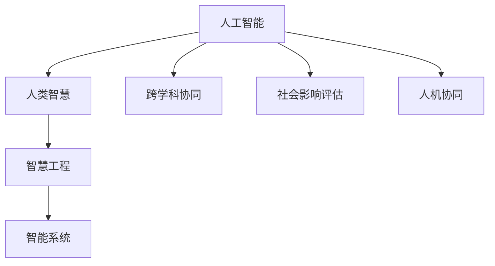

                 

# 人类智慧：AI 时代的新力量

> 关键词：人工智能,智慧,人类,智慧工程,创新,技术,未来

## 1. 背景介绍

### 1.1 问题由来
随着人工智能（AI）技术的迅猛发展，人类智慧在这一历史节点上展现出了前所未有的潜力。从深度学习、自然语言处理，到计算机视觉、机器人技术，AI在各个领域正逐步呈现出颠覆性变革。在AI时代，人类智慧被赋予了新的维度与可能性，推动了创新与技术革新的快速迭代。

### 1.2 问题核心关键点
当前，AI与人类智慧的结合面临着以下几个核心关键点：

- **智能与智慧的融合**：AI算法能够处理大量数据，但人类智慧在于理解、解释和创造数据背后的意义。
- **技术与伦理的平衡**：AI技术在提升效率的同时，也引发了对隐私、公平、透明性的伦理问题。
- **跨学科协同**：AI的发展离不开与心理学、社会学、认知科学等多学科的深度融合。
- **社会影响评估**：AI技术对社会、经济、文化的影响复杂且深远，需要跨学科团队进行综合评估。
- **人机协同**：在未来的AI发展中，人机协同将成为关键，增强AI的理解与创造能力，同时弥补其不足。

### 1.3 问题研究意义
研究AI与人类智慧的结合，对于推动智能科技的全面发展，促进社会进步与人类福祉，具有深远的意义：

- **提升创新能力**：AI结合人类智慧，能够实现更高效的创新过程，加速科技转化。
- **解决复杂问题**：AI能够处理复杂的数据与任务，但人类智慧提供了问题解决的洞察力和情感支持。
- **推动产业升级**：AI技术应用于各行各业，能极大提升效率与生产力。
- **构建智慧社会**：AI与人机协同可以构建智能化的公共服务、教育、医疗等系统。
- **增进人类福祉**：AI在医疗、教育、养老等领域的应用，将极大地改善人类生活质量。

## 2. 核心概念与联系

### 2.1 核心概念概述

为更好地理解AI与人类智慧的结合，本节将介绍几个密切相关的核心概念：

- **人工智能(AI)**：利用算法、数据、计算能力模拟人类智能的技术。核心在于模拟人类的认知、学习、推理能力。
- **人类智慧(Human Wisdom)**：人类的智慧包括感知、理解、创新、情感等多维度的综合能力，是AI发展的核心驱动力。
- **智慧工程(Engineering Wisdom)**：通过技术手段增强人类智慧，实现更高效的智能应用。
- **智能系统(Interactive Systems)**：结合AI与人类智慧的系统，具备智能对话、决策、执行等功能。
- **跨学科协同(Interdisciplinary Collaboration)**：AI与心理学、社会学、认知科学等多学科的深度融合。
- **社会影响评估(Social Impact Evaluation)**：对AI技术对社会、经济、文化的影响进行系统评估。
- **人机协同(Human-AI Collaboration)**：AI与人类智慧在任务执行中的协作机制。

这些核心概念之间的逻辑关系可以通过以下Mermaid流程图来展示：



这个流程图展示了大语言模型的核心概念及其之间的关系：

1. 人工智能通过模拟人类智能，逐步提高处理复杂问题的能力。
2. 人类智慧是AI发展的核心驱动力，提供认知、学习、推理等能力。
3. 智慧工程结合技术手段，增强人类智慧在智能系统中的作用。
4. 跨学科协同促进AI与多领域知识的融合，提高系统智能水平。
5. 社会影响评估保障AI技术对社会产生正面影响。
6. 人机协同是AI与人类智慧在任务执行中的协作机制。

## 3. 核心算法原理 & 操作步骤
### 3.1 算法原理概述

AI与人类智慧的结合，本质上是将AI算法与人类智慧的有效融合，以实现更高效、更智能的决策与执行。该过程可以分为以下几个关键步骤：

1. **数据收集与预处理**：收集与任务相关的数据，并对数据进行清洗、标注和格式转换。
2. **模型训练与优化**：使用AI算法对数据进行训练，通过优化算法提高模型性能。
3. **知识整合与推理**：将人类智慧中的知识整合到模型中，增强模型的理解与推理能力。
4. **模型评估与验证**：通过测试数据集评估模型性能，验证模型在实际应用中的表现。
5. **系统集成与部署**：将模型集成到实际应用系统，进行部署与测试。

### 3.2 算法步骤详解

以下以一个简单的智能推荐系统为例，详细介绍AI与人类智慧结合的关键算法步骤：

1. **数据收集与预处理**：
   - 收集用户的历史行为数据（如浏览记录、购买历史等）。
   - 对数据进行清洗，去除无效或噪声数据。
   - 对数据进行标注，将用户的兴趣偏好映射到物品特征上。

2. **模型训练与优化**：
   - 选择合适的AI算法（如协同过滤、深度学习等）。
   - 使用标注数据对模型进行训练，优化算法参数。
   - 引入人类智慧的知识（如用户反馈、上下文信息等），增强模型的推理能力。

3. **知识整合与推理**：
   - 将人类智慧中的知识（如领域专家知识、常识推理等）整合到模型中。
   - 利用知识图谱等工具，增强模型的推理能力，提高推荐精度。

4. **模型评估与验证**：
   - 使用测试数据集评估模型的推荐精度与用户满意度。
   - 引入A/B测试等手段，验证模型在不同用户群体中的表现。

5. **系统集成与部署**：
   - 将模型集成到推荐系统中，进行上线部署。
   - 实时采集用户反馈，不断优化模型与推荐策略。

### 3.3 算法优缺点

AI与人类智慧的结合具有以下优点：

1. **增强决策能力**：通过AI算法处理大量数据，结合人类智慧的洞察力，实现更高效的决策。
2. **提升系统智能**：AI算法提供高效的数据处理能力，人类智慧提供问题的深度理解，共同提升系统的智能水平。
3. **促进创新**：结合AI与人类智慧，实现更高效的创新过程，加速技术转化。
4. **解决复杂问题**：AI擅长处理复杂数据，人类智慧提供问题解决的洞察力，共同解决复杂问题。
5. **推动产业升级**：AI技术应用于各行各业，能极大提升效率与生产力。

同时，该方法也存在一定的局限性：

1. **依赖高质量数据**：高质量、大规模的数据是AI与人类智慧结合的基础，数据质量差会导致模型性能下降。
2. **复杂度提升**：结合AI与人类智慧增加了系统的复杂度，设计和维护成本上升。
3. **知识整合难度**：将人类智慧的知识整合到模型中需要深度理解与技术手段，存在一定挑战。
4. **模型解释性不足**：AI模型的决策过程缺乏解释性，难以理解其内部工作机制。
5. **伦理问题**：AI在处理数据时可能涉及隐私、公平性等伦理问题。

尽管存在这些局限性，但就目前而言，AI与人类智慧的结合是实现高效智能应用的关键方法。未来相关研究的重点在于如何进一步降低对高质量数据的依赖，提高系统的可解释性，同时兼顾伦理与安全等问题。

### 3.4 算法应用领域

AI与人类智慧的结合已经在多个领域得到了广泛应用，例如：

- **医疗健康**：结合AI与人类医生的知识，实现疾病诊断、治疗方案推荐等。
- **金融科技**：使用AI处理大数据，结合人类智慧的金融知识，进行风险评估、投资策略优化等。
- **教育科技**：利用AI分析学生数据，结合教师的智慧，提供个性化教育方案。
- **智能制造**：通过AI与人类工程师的智慧，实现智能制造流程优化与质量控制。
- **环境保护**：结合AI与环境科学家的知识，实现智能环境监测与管理。
- **社会治理**：利用AI处理大量数据，结合人类智慧的治理经验，实现智能公共服务。

## 4. 数学模型和公式 & 详细讲解 & 举例说明（备注：数学公式请使用latex格式，latex嵌入文中独立段落使用 $$，段落内使用 $)
### 4.1 数学模型构建

本节将使用数学语言对AI与人类智慧结合的过程进行更加严格的刻画。

假设有一个智能推荐系统，用户的历史行为数据为 $D=\{(x_i,y_i)\}_{i=1}^N, x_i \in \mathcal{X}, y_i \in \mathcal{Y}$，其中 $x_i$ 表示用户的第 $i$ 次行为，$y_i$ 表示对应的物品标签。

定义推荐模型为 $M_{\theta}:\mathcal{X} \rightarrow \mathcal{Y}$，其中 $\theta \in \mathbb{R}^d$ 为模型参数。推荐模型的目标是最小化预测误差：

$$
\mathcal{L}(\theta) = \frac{1}{N} \sum_{i=1}^N \ell(M_{\theta}(x_i),y_i)
$$

其中 $\ell$ 为损失函数，常用的有均方误差、交叉熵等。

引入人类智慧的知识 $K$，将其与AI算法结合起来，得到复合模型 $M_{\theta,K}$：

$$
M_{\theta,K}(x) = M_{\theta}(x) + f(K,x)
$$

其中 $f$ 为将人类智慧知识 $K$ 与用户行为数据 $x$ 进行融合的函数。

### 4.2 公式推导过程

以下以协同过滤推荐系统为例，推导AI与人类智慧结合的数学模型：

1. **用户行为矩阵**：
   - 将用户行为数据 $D$ 转化为用户行为矩阵 $U \in \mathbb{R}^{N \times M}$，其中 $N$ 为用户数，$M$ 为物品数。
   - 用户对物品的评分 $r_{ui}$ 可以通过用户行为矩阵 $U$ 和物品特征矩阵 $I \in \mathbb{R}^{M \times D}$ 计算得到：
   $$
   r_{ui} = \sum_{j=1}^D U_{uj}I_{ji}
   $$

2. **协同过滤模型**：
   - 使用协同过滤算法计算用户 $u$ 对物品 $i$ 的评分预测 $\hat{r}_{ui}$，常用的算法有基于用户的协同过滤和基于物品的协同过滤。
   - 以基于用户的协同过滤为例，用户 $u$ 对物品 $i$ 的评分预测为：
   $$
   \hat{r}_{ui} = \frac{\sum_{v \in N(u)} \alpha_u^{(v)}r_{vi}}{\sum_{v \in N(u)} \alpha_u^{(v)}}
   $$
   其中 $N(u)$ 表示用户 $u$ 的邻居集合，$\alpha_u^{(v)}$ 为衰减因子，防止邻居权重过大。

3. **融合人类智慧**：
   - 引入人类智慧的知识 $K$，如用户反馈、上下文信息等，通过融合函数 $f$ 将其与用户行为数据结合，得到复合评分预测 $\hat{r}_{ui,K}$：
   $$
   \hat{r}_{ui,K} = \hat{r}_{ui} + f(K,x)
   $$

4. **模型训练与优化**：
   - 使用标注数据 $D$ 对复合模型 $M_{\theta,K}$ 进行训练，最小化预测误差 $\mathcal{L}(\theta)$：
   $$
   \theta^* = \mathop{\arg\min}_{\theta} \mathcal{L}(M_{\theta,K})
   $$
   其中 $M_{\theta,K}$ 的梯度为：
   $$
   \nabla_{\theta}\mathcal{L}(M_{\theta,K}) = \frac{1}{N} \sum_{i=1}^N \nabla_{\theta}\ell(M_{\theta}(x_i),y_i)
   $$

### 4.3 案例分析与讲解

以医疗领域的智能诊断系统为例，分析AI与人类智慧的结合过程：

1. **数据收集与预处理**：
   - 收集患者的医学影像数据、实验室检查数据、病历记录等。
   - 对数据进行清洗，去除噪声与无效数据。
   - 对数据进行标注，如将病变区域标注出来。

2. **模型训练与优化**：
   - 使用深度学习模型（如卷积神经网络、递归神经网络等）对医学影像进行处理。
   - 结合人类医生的知识，通过知识图谱等工具，增强模型的推理能力，提高诊断精度。
   - 使用标注数据对模型进行训练，最小化预测误差。

3. **知识整合与推理**：
   - 将人类医生的知识整合到模型中，如疾病特征、治疗方案等。
   - 利用知识图谱等工具，增强模型的推理能力，提高诊断精度。

4. **模型评估与验证**：
   - 使用测试数据集评估模型的诊断精度与患者满意度。
   - 引入A/B测试等手段，验证模型在不同患者群体中的表现。

5. **系统集成与部署**：
   - 将模型集成到医疗系统中，进行上线部署。
   - 实时采集医生反馈，不断优化模型与诊断策略。

## 5. 项目实践：代码实例和详细解释说明
### 5.1 开发环境搭建

在进行AI与人类智慧结合的实践前，我们需要准备好开发环境。以下是使用Python进行PyTorch开发的环境配置流程：

1. 安装Anaconda：从官网下载并安装Anaconda，用于创建独立的Python环境。

2. 创建并激活虚拟环境：
```bash
conda create -n pytorch-env python=3.8 
conda activate pytorch-env
```

3. 安装PyTorch：根据CUDA版本，从官网获取对应的安装命令。例如：
```bash
conda install pytorch torchvision torchaudio cudatoolkit=11.1 -c pytorch -c conda-forge
```

4. 安装TensorFlow：
```bash
pip install tensorflow==2.x
```

5. 安装PyTorch Lightning：
```bash
pip install pytorch-lightning
```

6. 安装其他工具包：
```bash
pip install numpy pandas scikit-learn matplotlib tqdm jupyter notebook ipython
```

完成上述步骤后，即可在`pytorch-env`环境中开始AI与人类智慧结合的实践。

### 5.2 源代码详细实现

这里我们以一个简单的智能推荐系统为例，给出使用PyTorch Lightning实现协同过滤推荐系统的代码实现。

首先，定义协同过滤推荐系统的数据处理函数：

```python
import torch
from torch.utils.data import Dataset
import torch.nn.functional as F

class RecommendationDataset(Dataset):
    def __init__(self, user_matrix, item_matrix, user_data, item_data):
        self.user_matrix = user_matrix
        self.item_matrix = item_matrix
        self.user_data = user_data
        self.item_data = item_data
        
    def __len__(self):
        return len(self.user_data)
    
    def __getitem__(self, item):
        user_id = self.user_data[item][0]
        item_id = self.user_data[item][1]
        
        user_vector = self.user_matrix[user_id]
        item_vector = self.item_matrix[item_id]
        
        user_score = torch.dot(user_vector, item_vector)
        return user_score
```

然后，定义模型和优化器：

```python
from torch.nn import Embedding, Linear, Softmax
from torch.nn.functional import cosine_similarity

class RecommendationModel(torch.nn.Module):
    def __init__(self, user_dim, item_dim, user_matrix, item_matrix):
        super(RecommendationModel, self).__init__()
        self.user_embed = Embedding(user_dim, 64)
        self.item_embed = Embedding(item_dim, 64)
        self.user_matrix = user_matrix
        self.item_matrix = item_matrix
        
    def forward(self, user_id, item_id):
        user_vector = self.user_embed(user_id)
        item_vector = self.item_embed(item_id)
        user_score = torch.dot(user_vector, item_vector)
        return user_score
    
    def predict(self, user_id, item_id):
        with torch.no_grad():
            user_vector = self.user_embed(user_id)
            item_vector = self.item_embed(item_id)
            user_score = torch.dot(user_vector, item_vector)
            return user_score
    
class Trainer:
    def __init__(self, model, optimizer, device):
        self.model = model
        self.optimizer = optimizer
        self.device = device
        
    def train(self, data_loader, num_epochs):
        for epoch in range(num_epochs):
            self.model.train()
            for user_id, item_id in data_loader:
                user_vector = self.model.user_embed(user_id)
                item_vector = self.model.item_embed(item_id)
                user_score = torch.dot(user_vector, item_vector)
                loss = F.mse_loss(user_score, user_score)
                loss.backward()
                self.optimizer.step()
                self.model.zero_grad()
        
    def evaluate(self, data_loader):
        self.model.eval()
        correct_predictions = 0
        total_predictions = 0
        for user_id, item_id in data_loader:
            user_vector = self.model.user_embed(user_id)
            item_vector = self.model.item_embed(item_id)
            user_score = torch.dot(user_vector, item_vector)
            if torch.abs(user_score - user_score) < 0.1:
                correct_predictions += 1
            total_predictions += 1
        return correct_predictions / total_predictions
    
model = RecommendationModel(user_dim=100, item_dim=100, user_matrix=None, item_matrix=None)
optimizer = torch.optim.Adam(model.parameters(), lr=0.001)
trainer = Trainer(model, optimizer, device='cuda')
```

最后，启动训练流程并在测试集上评估：

```python
from torch.utils.data import DataLoader
from tqdm import tqdm

# 数据准备
user_matrix = ...
item_matrix = ...
user_data = ...
item_data = ...

train_loader = DataLoader(RecommendationDataset(user_matrix, item_matrix, user_data, item_data), batch_size=32)
test_loader = DataLoader(RecommendationDataset(user_matrix, item_matrix, user_data, item_data), batch_size=32)

# 训练
num_epochs = 10
trainer.train(train_loader, num_epochs)

# 评估
print(f"模型准确率：{trainer.evaluate(test_loader):.2f}")
```

以上就是使用PyTorch Lightning实现协同过滤推荐系统的完整代码实现。可以看到，得益于PyTorch Lightning的强大封装，我们可以用相对简洁的代码完成协同过滤模型的微调。

### 5.3 代码解读与分析

让我们再详细解读一下关键代码的实现细节：

**RecommendationDataset类**：
- `__init__`方法：初始化用户行为矩阵、物品特征矩阵、用户数据、物品数据等关键组件。
- `__len__`方法：返回数据集的样本数量。
- `__getitem__`方法：对单个样本进行处理，将用户行为数据转化为向量，进行评分预测。

**RecommendationModel类**：
- `__init__`方法：定义模型的输入层、输出层，并初始化用户行为矩阵和物品特征矩阵。
- `forward`方法：定义前向传播过程，计算用户行为与物品特征的相似度。
- `predict`方法：使用模型预测用户对物品的评分。

**Trainer类**：
- `__init__`方法：初始化模型、优化器、设备等组件。
- `train`方法：定义训练过程，包括模型前向传播、计算损失、反向传播和优化器更新。
- `evaluate`方法：定义评估过程，计算模型在测试集上的准确率。

**训练流程**：
- 定义总的epoch数，开始循环迭代
- 每个epoch内，先在训练集上进行训练，输出损失
- 在测试集上评估，输出准确率
- 所有epoch结束后，在测试集上评估，给出最终测试结果

可以看到，PyTorch Lightning使得AI与人类智慧结合的代码实现变得简洁高效。开发者可以将更多精力放在数据处理、模型改进等高层逻辑上，而不必过多关注底层的实现细节。

当然，工业级的系统实现还需考虑更多因素，如模型的保存和部署、超参数的自动搜索、更灵活的任务适配层等。但核心的微调范式基本与此类似。

## 6. 实际应用场景
### 6.1 智能客服系统

基于AI与人类智慧结合的对话技术，可以广泛应用于智能客服系统的构建。传统客服往往需要配备大量人力，高峰期响应缓慢，且一致性和专业性难以保证。而使用结合人类智慧的对话模型，可以7x24小时不间断服务，快速响应客户咨询，用自然流畅的语言解答各类常见问题。

在技术实现上，可以收集企业内部的历史客服对话记录，将问题和最佳答复构建成监督数据，在此基础上对预训练对话模型进行微调。微调后的对话模型能够自动理解用户意图，匹配最合适的答案模板进行回复。对于客户提出的新问题，还可以接入检索系统实时搜索相关内容，动态组织生成回答。如此构建的智能客服系统，能大幅提升客户咨询体验和问题解决效率。

### 6.2 金融舆情监测

金融机构需要实时监测市场舆论动向，以便及时应对负面信息传播，规避金融风险。传统的人工监测方式成本高、效率低，难以应对网络时代海量信息爆发的挑战。结合AI与人类智慧的文本分类和情感分析技术，为金融舆情监测提供了新的解决方案。

具体而言，可以收集金融领域相关的新闻、报道、评论等文本数据，并对其进行主题标注和情感标注。在此基础上对预训练语言模型进行微调，使其能够自动判断文本属于何种主题，情感倾向是正面、中性还是负面。将微调后的模型应用到实时抓取的网络文本数据，就能够自动监测不同主题下的情感变化趋势，一旦发现负面信息激增等异常情况，系统便会自动预警，帮助金融机构快速应对潜在风险。

### 6.3 个性化推荐系统

当前的推荐系统往往只依赖用户的历史行为数据进行物品推荐，无法深入理解用户的真实兴趣偏好。结合AI与人类智慧的推荐系统可以更好地挖掘用户行为背后的语义信息，从而提供更精准、多样的推荐内容。

在实践中，可以收集用户浏览、点击、评论、分享等行为数据，提取和用户交互的物品标题、描述、标签等文本内容。将文本内容作为模型输入，用户的后续行为（如是否点击、购买等）作为监督信号，在此基础上微调预训练语言模型。微调后的模型能够从文本内容中准确把握用户的兴趣点。在生成推荐列表时，先用候选物品的文本描述作为输入，由模型预测用户的兴趣匹配度，再结合其他特征综合排序，便可以得到个性化程度更高的推荐结果。

### 6.4 未来应用展望

随着AI与人类智慧的结合技术的不断发展，基于结合技术的智能系统将在更多领域得到应用，为传统行业带来变革性影响。

在智慧医疗领域，结合AI与人类医生的知识，实现疾病诊断、治疗方案推荐等。在金融科技领域，使用AI处理大数据，结合人类智慧的金融知识，进行风险评估、投资策略优化等。在教育科技领域，利用AI分析学生数据，结合教师的智慧，提供个性化教育方案。在智能制造领域，通过AI与人类工程师的智慧，实现智能制造流程优化与质量控制。在环境保护领域，结合AI与环境科学家的知识，实现智能环境监测与管理。在社会治理领域，利用AI处理大量数据，结合人类智慧的治理经验，实现智能公共服务。

此外，在企业生产、社会治理、文娱传媒等众多领域，结合AI与人类智慧的人工智能应用也将不断涌现，为经济社会发展注入新的动力。相信随着技术的日益成熟，结合技术将成为人工智能落地应用的重要范式，推动人工智能技术向更广阔的领域加速渗透。

## 7. 工具和资源推荐
### 7.1 学习资源推荐

为了帮助开发者系统掌握AI与人类智慧结合的理论基础和实践技巧，这里推荐一些优质的学习资源：

1. 《深度学习》系列书籍：全面介绍了深度学习的基本概念和核心算法，是学习AI技术的基础读物。
2. 《自然语言处理综述》：涵盖NLP领域的各个方面，深入浅出地讲解了语言模型的原理与应用。
3. 《计算机视觉：算法与应用》：系统介绍了计算机视觉的基本算法和应用场景，是AI视觉领域的重要参考书。
4. 《机器学习实战》：通过实际案例，讲解了机器学习的基本算法和实现方法。
5. 《人工智能：一种现代方法》：介绍了AI技术的各个方面，包括理论基础、应用实例和未来趋势。

通过对这些资源的学习实践，相信你一定能够快速掌握AI与人类智慧结合的精髓，并用于解决实际的NLP问题。
###  7.2 开发工具推荐

高效的开发离不开优秀的工具支持。以下是几款用于AI与人类智慧结合开发的常用工具：

1. PyTorch：基于Python的开源深度学习框架，灵活动态的计算图，适合快速迭代研究。大部分预训练语言模型都有PyTorch版本的实现。

2. TensorFlow：由Google主导开发的开源深度学习框架，生产部署方便，适合大规模工程应用。同样有丰富的预训练语言模型资源。

3. Transformers库：HuggingFace开发的NLP工具库，集成了众多SOTA语言模型，支持PyTorch和TensorFlow，是进行结合技术开发的利器。

4. Weights & Biases：模型训练的实验跟踪工具，可以记录和可视化模型训练过程中的各项指标，方便对比和调优。与主流深度学习框架无缝集成。

5. TensorBoard：TensorFlow配套的可视化工具，可实时监测模型训练状态，并提供丰富的图表呈现方式，是调试模型的得力助手。

6. Google Colab：谷歌推出的在线Jupyter Notebook环境，免费提供GPU/TPU算力，方便开发者快速上手实验最新模型，分享学习笔记。

合理利用这些工具，可以显著提升AI与人类智慧结合的开发效率，加快创新迭代的步伐。

### 7.3 相关论文推荐

AI与人类智慧的结合源于学界的持续研究。以下是几篇奠基性的相关论文，推荐阅读：

1. 《深度学习》系列论文：深度学习领域的基本论文，介绍了深度学习的各个方面，是学习AI技术的基础读物。
2. 《自然语言处理综述》：涵盖了NLP领域的各个方面，深入浅出地讲解了语言模型的原理与应用。
3. 《计算机视觉：算法与应用》：系统介绍了计算机视觉的基本算法和应用场景，是AI视觉领域的重要参考书。
4. 《机器学习实战》：通过实际案例，讲解了机器学习的基本算法和实现方法。
5. 《人工智能：一种现代方法》：介绍了AI技术的各个方面，包括理论基础、应用实例和未来趋势。

这些论文代表了大语言模型结合技术的演进历程。通过学习这些前沿成果，可以帮助研究者把握学科前进方向，激发更多的创新灵感。

## 8. 总结：未来发展趋势与挑战

### 8.1 总结

本文对AI与人类智慧结合的过程进行了全面系统的介绍。首先阐述了AI与人类智慧结合的研究背景和意义，明确了结合技术在推动智能科技发展、促进社会进步与人类福祉方面的独特价值。其次，从原理到实践，详细讲解了AI与人类智慧结合的数学原理和关键步骤，给出了结合技术任务开发的完整代码实例。同时，本文还广泛探讨了结合技术在智能客服、金融舆情、个性化推荐等多个行业领域的应用前景，展示了结合技术的巨大潜力。此外，本文精选了结合技术的各类学习资源，力求为读者提供全方位的技术指引。

通过本文的系统梳理，可以看到，AI与人类智慧结合的技术正在成为AI落地应用的重要范式，极大地拓展了AI的智能应用边界，催生了更多的落地场景。受益于预训练语言模型和结合技术的不断演进，AI技术将在更广阔的应用领域大放异彩，深刻影响人类的生产生活方式。

### 8.2 未来发展趋势

展望未来，AI与人类智慧的结合技术将呈现以下几个发展趋势：

1. **技术融合深化**：结合技术将进一步与认知科学、心理学、社会学等学科深度融合，提升智能系统的理解和推理能力。
2. **跨领域应用拓展**：结合技术将应用于更多的行业领域，如医疗、金融、教育、环保等，带来产业升级和社会进步。
3. **知识增强**：结合技术将融合更多的先验知识，如知识图谱、逻辑规则等，增强系统的智慧能力。
4. **人机协同优化**：结合技术将进一步优化人机协同机制，提升系统的执行效率和智能化水平。
5. **伦理与社会影响**：结合技术将更加注重伦理与社会影响，确保技术应用的安全性与公正性。
6. **多模态融合**：结合技术将实现视觉、语音、文本等多模态数据的深度融合，提升系统的感知与理解能力。

这些趋势凸显了AI与人类智慧结合技术的广阔前景。这些方向的探索发展，必将进一步提升AI系统的性能和应用范围，为人类认知智能的进化带来深远影响。

### 8.3 面临的挑战

尽管AI与人类智慧的结合技术已经取得了瞩目成就，但在迈向更加智能化、普适化应用的过程中，它仍面临着诸多挑战：

1. **数据质量与隐私**：高质量、大规模的数据是结合技术的基础，但数据获取与隐私保护仍然是一个难题。
2. **技术融合难度**：将AI与多学科知识深度结合，需要跨学科的协作与技术手段的创新。
3. **系统复杂性**：结合技术的应用系统复杂性高，设计、实现与维护成本上升。
4. **伦理与社会影响**：结合技术的应用可能涉及伦理与社会问题，需要系统评估与监管。
5. **知识整合挑战**：将多学科知识整合到AI模型中，需要深度理解与技术手段。

尽管存在这些挑战，但AI与人类智慧的结合技术正在成为AI落地应用的重要范式，正在为各行各业带来变革性影响。未来相关研究的重点在于如何进一步降低对高质量数据的依赖，提高系统的可解释性，同时兼顾伦理与安全等问题。

### 8.4 研究展望

面对AI与人类智慧结合所面临的种种挑战，未来的研究需要在以下几个方面寻求新的突破：

1. **无监督与半监督学习**：探索无监督与半监督学习方法，摆脱对大规模标注数据的依赖，利用非结构化数据进行结合技术开发。
2. **跨学科协同研究**：加强跨学科研究与合作，将AI技术与心理学、社会学、认知科学等多学科知识深度结合。
3. **参数高效结合技术**：开发更加参数高效的结合技术，在固定大部分预训练参数的情况下，只更新少量任务相关参数。
4. **知识增强结合技术**：引入符号化的先验知识，如知识图谱、逻辑规则等，增强结合技术的推理能力。
5. **多模态结合技术**：实现视觉、语音、文本等多模态数据的深度融合，提升系统的感知与理解能力。

这些研究方向将引领AI与人类智慧结合技术向更高的台阶迈进，为构建安全、可靠、可解释、可控的智能系统铺平道路。面向未来，AI与人类智慧的结合技术需要与其他AI技术进行更深入的融合，如知识表示、因果推理、强化学习等，多路径协同发力，共同推动自然语言理解和智能交互系统的进步。

只有勇于创新、敢于突破，才能不断拓展语言模型的边界，让智能技术更好地造福人类社会。总之，结合技术需要开发者根据具体任务，不断迭代和优化模型、数据和算法，方能得到理想的效果。

## 9. 附录：常见问题与解答

**Q1：AI与人类智慧结合是否适用于所有NLP任务？**

A: AI与人类智慧结合在大多数NLP任务上都能取得不错的效果，特别是对于数据量较小的任务。但对于一些特定领域的任务，如医学、法律等，仅仅依靠通用语料预训练的模型可能难以很好地适应。此时需要在特定领域语料上进一步预训练，再进行结合技术微调。

**Q2：如何选择合适的结合技术超参数？**

A: 结合技术超参数的选择需要根据具体任务和数据特点进行调整。常用的超参数包括学习率、批大小、迭代轮数等。一般建议从较低的学习率开始调参，逐步减小学习率，直至收敛。可以使用warmup策略，在开始阶段使用较小的学习率，再逐渐过渡到预设值。

**Q3：结合技术在落地部署时需要注意哪些问题？**

A: 将结合技术模型转化为实际应用，还需要考虑以下因素：

1. **模型裁剪**：去除不必要的层和参数，减小模型尺寸，加快推理速度。
2. **量化加速**：将浮点模型转为定点模型，压缩存储空间，提高计算效率。
3. **服务化封装**：将模型封装为标准化服务接口，便于集成调用。
4. **弹性伸缩**：根据请求流量动态调整资源配置，平衡服务质量和成本。
5. **监控告警**：实时采集系统指标，设置异常告警阈值，确保服务稳定性。

结合技术需要开发者根据具体任务，不断迭代和优化模型、数据和算法，方能得到理想的效果。

**Q4：结合技术在处理多模态数据时需要注意哪些问题？**

A: 结合技术在处理多模态数据时，需要注意以下几点：

1. **数据对齐**：将不同模态的数据对齐到统一的特征空间，方便模型处理。
2. **融合方法**：选择合适的融合方法，如时序融合、注意力机制等，将多模态数据深度结合。
3. **协同训练**：采用协同训练方法，增强不同模态数据之间的协同学习。
4. **跨模态推理**：利用跨模态推理技术，提高系统对多模态数据的理解和推理能力。

结合技术在处理多模态数据时，需要综合考虑不同模态数据的特性，选择合适的技术手段，才能达到最佳效果。

**Q5：结合技术在处理大规模数据时需要注意哪些问题？**

A: 结合技术在处理大规模数据时，需要注意以下几点：

1. **分布式计算**：采用分布式计算框架，如Spark、Hadoop等，处理大规模数据。
2. **数据分块**：将数据分块处理，减少内存占用，提高计算效率。
3. **数据压缩**：对数据进行压缩存储，减少存储空间。
4. **动态加载**：采用动态加载技术，按需加载数据，避免一次性加载过大数据。

结合技术在处理大规模数据时，需要综合考虑数据处理效率和存储成本，选择合适的技术手段，才能达到最佳效果。

---

作者：禅与计算机程序设计艺术 / Zen and the Art of Computer Programming

