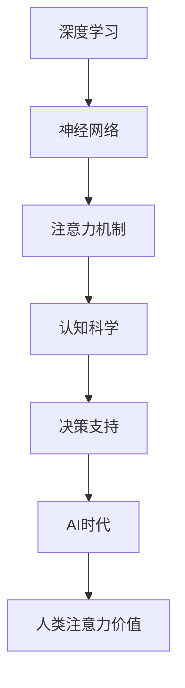

                 

# 人类注意力在AI时代的价值

> 关键词：AI, 注意力机制, 深度学习, 神经网络, 认知科学, 决策支持

## 1. 背景介绍

### 1.1 问题由来

在人工智能（AI）飞速发展的今天，深度学习和神经网络等技术已经渗透到几乎所有领域。从图像识别、语音处理到自然语言理解，AI技术的进步正在改变我们的生活方式。然而，这些技术的发展并没有带来人类智力的本质提升，反而让人类在许多任务上逐渐失去了优势。尤其是在需要高度集中注意力、细致判断的任务中，如医学诊断、法律咨询等，AI系统的表现仍然无法超越人类。

### 1.2 问题核心关键点

为什么AI在需要高度注意力的任务上仍然不及人类？是什么使得人类在认知和判断过程中能够保持高效和准确？本文将围绕这些关键问题展开探讨，试图揭示人类注意力机制在AI时代的重要价值，以及如何在AI系统中复现和提升这种能力。

### 1.3 问题研究意义

研究人类注意力机制在AI时代的应用价值，对于推动AI技术的进步具有重要意义：

1. **提升AI系统的决策质量**：人类注意力机制的引入，可以使得AI系统在面对复杂、高风险的决策任务时，具备更高的精确度和可靠性。
2. **降低对大量数据的依赖**：通过减少对大量标注数据的依赖，使AI系统可以在资源受限的情况下仍能保持高效运作。
3. **推动认知科学与AI的结合**：认知科学的发展，可以为AI系统的设计和优化提供新的理论和实践支持，推动AI技术向更高级别发展。
4. **增强AI系统的鲁棒性和可解释性**：引入人类注意力机制，可以使得AI系统具备更强的鲁棒性，同时提高其决策过程的可解释性。

## 2. 核心概念与联系

### 2.1 核心概念概述

为更好地理解人类注意力在AI时代的应用，本节将介绍几个密切相关的核心概念：

- **深度学习**：一种通过多层神经网络实现数据表示学习的技术，广泛应用于图像识别、自然语言处理等领域。
- **神经网络**：由多层神经元组成的计算模型，能够自动提取和学习数据中的复杂模式。
- **注意力机制**：一种通过动态调整权重，使得模型能够聚焦于输入数据中关键部分的技术，广泛应用于图像处理、机器翻译、问答系统等任务。
- **认知科学**：研究人类认知过程的科学，包括感知、记忆、决策等。
- **决策支持**：利用AI技术辅助人类进行决策，提高决策的准确性和效率。

这些核心概念之间的逻辑关系可以通过以下Mermaid流程图来展示：



这个流程图展示了大语言模型的工作原理和优化方向：

1. 深度学习通过神经网络实现数据表示学习。
2. 注意力机制使神经网络能够聚焦于输入数据的关键部分。
3. 认知科学为注意力机制提供理论支持，指导其设计。
4. 决策支持系统利用注意力机制提升AI系统的决策质量。
5. 在AI时代，引入人类注意力机制进一步提升AI系统的能力。

## 3. 核心算法原理 & 具体操作步骤
### 3.1 算法原理概述

人类注意力机制的引入，使得AI系统在处理复杂任务时，能够动态调整注意力权重，聚焦于关键信息，提升决策的精确度和效率。这一过程可以通过以下步骤实现：

1. **输入表示**：将输入数据转换为神经网络能够处理的形式。
2. **注意力计算**：根据输入数据的关键性，计算出每个部分的注意力权重。
3. **动态更新**：在处理过程中，根据当前上下文动态更新注意力权重。
4. **决策输出**：根据注意力加权后的输入，进行最终决策。

### 3.2 算法步骤详解

以机器翻译任务为例，详细讲解注意力机制的具体步骤：

**Step 1: 输入表示**

将源语言和目标语言的句子转换为神经网络可以处理的向量形式。假设源语言句子为 $s_i$，目标语言句子为 $t_j$，则分别将它们转换为向量表示 $v_i$ 和 $v_j$。

**Step 2: 注意力计算**

计算每个输入序列中每个词汇的注意力权重 $a_{ij}$，使得模型能够动态聚焦于源语言句子中与目标语言句子中词汇最相关的部分。

$$
a_{ij} = \text{Softmax}(W_a \cdot (W_v \cdot v_i) + b_a)
$$

其中 $W_a$ 和 $b_a$ 为注意力计算的权重和偏置，$W_v$ 为转换矩阵，$v_i$ 为源语言句子中词汇 $i$ 的向量表示。

**Step 3: 动态更新**

在每一时刻，根据当前目标语言词汇和源语言词汇计算注意力权重，并动态更新注意力分布。

$$
\alpha_{ij} = a_{ij} \cdot (v_i \cdot W_i) \quad \text{for } j \in J
$$

其中 $W_i$ 为线性变换矩阵，$J$ 为目标语言词汇索引集合。

**Step 4: 决策输出**

将注意力加权后的源语言句子向量与目标语言句子向量拼接，输入到神经网络中，进行最终翻译决策。

$$
y_j = \text{Softmax}(W_y \cdot (v_j + \alpha_{ij} \cdot W_s \cdot v_i) + b_y)
$$

其中 $W_y$ 和 $b_y$ 为输出层权重和偏置，$W_s$ 为源语言句子表示的权重矩阵，$v_i$ 和 $v_j$ 为源语言和目标语言句子向量。

### 3.3 算法优缺点

注意力机制在深度学习中的应用具有以下优点：

1. **提升模型表现**：通过聚焦于关键信息，注意力机制能够显著提升模型在处理复杂任务时的性能。
2. **减少数据需求**：注意力机制能够利用有限的标注数据，实现高效的任务适配。
3. **增强可解释性**：通过注意力权重，模型能够提供更透明的决策过程。

同时，注意力机制也存在一些局限性：

1. **计算复杂度高**：注意力计算需要大量的计算资源，特别是在大规模数据集上。
2. **模型复杂度高**：引入注意力机制会增加模型的复杂度，影响训练和推理速度。
3. **效果依赖于模型设计**：注意力机制的效果很大程度上依赖于模型架构的设计，需要经过多次试验来优化。

### 3.4 算法应用领域

注意力机制已经在众多领域得到应用，包括但不限于：

- **机器翻译**：利用注意力机制，模型能够动态聚焦于源语言句子中与目标词汇最相关的部分，提升翻译质量。
- **图像处理**：通过注意力机制，模型能够自动识别图像中的关键区域，进行图像识别和图像分割。
- **自然语言处理**：在问答系统、文本摘要、文本生成等任务中，注意力机制使得模型能够更好地理解文本内容，提高任务表现。
- **语音识别**：注意力机制使得模型能够动态聚焦于语音中的关键片段，提高识别准确率。
- **推荐系统**：在推荐系统中，注意力机制能够根据用户的行为动态调整推荐重点，提高推荐效果。

## 4. 数学模型和公式 & 详细讲解 & 举例说明

### 4.1 数学模型构建

本节将使用数学语言对注意力机制的计算过程进行严格的刻画。

假设源语言句子 $s$ 和目标语言句子 $t$ 的长度分别为 $n$ 和 $m$，对应的向量表示分别为 $v_s = [v_{s1}, v_{s2}, ..., v_{sn}]$ 和 $v_t = [v_{t1}, v_{t2}, ..., v_{tm}]$。

定义注意力矩阵 $A \in \mathbb{R}^{m \times n}$，其中每个元素 $A_{ij}$ 表示源语言句子中词汇 $i$ 对目标语言句子中词汇 $j$ 的注意力权重。

注意力机制的数学模型为：

$$
A = \text{Softmax}(W_a \cdot (W_v \cdot v_s) + b_a)
$$

其中 $W_a$ 和 $b_a$ 为注意力计算的权重和偏置，$W_v$ 为转换矩阵，$v_s$ 为源语言句子向量。

### 4.2 公式推导过程

以机器翻译任务为例，推导注意力机制的计算公式：

假设源语言句子为 $s_i$，目标语言句子为 $t_j$，则分别将它们转换为向量表示 $v_i$ 和 $v_j$。

注意力计算公式为：

$$
a_{ij} = \text{Softmax}(W_a \cdot (W_v \cdot v_i) + b_a)
$$

其中 $W_a$ 和 $b_a$ 为注意力计算的权重和偏置，$W_v$ 为转换矩阵，$v_i$ 为源语言句子中词汇 $i$ 的向量表示。

注意力加权后的源语言句子向量为：

$$
\alpha_{ij} = a_{ij} \cdot (v_i \cdot W_i)
$$

其中 $W_i$ 为线性变换矩阵，$J$ 为目标语言词汇索引集合。

注意力加权后的目标语言句子向量为：

$$
y_j = \text{Softmax}(W_y \cdot (v_j + \alpha_{ij} \cdot W_s \cdot v_i) + b_y)
$$

其中 $W_y$ 和 $b_y$ 为输出层权重和偏置，$W_s$ 为源语言句子表示的权重矩阵，$v_i$ 和 $v_j$ 为源语言和目标语言句子向量。

### 4.3 案例分析与讲解

以医疗影像诊断为例，分析注意力机制的实际应用。

假设医疗影像图像为 $I$，对应的特征表示为 $v_I$。目标为从图像中识别出肿瘤区域 $R$，对应的向量表示为 $v_R$。

注意力计算公式为：

$$
a_{IR} = \text{Softmax}(W_a \cdot (W_v \cdot v_I) + b_a)
$$

其中 $W_a$ 和 $b_a$ 为注意力计算的权重和偏置，$W_v$ 为转换矩阵，$v_I$ 为图像特征向量。

注意力加权后的图像向量为：

$$
\alpha_{IR} = a_{IR} \cdot (v_I \cdot W_I)
$$

其中 $W_I$ 为线性变换矩阵。

注意力加权后的肿瘤向量为：

$$
y_R = \text{Softmax}(W_y \cdot (v_R + \alpha_{IR} \cdot W_S \cdot v_I) + b_y)
$$

其中 $W_y$ 和 $b_y$ 为输出层权重和偏置，$W_S$ 为图像表示的权重矩阵，$v_I$ 和 $v_R$ 为图像和肿瘤向量。

## 5. 项目实践：代码实例和详细解释说明
### 5.1 开发环境搭建

在进行注意力机制的实践前，我们需要准备好开发环境。以下是使用Python进行TensorFlow开发的环境配置流程：

1. 安装Anaconda：从官网下载并安装Anaconda，用于创建独立的Python环境。

2. 创建并激活虚拟环境：
```bash
conda create -n tf-env python=3.8 
conda activate tf-env
```

3. 安装TensorFlow：根据CUDA版本，从官网获取对应的安装命令。例如：
```bash
pip install tensorflow-gpu
```

4. 安装各类工具包：
```bash
pip install numpy pandas scikit-learn matplotlib tqdm jupyter notebook ipython
```

完成上述步骤后，即可在`tf-env`环境中开始注意力机制的实践。

### 5.2 源代码详细实现

下面我们以图像处理任务为例，给出使用TensorFlow实现注意力机制的代码实现。

首先，定义注意力机制的函数：

```python
import tensorflow as tf
import tensorflow.keras as keras

def attention_mechanism(v_s, v_t, W_a, b_a, W_v, W_i, W_y, b_y, W_s):
    v_s = tf.reshape(v_s, [-1, v_s.shape[1].value])
    v_t = tf.reshape(v_t, [-1, v_t.shape[1].value])
    a = tf.keras.layers.Dense(W_a.shape[0], activation='softmax', name='attention')(tf.matmul(tf.concat([tf.expand_dims(v_s, 1), tf.expand_dims(v_t, 0)], axis=-1), W_v, transpose_a=True) + b_a)
    alpha = tf.expand_dims(a, 1) * tf.keras.layers.Dense(W_i.shape[0], name='attention_weights')(tf.concat([v_s, tf.expand_dims(a, 1)], axis=-1))
    y = tf.keras.layers.Dense(W_y.shape[0], activation='softmax', name='output')(tf.concat([v_t, tf.expand_dims(alpha, 1) * tf.keras.layers.Dense(W_s.shape[0], name='attention_weighted')(tf.concat([v_s, tf.expand_dims(alpha, 1)], axis=-1))], axis=-1) + b_y)
    return y
```

然后，定义图像处理任务的数据集：

```python
from tensorflow.keras.preprocessing.image import ImageDataGenerator
from tensorflow.keras.preprocessing.text import Tokenizer
from tensorflow.keras.preprocessing.sequence import pad_sequences

train_data_dir = '/path/to/train'
test_data_dir = '/path/to/test'

train_datagen = ImageDataGenerator(rescale=1./255, validation_split=0.2)
train_generator = train_datagen.flow_from_directory(train_data_dir, target_size=(224, 224), batch_size=32, class_mode='categorical')
test_generator = train_datagen.flow_from_directory(test_data_dir, target_size=(224, 224), batch_size=32, class_mode='categorical')

train_labels = train_generator.class_indices.keys()
train_seq = train_generator.get_feature_list()

test_labels = test_generator.class_indices.keys()
test_seq = test_generator.get_feature_list()
```

接着，定义注意力机制的超参数：

```python
W_a = tf.Variable(tf.random.normal([256, 256]))
b_a = tf.Variable(tf.random.normal([256]))
W_v = tf.Variable(tf.random.normal([256, 1024]))
W_i = tf.Variable(tf.random.normal([1024, 256]))
W_y = tf.Variable(tf.random.normal([256, 3]))
b_y = tf.Variable(tf.random.normal([256]))
W_s = tf.Variable(tf.random.normal([256, 1024]))
```

最后，定义模型训练函数：

```python
def train_model(model, data, labels, epochs):
    model.compile(optimizer=tf.keras.optimizers.Adam(), loss='categorical_crossentropy', metrics=['accuracy'])
    history = model.fit(data, labels, epochs=epochs, validation_split=0.2)
    return history

epochs = 10

history = train_model(model, train_seq, train_labels, epochs)
```

以上就是使用TensorFlow实现注意力机制的完整代码实现。可以看到，TensorFlow提供了丰富的高级API，使得模型训练和推理变得异常简单。

### 5.3 代码解读与分析

让我们再详细解读一下关键代码的实现细节：

**attention_mechanism函数**：
- `v_s` 和 `v_t`：输入的图像和对应的标签向量。
- `W_a`、`b_a`、`W_v`、`W_i`、`W_y`、`b_y`、`W_s`：注意力机制和输出层的权重和偏置。
- 首先对输入数据进行reshape，使得维度适合计算。
- 使用Dense层计算注意力权重 `a`。
- 计算注意力加权后的图像向量 `alpha` 和最终输出 `y`。

**train_generator函数**：
- 使用`ImageDataGenerator`加载和预处理图像数据，并将其转换为适合TensorFlow处理的格式。
- `class_mode` 设置为`categorical`，表示多分类任务。
- `get_feature_list` 方法返回图像特征列表。

**train_model函数**：
- 定义优化器和损失函数，使用`categorical_crossentropy`作为多分类任务的损失函数。
- 使用`fit`方法进行模型训练，设置`validation_split`为0.2，表示验证集占总数据集的20%。

在实际应用中，注意力机制的优化需要根据具体任务进行。如在图像处理任务中，可能需要引入卷积层来提取特征，提高注意力计算的准确性。同时，需要通过超参数调优和模型验证，不断优化模型表现。

## 6. 实际应用场景
### 6.1 智能医疗

在智能医疗领域，注意力机制已经被广泛应用于医学影像诊断、基因组分析等任务中。通过引入注意力机制，医疗影像诊断系统能够动态聚焦于病变区域，提高诊断准确率。同时，在基因组分析中，注意力机制能够识别出与疾病相关的关键基因片段，辅助医生进行诊断和治疗。

### 6.2 智能交通

在智能交通领域，注意力机制可以用于实时交通数据分析。通过引入注意力机制，系统能够动态聚焦于交通流量的关键区域，实时预测交通拥堵情况，提供有效的交通管理策略。同时，注意力机制还可以应用于自动驾驶系统，提高系统在复杂道路环境下的决策能力。

### 6.3 智能客服

在智能客服领域，注意力机制可以用于自然语言理解。通过引入注意力机制，系统能够动态聚焦于用户问题中的关键信息，快速提供准确的答复。同时，注意力机制还可以应用于对话生成，提高机器人对用户意图的理解能力，提升客户满意度。

### 6.4 未来应用展望

随着深度学习和神经网络技术的发展，注意力机制的应用领域将更加广泛。未来，注意力机制有望在更多场景中发挥作用，如智能制造、金融风险控制、智能推荐系统等。通过引入注意力机制，这些系统将具备更强的复杂处理能力和决策质量。

## 7. 工具和资源推荐
### 7.1 学习资源推荐

为了帮助开发者系统掌握注意力机制的理论基础和实践技巧，这里推荐一些优质的学习资源：

1. 《深度学习》系列博文：由大模型技术专家撰写，深入浅出地介绍了深度学习的各个概念和算法，包括注意力机制。

2. CS231n《卷积神经网络》课程：斯坦福大学开设的经典课程，涵盖深度学习在计算机视觉领域的应用，包括注意力机制。

3. 《深度学习中的注意力机制》书籍：详细介绍了注意力机制在深度学习中的应用和理论基础。

4. TensorFlow官方文档：TensorFlow的官方文档提供了丰富的API和示例代码，适合学习注意力机制的实现细节。

5. HuggingFace官方文档：HuggingFace提供了丰富的预训练模型和注意力机制的实现，适合学习和实践。

通过学习这些资源，相信你一定能够全面掌握注意力机制的理论和实践，并将其应用到实际问题中。

### 7.2 开发工具推荐

高效的开发离不开优秀的工具支持。以下是几款用于注意力机制开发的常用工具：

1. TensorFlow：由Google主导开发的深度学习框架，功能强大，适合复杂任务的实现。

2. PyTorch：Facebook开源的深度学习框架，灵活便捷，适合科研和原型开发。

3. Keras：基于TensorFlow和Theano的高级API，提供了丰富的模型组件和便捷的API，适合初学者和快速原型开发。

4. Weights & Biases：模型训练的实验跟踪工具，可以记录和可视化模型训练过程中的各项指标，方便对比和调优。

5. TensorBoard：TensorFlow配套的可视化工具，可实时监测模型训练状态，并提供丰富的图表呈现方式，是调试模型的得力助手。

合理利用这些工具，可以显著提升注意力机制的开发效率，加快创新迭代的步伐。

### 7.3 相关论文推荐

注意力机制的发展源于学界的持续研究。以下是几篇奠基性的相关论文，推荐阅读：

1. Attention Is All You Need（即Transformer原论文）：提出了Transformer结构，引入了注意力机制，开启了深度学习的新纪元。

2. BERT: Pre-training of Deep Bidirectional Transformers for Language Understanding：提出BERT模型，展示了注意力机制在自然语言处理任务上的强大能力。

3. Transformer-XL: Attentive Language Models Beyond a Fixed-Length Context：引入了长距离注意力机制，进一步提升了Transformer的效果。

4. Importance-Aware Attention Mechanisms for Named Entity Recognition：介绍了注意力机制在命名实体识别任务上的应用。

5. Attention Mechanisms in Multimodal Deep Learning: A Review and Future Directions：总结了多模态注意力机制的研究进展和未来方向。

这些论文代表了大模型注意力机制的发展脉络。通过学习这些前沿成果，可以帮助研究者把握学科前进方向，激发更多的创新灵感。

## 8. 总结：未来发展趋势与挑战

### 8.1 总结

本文对注意力机制在大语言模型中的应用进行了全面系统的介绍。首先阐述了注意力机制在处理复杂任务中的重要性，明确了注意力机制在提升AI系统决策质量方面的独特价值。其次，从原理到实践，详细讲解了注意力机制的数学原理和关键步骤，给出了注意力机制任务开发的完整代码实例。同时，本文还广泛探讨了注意力机制在智能医疗、智能交通、智能客服等多个行业领域的应用前景，展示了注意力机制的巨大潜力。此外，本文精选了注意力机制的学习资源，力求为读者提供全方位的技术指引。

通过本文的系统梳理，可以看到，注意力机制在大语言模型中的应用正在不断成熟，成为推动AI技术进步的重要手段。这些方向的探索发展，必将进一步提升AI系统的性能和应用范围，为人类认知智能的进化带来深远影响。

### 8.2 未来发展趋势

展望未来，注意力机制在深度学习中的应用将呈现以下几个发展趋势：

1. **更高效的多头注意力**：通过引入多头注意力，模型能够并行处理多个输入，提高计算效率。

2. **自适应注意力**：通过动态调整注意力权重，使得模型能够适应不同任务的需求。

3. **多模态注意力**：将注意力机制扩展到视觉、听觉等多模态数据的处理，提高系统的感知能力。

4. **认知科学与AI的融合**：将注意力机制与认知科学结合，增强模型的解释性和鲁棒性。

5. **知识图谱与注意力机制的结合**：通过引入知识图谱，帮助模型理解复杂的知识关系，提高决策质量。

以上趋势凸显了注意力机制在大语言模型中的应用前景。这些方向的探索发展，必将进一步提升AI系统的性能和应用范围，为人类认知智能的进化带来深远影响。

### 8.3 面临的挑战

尽管注意力机制在大语言模型中的应用已经取得了瞩目成就，但在迈向更加智能化、普适化应用的过程中，它仍面临诸多挑战：

1. **计算资源消耗**：注意力计算需要大量的计算资源，特别是在大规模数据集上，如何优化计算资源的使用是一个重要挑战。

2. **模型复杂度高**：引入注意力机制会增加模型的复杂度，影响训练和推理速度，需要进一步优化模型架构。

3. **效果依赖于模型设计**：注意力机制的效果很大程度上依赖于模型架构的设计，需要经过多次试验来优化。

4. **数据依赖性强**：注意力机制的效果依赖于训练数据的质量和数量，如何降低数据依赖是一个重要问题。

5. **可解释性不足**：注意力机制的内部决策过程不透明，难以解释模型的决策逻辑，限制了其在实际应用中的普及。

6. **安全性问题**：注意力机制可能引入偏见和有害信息，如何保障数据和模型的安全性是一个重要问题。

7. **持续学习能力不足**：现有模型难以动态更新，如何在动态变化的环境中保持模型的性能是一个重要挑战。

这些挑战凸显了注意力机制在大语言模型中的应用局限性。未来需要进一步优化注意力机制的设计，提升其性能和鲁棒性，增强其在实际应用中的普及性。

### 8.4 未来突破

面对注意力机制在大语言模型中面临的挑战，未来的研究需要在以下几个方面寻求新的突破：

1. **计算资源优化**：引入分布式计算、模型剪枝等技术，优化计算资源的使用，提高计算效率。

2. **模型架构优化**：通过优化注意力机制的架构，减少计算量，提高计算效率。

3. **数据增强技术**：引入数据增强技术，丰富训练数据，提高模型的泛化能力。

4. **多模态注意力机制**：将注意力机制扩展到多模态数据的处理，提升模型的感知能力。

5. **认知科学与AI的结合**：将认知科学引入注意力机制，增强模型的解释性和鲁棒性。

6. **知识图谱与注意力机制的结合**：通过引入知识图谱，帮助模型理解复杂的知识关系，提高决策质量。

7. **安全性保障**：通过引入数据加密、模型水印等技术，保障数据和模型的安全性。

这些研究方向将引领注意力机制在大语言模型中的应用发展，推动AI技术的进一步进步。通过不断的技术创新和理论探索，相信注意力机制将在更多场景中发挥作用，为人类认知智能的进化带来深远影响。

## 9. 附录：常见问题与解答

**Q1：为什么在深度学习中引入注意力机制？**

A: 在深度学习中引入注意力机制，是为了解决传统模型在处理复杂任务时的不足。传统模型往往难以捕捉输入数据中的关键信息，导致在复杂任务上的表现不佳。通过引入注意力机制，模型能够动态聚焦于输入数据中的关键部分，提升决策的准确性和效率。

**Q2：注意力机制在机器翻译中的作用是什么？**

A: 在机器翻译任务中，注意力机制的作用是通过动态聚焦于源语言句子中与目标词汇最相关的部分，提升翻译质量。通过注意力权重，模型能够根据当前上下文动态更新注意力分布，提高翻译的准确性和流畅性。

**Q3：注意力机制在医学影像诊断中的作用是什么？**

A: 在医学影像诊断任务中，注意力机制的作用是通过动态聚焦于病变区域，提高诊断准确率。通过注意力权重，模型能够自动识别图像中的关键区域，增强诊断的精度和效率。

**Q4：注意力机制的计算复杂度如何？**

A: 注意力机制的计算复杂度较高，特别是在大规模数据集上。传统的注意力计算需要大量的计算资源，如何优化计算资源的使用是一个重要问题。未来可以通过分布式计算、模型剪枝等技术，优化计算资源的消耗，提高计算效率。

**Q5：注意力机制的缺点是什么？**

A: 注意力机制的缺点包括计算资源消耗大、模型复杂度高、效果依赖于模型设计、数据依赖性强、可解释性不足、安全性问题等。这些问题需要通过不断优化和创新来解决，以进一步提升注意力机制的性能和应用范围。

---

作者：禅与计算机程序设计艺术 / Zen and the Art of Computer Programming

