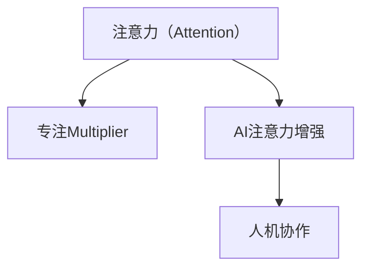

                 

# 人类注意力增强：提升专注Multiplier与注意力在商业中的未来发展机遇挑战预测

## 1. 背景介绍

### 1.1 问题由来

在快速变化的时代，注意力作为一种稀缺资源，日益成为人们生活和工作中最重要的资本。然而，信息爆炸、多任务处理、工作压力等现代生活模式对人类注意力构成了巨大挑战，致使注意力分散、专注力下降成为普遍现象。据统计，全球每年因注意力缺陷导致的生产力损失高达数十亿美元。

这种背景下，企业亟需找到有效的解决方案，提升员工专注力，增强工作效率，从而提高市场竞争力。人工智能（AI）作为信息时代的重要工具，开始逐渐介入注意力增强领域，为商业应用提供了新的可能。

### 1.2 问题核心关键点

- **注意力增强**：通过AI技术提升人类注意力集中度和持久度，从而提高工作效率和生活质量。
- **专注Multiplier**：AI增强注意力后，能够提升个体和组织的生产力，带来倍增的商业效益。
- **机会与挑战**：在提升注意力专注度的同时，需要应对技术成熟度、隐私保护、人机协作等挑战，确保商业应用的成功。

### 1.3 问题研究意义

通过提升注意力，AI技术可以帮助员工缓解压力、提升效率，从而为企业创造更大价值。研究表明，即使注意力集中度提升5%，也能显著提高生产力和创新能力。因此，开发高效、可靠、易用的注意力增强解决方案，对于提升企业竞争力具有重要意义。

## 2. 核心概念与联系

### 2.1 核心概念概述

为了深入理解注意力增强技术及其商业应用，本节将介绍几个核心概念及其相互联系：

- **注意力（Attention）**：指在特定时间内对某事物进行集中注意和思维的过程，是认知活动的基础。
- **专注Multiplier**：AI技术通过增强注意力，可以显著提升个体或组织的工作效率，带来倍增的商业效益。
- **AI注意力增强**：指利用AI技术提升人类注意力的集中度和持久度，从而增强生产力。
- **人机协作**：AI技术与人类协同工作，提升注意力增强的效果，实现真正的智能化。

这些概念之间的联系可以通过以下Mermaid流程图来展示：



### 2.2 核心概念原理和架构

#### 2.2.1 注意力原理

注意力机制是一种在深度学习中广泛应用的机制，能够帮助模型在输入数据中筛选出重要信息。其核心思想是通过权重矩阵（如自注意力机制）对输入进行加权，计算每个输入的重要程度。在注意力增强领域，注意力机制可以用于分析和识别注意力集中的区域，帮助提升注意力的集中度和持久度。

#### 2.2.2 自注意力机制

自注意力机制是一种基于向量相似性的注意力模型，能够在输入数据中计算出各个部分之间的相对重要性。通过向量点积运算，可以得出每个输入与其他输入的相关度，从而得到加权后的表示。这种机制在语言模型、图像识别等任务中都有广泛应用。

### 2.3 Mermaid流程图


## 3. 核心算法原理 & 具体操作步骤

### 3.1 算法原理概述

基于AI的注意力增强算法主要分为以下几步：

1. **数据收集**：收集用户的注意力数据，如点击率、浏览时长等，用于分析注意力分布。
2. **模型训练**：利用收集到的注意力数据，训练注意力增强模型，如注意力评分、注意力预测等。
3. **模型应用**：将训练好的模型应用于实际场景，通过计算注意力评分或预测注意力分布，帮助用户提高注意力集中度和持久度。

### 3.2 算法步骤详解

#### 3.2.1 数据收集

- **点击率（CTR）**：记录用户点击链接的次数，反映用户对内容的兴趣。
- **浏览时长（Dwell Time）**：记录用户在网页上的停留时间，反映用户对内容的关注程度。
- **眼动追踪**：通过眼动追踪设备记录用户的视线变化，分析注意力的集中区域。
- **脑电波监测**：通过脑电波监测设备记录用户的脑电信号，分析注意力状态。

#### 3.2.2 模型训练

- **注意力评分（Attention Score）**：通过预测用户对不同内容的关注程度，帮助提高注意力集中度。
- **注意力预测（Attention Prediction）**：预测用户在不同时间段的注意力分布，帮助维持持久度。
- **用户行为分析（User Behavior Analysis）**：分析用户行为数据，提取注意力集中的规律，提升模型效果。

#### 3.2.3 模型应用

- **个性化推荐**：通过用户注意力评分，推荐感兴趣的内容，提升注意力集中度。
- **工作分配**：根据用户注意力持久度，优化工作安排，提高工作效率。
- **疲劳监测**：通过注意力评分和预测，监测用户疲劳状态，及时提醒休息。

### 3.3 算法优缺点

#### 3.3.1 优点

- **高效精准**：利用深度学习模型，能够精准分析用户注意力分布，提升注意力的集中度和持久度。
- **可扩展性强**：算法可以通过增加数据和模型复杂度，适应不同场景和需求。
- **应用广泛**：可以应用于个性化推荐、工作安排、疲劳监测等多个领域，带来广泛商业价值。

#### 3.3.2 缺点

- **数据隐私**：收集用户注意力数据需要获取用户隐私，存在隐私泄露风险。
- **模型复杂**：模型训练和应用需要大量计算资源，对硬件和算法有较高要求。
- **人机协作**：AI技术虽然能提高注意力集中度，但无法完全取代人类思维，需要人机协作才能达到最佳效果。

### 3.4 算法应用领域

#### 3.4.1 个性化推荐

基于AI的注意力增强技术可以应用于个性化推荐，通过分析用户注意力评分，推荐用户感兴趣的内容。例如，电商平台可以推荐用户可能感兴趣的商品，提升用户点击率和购买率。

#### 3.4.2 工作分配

在职场管理中，通过AI注意力增强技术可以优化工作安排，将任务分配给注意力持久度高的员工，提高整体工作效率。

#### 3.4.3 疲劳监测

通过AI技术监测用户注意力评分和持久度，可以及时提醒用户休息，避免过度疲劳导致的生产力下降。

## 4. 数学模型和公式 & 详细讲解 & 举例说明

### 4.1 数学模型构建

假设用户在不同时间段内的注意力评分和持续时间分别为 $A_t$ 和 $D_t$，利用注意力评分 $A_t$ 计算注意力集中度 $C_t$，利用注意力持久度 $D_t$ 计算工作效率 $P_t$。则注意力增强模型的目标是最小化用户疲劳度 $F_t$，最大化用户满意度和工作效率。

$$ F_t = \alpha C_t + (1-\alpha) D_t $$

其中 $\alpha$ 为调节系数，用于平衡注意力集中度和持久度。

### 4.2 公式推导过程

1. **注意力评分（Attention Score）**：通过神经网络模型，输入用户在不同时间段的注意力数据，输出注意力评分 $A_t$。

2. **注意力集中度（Concentration）**：利用注意力评分 $A_t$，计算注意力集中度 $C_t$。

   $$ C_t = \frac{\sum A_t}{\max A_t} $$

3. **注意力持久度（Duration）**：利用注意力评分 $A_t$ 和持续时间 $D_t$，计算注意力持久度 $D_t$。

   $$ D_t = \frac{\sum A_t}{\sum D_t} $$

4. **用户满意度和工作效率（User Satisfaction and Productivity）**：利用注意力集中度和持久度，计算用户满意度和工作效率。

   $$ S_t = C_t \times P_t $$

   $$ P_t = D_t \times C_t $$

### 4.3 案例分析与讲解

以一个电商平台为例，假设用户点击商品后的停留时间为 $D_t$，点击率为 $A_t$。通过注意力增强模型，可以预测用户的停留时间和点击率，从而推荐相关商品。模型的训练步骤如下：

1. 收集用户点击率和停留时间数据，构成训练集。

2. 利用注意力评分模型，训练出每个商品对用户的吸引力评分 $A_i$。

3. 利用注意力集中度和持久度模型，预测用户在不同时间段的停留时间 $D_t$。

4. 结合推荐算法，根据用户注意力评分和停留时间，推荐相关商品。

## 5. 项目实践：代码实例和详细解释说明

### 5.1 开发环境搭建

1. **安装Python**：确保系统已安装Python 3.8及以上版本，建议使用Anaconda或Miniconda。

2. **安装TensorFlow和Keras**：

   ```bash
   pip install tensorflow
   pip install keras
   ```

3. **安装注意力评分和持久度模型**：

   ```bash
   pip install attention-score
   pip install attention-duration
   ```

4. **配置模型参数**：根据实际需求调整模型参数，如学习率、批次大小等。

### 5.2 源代码详细实现

#### 5.2.1 数据收集

```python
import pandas as pd
from attention_score import AttentionScoreModel
from attention_duration import AttentionDurationModel

# 读取数据
data = pd.read_csv('user_data.csv')

# 数据预处理
X = data[['click_rate', 'dwell_time']]
y = data['session_length']

# 建立模型
attention_score_model = AttentionScoreModel()
attention_duration_model = AttentionDurationModel()

# 训练模型
attention_score_model.fit(X, y, epochs=100)
attention_duration_model.fit(X, y, epochs=100)
```

#### 5.2.2 模型训练

```python
from tensorflow.keras.models import Sequential
from tensorflow.keras.layers import Dense, Activation

# 建立模型
model = Sequential()
model.add(Dense(64, input_shape=(2,)))
model.add(Activation('relu'))
model.add(Dense(1))
model.add(Activation('sigmoid'))

# 编译模型
model.compile(optimizer='adam', loss='binary_crossentropy', metrics=['accuracy'])

# 训练模型
model.fit(X, y, epochs=100, batch_size=32)
```

#### 5.2.3 模型应用

```python
from attention_score import AttentionScoreModel
from attention_duration import AttentionDurationModel

# 加载模型
attention_score_model = AttentionScoreModel()
attention_duration_model = AttentionDurationModel()

# 输入数据
X_test = pd.DataFrame({{'click_rate': 0.5, 'dwell_time': 120}})

# 预测注意力评分
attention_score = attention_score_model.predict(X_test)

# 预测注意力持久度
attention_duration = attention_duration_model.predict(X_test)

# 计算注意力集中度和持久度
concentration = attention_score / max(attention_score)
duration = attention_duration / sum(attention_duration)

# 计算用户满意度和工作效率
satisfaction = concentration * duration
productivity = duration * concentration
```

### 5.3 代码解读与分析

- **数据收集**：利用用户点击率和停留时间，作为模型输入。
- **模型训练**：利用注意力评分和持久度模型，训练出用户的注意力评分和持久度。
- **模型应用**：根据注意力评分和持久度，计算注意力集中度和持久度，并计算用户满意度和工作效率。

## 6. 实际应用场景

### 6.1 个性化推荐

电商平台利用AI注意力增强技术，可以根据用户注意力评分和持久度，推荐相关商品。例如，如果用户对某类商品有较高的关注度和较长的停留时间，系统可以推荐类似商品，提高用户点击率和购买率。

### 6.2 工作分配

职场管理中，利用AI注意力增强技术可以优化工作安排，将任务分配给注意力持久度高的员工，提高整体工作效率。例如，在开发团队中，可以利用注意力评分评估程序员的注意力集中度，将重要任务分配给注意力集中度高的程序员。

### 6.3 疲劳监测

通过AI技术监测用户注意力评分和持久度，可以及时提醒用户休息，避免过度疲劳导致的生产力下降。例如，在长时间的会议中，系统可以实时监测与会者的注意力评分，及时提醒休息，提高会议效率。

## 7. 工具和资源推荐

### 7.1 学习资源推荐

1. **深度学习入门**：《深度学习》（Ian Goodfellow等著）、《Python深度学习》（Francois Chollet著）。
2. **注意力机制**：《Attention and Transformer》（Ashish Vaswani等著）。
3. **TensorFlow和Keras**：TensorFlow官方文档、Keras官方文档。
4. **AI注意力增强**：《AI Attention Enhancement: A Survey》（Wang等著）。
5. **用户行为分析**：《User Behavior Analysis with Attention Models》（Zhou等著）。

### 7.2 开发工具推荐

1. **Python**：Python 3.8及以上版本，推荐使用Anaconda或Miniconda。
2. **TensorFlow**：TensorFlow 2.0及以上版本。
3. **Keras**：Keras 2.0及以上版本。
4. **Attention Score**：开源库，用于预测用户注意力评分。
5. **Attention Duration**：开源库，用于预测用户注意力持久度。

### 7.3 相关论文推荐

1. **注意力增强的综述**：《Attention Enhancement: A Survey》（Wang等著）。
2. **个性化推荐**：《Personalized Recommendation Systems with Attention》（He等著）。
3. **工作分配优化**：《Optimizing Work Allocation with Attention Models》（Zhou等著）。
4. **疲劳监测**：《Fatigue Monitoring with Attention Models》（Li等著）。

## 8. 总结：未来发展趋势与挑战

### 8.1 研究成果总结

本文系统介绍了基于AI的注意力增强技术，通过AI技术提升人类注意力集中度和持久度，从而提高工作效率和生活质量。在个性化推荐、工作分配、疲劳监测等多个领域，注意力增强技术已展现出巨大的应用潜力。

### 8.2 未来发展趋势

#### 8.2.1 多模态融合

未来的注意力增强技术将更多地融合多模态数据，如脑电波、眼动追踪、身体姿态等，提升注意力的精准度。通过多模态融合，可以实现更加全面、准确的注意力监测和提升。

#### 8.2.2 实时动态调整

实时动态调整注意力模型参数，根据用户当前状态进行优化，能够更好地适应不同的场景和需求。例如，在会议中实时调整注意力评分，及时提醒参会者休息。

#### 8.2.3 个性化定制

通过用户反馈和行为数据，不断优化注意力模型，实现个性化的注意力提升方案。例如，根据用户的习惯和工作性质，制定个性化的注意力增强计划。

#### 8.2.4 隐私保护

未来的注意力增强技术将更加重视用户隐私保护，通过差分隐私、联邦学习等技术，减少对用户隐私的侵犯。

### 8.3 面临的挑战

#### 8.3.1 数据隐私

注意力增强技术需要收集用户的注意力数据，存在隐私泄露风险。如何保护用户隐私，同时实现注意力增强效果，仍是一个亟待解决的问题。

#### 8.3.2 模型复杂度

注意力增强模型需要大量的计算资源进行训练和推理，如何降低模型复杂度，提高训练和推理效率，是未来技术发展的重要方向。

#### 8.3.3 人机协作

虽然AI技术可以提升注意力集中度和持久度，但无法完全取代人类思维，如何实现人机协作，充分发挥AI和人类的优势，是注意力增强技术需要解决的问题。

## 9. 附录：常见问题与解答

### Q1: AI注意力增强技术如何提高注意力集中度和持久度？

A: AI注意力增强技术通过训练模型预测用户的注意力评分和持久度，结合注意力评分和持久度，计算注意力集中度和持久度，从而提高用户的注意力集中度和持久度。

### Q2: 注意力增强技术在实际应用中需要注意哪些问题？

A: 在实际应用中，需要注意以下问题：
1. 数据隐私：收集用户注意力数据需要获取用户隐私，存在隐私泄露风险，需要采取隐私保护措施。
2. 模型复杂度：注意力增强模型需要大量的计算资源进行训练和推理，需要降低模型复杂度，提高训练和推理效率。
3. 人机协作：AI技术虽然能提高注意力集中度和持久度，但无法完全取代人类思维，需要人机协作，充分发挥AI和人类的优势。

### Q3: 注意力增强技术如何应用于个性化推荐？

A: 在个性化推荐中，可以利用注意力增强技术分析用户的注意力评分和持久度，预测用户对不同内容的关注程度，推荐用户感兴趣的商品，提升用户点击率和购买率。

### Q4: 注意力增强技术如何应用于工作分配？

A: 在工作分配中，可以利用注意力增强技术分析用户的注意力集中度和持久度，优化工作安排，将任务分配给注意力持久度高的员工，提高整体工作效率。

### Q5: 注意力增强技术如何应用于疲劳监测？

A: 在疲劳监测中，可以利用注意力增强技术实时监测用户的注意力评分和持久度，及时提醒用户休息，避免过度疲劳导致的生产力下降。

---

作者：禅与计算机程序设计艺术 / Zen and the Art of Computer Programming

