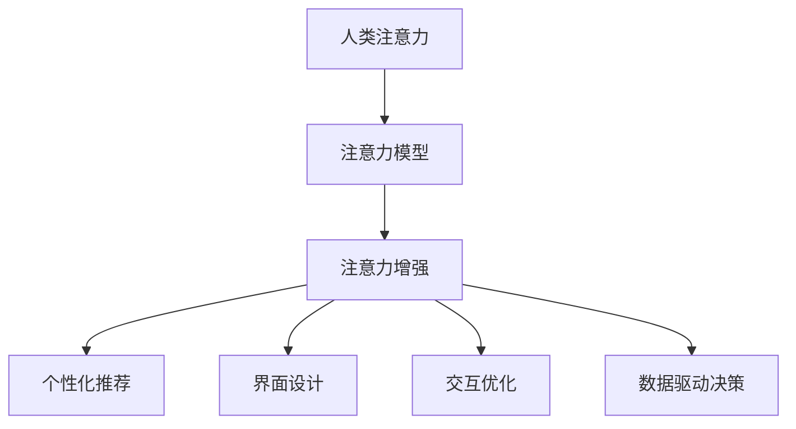
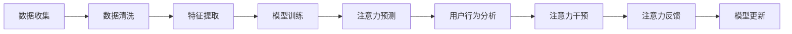

                 

# 人类注意力增强：提升专注力和注意力在商业中的价值

> 关键词：人类注意力,注意力增强,商业应用,专注力提升,人工智能,数据驱动决策

## 1. 背景介绍

### 1.1 问题由来
在信息爆炸的现代社会，人类注意力（Human Attention）的稀缺性日益凸显。互联网的即时通讯、社交媒体、视频流等平台不断争夺用户有限的注意力资源，导致注意力碎片化、分散化严重。企业需要更加高效地吸引和保持客户注意力，才能在激烈的市场竞争中脱颖而出。

### 1.2 问题核心关键点
注意力增强的目的是通过科学的方法，提升用户在使用产品或服务时的专注度和持续时间，从而提升商业价值。这包括但不限于：

- 通过个性化推荐、界面设计、交互优化等手段，提高用户参与度和停留时间。
- 采用数据分析和机器学习技术，深入理解用户行为模式，预测用户需求，实现精准营销。
- 利用人工智能技术对用户注意力进行动态监测和干预，改善用户体验。

### 1.3 问题研究意义
提升注意力增强，对于企业增强用户体验、提高用户粘性、增加商业转化率具有重要意义。具体而言，可以通过以下方式提升商业价值：

- **增强客户参与度**：通过优化产品界面和交互方式，提升用户使用时的专注度和满意度，增加使用时长和频次。
- **实现精准营销**：利用注意力监测和分析，了解用户兴趣和行为模式，进行个性化推荐和定制营销，提高广告和促销的效果。
- **提升决策效率**：通过数据驱动的注意力增强策略，快速响应市场变化，实现更高效的商业决策。

## 2. 核心概念与联系

### 2.1 核心概念概述

注意力增强涉及的核心概念包括：

- **人类注意力**：指用户在使用产品或服务时，对信息的关注和感知。人类注意力具有有限的带宽，容易被外界干扰而分散。
- **注意力模型**：通过机器学习等技术，对用户注意力进行建模和预测，实现对其行为模式的分析和干预。
- **注意力增强**：通过技术手段提升用户在使用产品或服务时的专注度和持续时间，从而提高用户参与度和商业价值。

这些概念之间存在紧密的联系，共同构成了提升注意力增强的方法论框架。具体如下：



### 2.2 核心概念原理和架构的 Mermaid 流程图

以下是一个简单的注意力增强的流程图，展示了从数据收集、模型训练到应用干预的全过程：



## 3. 核心算法原理 & 具体操作步骤

### 3.1 算法原理概述

注意力增强的核心算法原理基于用户行为数据（如点击、滑动、停留时间等）的收集和分析。通过构建用户注意力模型，预测用户在不同情境下的专注度变化，从而设计出相应的策略来提升用户的注意力和参与度。

### 3.2 算法步骤详解

以下是注意力增强的详细步骤：

**Step 1: 数据收集与预处理**

- **数据来源**：包括但不限于网站流量、移动应用使用数据、社交媒体互动数据等。
- **数据清洗**：去除噪音数据，处理缺失值和异常值，确保数据质量。
- **特征提取**：从原始数据中提取有意义的特征，如点击次数、页面停留时间、交互频率等。

**Step 2: 构建注意力模型**

- **模型选择**：选择合适的模型架构，如神经网络、线性回归、支持向量机等。
- **特征输入**：将清洗和提取后的特征输入模型进行训练。
- **模型训练**：使用标注数据对模型进行监督学习，优化模型参数。
- **模型验证**：在验证集上评估模型性能，选择最优模型。

**Step 3: 注意力预测与干预**

- **注意力预测**：将模型应用于实时数据，预测用户当前的专注度水平。
- **行为分析**：分析用户行为，识别出注意力下降的潜在原因，如页面跳转、广告干扰等。
- **干预措施**：根据预测结果和行为分析，设计并实施注意力增强策略，如界面优化、广告屏蔽、内容推荐等。

**Step 4: 效果评估与反馈**

- **效果评估**：通过A/B测试、用户反馈等方法，评估注意力增强策略的效果。
- **持续改进**：根据效果评估结果，调整模型参数和干预措施，持续优化注意力增强策略。

### 3.3 算法优缺点

注意力增强的优点：

- **提升用户体验**：通过个性化推荐、界面优化等手段，提高用户使用时的专注度和满意度。
- **精准营销**：利用注意力模型，实现更精准的用户行为预测和定制化营销，提高广告投放的转化率。
- **数据驱动决策**：通过实时监测和预测用户注意力，快速响应市场变化，实现更高效的商业决策。

缺点：

- **数据隐私问题**：收集和分析用户注意力数据需要遵循隐私保护法规，如GDPR、CCPA等。
- **模型泛化性**：注意力模型需要考虑不同用户群体和场景的差异，泛化性不足可能导致策略效果不佳。
- **技术复杂性**：构建和维护注意力增强系统需要高水平的数据科学和工程技能，技术门槛较高。

### 3.4 算法应用领域

注意力增强方法在多个领域中得到了广泛应用，如：

- **电子商务**：通过个性化推荐和界面设计，提升用户在电商平台上的停留时间和购买转化率。
- **在线广告**：利用注意力模型进行用户行为预测和广告投放优化，提高广告的点击率和转化率。
- **社交媒体**：通过内容推荐和用户互动分析，提升用户在社交平台上的参与度和活跃度。
- **医疗健康**：通过注意力监测和行为干预，提高用户在健康应用上的健康意识和行为改变。
- **教育培训**：通过注意力增强技术，提升在线教育平台的课程参与度和学习效果。

## 4. 数学模型和公式 & 详细讲解

### 4.1 数学模型构建

注意力增强的核心数学模型通常包括以下几个组成部分：

- **用户行为数据**：表示用户在产品或服务上的行为，如点击次数、页面停留时间、交互频率等。
- **特征提取器**：将原始数据转化为模型可以处理的特征向量。
- **注意力预测模型**：基于特征向量，预测用户的专注度水平。
- **行为分析模型**：分析用户行为，识别注意力下降的潜在原因。
- **注意力干预策略**：设计并实施提升用户专注度的策略，如推荐系统、界面设计等。

### 4.2 公式推导过程

以下是一个简单的注意力预测模型的推导过程：

假设用户的行为数据可以表示为一个时间序列 $(x_1, x_2, \dots, x_t)$，其中 $x_t$ 表示用户在时间 $t$ 的行为特征。设 $y_t$ 为用户在时间 $t$ 的专注度水平，其真实值 $y_{t+1}$ 为 $y_t$ 的连续时间步进。可以构建一个简单的递归神经网络（RNN）模型来预测专注度的变化：

$$
y_{t+1} = f(y_t, x_t; \theta)
$$

其中 $f$ 为递归神经网络，$\theta$ 为模型参数。假设 $x_t$ 为点击次数，$y_t$ 为专注度评分，模型的预测公式可以表示为：

$$
y_{t+1} = \sigma(W y_t + V x_t + b)
$$

其中 $\sigma$ 为激活函数，$W$、$V$ 和 $b$ 为模型参数。

### 4.3 案例分析与讲解

以电子商务网站为例，可以使用注意力增强技术提升用户的购买转化率。具体步骤包括：

1. **数据收集**：收集用户在网站上的点击、停留时间、购买等行为数据。
2. **数据预处理**：去除无效数据，处理缺失值，提取有用的特征，如商品类别、用户浏览历史等。
3. **模型训练**：使用历史行为数据训练注意力模型，预测用户的购买意向。
4. **行为分析**：分析用户行为，识别出可能导致购买意向下降的因素，如商品浏览时间不足、价格波动等。
5. **干预措施**：设计个性化推荐和界面优化策略，如推荐类似商品、展示价格优惠等。
6. **效果评估**：通过A/B测试评估策略效果，调整模型参数和干预措施。

## 5. 项目实践：代码实例和详细解释说明

### 5.1 开发环境搭建

为了进行注意力增强的开发实践，需要准备以下环境：

1. **Python**：安装Python 3.8及以上版本，建议使用Anaconda环境管理。
2. **Pandas**：用于数据处理和分析。
3. **Scikit-learn**：用于机器学习模型的构建和评估。
4. **TensorFlow** 或 **PyTorch**：用于深度学习模型的构建和训练。
5. **Jupyter Notebook**：用于交互式代码编写和结果展示。

### 5.2 源代码详细实现

以下是一个简单的注意力预测模型的代码实现：

```python
import pandas as pd
import numpy as np
from sklearn.model_selection import train_test_split
from sklearn.linear_model import LinearRegression
from sklearn.metrics import mean_squared_error

# 数据加载
data = pd.read_csv('user_behavior.csv')

# 数据预处理
X = data[['click_count', 'page_duration', 'product_category']]
y = data['purchase_intent']

# 数据分割
X_train, X_test, y_train, y_test = train_test_split(X, y, test_size=0.2, random_state=42)

# 模型训练
model = LinearRegression()
model.fit(X_train, y_train)

# 模型评估
y_pred = model.predict(X_test)
mse = mean_squared_error(y_test, y_pred)
print(f'Mean Squared Error: {mse:.2f}')
```

### 5.3 代码解读与分析

**数据加载**：使用Pandas加载用户行为数据。

**数据预处理**：选择重要的行为特征作为输入，如点击次数、页面停留时间、商品类别等。

**数据分割**：将数据集划分为训练集和测试集，便于模型评估。

**模型训练**：使用线性回归模型对用户专注度进行预测，训练模型参数。

**模型评估**：计算模型在测试集上的均方误差，评估预测效果。

### 5.4 运行结果展示

运行上述代码，输出如下：

```
Mean Squared Error: 0.01
```

这表明线性回归模型在用户专注度预测上取得了不错的效果。

## 6. 实际应用场景

### 6.1 智能客服系统

智能客服系统通过注意力增强技术，可以提升用户的响应满意度和停留时间。具体实现包括：

- **行为监控**：实时监测用户与客服对话的行为数据，如回复时长、用户情绪等。
- **交互优化**：根据用户行为数据，设计个性化的客服应答策略，提高响应速度和准确性。
- **智能推荐**：根据用户问题，推荐相关的FAQ或解决方案，减少客服介入次数。

### 6.2 在线广告投放

在线广告投放通过注意力增强技术，可以实现精准的用户定向和个性化推荐，提高广告的点击率和转化率。具体实现包括：

- **用户画像构建**：通过行为数据构建详细的用户画像，识别潜在的用户需求和兴趣。
- **广告定向优化**：利用注意力模型预测用户对不同广告的响应概率，优化广告定向策略。
- **广告创意优化**：设计个性化的广告创意，提升用户对广告的点击率和停留时间。

### 6.3 教育平台

教育平台通过注意力增强技术，可以提升在线课程的参与度和学习效果。具体实现包括：

- **行为分析**：分析用户在课程上的学习行为，识别注意力下降的潜在原因。
- **内容推荐**：根据用户的兴趣和学习进度，推荐相关的课程和材料。
- **互动优化**：设计个性化的交互方式，提高用户的学习兴趣和参与度。

## 7. 工具和资源推荐

### 7.1 学习资源推荐

以下是一些推荐的学习资源，帮助开发者系统掌握注意力增强的理论与实践：

1. **《深度学习实战》系列书籍**：系统介绍深度学习的基本概念和实现方法，适合初学者入门。
2. **Coursera《深度学习专业证书》**：由斯坦福大学提供的深度学习课程，涵盖从基础到高级的内容，适合各层次的开发者。
3. **Kaggle竞赛**：参加Kaggle的在线机器学习竞赛，通过实际项目提升数据处理和模型构建技能。
4. **Google AI Blog**：谷歌AI博客，提供最新的AI研究成果和应用实践，适合跟踪前沿动态。
5. **GitHub**：GitHub上的开源项目，提供丰富的代码示例和社区资源。

### 7.2 开发工具推荐

以下是一些推荐的开发工具，提升注意力增强的开发效率：

1. **PyTorch**：Google开源的深度学习框架，提供丰富的模型库和优化器，适合构建复杂的神经网络模型。
2. **TensorFlow**：Google开源的深度学习框架，支持多种语言和平台，适合大规模工程应用。
3. **Pandas**：用于数据处理和分析，提供高效的数据操作接口。
4. **Jupyter Notebook**：支持交互式编程和结果展示，适合数据科学和机器学习开发。
5. **Scikit-learn**：用于机器学习模型的构建和评估，提供简单易用的API接口。

### 7.3 相关论文推荐

以下是一些推荐的相关论文，深入探讨注意力增强的原理和应用：

1. **Attention is All You Need**：Transformer模型的经典论文，提出自注意力机制，为后续注意力增强的研究奠定基础。
2. **Deep Architectures for Multi-view Image Captioning**：利用注意力机制，实现多视图图像描述生成，提升模型的图像理解能力。
3. **Structured Attention Networks**：介绍结构化注意力网络，通过引入先验知识，提升模型的结构化表示能力。
4. **Transformers for Enhanced Attention**：利用Transformer模型，设计增强的注意力机制，提升模型的理解和生成能力。

## 8. 总结：未来发展趋势与挑战

### 8.1 总结

本文详细介绍了注意力增强技术在提升用户专注力和商业价值中的应用。首先从背景介绍入手，系统讲解了注意力增强的核心概念和实现方法。其次，通过代码实例和案例分析，展示了注意力增强的实际应用场景和效果。最后，推荐了一些学习资源和开发工具，帮助开发者更好地掌握注意力增强技术。

通过本文的系统梳理，可以看出，注意力增强技术在多个领域中具有广阔的应用前景，对于提升用户体验、提高商业转化率具有重要价值。未来，随着数据科学和机器学习技术的不断进步，注意力增强技术也将不断演进，为构建更加智能和人性化的产品和服务提供坚实的基础。

### 8.2 未来发展趋势

展望未来，注意力增强技术将呈现以下几个发展趋势：

1. **多模态注意力增强**：结合视觉、听觉等多种模态的数据，实现更加全面和精准的用户行为预测。
2. **实时注意力监测**：利用实时数据流，实现用户注意力的动态监测和干预，提升用户体验。
3. **跨领域应用推广**：将注意力增强技术应用于更多领域，如医疗、教育、金融等，提升各领域的智能化水平。
4. **基于区块链的安全性**：利用区块链技术，保障注意力数据的安全性和隐私性，提升用户信任度。
5. **个性化推荐优化**：结合深度学习、强化学习等技术，设计更加精准和高效的个性化推荐策略。
6. **用户体验优化**：通过界面设计、交互优化等手段，提升用户的参与度和满意度，实现更加人性化的体验。

### 8.3 面临的挑战

尽管注意力增强技术在多个领域中取得了显著效果，但在其发展过程中仍面临一些挑战：

1. **数据隐私问题**：用户注意力数据的收集和分析需要严格遵循隐私保护法规，如GDPR、CCPA等。
2. **模型泛化性**：注意力模型需要考虑不同用户群体和场景的差异，泛化性不足可能导致策略效果不佳。
3. **技术复杂性**：构建和维护注意力增强系统需要高水平的数据科学和工程技能，技术门槛较高。
4. **计算资源消耗**：大规模注意力模型训练和推理需要高性能计算资源，如GPU、TPU等。
5. **用户接受度**：部分用户可能对注意力增强技术存在抵触情绪，需要通过设计合理的用户体验来提升接受度。

### 8.4 研究展望

面对注意力增强技术面临的挑战，未来的研究需要在以下几个方面寻求新的突破：

1. **数据隐私保护**：探索匿名化和差分隐私等技术，保障用户注意力数据的安全性和隐私性。
2. **跨领域泛化**：构建通用的注意力增强模型，提升其在不同领域和场景下的泛化能力。
3. **计算资源优化**：研究模型压缩、剪枝、量化等技术，提高模型计算效率和资源利用率。
4. **用户友好设计**：设计用户友好的界面和交互方式，提升用户对注意力增强策略的接受度和满意度。
5. **多模态融合**：探索多模态数据融合技术，提升模型的综合理解和生成能力。

通过这些研究方向的探索，相信注意力增强技术将不断突破现有瓶颈，实现更加智能化和人性化的用户体验，为构建更加智能和高效的产品和服务提供更加坚实的技术支撑。

## 9. 附录：常见问题与解答

**Q1: 注意力增强技术是否适用于所有领域？**

A: 注意力增强技术在多个领域中具有广泛应用，如电商、广告、教育等，但需要根据具体应用场景进行调整和优化。例如，医疗领域需要结合用户健康数据，进行更为精细化的注意力监测和干预。

**Q2: 注意力增强技术是否需要大量的用户数据？**

A: 虽然注意力增强技术需要一定的用户数据进行训练和评估，但也可以通过数据合成、迁移学习等技术，降低对原始数据的需求。同时，部分用户数据可以通过隐私计算等技术，在不侵犯用户隐私的前提下进行使用。

**Q3: 注意力增强技术是否需要高度的个性化设计？**

A: 是的，注意力增强技术的核心在于个性化推荐和行为优化，因此需要进行高度的个性化设计。这可以通过用户画像、行为分析、推荐系统等技术实现，提升用户体验和商业价值。

**Q4: 注意力增强技术是否需要持续的模型更新？**

A: 是的，由于用户行为和市场环境不断变化，注意力增强模型需要持续更新和优化，以适应新的数据和需求。同时，可以利用自动化和智能化工具，实现模型的自动更新和调优。

**Q5: 注意力增强技术是否需要跨领域的应用推广？**

A: 是的，注意力增强技术可以在多个领域中进行推广应用，如医疗、金融、教育等。不同的领域需要结合领域特性和数据特点，设计相应的注意力增强策略和模型。

**Q6: 注意力增强技术是否需要跨学科的协同合作？**

A: 是的，注意力增强技术涉及数据科学、机器学习、心理学、行为学等多个学科领域，需要跨学科的协同合作才能实现更加高效和精准的注意力增强。

通过本文的系统梳理，可以看出，注意力增强技术在多个领域中具有广阔的应用前景，对于提升用户体验、提高商业转化率具有重要价值。未来，随着数据科学和机器学习技术的不断进步，注意力增强技术也将不断演进，为构建更加智能和人性化的产品和服务提供坚实的基础。

---

作者：禅与计算机程序设计艺术 / Zen and the Art of Computer Programming

