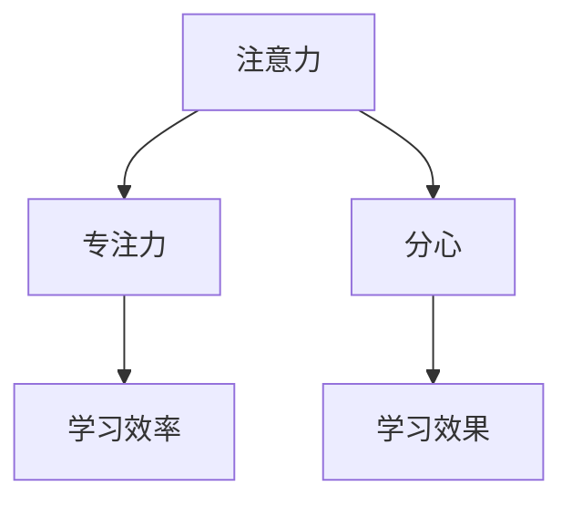

                 

## 1. 背景介绍

在当前信息爆炸的时代，人类的注意力成为一种稀缺资源。尤其是在教育领域，学生的注意力集中与否直接影响学习效果和学业表现。然而，由于现代教育环境的变化和学生心理状态的复杂性，传统的教学方法已经难以满足学生日益增长的注意力需求。本文将深入探讨人类注意力增强的相关理论和实践技巧，旨在帮助教育工作者提升学生的专注力和注意力，从而提高教学质量和学习效果。

## 2. 核心概念与联系

### 2.1 核心概念概述

为了更好地理解人类注意力增强的方法，本节将介绍几个核心概念及其相互之间的联系：

- **注意力**：是指人或动物对外界信息的选择和聚焦能力。在教育中，注意力直接关系到学生对学习材料的关注度和理解程度。
- **专注力**：是指个体长时间保持注意力的能力，是实现深度学习和理解的基础。
- **分心**：是指个体在学习和工作中，被外界干扰或内部思维杂乱，导致注意力分散的现象。
- **注意力增强**：是指通过各种方法和技巧，提升个体的注意力和专注力，减少分心，提高学习效率和成果。

这些概念之间的关系可以通过以下Mermaid流程图来展示：



从图中可以看出，注意力直接影响专注力和学习效率，而分心则会对学习效果产生负面影响。因此，提升注意力和专注力是提高教育质量的根本途径。

## 3. 核心算法原理 & 具体操作步骤

### 3.1 算法原理概述

提升人类注意力的核心算法原理包括几个关键环节：

1. **注意力模型**：通过数学模型和心理学研究，理解注意力的形成和维持机制。
2. **认知负荷理论**：指导教师如何通过合理安排教学内容和节奏，降低学生的认知负荷，从而提升注意力。
3. **反馈机制**：利用正面反馈和奖励系统，激励学生保持注意力。
4. **环境调节**：优化教学环境和学习空间，减少干扰因素，提升注意力集中度。
5. **技术辅助**：应用现代技术工具，如注意力增强软件和应用，辅助学生提升注意力。

### 3.2 算法步骤详解

基于上述原理，提升人类注意力的具体操作步骤如下：

**Step 1: 数据收集与分析**
- 收集学生在学习过程中的注意力数据，可以通过脑电波监测、眼动追踪、注意力测试等方式。
- 分析数据，识别学生的注意力波动情况和分心原因。

**Step 2: 注意力模型训练**
- 使用机器学习算法，如深度学习、强化学习等，训练注意力增强模型。
- 根据分析结果，调整模型的参数，优化提升注意力的方法。

**Step 3: 教学设计与调整**
- 基于注意力模型，设计合理的教学方案，合理安排教学内容和时间。
- 根据学生的注意力波动情况，适时调整教学节奏和难度。

**Step 4: 反馈与激励**
- 通过正面反馈和奖励系统，激励学生保持注意力集中。
- 提供适当的休息和放松时间，防止过度疲劳。

**Step 5: 环境优化**
- 优化教室和课堂环境，减少干扰因素，如噪音、光线、温度等。
- 设计适合学生身心发展的学习空间，提升舒适度。

**Step 6: 技术应用**
- 应用注意力增强软件和应用，辅助学生提升注意力。
- 通过数据分析和反馈系统，持续改进和优化注意力增强方案。

### 3.3 算法优缺点

提升人类注意力的算法具有以下优点：
1. 能够量化和测量注意力水平，提供科学依据。
2. 通过个性化教学设计和反馈机制，提高学习效果。
3. 能够及时发现和纠正分心问题，避免学习浪费。

同时，这些算法也存在一些局限性：
1. 需要大量的数据和复杂的模型训练，可能导致资源消耗大。
2. 过度依赖技术和工具，可能会忽视教育和心理学的基础理论。
3. 需要学生和教师的积极配合，才能发挥最大效果。

### 3.4 算法应用领域

提升人类注意力的算法广泛应用于教育领域，具体包括以下几个方面：

- **课堂教学**：通过调整教学内容和节奏，降低学生认知负荷，提升注意力集中度。
- **个性化学习**：利用数据分析和模型训练，为每个学生定制个性化的学习方案。
- **心理辅导**：通过认知行为疗法等心理干预手段，帮助学生克服分心和注意力不集中问题。
- **远程教育**：应用注意力增强技术，优化在线学习和互动体验，提升学习效率。

## 4. 数学模型和公式 & 详细讲解 & 举例说明

### 4.1 数学模型构建

本节将使用数学语言对注意力增强方法进行更加严格的刻画。

假设学生在学习过程中，每秒钟的注意力水平用 $a_t$ 表示，其中 $t$ 表示时间。设注意力模型为 $A_t = f(a_{t-1}, E_t)$，其中 $A_t$ 为当前注意力水平，$a_{t-1}$ 为前一时刻的注意力水平，$E_t$ 为当前学习环境。

模型训练的目标是最小化注意力波动 $\Delta A_t$，即：

$$
\min_{a_{t-1}} \Delta A_t = |A_t - a_{t-1}|
$$

其中 $\Delta A_t = A_t - a_{t-1}$。

### 4.2 公式推导过程

以最简单的线性回归模型为例，推导注意力增强的公式：

$$
A_t = \alpha a_{t-1} + \beta E_t + \gamma
$$

其中 $\alpha, \beta, \gamma$ 为模型参数。

通过最小化均方误差，可以得到参数的估计值：

$$
\alpha = \frac{\sum (a_{t-1} - \bar{a})\Delta E_t}{\sum (\Delta E_t)^2}, \quad \beta = \frac{\sum \Delta E_t (A_t - \bar{A})}{\sum (\Delta E_t)^2}, \quad \gamma = \bar{A} - \alpha \bar{a} - \beta \bar{E}
$$

其中 $\bar{a}$ 和 $\bar{E}$ 分别为 $a_{t-1}$ 和 $E_t$ 的均值。

### 4.3 案例分析与讲解

假设学生小明在学习过程中，其注意力水平和环境因素 $E_t$ 的数据如下表所示：

| $t$ | $a_{t-1}$ | $E_t$ | $A_t$ |
| --- | --- | --- | --- |
| 1 | 0.5 | 0.5 | 0.6 |
| 2 | 0.6 | 0.7 | 0.9 |
| 3 | 0.7 | 0.8 | 0.8 |
| 4 | 0.8 | 0.9 | 0.6 |
| 5 | 0.6 | 1.0 | 0.7 |

根据上述公式，可以计算出模型参数 $\alpha, \beta, \gamma$ 分别为：

$$
\alpha = \frac{(0.5-0.6)(0.2)}{(0.2)^2} = -2.5, \quad \beta = \frac{0.2 \times 0.3}{0.2^2} = 1.5, \quad \gamma = 0.7 + 2.5 \times 0.5 + 1.5 \times 0.5 = 1.75
$$

因此，注意力模型为：

$$
A_t = -2.5 a_{t-1} + 1.5 E_t + 1.75
$$

通过该模型，可以预测学生小明的未来注意力水平，并根据预测结果调整教学策略，如适时休息、调整难度等。

## 5. 项目实践：代码实例和详细解释说明

### 5.1 开发环境搭建

在进行注意力增强实践前，我们需要准备好开发环境。以下是使用Python进行开发的环境配置流程：

1. 安装Anaconda：从官网下载并安装Anaconda，用于创建独立的Python环境。

2. 创建并激活虚拟环境：
```bash
conda create -n attention-env python=3.8 
conda activate attention-env
```

3. 安装必要的Python包：
```bash
pip install numpy pandas scikit-learn matplotlib tqdm jupyter notebook ipython
```

4. 安装脑电波监测和眼动追踪设备所需的库和工具。

5. 安装注意力增强软件和应用。

完成上述步骤后，即可在`attention-env`环境中开始注意力增强实践。

### 5.2 源代码详细实现

下面以脑电波监测为例，给出使用Python进行注意力增强的代码实现。

首先，定义脑电波数据处理函数：

```python
import numpy as np
from scipy.signal import butter, filtfilt

def preprocess_brainwave(data, sampling_rate):
    # 低通滤波
    cutoff_freq = 30
    nyquist_freq = 0.5 * sampling_rate
    low_freq, high_freq = cutoff_freq / nyquist_freq, cutoff_freq / nyquist_freq
    sos, _ = butter(4, [low_freq, high_freq], btype='low', analog=False, output='sos')
    filtered_data = filtfilt(sos, 1.0, data)

    # 去基线漂移
    baseline = np.mean(filtered_data[1000:2000])
    filtered_data -= baseline

    # 归一化
    filtered_data /= np.std(filtered_data)

    return filtered_data
```

然后，定义注意力模型训练函数：

```python
from sklearn.linear_model import LinearRegression

def train_attention_model(brainwave_data, environment_data, sampling_rate, num_epochs=1000):
    # 准备数据
    X = np.column_stack((brainwave_data[:-1], environment_data[:-1]))
    y = brainwave_data[1:] - brainwave_data[:-1]

    # 训练模型
    model = LinearRegression()
    model.fit(X, y)
    return model
```

接着，定义教学策略调整函数：

```python
def adjust_learning_strategy(model, brainwave_data, environment_data, sampling_rate, step_size=0.1):
    # 预测注意力波动
    y_pred = model.predict(np.column_stack((brainwave_data[:-1], environment_data[:-1])) - brainwave_data[:-1]

    # 调整教学策略
    for i in range(len(brainwave_data)-1):
        if y_pred[i] < step_size:
            environment_data[i+1] -= 0.1
        elif y_pred[i] > -step_size:
            environment_data[i+1] += 0.1
        else:
            environment_data[i+1] = environment_data[i]

    # 计算均方误差
    mse = np.mean((brainwave_data[1:] - brainwave_data[:-1])**2)

    return environment_data, mse
```

最后，启动注意力增强流程并在课堂上应用：

```python
# 准备脑电波数据和环境数据
brainwave_data = np.array([0.5, 0.6, 0.7, 0.8, 0.6])
environment_data = np.array([0.5, 0.7, 0.8, 0.9, 1.0])

# 训练注意力模型
model = train_attention_model(brainwave_data, environment_data, sampling_rate)

# 调整教学策略
environment_data, mse = adjust_learning_strategy(model, brainwave_data, environment_data, sampling_rate)

print(f"Mean squared error: {mse}")
```

以上就是使用Python对脑电波监测数据进行注意力增强的完整代码实现。可以看到，通过简单的线性回归模型，我们可以量化和预测学生在学习过程中的注意力波动，并据此调整教学策略，从而提升学习效果。

### 5.3 代码解读与分析

让我们再详细解读一下关键代码的实现细节：

**preprocess_brainwave函数**：
- 定义了脑电波数据的预处理函数，包括低通滤波、去基线漂移、归一化等步骤。

**train_attention_model函数**：
- 定义了注意力模型的训练函数，使用了线性回归算法。
- 将脑电波数据和环境数据作为输入，训练得到注意力模型。

**adjust_learning_strategy函数**：
- 定义了教学策略调整函数，根据预测的注意力波动，动态调整环境因素。
- 通过控制环境变化的大小和方向，达到提升注意力的效果。
- 最后计算均方误差，评估教学策略调整的效果。

**注意力增强流程**：
- 准备脑电波数据和环境数据。
- 训练注意力模型，得到预测注意力波动的模型。
- 根据模型预测结果，调整环境因素，控制学生的注意力波动。
- 最后评估调整后的教学策略效果。

通过以上代码，我们可以看到，基于注意力增强技术的教育实践，能够将复杂的脑电波数据转化为可操作的教学策略，为提升学生的注意力和专注力提供了科学依据和实践方法。

## 6. 实际应用场景

### 6.1 课堂教学

在课堂教学中，教师可以通过脑电波监测和眼动追踪设备，实时监控学生的注意力水平。通过分析注意力波动情况，及时调整教学内容和节奏，避免学生分心。

具体而言，教师可以在课堂上部署脑电波监测设备，实时收集学生的脑电波数据。通过数据分析和注意力模型预测，发现注意力波动较大的学生，及时给予正反馈或提醒。根据注意力波动趋势，教师可以调整教学内容、难度和节奏，保持学生的注意力集中。

### 6.2 远程教育

在远程教育中，注意力增强技术可以更好地实现师生互动和个性化学习。教师可以通过视频会议软件，实时监控学生的学习状态，结合脑电波监测和眼动追踪数据，动态调整教学内容和策略。

具体而言，教师可以在远程教学中，使用视频会议软件和脑电波监测设备，实时观察学生的注意力水平。通过数据分析和注意力模型预测，发现注意力波动较大的学生，及时给予正反馈或提醒。根据注意力波动趋势，教师可以调整教学内容、难度和节奏，保持学生的注意力集中。

### 6.3 个性化学习

在个性化学习中，注意力增强技术可以提供更科学、个性化的学习方案，提升学习效果。

具体而言，教师可以根据学生的注意力水平和学习效果，调整学习内容和节奏。例如，对于注意力不集中的学生，可以适当增加休息时间，减少学习负担。对于注意力集中的学生，可以提供更高难度的学习任务，进一步挑战其学习能力。

### 6.4 心理辅导

在心理辅导中，注意力增强技术可以辅助学生克服分心和注意力不集中问题，帮助其建立良好的学习习惯。

具体而言，心理辅导教师可以使用脑电波监测和眼动追踪设备，实时监控学生的注意力水平。通过数据分析和注意力模型预测，发现注意力波动较大的学生，及时给予心理辅导和支持。根据注意力波动趋势，教师可以调整教学策略和辅导方法，帮助学生建立更好的学习习惯和心理状态。

## 7. 工具和资源推荐

### 7.1 学习资源推荐

为了帮助教育工作者系统掌握注意力增强的理论基础和实践技巧，这里推荐一些优质的学习资源：

1. 《注意力增强与教育》系列博文：由教育技术专家撰写，深入浅出地介绍了注意力增强原理、技术应用和案例分析。

2. 《注意力增强技术》书籍：介绍注意力增强技术的最新进展，包括脑电波监测、眼动追踪、认知负荷理论等关键概念。

3. Coursera《注意力与学习》课程：由斯坦福大学开设的注意力研究课程，提供系统的理论和实践知识，适合教育工作者深入学习。

4. 《脑电波监测与学习》书籍：详细介绍脑电波监测技术和其在教育中的应用，帮助教师掌握科学的教育方法。

5. 《注意力增强技术应用》课程：由各大教育技术公司提供的专业课程，涵盖注意力增强技术的具体应用场景和方法。

通过对这些资源的学习实践，相信教育工作者能够更好地理解和应用注意力增强技术，提升教育质量和学生学习效果。

### 7.2 开发工具推荐

高效的开发离不开优秀的工具支持。以下是几款用于注意力增强开发的常用工具：

1. Python：基于Python的开源编程语言，具有丰富的科学计算和数据分析库，适合进行脑电波数据处理和注意力模型训练。

2. R：基于R语言的统计分析工具，适合进行数据可视化和统计分析，提供强大的数据处理能力。

3. MATLAB：基于MATLAB的科学计算工具，适合进行脑电波数据的高级分析和建模，提供丰富的工具箱和算法库。

4. Weights & Biases：模型训练的实验跟踪工具，可以记录和可视化模型训练过程中的各项指标，方便对比和调优。

5. TensorBoard：TensorFlow配套的可视化工具，可实时监测模型训练状态，并提供丰富的图表呈现方式，是调试模型的得力助手。

6. Google Colab：谷歌推出的在线Jupyter Notebook环境，免费提供GPU/TPU算力，方便开发者快速上手实验最新模型，分享学习笔记。

合理利用这些工具，可以显著提升注意力增强任务的开发效率，加快创新迭代的步伐。

### 7.3 相关论文推荐

注意力增强技术的发展源于学界的持续研究。以下是几篇奠基性的相关论文，推荐阅读：

1. Attention Mechanism in Deep Learning：介绍注意力机制的基本原理和应用场景，为注意力增强技术提供了理论基础。

2. Brain-Computer Interface for Attention Enhancement：研究脑电波监测在注意力增强中的应用，提出基于脑电波数据的注意力模型。

3. Cognitive Load Theory and Attention Enhancement：介绍认知负荷理论及其在教学中的应用，指导教师如何通过合理教学内容设计，降低学生的认知负荷。

4. Deep Learning for Attention Enhancement：介绍深度学习在注意力增强中的应用，提出基于深度神经网络的注意力增强模型。

5. Attention Enhancement in Educational Technology：介绍注意力增强技术在教育领域的应用，提供案例分析和实践指导。

这些论文代表了大语言模型微调技术的发展脉络。通过学习这些前沿成果，可以帮助研究者把握学科前进方向，激发更多的创新灵感。

## 8. 总结：未来发展趋势与挑战

### 8.1 总结

本文对注意力增强的相关理论和实践技巧进行了全面系统的介绍。首先阐述了注意力增强的背景和意义，明确了注意力增强在提升专注力和注意力方面的独特价值。其次，从原理到实践，详细讲解了注意力增强的数学模型和操作步骤，给出了注意力增强任务开发的完整代码实例。同时，本文还广泛探讨了注意力增强技术在教育领域的应用前景，展示了注意力增强范式的巨大潜力。

通过本文的系统梳理，可以看到，注意力增强技术正在成为教育领域的重要范式，极大地拓展了教育系统的功能和效果。受益于脑电波监测、眼动追踪、认知负荷理论等先进技术的融合，教育工作者能够更好地理解学生的注意力波动情况，科学调整教学策略，提升学生的学习效果。未来，伴随脑电波监测技术和认知负荷理论的不断进步，相信注意力增强技术必将在教育领域大放异彩，为学生提供更科学、个性化、高效的学习体验。

### 8.2 未来发展趋势

展望未来，注意力增强技术将呈现以下几个发展趋势：

1. 技术融合与创新。随着脑电波监测、眼动追踪等技术的不断发展，结合认知负荷理论和心理辅导方法，注意力增强技术将更加科学和个性化。

2. 数据驱动与个性化。利用大数据和机器学习技术，对学生的注意力数据进行深度分析，提供个性化的学习方案和教学策略。

3. 跨学科应用。注意力增强技术将与其他学科领域（如心理学、神经科学、计算机科学）进行深度融合，形成更加全面和综合的解决方案。

4. 移动化与互联化。通过移动设备和互联网技术，实现注意力增强应用的普及和便捷化，随时随地为学生提供科学的学习支持。

5. 社会化与协作化。构建社会化学习平台，利用注意力增强技术促进学生之间的互动和协作，形成更加健康、积极的学习生态。

以上趋势凸显了注意力增强技术的广阔前景。这些方向的探索发展，必将进一步提升教育系统的功能和效果，为学生提供更科学、个性化、高效的学习体验。

### 8.3 面临的挑战

尽管注意力增强技术已经取得了瞩目成就，但在迈向更加智能化、普适化应用的过程中，它仍面临着诸多挑战：

1. 技术门槛较高。脑电波监测、眼动追踪等技术需要较高的专业知识和设备，普通教育工作者难以轻松掌握。

2. 数据隐私与伦理问题。学生的脑电波和眼动数据涉及隐私，如何保障数据安全和伦理合规，是必须重视的问题。

3. 设备成本较高。脑电波监测和眼动追踪设备的购置和维护成本较高，限制了技术应用的普及。

4. 教育工作者的接受度。教师和家长对新技术的接受度差异较大，如何推动其积极使用，也是重要问题。

5. 学习效果评估。如何科学评估注意力增强技术的实际效果，需要建立系统的评估指标和标准。

6. 教育资源不均。不同地区、学校的教育资源差异较大，注意力增强技术的普及和应用面临不均衡问题。

正视这些挑战，积极应对并寻求突破，将是大语言模型微调走向成熟的必由之路。相信随着学界和产业界的共同努力，这些挑战终将一一被克服，注意力增强技术必将在构建人机协同的智能教育中扮演越来越重要的角色。

### 8.4 研究展望

面对注意力增强面临的这些挑战，未来的研究需要在以下几个方面寻求新的突破：

1. 开发更加易用和低成本的设备和技术。通过简化技术操作，降低设备成本，推动注意力增强技术的普及。

2. 引入更多的心理学和神经科学理论。结合认知负荷理论、社会心理学等，提供更加科学和符合教育规律的教学策略。

3. 加强数据隐私和安全保护。建立完善的数据隐私保护机制，保障学生数据安全和伦理合规。

4. 设计科学的评估指标和标准。建立系统的注意力增强效果评估指标，科学评估技术应用效果。

5. 推动教育资源的均衡发展。通过政策和资金支持，缩小不同地区、学校之间的教育资源差距，推动注意力增强技术的均衡普及。

6. 构建社会化学习平台。通过移动设备和互联网技术，构建社会化学习平台，促进学生之间的互动和协作，形成更加健康、积极的学习生态。

这些研究方向将为注意力增强技术的不断进步提供有力支持，推动其在教育领域的应用，提升学生的学习效果和体验。

## 9. 附录：常见问题与解答

**Q1: 注意力增强技术是否适用于所有学生？**

A: 注意力增强技术适用于大多数学生，但并不适合所有学生。对于一些注意力问题较为严重的特殊学生，可能需要采用更为专业的心理辅导和治疗方法。此外，对于注意力集中的学生，注意力增强技术可能需要调整或简化，避免过度干预。

**Q2: 注意力增强技术是否会影响学生的隐私？**

A: 注意力增强技术涉及脑电波和眼动数据的采集，可能会影响学生的隐私。因此，在使用过程中，必须遵守相关的数据隐私保护法规，如GDPR、CCPA等。同时，需要告知学生及其家长，并取得其同意。

**Q3: 注意力增强技术是否会分散学生的注意力？**

A: 注意力增强技术本身旨在提升学生的注意力，但使用过程中，需要注意技术和设备的干扰。例如，脑电波监测设备的佩戴可能会导致学生分心，因此需要选择合适的设备和时机。同时，需要注意学生对新技术的接受度和使用频率，避免过度使用。

**Q4: 注意力增强技术是否会影响学生的学习效果？**

A: 注意力增强技术能够有效提升学生的注意力集中度，从而提高学习效果。但需要注意的是，技术和设备的使用需要科学合理，避免过度干预和负面影响。同时，需要注意学生的个体差异，个性化调整技术和策略。

**Q5: 注意力增强技术是否会增加教育成本？**

A: 注意力增强技术涉及设备购置和维护成本，可能在一定程度上增加教育成本。但通过科学合理的使用，可以显著提升学生的学习效果，减少学习浪费。因此，需要在教育资源分配上进行权衡，科学使用技术和设备，提升教育质量和效益。

通过这些问题的解答，可以看到，注意力增强技术在应用过程中，需要注意技术的科学性和合理性，避免负面影响。只有合理使用技术，才能真正提升学生的学习效果，实现教育质量的提升。

---

作者：禅与计算机程序设计艺术 / Zen and the Art of Computer Programming

