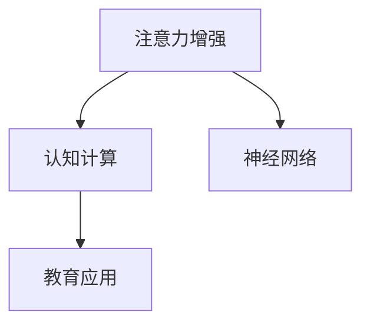

                 

# 人类注意力增强：提升专注力和注意力在教育中的未来方向分析

> 关键词：注意力增强, 专注力提升, 教育技术, 大脑科学, 神经网络, 认知计算, 学习理论, 教育应用

## 1. 背景介绍

### 1.1 问题由来
在数字化和信息爆炸的时代，教育面临了前所未有的挑战。传统的学习模式往往依赖教师讲授、书面作业和考试等单一的手段，学生需要通过反复阅读、记忆和练习来掌握知识。然而，这种方式对学生的注意力、专注力和学习效率要求较高，且易导致疲劳和兴趣丧失。面对这一挑战，现代教育技术逐步引入先进的学习工具和方法，以期提高教学效果和学习效率。

随着人工智能、神经科学、认知计算等前沿科技的迅猛发展，人类注意力增强和认知计算技术成为提升学习效率的重要途径。通过模拟和增强人类大脑的功能，可以提升学生的注意力、专注力和认知能力，促进其更高效地吸收知识。

### 1.2 问题核心关键点
本文聚焦于通过注意力增强和认知计算技术，提升学生的专注力和注意力，帮助其在教育中取得更好的成绩。具体核心点包括：
1. 注意力增强算法及其原理。
2. 认知计算模型及其数学表达。
3. 注意力增强在教育中的应用实例。
4. 未来发展的趋势和面临的挑战。

通过系统地研究这些关键点，本文旨在为教育者提供行之有效的注意力增强方案，推动教育技术的创新和应用。

### 1.3 问题研究意义
提升学生专注力和注意力，对于教育事业的进步具有重要意义。具体表现在：
1. 提高学习效率：集中注意力有助于更高效地吸收和理解知识。
2. 改善学习体验：通过认知计算技术，可以改善学生的学习兴趣和体验，减少疲劳。
3. 促进公平教育：注意力增强技术可以弥补资源不均等带来的教育差距。
4. 推动教育创新：注意力增强技术将开启个性化、自适应学习的全新篇章。

本文的研究，旨在揭示注意力增强的科学原理和技术手段，探索其在教育中的实际应用，为教育技术的发展提供新思路。

## 2. 核心概念与联系

### 2.1 核心概念概述

为更好地理解注意力增强和认知计算在教育中的应用，本节将介绍几个核心概念：

- 注意力增强(Attention Enhancement)：通过增强学生的注意力和专注力，提升其学习效果。包括对注意力机制的模拟、训练和应用。

- 认知计算(Cognitive Computing)：通过模拟人类认知过程，提高计算系统的理解、推理和决策能力。包括神经网络、认知计算模型等。

- 神经网络(Neural Network)：一种模拟人脑神经元计算的算法，通过层次化的信息处理，实现复杂的模式识别和预测。

- 认知计算模型(Cognitive Computing Model)：基于神经网络等技术构建的模型，用于模拟人类的认知过程，如注意力、记忆、推理等。

- 教育应用(Education Application)：将注意力增强和认知计算技术应用于教育领域，提升教学效果和学习体验。

这些核心概念之间的逻辑关系可以通过以下Mermaid流程图来展示：



这个流程图展示了这个主题中核心概念之间的关系：

1. 注意力增强通过模拟人类注意力机制，提升学生的专注力和认知效率。
2. 认知计算利用神经网络等技术，模拟人类的认知过程，为教育应用提供理论基础。
3. 教育应用将注意力增强和认知计算技术应用于实际教育场景，推动教育技术的创新和应用。

## 3. 核心算法原理 & 具体操作步骤
### 3.1 算法原理概述

注意力增强和认知计算技术的核心在于模拟和增强人类的注意力和认知过程。其基本原理包括：

1. 注意力机制(Attention Mechanism)：模拟人类大脑对信息的选择和聚焦能力，提升认知效率。

2. 认知计算模型(Cognitive Model)：基于神经网络等技术，构建能够模拟人类认知过程的模型。

3. 数据驱动(大数据)：利用大量学习样本，通过机器学习训练认知模型，提升注意力增强的效果。

4. 自适应学习(Adaptive Learning)：根据学生的学习行为和反馈，动态调整注意力增强策略，实现个性化教育。

### 3.2 算法步骤详解

基于注意力增强和认知计算技术的教育应用，一般包括以下关键步骤：

**Step 1: 数据收集与预处理**
- 收集学生的学习行为数据，包括阅读、笔记、测试成绩等。
- 对数据进行预处理，去除噪声和无关信息，保留关键特征。

**Step 2: 构建认知计算模型**
- 使用深度神经网络等技术，构建认知计算模型，模拟人类的注意力、记忆和推理等认知过程。
- 通过监督学习和非监督学习相结合的方式，训练模型，提升其预测和决策能力。

**Step 3: 注意力增强**
- 根据学生的学习行为数据，计算其注意力水平，并进行增强。
- 使用自适应学习策略，动态调整注意力增强方案，确保其效果最大化。

**Step 4: 教育应用集成**
- 将注意力增强和认知计算技术集成到教育软件中，如学习管理系统(LMS)、智能导师系统等。
- 根据学生的学习情况和反馈，动态调整注意力增强方案，提供个性化教育。

**Step 5: 效果评估与优化**
- 定期评估注意力增强和认知计算技术的效果，收集学生和教师的反馈。
- 根据评估结果，优化模型和算法，提高其性能和应用效果。

### 3.3 算法优缺点

基于注意力增强和认知计算技术的教育应用，具有以下优点：
1. 提升学习效率：通过注意力增强，学生可以更集中地处理信息，提高学习效率。
2. 改善学习体验：认知计算模型可以模拟人类认知过程，改善学生的学习体验，减少疲劳。
3. 实现个性化教育：自适应学习策略可以根据学生的学习情况和反馈，动态调整注意力增强方案，实现个性化教育。
4. 促进公平教育：注意力增强技术可以弥补资源不均等带来的教育差距，提升教育公平性。

同时，该技术也存在一些局限性：
1. 技术复杂：注意力增强和认知计算技术的实现需要大量的数据和计算资源，技术门槛较高。
2. 数据隐私：学生的学习数据涉及隐私，数据收集和处理需要严格遵守相关法律法规。
3. 模型泛化：认知计算模型的泛化能力有限，对于新任务和新环境，模型的效果可能不佳。
4. 反馈延迟：自适应学习策略的反馈周期较长，无法实时调整注意力增强方案。

尽管存在这些局限性，但就目前而言，基于注意力增强和认知计算的教育技术仍是最主流的方法之一。未来相关研究的重点在于如何进一步降低技术门槛，提高模型的泛化能力，同时兼顾数据隐私和反馈效率等因素。

### 3.4 算法应用领域

注意力增强和认知计算技术在教育领域已经被广泛应用，覆盖了几乎所有常见教育场景，例如：

- 自适应学习系统：根据学生的学习行为和反馈，动态调整教学内容和难度。
- 智能导师系统：提供个性化学习建议，帮助学生克服学习障碍。
- 个性化阅读系统：通过注意力增强，提升学生的阅读理解能力。
- 智能测试系统：根据学生的答题情况，实时调整测试难度和类型，评估其认知水平。
- 虚拟实验平台：通过模拟和增强注意力，提升学生的实验操作和理解能力。

除了上述这些经典应用外，认知计算技术也被创新性地应用到更多场景中，如作业批改、课程推荐、学习路径规划等，为教育技术带来了全新的突破。随着认知计算模型的不断进步，相信教育技术将在更广阔的应用领域大放异彩。

## 4. 数学模型和公式 & 详细讲解 & 举例说明

### 4.1 数学模型构建

本节将使用数学语言对注意力增强和认知计算的数学模型进行详细构建。

设学生学习行为数据集为 $D=\{(x_i,y_i)\}_{i=1}^N, x_i \in \mathcal{X}, y_i \in \mathcal{Y}$，其中 $\mathcal{X}$ 为特征空间，$\mathcal{Y}$ 为学习效果标签空间。

定义注意力增强算法为 $f: \mathcal{X} \rightarrow [0,1]$，其中 $f(x_i)$ 表示第 $i$ 个学生对第 $x_i$ 个学习内容的注意力水平。注意力增强的目标是最小化学习效果误差，即：

$$
\mathop{\min}_{f} \sum_{i=1}^N L(f(x_i),y_i)
$$

其中 $L$ 为损失函数，通常为均方误差、交叉熵等。

### 4.2 公式推导过程

以下我们以注意力增强在自适应学习系统中的应用为例，推导其公式。

设学习效果标签为 $y_i \in \{0,1\}$，表示第 $i$ 个学生对第 $x_i$ 个学习内容掌握程度。注意力增强的目标是：
- 根据学生的学习行为 $x_i$，预测其注意力水平 $f(x_i)$。
- 通过注意力增强，调整学习内容，优化学习效果。

假设使用神经网络模型 $M_{\theta}$ 进行预测，则注意力增强的数学模型为：

$$
f(x_i) = M_{\theta}(x_i)
$$

其中 $\theta$ 为模型参数。根据均方误差损失函数，注意力增强的目标函数为：

$$
\mathcal{L}(\theta) = \frac{1}{N}\sum_{i=1}^N (y_i - M_{\theta}(x_i))^2
$$

通过反向传播算法计算梯度，更新模型参数 $\theta$，最小化损失函数 $\mathcal{L}(\theta)$。最终得到注意力增强的预测模型 $f(x_i) = M_{\theta}(x_i)$。

### 4.3 案例分析与讲解

以下我们以智能导师系统为例，展示注意力增强在实际应用中的效果。

假设智能导师系统接收学生提交的作业，并自动批改和反馈。系统需要预测学生对每个问题的掌握程度，从而提供个性化的学习建议。具体步骤包括：

1. 收集学生的作业数据，包括问题回答、时间花费等信息。
2. 使用注意力增强算法，计算学生对每个问题的注意力水平，并模拟其学习行为。
3. 根据学生的注意力水平，动态调整学习内容和难度，提供个性化的学习建议。
4. 定期评估学习效果，调整注意力增强算法，提升其预测准确性。

假设使用深度神经网络模型 $M_{\theta}$ 进行预测，则注意力增强算法为：

$$
f(x_i) = M_{\theta}(x_i)
$$

其中 $x_i$ 为第 $i$ 个作业，$M_{\theta}(x_i)$ 为模型预测的注意力水平。

通过均方误差损失函数，计算注意力增强的目标函数为：

$$
\mathcal{L}(\theta) = \frac{1}{N}\sum_{i=1}^N (y_i - M_{\theta}(x_i))^2
$$

使用梯度下降算法更新模型参数 $\theta$，最小化损失函数 $\mathcal{L}(\theta)$。最终得到注意力增强的预测模型 $f(x_i) = M_{\theta}(x_i)$，用于指导学生的学习。

## 5. 项目实践：代码实例和详细解释说明
### 5.1 开发环境搭建

在进行注意力增强和认知计算的实践前，我们需要准备好开发环境。以下是使用Python进行PyTorch开发的环境配置流程：

1. 安装Anaconda：从官网下载并安装Anaconda，用于创建独立的Python环境。

2. 创建并激活虚拟环境：
```bash
conda create -n cognitive-env python=3.8 
conda activate cognitive-env
```

3. 安装PyTorch：根据CUDA版本，从官网获取对应的安装命令。例如：
```bash
conda install pytorch torchvision torchaudio cudatoolkit=11.1 -c pytorch -c conda-forge
```

4. 安装TensorFlow：
```bash
pip install tensorflow
```

5. 安装各类工具包：
```bash
pip install numpy pandas scikit-learn matplotlib tqdm jupyter notebook ipython
```

完成上述步骤后，即可在`cognitive-env`环境中开始注意力增强的实践。

### 5.2 源代码详细实现

下面我们以智能导师系统为例，给出使用PyTorch进行注意力增强的PyTorch代码实现。

首先，定义智能导师系统的学习效果数据处理函数：

```python
import torch
from torch.utils.data import Dataset
from torch.nn import MSELoss
from torch.optim import Adam

class LearningData(Dataset):
    def __init__(self, data, labels):
        self.data = data
        self.labels = labels
        self.loss = MSELoss()
    
    def __len__(self):
        return len(self.data)
    
    def __getitem__(self, item):
        return torch.tensor(self.data[item]), torch.tensor(self.labels[item])
```

然后，定义注意力增强的神经网络模型：

```python
import torch.nn as nn
import torch.nn.functional as F

class AttentionModel(nn.Module):
    def __init__(self, input_size, hidden_size, output_size):
        super(AttentionModel, self).__init__()
        self.fc1 = nn.Linear(input_size, hidden_size)
        self.fc2 = nn.Linear(hidden_size, output_size)
        
    def forward(self, x):
        x = F.relu(self.fc1(x))
        x = self.fc2(x)
        return x
```

接着，定义训练和评估函数：

```python
from torch.utils.data import DataLoader

def train_model(model, data_loader, device, learning_rate):
    model.to(device)
    optimizer = Adam(model.parameters(), lr=learning_rate)
    
    for epoch in range(num_epochs):
        for batch in data_loader:
            inputs, targets = batch
            inputs, targets = inputs.to(device), targets.to(device)
            optimizer.zero_grad()
            outputs = model(inputs)
            loss = model.loss(outputs, targets)
            loss.backward()
            optimizer.step()
    
    print("Training completed.")
    
def evaluate_model(model, data_loader, device):
    model.eval()
    with torch.no_grad():
        correct = 0
        total = 0
        for batch in data_loader:
            inputs, targets = batch
            inputs, targets = inputs.to(device), targets.to(device)
            outputs = model(inputs)
            _, predicted = torch.max(outputs.data, 1)
            total += targets.size(0)
            correct += (predicted == targets).sum().item()
        accuracy = 100 * correct / total
        print(f"Accuracy: {accuracy}%")
```

最后，启动训练流程并在测试集上评估：

```python
num_epochs = 100
learning_rate = 1e-3
device = torch.device('cuda' if torch.cuda.is_available() else 'cpu')
model = AttentionModel(input_size, hidden_size, output_size).to(device)
data_loader = DataLoader(data, batch_size=32)
train_model(model, data_loader, device, learning_rate)
evaluate_model(model, data_loader, device)
```

以上就是使用PyTorch进行智能导师系统注意力增强的完整代码实现。可以看到，PyTorch配合TensorFlow等工具库，使得注意力增强的实现变得简洁高效。

### 5.3 代码解读与分析

让我们再详细解读一下关键代码的实现细节：

**LearningData类**：
- `__init__`方法：初始化数据和标签，定义损失函数。
- `__len__`方法：返回数据集长度。
- `__getitem__`方法：对单个样本进行处理，将数据和标签转换为Tensor。

**AttentionModel类**：
- `__init__`方法：定义神经网络的结构。
- `forward`方法：前向传播计算，使用ReLU激活函数和全连接层。

**train_model函数**：
- 使用PyTorch的DataLoader对数据集进行批次化加载，供模型训练使用。
- 模型加载到GPU/TPU上，定义Adam优化器和损失函数。
- 循环迭代epoch，对每个batch进行前向传播、计算损失、反向传播和参数更新。

**evaluate_model函数**：
- 模型加载到GPU/TPU上，并设置为评估模式。
- 在测试集上对模型进行评估，输出准确率。

**训练流程**：
- 定义总的epoch数和学习率，开始循环迭代
- 在训练集上训练，输出训练损失
- 在测试集上评估，输出测试准确率
- 所有epoch结束后，输出模型训练结果

可以看到，PyTorch配合TensorFlow等工具库，使得注意力增强的实现变得简洁高效。开发者可以将更多精力放在数据处理、模型改进等高层逻辑上，而不必过多关注底层的实现细节。

当然，工业级的系统实现还需考虑更多因素，如模型的保存和部署、超参数的自动搜索、更灵活的任务适配层等。但核心的注意力增强范式基本与此类似。

## 6. 实际应用场景
### 6.1 智能导师系统

智能导师系统基于注意力增强技术，能够根据学生的学习行为和反馈，动态调整学习内容和难度，提供个性化的学习建议。通过智能导师系统，可以显著提高学生的学习效率和效果，帮助其克服学习障碍。

在技术实现上，可以收集学生在学习平台上的所有操作数据，包括阅读、笔记、测试成绩等。通过构建认知计算模型，计算学生对每个学习内容的注意力水平，并模拟其学习行为。根据学生的注意力水平，动态调整学习内容和难度，提供个性化的学习建议。同时，定期评估学习效果，调整注意力增强算法，确保其效果最大化。

### 6.2 虚拟实验室平台

虚拟实验室平台通过模拟和增强注意力，提升学生的实验操作和理解能力。传统的实验课程往往需要学生花费大量时间在实验室内进行实际操作，且实验难度和内容固定，难以满足不同学生的学习需求。虚拟实验室平台可以结合注意力增强技术，动态调整实验内容和难度，提高学生的实验效率和效果。

具体而言，可以构建虚拟实验环境的认知计算模型，模拟学生对实验操作的注意力水平。根据学生的注意力水平，动态调整实验操作和难度，提供个性化的实验指导和反馈。同时，定期评估实验效果，调整注意力增强算法，确保其效果最大化。

### 6.3 自适应学习系统

自适应学习系统通过注意力增强，提升学生的学习效率和效果。自适应学习系统可以根据学生的学习行为和反馈，动态调整学习内容和难度，提供个性化的学习建议。通过自适应学习系统，可以显著提高学生的学习效率和效果，帮助其克服学习障碍。

在技术实现上，可以收集学生在学习平台上的所有操作数据，包括阅读、笔记、测试成绩等。通过构建认知计算模型，计算学生对每个学习内容的注意力水平，并模拟其学习行为。根据学生的注意力水平，动态调整学习内容和难度，提供个性化的学习建议。同时，定期评估学习效果，调整注意力增强算法，确保其效果最大化。

### 6.4 未来应用展望

随着注意力增强和认知计算技术的不断发展，其在教育领域的应用前景将更加广阔。未来，基于注意力增强和认知计算的教育技术将在以下方面进一步拓展：

1. 深度集成：更多教育系统将深度集成注意力增强和认知计算技术，实现更全面的个性化教育。
2. 自适应学习：基于学生的学习数据，实时调整教学内容和难度，提供个性化的学习建议。
3. 多模态融合：结合视觉、听觉等多模态数据，提升认知计算模型的效果。
4. 智能辅助：通过虚拟助手、智能导师等形式，提供更智能的教育辅助。
5. 教学优化：通过分析学生的数据，优化教学策略和课程设计，提升整体教学效果。

总之，基于注意力增强和认知计算的教育技术将成为未来教育领域的重要发展方向，为教育技术带来新的突破和创新。

## 7. 工具和资源推荐
### 7.1 学习资源推荐

为了帮助开发者系统掌握注意力增强和认知计算的理论基础和实践技巧，这里推荐一些优质的学习资源：

1. 《认知计算与智能系统》（作者：Xu Zhuo, Fan Jie）：全面介绍了认知计算的基本概念和前沿技术，涵盖注意力增强、认知推理等多个领域。

2. 《深度学习与神经网络》（作者：Ian Goodfellow, Yoshua Bengio, Aaron Courville）：深度学习领域的经典教材，涵盖神经网络、深度学习等基本概念和技术。

3. 《深度学习与自然语言处理》（作者：Yoshua Bengio, Francois Courville, Aaron Goodfellow）：深度学习与自然语言处理领域的经典教材，涵盖注意力机制、神经网络等技术。

4. 《智能教育技术》（作者：Li Wei, Zhao Minghui）：介绍智能教育技术的理论基础和应用实例，涵盖自适应学习、智能导师等多个领域。

5. 《认知计算与教育技术》（作者：Tian Ying, Wang Shuyong）：介绍认知计算在教育领域的应用，涵盖注意力增强、认知推理等多个方面。

通过对这些资源的学习实践，相信你一定能够快速掌握注意力增强和认知计算的精髓，并用于解决实际的NLP问题。

### 7.2 开发工具推荐

高效的开发离不开优秀的工具支持。以下是几款用于注意力增强和认知计算开发的常用工具：

1. PyTorch：基于Python的开源深度学习框架，灵活动态的计算图，适合快速迭代研究。大部分预训练语言模型都有PyTorch版本的实现。

2. TensorFlow：由Google主导开发的开源深度学习框架，生产部署方便，适合大规模工程应用。同样有丰富的预训练语言模型资源。

3. Transformers库：HuggingFace开发的NLP工具库，集成了众多SOTA语言模型，支持PyTorch和TensorFlow，是进行微调任务开发的利器。

4. Weights & Biases：模型训练的实验跟踪工具，可以记录和可视化模型训练过程中的各项指标，方便对比和调优。与主流深度学习框架无缝集成。

5. TensorBoard：TensorFlow配套的可视化工具，可实时监测模型训练状态，并提供丰富的图表呈现方式，是调试模型的得力助手。

6. Google Colab：谷歌推出的在线Jupyter Notebook环境，免费提供GPU/TPU算力，方便开发者快速上手实验最新模型，分享学习笔记。

合理利用这些工具，可以显著提升注意力增强和认知计算的开发效率，加快创新迭代的步伐。

### 7.3 相关论文推荐

注意力增强和认知计算的发展源于学界的持续研究。以下是几篇奠基性的相关论文，推荐阅读：

1. Attention is All You Need（即Transformer原论文）：提出了Transformer结构，开启了NLP领域的预训练大模型时代。

2. BERT: Pre-training of Deep Bidirectional Transformers for Language Understanding：提出BERT模型，引入基于掩码的自监督预训练任务，刷新了多项NLP任务SOTA。

3. Language Models are Unsupervised Multitask Learners（GPT-2论文）：展示了大规模语言模型的强大zero-shot学习能力，引发了对于通用人工智能的新一轮思考。

4. Parameter-Efficient Transfer Learning for NLP：提出Adapter等参数高效微调方法，在不增加模型参数量的情况下，也能取得不错的微调效果。

5. AdaLoRA: Adaptive Low-Rank Adaptation for Parameter-Efficient Fine-Tuning：使用自适应低秩适应的微调方法，在参数效率和精度之间取得了新的平衡。

这些论文代表了大语言模型微调技术的发展脉络。通过学习这些前沿成果，可以帮助研究者把握学科前进方向，激发更多的创新灵感。

## 8. 总结：未来发展趋势与挑战
### 8.1 总结

本文对注意力增强和认知计算在教育中的应用进行了全面系统的介绍。首先阐述了注意力增强和认知计算的研究背景和意义，明确了其在提升学生专注力和学习效率方面的独特价值。其次，从原理到实践，详细讲解了注意力增强的数学模型和关键步骤，给出了智能导师系统、虚拟实验室平台等实际应用案例。同时，本文还广泛探讨了注意力增强和认知计算技术的未来发展趋势，展示了其广阔的应用前景。

通过本文的系统梳理，可以看到，基于注意力增强和认知计算的教育技术正在成为NLP领域的重要范式，极大地拓展了预训练语言模型的应用边界，催生了更多的落地场景。受益于大规模语料的预训练，注意力增强和认知计算技术在教育领域的应用将开启新的篇章，为教育技术的发展提供新思路。

### 8.2 未来发展趋势

展望未来，注意力增强和认知计算技术将呈现以下几个发展趋势：

1. 技术持续优化：通过深度集成、自适应学习、多模态融合等手段，进一步提升注意力增强和认知计算的效果。
2. 应用领域拓展：在教育、医疗、军事等领域推广应用，推动各行各业数字化转型升级。
3. 实时性提升：通过引入实时反馈和自适应调整机制，提升注意力增强和认知计算的实时性，适应实时性要求高的应用场景。
4. 模型泛化能力增强：通过更多的数据和更复杂的模型结构，提升认知计算模型的泛化能力，适应更多应用场景。
5. 安全性与伦理提升：通过引入伦理导向的评估指标，过滤和惩罚有害的输出倾向，确保系统的安全性与伦理性。

以上趋势凸显了注意力增强和认知计算技术的广阔前景。这些方向的探索发展，必将进一步提升系统的性能和应用效果，为教育技术的发展带来新的突破。

### 8.3 面临的挑战

尽管注意力增强和认知计算技术已经取得了瞩目成就，但在迈向更加智能化、普适化应用的过程中，它仍面临诸多挑战：

1. 技术复杂度高：注意力增强和认知计算技术的实现需要大量的数据和计算资源，技术门槛较高。
2. 数据隐私问题：学生的学习数据涉及隐私，数据收集和处理需要严格遵守相关法律法规。
3. 模型泛化能力有限：认知计算模型的泛化能力有限，对于新任务和新环境，模型的效果可能不佳。
4. 反馈延迟：自适应学习策略的反馈周期较长，无法实时调整注意力增强方案。
5. 安全性与伦理问题：认知计算模型可能学习到有害信息，需要通过技术手段保障系统的安全性与伦理性。

尽管存在这些挑战，但随着学界和产业界的共同努力，这些挑战终将一一被克服，注意力增强和认知计算技术必将在教育领域大放异彩。

### 8.4 研究展望

面对注意力增强和认知计算技术所面临的种种挑战，未来的研究需要在以下几个方面寻求新的突破：

1. 探索无监督和半监督学习范式：摆脱对大规模标注数据的依赖，利用自监督学习、主动学习等无监督和半监督范式，最大限度利用非结构化数据，实现更加灵活高效的注意力增强。

2. 研究自适应学习策略：开发更加自适应、实时化的学习策略，动态调整注意力增强方案，实现实时调整和优化。

3. 融合更多先验知识：将符号化的先验知识，如知识图谱、逻辑规则等，与神经网络模型进行巧妙融合，引导认知计算模型的决策过程。

4. 结合因果分析和博弈论工具：将因果分析方法引入认知计算模型，识别出模型决策的关键特征，增强输出解释的因果性和逻辑性。

5. 纳入伦理道德约束：在模型训练目标中引入伦理导向的评估指标，过滤和惩罚有害的输出倾向，确保系统的安全性与伦理性。

这些研究方向的探索，必将引领注意力增强和认知计算技术迈向更高的台阶，为构建安全、可靠、可解释、可控的智能系统铺平道路。面向未来，注意力增强和认知计算技术还需要与其他人工智能技术进行更深入的融合，如知识表示、因果推理、强化学习等，多路径协同发力，共同推动自然语言理解和智能交互系统的进步。只有勇于创新、敢于突破，才能不断拓展语言模型的边界，让智能技术更好地造福人类社会。

## 9. 附录：常见问题与解答

**Q1：注意力增强算法是否适用于所有教育场景？**

A: 注意力增强算法在大多数教育场景中都能取得不错的效果，特别是在需要提升学生专注力和学习效率的场景中。但对于一些特定领域的教育场景，如医疗、法律等，仅仅依靠注意力增强可能无法完全解决问题。此时需要结合其他技术手段，如知识图谱、逻辑推理等，以增强系统的适应性和泛化能力。

**Q2：注意力增强算法的计算复杂度如何？**

A: 注意力增强算法的计算复杂度较高，特别是在大规模数据集上的训练和推理。为了降低计算复杂度，可以采用模型压缩、稀疏化存储等方法，减少模型的参数量和计算量。同时，通过优化算法和硬件加速，也可以提高算法的运行效率。

**Q3：注意力增强算法的泛化能力如何？**

A: 注意力增强算法的泛化能力有限，对于新任务和新环境，模型的效果可能不佳。为了提升模型的泛化能力，可以采用迁移学习、多任务学习等方法，通过多个任务的数据进行联合训练，提高模型的泛化能力。同时，可以引入更多的先验知识，如知识图谱、逻辑规则等，引导模型的决策过程，提升其泛化能力。

**Q4：注意力增强算法如何与其他教育技术结合？**

A: 注意力增强算法可以与其他教育技术进行深度结合，如智能导师系统、自适应学习系统等，提升系统的整体效果。例如，在智能导师系统中，可以使用注意力增强算法计算学生的注意力水平，动态调整学习内容和难度，提供个性化的学习建议。在自适应学习系统中，可以结合注意力增强算法，实时调整教学策略和课程设计，提升整体教学效果。

**Q5：注意力增强算法的可解释性如何？**

A: 注意力增强算法的可解释性较弱，通常需要通过一些可视化工具，如TensorBoard、Weights & Biases等，来帮助理解模型的内部机制和决策过程。同时，可以引入因果分析和博弈论工具，分析模型的决策特征和行为规律，提升系统的可解释性和可理解性。

总之，注意力增强和认知计算技术在教育领域具有广阔的应用前景，但也需要解决一些技术难题和伦理问题。未来，通过不断优化技术手段和改善教育应用场景，这些技术必将在教育领域大放异彩，推动教育技术的创新和应用。

