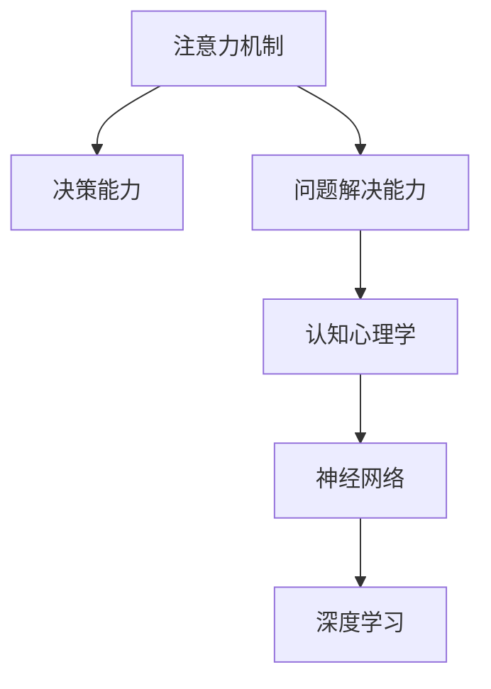

                 

# 人类注意力增强：提升决策能力和问题解决能力

> 关键词：人类注意力增强, 决策能力, 问题解决能力, 认知心理学, 神经网络, 注意力机制, 深度学习, 案例分析, 算法优化

## 1. 背景介绍

### 1.1 问题由来
人类思维是一个高度复杂的系统，其核心在于信息处理、决策与问题解决的能力。这种能力不仅影响我们的日常生活，也关乎科学创新、工程设计和艺术创作等多个领域。近年来，随着人工智能（AI）技术的迅猛发展，尤其是深度学习领域的突破，研究者们开始尝试借助计算机模型模拟和增强人类的决策与问题解决过程。其中，注意力机制因其在信息处理中的核心作用，成为研究的热点。

### 1.2 问题核心关键点
注意力机制是一种使模型能够聚焦于重要信息，同时忽略无关信息的机制。在深度学习中，注意力机制通过计算不同输入特征之间的相关性，为每个特征分配一个权重，从而选择性地增强某些特征的贡献。这一机制已在多个任务中展示了显著的性能提升，包括机器翻译、图像识别和语音识别等。通过提升决策能力和问题解决能力，注意力机制有望成为未来AI系统设计的核心。

### 1.3 问题研究意义
研究注意力增强机制，不仅能够提升AI系统的决策与问题解决能力，还能为理解人类认知过程提供新的视角。该研究的意义体现在：
1. 加速AI系统的应用推广。增强的注意力机制能够使AI系统更智能、更灵活，适用于更多复杂的应用场景。
2. 推动AI技术的发展。注意力机制的研究可能带来新的算法创新和模型改进，进一步推动AI技术向更高效、更智能的方向发展。
3. 促进跨学科交流。该研究涉及认知心理学、神经科学、计算机科学等多个领域，促进不同学科间的交流与合作。
4. 增强人类决策能力。理解并模拟人类注意力机制，可以辅助人类进行更有效的决策，提高问题解决的效率和质量。

## 2. 核心概念与联系

### 2.1 核心概念概述

为更好地理解注意力增强机制，本节将介绍几个密切相关的核心概念：

- 注意力机制(Attention Mechanism)：一种使模型能够选择性地关注输入数据中不同部分的机制。在深度学习中，通过计算输入特征之间的相关性，为每个特征分配一个权重，从而选择性地增强某些特征的贡献。
- 决策能力(Decision-Making Ability)：指在面对复杂问题时，能够快速、准确地做出最优选择的能力。
- 问题解决能力(Problem-Solving Ability)：指在遇到新问题时，能够通过推理、试错等方式找到解决方案的能力。
- 认知心理学(Cognitive Psychology)：研究人类思维和心理过程的科学，为理解注意力机制提供了理论基础。
- 神经网络(Neural Networks)：模拟人脑神经元工作的计算模型，通过反向传播算法进行训练。
- 深度学习(Deep Learning)：一种使用多层次神经网络进行学习的机器学习方法，能够自动提取复杂特征，具有很强的泛化能力。

这些概念之间的逻辑关系可以通过以下Mermaid流程图来展示：



这个流程图展示了几者之间的内在联系：

1. 注意力机制是深度学习模型的重要组成部分，通过选择性地增强重要特征，提升模型的决策和问题解决能力。
2. 认知心理学为理解注意力机制提供了理论依据，通过模拟人类认知过程，增强了深度学习模型的解释性和可解释性。
3. 神经网络是深度学习的基础，通过层次化的网络结构，使得注意力机制能够更好地处理复杂信息。
4. 深度学习通过多层非线性变换，自动学习输入数据的高级特征，进一步增强了注意力机制的决策和问题解决能力。

## 3. 核心算法原理 & 具体操作步骤
### 3.1 算法原理概述

注意力增强机制的核心思想是使模型能够聚焦于与当前任务相关的输入数据，同时忽略无关信息。在实际应用中，常采用自注意力机制(Self-Attention)来计算输入数据的特征表示，具体分为以下步骤：

1. **输入编码**：将输入数据编码为多个向量，表示为 $x_1, x_2, ..., x_n$。
2. **查询-键-值匹配**：计算每个向量的查询向量 $q_i$ 和所有向量的键向量 $k_j$ 的相似度 $s_{ij}$。
3. **注意力权重计算**：根据相似度 $s_{ij}$ 计算每个向量 $x_j$ 的注意力权重 $a_{ij}$。
4. **加权求和**：对每个向量 $x_j$ 根据注意力权重 $a_{ij}$ 进行加权求和，生成新的向量 $h_i$。
5. **线性变换**：对生成的向量 $h_i$ 进行线性变换，得到最终的表示 $y_i$。

### 3.2 算法步骤详解

下面以自注意力机制为例，详细讲解注意力增强机制的实现步骤：

**Step 1: 输入编码**

假设输入数据为一段文本，首先将文本分词，通过嵌入层将每个词向量化，然后通过多层神经网络（如Transformer中的Feed Forward Network）进行编码，生成每个词的表示 $x_i$。

**Step 2: 查询-键-值匹配**

对于每个词 $x_i$，计算其查询向量 $q_i$ 和所有其他词的键向量 $k_j$ 的相似度 $s_{ij}$。这里使用点积计算相似度：

$$
s_{ij} = \text{dot}(q_i, k_j)
$$

**Step 3: 注意力权重计算**

根据相似度 $s_{ij}$，计算每个词 $x_j$ 的注意力权重 $a_{ij}$。使用softmax函数对相似度进行归一化，得到注意力权重：

$$
a_{ij} = \frac{\exp(s_{ij})}{\sum_{k=1}^{n}\exp(s_{ik})}
$$

**Step 4: 加权求和**

对每个词 $x_j$ 根据注意力权重 $a_{ij}$ 进行加权求和，生成新的向量 $h_i$：

$$
h_i = \sum_{j=1}^{n} a_{ij} x_j
$$

**Step 5: 线性变换**

对生成的向量 $h_i$ 进行线性变换，得到最终的表示 $y_i$：

$$
y_i = \text{W} h_i + b
$$

其中 $\text{W}$ 和 $b$ 为可学习参数。

### 3.3 算法优缺点

注意力增强机制在深度学习中应用广泛，具有以下优点：
1. 提高模型的决策能力。通过增强与任务相关的特征，模型能够更准确地做出决策。
2. 提升模型的泛化能力。通过自适应地调整特征权重，模型能够更好地适应不同的输入数据。
3. 加速模型训练。由于注意力机制的计算具有局部性，可以显著减少模型的计算量。

但同时，注意力机制也存在一些缺点：
1. 计算复杂度高。特别是对于长序列数据，注意力机制的计算复杂度较高。
2. 对输入数据的分布敏感。当输入数据分布变化时，模型的注意力权重分配可能出现问题，影响性能。
3. 可解释性不足。由于注意力机制的计算过程较为复杂，模型的决策过程难以解释。

### 3.4 算法应用领域

注意力增强机制已在多个领域得到广泛应用，包括：

- 自然语言处理(NLP)：在机器翻译、文本生成、情感分析等任务中，注意力机制能够更好地处理长文本，提升模型的表现。
- 计算机视觉(CV)：在图像分类、目标检测等任务中，注意力机制能够更好地聚焦于关键区域，提升模型的鲁棒性。
- 语音识别(SR)：在语音识别任务中，注意力机制能够更好地处理变长语音信号，提升模型的准确率。
- 推荐系统：在个性化推荐任务中，注意力机制能够更好地考虑用户的历史行为，提升推荐的效果。
- 医疗诊断：在医学影像分析、疾病预测等任务中，注意力机制能够更好地提取关键区域的信息，提升诊断的准确性。

除了上述这些领域，注意力机制还在金融分析、交通管理、城市规划等多个领域展现出强大的应用潜力。

## 4. 数学模型和公式 & 详细讲解  
### 4.1 数学模型构建

为更好地理解注意力增强机制，我们通过数学语言对其实现过程进行更加严格的刻画。

假设输入数据为一段文本，长度为 $n$，其表示为 $x_1, x_2, ..., x_n$。输入嵌入层的权重矩阵为 $W$，线性变换的权重矩阵为 $\text{W}$，线性变换的偏置项为 $b$。设 $\text{Q}$ 和 $\text{K}$ 分别为查询向量和键向量，$\text{V}$ 为值向量，注意力权重为 $\text{A}$，最终表示为 $\text{Y}$。则注意力增强机制的数学模型可以表示为：

$$
\text{Q} = W \text{X}, \text{K} = W \text{X}, \text{V} = W \text{X}
$$

$$
\text{A} = \text{softmax}(\text{Q}^\text{T} \text{K})
$$

$$
\text{Y} = \text{A} \text{V} \text{W} + b
$$

其中 $\text{softmax}$ 函数用于归一化注意力权重。

### 4.2 公式推导过程

以Transformer模型为例，推导注意力增强机制的计算过程：

1. 输入编码：
   $$
   \text{X} = W_\text{embed} \text{X}_{\text{input}} + b_\text{embed}
   $$
   其中 $\text{X}_{\text{input}}$ 为输入文本的分词序列，$W_\text{embed}$ 和 $b_\text{embed}$ 为嵌入层的权重和偏置项。

2. 自注意力计算：
   $$
   \text{Q} = \text{W}^Q \text{X} + b^Q
   $$
   $$
   \text{K} = \text{W}^K \text{X} + b^K
   $$
   $$
   \text{V} = \text{W}^V \text{X} + b^V
   $$

3. 注意力权重计算：
   $$
   \text{A} = \text{softmax}(\text{Q}^\text{T} \text{K})
   $$

4. 加权求和：
   $$
   \text{H} = \text{A} \text{V}
   $$

5. 线性变换：
   $$
   \text{Y} = \text{W} \text{H} + b
   $$

6. 输出层：
   $$
   \text{Y} = \text{softmax}(\text{W} \text{Y} + b)
   $$

通过上述步骤，可以计算出最终的表示 $\text{Y}$，用于进行决策或问题解决。

### 4.3 案例分析与讲解

以机器翻译为例，分析注意力增强机制的实现过程：

1. 输入编码：将源语言文本 $x_1, x_2, ..., x_n$ 编码成向量 $x_i$。
2. 自注意力计算：计算每个词的查询向量 $q_i$、键向量 $k_j$ 和值向量 $v_j$。
3. 注意力权重计算：计算每个词 $j$ 对词 $i$ 的注意力权重 $a_{ij}$。
4. 加权求和：根据注意力权重对每个词 $v_j$ 进行加权求和，生成新的向量 $h_i$。
5. 线性变换：对生成的向量 $h_i$ 进行线性变换，得到最终的表示 $y_i$。
6. 输出层：根据目标语言的词汇表，输出对应的目标单词。

通过这种方式，机器翻译模型能够更好地处理长句子，提升翻译的准确性和流畅度。

## 5. 项目实践：代码实例和详细解释说明
### 5.1 开发环境搭建

在进行注意力增强机制的实践前，我们需要准备好开发环境。以下是使用Python进行PyTorch开发的环境配置流程：

1. 安装Anaconda：从官网下载并安装Anaconda，用于创建独立的Python环境。

2. 创建并激活虚拟环境：
```bash
conda create -n attention-env python=3.8 
conda activate attention-env
```

3. 安装PyTorch：根据CUDA版本，从官网获取对应的安装命令。例如：
```bash
conda install pytorch torchvision torchaudio cudatoolkit=11.1 -c pytorch -c conda-forge
```

4. 安装Transformer库：
```bash
pip install transformers
```

5. 安装各类工具包：
```bash
pip install numpy pandas scikit-learn matplotlib tqdm jupyter notebook ipython
```

完成上述步骤后，即可在`attention-env`环境中开始实践。

### 5.2 源代码详细实现

下面我们以自注意力机制为例，给出使用Transformer库在PyTorch中实现自注意力计算的完整代码。

```python
from transformers import BertModel, BertConfig

class AttentionMechanism:
    def __init__(self, model_name, hidden_size):
        self.model = BertModel.from_pretrained(model_name)
        self.config = BertConfig.from_pretrained(model_name)
        self.hidden_size = hidden_size

    def self_attention(self, inputs):
        attention_mask = self.model.get_input_embeddings(inputs) == 0
        outputs = self.model(inputs, attention_mask=attention_mask)
        attention_weights = outputs[1]
        hidden_states = outputs[0]
        return attention_weights, hidden_states

# 使用示例
attention = AttentionMechanism('bert-base-uncased', 768)
attention_weights, hidden_states = attention.self_attention(torch.tensor([1, 2, 3]))
```

在这个代码示例中，我们通过调用BertModel类和BertConfig类，加载了预训练的BERT模型。然后定义了一个AttentionMechanism类，其中self_attention方法实现了自注意力计算。

### 5.3 代码解读与分析

让我们再详细解读一下关键代码的实现细节：

**AttentionMechanism类**：
- `__init__`方法：初始化模型、配置和隐藏大小。
- `self_attention`方法：实现自注意力计算，包括计算注意力权重和隐藏状态。

**BertModel类**：
- 通过from_pretrained方法加载预训练的BERT模型。
- 通过get_input_embeddings方法获取输入嵌入层的权重。
- 通过调用forward方法进行前向传播，返回注意力权重和隐藏状态。

通过这个示例代码，我们可以看到，使用PyTorch和Transformer库实现自注意力机制的代码实现相对简洁高效。开发者可以基于此代码框架，快速构建各种类型的注意力机制，用于不同的NLP任务。

当然，实际工程级的系统实现还需考虑更多因素，如模型的保存和部署、超参数的自动搜索、更灵活的任务适配层等。但核心的注意力计算过程基本与此类似。

## 6. 实际应用场景
### 6.1 智能客服系统

基于注意力增强机制的智能客服系统，能够更好地理解和处理客户的咨询，提供更智能、更个性化的服务。系统通过分析客户的历史对话记录和当前咨询内容，自适应地分配注意力权重，选择与客户对话最相关的信息进行处理。同时，系统能够实时监控客户的情感变化，自动调整回答策略，提高客户满意度。

### 6.2 金融舆情监测

在金融舆情监测中，注意力增强机制能够更好地提取关键信息，识别舆情变化趋势。系统通过分析大量的新闻、评论、社交媒体等文本数据，自适应地分配注意力权重，选择与舆情最相关的信息进行处理。同时，系统能够实时监控舆情变化，及时预警潜在的金融风险，帮助金融机构做出更好的决策。

### 6.3 个性化推荐系统

在个性化推荐系统中，注意力增强机制能够更好地理解用户的行为和偏好，提供更准确、更个性化的推荐。系统通过分析用户的浏览、点击、评分等行为数据，自适应地分配注意力权重，选择与用户兴趣最相关的信息进行处理。同时，系统能够实时更新推荐模型，根据用户反馈不断优化推荐策略。

### 6.4 未来应用展望

随着注意力增强机制的不断发展和优化，其在未来的应用前景将更加广阔。以下是几个可能的应用场景：

1. 医疗诊断：在医学影像分析、疾病预测等任务中，注意力增强机制能够更好地提取关键信息，提高诊断的准确性。
2. 自动驾驶：在自动驾驶系统中，注意力增强机制能够更好地处理复杂的道路信息，提高行驶的安全性和稳定性。
3. 智慧城市：在城市管理、交通规划等任务中，注意力增强机制能够更好地处理多源数据，优化城市资源配置。
4. 人工智能辅助设计：在建筑设计、艺术创作等任务中，注意力增强机制能够更好地处理复杂的视觉信息，提高设计质量和效率。
5. 智能助手：在智能助手系统中，注意力增强机制能够更好地理解用户的意图和需求，提供更智能、更个性化的服务。

## 7. 工具和资源推荐
### 7.1 学习资源推荐

为了帮助开发者系统掌握注意力增强机制的理论基础和实践技巧，这里推荐一些优质的学习资源：

1. 《深度学习入门: 基于Python的理论与实现》系列博文：由大模型技术专家撰写，深入浅出地介绍了深度学习的基础知识和注意力机制等前沿话题。

2. Coursera《Deep Learning》课程：由深度学习领域的权威教授Andrew Ng主讲，涵盖了深度学习的基础理论和实际应用，包括注意力机制等关键概念。

3. 《Attention is All You Need》论文：Transformer原论文，详细介绍了自注意力机制的原理和应用，是理解注意力增强机制的重要参考文献。

4. 《Transformer》书籍：Transformer库的作者所著，全面介绍了Transformer模型的实现细节，包括注意力机制等核心内容。

5. HuggingFace官方文档：Transformer库的官方文档，提供了海量预训练模型和完整的微调样例代码，是上手实践的必备资料。

通过对这些资源的学习实践，相信你一定能够快速掌握注意力增强机制的精髓，并用于解决实际的NLP问题。

### 7.2 开发工具推荐

高效的开发离不开优秀的工具支持。以下是几款用于注意力增强机制开发的常用工具：

1. PyTorch：基于Python的开源深度学习框架，灵活动态的计算图，适合快速迭代研究。Transformer库的实现也是基于PyTorch。

2. TensorFlow：由Google主导开发的开源深度学习框架，生产部署方便，适合大规模工程应用。同样有丰富的预训练模型资源。

3. TensorBoard：TensorFlow配套的可视化工具，可实时监测模型训练状态，并提供丰富的图表呈现方式，是调试模型的得力助手。

4. Weights & Biases：模型训练的实验跟踪工具，可以记录和可视化模型训练过程中的各项指标，方便对比和调优。与主流深度学习框架无缝集成。

5. Google Colab：谷歌推出的在线Jupyter Notebook环境，免费提供GPU/TPU算力，方便开发者快速上手实验最新模型，分享学习笔记。

合理利用这些工具，可以显著提升注意力增强机制的开发效率，加快创新迭代的步伐。

### 7.3 相关论文推荐

注意力增强机制的研究源于学界的持续研究。以下是几篇奠基性的相关论文，推荐阅读：

1. Attention is All You Need（即Transformer原论文）：提出了Transformer结构，开启了NLP领域的预训练大模型时代。

2. Transformer-XL: Attentive Language Models Beyond a Fixed-Length Context（Transformer-XL论文）：提出了长文本建模的Transformer-XL模型，能够处理长文本并保持模型的局部性。

3. Deep Residual Learning for Image Recognition（ResNet论文）：提出了残差网络，使得深度网络的训练更加稳定，能够处理更深的模型结构。

4. Transformer-XL: Attentive Language Models Beyond a Fixed-Length Context（Transformer-XL论文）：进一步改进Transformer-XL模型，提升长文本处理的性能。

5. SENet: Squeeze-and-Excitation Networks for Real-Time Image Segmentation（SENet论文）：提出了SENet模型，通过引入Squeeze and Excitation机制，提升模型的空间效率和表现。

这些论文代表了大模型注意力增强机制的发展脉络。通过学习这些前沿成果，可以帮助研究者把握学科前进方向，激发更多的创新灵感。

## 8. 总结：未来发展趋势与挑战

### 8.1 总结

本文对注意力增强机制进行了全面系统的介绍。首先阐述了注意力机制在深度学习中的应用背景和研究意义，明确了其提升决策与问题解决能力的重要价值。其次，从原理到实践，详细讲解了注意力增强机制的数学原理和关键步骤，给出了注意力增强机制的完整代码实现。同时，本文还广泛探讨了注意力增强机制在智能客服、金融舆情、个性化推荐等多个领域的应用前景，展示了其巨大的应用潜力。此外，本文精选了注意力增强机制的学习资源，力求为读者提供全方位的技术指引。

通过本文的系统梳理，可以看到，注意力增强机制正在成为深度学习模型的重要组成部分，极大地增强了模型的决策与问题解决能力。未来，伴随注意力增强机制的不断优化，其在各领域的深度应用将进一步拓展，为AI技术的发展带来新的突破。

### 8.2 未来发展趋势

展望未来，注意力增强机制的发展趋势如下：

1. 计算效率提升。随着计算资源的进一步提升，注意力增强机制的计算复杂度将进一步降低，处理大规模输入数据的能力将进一步增强。

2. 注意力机制的多样化。除了自注意力机制外，未来还将出现多种注意力机制，如多头注意力、双向注意力等，能够更好地适应不同类型的任务。

3. 注意力增强机制的自动化。通过引入自动化的注意力分配策略，能够进一步提升注意力增强机制的决策和问题解决能力。

4. 注意力增强机制的可解释性。通过引入可解释性技术，如Attention-visualization，能够更好地理解注意力增强机制的内部工作机制。

5. 注意力增强机制与知识图谱的结合。通过引入知识图谱，增强注意力增强机制对领域知识的理解，提升其泛化能力和鲁棒性。

6. 注意力增强机制的跨领域应用。除了NLP任务外，未来还将扩展到计算机视觉、语音识别等领域，成为多种AI技术的基础。

以上趋势凸显了注意力增强机制的广泛应用前景，其不断发展将进一步提升AI系统的决策与问题解决能力。

### 8.3 面临的挑战

尽管注意力增强机制已经取得了瞩目成就，但在迈向更加智能化、普适化应用的过程中，它仍面临着诸多挑战：

1. 计算资源瓶颈。注意力增强机制的计算复杂度较高，对计算资源的要求较高，需要更高效的计算模型和算法来应对。

2. 可解释性问题。由于注意力增强机制的计算过程较为复杂，模型的决策过程难以解释，这对于某些高风险应用（如医疗、金融等）尤为重要。

3. 鲁棒性不足。当前注意力增强机制在处理噪声数据或异常数据时，容易产生不稳定输出，需要进一步提高其鲁棒性。

4. 数据依赖性强。注意力增强机制的性能很大程度上依赖于输入数据的分布和质量，如何缓解对数据依赖性，提升模型泛化能力，是一个重要的研究方向。

5. 模型结构复杂。当前的注意力增强机制模型结构较为复杂，如何简化模型结构，提升模型的实时性，是一个重要的研究方向。

6. 知识整合能力不足。现有的注意力增强机制模型往往局限于处理单一类型的输入数据，难以灵活吸收和运用更广泛的先验知识。

正视注意力增强机制面临的这些挑战，积极应对并寻求突破，将是其向更高台阶发展的关键。

### 8.4 研究展望

未来，针对注意力增强机制的研究方向包括：

1. 研究参数高效注意力机制。开发更加参数高效的注意力机制，在固定大部分预训练参数的同时，只更新极少量的任务相关参数。

2. 研究计算高效的注意力机制。开发更加计算高效的注意力机制，提高模型的实时性和可扩展性。

3. 研究可解释的注意力机制。引入可解释性技术，提升注意力增强机制的决策过程的可解释性和可解释性。

4. 研究跨领域的注意力机制。将注意力增强机制应用到计算机视觉、语音识别等领域，提升多模态数据处理的性能。

5. 研究知识增强的注意力机制。引入知识图谱、逻辑规则等先验知识，增强注意力增强机制的领域知识和鲁棒性。

6. 研究自适应注意力机制。开发能够自适应不同输入数据分布的注意力机制，提升模型的泛化能力和鲁棒性。

这些研究方向将进一步推动注意力增强机制的发展，为其在更多领域的应用提供新的突破口。

## 9. 附录：常见问题与解答

**Q1：注意力增强机制如何应用于不同领域的任务？**

A: 注意力增强机制的通用性使其能够应用于多种任务。在NLP任务中，可以用于机器翻译、文本生成、情感分析等。在计算机视觉任务中，可以用于图像分类、目标检测等。在语音识别任务中，可以用于语音转文字、语音合成等。在推荐系统任务中，可以用于个性化推荐、广告投放等。

**Q2：注意力增强机制在训练过程中需要注意哪些问题？**

A: 训练注意力增强机制时，需要注意以下问题：
1. 数据预处理。需要对输入数据进行预处理，包括分词、嵌入、标准化等。
2. 模型超参数。需要合理设置模型的超参数，如学习率、批大小、迭代轮数等。
3. 正则化技术。需要使用正则化技术，如L2正则、Dropout等，防止过拟合。
4. 数据增强。需要使用数据增强技术，如回译、近义替换等，提高模型的泛化能力。
5. 对抗训练。需要使用对抗训练技术，提高模型的鲁棒性。

**Q3：注意力增强机制在实际部署中需要注意哪些问题？**

A: 在实际部署注意力增强机制时，需要注意以下问题：
1. 模型压缩。需要采用模型压缩技术，如剪枝、量化等，减小模型大小，提升推理速度。
2. 模型加速。需要采用模型加速技术，如并行计算、异构计算等，提高模型的实时性。
3. 模型监控。需要对模型进行实时监控，及时发现异常情况，保障系统的稳定性。
4. 模型部署。需要将模型部署到云端或本地服务器，便于后续的扩展和更新。

通过合理的训练和部署，可以最大化注意力增强机制的性能，实现其在实际应用中的高效率和高可靠性。

---

作者：禅与计算机程序设计艺术 / Zen and the Art of Computer Programming

