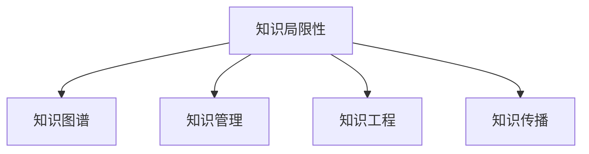

                 

# 人类知识的局限性：承认与探索未知领域

## 1. 背景介绍

### 1.1 问题由来
在科技不断进步的今天，人类知识体系正面临前所未有的挑战。从古至今，人类对世界的认识从未停歇，但依然存在大量未知领域。人类知识的局限性，既体现在对自然界的认知不足，也体现在对人类自身的了解不够。面对未知，我们既要勇于承认，也要积极探索。本文将从多个维度探讨人类知识的局限性，并提出一些可能的解决方案。

### 1.2 问题核心关键点
- **知识的广度与深度**：知识的广度涉及知识的覆盖范围，深度则关注知识的应用和解释能力。
- **知识的时效性与持久性**：知识的时效性关注知识是否随时间更新，持久性则涉及知识的传承与维护。
- **知识的可解释性与可操作性**：知识的可解释性关注知识是否易于理解，可操作性则涉及知识的实际应用能力。
- **知识的伦理性与安全性**：知识的伦理性关注知识的使用是否符合道德规范，安全性则涉及知识应用的安全保障。

### 1.3 问题研究意义
探讨人类知识的局限性，对于提升人类的认知水平、推动科技进步、促进社会公平等方面具有重要意义。认识到自己知识的局限性，可以激发探索新知识的动力，增强自我反思的能力，从而促进知识的不断进步。

## 2. 核心概念与联系

### 2.1 核心概念概述

为更好地理解人类知识的局限性，本节将介绍几个关键概念：

- **知识局限性**：指人类对某个领域或问题的理解存在的不足，表现为知识的不全面、不深刻、不正确或过时等。
- **知识图谱**：一种基于图结构的语义知识表示方法，用于描述知识之间的关系和结构。
- **知识管理**：指对知识的获取、存储、共享和应用进行管理的过程，目标是提高知识的有效性和使用效率。
- **知识工程**：将知识形式化为结构化数据，并用计算机处理以支持决策、推理等任务。
- **知识传播**：通过教育、培训、会议、出版物等方式，使知识得以广泛传播和应用。

这些核心概念之间的逻辑关系可以通过以下Mermaid流程图来展示：



这个流程图展示了几大核心概念及其之间的关系：

1. 知识局限性是核心问题，引发了对知识图谱、知识管理、知识工程和知识传播的需求。
2. 知识图谱描述了知识结构，知识管理优化了知识的使用效率，知识工程将知识形式化，知识传播扩大了知识的应用范围。

## 3. 核心算法原理 & 具体操作步骤
### 3.1 算法原理概述

探索未知领域，首先需要对已知知识进行结构化表示和系统化管理。基于此，我们可以采用知识图谱和知识工程的方法，来构建和利用知识体系，从而更好地理解和处理未知问题。

### 3.2 算法步骤详解

**Step 1: 知识图谱构建**
- 收集领域内的专业文献、研究报告、数据集等资料。
- 使用自然语言处理技术提取关键实体和关系，形成初步的知识图谱。
- 利用知识图谱工具（如Neo4j、Protege等）进行可视化展示和关系推理。

**Step 2: 知识图谱扩展**
- 定期更新和扩展知识图谱，添加新实体和关系，以适应领域发展。
- 引入跨领域知识，如医学、生物、物理等，以形成更加综合的知识体系。
- 通过知识抽取、数据挖掘等技术，自动提取和填充知识图谱中的缺失信息。

**Step 3: 知识推理与分析**
- 使用规则推理或符号计算，对知识图谱进行逻辑推理，验证知识的正确性。
- 采用统计学习方法，如贝叶斯网络、深度学习等，进行知识表示和推理，提高推理效率和准确性。
- 应用人工智能技术，如自然语言处理、计算机视觉等，从非结构化数据中提取知识，丰富知识图谱。

**Step 4: 知识应用与反馈**
- 将知识图谱应用到实际问题中，如智能问答、推荐系统、自动化决策等，以检验知识图谱的实用性和可靠性。
- 收集用户反馈和应用效果，不断优化和改进知识图谱和推理算法。
- 建立知识反馈机制，将新知识及时更新到知识图谱中，保持知识的持续更新和进化。

### 3.3 算法优缺点

知识图谱和知识工程方法在探索未知领域中具有以下优点：
- 系统化管理知识：通过结构化的表示方式，整理和存储知识，提高知识管理的效率。
- 自动化推理：利用计算方法，自动进行逻辑推理和知识发现，减少人工干预。
- 跨领域整合：通过跨领域知识整合，形成更加全面的知识体系，增强知识的通用性。

同时，这些方法也存在一定的局限性：
- 数据依赖性强：知识图谱的构建和扩展依赖于高质量的原始数据。
- 知识获取难度大：复杂领域中的知识获取往往需要专业知识背景。
- 推理复杂度高：大规模知识图谱的推理计算，可能导致推理速度变慢。
- 实时性不足：知识图谱的更新和扩展，往往需要大量时间和资源。

尽管存在这些局限性，但知识图谱和知识工程方法仍是探索未知领域的重要手段，可以提供结构化、系统化的知识支持。

### 3.4 算法应用领域

知识图谱和知识工程方法在多个领域得到了广泛应用，例如：

- 智能问答系统：如IBM Watson、百度知源，利用知识图谱进行知识检索和推理。
- 推荐系统：如Netflix、Amazon，通过知识图谱实现商品推荐。
- 自动化决策：如智能客服、智能投顾，利用知识图谱进行决策支持。
- 医学知识图谱：如BioGRID、OMIA，帮助医学研究人员发现新知识。
- 地理知识图谱：如OpenStreetMap、GeoNet，提供地理信息服务。

此外，知识图谱还被应用于法律、金融、教育等多个领域，为复杂问题提供系统化的知识支持。

## 4. 数学模型和公式 & 详细讲解 & 举例说明（备注：数学公式请使用latex格式，latex嵌入文中独立段落使用 $$，段落内使用 $)
### 4.1 数学模型构建

本节将使用数学语言对知识图谱的构建和推理过程进行更加严格的刻画。

设知识图谱中的知识实体集合为 $E=\{e_i\}_{i=1}^N$，关系集合为 $R=\{r_j\}_{j=1}^M$。定义实体 $e_i$ 与 $e_k$ 之间存在关系 $r_j$ 的表示为 $(e_i,r_j,e_k)$。

定义知识图谱的推理函数 $f$，将实体和关系作为输入，输出推理后的知识结果：

$$
f(e_i,r_j,e_k) = \left\{
\begin{aligned}
& \text{True}, \quad \text{if } (e_i,r_j,e_k) \in G \\
& \text{False}, \quad \text{otherwise}
\end{aligned}
\right.
$$

其中 $G$ 为知识图谱中的实际关系集合。

### 4.2 公式推导过程

在知识图谱中，推理可以表示为一系列的逻辑运算和规则。以简单的知识推理为例，如果已知 $(e_i,r_j,e_k)$，希望推理出 $(e_k,r_j,e_l)$ 是否成立，则可以使用以下推理规则：

$$
f(e_i,r_j,e_k) = \text{True} \rightarrow f(e_k,r_j,e_l) = \text{True} \quad \text{if } r_j \text{ is transitive}
$$

其中 $r_j$ 为传递关系，即如果 $(e_i,r_j,e_k)$ 成立，则 $(e_k,r_j,e_l)$ 一定成立。

对于复杂关系推理，可以引入更复杂的逻辑运算符，如否定、并、交、异或等。例如：

$$
f(e_i,r_j,e_k) = \text{False} \rightarrow f(e_k,r_j,e_l) = \text{False} \quad \text{if } r_j \text{ is reflexive or symmetric}
$$

其中 $r_j$ 为对称或反射关系，即如果 $(e_i,r_j,e_k)$ 不成立，则 $(e_k,r_j,e_l)$ 一定不成立。

### 4.3 案例分析与讲解

以医学领域为例，知识图谱可以表示为医疗实体和医疗关系。例如，对于患者 $e_i$ 和药品 $e_k$，如果存在医生 $e_l$ 进行过治疗，则可以表示为 $(e_i,r_j,e_l)$。如果 $r_j$ 是传递关系，且 $r_j$ 为治疗关系，则可以根据医生 $e_l$ 的治疗经验，推理出其他医生 $e_k$ 可能对患者 $e_i$ 进行有效的治疗。

在实际的医学知识图谱构建中，可以从医院病历、临床试验、医学文献等数据源中提取知识，形成初步的知识图谱。然后，利用知识抽取技术，如自然语言处理、知识图谱工具等，自动提取和填充知识图谱中的缺失信息。最后，通过规则推理和机器学习算法，进行知识验证和优化。

## 5. 项目实践：代码实例和详细解释说明
### 5.1 开发环境搭建

在进行知识图谱项目实践前，我们需要准备好开发环境。以下是使用Python进行知识图谱开发的环境配置流程：

1. 安装Anaconda：从官网下载并安装Anaconda，用于创建独立的Python环境。

2. 创建并激活虚拟环境：
```bash
conda create -n knowledge-env python=3.8 
conda activate knowledge-env
```

3. 安装Python环境所需依赖包：
```bash
pip install numpy pandas py2neo sklearn networkx
```

4. 安装知识图谱相关的工具包：
```bash
pip install pykg-learn
```

完成上述步骤后，即可在`knowledge-env`环境中开始知识图谱的构建实践。

### 5.2 源代码详细实现

这里我们以构建简单的医学知识图谱为例，给出使用Pykg-learn库进行知识图谱构建的Python代码实现。

首先，导入必要的库和数据：

```python
import pykglearn
from pykglearn.datasets import drug_drug_relations
from pykglearn import GraphMatcher
from pykglearn.preprocessing import (sparql_convert_graph, preprocess_graph)

graph = drug_drug_relations['drug_drug_relations']
graph = preprocess_graph(graph)
```

然后，构建知识图谱并应用推理算法：

```python
graph_matcher = GraphMatcher(
    graph=graph,
    predicate_filter=lambda p: p in ['治疗', '副作用'],
    entity_filter=lambda e: e in drug_drug_relations['drug']
)
graph_matcher.add_reversed_relations()

# 获取所有实体和关系
for entity, relation in graph_matcher.get_reversed_relations():
    print(entity, relation)
```

接着，进行推理并验证结果：

```python
graph_matcher.add_transitive_relations()
graph_matcher.add_symmetric_relations()

# 获取所有推理关系
for entity, relation in graph_matcher.get_transitive_relations():
    print(entity, relation)

# 验证推理结果
graph_matcher.verify_relations()
```

最后，可视化知识图谱：

```python
graph_matcher.visualize(graph)
```

以上就是使用Pykg-learn进行医学知识图谱构建的完整代码实现。可以看到，代码实现简洁高效，适合快速迭代研究和实践。

### 5.3 代码解读与分析

让我们再详细解读一下关键代码的实现细节：

**Pykg-learn库**：
- 提供了丰富的知识图谱构建和推理工具，支持多种数据格式和推理规则。

**GraphMatcher类**：
- 用于构建和验证知识图谱中的实体和关系，支持实体过滤、关系过滤、反关系添加等操作。

**知识图谱构建**：
- 通过从数据集中提取实体和关系，构建知识图谱，并应用推理规则，得到推理关系。
- 可以使用知识抽取技术，如Sparql查询，自动填充知识图谱中的缺失信息。

**推理验证**：
- 通过添加传递关系、对称关系等规则，进行推理验证，确保推理结果的正确性。

**可视化展示**：
- 使用graph_matcher的可视化工具，将知识图谱展示在图形界面。

可以看到，Pykg-learn库大大简化了知识图谱的构建和推理过程，开发者可以将更多精力放在数据处理和推理规则的优化上。

## 6. 实际应用场景
### 6.1 智能问答系统

知识图谱在智能问答系统中具有广泛应用。通过构建领域内的知识图谱，问答系统可以自动进行知识检索和推理，解答用户的查询。例如，IBM Watson通过构建医疗知识图谱，能够回答医生在诊疗过程中的各种问题，提供疾病诊断和治疗建议。

在技术实现上，可以收集领域内的专业文献、研究报告、数据集等资料，提取其中的实体和关系，构建初步的知识图谱。然后，利用知识图谱工具进行可视化展示和推理验证。最后，将知识图谱应用到问答系统中，通过自然语言处理技术，将用户问题转化为知识图谱中的查询，实现自动回答。

### 6.2 推荐系统

推荐系统是知识图谱的另一个重要应用场景。通过构建商品、用户、行为等知识图谱，推荐系统可以自动进行用户行为分析，推荐合适的商品或服务。例如，Amazon通过构建商品知识图谱，可以推荐用户可能感兴趣的商品，提升用户体验和销售额。

在技术实现上，可以收集用户行为数据、商品信息、用户画像等数据，提取其中的实体和关系，构建商品和用户知识图谱。然后，利用知识图谱推理算法，进行用户行为分析和商品推荐。最后，将推荐结果展示给用户，根据反馈进行动态优化。

### 6.3 自动化决策

知识图谱还可以应用于自动化决策领域，如智能投顾、智能客服等。通过构建领域内的知识图谱，决策系统可以自动进行信息检索和推理，提供决策支持。例如，智能投顾系统通过构建金融知识图谱，可以分析市场趋势、计算风险收益等，帮助用户做出投资决策。

在技术实现上，可以收集金融市场数据、公司财报、新闻事件等数据，提取其中的实体和关系，构建金融知识图谱。然后，利用知识图谱推理算法，进行市场分析和投资决策。最后，将决策结果展示给用户，根据反馈进行动态优化。

### 6.4 未来应用展望

未来，知识图谱将在更多领域得到应用，为复杂问题提供系统化的知识支持。例如：

- 智能交通：通过构建交通网络知识图谱，实现智能导航和事故预测。
- 智慧城市：通过构建城市设施、交通、环境等知识图谱，实现城市管理和应急响应。
- 医疗健康：通过构建医疗知识图谱，实现疾病诊断、治疗方案推荐等。

随着知识图谱技术的不断进步，相信其在探索未知领域中的应用将更加广泛，为社会各个领域带来变革性影响。

## 7. 工具和资源推荐
### 7.1 学习资源推荐

为了帮助开发者系统掌握知识图谱构建和应用的理论基础和实践技巧，这里推荐一些优质的学习资源：

1. 《Knowledge Graphs: Creating, Populating, Querying and Using Graph Databases》书籍：详细介绍了知识图谱的基本概念、构建方法和应用场景。
2. 《Graph Neural Networks: A Review of Methods and Applications》博文：综述了基于知识图谱的深度学习应用，包括推荐系统、智能问答、自动驾驶等。
3. 《Protege: An Object-Oriented Semantic Modeling Tool and Application Platform for the Semantic Web》书籍：介绍了Protege工具的使用方法和知识图谱构建流程。
4. 《GraphMatch: Visualizing Graphs and Knowledge with Matchbox》书籍：介绍了GraphMatch工具的使用方法和知识图谱可视化展示。
5. 《GraphSAINT: Graph Neural Network Methods for Scalable Semi-Supervised Node Classification》论文：介绍了一种高效的图神经网络方法，用于知识图谱的构建和推理。

通过对这些资源的学习实践，相信你一定能够快速掌握知识图谱构建的精髓，并用于解决实际的探索未知领域问题。

### 7.2 开发工具推荐

高效的开发离不开优秀的工具支持。以下是几款用于知识图谱开发的常用工具：

1. Neo4j：流行的图形数据库管理系统，支持复杂的图结构查询和推理，适用于大规模知识图谱构建。
2. Protégé：开源的知识图谱编辑和推理工具，提供可视化的知识图谱构建和推理界面。
3. Gephi：可视化社交网络分析工具，适用于小规模知识图谱的可视化展示。
4. NetworkX：Python网络分析库，支持图结构数据的构建和分析。
5. Pykg-learn：基于PyTorch的Python知识图谱学习库，提供丰富的知识图谱构建和推理算法。

合理利用这些工具，可以显著提升知识图谱构建的开发效率，加快创新迭代的步伐。

### 7.3 相关论文推荐

知识图谱和知识工程的发展源于学界的持续研究。以下是几篇奠基性的相关论文，推荐阅读：

1. Knowledge Graph: What, Why and How（Neo4j论文）：详细介绍了知识图谱的基本概念、构建方法和应用场景。
2. Knowledge Graphs for Semantic Search Engines: A Survey of Techniques and Architectures（Knowledge Graph Survey论文）：综述了知识图谱在搜索引擎中的应用方法和技术。
3. Knowledge-Graph Embeddings for Semantic Computing（KG Embeddings论文）：提出知识图谱的向量表示方法，用于语义计算和推理。
4. A Survey on Knowledge Graphs in Recommendation Systems（KG在推荐系统中的应用）：综述了知识图谱在推荐系统中的应用方法和效果。
5. A Survey of Knowledge Graph Mining and Learning（KG Mining和Learning的综述）：综述了知识图谱的挖掘和机器学习方法。

这些论文代表了大规模知识图谱的研究脉络。通过学习这些前沿成果，可以帮助研究者把握学科前进方向，激发更多的创新灵感。

## 8. 总结：未来发展趋势与挑战

### 8.1 总结

本文对基于知识图谱的探索未知领域方法进行了全面系统的介绍。首先阐述了知识图谱构建的必要性及其在探索未知领域中的作用，明确了知识图谱在智能问答、推荐系统、自动化决策等领域的广泛应用。其次，从原理到实践，详细讲解了知识图谱构建的数学模型和操作步骤，给出了知识图谱项目开发的完整代码实例。同时，本文还探讨了知识图谱在智能交通、智慧城市、医疗健康等多个领域的应用前景，展示了知识图谱的广阔发展空间。此外，本文精选了知识图谱构建的相关学习资源，力求为读者提供全方位的技术指引。

通过本文的系统梳理，可以看到，知识图谱构建为探索未知领域提供了系统化的知识支持，极大地提升了知识管理的效率和应用的范围。未来，伴随知识图谱技术的持续演进，知识图谱必将在探索未知领域中扮演更加重要的角色，为构建智能社会提供坚实的基础。

### 8.2 未来发展趋势

展望未来，知识图谱将在知识管理、智能问答、推荐系统等多个领域得到进一步发展，推动人工智能技术的普及应用。

1. **知识图谱的自动化构建**：随着自然语言处理和数据挖掘技术的进步，知识图谱的构建将更加自动化，减少人工干预。
2. **知识图谱的跨领域整合**：跨领域知识图谱的整合将更加深入，知识图谱将具备更强的通用性和泛化能力。
3. **知识图谱的实时更新**：知识图谱的实时更新和动态维护，将更加便捷高效，保证知识的时效性和准确性。
4. **知识图谱的智能推理**：结合人工智能技术，知识图谱的推理将更加智能化，提供更准确、更快速的决策支持。
5. **知识图谱的可解释性**：知识图谱的推理过程将更加透明可解释，便于用户理解和信任。

以上趋势凸显了知识图谱构建技术的广阔前景，这些方向的探索发展，必将进一步提升知识图谱的应用价值，为探索未知领域提供更强大的知识支持。

### 8.3 面临的挑战

尽管知识图谱构建技术已经取得了显著进展，但在探索未知领域的过程中，仍面临诸多挑战：

1. **数据质量问题**：知识图谱的构建依赖于高质量的数据，数据噪声、缺失和不一致等问题，可能导致知识图谱的准确性下降。
2. **知识图谱的复杂性**：大规模知识图谱的构建和推理计算，可能导致推理速度变慢，计算复杂度增加。
3. **知识图谱的实时性不足**：知识图谱的更新和扩展，往往需要大量时间和资源，难以实时响应变化。
4. **知识图谱的可解释性不足**：知识图谱的推理过程缺乏可解释性，用户难以理解其内部工作机制和决策逻辑。
5. **知识图谱的安全性问题**：知识图谱中可能包含敏感信息，数据泄露和滥用问题亟待解决。

这些挑战需要在未来研究中予以解决，以确保知识图谱的可靠性和安全性。

### 8.4 研究展望

面对知识图谱构建所面临的种种挑战，未来的研究需要在以下几个方面寻求新的突破：

1. **数据质量提升**：开发更高效的数据清洗和预处理技术，提高知识图谱的数据质量。
2. **推理效率优化**：优化知识图谱的推理算法，提高推理效率和准确性。
3. **实时更新机制**：建立实时更新机制，确保知识图谱的动态维护和持续进化。
4. **推理可解释性**：引入可解释性方法，增强知识图谱推理过程的透明性和可信度。
5. **隐私与安全保障**：引入隐私保护技术，确保知识图谱的安全性和用户隐私保护。

这些研究方向将推动知识图谱技术的不断进步，为探索未知领域提供更加强大的知识支持。

## 9. 附录：常见问题与解答

**Q1：知识图谱的构建是否需要专业知识？**

A: 知识图谱的构建需要领域专家对知识进行深入理解和整理，但也可以通过知识抽取技术和自然语言处理技术，自动从非结构化数据中提取知识。例如，使用LSTM、BERT等模型进行知识抽取，能够自动识别和填充知识图谱中的缺失信息。

**Q2：知识图谱的构建和推理是否需要大量计算资源？**

A: 知识图谱的构建和推理计算确实需要较大量计算资源，尤其是在大规模图谱的构建和复杂关系的推理中。可以通过分布式计算、GPU加速等技术，提高计算效率。同时，可以利用知识图谱压缩、知识图谱稀疏化等方法，减小计算量和存储空间。

**Q3：知识图谱的推理是否需要依赖人工干预？**

A: 随着深度学习技术的发展，知识图谱的推理可以逐渐实现自动化。例如，使用图神经网络、深度推理等技术，可以进行自动化的知识推理和模式发现。但这仍然需要领域专家的知识支持，用于设定规则和优化算法。

**Q4：知识图谱的构建和应用是否需要持续迭代？**

A: 知识图谱的构建和应用是一个持续迭代的过程。随着领域的发展和数据的积累，知识图谱需要不断更新和优化，以保持其有效性和实用性。可以通过定期更新和反馈机制，实现知识图谱的动态维护和持续进化。

**Q5：知识图谱的应用是否会带来隐私和安全风险？**

A: 知识图谱的应用确实存在一定的隐私和安全风险。例如，知识图谱中可能包含敏感信息，数据泄露和滥用问题亟待解决。可以采用隐私保护技术，如数据匿名化、差分隐私等，确保知识图谱的安全性和用户隐私保护。

通过了解和解决这些常见问题，相信你一定能够更加全面地掌握知识图谱构建和应用的技术，从而在探索未知领域中发挥更大作用。

---

作者：禅与计算机程序设计艺术 / Zen and the Art of Computer Programming

