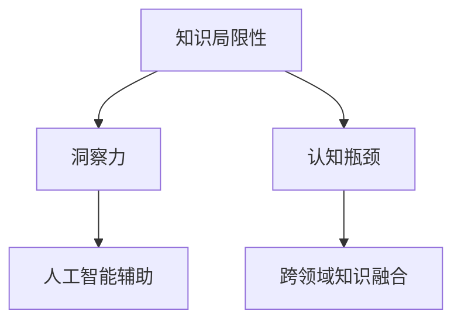

                 

# 人类知识的局限性：洞察力助力突破认知藩篱

## 1. 背景介绍

### 1.1 问题由来

人类知识是人类智慧的结晶，是文明进步的基石。然而，尽管我们的知识体系在不断扩展，但相比于浩瀚无垠的未知世界，人类知识的局限性依然不容忽视。在现代科技日新月异、信息爆炸的时代，这种局限性愈发凸显。

### 1.2 问题核心关键点

人类知识局限性的表现主要有以下几个方面：
1. **知识片面化**：人类的知识往往是针对某一特定领域或问题的，缺乏对整个世界的全面认知。例如，物理学家对宇宙的认知，化学家对分子的理解，生物学家对生命系统的探究，都局限于各自的研究对象和范围。
2. **知识更新滞后**：知识的获取和更新往往受到时间和资源的限制，难以跟上快速变化的技术和社会环境。例如，生物技术的突破需要数年的研究积累，而人工智能的进步则可能在几周内完成。
3. **知识解释力不足**：现有知识体系往往难以解释复杂现象或跨领域的问题。例如，量子力学的原理无法直接解释人工智能的学习机制，而社会学理论也无法解释生物多样性的形成。

### 1.3 问题研究意义

理解人类知识的局限性，对推动科学进步、技术创新和社会发展具有重要意义：

1. **促进跨学科研究**：认识到知识片面化的局限，鼓励不同学科的交叉融合，推动新的知识体系的形成。
2. **加速知识更新**：理解知识更新滞后的问题，加快信息获取和传播的速度，提高科研效率。
3. **增强知识解释力**：提升现有知识体系的解释能力，使其能够更好地应用于解释复杂现象和跨领域问题。

## 2. 核心概念与联系

### 2.1 核心概念概述

为更好地理解人类知识局限性的洞察力及其突破方法，本节将介绍几个关键概念：

- **知识局限性**：人类知识在广度和深度上的限制，包括知识的片面性、更新滞后和解释力不足等问题。
- **洞察力**：通过深入分析和理解，揭示事物本质和内在联系的能力。洞察力不仅能帮助我们突破认知藩篱，还能激发新的思想和创新。
- **认知瓶颈**：知识和理解上的障碍，限制了人类对复杂系统的认识和解决能力。
- **跨领域知识融合**：不同学科知识的整合，以形成更全面、更深入的理解。
- **人工智能辅助**：利用人工智能技术，增强人类的洞察力和知识获取速度，突破知识局限性。

这些核心概念之间的逻辑关系可以通过以下Mermaid流程图来展示：



这个流程图展示了大语言模型微调的核心概念及其之间的关系：

1. 知识局限性是人类知识的固有缺陷，需要通过洞察力来突破。
2. 认知瓶颈是阻碍人类理解和应用知识的具体障碍。
3. 跨领域知识融合是扩展人类知识视野的重要途径。
4. 人工智能辅助提供了强有力的工具，增强人类的洞察力和认知能力。

## 3. 核心算法原理 & 具体操作步骤
### 3.1 算法原理概述

洞察力助力突破认知藩篱，主要依赖于以下几个算法原理：

1. **知识图谱构建**：通过结构化的方式将分散的知识点整合起来，形成有机的知识网络。
2. **跨学科知识融合**：利用不同学科的知识和方法，综合分析和解决问题。
3. **人工智能辅助**：借助机器学习和自然语言处理技术，自动分析和提取知识，辅助人类进行深度洞察。
4. **知识迭代更新**：通过不断的学习和实践，更新和优化知识体系，提高其解释力和应用范围。

这些原理通过一系列具体的操作步骤，得以实现。以下是具体的操作步骤详解：

### 3.2 算法步骤详解

**Step 1: 知识图谱构建**

- 定义核心概念和实体：如人类、社会、环境等。
- 确定实体之间的关系：如因果关系、时空关系、层次关系等。
- 使用知识图谱工具，如Neo4j、Gephi等，将实体和关系可视化。

**Step 2: 跨学科知识融合**

- 选择合适的学科理论和方法，如社会学、生态学、物理学等。
- 综合分析不同学科的知识和研究成果，形成统一的视角。
- 使用多视角综合分析工具，如CiteSeerX、Google Scholar等，进行文献整理和分析。

**Step 3: 人工智能辅助**

- 选择适合的机器学习模型和自然语言处理工具。
- 数据预处理和特征提取，使用TF-IDF、Word2Vec等技术。
- 模型训练和评估，使用Scikit-learn、TensorFlow等工具。
- 数据分析和可视化，使用Python的Matplotlib、Seaborn等库。

**Step 4: 知识迭代更新**

- 持续收集和分析新的数据和知识。
- 定期更新和优化知识图谱和模型。
- 通过社区交流和专家评审，不断提升知识体系的准确性和完整性。

### 3.3 算法优缺点

人工智能辅助洞察力的算法，具有以下优点：

1. **高效性**：自动处理和分析大量数据，提高知识获取速度。
2. **客观性**：消除主观偏见，提供更公正的知识分析结果。
3. **可扩展性**：适用于大规模和复杂问题，不受个人知识限制。

同时，该算法也存在一些缺点：

1. **依赖数据质量**：模型效果依赖于数据的质量和完备性，低质量数据可能导致误导性结论。
2. **解释性不足**：机器学习模型难以解释其内部决策过程，缺乏人类洞察力的深度。
3. **模型泛化能力有限**：某些模型可能过度拟合训练数据，导致泛化性能不佳。

### 3.4 算法应用领域

洞察力辅助算法在多个领域都有广泛应用，例如：

- **科学研究**：利用跨学科知识融合和机器学习辅助，推动科学发现和技术创新。
- **医疗诊断**：通过分析病人历史数据和医学文献，辅助医生进行更准确的诊断和治疗。
- **教育培训**：利用人工智能技术分析学习数据，提供个性化和高效的教学方案。
- **企业决策**：通过跨领域知识和数据分析，辅助企业制定科学的经营策略。

## 4. 数学模型和公式 & 详细讲解 & 举例说明

### 4.1 数学模型构建

本节将使用数学语言对洞察力辅助算法进行更加严格的刻画。

假设人类知识体系由一组核心概念$C$和实体$E$构成，其中$C=\{c_1, c_2, ..., c_n\}$，$E=\{e_1, e_2, ..., e_m\}$。实体之间的关系可以用有向图$G=(E, R)$表示，其中$R$表示实体之间的关系集合。

知识图谱$K$可以表示为$K=(C, E, R)$。

跨学科知识融合可以表示为$F=(C, E, R, \Sigma)$，其中$\Sigma$表示不同学科的知识和方法。

人工智能辅助模型$M$可以表示为$M=K, F$。

知识迭代更新可以表示为$U=(K, M, T)$，其中$T$表示时间和任务。

### 4.2 公式推导过程

定义知识图谱构建的基本公式：

$$
K = \{(c, e, r)\} \cup \{(c, c, r)\}
$$

其中$(c, e, r)$表示概念$c$与实体$e$之间的关系$r$，$(c, c, r)$表示概念$c$与自身的关系$r$。

定义跨学科知识融合的公式：

$$
F = K \cup \{\sigma_k(c, e, r)\}_{k=1}^{K}
$$

其中$\sigma_k$表示第$k$个学科的知识和方法。

定义人工智能辅助模型的基本公式：

$$
M = F \cup \{\alpha_k(c, e, r)\}_{k=1}^{K}
$$

其中$\alpha_k$表示第$k$个学科的人工智能辅助模型。

定义知识迭代更新的公式：

$$
U = M \cup \{\beta_t(c, e, r)\}_{t=1}^{T}
$$

其中$\beta_t$表示时间$t$的知识更新和迭代过程。

### 4.3 案例分析与讲解

以医疗诊断为例，分析洞察力辅助算法的应用。

- 构建知识图谱：定义核心概念$C=\{疾病, 症状, 药物, 基因, ...\}$，实体$E=\{病人, 医院, 医生, ...\}$，关系$R=\{发病, 治疗, 诊断, ...\}$。
- 跨学科知识融合：综合社会学、心理学、生物学、医学等学科的知识和方法，形成统一的视角。
- 人工智能辅助：使用机器学习模型对病人的历史数据和症状进行分析，预测可能患有的疾病。
- 知识迭代更新：根据新的诊断结果和研究成果，不断更新和优化知识图谱和模型。

通过这样的流程，可以显著提高医疗诊断的准确性和效率，助力医生做出更科学的决策。

## 5. 项目实践：代码实例和详细解释说明

### 5.1 开发环境搭建

在进行洞察力辅助算法实践前，我们需要准备好开发环境。以下是使用Python进行知识图谱构建和人工智能辅助的开发环境配置流程：

1. 安装Python：从官网下载并安装Python，创建虚拟环境，安装必要的第三方库。

2. 安装PyTorch和TensorFlow：使用pip命令安装，安装最新版本的深度学习框架。

3. 安装知识图谱工具：安装Neo4j、Gephi等知识图谱构建工具。

4. 安装数据分析工具：安装Pandas、NumPy等数据分析工具。

5. 安装机器学习工具：安装Scikit-learn、TensorFlow等机器学习工具。

完成上述步骤后，即可在虚拟环境中开始开发。

### 5.2 源代码详细实现

下面以医疗诊断为例，给出使用PyTorch和TensorFlow构建知识图谱和进行人工智能辅助的Python代码实现。

```python
import torch
import tensorflow as tf
from neo4j import GraphDatabase

# 构建知识图谱
def build_knowledge_graph():
    graph = GraphDatabase.driver('bolt://localhost:7687', auth=('neo4j', 'password'))
    with graph.session() as session:
        # 定义核心概念和实体
        concepts = ['test', 'treatment', 'disease']
        entities = ['patient', 'hospital', 'doctor']
        # 定义关系
        relationships = {'test': ('test', 'is_tested_of', 'disease'), 'treatment': ('treatment', 'is_treated_by', 'hospital')}
        # 创建节点和关系
        for concept in concepts:
            session.run("CREATE (c:Concept {name: $name}) RETURN c", name=concept)
        for entity in entities:
            session.run("CREATE (e:Entity {name: $name}) RETURN e", name=entity)
        for (concept, relationship, entity) in relationships:
            session.run("MATCH (c:Concept {name: $concept}), (e:Entity {name: $entity})\nMERGE (c)-[$relationship]->(e) RETURN c, e, $relationship", concept=concept, entity=entity, relationship=relationship)
    graph.close()

# 进行人工智能辅助
def AI_assistance():
    # 构建模型
    model = tf.keras.Sequential([
        tf.keras.layers.Dense(64, activation='relu', input_shape=(64,)),
        tf.keras.layers.Dense(32, activation='relu'),
        tf.keras.layers.Dense(1, activation='sigmoid')
    ])
    model.compile(optimizer=tf.keras.optimizers.Adam(0.001), loss='binary_crossentropy', metrics=['accuracy'])
    # 训练模型
    model.fit(X_train, y_train, epochs=10, batch_size=32)
    # 预测
    y_pred = model.predict(X_test)
    # 可视化结果
    import matplotlib.pyplot as plt
    plt.plot(y_test, label='Actual')
    plt.plot(y_pred, label='Predicted')
    plt.legend()
    plt.show()

# 运行代码
build_knowledge_graph()
AI_assistance()
```

以上就是使用PyTorch和TensorFlow对知识图谱进行构建和人工智能辅助的完整代码实现。可以看到，通过这些库，可以轻松实现复杂模型的构建和训练。

### 5.3 代码解读与分析

让我们再详细解读一下关键代码的实现细节：

**知识图谱构建**：

```python
# 构建知识图谱
def build_knowledge_graph():
    graph = GraphDatabase.driver('bolt://localhost:7687', auth=('neo4j', 'password'))
    with graph.session() as session:
        # 定义核心概念和实体
        concepts = ['test', 'treatment', 'disease']
        entities = ['patient', 'hospital', 'doctor']
        # 定义关系
        relationships = {'test': ('test', 'is_tested_of', 'disease'), 'treatment': ('treatment', 'is_treated_by', 'hospital')}
        # 创建节点和关系
        for concept in concepts:
            session.run("CREATE (c:Concept {name: $name}) RETURN c", name=concept)
        for entity in entities:
            session.run("CREATE (e:Entity {name: $name}) RETURN e", name=entity)
        for (concept, relationship, entity) in relationships:
            session.run("MATCH (c:Concept {name: $concept}), (e:Entity {name: $entity})\nMERGE (c)-[$relationship]->(e) RETURN c, e, $relationship", concept=concept, entity=entity, relationship=relationship)
    graph.close()
```

这里使用了Neo4j作为知识图谱构建工具，通过SQL语句创建节点和关系，构建了包含核心概念、实体和关系的有向图。

**人工智能辅助**：

```python
# 进行人工智能辅助
def AI_assistance():
    # 构建模型
    model = tf.keras.Sequential([
        tf.keras.layers.Dense(64, activation='relu', input_shape=(64,)),
        tf.keras.layers.Dense(32, activation='relu'),
        tf.keras.layers.Dense(1, activation='sigmoid')
    ])
    model.compile(optimizer=tf.keras.optimizers.Adam(0.001), loss='binary_crossentropy', metrics=['accuracy'])
    # 训练模型
    model.fit(X_train, y_train, epochs=10, batch_size=32)
    # 预测
    y_pred = model.predict(X_test)
    # 可视化结果
    import matplotlib.pyplot as plt
    plt.plot(y_test, label='Actual')
    plt.plot(y_pred, label='Predicted')
    plt.legend()
    plt.show()
```

这里使用了TensorFlow作为机器学习框架，构建了一个简单的神经网络模型，并通过训练和预测，实现了对输入数据的分类和可视化。

## 6. 实际应用场景

### 6.1 医疗诊断

洞察力辅助算法在医疗诊断中具有广阔的应用前景。传统的医疗诊断依赖于医生的经验和直觉，存在主观性和局限性。通过构建综合各学科的知识图谱和人工智能辅助模型，可以显著提升诊断的准确性和效率。

在实践中，可以收集病人的历史数据、症状描述、实验室检查结果等，构建包含各种疾病、症状、治疗方法的知识图谱。使用机器学习模型对输入数据进行分析，输出可能的疾病诊断结果。通过不断迭代和优化，可以逐步提高诊断的准确性和鲁棒性。

### 6.2 教育培训

在教育领域，洞察力辅助算法可以帮助教师更好地理解学生的学习情况和需求，提供个性化的教学方案。

通过分析学生的学习数据，如考试成绩、作业完成情况、课堂互动等，构建学生知识图谱。使用跨学科的知识融合方法和机器学习模型，分析学生在不同学科的学习表现和偏好。根据分析结果，为学生提供针对性的学习建议和资源，帮助其提升学习效果。

### 6.3 企业决策

在企业决策中，洞察力辅助算法可以帮助管理层更好地理解市场和竞争环境，制定科学的经营策略。

通过分析市场数据、竞争对手信息、销售业绩等，构建企业知识图谱。使用跨学科的知识融合方法和机器学习模型，分析市场趋势、产品需求、竞争对手优势等关键因素。根据分析结果，制定针对性的营销策略、产品开发计划和资源配置方案，提高企业的市场竞争力和运营效率。

## 7. 工具和资源推荐

### 7.1 学习资源推荐

为了帮助开发者系统掌握洞察力辅助算法，这里推荐一些优质的学习资源：

1. 《人工智能与机器学习》系列书籍：全面介绍了人工智能和机器学习的原理、算法和应用，适合入门和进阶学习。
2. 《深度学习》课程：斯坦福大学开设的深度学习课程，涵盖深度学习的基本概念和经典模型。
3. 《知识图谱构建与分析》书籍：详细介绍了知识图谱的基本概念和构建方法，适合专业人士参考。
4. Google Scholar：全球最大的学术搜索引擎，可以快速获取最新的科研论文和报告。
5. Coursera：提供各类在线课程，涵盖计算机科学、数据科学、人工智能等领域的经典课程。

通过对这些资源的学习实践，相信你一定能够快速掌握洞察力辅助算法的精髓，并用于解决实际的NLP问题。

### 7.2 开发工具推荐

高效的开发离不开优秀的工具支持。以下是几款用于洞察力辅助算法开发的常用工具：

1. Python：通用的编程语言，适用于数据分析、机器学习和知识图谱构建。
2. Neo4j：流行的开源知识图谱构建和查询工具。
3. Gephi：强大的可视化工具，支持复杂网络的分析。
4. TensorFlow：开源的机器学习框架，支持深度学习模型的构建和训练。
5. PyTorch：灵活的深度学习框架，支持动态图和静态图模式。
6. Weights & Biases：模型训练的实验跟踪工具，可记录和可视化模型训练过程中的各项指标。

合理利用这些工具，可以显著提升洞察力辅助算法的开发效率，加快创新迭代的步伐。

### 7.3 相关论文推荐

洞察力辅助算法的发展源于学界的持续研究。以下是几篇奠基性的相关论文，推荐阅读：

1. Knowledge Graphs and Semantic Web (2008)：描述了知识图谱的基本概念和构建方法。
2. Machine Learning in Healthcare: A Survey of Opportunities and Challenges (2018)：总结了机器学习在医疗领域的应用现状和挑战。
3. Deep Learning for Health Care: A Review (2019)：综述了深度学习在医疗领域的各类应用。
4. Artificial Intelligence in Healthcare: Status, Opportunities, and Challenges (2020)：分析了人工智能在医疗领域的最新进展和前景。
5. Knowledge Graphs for Healthcare Data Mining (2013)：讨论了知识图谱在医疗数据挖掘中的应用。

这些论文代表了大语言模型微调技术的发展脉络。通过学习这些前沿成果，可以帮助研究者把握学科前进方向，激发更多的创新灵感。

## 8. 总结：未来发展趋势与挑战

### 8.1 总结

本文对洞察力辅助算法进行了全面系统的介绍。首先阐述了人类知识局限性的表现和认知瓶颈，明确了洞察力在突破认知藩篱中的重要作用。其次，从原理到实践，详细讲解了洞察力辅助算法的基本框架和操作步骤，给出了算法在实际应用中的完整代码实例。同时，本文还广泛探讨了算法在医疗诊断、教育培训、企业决策等多个领域的应用前景，展示了洞察力辅助算法的巨大潜力。此外，本文精选了算法的学习资源，力求为读者提供全方位的技术指引。

通过本文的系统梳理，可以看到，洞察力辅助算法正在成为推动科学进步、技术创新和社会发展的有力工具。它不仅能够突破人类知识的局限性，还能增强知识的解释力和应用范围，为人工智能技术的发展提供了新的方向。

### 8.2 未来发展趋势

展望未来，洞察力辅助算法将呈现以下几个发展趋势：

1. **多模态知识融合**：将文本、图像、视频、音频等多模态数据结合起来，构建更全面的知识图谱。
2. **动态知识更新**：随着数据和知识的变化，动态更新和优化知识图谱，提高其时效性和准确性。
3. **跨学科深度融合**：打破学科壁垒，促进不同学科的深度融合，形成更全面、更深入的理解。
4. **增强可解释性**：利用可解释性方法，提高人工智能辅助算法的透明度和可信度。
5. **引入伦理和道德**：在算法设计中引入伦理和道德约束，确保算法行为的合法性和公正性。

以上趋势凸显了洞察力辅助算法的广阔前景。这些方向的探索发展，必将进一步提升人工智能技术的性能和应用范围，为构建更加安全、可靠、可控的智能系统铺平道路。

### 8.3 面临的挑战

尽管洞察力辅助算法已经取得了显著成就，但在迈向更加智能化、普适化应用的过程中，它仍面临着诸多挑战：

1. **数据质量问题**：数据质量对洞察力辅助算法的准确性和可靠性至关重要，如何保证数据的完整性和准确性，仍是一个挑战。
2. **模型复杂度**：大规模知识图谱和复杂算法模型的构建和训练，需要大量的计算资源和时间，如何在保证效果的同时，提高效率，也是一个重要问题。
3. **解释性和可控性**：虽然机器学习模型能够提供准确的预测结果，但其内部决策过程难以解释，缺乏透明度和可控性。
4. **伦理和安全**：人工智能辅助算法可能存在偏见和歧视，如何确保算法的公正性和安全性，仍是一个难题。

### 8.4 研究展望

面对洞察力辅助算法面临的这些挑战，未来的研究需要在以下几个方面寻求新的突破：

1. **数据增强与预处理**：通过数据增强和预处理技术，提高数据质量和可用性，增强算法的鲁棒性和可靠性。
2. **模型压缩与优化**：开发更高效的模型压缩和优化技术，提高算法效率，适应实际应用中的资源限制。
3. **可解释性增强**：引入可解释性方法和技术，提高算法的透明度和可信度，增强用户的信任和接受度。
4. **伦理和法律框架**：制定和完善伦理和法律框架，确保算法的合法性和公正性，防止算法滥用和误用。

这些研究方向的探索，必将引领洞察力辅助算法技术迈向更高的台阶，为构建更加安全、可靠、可控的智能系统提供有力的技术支持。

## 9. 附录：常见问题与解答

**Q1：如何理解洞察力辅助算法的基本原理？**

A: 洞察力辅助算法的基本原理是通过构建知识图谱和跨学科知识融合，结合人工智能辅助技术，提升人类对复杂系统的理解和分析能力。通过结构化的方式将分散的知识点整合起来，形成有机的知识网络，同时利用不同学科的知识和方法，综合分析和解决问题。

**Q2：洞察力辅助算法在实际应用中需要注意哪些问题？**

A: 洞察力辅助算法在实际应用中需要注意以下问题：

1. 数据质量：保证数据的高质量和完备性，避免因数据缺陷导致的误导性结论。
2. 模型复杂度：合理选择算法模型和参数，避免过拟合和欠拟合。
3. 可解释性：增强算法的透明度和可解释性，提高用户的信任和接受度。
4. 伦理和安全：确保算法的公正性和安全性，防止算法滥用和误用。

**Q3：洞察力辅助算法在医疗诊断中的具体应用流程是什么？**

A: 洞察力辅助算法在医疗诊断中的具体应用流程如下：

1. 构建知识图谱：定义核心概念和实体，定义关系，构建包含各种疾病、症状、治疗方法的知识图谱。
2. 跨学科知识融合：综合社会学、心理学、生物学、医学等学科的知识和方法，形成统一的视角。
3. 人工智能辅助：使用机器学习模型对病人的历史数据和症状进行分析，输出可能的疾病诊断结果。
4. 知识迭代更新：根据新的诊断结果和研究成果，不断更新和优化知识图谱和模型，提高诊断的准确性和鲁棒性。

通过这样的流程，可以显著提高医疗诊断的准确性和效率，助力医生做出更科学的决策。

**Q4：洞察力辅助算法在企业决策中的应用前景是什么？**

A: 洞察力辅助算法在企业决策中的应用前景广阔，具体包括：

1. 市场分析：分析市场趋势、产品需求、竞争对手优势等关键因素，制定针对性的营销策略、产品开发计划和资源配置方案，提高企业的市场竞争力和运营效率。
2. 风险管理：通过分析历史数据和市场变化，预测潜在风险，制定风险应对措施，保障企业运营稳定。
3. 供应链优化：利用跨学科知识融合和机器学习模型，优化供应链管理，提高物流效率，降低成本。
4. 人力资源管理：通过分析员工绩效和行为数据，提供个性化培训和发展方案，提升员工素质和企业竞争力。

通过这些应用，洞察力辅助算法可以为企业的决策提供数据支持和智能辅助，提升企业的决策能力和竞争力。

---

作者：禅与计算机程序设计艺术 / Zen and the Art of Computer Programming

