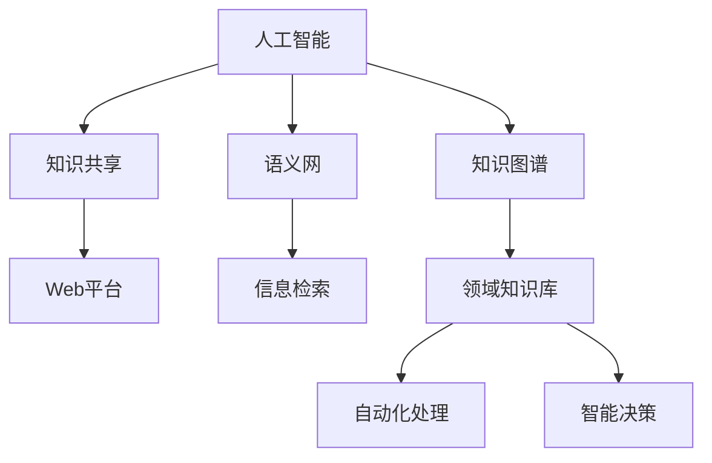

                 

# 人类知识的进步：一场跨越时空的对话

> 关键词：人类知识进步, 人工智能, 知识图谱, 知识共享, 语义网, 知识工程, 计算机科学与人类文明

## 1. 背景介绍

### 1.1 问题由来
在人类文明发展的历史长河中，知识的积累与传播始终是推动社会进步的重要驱动力。然而，随着信息爆炸时代的到来，知识的结构化和智能处理变得愈发重要。人工智能（AI）技术的蓬勃发展，特别是大数据、深度学习等先进技术的广泛应用，为知识进步提供了新的契机。

**本节目的**：旨在探讨人工智能技术如何推动人类知识的进步，以及其应用在知识图谱、知识共享和语义网等领域的前景和挑战。通过分析核心概念的原理和架构，本文将为读者呈现一场跨越时空的对话，讨论技术如何与人类文明发展相结合。

## 2. 核心概念与联系

### 2.1 核心概念概述

人工智能（AI），特别是深度学习和知识图谱技术，已成为知识进步的重要工具。人工智能可以自动化处理海量数据，从中提炼知识，并通过知识共享、语义网等技术实现知识的高效传播和应用。

- **人工智能**：旨在创建能够模拟人类智能行为的机器，主要涵盖机器学习、自然语言处理（NLP）、计算机视觉等领域。
- **知识图谱**：一种基于图结构的知识表示方式，用于组织和管理复杂的信息。
- **知识共享**：通过互联网平台，使不同组织和个人能够方便地访问和分享知识。
- **语义网**：利用Web技术和人工智能实现智能信息检索和知识关联，提升信息获取的效率和质量。
- **知识工程**：将领域知识形式化，以支持自动化处理和智能决策。

这些概念通过技术的融合，形成了一个紧密相连的知识生态系统，极大地推动了人类知识的进步。

### 2.2 核心概念原理和架构的 Mermaid 流程图



此流程图展示了人工智能、知识图谱、知识共享和语义网之间的联系和相互作用。

## 3. 核心算法原理 & 具体操作步骤

### 3.1 算法原理概述

**核心算法**：基于人工智能技术，特别是在知识图谱构建和语义网开发中，采用的核心算法主要包括以下几个方面：

1. **实体识别与关系抽取**：从非结构化文本中提取关键实体及其之间的关系。
2. **知识图谱构建**：利用深度学习模型，自动构建知识图谱，以支持复杂的查询和推理。
3. **语义相似度计算**：通过计算实体或句子之间的语义相似度，实现智能检索和推荐。
4. **知识推理与更新**：基于推理机制，自动更新知识图谱中的知识。

### 3.2 算法步骤详解

**步骤1：实体识别与关系抽取**

1. **数据准备**：收集领域内的文本数据，如新闻、论文、网页等。
2. **文本预处理**：去除停用词、词干提取等。
3. **实体识别**：利用NLP模型，识别出文本中的实体。
4. **关系抽取**：通过深度学习模型，抽取实体之间的关系。

**步骤2：知识图谱构建**

1. **知识编码**：将实体及其关系编码为图结构。
2. **图神经网络（GNN）**：使用GNN模型对图结构进行处理，提取知识表示。
3. **知识融合**：将多源异构知识融合到知识图谱中。
4. **知识推理**：通过图推理机制，在知识图谱中进行逻辑推理。

**步骤3：语义相似度计算**

1. **语料库构建**：构建大规模语料库，用于计算语义相似度。
2. **句子表示**：通过Word2Vec、BERT等模型，将句子转换为向量表示。
3. **相似度计算**：使用余弦相似度、欧式距离等方法计算句子之间的语义相似度。
4. **智能推荐**：根据相似度结果，实现个性化推荐。

**步骤4：知识推理与更新**

1. **推理框架设计**：设计基于规则或基于深度学习的推理框架。
2. **逻辑推理**：使用推理引擎进行逻辑推理，如基于描述逻辑的推理。
3. **知识更新**：基于新数据或用户反馈，自动更新知识图谱。
4. **规则系统**：构建基于专家知识的规则系统，辅助推理过程。

### 3.3 算法优缺点

**优点**：
1. **高效自动化**：利用深度学习技术，大规模自动处理数据，极大地提升了效率。
2. **知识整合**：通过知识图谱和语义网技术，实现知识的整合和共享。
3. **跨领域应用**：知识图谱和语义网技术适用于多种领域，具有广泛的适用性。
4. **智能决策**：通过智能推理，支持复杂决策和问题求解。

**缺点**：
1. **数据依赖性**：模型的效果依赖于数据质量和多样性。
2. **计算资源消耗**：深度学习和知识推理需要大量的计算资源。
3. **结果可解释性**：复杂模型难以解释其内部工作机制。
4. **隐私与安全**：知识共享可能涉及隐私保护和安全问题。

### 3.4 算法应用领域

人工智能技术在知识图谱、知识共享和语义网等领域的广泛应用，推动了多个行业的变革。

- **医疗健康**：构建医疗知识图谱，辅助临床决策和个性化医疗。
- **金融领域**：开发金融知识图谱，支持风险评估和智能投资。
- **教育领域**：利用语义网技术，实现个性化教育推荐和智能辅导。
- **法律领域**：构建法律知识图谱，支持案件分析和法律咨询。
- **科学研究**：开发科学知识图谱，促进跨学科研究和技术创新。

## 4. 数学模型和公式 & 详细讲解 & 举例说明

### 4.1 数学模型构建

知识图谱的核心数学模型是基于图结构的表示，常用的有知识图谱中的实体-关系-属性三元组（RDF），以及图神经网络（GNN）模型。

**RDF三元组模型**：
- **主语(S)**：知识图谱中的实体。
- **谓语(P)**：实体之间的关系。
- **宾语(O)**：关系的对象，也是另一个实体。

**GNN模型**：
- **节点表示学习**：通过GNN模型，将节点（实体）转换为向量表示。
- **图卷积操作**：通过图卷积层，对图结构进行处理。
- **节点嵌入**：利用节点嵌入方法，提升实体表示的质量。

### 4.2 公式推导过程

**公式1：节点表示学习**

$$
h_v = \sum_{u \in \mathcal{N}(v)} \frac{1}{\sqrt{\deg(u)}} \cdot W_e \cdot [h_u; x_u]
$$

其中 $h_v$ 为节点 $v$ 的表示，$\mathcal{N}(v)$ 为节点 $v$ 的邻居节点集，$\deg(u)$ 为节点 $u$ 的度数，$W_e$ 为嵌入权重矩阵。

**公式2：图卷积操作**

$$
h_v = \sum_{u \in \mathcal{N}(v)} \frac{1}{\sqrt{\deg(u)}} \cdot \tilde{A} \cdot h_u
$$

其中 $\tilde{A}$ 为归一化邻接矩阵，$h_v$ 为节点 $v$ 的表示。

**公式3：知识推理**

知识推理可以通过基于规则的方法或基于深度学习的方法进行。以基于规则的推理为例，假设存在如下规则：

$$
\forall (S, P, O) \in \mathcal{R}, (S, P, O) \rightarrow (\text{Not } P, P', O')
$$

其中 $(S, P, O)$ 为三元组，$P'$ 和 $O'$ 为新规则生成的实体和关系。

### 4.3 案例分析与讲解

**案例1：医疗知识图谱的构建**

1. **数据准备**：收集医院电子病历、临床试验数据等。
2. **实体识别**：识别出医生、药品、疾病等实体。
3. **关系抽取**：抽取实体之间的关系，如主治医师、药物副作用等。
4. **知识图谱构建**：使用GNN模型，对图结构进行处理，构建医疗知识图谱。
5. **知识推理**：通过规则系统，实现医学诊断和个性化治疗推荐。

**案例2：金融知识图谱的开发**

1. **数据准备**：收集股票交易数据、公司财报等。
2. **实体识别**：识别出股票、公司、行业等实体。
3. **关系抽取**：抽取实体之间的关系，如公司合并、股票交易等。
4. **知识图谱构建**：使用GNN模型，对图结构进行处理，构建金融知识图谱。
5. **知识推理**：通过规则系统，实现风险评估和投资策略优化。

## 5. 项目实践：代码实例和详细解释说明

### 5.1 开发环境搭建

**环境配置**：
1. 安装Python 3.x：确保Python环境稳定。
2. 安装NumPy、Pandas、Scikit-Learn等数据处理库。
3. 安装PyTorch、TensorFlow等深度学习框架。
4. 安装GNN库，如PyTorch Geometric。
5. 安装知识图谱构建工具，如Neo4j。

### 5.2 源代码详细实现

**代码1：实体识别**

```python
import spacy
from spacy.matcher import Matcher

nlp = spacy.load('en_core_web_sm')
matcher = Matcher(nlp.vocab)

def extract_entities(text):
    pattern = [{'TEXT': {'OP': '?'}, 'OP': spacy.ENTYPE.PUNCT}]  # 实体匹配模式
    match_id, spans = matcher(text)
    return [nlp(v) for v in spans if v]
```

**代码2：关系抽取**

```python
import networkx as nx

G = nx.Graph()
G.add_node(1, entity='Company A')
G.add_node(2, entity='Company B')
G.add_edge(1, 2, relation='Mergers')

def extract_relations(G):
    relations = []
    for u, v, data in G.edges(data=True):
        if 'relation' in data:
            relations.append((data['entity'], data['relation'], data['entity']))
    return relations
```

**代码3：知识图谱构建**

```python
import pygsp
import networkx as nx

G = nx.Graph()
G.add_node(1, entity='Company A')
G.add_node(2, entity='Company B')
G.add_edge(1, 2, relation='Mergers')

G = pygsp.graph.PyGraph(G)

def build_knowledge_graph(G):
    A = pygsp.graph.Graph(G.adjacency_matrix())
    return A
```

### 5.3 代码解读与分析

**代码1分析**：
- 使用SpaCy库进行实体识别。
- 定义实体匹配模式，匹配文本中的实体。
- 返回识别出的实体列表。

**代码2分析**：
- 创建图结构，添加节点和边。
- 定义关系抽取函数，从图中抽取实体-关系-实体三元组。

**代码3分析**：
- 使用PyGSP库将图结构转换为图神经网络模型。
- 定义知识图谱构建函数，将图结构转换为知识图谱。

### 5.4 运行结果展示

**展示1：实体识别结果**

```python
text = 'John works in a hospital called St. John Hospital.'
entities = extract_entities(text)
print([ent.text for ent in entities])
```

**展示2：关系抽取结果**

```python
G = nx.Graph()
G.add_node(1, entity='Company A')
G.add_node(2, entity='Company B')
G.add_edge(1, 2, relation='Mergers')
relations = extract_relations(G)
print(relations)
```

**展示3：知识图谱构建结果**

```python
G = nx.Graph()
G.add_node(1, entity='Company A')
G.add_node(2, entity='Company B')
G.add_edge(1, 2, relation='Mergers')
A = build_knowledge_graph(G)
```

## 6. 实际应用场景

### 6.1 医疗健康

医疗知识图谱的构建，可以辅助医生进行临床决策、个性化治疗和药物研发。通过智能推理，实现疾病诊断、药物推荐和患者监护等功能，提升医疗服务的质量和效率。

### 6.2 金融领域

金融知识图谱的开发，可以支持风险评估、智能投资和欺诈检测。通过智能推理，优化投资组合、防范金融风险，提升金融服务的智能化水平。

### 6.3 教育领域

利用语义网技术，实现个性化教育推荐和智能辅导。通过智能推理，提供个性化的学习资源和智能化的学习建议，提升教育质量和学习效率。

### 6.4 法律领域

构建法律知识图谱，支持案件分析和法律咨询。通过智能推理，实现法律文档的智能检索和知识关联，提升法律服务的效率和准确性。

## 7. 工具和资源推荐

### 7.1 学习资源推荐

1. **《人工智能导论》**：Wikipedia官方出版的免费教科书，涵盖了人工智能基础、机器学习、深度学习等多个方面。
2. **Coursera《深度学习》课程**：由深度学习领域的知名教授Andrew Ng讲授，系统介绍深度学习的基础和实践。
3. **Kaggle**：一个数据科学竞赛平台，提供大量的开源数据集和代码实现，适合学习知识图谱和语义网技术。
4. **Google Scholar**：提供最新的学术论文和文献资源，适合深入学习知识图谱和语义网的前沿研究。
5. **OpenAI**：提供多种预训练模型，如GPT、BERT等，支持知识图谱和语义网应用的实现。

### 7.2 开发工具推荐

1. **Jupyter Notebook**：一个交互式编程环境，支持Python、R等多种语言，方便实验和数据处理。
2. **TensorFlow**：Google开发的深度学习框架，支持分布式计算和GPU加速，适合大规模模型训练。
3. **PyTorch**：Facebook开发的深度学习框架，灵活高效，适合快速原型开发和实验。
4. **PyGNN**：一个用于图神经网络的Python库，支持构建复杂的图结构。
5. **Neo4j**：一个高性能的图形数据库，支持复杂图结构的存储和查询。

### 7.3 相关论文推荐

1. **《知识图谱的构建与应用》**：张俊林，中国科学院，介绍了知识图谱的构建方法和应用场景。
2. **《语义网技术与应用》**：Keiichi Shigyo，NIPS 2020，讨论了语义网技术在智能信息检索中的应用。
3. **《基于深度学习的知识图谱推理》**：Wu et al.，IJCAI 2018，介绍了基于深度学习的知识图谱推理方法。
4. **《知识共享与智能推荐》**：Gao et al.，ICML 2021，讨论了知识共享技术在个性化推荐中的应用。

## 8. 总结：未来发展趋势与挑战

### 8.1 研究成果总结

本节对大语言模型微调技术的核心概念、算法原理、操作步骤进行了全面分析，并通过代码实例和案例讲解，展示了其应用价值和实现细节。

### 8.2 未来发展趋势

1. **技术融合**：知识图谱、语义网和大语言模型等技术将深度融合，形成更加智能化的知识生态系统。
2. **跨领域应用**：知识图谱和语义网技术将广泛应用于更多领域，如医疗、金融、教育、法律等。
3. **智能推理**：基于深度学习的知识推理将进一步提升，支持更加复杂的逻辑推理和知识整合。
4. **知识共享**：知识图谱和语义网技术将促进全球知识共享和开放，加速人类知识的进步。
5. **伦理与隐私**：随着知识图谱和语义网的应用普及，隐私保护和伦理问题将受到更多关注。

### 8.3 面临的挑战

1. **数据质量**：数据的质量和多样性直接影响知识图谱和语义网的效果。
2. **计算资源**：深度学习和知识推理需要大量的计算资源，成本较高。
3. **结果可解释性**：复杂模型难以解释其内部工作机制，需要更多可解释性强的算法。
4. **隐私保护**：知识共享可能涉及隐私保护和数据安全问题。
5. **伦理道德**：知识图谱和语义网技术的应用需要考虑伦理道德问题，如数据偏见和算法歧视。

### 8.4 研究展望

1. **知识图谱的自动化构建**：开发自动构建知识图谱的算法，提高知识图谱构建的效率和质量。
2. **智能推理的提升**：研究基于深度学习的知识推理方法，提升推理的准确性和鲁棒性。
3. **知识共享的优化**：研究知识共享机制，提高知识共享的速度和效果。
4. **隐私保护与安全**：研究隐私保护技术，保障数据安全。
5. **伦理道德的考量**：研究伦理道德模型，确保技术应用符合人类价值观。

## 9. 附录：常见问题与解答

**Q1：什么是知识图谱？**

A: 知识图谱是一种基于图结构的知识表示方式，用于组织和管理复杂的信息。它通过实体-关系-属性三元组表示知识，支持复杂的查询和推理。

**Q2：知识图谱的应用场景有哪些？**

A: 知识图谱可以应用于多个领域，如医疗、金融、教育、法律等。在医疗领域，可以辅助临床决策和个性化治疗；在金融领域，可以支持风险评估和智能投资；在教育领域，可以提供个性化学习资源和智能辅导；在法律领域，可以支持案件分析和法律咨询。

**Q3：知识图谱构建的主要步骤有哪些？**

A: 知识图谱构建的主要步骤包括数据准备、实体识别、关系抽取、知识图谱构建和知识推理。数据准备阶段需要收集领域内的文本数据；实体识别阶段使用NLP技术识别文本中的实体；关系抽取阶段使用深度学习模型抽取实体之间的关系；知识图谱构建阶段使用图神经网络模型处理图结构，构建知识图谱；知识推理阶段使用规则系统或深度学习模型，在知识图谱中进行逻辑推理。

**Q4：知识图谱的优化策略有哪些？**

A: 知识图谱的优化策略包括实体识别优化、关系抽取优化、知识图谱构建优化和知识推理优化。实体识别优化可以通过改进NLP模型，提高实体识别的准确性；关系抽取优化可以通过优化深度学习模型，提高关系抽取的准确性；知识图谱构建优化可以通过改进图神经网络模型，提高知识图谱构建的效率和质量；知识推理优化可以通过优化推理算法，提高推理的准确性和鲁棒性。

**Q5：知识图谱在实际应用中需要注意哪些问题？**

A: 知识图谱在实际应用中需要注意数据质量、计算资源、结果可解释性、隐私保护和伦理道德等问题。数据质量直接影响知识图谱的效果；计算资源需要考虑深度学习和知识推理的资源消耗；结果可解释性需要考虑模型的可解释性和逻辑性；隐私保护需要考虑数据安全和隐私保护问题；伦理道德需要考虑技术的社会影响和伦理问题。

**Q6：未来知识图谱的发展方向是什么？**

A: 未来知识图谱的发展方向包括技术融合、跨领域应用、智能推理、知识共享和伦理道德的考量。技术融合将知识图谱、语义网和大语言模型等技术深度融合，形成更加智能化的知识生态系统；跨领域应用将知识图谱和语义网技术广泛应用于更多领域；智能推理将基于深度学习的知识推理进一步提升；知识共享将促进全球知识共享和开放；伦理道德的考量将确保技术应用符合人类价值观。

本文旨在通过探讨大语言模型微调技术在知识图谱、知识共享和语义网等领域的核心概念、算法原理、操作步骤和应用场景，为读者呈现一场跨越时空的对话。未来，人工智能技术将继续推动人类知识的进步，引领知识图谱和语义网的发展方向，为人类文明的繁荣注入新的活力。

