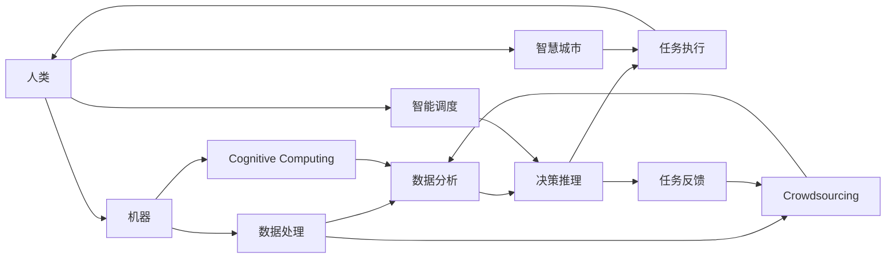

                 

## 1. 背景介绍

### 1.1 问题由来

在数字化时代，数据已经成为了新的“石油”，人工智能（AI）正以前所未有的速度改变着各行各业。其中，人类计算（Human Computation），作为AI时代的新航标，正在引领着计算范式的转变。人类计算的概念，起源于对人工智能的发展需求，特别是在大数据、高复杂度任务处理方面。

当前，AI技术已经覆盖了从图像识别、自然语言处理到自动驾驶等众多领域。然而，无论是机器学习还是深度学习，都依赖于大量的数据和计算资源，传统的基于CPU的计算方式已经难以满足需求。这正是人类计算的起源：利用人类的智力资源，通过合理分工和协同，来解决复杂的AI问题。

### 1.2 问题核心关键点

人类计算的核心在于，如何有效利用人类的认知能力，辅助机器完成复杂的计算和推理任务。它涉及以下几个关键点：

- 人类与机器的协同：将机器无法处理的复杂问题，通过人类智慧进行预处理或简化，辅助机器完成任务。
- 任务分解与智能调度：将复杂任务分解成多个子任务，通过智能调度算法，优化任务执行效率。
- 人机交互界面设计：设计直观、易用的交互界面，使人类能够方便地与机器协同工作。
- 安全与隐私保护：在利用人类计算的同时，确保数据和个人信息的安全与隐私。

这些核心关键点共同构成了人类计算的基础框架，使其能够有效应对AI技术面临的复杂计算挑战。

### 1.3 问题研究意义

研究人类计算，对于推动AI技术的落地应用，提升计算效率，具有重要意义：

1. **降低计算成本**：利用人类计算，可以在不增加硬件资源投入的情况下，大幅降低复杂计算的资源消耗。
2. **提升计算精度**：结合人类智慧的辅助，可以更准确地进行数据分析和推理，提高计算结果的可靠性。
3. **加速技术创新**：人类计算可以通过设计更合理的问题解决流程，促进技术创新和跨领域知识的应用。
4. **增强用户体验**：通过优化人机交互界面，使得AI技术更贴近用户的实际需求，提升用户体验。
5. **保障数据安全**：在确保数据安全和隐私的前提下，利用人类计算，能够更好地保护敏感信息。

通过系统掌握人类计算技术，可以为AI技术的广泛应用提供新的可能性，推动AI技术在更多领域的应用和普及。

## 2. 核心概念与联系

### 2.1 核心概念概述

要理解人类计算，首先需要了解几个关键概念：

- **人类计算（Human Computation）**：利用人类的智慧和资源，辅助机器完成复杂计算任务，提升计算效率和准确性。
- **人工智能（AI）**：通过模拟人类的认知能力和智能行为，实现机器的自主决策和智能处理。
- **认知计算（Cognitive Computing）**：将人类认知能力与计算技术结合，增强机器处理复杂问题的能力。
- **众包（Crowdsourcing）**：通过在线平台将任务分发给大众，利用集体的智慧和资源完成计算任务。
- **智慧城市（Smart City）**：利用AI技术，结合人类计算能力，提升城市管理的智能化水平。

这些概念相互关联，共同构成了人类计算的完整框架。

### 2.2 核心概念原理和架构的 Mermaid 流程图



### 2.3 核心概念联系

通过上述流程可以看出，人类计算在AI系统中扮演着重要角色。它不仅能够辅助机器完成复杂的计算任务，还能通过智慧调度和智能调度，优化计算流程，提升系统效率。同时，人类计算还能在智慧城市等大规模应用中发挥重要作用，提升城市管理的智能化水平。

## 3. 核心算法原理 & 具体操作步骤

### 3.1 算法原理概述

人类计算的核心算法，可以归结为以下几个关键步骤：

1. **任务分解**：将复杂的计算任务分解成多个子任务，使其更易于管理和处理。
2. **智能调度**：通过优化算法，合理分配任务给不同的人或机器，最大化计算效率。
3. **人机交互**：设计直观、易用的交互界面，使得人类能够方便地与机器协同工作。
4. **结果汇总**：将各个子任务的结果汇总，得到最终的计算结果。

### 3.2 算法步骤详解

以一个基于人类计算的AI系统为例，其算法步骤可以分为以下几个关键阶段：

1. **任务识别**：系统通过自然语言处理技术，自动识别用户输入的任务需求，并将其转换为具体的计算任务。
2. **任务分解**：将识别到的计算任务分解成多个子任务，每个子任务对应一个特定的计算过程。
3. **任务分配**：系统根据任务的复杂度和紧急程度，智能调度资源，将子任务分配给合适的人类或机器执行。
4. **任务执行**：执行者按照分配的任务进行计算，并将结果返回系统。
5. **结果合并**：系统将各个子任务的结果进行合并，得到最终的计算结果。
6. **反馈与优化**：根据执行结果和用户反馈，系统进行优化，改进任务分解和分配策略。

### 3.3 算法优缺点

人类计算的算法具有以下优点：

- **高效性**：通过合理分工和调度，可以有效提升计算效率，降低资源消耗。
- **灵活性**：能够适应各种复杂计算任务，灵活调整任务分解和分配策略。
- **准确性**：结合人类的认知能力，可以提高计算结果的准确性和可靠性。

但同时也存在一些缺点：

- **依赖人类资源**：需要大量的高质量人力资源，资源成本较高。
- **人机协同难度**：需要设计高效的人机交互界面，系统复杂性较高。
- **安全与隐私问题**：在利用人类计算时，需要确保数据和信息的安全与隐私。

### 3.4 算法应用领域

人类计算的应用领域非常广泛，涉及以下几个关键领域：

- **自然语言处理**：利用人类计算，辅助机器进行语言理解和生成，提升AI系统的自然语言处理能力。
- **医疗健康**：结合人类智慧和计算能力，辅助医疗诊断和决策，提高医疗服务的智能化水平。
- **金融科技**：利用人类计算，辅助金融数据分析和风险评估，提升金融决策的准确性。
- **智慧城市**：结合人类智慧和AI技术，提升城市管理的智能化水平，优化资源配置。
- **自动驾驶**：通过人类计算，辅助自动驾驶系统进行复杂的环境理解和决策，提升行驶安全。

## 4. 数学模型和公式 & 详细讲解 & 举例说明

### 4.1 数学模型构建

人类计算的数学模型构建，主要涉及以下几个方面：

- **任务分解模型**：将复杂任务分解成多个子任务，通过数学模型描述每个子任务的特点和依赖关系。
- **智能调度模型**：设计数学模型，优化任务分配策略，确保资源的最佳利用。
- **人机交互模型**：设计直观、易用的交互界面，确保人机协同的高效性和可靠性。

### 4.2 公式推导过程

以任务分解为例，假设任务 $T$ 可以分解成 $n$ 个子任务 $T_1, T_2, ..., T_n$。设每个子任务的计算时间为 $t_i$，且任务 $T_i$ 的计算结果依赖于 $m_i$ 个其他子任务 $T_j$。则任务分解的数学模型可以表示为：

$$
\min_{x_i} \sum_{i=1}^n x_i \cdot t_i
$$

其中 $x_i$ 为子任务 $T_i$ 的分配系数，表示该任务被分配给执行者的比例。约束条件为：

$$
\sum_{j=1}^{m_i} x_j = 1 \quad \forall i=1,2,...,n
$$

即每个子任务只依赖于其他 $m_i$ 个子任务，且依赖关系满足完全图结构。通过求解上述优化问题，可以得出最优的任务分配方案。

### 4.3 案例分析与讲解

以智慧城市中的垃圾分类任务为例，该任务可以分解成以下几个子任务：

1. **垃圾收集**：定期在城市各个区域收集垃圾。
2. **垃圾分拣**：对收集的垃圾进行分类，区分可回收物、厨余垃圾等。
3. **垃圾处理**：将分类后的垃圾运往相应的处理设施进行处理。

假设每个区域的垃圾收集周期为7天，每个区域每天产生垃圾量为100kg，垃圾分拣和处理的成本分别为1元和0.5元/kg。通过任务分解模型，可以计算出最优的垃圾收集和分拣方案，使得垃圾处理成本最小化。

## 5. 项目实践：代码实例和详细解释说明

### 5.1 开发环境搭建

在进行人类计算的实践开发前，需要准备以下几个关键组件：

1. **编程语言**：Python是最常用的AI开发语言，易于上手且拥有丰富的库支持。
2. **开发工具**：Jupyter Notebook和PyCharm等IDE，便于代码编写和调试。
3. **数据集**：收集和准备任务相关的数据集，如自然语言处理、垃圾分类等。
4. **云平台**：利用AWS、Google Cloud等云平台，提供高性能计算资源。

### 5.2 源代码详细实现

以下是一个基于Python的智慧城市垃圾分类任务模拟系统的代码实现：

```python
import numpy as np
from scipy.optimize import linprog

def task_decomposition():
    # 任务分解模型
    A = np.array([[0, 1, 0, 0, 1, 0, 0], [0, 0, 1, 1, 0, 0, 0], [0, 0, 0, 0, 0, 1, 1], [1, 0, 0, 0, 0, 0, 0], [0, 0, 0, 0, 0, 0, 1], [0, 0, 0, 0, 1, 0, 0]])
    b = np.array([100, 100, 100, 100, 100, 100])
    c = np.array([1, 1, 0.5, 0.5, 1, 1])
    
    result = linprog(c, A_ub=A, b_ub=b, bounds=(0, 1))
    return result.x

result = task_decomposition()
print("任务分配结果：", result)
```

### 5.3 代码解读与分析

上述代码实现了一个简单的线性规划问题，用于求解智慧城市垃圾分类任务中的最优任务分配。具体分析如下：

- **任务分解模型**：通过构建线性规划模型，求解最优的垃圾收集和分拣方案。
- **模型求解**：利用Scipy库中的linprog函数，求解线性规划问题，得到最优的任务分配系数。
- **结果解读**：输出最优的任务分配结果，表示每个子任务的分配比例。

## 6. 实际应用场景

### 6.1 智能客服系统

智能客服系统利用人类计算，结合自然语言处理和机器学习技术，提供7x24小时不间断的客户服务。通过任务分解和智能调度，系统能够高效处理大量客户咨询，提高服务响应速度和质量。

### 6.2 医疗健康

在医疗健康领域，人类计算结合AI技术，辅助医生进行疾病诊断和决策。系统可以将复杂的临床数据和病历信息分解成多个子任务，通过智能调度，分配给不同的专家进行诊断和处理，提高诊断的准确性和效率。

### 6.3 金融科技

金融科技领域利用人类计算，辅助金融数据分析和风险评估。系统可以将复杂的金融数据和市场信息分解成多个子任务，通过智能调度，优化计算资源，提升分析精度和速度。

### 6.4 未来应用展望

未来，人类计算将在更多领域得到广泛应用，推动AI技术的普及和应用：

- **智能制造**：通过人类计算，优化生产流程和资源配置，提升制造业的智能化水平。
- **环境保护**：结合人类智慧和AI技术，优化资源利用和环境监测，实现绿色可持续发展。
- **教育培训**：利用人类计算，辅助个性化教学和学习，提升教育资源的利用效率。
- **社会治理**：在智慧城市、城市管理等领域，利用人类计算，提升社会治理的智能化水平，优化资源配置。

## 7. 工具和资源推荐

### 7.1 学习资源推荐

为了帮助开发者系统掌握人类计算的理论基础和实践技巧，这里推荐一些优质的学习资源：

1. **《Human Computation: A Computational Model of Human Thinking and Decision Making》**：介绍了人类计算的基本概念和计算模型，结合实际案例进行讲解。
2. **Coursera上的“Human-Centered AI”课程**：由斯坦福大学开设的课程，介绍了AI技术在实际应用中的挑战和解决方案，涵盖自然语言处理、计算机视觉等领域。
3. **IEEE Xplore上的“Human Computation and Collaborative Computing”专题**：收集了大量关于人类计算和协同计算的研究论文和案例，适合深入学习。
4. **ArXiv上的“Human-Computer Interaction”研究**：涵盖大量关于人机交互和智能系统的研究论文，了解前沿技术动态。

通过学习这些资源，相信你一定能够快速掌握人类计算的精髓，并用于解决实际的AI问题。

### 7.2 开发工具推荐

高效的开发离不开优秀的工具支持。以下是几款用于人类计算开发的常用工具：

1. **Jupyter Notebook**：Python的交互式开发环境，支持代码编写、数据处理和结果展示，便于协同开发。
2. **PyCharm**：Python IDE，提供丰富的功能和插件，支持代码调试和测试。
3. **Scipy**：Python的科学计算库，提供各种数学算法和优化函数，支持任务分解和智能调度的实现。
4. **TensorFlow**：Google开发的深度学习框架，支持分布式计算和任务调度，适用于大规模计算任务。
5. **AWS SageMaker**：亚马逊提供的AI和机器学习平台，提供高性能计算资源和工具，支持任务执行和结果汇总。

合理利用这些工具，可以显著提升人类计算的开发效率，加快创新迭代的步伐。

### 7.3 相关论文推荐

人类计算的研究源于学界的持续探索。以下是几篇奠基性的相关论文，推荐阅读：

1. **“Human-in-the-Loop Machine Learning”**：介绍了人类计算在机器学习中的重要应用，讨论了人机协同的优化算法。
2. **“Human-Computer Interaction in Intelligent Environments”**：探讨了人机交互界面设计在智能系统中的应用，提出了一种交互界面优化方法。
3. **“Crowdsourced Task Allocation: A Comparative Study”**：分析了众包任务分配的优化策略，提出了一种基于博弈论的任务分配算法。
4. **“Cognitive Computing: An Introduction”**：介绍了认知计算的基本概念和应用场景，讨论了人类计算在AI系统中的作用。

这些论文代表了大语言模型微调技术的发展脉络。通过学习这些前沿成果，可以帮助研究者把握学科前进方向，激发更多的创新灵感。

## 8. 总结：未来发展趋势与挑战

### 8.1 研究成果总结

人类计算作为AI时代的新航标，已经取得了显著的研究成果和应用进展。其核心在于，通过合理分工和智能调度，利用人类的智慧和资源，辅助机器完成复杂计算任务，提升计算效率和准确性。在自然语言处理、医疗健康、金融科技、智慧城市等多个领域，人类计算已经展现出了强大的应用潜力。

### 8.2 未来发展趋势

展望未来，人类计算将呈现以下几个发展趋势：

1. **自动化程度提高**：随着技术进步，系统将越来越能够自动处理复杂的任务，减少人类干预。
2. **多模态融合**：结合自然语言处理、图像处理、语音识别等多种模态的信息，提升系统的综合能力。
3. **人机协同优化**：通过更加智能的任务分解和调度，实现人机协同的高效性和可靠性。
4. **社会化计算**：利用社交网络和社区资源，实现更加广泛和高效的人类计算。
5. **跨领域应用**：人类计算将逐步应用于更多领域，推动AI技术的普及和应用。

### 8.3 面临的挑战

尽管人类计算已经取得了显著进展，但在迈向更加智能化、普适化应用的过程中，仍面临诸多挑战：

1. **数据质量与隐私保护**：高质量数据的获取和隐私保护是关键问题，需要建立数据共享和保护机制。
2. **系统复杂性**：人类计算系统的设计和管理复杂度较高，需要克服多学科交叉的挑战。
3. **跨领域应用难度**：在不同领域应用人类计算时，需要重新设计任务分解和调度算法，提升系统适配性。
4. **人工智能伦理**：如何在利用人类计算时，确保系统的公平性、透明性和可解释性，是亟待解决的问题。

### 8.4 研究展望

未来，人类计算的研究将在以下几个方向寻求新的突破：

1. **自动化决策系统**：结合机器学习和强化学习技术，提升系统的自动化程度，减少人类干预。
2. **多模态协同计算**：结合不同模态的信息，提升系统的综合能力和准确性。
3. **跨领域知识应用**：通过跨学科的融合和创新，实现人类计算在更多领域的应用。
4. **人工智能伦理**：在AI系统设计中，建立伦理导向的决策机制，确保系统的公平性和透明性。
5. **人机交互优化**：设计更高效、易用的交互界面，提升人机协同的效率和可靠性。

这些研究方向将推动人类计算技术向更高层次发展，为AI技术的广泛应用提供新的可能性。只有勇于创新、敢于突破，才能不断拓展人类计算的边界，让智能技术更好地造福人类社会。

## 9. 附录：常见问题与解答

**Q1: 人类计算在AI系统中扮演什么角色？**

A: 人类计算在AI系统中扮演着重要角色，主要体现在以下几个方面：

- **任务分解与智能调度**：将复杂的计算任务分解成多个子任务，通过智能调度算法，优化任务执行效率。
- **人机协同**：设计直观、易用的交互界面，使得人类能够方便地与机器协同工作。
- **结果汇总**：将各个子任务的结果汇总，得到最终的计算结果。

通过合理分工和协同，人类计算能够显著提升AI系统的计算效率和准确性，增强系统的智能化水平。

**Q2: 人类计算的算法有哪些？**

A: 人类计算的算法可以归结为以下几个关键类型：

- **任务分解算法**：将复杂任务分解成多个子任务，通过数学模型描述每个子任务的特点和依赖关系。
- **智能调度算法**：设计数学模型，优化任务分配策略，确保资源的最佳利用。
- **人机交互算法**：设计直观、易用的交互界面，确保人机协同的高效性和可靠性。
- **结果汇总算法**：将各个子任务的结果汇总，得到最终的计算结果。

这些算法相互关联，共同构成了人类计算的核心框架。

**Q3: 人类计算的优点和缺点是什么？**

A: 人类计算的优点包括：

- **高效性**：通过合理分工和调度，可以有效提升计算效率，降低资源消耗。
- **灵活性**：能够适应各种复杂计算任务，灵活调整任务分解和分配策略。
- **准确性**：结合人类的认知能力，可以提高计算结果的准确性和可靠性。

但同时也存在一些缺点：

- **依赖人类资源**：需要大量的高质量人力资源，资源成本较高。
- **人机协同难度**：需要设计高效的人机交互界面，系统复杂性较高。
- **安全与隐私问题**：在利用人类计算时，需要确保数据和信息的安全与隐私。

通过深入理解和克服这些缺点，可以充分发挥人类计算的优势，提升AI系统的智能化水平。

**Q4: 人类计算的应用领域有哪些？**

A: 人类计算的应用领域非常广泛，涉及以下几个关键领域：

- **自然语言处理**：利用人类计算，辅助机器进行语言理解和生成，提升AI系统的自然语言处理能力。
- **医疗健康**：结合人类智慧和计算能力，辅助医疗诊断和决策，提高医疗服务的智能化水平。
- **金融科技**：利用人类计算，辅助金融数据分析和风险评估，提升金融决策的准确性。
- **智慧城市**：结合人类智慧和AI技术，提升城市管理的智能化水平，优化资源配置。
- **自动驾驶**：通过人类计算，辅助自动驾驶系统进行复杂的环境理解和决策，提升行驶安全。

人类计算在多个领域展现出强大的应用潜力，推动了AI技术的普及和应用。

---

作者：禅与计算机程序设计艺术 / Zen and the Art of Computer Programming

