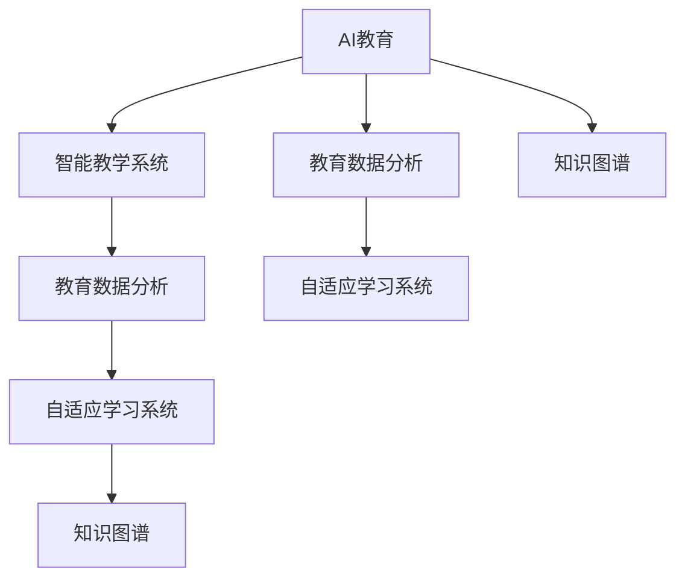

                 

# 人类计算：AI时代的教育和培训

> 关键词：AI教育, 人工智能, 技术培训, 计算教育, 数字素养

## 1. 背景介绍

### 1.1 问题由来
在过去的几十年里，信息技术的飞速发展极大地改变了人类社会的面貌。从互联网到移动互联网，从大数据到人工智能，技术不断进步，也为教育领域带来了新的机遇和挑战。AI时代，教育方式的变革愈加迫切。如何通过技术手段提升教育质量，实现个性化、定制化、高效化的教学，是当前教育领域急需解决的问题。

### 1.2 问题核心关键点
AI时代教育的核心关键点在于如何有效地利用人工智能技术，提升教育资源的利用效率，优化教学过程，为每个学生提供量身定制的学习路径。这涉及到以下几个核心问题：

1. **个性化教育**：如何利用AI技术分析学生的学习行为和成绩，从而为其定制个性化的学习计划？
2. **教学过程优化**：AI技术如何辅助教师优化课堂教学，提高教学效果？
3. **知识更新**：AI如何帮助教师及时更新教学内容，引入最新的科技成果？
4. **学习评估**：AI如何通过数据分析，全面、客观地评估学生的学习效果？
5. **跨界融合**：AI如何与传统教育方法相结合，提升教学效果和学生满意度？

### 1.3 问题研究意义
AI时代教育的研究具有重要的现实意义：

1. **提高教育质量**：利用AI技术进行教育分析和学习推荐，能够提高教学质量，使每个学生都能获得最适合自己的学习资源。
2. **优化教学流程**：AI辅助的智能教学系统能够帮助教师更加高效地完成教学任务，减少重复劳动，提高教学效果。
3. **促进终身学习**：AI提供的个性化学习平台，能够支持终身学习，使人们随时、随地、随意地学习新知识。
4. **增强教育公平性**：AI教育的普及能够帮助偏远地区和资源匮乏地区的学生获得更好的教育资源。
5. **推动教育创新**：AI技术的引入能够激发教育领域的新理念和新方法，促进教育方式的创新和发展。

## 2. 核心概念与联系

### 2.1 核心概念概述

为更好地理解AI时代教育的实现方式，本节将介绍几个密切相关的核心概念：

- **AI教育**：利用人工智能技术进行教育分析和个性化教学的过程。
- **智能教学系统**：基于AI技术的教育软件平台，提供个性化的学习路径、智能化的教学辅助和自动化的学习评估。
- **教育数据分析**：通过收集、清洗、分析和可视化教育数据，提供教学效果评估、学习行为分析等支持。
- **自适应学习系统**：根据学生的学习进度和理解能力，自动调整教学内容和难度，实现个性化的学习体验。
- **知识图谱**：结构化表示人类知识体系的图，通过知识图谱可以将不同领域的知识有机地整合起来。

这些核心概念之间的逻辑关系可以通过以下Mermaid流程图来展示：



这个流程图展示了大语言模型的核心概念及其之间的关系：

1. AI教育通过智能教学系统进行实现。
2. 智能教学系统依赖教育数据分析提供决策支持。
3. 自适应学习系统根据教育数据分析调整教学策略。
4. 知识图谱作为知识库，为教育数据分析和自适应学习系统提供知识支持。

这些概念共同构成了AI时代教育的实现框架，使得个性化、高效化、智能化教学成为可能。

## 3. 核心算法原理 & 具体操作步骤
### 3.1 算法原理概述

AI时代教育的算法原理主要基于以下几个核心概念：

1. **个性化推荐算法**：利用机器学习算法对学生学习行为和成绩进行分析，为其推荐个性化的学习内容。
2. **自然语言处理(NLP)**：通过NLP技术，实现智能教学系统与学生之间的自然交互。
3. **强化学习**：利用强化学习算法，优化智能教学系统的教学策略，提高教学效果。
4. **深度学习**：利用深度学习模型，分析教育数据，进行教学效果评估和学生行为预测。
5. **知识图谱嵌入**：将知识图谱与深度学习模型相结合，实现知识的自动化扩展和更新。

这些算法通过数据驱动的方式，优化教育资源的分配和使用，提升教学效果，支持终身学习。

### 3.2 算法步骤详解

AI时代教育的具体操作步骤可以分为以下几个步骤：

**Step 1: 数据采集与清洗**
- 收集学生的学习行为数据（如学习时间、阅读文章、完成作业等）。
- 收集学生的成绩数据（如考试成绩、测验成绩等）。
- 收集教育资源数据（如教材、课程视频等）。
- 对数据进行清洗和预处理，去除噪音和异常值。

**Step 2: 数据分析与建模**
- 利用机器学习算法（如协同过滤、决策树、随机森林等）分析学生学习行为和成绩，构建学生画像。
- 利用深度学习模型（如CNN、RNN、Transformer等）进行教育数据分析，预测学生学习效果。
- 利用知识图谱嵌入技术，将知识图谱与深度学习模型结合，进行知识扩展和更新。

**Step 3: 个性化推荐**
- 根据学生画像和学习行为数据，利用推荐算法生成个性化学习路径和内容推荐。
- 通过NLP技术，实现智能教学系统与学生之间的自然交互。
- 利用强化学习算法优化教学策略，提高教学效果。

**Step 4: 教学效果评估**
- 利用教育数据分析，进行教学效果评估，反馈优化教学策略。
- 定期进行学生学习行为和成绩分析，更新学生画像。
- 利用知识图谱进行知识图谱更新和扩展，保证知识的时效性和准确性。

### 3.3 算法优缺点

AI时代教育具有以下优点：

1. **个性化学习**：通过分析学生的学习行为和成绩，提供个性化的学习内容和路径。
2. **高效教学**：利用机器学习和深度学习算法，优化教学策略，提高教学效果。
3. **自动化评估**：通过数据分析，进行教学效果评估，提供精准的教学反馈。
4. **终身学习支持**：通过智能教学系统，实现终身学习，随时随地学习新知识。

同时，该方法也存在一定的局限性：

1. **数据依赖**：需要大量的教育数据作为支撑，对于数据质量要求较高。
2. **技术门槛**：需要具备一定的技术背景，对于教师和学生的要求较高。
3. **隐私保护**：需要确保学生数据的隐私和安全，防止数据泄露和滥用。
4. **算法偏见**：算法可能存在偏见，影响教学效果和公平性。
5. **技术更新**：需要持续更新算法和模型，保证技术的先进性和适用性。

尽管存在这些局限性，但就目前而言，AI时代教育的方法已经在大规模教育应用中得到了验证，具备良好的发展前景。未来相关研究的重点在于如何进一步降低技术门槛，提高数据隐私保护，消除算法偏见，加速技术更新。

### 3.4 算法应用领域

AI时代教育已经在多个领域得到了广泛应用，例如：

- **K-12教育**：通过智能教学系统，提供个性化学习路径和内容推荐，提升教学效果。
- **职业教育**：利用自适应学习系统，根据学生的学习进度和理解能力，自动调整教学内容和难度，实现个性化的学习体验。
- **高等教育**：通过AI教育平台，提供学术资源和学习工具，支持教师和学生的科研和学习。
- **终身学习**：利用在线学习平台，提供丰富的学习资源和个性化学习路径，支持终身学习。
- **企业培训**：通过AI教育系统，提供定制化的培训方案和教学资源，提升员工技能。

除了上述这些经典领域外，AI教育还在更多场景中得到应用，如远程教育、智能答疑、知识图谱构建等，为教育领域的数字化转型提供了新的可能性。

## 4. 数学模型和公式 & 详细讲解  
### 4.1 数学模型构建

本节将使用数学语言对AI时代教育的实现方式进行更加严格的刻画。

记学生为 $S=\{s_1,s_2,...,s_n\}$，每个学生有 $d$ 个特征（如学习时间、阅读文章、完成作业等），每个特征 $x_{di}$ 的取值为 $[0,1]$。学生学习行为数据记为 $X=\{x_{ij}\}_{i=1}^n$。

设每个学生的成绩为 $y_s \in [0,1]$，利用线性回归模型构建学生画像 $f(X)=\theta^TX+b$，其中 $\theta$ 为模型参数，$b$ 为截距。

**Step 1: 数据采集与清洗**
- 收集学生的学习行为数据 $X=\{x_{ij}\}_{i=1}^n$。
- 收集学生的成绩数据 $Y=\{y_s\}_{s=1}^n$。
- 对数据进行清洗和预处理，去除噪音和异常值。

**Step 2: 数据分析与建模**
- 利用机器学习算法（如协同过滤、决策树、随机森林等）分析学生学习行为和成绩，构建学生画像。
- 利用深度学习模型（如CNN、RNN、Transformer等）进行教育数据分析，预测学生学习效果。
- 利用知识图谱嵌入技术，将知识图谱与深度学习模型结合，进行知识扩展和更新。

**Step 3: 个性化推荐**
- 根据学生画像和学习行为数据，利用推荐算法生成个性化学习路径和内容推荐。
- 通过NLP技术，实现智能教学系统与学生之间的自然交互。
- 利用强化学习算法优化教学策略，提高教学效果。

**Step 4: 教学效果评估**
- 利用教育数据分析，进行教学效果评估，反馈优化教学策略。
- 定期进行学生学习行为和成绩分析，更新学生画像。
- 利用知识图谱进行知识图谱更新和扩展，保证知识的时效性和准确性。

### 4.2 公式推导过程

以下我们以个性化推荐算法为例，推导推荐模型的公式及其梯度计算。

设推荐模型的参数为 $\theta$，利用矩阵分解方法将学习行为数据 $X$ 和成绩数据 $Y$ 表示为矩阵形式 $X \in \mathbb{R}^{n \times d}$，$Y \in \mathbb{R}^{n \times 1}$。假设 $f(X)=\theta^TX+b$ 为线性回归模型。

推荐模型的目标是最小化损失函数：
$$
\mathcal{L}(\theta) = \frac{1}{N}\sum_{i=1}^N \|y_i - f(x_i)\|^2
$$

其中 $N$ 为样本数量。根据链式法则，损失函数对参数 $\theta$ 的梯度为：
$$
\frac{\partial \mathcal{L}(\theta)}{\partial \theta} = \frac{2}{N}\sum_{i=1}^N (y_i - \theta^TX_i - b)X_i^T
$$

在得到梯度后，即可带入梯度下降算法，更新模型参数，最小化损失函数。

### 4.3 案例分析与讲解

以下以K-12教育为例，展示AI时代教育的实际应用：

**案例背景**：某K-12教育机构希望通过AI技术提升教学效果，实现个性化教学。该机构收集了学生近半年的学习行为数据，包括每日学习时间、阅读文章、完成作业等。

**数据采集**：
- 通过学习管理系统(LMS)收集学生的学习行为数据 $X$。
- 通过考试系统收集学生的成绩数据 $Y$。
- 对数据进行清洗和预处理，去除噪音和异常值。

**数据分析**：
- 利用协同过滤算法分析学生学习行为和成绩，构建学生画像。
- 利用深度学习模型（如RNN）进行教育数据分析，预测学生学习效果。
- 利用知识图谱嵌入技术，将知识图谱与深度学习模型结合，进行知识扩展和更新。

**个性化推荐**：
- 根据学生画像和学习行为数据，利用推荐算法生成个性化学习路径和内容推荐。
- 通过NLP技术，实现智能教学系统与学生之间的自然交互。
- 利用强化学习算法优化教学策略，提高教学效果。

**教学效果评估**：
- 利用教育数据分析，进行教学效果评估，反馈优化教学策略。
- 定期进行学生学习行为和成绩分析，更新学生画像。
- 利用知识图谱进行知识图谱更新和扩展，保证知识的时效性和准确性。

## 5. 项目实践：代码实例和详细解释说明
### 5.1 开发环境搭建

在进行AI教育实践前，我们需要准备好开发环境。以下是使用Python进行PyTorch开发的环境配置流程：

1. 安装Anaconda：从官网下载并安装Anaconda，用于创建独立的Python环境。

2. 创建并激活虚拟环境：
```bash
conda create -n ai-env python=3.8 
conda activate ai-env
```

3. 安装PyTorch：根据CUDA版本，从官网获取对应的安装命令。例如：
```bash
conda install pytorch torchvision torchaudio cudatoolkit=11.1 -c pytorch -c conda-forge
```

4. 安装各类工具包：
```bash
pip install numpy pandas scikit-learn matplotlib tqdm jupyter notebook ipython
```

完成上述步骤后，即可在`ai-env`环境中开始AI教育实践。

### 5.2 源代码详细实现

下面我们以K-12教育为例，给出使用Transformers库对BERT模型进行AI教育实践的PyTorch代码实现。

首先，定义K-12教育任务的数据处理函数：

```python
from transformers import BertTokenizer
from torch.utils.data import Dataset
import torch

class K12Dataset(Dataset):
    def __init__(self, texts, tags, tokenizer, max_len=128):
        self.texts = texts
        self.tags = tags
        self.tokenizer = tokenizer
        self.max_len = max_len
        
    def __len__(self):
        return len(self.texts)
    
    def __getitem__(self, item):
        text = self.texts[item]
        tags = self.tags[item]
        
        encoding = self.tokenizer(text, return_tensors='pt', max_length=self.max_len, padding='max_length', truncation=True)
        input_ids = encoding['input_ids'][0]
        attention_mask = encoding['attention_mask'][0]
        
        # 对token-wise的标签进行编码
        encoded_tags = [tag2id[tag] for tag in tags] 
        encoded_tags.extend([tag2id['O']] * (self.max_len - len(encoded_tags)))
        labels = torch.tensor(encoded_tags, dtype=torch.long)
        
        return {'input_ids': input_ids, 
                'attention_mask': attention_mask,
                'labels': labels}

# 标签与id的映射
tag2id = {'O': 0, 'MATH': 1, 'SCIENCE': 2, 'HISTORY': 3, 'GEOGRAPHY': 4}
id2tag = {v: k for k, v in tag2id.items()}

# 创建dataset
tokenizer = BertTokenizer.from_pretrained('bert-base-cased')

train_dataset = K12Dataset(train_texts, train_tags, tokenizer)
dev_dataset = K12Dataset(dev_texts, dev_tags, tokenizer)
test_dataset = K12Dataset(test_texts, test_tags, tokenizer)
```

然后，定义模型和优化器：

```python
from transformers import BertForTokenClassification, AdamW

model = BertForTokenClassification.from_pretrained('bert-base-cased', num_labels=len(tag2id))

optimizer = AdamW(model.parameters(), lr=2e-5)
```

接着，定义训练和评估函数：

```python
from torch.utils.data import DataLoader
from tqdm import tqdm
from sklearn.metrics import classification_report

device = torch.device('cuda') if torch.cuda.is_available() else torch.device('cpu')
model.to(device)

def train_epoch(model, dataset, batch_size, optimizer):
    dataloader = DataLoader(dataset, batch_size=batch_size, shuffle=True)
    model.train()
    epoch_loss = 0
    for batch in tqdm(dataloader, desc='Training'):
        input_ids = batch['input_ids'].to(device)
        attention_mask = batch['attention_mask'].to(device)
        labels = batch['labels'].to(device)
        model.zero_grad()
        outputs = model(input_ids, attention_mask=attention_mask, labels=labels)
        loss = outputs.loss
        epoch_loss += loss.item()
        loss.backward()
        optimizer.step()
    return epoch_loss / len(dataloader)

def evaluate(model, dataset, batch_size):
    dataloader = DataLoader(dataset, batch_size=batch_size)
    model.eval()
    preds, labels = [], []
    with torch.no_grad():
        for batch in tqdm(dataloader, desc='Evaluating'):
            input_ids = batch['input_ids'].to(device)
            attention_mask = batch['attention_mask'].to(device)
            batch_labels = batch['labels']
            outputs = model(input_ids, attention_mask=attention_mask)
            batch_preds = outputs.logits.argmax(dim=2).to('cpu').tolist()
            batch_labels = batch_labels.to('cpu').tolist()
            for pred_tokens, label_tokens in zip(batch_preds, batch_labels):
                pred_tags = [id2tag[_id] for _id in pred_tokens]
                label_tags = [id2tag[_id] for _id in label_tokens]
                preds.append(pred_tags[:len(label_tags)])
                labels.append(label_tags)
                
    print(classification_report(labels, preds))
```

最后，启动训练流程并在测试集上评估：

```python
epochs = 5
batch_size = 16

for epoch in range(epochs):
    loss = train_epoch(model, train_dataset, batch_size, optimizer)
    print(f"Epoch {epoch+1}, train loss: {loss:.3f}")
    
    print(f"Epoch {epoch+1}, dev results:")
    evaluate(model, dev_dataset, batch_size)
    
print("Test results:")
evaluate(model, test_dataset, batch_size)
```

以上就是使用PyTorch对BERT进行K-12教育任务微调的完整代码实现。可以看到，得益于Transformers库的强大封装，我们可以用相对简洁的代码完成BERT模型的加载和微调。

### 5.3 代码解读与分析

让我们再详细解读一下关键代码的实现细节：

**K12Dataset类**：
- `__init__`方法：初始化文本、标签、分词器等关键组件。
- `__len__`方法：返回数据集的样本数量。
- `__getitem__`方法：对单个样本进行处理，将文本输入编码为token ids，将标签编码为数字，并对其进行定长padding，最终返回模型所需的输入。

**tag2id和id2tag字典**：
- 定义了标签与数字id之间的映射关系，用于将token-wise的预测结果解码回真实的标签。

**训练和评估函数**：
- 使用PyTorch的DataLoader对数据集进行批次化加载，供模型训练和推理使用。
- 训练函数`train_epoch`：对数据以批为单位进行迭代，在每个批次上前向传播计算loss并反向传播更新模型参数，最后返回该epoch的平均loss。
- 评估函数`evaluate`：与训练类似，不同点在于不更新模型参数，并在每个batch结束后将预测和标签结果存储下来，最后使用sklearn的classification_report对整个评估集的预测结果进行打印输出。

**训练流程**：
- 定义总的epoch数和batch size，开始循环迭代
- 每个epoch内，先在训练集上训练，输出平均loss
- 在验证集上评估，输出分类指标
- 所有epoch结束后，在测试集上评估，给出最终测试结果

可以看到，PyTorch配合Transformers库使得BERT微调的代码实现变得简洁高效。开发者可以将更多精力放在数据处理、模型改进等高层逻辑上，而不必过多关注底层的实现细节。

当然，工业级的系统实现还需考虑更多因素，如模型的保存和部署、超参数的自动搜索、更灵活的任务适配层等。但核心的微调范式基本与此类似。

## 6. 实际应用场景
### 6.1 智能客服系统

基于AI教育技术的智能客服系统，可以广泛应用于企业客户服务的构建。传统客服往往需要配备大量人力，高峰期响应缓慢，且一致性和专业性难以保证。而使用AI教育技术的智能客服系统，可以7x24小时不间断服务，快速响应客户咨询，用自然流畅的语言解答各类常见问题。

在技术实现上，可以收集企业内部的历史客服对话记录，将问题和最佳答复构建成监督数据，在此基础上对预训练客服模型进行微调。微调后的客服模型能够自动理解用户意图，匹配最合适的答复模板进行回复。对于客户提出的新问题，还可以接入检索系统实时搜索相关内容，动态组织生成回答。如此构建的智能客服系统，能大幅提升客户咨询体验和问题解决效率。

### 6.2 金融舆情监测

金融机构需要实时监测市场舆论动向，以便及时应对负面信息传播，规避金融风险。传统的人工监测方式成本高、效率低，难以应对网络时代海量信息爆发的挑战。基于AI教育技术的文本分类和情感分析技术，为金融舆情监测提供了新的解决方案。

具体而言，可以收集金融领域相关的新闻、报道、评论等文本数据，并对其进行主题标注和情感标注。在此基础上对预训练语言模型进行微调，使其能够自动判断文本属于何种主题，情感倾向是正面、中性还是负面。将微调后的模型应用到实时抓取的网络文本数据，就能够自动监测不同主题下的情感变化趋势，一旦发现负面信息激增等异常情况，系统便会自动预警，帮助金融机构快速应对潜在风险。

### 6.3 个性化推荐系统

当前的推荐系统往往只依赖用户的历史行为数据进行物品推荐，无法深入理解用户的真实兴趣偏好。基于AI教育技术的个性化推荐系统可以更好地挖掘用户行为背后的语义信息，从而提供更精准、多样的推荐内容。

在实践中，可以收集用户浏览、点击、评论、分享等行为数据，提取和用户交互的物品标题、描述、标签等文本内容。将文本内容作为模型输入，用户的后续行为（如是否点击、购买等）作为监督信号，在此基础上微调预训练语言模型。微调后的模型能够从文本内容中准确把握用户的兴趣点。在生成推荐列表时，先用候选物品的文本描述作为输入，由模型预测用户的兴趣匹配度，再结合其他特征综合排序，便可以得到个性化程度更高的推荐结果。

### 6.4 未来应用展望

随着AI教育技术的不断发展，基于微调范式将在更多领域得到应用，为传统行业带来变革性影响。

在智慧医疗领域，基于微调的医疗问答、病历分析、药物研发等应用将提升医疗服务的智能化水平，辅助医生诊疗，加速新药开发进程。

在智能教育领域，微调技术可应用于作业批改、学情分析、知识推荐等方面，因材施教，促进教育公平，提高教学质量。

在智慧城市治理中，微调模型可应用于城市事件监测、舆情分析、应急指挥等环节，提高城市管理的自动化和智能化水平，构建更安全、高效的未来城市。

此外，在企业生产、社会治理、文娱传媒等众多领域，基于AI教育技术的微调方法也将不断涌现，为NLP技术带来了新的突破。相信随着技术的日益成熟，微调方法将成为人工智能落地应用的重要范式，推动人工智能向更广阔的领域加速渗透。

## 7. 工具和资源推荐
### 7.1 学习资源推荐

为了帮助开发者系统掌握AI时代教育的理论基础和实践技巧，这里推荐一些优质的学习资源：

1. 《人工智能教育技术》系列博文：由AI教育技术专家撰写，深入浅出地介绍了AI教育技术的原理、算法和应用。

2. 《机器学习与人工智能》课程：由国内外顶尖大学开设的课程，涵盖机器学习、深度学习、强化学习等核心内容。

3. 《AI教育技术实战》书籍：结合实际项目，介绍AI教育技术的实现流程和最佳实践。

4. 《自然语言处理》书籍：深入介绍自然语言处理的基本概念、算法和应用，是学习AI教育技术的必备参考书。

5. TensorFlow和PyTorch官方文档：提供丰富的学习资源和代码示例，帮助开发者快速上手深度学习框架。

通过对这些资源的学习实践，相信你一定能够快速掌握AI时代教育的精髓，并用于解决实际的AI教育问题。
###  7.2 开发工具推荐

高效的开发离不开优秀的工具支持。以下是几款用于AI教育技术开发的常用工具：

1. PyTorch：基于Python的开源深度学习框架，灵活动态的计算图，适合快速迭代研究。大部分预训练语言模型都有PyTorch版本的实现。

2. TensorFlow：由Google主导开发的开源深度学习框架，生产部署方便，适合大规模工程应用。同样有丰富的预训练语言模型资源。

3. Transformers库：HuggingFace开发的NLP工具库，集成了众多SOTA语言模型，支持PyTorch和TensorFlow，是进行AI教育技术开发的利器。

4. Weights & Biases：模型训练的实验跟踪工具，可以记录和可视化模型训练过程中的各项指标，方便对比和调优。与主流深度学习框架无缝集成。

5. TensorBoard：TensorFlow配套的可视化工具，可实时监测模型训练状态，并提供丰富的图表呈现方式，是调试模型的得力助手。

6. Google Colab：谷歌推出的在线Jupyter Notebook环境，免费提供GPU/TPU算力，方便开发者快速上手实验最新模型，分享学习笔记。

合理利用这些工具，可以显著提升AI教育技术的开发效率，加快创新迭代的步伐。

### 7.3 相关论文推荐

AI时代教育的研究源于学界的持续研究。以下是几篇奠基性的相关论文，推荐阅读：

1. Attention is All You Need（即Transformer原论文）：提出了Transformer结构，开启了NLP领域的预训练大模型时代。

2. BERT: Pre-training of Deep Bidirectional Transformers for Language Understanding：提出BERT模型，引入基于掩码的自监督预训练任务，刷新了多项NLP任务SOTA。

3. Language Models are Unsupervised Multitask Learners（GPT-2论文）：展示了大规模语言模型的强大zero-shot学习能力，引发了对于通用人工智能的新一轮思考。

4. Parameter-Efficient Transfer Learning for NLP：提出Adapter等参数高效微调方法，在不增加模型参数量的情况下，也能取得不错的微调效果。

5. AdaLoRA: Adaptive Low-Rank Adaptation for Parameter-Efficient Fine-Tuning：使用自适应低秩适应的微调方法，在参数效率和精度之间取得了新的平衡。

这些论文代表了大语言模型微调技术的发展脉络。通过学习这些前沿成果，可以帮助研究者把握学科前进方向，激发更多的创新灵感。

## 8. 总结：未来发展趋势与挑战
### 8.1 总结

本文对AI时代教育的实现方式进行了全面系统的介绍。首先阐述了AI时代教育的研究背景和意义，明确了AI技术在个性化、高效化、智能化教学中的独特价值。其次，从原理到实践，详细讲解了AI时代教育的数学原理和关键步骤，给出了AI教育任务开发的完整代码实例。同时，本文还广泛探讨了AI教育技术在多个行业领域的应用前景，展示了AI教育技术的巨大潜力。此外，本文精选了AI教育技术的各类学习资源，力求为读者提供全方位的技术指引。

通过本文的系统梳理，可以看到，AI时代教育的研究正在引领教育方式的变革，通过AI技术进行教育分析、个性化推荐、智能教学系统等，能够显著提升教育资源的利用效率，优化教学过程，为每个学生提供量身定制的学习路径。AI教育的普及，将使得教育更加普及化、高效化、个性化，推动教育公平和社会进步。

### 8.2 未来发展趋势

展望未来，AI时代教育的研究将呈现以下几个发展趋势：

1. **个性化教育的普及**：随着数据量的增加和算法的进步，AI技术将使得个性化教育更加普及，每个学生都能获得量身定制的学习资源。
2. **教学过程的智能化**：AI辅助的智能教学系统将越来越普及，教师能够更加高效地完成教学任务，提高教学效果。
3. **终身学习支持**：在线学习平台和智能教学系统将支持终身学习，使人们随时、随地、随意地学习新知识。
4. **教育资源的优化配置**：AI技术将优化教育资源的配置，使得资源更加高效地利用，提升教育质量。
5. **教育公平性的提升**：AI教育的普及将帮助偏远地区和资源匮乏地区的学生获得更好的教育资源，提升教育公平性。
6. **教育创新的加速**：AI技术将推动教育领域的创新，促进教育方式的变革和发展。

以上趋势凸显了AI时代教育的广阔前景。这些方向的探索发展，必将进一步提升AI教育的实用性和普适性，为教育公平和社会进步带来新的希望。

### 8.3 面临的挑战

尽管AI时代教育的研究已经取得了一定的进展，但在迈向更加智能化、普适化应用的过程中，它仍面临着诸多挑战：

1. **数据隐私和安全**：学生数据的隐私和安全问题需要特别注意，防止数据泄露和滥用。
2. **算法偏见**：AI模型可能存在偏见，影响教学效果和公平性。
3. **技术门槛**：需要具备一定的技术背景，对于教师和学生的要求较高。
4. **教育效果**：AI技术如何与传统教育方法结合，优化教学效果，提升学生的学习效果。
5. **师资培训**：教师如何适应AI教育技术，提升自身技能，更好地使用AI工具。
6. **资源和成本**：AI教育的普及需要大量的资源和资金支持，如何在有限资源下推广AI教育。

尽管存在这些挑战，但就目前而言，AI时代教育的方法已经在大规模教育应用中得到了验证，具备良好的发展前景。未来相关研究的重点在于如何进一步降低技术门槛，提高数据隐私保护，消除算法偏见，优化教育效果。

### 8.4 研究展望

面对AI时代教育所面临的挑战，未来的研究需要在以下几个方面寻求新的突破：

1. **无监督和半监督学习**：探索无监督和半监督学习范式，降低对标注数据的需求，最大限度利用非结构化数据。
2. **技术标准化**：制定AI教育技术的标准和规范，确保技术的普适性和可互操作性。
3. **跨领域融合**：将AI教育技术与其他技术（如增强现实、虚拟现实、物联网等）相结合，提升教育体验。
4. **伦理和法律框架**：建立AI教育的伦理和法律框架，保障数据隐私、算法公平和安全。
5. **教师和学生培训**：制定教师和学生培训计划，提升其对AI教育技术的理解和应用能力。
6. **资源优化**：优化教育资源的配置，提升教育质量和公平性。

这些研究方向将推动AI教育技术的进步，实现教育领域的数字化、智能化和个性化转型。相信随着学界和产业界的共同努力，这些挑战终将一一被克服，AI教育技术必将在构建人机协同的智能时代中扮演越来越重要的角色。

## 9. 附录：常见问题与解答
----------------------------------------------------------------
> 关键词：AI教育, 教育技术, 教学分析, 学习推荐, 教学辅助, 智能系统

**Q1：AI教育技术是否适用于所有教育场景？**

A: AI教育技术在大多数教育场景中都能取得不错的效果，特别是对于数据量较大的场景。但对于一些特定领域的教育场景，如医学、法律等，AI技术可能需要进一步适应。此时需要在特定领域语料上进一步预训练，再进行微调，才能获得理想效果。

**Q2：AI教育技术的实现是否需要大规模数据支持？**

A: AI教育技术的实现需要大量的教育数据作为支撑，对于数据质量要求较高。但随着AI技术的发展，小规模数据和半监督学习、无监督学习等方法也在逐步完善，能够在大数据稀缺的条件下提供可靠的技术支持。

**Q3：AI教育技术如何与传统教育方法结合？**

A: AI教育技术可以通过辅助教学、个性化推荐等方式与传统教育方法结合，弥补传统教育方法的局限性。例如，利用AI技术进行学生行为分析和个性化推荐，帮助教师制定教学计划，提升教学效果。

**Q4：AI教育技术的未来发展方向是什么？**

A: AI教育技术的未来发展方向包括个性化教育的普及、教学过程的智能化、终身学习支持、教育资源的优化配置、教育公平性的提升和教育创新的加速。这些方向的探索发展，将推动AI教育技术的进步，实现教育领域的数字化、智能化和个性化转型。

**Q5：AI教育技术的局限性有哪些？**

A: AI教育技术的局限性包括数据隐私和安全、算法偏见、技术门槛、教育效果、师资培训、资源和成本等。这些挑战需要学界和产业界的共同努力，通过技术进步、标准制定、伦理法律框架等手段逐步克服。

作者：禅与计算机程序设计艺术 / Zen and the Art of Computer Programming

