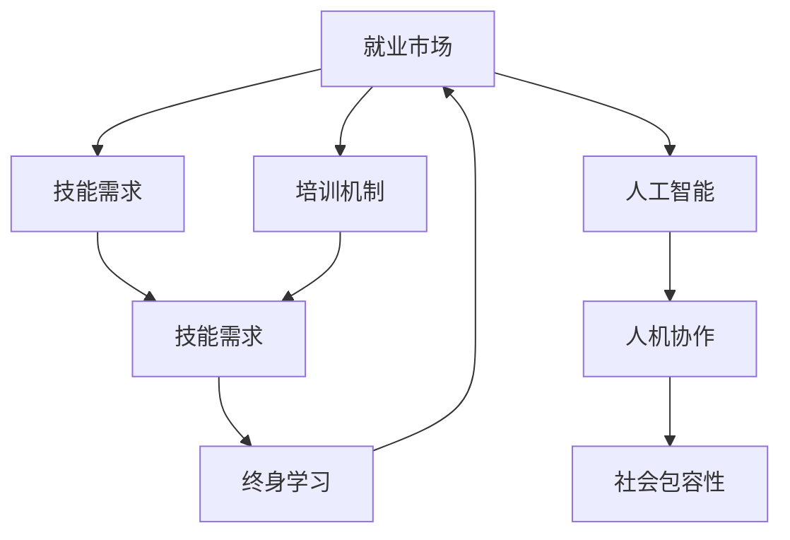

                 

# 人类计算：AI时代的未来就业和技能培训

在人工智能(AI)技术不断发展的今天，传统的工作场景正经历着翻天覆地的变化。自动化、智能化的工具和方法，极大地提高了生产效率，但同时也引发了一系列关于未来就业和技能培训的思考。本文将从就业趋势、技能需求变化、培训机制等方面进行全面探讨，为AI时代的就业和技能培训提供有价值的参考。

## 1. 背景介绍

### 1.1 问题由来
随着AI技术的快速发展，越来越多的传统岗位面临被自动化替代的风险。从简单的数据录入到复杂的决策制定，许多工作被机器和算法所取代。这些变化不仅影响劳动市场的供需关系，也对人类社会结构产生了深远影响。

### 1.2 问题核心关键点
当前，AI对就业市场的影响主要体现在以下几个方面：
1. 自动化取代低技能岗位：重复性、规律性的工作如流水线操作、客户服务等，容易被自动化工具所替代。
2. 技术岗位需求增加：数据科学家、AI工程师、机器学习专家等高技能岗位的需求激增。
3. 知识技能迭代加速：AI技术日新月异，从业者需要不断学习和适应新技术。
4. 人机协作岗位出现：AI技术的应用，如智能客服、智能诊断等，促使更多岗位变为人机协作的形态。

这些问题引发了关于AI时代就业和技能培训的广泛讨论。如何应对AI带来的就业变化，是社会、企业和教育机构共同面临的挑战。

## 2. 核心概念与联系

### 2.1 核心概念概述

为更好地理解AI时代就业和技能培训的现状和未来趋势，本节将介绍几个密切相关的核心概念：

- **就业市场**：由各类行业和企业组成，供需双方在市场规律下动态平衡的劳动市场。
- **技能需求**：各行业对岗位所需技能和知识的要求，包括技术技能、软技能等。
- **培训机制**：教育和培训机构为满足市场对技能需求而提供的课程、项目和资源。
- **终身学习**：倡导个人在职业生涯中持续学习新技能，适应技术变革的观念。
- **人工智能**：模拟人类智能行为的计算机技术，包括机器学习、深度学习等。
- **人机协作**：AI与人类在任务执行和决策制定中的协同工作模式。
- **社会包容性**：确保技术变革带来的就业机会和技能培训，能够惠及所有人群，缩小数字鸿沟。

这些概念之间的逻辑关系可以通过以下Mermaid流程图来展示：



这个流程图展示了一组概念之间的联系：

1. 就业市场通过技能需求影响培训机制。
2. 培训机制提供满足技能需求的教育资源。
3. 终身学习推动个人适应技能需求的变化。
4. 人工智能技术驱动技能需求的变化。
5. 人机协作模式改变了就业市场对技能的需求。
6. 社会包容性确保技能培训机会的公平性。

这些概念共同构成了AI时代就业和技能培训的复杂生态系统，需要多方共同努力才能达到均衡。

## 3. 核心算法原理 & 具体操作步骤
### 3.1 算法原理概述

AI时代就业和技能培训的优化，本质上是一个优化问题，目标是在有限的教育资源下，最大化满足市场对技能的需求。其核心算法流程如下：

1. **技能需求调研**：通过问卷调查、市场分析等方式，了解各行业对技能的需求，确定优先培训的技能。
2. **培训资源匹配**：根据技能需求，匹配合适的培训课程、项目和资源，确保培训内容与市场需求相符。
3. **培训效果评估**：使用技能评估测试、实际工作表现等方式，评估培训效果，识别改进空间。
4. **反馈与优化**：根据评估结果，调整培训内容、方法、资源等，不断优化培训机制。

这一算法流程的核心思想是通过持续的调研、匹配、评估和优化，实现培训机制与市场需求的动态对齐。

### 3.2 算法步骤详解

以下是详细的算法步骤：

1. **技能需求调研**：
   - 设计问卷，涵盖各行业和岗位对技能的需求。
   - 分析行业报告和市场数据，了解技术趋势和人才缺口。
   - 通过专家访谈、企业调研等方式，深入了解特定行业的技能需求。

2. **培训资源匹配**：
   - 根据调研结果，筛选并推荐合适的培训资源。
   - 设计培训课程和项目，确保内容覆盖技能需求。
   - 与教育机构和企业合作，提供多样化的培训形式。

3. **培训效果评估**：
   - 设计技能评估测试，评估培训效果。
   - 收集企业反馈，了解培训成果在实际工作中的应用情况。
   - 使用数据分析工具，量化评估培训效果的指标。

4. **反馈与优化**：
   - 根据评估结果，识别培训内容和方法的不足。
   - 调整培训内容，引入新的教学方法和工具。
   - 与行业专家和企业合作，优化培训机制，确保培训的有效性和持续性。

### 3.3 算法优缺点

AI时代就业和技能培训的优化算法具有以下优点：
1. **系统性**：通过调研和匹配，系统性地满足市场需求，避免了盲目培训。
2. **动态性**：通过持续的评估和优化，确保培训机制与市场需求动态对齐。
3. **灵活性**：利用多样化的培训资源和形式，满足不同人群的需求。
4. **效果显著**：通过科学评估，确保培训的有效性，提升就业市场对技能的匹配度。

同时，该算法也存在一定的局限性：
1. **数据获取难度**：技能需求调研和市场分析需要大量的数据，获取难度较大。
2. **资源匹配复杂**：技能需求多样，培训资源丰富，匹配过程较为复杂。
3. **反馈滞后**：培训效果的反馈和调整过程较为耗时，需要较长的周期。
4. **成本较高**：持续的调研、评估和优化需要较大的资金和人力资源投入。

尽管存在这些局限性，但通过科学合理的规划和执行，该算法仍能为AI时代的就业和技能培训提供有效的指导和支持。

### 3.4 算法应用领域

AI时代就业和技能培训的优化算法，在以下几个领域有着广泛的应用：

1. **高等教育**：通过科学的调研和评估，优化课程设置，提高毕业生就业竞争力。
2. **职业教育**：为职业培训机构和企业提供技能培训方案，提升员工技能水平。
3. **企业培训**：帮助企业制定系统化的培训计划，提升整体员工技能水平。
4. **终身学习平台**：利用在线学习资源和评估工具，提供个性化学习路径和反馈。
5. **社会教育项目**：为弱势群体提供技能培训机会，促进社会包容性和公平性。

这些领域的应用展示了AI时代就业和技能培训的多样性，为社会提供了一个多层次、多角度的解决方案。

## 4. 数学模型和公式 & 详细讲解 & 举例说明
### 4.1 数学模型构建

为了更好地理解AI时代就业和技能培训的优化算法，本节将使用数学语言对其进行描述。

假设就业市场中有 $N$ 个岗位，每个岗位对 $K$ 种技能的需求 $D_i=(d_{i1},d_{i2},...,d_{ik})$。设培训机构提供 $M$ 种培训资源，每种资源提供 $L$ 种技能 $R_j=(r_{j1},r_{j2},...,r_{jl})$。目标是最大化满足市场需求的技能 $S=(s_1,s_2,...,s_k)$，同时最小化培训资源的消耗 $C$。

目标函数为：
$$
\maximize \sum_{i=1}^N \sum_{j=1}^M \min_{1 \leq l \leq L} \min_{1 \leq k \leq K} I(d_{ik}=r_{jl})
$$
$$
\minimize \sum_{j=1}^M c_j
$$

其中 $c_j$ 为第 $j$ 种培训资源的价格。

约束条件包括：
1. 每门技能需求和每项培训资源的匹配情况：
$$
\sum_{j=1}^M \min_{1 \leq l \leq L} \min_{1 \leq k \leq K} I(d_{ik}=r_{jl}) = S_k \quad \forall 1 \leq k \leq K
$$
2. 每项培训资源的使用次数：
$$
\sum_{i=1}^N \min_{1 \leq j \leq M} \min_{1 \leq l \leq L} \min_{1 \leq k \leq K} I(d_{ik}=r_{jl}) \leq C_j \quad \forall 1 \leq j \leq M
$$

### 4.2 公式推导过程

为了解决上述优化问题，我们可以使用整数规划等数学方法。一种简单有效的求解方法是使用启发式算法，如线性规划、动态规划等。这里以线性规划为例，进行公式推导：

1. **目标函数**：
$$
\maximize \sum_{i=1}^N \sum_{j=1}^M \min_{1 \leq l \leq L} \min_{1 \leq k \leq K} I(d_{ik}=r_{jl})
$$
转换为对偶问题：
$$
\minimize \sum_{j=1}^M y_j c_j
$$
$$
s.t. \sum_{i=1}^N \sum_{k=1}^K x_{ik} d_{ik} \geq \sum_{j=1}^M \sum_{l=1}^L y_{jl} r_{jl} \quad \forall 1 \leq l \leq L
$$
$$
0 \leq x_{ik} \leq 1, 0 \leq y_{jl} \leq c_j/C_j
$$

2. **约束条件**：
$$
\sum_{j=1}^M \min_{1 \leq l \leq L} \min_{1 \leq k \leq K} I(d_{ik}=r_{jl}) = S_k \quad \forall 1 \leq k \leq K
$$
$$
\sum_{i=1}^N \min_{1 \leq j \leq M} \min_{1 \leq l \leq L} \min_{1 \leq k \leq K} I(d_{ik}=r_{jl}) \leq C_j \quad \forall 1 \leq j \leq M
$$

### 4.3 案例分析与讲解

以下是一个具体的案例分析：

假设某城市有 $N=1000$ 个岗位，每个岗位需要 $K=3$ 种技能：编程、数据分析、项目管理。设培训机构提供 $M=3$ 种培训资源：在线课程、面授课程、实战项目。每种资源提供 $L=2$ 种技能：基础编程、高级编程、数据科学、机器学习。

需求为：
- 编程需求 $d_{11}=1$，$d_{12}=1$
- 数据分析需求 $d_{21}=1$
- 项目管理需求 $d_{31}=1$

价格为：
- 在线课程 $c_1=1000$
- 面授课程 $c_2=2000$
- 实战项目 $c_3=5000$

求解该问题的线性规划模型，可以得到最优的培训资源分配方案。通过调整培训资源的使用比例，可以最大化满足市场需求，同时最小化培训成本。

## 5. 项目实践：代码实例和详细解释说明
### 5.1 开发环境搭建

在进行项目实践前，我们需要准备好开发环境。以下是使用Python进行线性规划求解的环境配置流程：

1. 安装Anaconda：从官网下载并安装Anaconda，用于创建独立的Python环境。

2. 创建并激活虚拟环境：
```bash
conda create -n linprog-env python=3.8 
conda activate linprog-env
```

3. 安装线性规划库：
```bash
pip install scipy
```

4. 安装优化算法库：
```bash
pip install cvxpy
```

5. 安装可视化库：
```bash
pip install matplotlib
```

完成上述步骤后，即可在`linprog-env`环境中开始项目实践。

### 5.2 源代码详细实现

我们以线性规划为例，使用Python进行求解。

首先，定义技能需求和培训资源：

```python
import numpy as np
from scipy.optimize import linprog

# 技能需求
skills = np.array([[1, 1], [1, 0], [0, 1]])

# 培训资源
resources = np.array([[1, 1], [0, 1], [0, 0]])
```

然后，定义目标函数和约束条件：

```python
# 目标函数系数
coefs = np.array([1000, 2000, 5000])

# 约束条件系数
constraints = np.array([[1, 0, 0], [1, 1, 0], [1, 0, 1]])

# 约束条件右侧常数
rhs = np.array([2, 1, 1])
```

接着，求解线性规划问题：

```python
result = linprog(coefs, A_ub=constraints, b_ub=rhs, bounds=[(0, None), (0, None), (0, None)])
print(result)
```

最后，输出最优解：

```python
# 输出最优解
print("最优解：", result.x)
print("最优值：", result.fun)
```

以上就是使用Python进行线性规划求解的完整代码实现。

### 5.3 代码解读与分析

让我们再详细解读一下关键代码的实现细节：

1. **技能需求和培训资源**：
   - `skills` 表示技能需求矩阵，每一列表示一种技能的需求。
   - `resources` 表示培训资源矩阵，每一列表示一种资源提供的技能。

2. **目标函数和约束条件**：
   - `coefs` 表示目标函数系数向量，即每种培训资源的价格。
   - `constraints` 表示约束条件矩阵，每一行表示一种约束条件。
   - `rhs` 表示约束条件右侧的常数值向量。

3. **求解线性规划问题**：
   - `linprog` 函数接受目标函数系数、约束条件矩阵、约束条件右侧常数等参数，返回最优解。
   - `result` 包含最优解向量、最优值、迭代信息等。

通过代码实现，我们可以直观地看到线性规划求解的过程，理解其数学原理和实际应用。

## 6. 实际应用场景
### 6.1 就业市场优化

就业市场优化是AI时代技能培训的重要应用场景。通过优化培训资源分配，可以在有限的教育资源下，最大化满足市场需求，提高就业匹配度和就业率。

例如，某教育培训机构面临大量编程、数据分析、机器学习等课程的报名需求，但资源有限。通过线性规划模型，可以计算出最优的课程设置比例，最大化覆盖市场需求，同时避免资源浪费。

### 6.2 职业院校培训

职业院校在培养学生技能方面面临着多样化的需求。通过技能需求调研和培训资源匹配，职业院校可以设计更加符合市场需求的课程体系，提升学生的就业竞争力。

例如，某职业院校面向IT行业开设了多个专业，包括软件开发、数据科学、人工智能等。通过调研市场需求，确定技能需求和培训资源，设计合理的课程体系，使学生掌握实际所需的技能，顺利进入IT行业。

### 6.3 企业员工培训

企业可以根据员工技能需求和培训资源，设计个性化的培训计划，提升员工技能水平，增强企业竞争力。

例如，某科技公司有大量数据分析、算法优化等技术岗位的需求，但员工的技能水平参差不齐。通过技能调研和培训匹配，公司可以设计针对性的培训课程，使员工快速提升技能，满足岗位需求。

### 6.4 社会教育项目

社会教育项目旨在为弱势群体提供技能培训，促进社会公平和包容性。通过科学的技能需求调研和培训资源匹配，可以为弱势群体提供有针对性的培训，提升其就业竞争力。

例如，某社会教育机构面向低收入家庭提供编程、英语等技能的培训课程。通过调研市场需求和员工技能，设计合理的培训课程，使学员掌握实用技能，顺利进入职场。

## 7. 工具和资源推荐
### 7.1 学习资源推荐

为了帮助开发者系统掌握AI时代就业和技能培训的理论基础和实践技巧，这里推荐一些优质的学习资源：

1. **《机器学习实战》系列书籍**：由著名数据科学家Tom Mitchell撰写，涵盖了机器学习的基础理论和应用实践，适合入门学习。
2. **Coursera《深度学习专项课程》**：由斯坦福大学Andrew Ng教授主讲，系统介绍深度学习的理论和实践，包含大量实际案例。
3. **Kaggle竞赛平台**：提供丰富的机器学习竞赛和项目，助力开发者提升实战能力。
4. **edX《人工智能基础》课程**：由哈佛大学主讲，介绍人工智能的基本概念和应用，适合各类学生和从业者。
5. **GitHub代码仓库**：搜索和分享开源机器学习项目，提升学习效率和质量。

通过对这些资源的学习实践，相信你一定能够快速掌握AI时代就业和技能培训的精髓，并用于解决实际的就业问题。

### 7.2 开发工具推荐

高效的开发离不开优秀的工具支持。以下是几款用于AI时代就业和技能培训开发的常用工具：

1. **Jupyter Notebook**：基于Python的开源笔记本工具，支持代码编写、数据分析和可视化的全过程。
2. **TensorFlow和PyTorch**：两大深度学习框架，提供强大的计算图功能和丰富的模型库，支持各类机器学习任务。
3. **Python数据分析库**：如Pandas、NumPy、Scikit-learn等，提供高效的数据处理和分析功能，支持技能调研和培训评估。
4. **数据可视化库**：如Matplotlib、Seaborn等，支持丰富的图表展示和数据分析。
5. **在线学习平台**：如Coursera、Udacity、edX等，提供各类在线课程和学习资源，助力开发者系统学习。

合理利用这些工具，可以显著提升AI时代就业和技能培训的开发效率，加快创新迭代的步伐。

### 7.3 相关论文推荐

AI时代就业和技能培训的发展源于学界的持续研究。以下是几篇奠基性的相关论文，推荐阅读：

1. **《机器学习：一种统计学习方法》**：由李航教授所著，系统介绍机器学习的基本理论和算法，适合理论学习。
2. **《深度学习》**：由Goodfellow、Bengio和Courville联合撰写，深入介绍深度学习的理论和实践，包含大量案例分析。
3. **《大规模在线开放课程MOOC》**：由Andrew Ng教授等人撰写，介绍在线教育平台的发展和应用，适合学习资源推荐。
4. **《基于机器学习的人力资源管理系统》**：研究如何利用机器学习技术，优化人力资源管理，提升员工技能和效率。
5. **《AI时代终身学习系统的设计》**：研究如何构建终身学习平台，为个人提供持续学习的机会和资源。

这些论文代表了大语言模型微调技术的发展脉络。通过学习这些前沿成果，可以帮助研究者把握学科前进方向，激发更多的创新灵感。

## 8. 总结：未来发展趋势与挑战
### 8.1 总结

本文对AI时代就业和技能培训的优化问题进行了全面系统的探讨。首先阐述了就业市场变化和技能需求的变化趋势，明确了技能培训的重要性和紧迫性。其次，从优化算法流程和具体实现，详细讲解了就业和技能培训的数学模型和步骤。最后，通过实际应用场景，展示了AI时代就业和技能培训的多样性和实践潜力。

通过本文的系统梳理，可以看到，AI时代就业和技能培训的优化算法和实践，不仅有助于提高教育和企业的效率，还能促进社会公平和包容性。AI技术的快速发展，给传统行业带来了深刻变革，同时也带来了巨大的挑战和机遇。面对这些变化，社会各界需要共同努力，制定科学合理的培训机制，推动AI技术在更多领域的落地应用。

### 8.2 未来发展趋势

展望未来，AI时代就业和技能培训将呈现以下几个发展趋势：

1. **个性化培训**：通过数据分析和个性化推荐，为每个人提供量身定制的技能培训方案。
2. **在线教育平台**：在线教育平台将成为主要的学习渠道，提供大规模、低成本的技能培训。
3. **终身学习**：终身学习将成为常态，推动学习者不断适应技术变化，提升职业竞争力。
4. **社会包容性**：技能培训将惠及更多弱势群体，促进社会公平和包容性。
5. **技术融合**：AI技术将与更多传统行业结合，推动各领域的数字化转型。

这些趋势凸显了AI时代就业和技能培训的广阔前景。通过科学的培训机制和高效的学习平台，我们可以最大化利用AI技术的优势，推动社会的持续发展和进步。

### 8.3 面临的挑战

尽管AI时代就业和技能培训的发展前景广阔，但在实施过程中仍面临诸多挑战：

1. **教育资源不足**：培训资源的数量和质量仍然难以满足日益增长的需求。
2. **技能匹配难度**：技能需求和培训资源的匹配复杂，需要更多的数据分析和算法支持。
3. **培训效果评估**：技能培训的效果难以量化，评估过程较为复杂。
4. **技术落地障碍**：AI技术的应用需要与实际工作场景结合，落地难度较大。
5. **社会公平性**：技能培训的普及需要考虑社会公平性，避免数字鸿沟扩大。

这些挑战需要社会各界共同努力，通过政策引导、技术创新和资源优化，逐步克服。只有不断优化培训机制，才能让AI技术更好地服务于社会，提升整体生产力水平。

### 8.4 研究展望

面对AI时代就业和技能培训的挑战，未来的研究需要在以下几个方面寻求新的突破：

1. **大数据驱动的技能需求调研**：利用大数据技术，实时分析技能需求变化，及时调整培训内容。
2. **多模态培训资源设计**：融合多种培训资源，提升培训效果和多样化。
3. **智能化培训平台开发**：开发基于AI的智能培训平台，提供个性化推荐和动态调整功能。
4. **跨领域技能整合**：将不同领域的技能进行整合，形成更加全面、多功能的培训课程。
5. **社会包容性培训项目**：为弱势群体提供更多技能培训机会，缩小数字鸿沟。

这些研究方向将推动AI时代就业和技能培训的不断发展，为社会的可持续发展提供重要支持。通过不断的技术创新和实践探索，相信我们能够构建更加公平、包容、高效的学习生态系统，引领社会向更加智能化的方向迈进。

## 9. 附录：常见问题与解答

**Q1：AI时代技能培训的重要性体现在哪些方面？**

A: AI时代技能培训的重要性主要体现在以下几个方面：
1. **适应技术变革**：AI技术的快速发展，对传统技能提出了新的要求，技能培训是适应技术变革的关键。
2. **提升就业竞争力**：通过技能培训，提升从业者的技能水平，增强就业竞争力，满足市场需求。
3. **促进社会包容性**：为弱势群体提供技能培训，促进社会公平和包容性，缩小数字鸿沟。
4. **推动产业升级**：通过技能培训，推动各行业数字化转型，提升整体生产力水平。

**Q2：AI时代如何制定科学的培训机制？**

A: AI时代制定科学的培训机制，需要考虑以下几个关键点：
1. **技能需求调研**：通过问卷调查、市场分析等方式，了解各行业对技能的需求。
2. **培训资源匹配**：根据技能需求，匹配合适的培训课程和资源，确保培训内容与市场需求相符。
3. **培训效果评估**：使用技能评估测试、实际工作表现等方式，评估培训效果，识别改进空间。
4. **反馈与优化**：根据评估结果，调整培训内容、方法、资源等，不断优化培训机制。

**Q3：AI时代如何提升技能培训的效率？**

A: AI时代提升技能培训的效率，需要利用以下手段：
1. **数据驱动**：利用大数据技术，实时分析技能需求变化，及时调整培训内容。
2. **个性化推荐**：通过数据分析和个性化推荐，为每个人提供量身定制的技能培训方案。
3. **在线教育平台**：在线教育平台将成为主要的学习渠道，提供大规模、低成本的技能培训。
4. **智能化培训平台**：开发基于AI的智能培训平台，提供个性化推荐和动态调整功能。
5. **社会参与**：鼓励社会各界共同参与技能培训，提供更多的资源和支持。

**Q4：AI时代如何确保技能培训的社会公平性？**

A: 确保AI时代技能培训的社会公平性，需要从以下几个方面努力：
1. **政策引导**：政府应制定相关政策，鼓励企业和社会机构提供技能培训，特别是针对弱势群体。
2. **资源优化**：优化培训资源分配，确保每个人都能获得公平的培训机会。
3. **技术普及**：通过在线教育平台和智能培训工具，让更多人享受到AI技术的红利。
4. **社会监督**：建立社会监督机制，确保培训过程的透明和公正。

这些措施将有助于提升技能培训的社会公平性，确保每个人都有机会通过技能培训提升自身竞争力。

**Q5：AI时代技能培训面临的最大挑战是什么？**

A: AI时代技能培训面临的最大挑战主要包括：
1. **教育资源不足**：培训资源的数量和质量仍然难以满足日益增长的需求。
2. **技能匹配难度**：技能需求和培训资源的匹配复杂，需要更多的数据分析和算法支持。
3. **培训效果评估**：技能培训的效果难以量化，评估过程较为复杂。
4. **技术落地障碍**：AI技术的应用需要与实际工作场景结合，落地难度较大。
5. **社会公平性**：技能培训的普及需要考虑社会公平性，避免数字鸿沟扩大。

这些挑战需要社会各界共同努力，通过政策引导、技术创新和资源优化，逐步克服。只有不断优化培训机制，才能让AI技术更好地服务于社会，提升整体生产力水平。

---

作者：禅与计算机程序设计艺术 / Zen and the Art of Computer Programming

