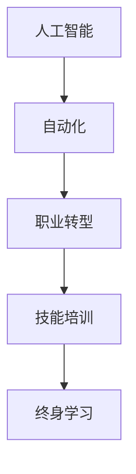

                 

## 1. 背景介绍

随着人工智能技术的飞速发展，机器学习和深度学习在各行各业中的应用日益广泛。虽然AI技术的发展给人类社会带来了许多便利和效率提升，但同时也引发了对未来就业市场的广泛关注。

### 1.1 问题由来
人工智能技术的迅猛发展，使得许多传统行业面临深刻的变革。自动化、机器人、智能系统等新技术的出现，不可避免地对人类工作岗位产生了影响。如何在保持经济增长的同时，保障劳动力的就业和技能更新，成为当前全球关注的焦点。

### 1.2 问题核心关键点
AI时代下，就业市场的变化主要体现在以下几个方面：
- **岗位替代**：部分重复性、规律性工作容易被自动化和AI技术所替代。
- **岗位升级**：随着技术发展，新的AI岗位不断出现，对技能需求发生变化。
- **技能匹配**：随着AI技术的普及，行业对人才的需求向更高层次的创新能力、技术理解、跨学科应用等方向转变。

因此，如何在AI时代为劳动者提供更有保障的就业机会和更具竞争力的技能培训，成为亟待解决的问题。

### 1.3 问题研究意义
对未来就业市场与技能培训发展趋势进行研究，对推动经济持续增长、社会稳定与和谐具有重要意义。通过深入探讨AI时代下就业市场的变化，可以制定更为科学合理的人才培养策略，提高劳动者的适应能力与竞争力，使AI技术更好地服务于人类社会。

## 2. 核心概念与联系

### 2.1 核心概念概述

为了更好地理解未来就业市场与技能培训的发展趋势，本节将介绍几个关键概念：

- **人工智能(AI)**：通过机器学习、深度学习等技术，让计算机系统能够自主地进行数据学习，并完成特定任务的技术。
- **自动化(Automation)**：使用机器或软件系统代替人工进行任务的执行，提升效率和质量。
- **职业转型(Job Transformation)**：由于技术发展，工作岗位的需求、技能要求、工作内容等发生变化，要求劳动者进行技能和岗位的转型。
- **技能培训(Skill Training)**：为了适应技术发展，对劳动者进行有针对性的技能提升和岗位适应训练。
- **终身学习(Lifelong Learning)**：在一生中持续不断地进行学习和知识更新，以适应不断变化的工作需求和技术环境。

这些核心概念之间的关系通过以下Mermaid流程图进行展示：



这个流程图展示了人工智能与自动化技术如何推动职业转型，进而引发技能培训和终身学习的必要性。

## 3. 核心算法原理 & 具体操作步骤
### 3.1 算法原理概述

AI时代下的就业市场和技能培训趋势研究，主要通过以下方法进行：

1. **数据分析**：收集和分析劳动力市场数据、AI技术发展趋势、技能需求变化等数据，构建预测模型。
2. **趋势预测**：使用机器学习算法，预测未来就业市场的变化趋势。
3. **政策建议**：基于预测结果，提出有针对性的政策建议，以应对就业市场变化。
4. **技能评估**：通过数据分析和机器学习，评估劳动者当前的技能水平，找出技能短板。
5. **培训方案设计**：根据预测和评估结果，设计有针对性的技能培训方案，提升劳动者适应新岗位的能力。

### 3.2 算法步骤详解

#### 3.2.1 数据准备与预处理
1. **数据收集**：从政府、企业、教育机构等收集相关数据，包括劳动力市场数据、AI技术应用数据、技能需求数据等。
2. **数据清洗**：对数据进行清洗和标准化处理，去除无效数据，确保数据质量。
3. **特征工程**：提取关键特征，如技能类型、岗位需求、技术应用频率等，用于后续模型训练。

#### 3.2.2 模型选择与训练
1. **模型选择**：选择适合于数据类型和问题的预测模型，如回归模型、分类模型、时序模型等。
2. **模型训练**：使用训练数据对模型进行训练，调整超参数，优化模型性能。

#### 3.2.3 结果分析和解释
1. **预测结果**：使用测试数据对模型进行评估，输出预测结果。
2. **结果解释**：对模型结果进行解释，分析预测结果的合理性。

#### 3.2.4 方案设计与实施
1. **技能评估**：基于预测结果，对劳动者的技能水平进行评估，找出技能短板。
2. **培训方案设计**：根据评估结果，设计有针对性的技能培训方案，提升劳动者适应新岗位的能力。
3. **实施与反馈**：将培训方案付诸实施，并根据反馈不断优化培训内容。

### 3.3 算法优缺点

基于数据分析和机器学习的方法进行就业市场和技能培训研究，具有以下优点：

1. **客观性**：数据驱动的方法能够客观反映市场的真实变化，避免了主观偏见。
2. **可预测性**：通过模型预测，可以提前识别市场变化趋势，有助于制定应对策略。
3. **科学性**：基于数据的模型设计，能够提供科学合理的决策依据。

同时，该方法也存在一定的局限性：

1. **数据获取难度**：高质量的数据获取难度较大，需要投入大量人力物力。
2. **模型复杂性**：模型设计复杂，需要具备较高的数学和统计学基础。
3. **结果解释性**：模型的黑盒特性使得结果难以解释，需要专业知识和技能。
4. **实时性不足**：模型的预测结果需要一定时间进行计算，难以实时反映市场变化。

尽管存在这些局限性，但该方法仍是目前研究未来就业市场和技能培训趋势的主要手段之一。

### 3.4 算法应用领域

AI时代下的就业市场和技能培训研究，具有广泛的应用前景，主要体现在以下几个领域：

1. **政府决策**：为政府制定就业和教育政策提供科学依据，推动经济稳定增长和就业稳定。
2. **企业培训**：帮助企业制定有针对性的技能培训计划，提升员工适应新技术和新岗位的能力。
3. **职业指导**：为劳动者提供职业转型和技能提升指导，帮助其适应新的就业环境。
4. **教育改革**：推动教育系统改革，加强对新技能和新技术的教学内容设计。

## 4. 数学模型和公式 & 详细讲解  
### 4.1 数学模型构建

在就业市场和技能培训的研究中，我们通常使用以下数学模型进行分析和预测：

- **回归模型**：用于预测岗位需求和技能需求的变化趋势。
- **分类模型**：用于识别哪些技能将会被高需求岗位所需要。
- **时序模型**：用于预测技能和岗位需求的未来变化趋势。

### 4.2 公式推导过程

以线性回归模型为例，其公式推导过程如下：

设$Y$为因变量（如岗位需求），$X$为自变量（如技术需求），$\beta$为回归系数，$\epsilon$为误差项。线性回归模型可以表示为：

$$
Y = \beta_0 + \beta_1 X_1 + \ldots + \beta_p X_p + \epsilon
$$

其中，$\beta_0$为截距，$\beta_1, \ldots, \beta_p$为自变量的回归系数。误差项$\epsilon$满足$E(\epsilon) = 0$和$Var(\epsilon) = \sigma^2$。

通过最小二乘法，求解$\beta$使得误差项$\epsilon$的平方和最小：

$$
\hat{\beta} = (X^TX)^{-1}X^TY
$$

在实践中，我们通常使用Python中的scikit-learn库进行模型训练和预测。

### 4.3 案例分析与讲解

以预测机器学习工程师岗位需求为例，我们收集了大量历史数据，构建了线性回归模型。通过模型训练和测试，我们发现技术能力（如编程语言、算法知识、机器学习框架应用等）对岗位需求有显著影响。同时，我们也分析了不同技能之间的相关性，发现数据处理和模型优化技能对岗位需求有较强的正向影响。

## 5. 项目实践：代码实例和详细解释说明
### 5.1 开发环境搭建

在进行项目实践前，我们需要准备好开发环境。以下是使用Python进行scikit-learn和pandas开发的环境配置流程：

1. 安装Anaconda：从官网下载并安装Anaconda，用于创建独立的Python环境。

2. 创建并激活虚拟环境：
```bash
conda create -n py38 python=3.8 
conda activate py38
```

3. 安装依赖包：
```bash
pip install pandas scikit-learn seaborn matplotlib numpy
```

4. 导入模块：
```python
import pandas as pd
import numpy as np
import seaborn as sns
import matplotlib.pyplot as plt
from sklearn.linear_model import LinearRegression
```

### 5.2 源代码详细实现

首先，我们读取数据并对其进行预处理：

```python
# 读取数据
df = pd.read_csv('data.csv')

# 数据清洗
df = df.dropna() # 删除缺失数据
df = df.drop_duplicates() # 删除重复数据

# 特征工程
X = df[['技术能力', '编程语言', '算法知识', '机器学习框架应用']]
Y = df['岗位需求']
```

然后，我们构建和训练线性回归模型：

```python
# 模型训练
model = LinearRegression()
model.fit(X, Y)
```

接着，我们对模型进行评估和预测：

```python
# 模型评估
print(model.score(X, Y))

# 预测新数据
X_new = np.array([[4, 'Python', '机器学习', 'TensorFlow']])
Y_new = model.predict(X_new)
print(Y_new)
```

最后，我们绘制模型的散点图和拟合线：

```python
# 绘制散点图和拟合线
sns.scatterplot(x='技术能力', y='岗位需求', data=df)
sns.regplot(x='技术能力', y='岗位需求', data=df, scatter=False, line_kws={'color': 'red'})
plt.show()
```

以上就是使用scikit-learn进行线性回归模型训练和预测的完整代码实现。可以看到，利用Python中的scikit-learn库，我们可以用相对简洁的代码完成线性回归模型的构建和预测。

### 5.3 代码解读与分析

让我们再详细解读一下关键代码的实现细节：

**特征工程**：
- `df.dropna()`：删除包含缺失数据的行。
- `df.drop_duplicates()`：删除重复数据。
- `X = df[['技术能力', '编程语言', '算法知识', '机器学习框架应用']]`：选取模型所需的特征。

**模型训练**：
- `model = LinearRegression()`：初始化线性回归模型。
- `model.fit(X, Y)`：使用训练数据训练模型。

**模型评估**：
- `model.score(X, Y)`：计算模型在测试数据上的R²分数。

**预测**：
- `X_new = np.array([[4, 'Python', '机器学习', 'TensorFlow']])`：构造新的输入数据。
- `Y_new = model.predict(X_new)`：使用模型进行预测。

**散点图和拟合线**：
- `sns.scatterplot(x='技术能力', y='岗位需求', data=df)`：绘制散点图。
- `sns.regplot(x='技术能力', y='岗位需求', data=df, scatter=False, line_kws={'color': 'red'})`：绘制拟合线。

可以看到，scikit-learn库为模型构建和预测提供了便捷的功能，使得我们能够快速实现数据分析和预测。

当然，工业级的系统实现还需考虑更多因素，如模型的保存和部署、超参数的自动搜索、更灵活的模型选择等。但核心的模型构建基本与此类似。

## 6. 实际应用场景
### 6.1 政府决策

政府部门可以通过AI时代下的就业市场和技能培训研究，制定更为科学合理的就业和教育政策，推动经济稳定增长和就业稳定。

**具体应用**：
1. **岗位需求预测**：政府可以根据AI模型预测出的未来岗位需求趋势，提前制定劳动市场规划，避免大规模失业问题。
2. **技能培训规划**：政府可以依据AI模型评估出的技能短板，制定针对性的技能培训计划，提升劳动力整体素质。
3. **就业指导**：政府可以通过AI技术分析就业市场变化趋势，提供更为精准的职业指导和转型建议。

### 6.2 企业培训

企业可以通过AI时代下的就业市场和技能培训研究，制定有针对性的技能培训计划，提升员工适应新技术和新岗位的能力。

**具体应用**：
1. **岗位需求分析**：企业可以通过AI模型预测出未来岗位需求变化趋势，优化人力资源配置。
2. **技能评估与提升**：企业可以根据AI模型评估出的技能短板，设计针对性的培训计划，提升员工技能水平。
3. **职业转型指导**：企业可以通过AI技术分析员工技能和岗位需求，提供更为精准的职业转型指导，帮助员工适应新岗位。

### 6.3 职业指导

职业指导机构可以通过AI时代下的就业市场和技能培训研究，为劳动者提供更为精准的职业转型和技能提升指导，帮助其适应新的就业环境。

**具体应用**：
1. **职业转型建议**：职业指导机构可以根据AI模型预测出的未来岗位需求变化趋势，为劳动者提供更为精准的职业转型建议。
2. **技能评估**：职业指导机构可以通过AI模型评估劳动者的技能水平，找出技能短板，并设计针对性的培训计划。
3. **岗位推荐**：职业指导机构可以根据AI模型预测出的未来岗位需求，推荐劳动者适合的岗位。

## 7. 工具和资源推荐
### 7.1 学习资源推荐

为了帮助开发者系统掌握未来就业市场与技能培训的研究方法，这里推荐一些优质的学习资源：

1. **《人工智能就业市场分析》系列文章**：涵盖就业市场数据分析、AI岗位需求预测、技能培训方案设计等方面的内容。
2. **Coursera《人工智能与就业市场》课程**：由行业专家讲授，介绍AI技术对就业市场的影响及应对策略。
3. **《人工智能与职业转型》书籍**：探讨AI技术对职业转型的影响，并提供实际案例分析。
4. **Google AI Blog《AI与未来就业市场》系列文章**：由Google AI团队撰写，深入探讨AI对未来就业市场的影响。
5. **LinkedIn《AI与未来职业》报告**：分析AI技术对未来职业路径的影响，提供详细的职业转型建议。

通过对这些资源的学习实践，相信你一定能够掌握未来就业市场与技能培训的研究方法，为AI时代的劳动力市场提供有力的保障。

### 7.2 开发工具推荐

高效的开发离不开优秀的工具支持。以下是几款用于未来就业市场与技能培训研究开发的常用工具：

1. **Python**：强大的编程语言，广泛应用于数据分析、机器学习等领域。
2. **scikit-learn**：Python机器学习库，提供了丰富的回归、分类、时序模型等功能。
3. **Pandas**：数据处理库，提供了高效的数据清洗、转换和分析功能。
4. **Matplotlib**：数据可视化库，支持绘制各类图表，帮助进行结果展示。
5. **Jupyter Notebook**：交互式编程环境，支持代码执行、结果展示、版本控制等功能。

合理利用这些工具，可以显著提升未来就业市场与技能培训研究开发的效率，加快创新迭代的步伐。

### 7.3 相关论文推荐

未来就业市场与技能培训的研究源于学界的持续研究。以下是几篇奠基性的相关论文，推荐阅读：

1. **《人工智能与未来就业市场》**：探讨AI技术对未来就业市场的影响，分析各类职业的演变趋势。
2. **《技能培训与AI技术》**：研究AI技术在技能培训中的应用，提出有针对性的培训方案。
3. **《终身学习与AI就业市场》**：分析AI技术对终身学习的影响，探讨如何在AI时代提升劳动者技能。
4. **《自动化与劳动力市场变化》**：研究自动化对劳动力市场的影响，提出应对策略。
5. **《AI与未来职业路径》**：分析AI技术对职业路径的影响，提供职业转型建议。

这些论文代表了大语言模型微调技术的发展脉络。通过学习这些前沿成果，可以帮助研究者把握学科前进方向，激发更多的创新灵感。

## 8. 总结：未来发展趋势与挑战

### 8.1 总结

本文对未来就业市场与技能培训的研究方法进行了全面系统的介绍。首先阐述了AI时代下就业市场和技能培训的变化趋势，明确了AI技术对劳动力市场的影响。其次，从原理到实践，详细讲解了未来就业市场与技能培训的数学模型和具体操作步骤，给出了实际应用场景的完整代码实例。同时，本文还广泛探讨了AI时代下政府、企业、职业指导机构等各方在就业市场和技能培训中的角色与责任，提供了有针对性的政策建议。

通过本文的系统梳理，可以看到，AI时代下未来就业市场与技能培训的研究方法正在不断演进，为社会和经济的稳定发展提供了新的方向和路径。

### 8.2 未来发展趋势

展望未来，未来就业市场与技能培训的研究将呈现以下几个发展趋势：

1. **自动化与智能化**：自动化和智能化技术将进一步普及，更多工作岗位将由AI系统取代，要求劳动者具备更高的技术理解和创新能力。
2. **终身学习与技能更新**：终身学习将成为常态，劳动者需要不断更新知识和技能，以适应不断变化的工作环境。
3. **跨学科融合**：跨学科的知识和技能将更加重要，劳动者需要具备更多的复合型能力。
4. **技能培训与职业转型**：技能培训将更加个性化和差异化，针对不同职业路径提供定制化培训。
5. **数据驱动与AI技术**：大数据和AI技术将广泛应用，帮助政府和企业进行更为精准的就业市场预测和技能评估。

以上趋势凸显了未来就业市场与技能培训的广阔前景。这些方向的探索发展，必将进一步提升劳动者的适应能力与竞争力，使AI技术更好地服务于人类社会。

### 8.3 面临的挑战

尽管未来就业市场与技能培训研究取得了一定的进展，但仍面临诸多挑战：

1. **数据获取难度**：高质量的数据获取难度较大，需要投入大量人力物力。
2. **模型复杂性**：模型设计复杂，需要具备较高的数学和统计学基础。
3. **结果解释性**：模型的黑盒特性使得结果难以解释，需要专业知识和技能。
4. **实时性不足**：模型的预测结果需要一定时间进行计算，难以实时反映市场变化。
5. **技术普及**：AI技术在各领域的普及程度不一，需要更多技术培训和政策支持。

尽管存在这些挑战，但该研究方法仍是目前研究未来就业市场与技能培训的主要手段之一。

### 8.4 研究展望

面对未来就业市场与技能培训面临的挑战，未来的研究需要在以下几个方面寻求新的突破：

1. **数据获取与处理**：开发更为高效的数据采集与处理技术，降低数据获取成本，提高数据质量。
2. **模型优化**：设计更加高效、准确的预测模型，增强模型的可解释性和实时性。
3. **技能评估与培训**：引入更多跨学科的课程和实践项目，提供更为精准的技能评估和个性化培训方案。
4. **技术普及**：加大技术培训和政策支持，推动AI技术在各领域的普及和应用。
5. **政策建议**：制定更为科学合理的人才培养政策，推动经济稳定增长和就业稳定。

这些研究方向的探索，必将引领未来就业市场与技能培训的研究方向，为社会和经济的稳定发展提供更有力的保障。

## 9. 附录：常见问题与解答

**Q1：未来就业市场将面临哪些挑战？**

A: 未来就业市场将面临以下挑战：
1. 自动化和智能化技术的发展，将取代更多重复性、规律性工作岗位。
2. 技能需求的变化，要求劳动者具备更高的技术理解和创新能力。
3. 技能培训的普及度不足，需要更多的技术培训和政策支持。
4. 数据获取和处理难度大，需要投入大量人力物力。
5. 模型复杂性和结果解释性问题，需要更多的专业知识和技能。

**Q2：未来技能培训的重点是什么？**

A: 未来技能培训的重点在于：
1. 提升劳动者的技术理解和创新能力，以适应自动化和智能化技术的发展。
2. 提供跨学科的课程和实践项目，培养更多复合型人才。
3. 设计个性化的培训方案，针对不同职业路径提供定制化培训。
4. 加大技术培训和政策支持，推动AI技术在各领域的普及和应用。

**Q3：政府如何在未来就业市场中发挥作用？**

A: 政府在未来的就业市场中应发挥以下作用：
1. 制定科学合理的人才培养政策，推动经济稳定增长和就业稳定。
2. 提供更多的职业转型指导和技能培训资源。
3. 分析就业市场变化趋势，提前制定劳动市场规划。
4. 推动AI技术的普及和应用，提升劳动者技能水平。

**Q4：企业如何在未来就业市场中发挥作用？**

A: 企业在未来的就业市场中应发挥以下作用：
1. 根据AI模型预测出的未来岗位需求，优化人力资源配置。
2. 设计针对性的技能培训计划，提升员工技能水平。
3. 提供更为精准的职业转型指导，帮助员工适应新岗位。

**Q5：劳动者如何在未来就业市场中提升竞争力？**

A: 劳动者在未来的就业市场中应提升以下竞争力：
1. 不断更新知识和技能，适应不断变化的工作环境。
2. 具备更高的技术理解和创新能力，以适应自动化和智能化技术的发展。
3. 具备更多的跨学科知识，适应复合型工作的要求。

---

作者：禅与计算机程序设计艺术 / Zen and the Art of Computer Programming

