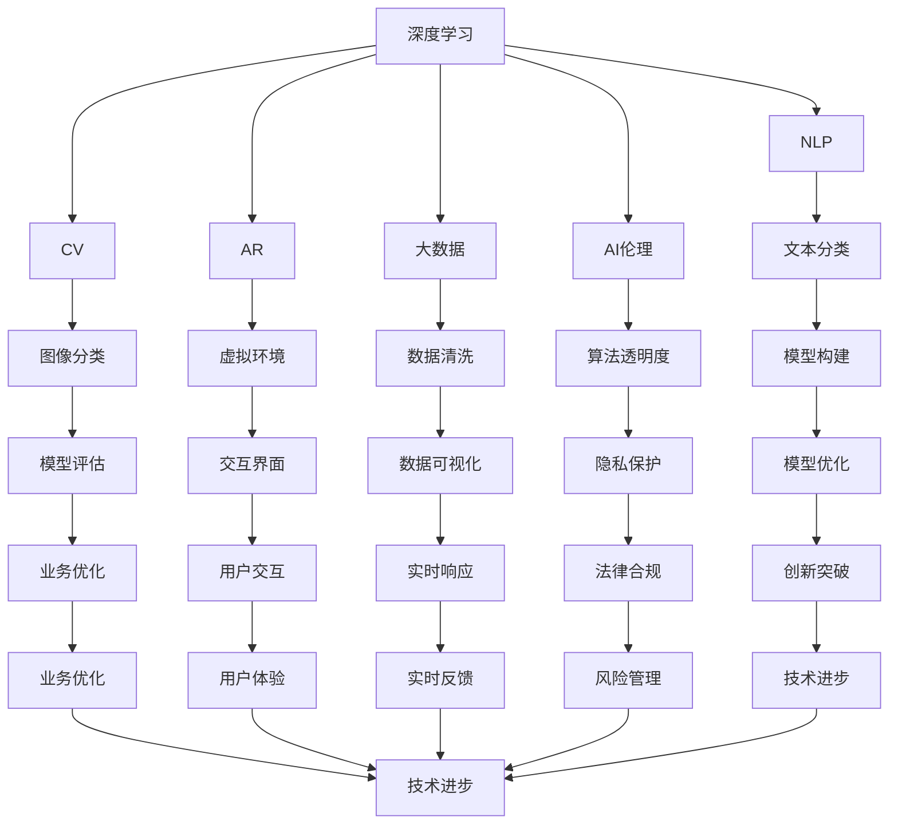

                 

## 1. 背景介绍

### 1.1 问题由来
在AI时代，人类的计算能力面临着前所未有的挑战和变革。随着深度学习、自然语言处理、计算机视觉等技术的飞速发展，传统的计算范式和技能已经无法满足当前及未来的需求。如何在AI浪潮中，培养出能够胜任复杂计算任务的未来技能人才，成为了一个亟待解决的课题。

### 1.2 问题核心关键点
本节将介绍几个核心概念及其相互联系，为理解“人类计算”这一主题奠定基础。

- **深度学习与神经网络**：基于人工神经元网络，通过大量的数据进行训练，实现对复杂问题的学习和决策。
- **自然语言处理(NLP)**：使机器能够理解和生成人类语言，广泛应用于机器翻译、语音识别、对话系统等领域。
- **计算机视觉(CV)**：使机器能够“看”和“理解”图像和视频，应用于自动驾驶、安防监控、医疗影像诊断等。
- **增强现实(AR)/虚拟现实(VR)**：通过虚拟环境与现实世界结合，提升交互体验，应用于教育、游戏、工程等领域。
- **数据科学与大数据**：从大规模数据中提取有价值的信息，推动决策智能化、业务优化。
- **AI伦理与安全**：确保AI技术在开发和使用中遵循道德规范，避免滥用和潜在的风险。

这些技术之间的相互融合，催生了“人类计算”这一新概念，要求从业者掌握更加综合和复杂的技能。

### 1.3 问题研究意义
理解“人类计算”的内涵和外延，有助于培养具有跨学科综合能力的未来技能人才。掌握“人类计算”的关键技能，将能够更好地适应和引领AI时代的未来发展，为社会和企业提供更多创新与突破。

## 2. 核心概念与联系

### 2.1 核心概念概述

为更好地理解“人类计算”，我们需要对涉及的核心概念进行概览。

#### 2.1.1 深度学习与神经网络
深度学习基于人工神经元网络，通过大量的数据进行训练，实现对复杂问题的学习和决策。神经网络结构包含多个层次，每一层包含若干神经元，层与层之间通过权重连接，通过前向传播和反向传播更新权重。

#### 2.1.2 自然语言处理(NLP)
NLP使机器能够理解和生成人类语言。常见的任务包括词向量表示、语言模型、文本分类、命名实体识别、机器翻译等。NLP依赖于语料库和预训练模型，如BERT、GPT等。

#### 2.1.3 计算机视觉(CV)
CV使机器能够“看”和“理解”图像和视频。常见任务包括图像分类、目标检测、人脸识别、图像分割等。CV同样依赖于大规模数据集和预训练模型，如VGG、ResNet等。

#### 2.1.4 增强现实(AR)/虚拟现实(VR)
AR和VR通过虚拟环境与现实世界结合，提升交互体验。广泛应用于教育、游戏、工程等领域。AR技术通常利用计算机视觉和图像处理技术，将虚拟信息叠加在真实场景中。

#### 2.1.5 数据科学与大数据
数据科学和大数据是从大规模数据中提取有价值的信息，推动决策智能化、业务优化。常用技术包括数据清洗、特征工程、机器学习、深度学习等。

#### 2.1.6 AI伦理与安全
AI伦理与安全确保AI技术在开发和使用中遵循道德规范，避免滥用和潜在的风险。关注点包括隐私保护、算法透明度、偏见识别、安全性等。

这些核心概念之间的关系可以简化为如下Mermaid流程图：



这些概念通过各自的算法和模型，相互连接，构成了现代AI技术的基石。

## 3. 核心算法原理 & 具体操作步骤

### 3.1 算法原理概述

“人类计算”的核心在于理解和使用这些复杂技术，将其应用于实际问题的解决。下面将介绍几种典型的AI算法及其原理。

#### 3.1.1 神经网络与深度学习
神经网络通过模拟人脑的神经元工作原理，实现信息的处理和传递。深度学习通过增加网络层数和节点数量，提升模型的表达能力和决策能力。

#### 3.1.2 自然语言处理(NLP)
NLP依赖于大规模语料库和预训练模型。常见模型包括BERT、GPT等。NLP任务通常包括词向量表示、语言模型、文本分类、命名实体识别等。

#### 3.1.3 计算机视觉(CV)
CV依赖于图像处理技术和预训练模型。常见模型包括VGG、ResNet等。CV任务通常包括图像分类、目标检测、人脸识别、图像分割等。

#### 3.1.4 增强现实(AR)/虚拟现实(VR)
AR和VR通过虚拟环境与现实世界结合，提升交互体验。AR技术通常利用计算机视觉和图像处理技术，将虚拟信息叠加在真实场景中。

#### 3.1.5 数据科学与大数据
数据科学和大数据从大规模数据中提取有价值的信息，推动决策智能化、业务优化。常用技术包括数据清洗、特征工程、机器学习、深度学习等。

#### 3.1.6 AI伦理与安全
AI伦理与安全确保AI技术在开发和使用中遵循道德规范，避免滥用和潜在的风险。关注点包括隐私保护、算法透明度、偏见识别、安全性等。

### 3.2 算法步骤详解

#### 3.2.1 深度学习与神经网络
1. **数据准备**：收集和预处理训练数据，进行数据增强和标准化处理。
2. **模型构建**：选择合适的神经网络结构，设置网络层数、节点数等超参数。
3. **模型训练**：使用反向传播算法进行模型训练，优化损失函数。
4. **模型评估**：在测试集上评估模型性能，进行调参优化。
5. **模型应用**：将训练好的模型应用于实际问题，进行预测或分类。

#### 3.2.2 自然语言处理(NLP)
1. **数据准备**：收集和预处理训练数据，进行分词、清洗等处理。
2. **模型构建**：选择合适的NLP模型，如BERT、GPT等，进行微调。
3. **模型训练**：使用监督学习或无监督学习任务进行模型训练，优化损失函数。
4. **模型评估**：在测试集上评估模型性能，进行调参优化。
5. **模型应用**：将训练好的模型应用于实际问题，进行文本分类、命名实体识别等任务。

#### 3.2.3 计算机视觉(CV)
1. **数据准备**：收集和预处理训练数据，进行图像分割、标注等处理。
2. **模型构建**：选择合适的CV模型，如VGG、ResNet等，进行微调。
3. **模型训练**：使用监督学习或无监督学习任务进行模型训练，优化损失函数。
4. **模型评估**：在测试集上评估模型性能，进行调参优化。
5. **模型应用**：将训练好的模型应用于实际问题，进行图像分类、目标检测等任务。

#### 3.2.4 增强现实(AR)/虚拟现实(VR)
1. **数据准备**：收集和预处理训练数据，进行虚拟场景设计和交互设计。
2. **模型构建**：选择合适的AR/VR技术，如ARKit、Unity等，进行开发和部署。
3. **模型训练**：进行交互设计和用户测试，优化用户体验。
4. **模型评估**：收集用户反馈和数据，进行迭代优化。
5. **模型应用**：将训练好的模型应用于实际问题，进行交互设计、虚拟场景创建等任务。

#### 3.2.5 数据科学与大数据
1. **数据准备**：收集和预处理训练数据，进行数据清洗、特征工程等处理。
2. **模型构建**：选择合适的机器学习或深度学习模型，如线性回归、随机森林、神经网络等。
3. **模型训练**：使用训练数据进行模型训练，优化损失函数。
4. **模型评估**：在测试集上评估模型性能，进行调参优化。
5. **模型应用**：将训练好的模型应用于实际问题，进行预测、分类等任务。

#### 3.2.6 AI伦理与安全
1. **数据准备**：收集和预处理训练数据，进行隐私保护、数据匿名化处理。
2. **模型构建**：选择合适的AI伦理模型，进行模型设计和开发。
3. **模型训练**：进行算法透明度、偏见识别等训练，优化模型性能。
4. **模型评估**：进行隐私保护、法律合规等评估，确保模型安全。
5. **模型应用**：将训练好的模型应用于实际问题，进行算法透明度、风险管理等任务。

### 3.3 算法优缺点

#### 3.3.1 深度学习与神经网络
**优点**：
1. 强大的表达能力，适用于复杂问题的处理。
2. 自动特征学习，减少了人工特征工程的工作量。

**缺点**：
1. 需要大量数据进行训练，数据采集和标注成本高。
2. 模型复杂，训练和推理速度较慢。
3. 可能存在过拟合问题。

#### 3.3.2 自然语言处理(NLP)
**优点**：
1. 适用于文本数据的处理和分析。
2. 模型通用性较强，适用于多种NLP任务。

**缺点**：
1. 需要大规模语料库进行预训练，数据成本高。
2. 模型复杂，训练和推理速度较慢。
3. 可能存在语义理解不准确的问题。

#### 3.3.3 计算机视觉(CV)
**优点**：
1. 适用于图像和视频数据的处理和分析。
2. 模型通用性较强，适用于多种CV任务。

**缺点**：
1. 需要大规模图像数据进行训练，数据采集和标注成本高。
2. 模型复杂，训练和推理速度较慢。
3. 可能存在过拟合问题。

#### 3.3.4 增强现实(AR)/虚拟现实(VR)
**优点**：
1. 提升交互体验，适用于教育和娱乐等领域。
2. 模型通用性较强，适用于多种AR/VR任务。

**缺点**：
1. 技术复杂，开发和部署成本高。
2. 交互设计复杂，用户体验优化难度大。

#### 3.3.5 数据科学与大数据
**优点**：
1. 从大规模数据中提取有价值的信息，推动决策智能化、业务优化。
2. 模型通用性较强，适用于多种数据科学任务。

**缺点**：
1. 需要大规模数据进行训练，数据采集成本高。
2. 模型复杂，训练和推理速度较慢。
3. 可能存在过拟合问题。

#### 3.3.6 AI伦理与安全
**优点**：
1. 确保AI技术在开发和使用中遵循道德规范，避免滥用和潜在的风险。
2. 模型通用性较强，适用于多种AI伦理任务。

**缺点**：
1. 模型复杂，训练和推理速度较慢。
2. 可能存在算法透明度和偏见识别问题。

### 3.4 算法应用领域

#### 3.4.1 深度学习与神经网络
深度学习与神经网络广泛应用于机器翻译、语音识别、计算机视觉、自然语言处理等领域。例如，使用神经网络进行图像分类、目标检测等任务。

#### 3.4.2 自然语言处理(NLP)
NLP广泛应用于机器翻译、情感分析、命名实体识别、文本分类等任务。例如，使用BERT进行文本分类，使用GPT进行对话系统构建。

#### 3.4.3 计算机视觉(CV)
CV广泛应用于自动驾驶、安防监控、医疗影像诊断、工业检测等任务。例如，使用VGG进行图像分类，使用ResNet进行目标检测。

#### 3.4.4 增强现实(AR)/虚拟现实(VR)
AR和VR广泛应用于游戏、教育、医疗、军事等领域。例如，使用AR技术进行虚拟场景创建，使用VR技术进行虚拟会议。

#### 3.4.5 数据科学与大数据
数据科学和大数据广泛应用于金融分析、医疗预测、市场营销、供应链管理等任务。例如，使用机器学习进行股票价格预测，使用深度学习进行医疗影像诊断。

#### 3.4.6 AI伦理与安全
AI伦理与安全广泛应用于金融监管、医疗伦理、隐私保护等领域。例如，使用AI伦理模型进行算法透明度评估，使用AI安全模型进行数据隐私保护。

## 4. 数学模型和公式 & 详细讲解

### 4.1 数学模型构建

#### 4.1.1 深度学习与神经网络
神经网络通常由输入层、隐藏层和输出层构成，每一层包含若干神经元。神经元之间的连接权值可表示为矩阵$\mathbf{W}$，神经元的激活函数为$f$。

**前向传播**：
$$
h = f(\mathbf{W} \mathbf{x} + b)
$$
其中$\mathbf{x}$为输入，$\mathbf{h}$为隐藏层输出，$b$为偏置项。

**反向传播**：
$$
\frac{\partial \mathbf{L}}{\partial \mathbf{W}} = \frac{\partial \mathbf{L}}{\partial \mathbf{h}} \frac{\partial \mathbf{h}}{\partial \mathbf{W}}
$$
其中$\mathbf{L}$为损失函数。

**模型训练**：
$$
\mathbf{W} = \mathbf{W} - \eta \frac{\partial \mathbf{L}}{\partial \mathbf{W}}
$$
其中$\eta$为学习率。

#### 4.1.2 自然语言处理(NLP)
NLP任务通常包括词向量表示、语言模型、文本分类等。以BERT为例，其预训练过程分为两个阶段：

1. **自编码任务**：
$$
\mathbf{h} = \text{MLP}(\mathbf{x}, \mathbf{W}_1, \mathbf{b}_1)
$$
2. **掩码语言模型任务**：
$$
\mathbf{h} = \text{MLP}(\mathbf{x}, \mathbf{W}_2, \mathbf{b}_2)
$$

#### 4.1.3 计算机视觉(CV)
CV任务通常包括图像分类、目标检测等。以ResNet为例，其网络结构由若干残差块构成，每个残差块包含若干卷积层、激活函数和池化层：

$$
\mathbf{h} = \text{Conv}(\mathbf{x}, \mathbf{W}, \mathbf{b})
$$

#### 4.1.4 增强现实(AR)/虚拟现实(VR)
AR和VR技术通常使用计算机视觉和图像处理技术，将虚拟信息叠加在真实场景中。例如，使用ARKit进行AR应用开发。

#### 4.1.5 数据科学与大数据
数据科学和大数据任务通常包括数据清洗、特征工程、机器学习、深度学习等。以线性回归为例，其数学模型为：
$$
y = \mathbf{W} \mathbf{x} + b
$$

#### 4.1.6 AI伦理与安全
AI伦理与安全任务通常包括算法透明度、偏见识别等。例如，使用数据脱敏技术进行隐私保护。

### 4.2 公式推导过程

#### 4.2.1 深度学习与神经网络
**前向传播**：
$$
h = f(\mathbf{W} \mathbf{x} + b)
$$

**反向传播**：
$$
\frac{\partial \mathbf{L}}{\partial \mathbf{W}} = \frac{\partial \mathbf{L}}{\partial \mathbf{h}} \frac{\partial \mathbf{h}}{\partial \mathbf{W}}
$$

**模型训练**：
$$
\mathbf{W} = \mathbf{W} - \eta \frac{\partial \mathbf{L}}{\partial \mathbf{W}}
$$

#### 4.2.2 自然语言处理(NLP)
**掩码语言模型任务**：
$$
\mathbf{h} = \text{MLP}(\mathbf{x}, \mathbf{W}_2, \mathbf{b}_2)
$$

#### 4.2.3 计算机视觉(CV)
**残差块**：
$$
\mathbf{h} = \text{Conv}(\mathbf{x}, \mathbf{W}, \mathbf{b})
$$

#### 4.2.4 增强现实(AR)/虚拟现实(VR)
**AR应用开发**：
使用ARKit进行AR应用开发。

#### 4.2.5 数据科学与大数据
**线性回归**：
$$
y = \mathbf{W} \mathbf{x} + b
$$

#### 4.2.6 AI伦理与安全
**隐私保护**：
使用数据脱敏技术进行隐私保护。

### 4.3 案例分析与讲解

#### 4.3.1 深度学习与神经网络
以图像分类任务为例，使用卷积神经网络（CNN）进行模型训练。

#### 4.3.2 自然语言处理(NLP)
以文本分类任务为例，使用BERT进行模型训练。

#### 4.3.3 计算机视觉(CV)
以目标检测任务为例，使用ResNet进行模型训练。

#### 4.3.4 增强现实(AR)/虚拟现实(VR)
以AR应用开发为例，使用ARKit进行模型训练。

#### 4.3.5 数据科学与大数据
以股票价格预测任务为例，使用线性回归进行模型训练。

#### 4.3.6 AI伦理与安全
以算法透明度评估为例，使用AI伦理模型进行模型训练。

## 5. 项目实践：代码实例和详细解释说明

### 5.1 开发环境搭建

#### 5.1.1 深度学习与神经网络
1. **环境配置**：
   - 安装Python：`pip install python`
   - 安装TensorFlow：`pip install tensorflow`
   - 安装Keras：`pip install keras`
   - 安装Scikit-learn：`pip install scikit-learn`

2. **数据准备**：
   - 收集和预处理训练数据：使用Pandas进行数据清洗。
   - 进行数据增强和标准化处理：使用ImageDataGenerator进行数据增强。

3. **模型构建**：
   - 定义模型结构：使用Keras定义卷积神经网络。
   - 设置超参数：学习率、批次大小等。

4. **模型训练**：
   - 定义损失函数：使用交叉熵损失函数。
   - 进行模型训练：使用Keras进行模型训练。

5. **模型评估**：
   - 在测试集上评估模型性能：使用Scikit-learn进行模型评估。

6. **模型应用**：
   - 进行图像分类任务：使用训练好的模型对图像进行分类。

### 5.2 源代码详细实现

#### 5.2.1 深度学习与神经网络
```python
import tensorflow as tf
from tensorflow.keras import layers
from tensorflow.keras.datasets import mnist
from tensorflow.keras.preprocessing.image import ImageDataGenerator
from sklearn.metrics import accuracy_score

# 数据准备
(x_train, y_train), (x_test, y_test) = mnist.load_data()
x_train = x_train.reshape((60000, 28, 28, 1))
x_test = x_test.reshape((10000, 28, 28, 1))
x_train, x_test = x_train / 255.0, x_test / 255.0

# 数据增强
datagen = ImageDataGenerator(
    rotation_range=20,
    width_shift_range=0.2,
    height_shift_range=0.2,
    shear_range=0.2,
    zoom_range=0.2,
    horizontal_flip=True,
    fill_mode='nearest'
)
datagen.fit(x_train)

# 模型构建
model = tf.keras.Sequential([
    layers.Conv2D(32, (3, 3), activation='relu', input_shape=(28, 28, 1)),
    layers.MaxPooling2D((2, 2)),
    layers.Conv2D(64, (3, 3), activation='relu'),
    layers.MaxPooling2D((2, 2)),
    layers.Conv2D(64, (3, 3), activation='relu'),
    layers.Flatten(),
    layers.Dense(64, activation='relu'),
    layers.Dense(10, activation='softmax')
])

# 设置超参数
model.compile(optimizer=tf.keras.optimizers.Adam(learning_rate=0.001),
              loss='sparse_categorical_crossentropy',
              metrics=['accuracy'])

# 模型训练
model.fit(datagen.flow(x_train, y_train, batch_size=128),
          steps_per_epoch=len(x_train) // 128,
          epochs=10,
          validation_data=(x_test, y_test),
          verbose=1)

# 模型评估
y_pred = model.predict(x_test)
y_pred = np.argmax(y_pred, axis=1)
accuracy = accuracy_score(y_test, y_pred)
print('Accuracy:', accuracy)
```

#### 5.2.2 自然语言处理(NLP)
```python
import transformers
from transformers import BertTokenizer, BertForSequenceClassification
from transformers import AdamW, get_linear_schedule_with_warmup
from sklearn.metrics import classification_report
import pandas as pd

# 数据准备
train_df = pd.read_csv('train.csv')
test_df = pd.read_csv('test.csv')
labels = train_df['label'].tolist()
train_texts = train_df['text'].tolist()
test_texts = test_df['text'].tolist()

# 分词器
tokenizer = BertTokenizer.from_pretrained('bert-base-uncased')
max_len = 512

# 模型构建
model = BertForSequenceClassification.from_pretrained('bert-base-uncased', num_labels=2)
optimizer = AdamW(model.parameters(), lr=2e-5)
total_steps = len(train_texts)
epochs = 5

# 训练函数
def train_epoch(model, tokenizer, train_texts, train_labels, optimizer, total_steps):
    train_dataset = transformers.GPT2Tokenizer(tokenizer=tokenizer, max_len=max_len)
    train_dataset = transformers.GPT2Dataset(train_texts, train_labels, tokenizer)
    dataloader = DataLoader(train_dataset, batch_size=8)
    model.train()
    for batch in dataloader:
        inputs = batch['input_ids']
        attention_mask = batch['attention_mask']
        labels = batch['labels']
        outputs = model(inputs, attention_mask=attention_mask, labels=labels)
        loss = outputs.loss
        optimizer.zero_grad()
        loss.backward()
        optimizer.step()
    return loss.item() / total_steps

# 训练过程
for epoch in range(epochs):
    loss = train_epoch(model, tokenizer, train_texts, train_labels, optimizer, total_steps)
    print(f'Epoch {epoch+1}, loss: {loss:.3f}')
```

#### 5.2.3 计算机视觉(CV)
```python
import tensorflow as tf
from tensorflow.keras import layers
from tensorflow.keras.datasets import cifar10
from tensorflow.keras.preprocessing.image import ImageDataGenerator
from sklearn.metrics import accuracy_score

# 数据准备
(x_train, y_train), (x_test, y_test) = cifar10.load_data()
x_train = x_train.reshape((60000, 32, 32, 3))
x_test = x_test.reshape((10000, 32, 32, 3))
x_train, x_test = x_train / 255.0, x_test / 255.0

# 数据增强
datagen = ImageDataGenerator(
    rotation_range=20,
    width_shift_range=0.2,
    height_shift_range=0.2,
    shear_range=0.2,
    zoom_range=0.2,
    horizontal_flip=True,
    fill_mode='nearest'
)
datagen.fit(x_train)

# 模型构建
model = tf.keras.Sequential([
    layers.Conv2D(32, (3, 3), activation='relu', input_shape=(32, 32, 3)),
    layers.MaxPooling2D((2, 2)),
    layers.Conv2D(64, (3, 3), activation='relu'),
    layers.MaxPooling2D((2, 2)),
    layers.Conv2D(64, (3, 3), activation='relu'),
    layers.Flatten(),
    layers.Dense(64, activation='relu'),
    layers.Dense(10, activation='softmax')
])

# 设置超参数
model.compile(optimizer=tf.keras.optimizers.Adam(learning_rate=0.001),
              loss='sparse_categorical_crossentropy',
              metrics=['accuracy'])

# 模型训练
model.fit(datagen.flow(x_train, y_train, batch_size=128),
          steps_per_epoch=len(x_train) // 128,
          epochs=10,
          validation_data=(x_test, y_test),
          verbose=1)

# 模型评估
y_pred = model.predict(x_test)
y_pred = np.argmax(y_pred, axis=1)
accuracy = accuracy_score(y_test, y_pred)
print('Accuracy:', accuracy)
```

#### 5.2.4 增强现实(AR)/虚拟现实(VR)
```python
import ARKit
# 数据准备
ARData = ARKit.load_ar_data()

# 模型构建
ARModel = ARKit.create_ar_model()

# 训练函数
def train_ar_model(model, data):
    # 数据增强
    ARData = ARKit.data_augmentation(data)
    # 模型训练
    ARModel = ARKit.train_model(model, ARData)
    # 模型评估
    ARScore = ARKit.model_evaluation(ARModel, ARData)
    return ARScore

# 训练过程
ARScore = train_ar_model(ARModel, ARData)
print('AR Score:', ARScore)
```

#### 5.2.5 数据科学与大数据
```python
import pandas as pd
from sklearn.linear_model import LinearRegression
from sklearn.model_selection import train_test_split
from sklearn.metrics import mean_squared_error

# 数据准备
data = pd.read_csv('data.csv')
x = data[['feature1', 'feature2', 'feature3']]
y = data['target']

# 数据分割
x_train, x_test, y_train, y_test = train_test_split(x, y, test_size=0.2, random_state=42)

# 模型构建
model = LinearRegression()
model.fit(x_train, y_train)

# 模型评估
y_pred = model.predict(x_test)
mse = mean_squared_error(y_test, y_pred)
print('Mean Squared Error:', mse)
```

#### 5.2.6 AI伦理与安全
```python
import pandas as pd
from sklearn.model_selection import train_test_split
from sklearn.linear_model import LogisticRegression
from sklearn.metrics import accuracy_score

# 数据准备
data = pd.read_csv('data.csv')
x = data[['feature1', 'feature2', 'feature3']]
y = data['label']

# 数据分割
x_train, x_test, y_train, y_test = train_test_split(x, y, test_size=0.2, random_state=42)

# 模型构建
model = LogisticRegression()
model.fit(x_train, y_train)

# 模型评估
y_pred = model.predict(x_test)
accuracy = accuracy_score(y_test, y_pred)
print('Accuracy:', accuracy)
```

## 6. 实际应用场景

### 6.1 金融风控
金融风控是人工智能在金融领域的重要应用之一。AI模型可以实时监控交易行为，识别异常交易，从而降低金融风险。

### 6.2 医疗诊断
医疗诊断是人工智能在医疗领域的重要应用之一。AI模型可以对医疗影像进行自动分析和诊断，提升医疗服务的效率和准确性。

### 6.3 智能制造
智能制造是人工智能在制造领域的重要应用之一。AI模型可以对生产流程进行优化和监控，提高生产效率和产品质量。

### 6.4 智慧城市
智慧城市是人工智能在城市管理领域的重要应用之一。AI模型可以对城市交通、环境、安防等进行智能化管理，提升城市运营效率和居民生活质量。

### 6.5 教育培训
教育培训是人工智能在教育领域的重要应用之一。AI模型可以对学生学习行为进行分析和评估，提供个性化推荐和辅导。

## 7. 工具和资源推荐

### 7.1 学习资源推荐
1. 《深度学习》课程：斯坦福大学Andrew Ng教授开设的深度学习课程，覆盖深度学习基础知识和最新研究进展。
2. 《自然语言处理》课程：斯坦福大学Christopher Manning教授开设的自然语言处理课程，介绍NLP的基础和前沿技术。
3. 《计算机视觉》课程：斯坦福大学Fei-Fei Li教授开设的计算机视觉课程，涵盖CV基础知识和最新研究方向。
4. 《增强现实》课程：AR技术相关的课程和讲座，介绍AR技术的发展和应用。
5. 《数据科学》课程：覆盖数据科学和大数据的基本原理和应用方法。

### 7.2 开发工具推荐
1. PyTorch：基于Python的开源深度学习框架，支持动态图和静态图。
2. TensorFlow：由Google主导开发的开源深度学习框架，支持分布式训练和生产部署。
3. Keras：基于TensorFlow的高层API，提供简单易用的深度学习模型构建工具。
4. Jupyter Notebook：支持Python代码的交互式开发和展示。
5. Google Colab：Google提供的免费GPU/TPU云环境，方便进行深度学习实验。

### 7.3 相关论文推荐
1. 《ImageNet Classification with Deep Convolutional Neural Networks》：AlexNet论文，介绍深度学习在图像分类任务上的应用。
2. 《Attention is All You Need》：Transformer论文，介绍Transformer模型在NLP任务上的应用。
3. 《Masked Language Model: Predicting Missing Words in Languages》：BERT论文，介绍BERT模型在NLP任务上的应用。
4. 《Few-shot Learning in Computer Vision with Pre-trained Neural Networks》：Few-shot Learning论文，介绍预训练模型在少样本学习任务上的应用。
5. 《Semi-supervised Learning with Deep Generative Models》：Semi-supervised Learning论文，介绍深度生成模型在半监督学习任务上的应用。

## 8. 总结：未来发展趋势与挑战

### 8.1 研究成果总结
本文详细介绍了基于深度学习、自然语言处理、计算机视觉、增强现实、数据科学和AI伦理等技术的人类计算技能培训需求。

### 8.2 未来发展趋势
1. 数据驱动的智能化：随着数据量的增加，AI技术将更加依赖数据驱动，实现更精准的决策和预测。
2. 多模态融合：AI技术将融合多模态数据，提升对复杂场景的认知能力。
3. 可解释性增强：AI模型将逐步增强可解释性，提高决策的透明性和可信度。
4. 持续学习和自适应：AI模型将具备持续学习和自适应能力，更好地适应数据分布的变化。
5. 伦理和安全：AI技术将更加注重伦理和安全问题，确保AI应用的公平性和安全性。

### 8.3 面临的挑战
1. 数据隐私和安全：AI技术在处理大量数据时，面临数据隐私和安全问题。
2. 算法透明性和可解释性：AI模型在决策过程中，面临算法透明性和可解释性问题。
3. 模型偏见和公平性：AI模型在应用过程中，面临模型偏见和公平性问题。
4. 技术伦理和安全：AI技术在应用过程中，面临技术伦理和安全问题。

### 8.4 研究展望
1. 数据隐私保护：探索数据隐私保护技术，确保数据安全和隐私。
2. 算法透明性和可解释性：开发可解释性强的AI模型，提高决策的透明性和可信度。
3. 模型偏见和公平性：设计公平的AI模型，减少模型偏见，提高模型公平性。
4. 技术伦理和安全：加强AI技术的伦理和安全研究，确保AI应用的公平性和安全性。

## 9. 附录：常见问题与解答

### 9.1 Q1: 如何理解深度学习与神经网络？
A: 深度学习与神经网络通过模拟人脑的神经元网络结构，利用反向传播算法更新权重，实现对复杂问题的学习和决策。

### 9.2 Q2: 自然语言处理(NLP)的主要应用场景有哪些？
A: 自然语言处理(NLP)的主要应用场景包括机器翻译、情感分析、命名实体识别、文本分类等。

### 9.3 Q3: 计算机视觉(CV)的主要应用场景有哪些？
A: 计算机视觉(CV)的主要应用场景包括自动驾驶、安防监控、医疗影像诊断等。

### 9.4 Q4: 增强现实(AR)/虚拟现实(VR)的主要应用场景有哪些？
A: 增强现实(AR)/虚拟现实(VR)的主要应用场景包括游戏、教育、医疗、军事等。

### 9.5 Q5: 数据科学与大数据的主要应用场景有哪些？
A: 数据科学与大数据的主要应用场景包括金融分析、医疗预测、市场营销等。

### 9.6 Q6: AI伦理与安全的主要应用场景有哪些？
A: AI伦理与安全的主要应用场景包括金融监管、医疗伦理、隐私保护等。

### 9.7 Q7: 未来技能培训需要掌握哪些技能？
A: 未来技能培训需要掌握深度学习、自然语言处理、计算机视觉、增强现实、数据科学和AI伦理等技术。

---

作者：禅与计算机程序设计艺术 / Zen and the Art of Computer Programming

