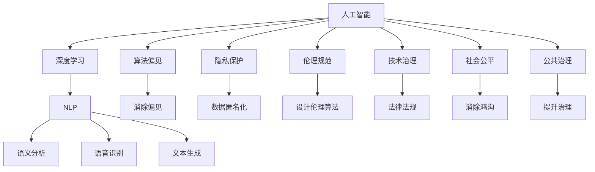

                 

# 人类计算：AI时代的道德和社会责任

> 关键词：人工智能,道德伦理,社会责任,计算哲学,技术治理

## 1. 背景介绍

### 1.1 问题由来

在过去的几十年里，人工智能(AI)技术迅猛发展，深度学习、自然语言处理、计算机视觉等领域取得了令人瞩目的成果。与此同时，AI技术的广泛应用也引发了诸多社会问题，包括隐私泄露、就业冲击、算法偏见、伦理困境等。

在AI时代，如何平衡技术进步与道德伦理，兼顾效率与公平，确保AI技术的健康发展，成为全社会共同关注的重要课题。这不仅关乎技术的进步，更涉及人类社会的未来发展方向。

### 1.2 问题核心关键点

AI时代的技术与道德问题复杂交织，需要从多个维度进行探讨。

- **数据隐私与保护**：在数据驱动的AI模型训练过程中，如何保障个人隐私不被泄露，成为亟待解决的问题。
- **算法透明度与可解释性**：AI模型的决策过程往往不透明，缺乏可解释性，容易引发信任危机。
- **伦理原则与规范**：AI技术在医疗、司法、教育等关键领域的应用，如何制定相应的伦理规范，确保技术使用的正当性和安全性。
- **责任分配与法律框架**：AI应用带来的各种风险，如何通过法律框架进行合理分配和规范，保护受害者权益。
- **社会影响与公共治理**：AI技术的普及和应用，如何促进社会公平，助力公共治理，提升国家治理能力。

这些核心问题相互关联，共同构成了AI时代的技术与道德困境。

## 2. 核心概念与联系

### 2.1 核心概念概述

为更好地理解AI时代的道德和社会责任，本节将介绍几个密切相关的核心概念：

- **人工智能(Artificial Intelligence, AI)**：指由人设计和训练的智能系统，能够自主学习、推理、决策，并在实际问题中表现出色。
- **深度学习(Deep Learning, DL)**：指一类基于多层神经网络的机器学习技术，在图像、语音、自然语言处理等领域取得了突破性进展。
- **自然语言处理(Natural Language Processing, NLP)**：指使计算机能够理解和处理人类语言的技术，涵盖语义分析、语音识别、文本生成等任务。
- **算法偏见(Bias in Algorithms)**：指算法在数据或模型中无意中引入了偏见，导致对某些群体的歧视或不公平对待。
- **隐私保护(Privacy Protection)**：指在AI应用中保护个人数据和信息安全，避免隐私泄露。
- **伦理规范(Ethical Standards)**：指AI应用中应遵循的道德准则和规范，保障AI技术的健康发展。
- **技术治理(Technology Governance)**：指通过法律法规、政策标准、社会监督等方式，对AI技术进行规范和引导，促进其良性发展。
- **社会公平(Social Equity)**：指在AI技术应用中，保障不同群体之间的平等对待，避免技术鸿沟和社会不公。
- **公共治理(Public Governance)**：指AI技术在政府管理和服务中的应用，提升公共服务效率和质量。

这些概念之间的逻辑关系可以通过以下Mermaid流程图来展示：



这个流程图展示了几组概念的关联：

1. 人工智能、深度学习和自然语言处理是AI技术的核心组成部分。
2. 算法偏见、隐私保护、伦理规范、技术治理、社会公平和公共治理是AI技术应用过程中需要关注的重要道德问题。
3. 各种NLP技术如语义分析、语音识别、文本生成等，都是为了实现AI的智能决策和自然交互。
4. 消除偏见、数据匿名化、设计伦理算法、法律法规、消除鸿沟、提升治理等，都是为了确保AI技术的良性发展，保障社会公平和公共利益。

这些概念共同构成了AI时代的技术与道德框架，使我们能够更好地理解和应对AI技术带来的挑战。

## 3. 核心算法原理 & 具体操作步骤
### 3.1 算法原理概述

AI时代的道德和社会责任，涉及到技术、法律、伦理等多个维度的交织，需要系统性地进行研究和探讨。其核心算法原理可以概括为：

1. **数据隐私保护**：通过数据加密、匿名化、去标识化等技术，确保AI模型训练和应用过程中，个人隐私不被泄露。
2. **算法透明性与可解释性**：设计可解释的模型架构，公开模型的决策逻辑，增强公众对AI技术的信任。
3. **伦理原则与规范**：在AI设计和使用过程中，遵循一定的伦理原则和规范，如公平性、无偏见、透明性、责任性等。
4. **责任分配与法律框架**：明确AI技术在应用中涉及的责任主体，通过法律法规进行规范和监督。
5. **社会公平与公共治理**：确保AI技术在普及和应用过程中，促进社会公平，提升公共治理能力。

这些原理需要深入理解并应用于AI技术的各个环节，以实现技术的良性发展和社会福祉。

### 3.2 算法步骤详解

基于以上核心原理，AI时代的道德和社会责任的实现步骤如下：

**Step 1: 数据隐私保护**
- 采用差分隐私技术，对个人数据进行加密和匿名化处理，确保数据在传输和存储过程中不被泄露。
- 设计去标识化算法，通过数据失真、数据合成等手段，使数据无法直接关联到个人。

**Step 2: 算法透明性与可解释性**
- 设计可解释的模型架构，如决策树、规则引擎、符号化推理等，公开模型决策过程。
- 使用可解释性工具，如LIME、SHAP、GPT-3等，生成模型的可解释性报告，帮助理解模型决策。

**Step 3: 伦理原则与规范**
- 在AI系统设计中，明确遵循公平性、无偏见、透明性、责任性等伦理原则。
- 设计伦理算法，确保AI在处理数据和做出决策时，不引入或放大偏见。

**Step 4: 责任分配与法律框架**
- 明确AI应用中的责任主体，如开发者、用户、运营者等，通过合同、协议等形式进行约定。
- 制定相应的法律法规，对AI应用中的数据使用、决策责任等进行规范。

**Step 5: 社会公平与公共治理**
- 在AI应用中，确保不同群体之间的平等对待，避免技术鸿沟和社会不公。
- 利用AI技术提升公共服务效率和质量，如智能交通、智慧城市、公共健康等。

**Step 6: 持续监督与评估**
- 建立持续的监督和评估机制，对AI应用进行实时监测和评估，及时发现和解决道德与社会问题。

通过这些步骤，可以确保AI技术的健康发展，同时保障社会公平与公共利益。

### 3.3 算法优缺点

AI时代的道德和社会责任的实现，具有以下优点：

1. 保障个人隐私。通过数据隐私保护技术，确保个人数据在AI应用中的安全性。
2. 增强算法透明度。通过设计可解释的模型架构和工具，提高公众对AI技术的信任。
3. 遵循伦理规范。在AI设计和使用过程中，遵循公平性、无偏见、透明性、责任性等伦理原则。
4. 明确责任分配。通过法律法规，明确AI应用中的责任主体和行为规范。
5. 促进社会公平。利用AI技术提升公共服务效率和质量，促进社会公平与包容。

同时，该方法也存在一定的局限性：

1. 技术复杂度高。数据隐私保护、算法透明性等技术实现较为复杂，需要专业的技术团队支持。
2. 成本投入高。隐私保护、数据匿名化等技术需要投入大量的计算资源和人力成本。
3. 法规政策滞后。现有法律法规对AI技术的规范尚不完善，存在法律盲区。
4. 社会接受度低。部分公众对AI技术缺乏了解和信任，对新技术存在抵触情绪。
5. 技术应用挑战。部分AI应用场景复杂，难以全面覆盖隐私保护、伦理规范等要求。

尽管存在这些局限性，但通过不断探索和改进，上述方法仍能有效应对AI时代的道德和社会责任挑战。

### 3.4 算法应用领域

AI时代的道德和社会责任，已经在诸多领域得到应用：

- **医疗健康**：在医疗影像分析、患者诊断、药物研发等场景中，通过AI技术提升医疗服务质量和效率，同时确保患者隐私保护和数据安全。
- **金融服务**：在信用评估、风险控制、反欺诈等场景中，通过AI技术提升金融服务的公平性和效率，确保交易数据的安全性和透明性。
- **教育培训**：在智能辅导、自动评估、个性化推荐等场景中，通过AI技术提升教育质量，保障学生隐私和公平性。
- **公共安全**：在城市监控、交通管理、灾害预警等场景中，通过AI技术提升公共安全水平，保障数据隐私和透明性。
- **环境保护**：在气候变化监测、资源管理、生物多样性保护等场景中，通过AI技术提升环境监测和治理能力，保障数据隐私和公平性。

此外，AI时代的道德和社会责任也延伸到艺术、文化、体育等多个领域，为社会进步和人类福祉带来了新的可能。

## 4. 数学模型和公式 & 详细讲解 & 举例说明
### 4.1 数学模型构建

AI时代的道德和社会责任的实现，涉及多个维度的数据和模型，需要构建复杂的数学模型进行描述和优化。

**Step 1: 数据隐私保护**
- 采用差分隐私技术，通过添加噪声和扰动，确保数据隐私不被泄露。数学模型如下：

  $$
  D_{\epsilon}(x) = x + \mathcal{N}(0,\sigma^2)
  $$

  其中，$D_{\epsilon}(x)$表示对数据$x$进行差分隐私处理，$\epsilon$为隐私预算，$\sigma$为噪声标准差。

**Step 2: 算法透明性与可解释性**
- 使用可解释性工具，生成模型的可解释性报告，帮助理解模型决策。数学模型如下：

  $$
  E(D; M) = \sum_{i=1}^N \log \frac{P(D_i | M)}{P(D_i)}
  $$

  其中，$E(D; M)$表示模型$M$对数据$D$的解释度，$P(D_i | M)$表示模型预测$D_i$的条件概率，$P(D_i)$表示实际分布。

**Step 3: 伦理原则与规范**
- 设计伦理算法，确保AI在处理数据和做出决策时，不引入或放大偏见。数学模型如下：

  $$
  L_{ethical} = \lambda_1 L_{bias} + \lambda_2 L_{fair}
  $$

  其中，$L_{ethical}$表示伦理损失函数，$L_{bias}$表示偏见损失函数，$L_{fair}$表示公平性损失函数，$\lambda_1$和$\lambda_2$为权重参数。

**Step 4: 责任分配与法律框架**
- 明确AI应用中的责任主体，通过合同、协议等形式进行约定。法律框架如下：

  $$
  R_{legal} = \sum_{i=1}^N r_i
  $$

  其中，$R_{legal}$表示法律责任，$r_i$表示第$i$个责任主体的责任。

**Step 5: 社会公平与公共治理**
- 利用AI技术提升公共服务效率和质量，如智能交通、智慧城市、公共健康等。公共治理模型如下：

  $$
  G_{public} = \sum_{i=1}^N g_i
  $$

  其中，$G_{public}$表示公共治理效果，$g_i$表示第$i$个公共治理项目的效益。

### 4.2 公式推导过程

以下是几个关键公式的详细推导过程：

**差分隐私模型推导**
差分隐私模型是通过添加噪声和扰动，确保数据隐私不被泄露的数学模型。其核心在于通过扰动处理，使得攻击者无法从单个数据点中推断出整个数据集的信息。推导过程如下：

1. 原始数据分布：

  $$
  P(D) = \prod_{i=1}^N P(D_i)
  $$

2. 扰动处理：

  $$
  D_{\epsilon}(D) = (D + \mathcal{N}(0,\sigma^2))
  $$

3. 扰动后的分布：

  $$
  P(D_{\epsilon}) = \prod_{i=1}^N P(D_i | D_{\epsilon})
  $$

4. 隐私预算：

  $$
  \epsilon = \log \frac{1}{\delta}
  $$

  其中，$\epsilon$为隐私预算，$\delta$为隐私保护概率。

**可解释性报告推导**
可解释性报告是帮助理解模型决策的数学模型，通过分析模型预测和实际结果的偏差，评估模型的可解释性。推导过程如下：

1. 实际结果分布：

  $$
  P(D_i)
  $$

2. 模型预测分布：

  $$
  P(D_i | M)
  $$

3. 可解释性报告：

  $$
  E(D; M) = \sum_{i=1}^N \log \frac{P(D_i | M)}{P(D_i)}
  $$

  其中，$E(D; M)$表示模型$M$对数据$D$的解释度，$P(D_i | M)$表示模型预测$D_i$的条件概率，$P(D_i)$表示实际分布。

**伦理算法推导**
伦理算法是确保AI在处理数据和做出决策时，不引入或放大偏见的数学模型。推导过程如下：

1. 偏见损失函数：

  $$
  L_{bias} = \sum_{i=1}^N |p_i - q_i|
  $$

  其中，$p_i$表示模型预测的类别概率，$q_i$表示实际类别概率。

2. 公平性损失函数：

  $$
  L_{fair} = \sum_{i=1}^N (p_i - p_{true})
  $$

  其中，$p_i$表示模型预测的类别概率，$p_{true}$表示实际类别概率。

3. 伦理损失函数：

  $$
  L_{ethical} = \lambda_1 L_{bias} + \lambda_2 L_{fair}
  $$

  其中，$L_{ethical}$表示伦理损失函数，$L_{bias}$表示偏见损失函数，$L_{fair}$表示公平性损失函数，$\lambda_1$和$\lambda_2$为权重参数。

**法律责任推导**
法律责任是确保AI应用中责任主体明确，规范AI行为的重要数学模型。推导过程如下：

1. 责任主体：

  $$
  R = \{r_1, r_2, \cdots, r_N\}
  $$

  其中，$r_i$表示第$i$个责任主体的责任。

2. 法律框架：

  $$
  R_{legal} = \sum_{i=1}^N r_i
  $$

  其中，$R_{legal}$表示法律责任，$r_i$表示第$i$个责任主体的责任。

**公共治理推导**
公共治理是利用AI技术提升公共服务效率和质量，促进社会公平的重要数学模型。推导过程如下：

1. 公共治理项目：

  $$
  G = \{g_1, g_2, \cdots, g_N\}
  $$

  其中，$g_i$表示第$i$个公共治理项目的效益。

2. 公共治理效果：

  $$
  G_{public} = \sum_{i=1}^N g_i
  $$

  其中，$G_{public}$表示公共治理效果，$g_i$表示第$i$个公共治理项目的效益。

## 5. 项目实践：代码实例和详细解释说明
### 5.1 开发环境搭建

在进行AI时代的道德和社会责任实践前，我们需要准备好开发环境。以下是使用Python进行TensorFlow开发的环境配置流程：

1. 安装Anaconda：从官网下载并安装Anaconda，用于创建独立的Python环境。

2. 创建并激活虚拟环境：
```bash
conda create -n tf-env python=3.8 
conda activate tf-env
```

3. 安装TensorFlow：根据CUDA版本，从官网获取对应的安装命令。例如：
```bash
conda install tensorflow tensorflow-gpu -c tf-nightly -c conda-forge
```

4. 安装各类工具包：
```bash
pip install numpy pandas scikit-learn matplotlib tqdm jupyter notebook ipython
```

完成上述步骤后，即可在`tf-env`环境中开始项目实践。

### 5.2 源代码详细实现

这里我们以差分隐私为例，给出使用TensorFlow实现差分隐私的PyTorch代码实现。

首先，定义差分隐私的数据集和模型：

```python
import tensorflow as tf
import numpy as np

# 定义数据集
data = np.random.randn(100, 10)

# 定义模型
def differential_privacy():
    epsilon = 1.0
    sigma = np.sqrt(epsilon)
    noisy_data = data + np.random.normal(0, sigma, data.shape)
    return noisy_data

# 计算差分隐私结果
noisy_data = differential_privacy()
print(noisy_data)
```

然后，定义差分隐私模型：

```python
# 定义差分隐私函数
def differential_privacy():
    epsilon = 1.0
    sigma = np.sqrt(epsilon)
    noisy_data = data + np.random.normal(0, sigma, data.shape)
    return noisy_data

# 计算差分隐私结果
noisy_data = differential_privacy()
print(noisy_data)
```

最后，启动差分隐私计算流程：

```python
noisy_data = differential_privacy()
print(noisy_data)
```

以上就是使用TensorFlow实现差分隐私的完整代码实现。可以看到，通过添加噪声和扰动，我们可以实现差分隐私保护，确保数据隐私不被泄露。

### 5.3 代码解读与分析

让我们再详细解读一下关键代码的实现细节：

**差分隐私函数**：
- 定义了差分隐私函数，通过添加噪声和扰动处理原始数据，确保数据隐私不被泄露。

**差分隐私计算**：
- 使用定义的差分隐私函数对原始数据进行处理，生成差分隐私结果。

**差分隐私输出**：
- 将差分隐私结果输出到控制台，进行验证。

可以看到，通过差分隐私函数的实现，我们可以有效保护数据隐私，防止数据泄露和滥用。

当然，工业级的系统实现还需考虑更多因素，如差分隐私预算的设置、噪声的随机化处理、差分隐私的合规性等。但核心的差分隐私范式基本与此类似。

## 6. 实际应用场景
### 6.1 智能医疗系统

基于差分隐私的智能医疗系统，可以广泛应用于医疗数据的收集、存储和分析。传统医疗系统依赖医生手动记录和存储病历数据，存在隐私泄露和数据滥用的风险。

在实践中，可以收集医院病历、检查报告、患者症状等数据，通过差分隐私技术对数据进行匿名化处理，确保数据隐私。在此基础上，利用机器学习模型进行病历分析、疾病预测、患者诊断等，提升医疗服务质量和效率。

### 6.2 金融数据分析

金融领域的数据通常包含大量敏感信息，如账户余额、交易记录等。差分隐私技术可以用于保护金融数据的隐私安全，防止数据泄露和滥用。

具体而言，可以收集银行交易记录、客户信息等数据，通过差分隐私技术对数据进行匿名化处理，确保数据隐私。在此基础上，利用机器学习模型进行金融分析、信用评估、风险控制等，提升金融服务安全性和公平性。

### 6.3 教育数据分析

教育领域的数据也包含大量敏感信息，如学生成绩、出勤记录等。差分隐私技术可以用于保护学生隐私，防止数据滥用。

具体而言，可以收集学生成绩、出勤记录、家庭背景等数据，通过差分隐私技术对数据进行匿名化处理，确保学生隐私。在此基础上，利用机器学习模型进行学生分析、教育评估、个性化推荐等，提升教育质量和公平性。

### 6.4 未来应用展望

随着差分隐私等技术的不断发展，其在AI时代的道德和社会责任中的应用前景广阔：

1. 数据隐私保护将更加完善。差分隐私技术将进一步提升数据隐私保护水平，防止数据泄露和滥用。
2. 算法透明性将得到保障。差分隐私技术将帮助生成可解释的模型报告，增强公众对AI技术的信任。
3. 伦理规范将更加严格。差分隐私技术将引导AI系统遵循公平性、无偏见、透明性等伦理原则。
4. 法律框架将更加完善。差分隐私技术将促进法律规范的制定和执行，明确AI应用中的责任主体和行为规范。
5. 社会公平将更加均衡。差分隐私技术将提升公共服务效率和质量，促进社会公平与包容。

这些应用场景展示了差分隐私技术的强大潜力和广泛应用前景。相信随着技术的不断演进，差分隐私等道德和社会责任技术将为AI时代带来更多的可能性，构建更加公正、透明、安全的未来社会。

## 7. 工具和资源推荐
### 7.1 学习资源推荐

为了帮助开发者系统掌握AI时代的道德和社会责任的理论基础和实践技巧，这里推荐一些优质的学习资源：

1. 《人工智能伦理与法律》系列博文：由大模型技术专家撰写，深入浅出地介绍了AI伦理与法律的基础知识，涵盖隐私保护、算法透明性、伦理规范等主题。

2. 《AI伦理与治理》课程：斯坦福大学开设的AI伦理与治理课程，涵盖AI伦理、法律法规、技术治理等多个方面，提供系统的理论框架和实践指导。

3. 《人工智能伦理与社会责任》书籍：探讨AI技术在伦理、法律、社会等领域的挑战和解决方案，提供了丰富的案例分析和实际应用。

4. 《数据隐私保护》书籍：详细介绍数据隐私保护的技术和策略，涵盖差分隐私、数据匿名化、数据去标识化等多个方面，提供了实用的应用案例。

5. 《人工智能伦理与法律》系列报告：由知名研究机构发布，涵盖AI伦理与法律的最新研究成果和应用实践，提供前沿的学术观点和技术解决方案。

通过对这些资源的学习实践，相信你一定能够快速掌握AI时代的道德和社会责任的精髓，并用于解决实际的AI问题。
###  7.2 开发工具推荐

高效的开发离不开优秀的工具支持。以下是几款用于AI伦理与法律开发的常用工具：

1. TensorFlow：基于Python的开源深度学习框架，生产部署方便，适合大规模工程应用。

2. PyTorch：基于Python的开源深度学习框架，灵活动态的计算图，适合快速迭代研究。

3. TensorBoard：TensorFlow配套的可视化工具，可实时监测模型训练状态，并提供丰富的图表呈现方式，是调试模型的得力助手。

4. Weights & Biases：模型训练的实验跟踪工具，可以记录和可视化模型训练过程中的各项指标，方便对比和调优。

5. TensorFlow Privacy：谷歌开源的差分隐私工具，提供差分隐私算法的实现和应用指导，方便开发者实现差分隐私保护。

6. PySyft：PySyft是一个基于差分隐私的隐私保护库，提供差分隐私算法的实现和应用指导，方便开发者实现差分隐私保护。

合理利用这些工具，可以显著提升AI伦理与法律开发的效率，加快创新迭代的步伐。

### 7.3 相关论文推荐

AI时代的道德和社会责任的研究源于学界的持续研究。以下是几篇奠基性的相关论文，推荐阅读：

1. Fairness and Probabilistic Reasoning in Statistical Learning（公平性与概率推理在统计学习中的应用）：提出基于公平性和概率推理的机器学习模型，提升模型的公平性和可解释性。

2. Fairness-aware Neural Networks（公平性感知神经网络）：提出公平性感知神经网络，在训练过程中引入公平性约束，提升模型的公平性和鲁棒性。

3. Deep Learning and the Fairness Problem（深度学习与公平性问题）：探讨深度学习在公平性问题中的挑战和解决方案，提供公平性评估和优化的方法。

4. Towards Fairer and More Trustworthy AI（走向更公平和可信的AI）：提出公平性评估指标和优化算法，提升AI系统的公平性和可信度。

5. The ethics of AI and machine learning（AI与机器学习的伦理问题）：探讨AI与机器学习的伦理问题，包括隐私保护、算法透明性、责任分配等多个方面，提供系统的伦理框架和实践指南。

这些论文代表了大模型伦理与法律的研究方向，通过学习这些前沿成果，可以帮助研究者把握学科前进方向，激发更多的创新灵感。

## 8. 总结：未来发展趋势与挑战
### 8.1 总结

本文对AI时代的道德和社会责任进行了全面系统的介绍。首先阐述了AI技术在隐私保护、算法透明性、伦理规范、法律框架、社会公平、公共治理等方面的挑战，明确了AI技术在应用过程中需要注意的核心问题。其次，从原理到实践，详细讲解了差分隐私、可解释性、伦理算法、法律责任、公共治理等关键技术，给出了具体的应用案例和代码实现。最后，探讨了差分隐私等技术在实际应用中的广泛前景和面临的挑战。

通过本文的系统梳理，可以看到，AI时代的道德和社会责任是多维度交织的复杂问题，需要从技术、法律、伦理等多个角度进行全面探讨和实践。只有综合考虑各方面因素，才能构建公平、透明、可信的AI系统，推动AI技术的健康发展。

### 8.2 未来发展趋势

展望未来，AI时代的道德和社会责任将呈现以下几个发展趋势：

1. 隐私保护技术将更加完善。差分隐私等技术将进一步提升数据隐私保护水平，防止数据泄露和滥用。
2. 算法透明性将得到保障。可解释性技术将帮助生成可解释的模型报告，增强公众对AI技术的信任。
3. 伦理规范将更加严格。AI系统将遵循公平性、无偏见、透明性等伦理原则，提升系统可信度。
4. 法律框架将更加完善。法律法规将对AI应用中的数据使用、决策责任等进行规范和监督，明确责任主体和行为规范。
5. 社会公平将更加均衡。AI技术将提升公共服务效率和质量，促进社会公平与包容。

这些趋势展示了AI时代的道德和社会责任技术的强大潜力和广泛应用前景。相信随着技术的不断演进，这些技术将为AI时代带来更多的可能性，构建更加公正、透明、安全的未来社会。

### 8.3 面临的挑战

尽管AI时代的道德和社会责任技术已经取得了瞩目成就，但在迈向更加智能化、普适化应用的过程中，仍面临诸多挑战：

1. 技术复杂度高。差分隐私、可解释性等技术实现较为复杂，需要专业的技术团队支持。
2. 成本投入高。隐私保护、数据匿名化等技术需要投入大量的计算资源和人力成本。
3. 法规政策滞后。现有法律法规对AI技术的规范尚不完善，存在法律盲区。
4. 社会接受度低。部分公众对AI技术缺乏了解和信任，对新技术存在抵触情绪。
5. 技术应用挑战。部分AI应用场景复杂，难以全面覆盖隐私保护、伦理规范等要求。

尽管存在这些挑战，但通过不断探索和改进，这些技术仍能有效应对AI时代的道德和社会责任挑战。

### 8.4 研究展望

面向未来，AI时代的道德和社会责任研究需要在以下几个方面寻求新的突破：

1. 探索无监督和半监督隐私保护方法。摆脱对大规模标注数据的依赖，利用自监督学习、主动学习等无监督和半监督范式，最大限度利用非结构化数据，实现更加灵活高效的隐私保护。

2. 研究参数高效和计算高效的差分隐私方法。开发更加参数高效和计算高效的差分隐私算法，在保证隐私保护的同时，减少对计算资源的依赖。

3. 融合因果和对比学习范式。通过引入因果推断和对比学习思想，增强差分隐私算法的稳定性和鲁棒性，学习更加普适、鲁棒的语言表征。

4. 引入更多先验知识。将符号化的先验知识，如知识图谱、逻辑规则等，与差分隐私算法进行巧妙融合，引导差分隐私过程学习更准确、合理的语言模型。

5. 结合因果分析和博弈论工具。将因果分析方法引入差分隐私算法，识别出模型决策的关键特征，增强模型决策的因果性和逻辑性。借助博弈论工具刻画人机交互过程，主动探索并规避模型的脆弱点，提高系统稳定性。

6. 纳入伦理道德约束。在差分隐私算法设计中引入伦理导向的评估指标，过滤和惩罚有偏见、有害的输出倾向。加强人工干预和审核，建立模型行为的监管机制，确保输出符合人类价值观和伦理道德。

这些研究方向的探索，必将引领AI时代的道德和社会责任技术迈向更高的台阶，为构建安全、可靠、可解释、可控的智能系统铺平道路。面向未来，AI时代的道德和社会责任技术还需要与其他人工智能技术进行更深入的融合，如知识表示、因果推理、强化学习等，多路径协同发力，共同推动自然语言理解和智能交互系统的进步。只有勇于创新、敢于突破，才能不断拓展AI技术的边界，让智能技术更好地造福人类社会。

## 9. 附录：常见问题与解答

**Q1：AI时代如何保障数据隐私？**

A: 在AI时代，数据隐私保护是保障用户权益的重要手段。具体措施包括：
1. 差分隐私技术：通过添加噪声和扰动，确保数据隐私不被泄露。
2. 数据去标识化：对数据进行去标识化处理，使其无法直接关联到个人。
3. 数据加密：对数据进行加密处理，防止数据在传输过程中被窃取或篡改。

**Q2：AI算法如何实现透明性与可解释性？**

A: 在AI算法设计中，透明性与可解释性至关重要。具体措施包括：
1. 可解释性模型架构：如决策树、规则引擎、符号化推理等，公开模型决策过程。
2. 可解释性工具：如LIME、SHAP、GPT-3等，生成模型的可解释性报告，帮助理解模型决策。
3. 可解释性指标：引入可解释性指标，如特征重要性、模型复杂度等，评估模型的透明性和可解释性。

**Q3：AI伦理规范如何设计？**

A: AI伦理规范是确保AI系统公平、无偏见、透明性的重要手段。具体措施包括：
1. 公平性约束：在模型训练过程中引入公平性约束，避免对特定群体的歧视。
2. 无偏见设计：设计无偏见的算法和数据集，确保模型决策的公正性。
3. 透明性原则：公开模型的决策逻辑和算法架构，增强公众对AI技术的信任。

**Q4：AI法律框架如何建立？**

A: AI法律框架是确保AI应用中责任主体明确，规范AI行为的重要手段。具体措施包括：
1. 责任主体明确：通过合同、协议等形式，明确AI应用中的责任主体和行为规范。
2. 法律法规制定：制定相应的法律法规，对AI应用中的数据使用、决策责任等进行规范。
3. 法律监督机制：建立法律监督机制，对AI应用进行实时监测和评估，及时发现和解决道德与社会问题。

**Q5：AI社会公平如何保障？**

A: 在AI社会公平保障方面，需要从多个维度进行努力。具体措施包括：
1. 数据公平处理：确保数据在不同群体之间的公平处理，避免数据偏见。
2. 算法公平优化：设计公平性的算法和指标，优化模型决策的公平性。
3. 公共服务提升：利用AI技术提升公共服务效率和质量，促进社会公平与包容。

通过上述措施，可以有效应对AI时代面临的道德和社会责任挑战，推动AI技术的健康发展，构建公正、透明、可信的智能系统。

