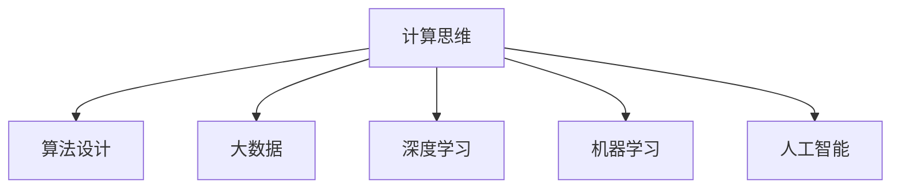

                 

# 人类计算：一个不断发展的领域

> 关键词：人类计算,计算思维,人工智能,机器学习,深度学习,大数据

## 1. 背景介绍

### 1.1 问题由来
在信息爆炸的今天，人类处理信息的量远远超出了自身的计算能力。面对海量的数据和复杂的决策问题，传统的人工计算方式显得力不从心。因此，将人类计算能力与计算技术相结合，发展全新的计算范式成为了一个迫切需求。

人类计算不仅涵盖了传统的人工智能、机器学习、深度学习、大数据等技术领域，还涉及计算思维、算法设计、系统架构等多个方面。它是一种多学科交叉、综合性极强的研究领域，旨在通过计算技术与人类智慧的结合，实现更加高效、灵活、智能的计算方式。

### 1.2 问题核心关键点
人类计算的核心关键点在于如何通过计算技术与人类智慧的结合，实现更加高效、灵活、智能的计算方式。具体来说，包括以下几个方面：

1. **计算思维与算法设计**：如何将人类对问题的理解转化为计算机可以执行的算法，设计出高效、可扩展的算法。
2. **大数据与深度学习**：如何利用大数据技术收集和分析海量数据，通过深度学习等技术从中挖掘出有价值的信息。
3. **系统架构与实现**：如何将这些技术集成到实际应用中，设计出稳定、可靠、高效的系统架构。
4. **计算伦理与安全**：如何确保计算过程中的数据隐私、安全与伦理问题，避免技术滥用。

这些关键点共同构成了人类计算的核心研究领域，推动着计算技术的发展与创新。

## 2. 核心概念与联系

### 2.1 核心概念概述

为了更好地理解人类计算，本节将介绍几个密切相关的核心概念：

- **计算思维**：指将问题转化为算法、进行计算分析的能力。人类计算强调将问题分解成多个子问题，设计高效的算法进行求解。
- **算法设计**：指设计高效、可扩展的算法，用于解决特定问题的过程。算法设计是计算思维的核心。
- **大数据**：指数据量巨大、类型多样的数据集。大数据技术包括数据收集、存储、处理与分析等。
- **深度学习**：指通过多层神经网络进行数据建模与预测的技术。深度学习在处理复杂数据方面具有独特优势。
- **机器学习**：指通过数据训练模型，自动学习数据规律的技术。机器学习是实现人类计算的重要手段之一。
- **人工智能**：指利用计算机技术模拟人类智能行为，解决复杂问题的技术。人工智能包括机器学习、深度学习等多种技术手段。

这些核心概念之间的逻辑关系可以通过以下Mermaid流程图来展示：



这个流程图展示了一致性的核心概念及其之间的关系：

1. 计算思维是算法设计的基础，指导如何设计高效的算法。
2. 算法设计是计算思维的实现，确保问题能被高效地解决。
3. 大数据和深度学习是算法设计的重要工具，用于处理复杂数据。
4. 机器学习和人工智能是算法设计的目标，实现自动化的智能决策。

这些概念共同构成了人类计算的核心研究框架，推动着计算技术的发展与创新。

## 3. 核心算法原理 & 具体操作步骤
### 3.1 算法原理概述

人类计算的核心算法原理可以概括为以下几个方面：

- **分治算法**：将复杂问题分解为多个子问题，分别求解后再合并结果。分治算法是大数据处理和分布式计算的重要基础。
- **动态规划**：通过将问题分解为子问题，保存子问题的解，避免重复计算，实现高效求解。动态规划常用于优化问题求解。
- **贪心算法**：在每一步选择最优解，逐步构建最终解。贪心算法常用于近似最优解求解。
- **遗传算法**：模拟自然界进化过程，通过随机生成、选择、交叉、变异等操作逐步优化问题的解。遗传算法常用于求解优化问题。
- **神经网络**：通过多层神经元进行数据建模与预测。深度学习是神经网络的一个重要分支，常用于处理复杂数据。

这些算法原理都源于人类对复杂问题的分析和理解，是实现高效、智能计算的基础。

### 3.2 算法步骤详解

下面以神经网络算法为例，详细讲解人类计算的具体步骤：

**Step 1: 数据准备**
- 收集和预处理数据，确保数据质量，去除噪声和异常值。
- 数据集划分为训练集、验证集和测试集。

**Step 2: 模型构建**
- 选择适当的神经网络结构，如全连接网络、卷积神经网络、循环神经网络等。
- 确定网络层数、每层节点数等超参数，设计损失函数和优化算法。

**Step 3: 模型训练**
- 使用训练集对模型进行训练，优化损失函数，调整模型参数。
- 在验证集上评估模型性能，调整超参数。
- 在测试集上评估模型最终性能。

**Step 4: 模型应用**
- 将训练好的模型应用于实际问题求解。
- 对输入数据进行前向传播计算，得到预测结果。

**Step 5: 模型评估**
- 使用指标（如准确率、召回率、F1值等）评估模型性能。
- 对模型进行调优，提升性能。

### 3.3 算法优缺点

人类计算算法具有以下优点：

- **高效性**：通过设计高效的算法，能够快速处理海量数据。
- **灵活性**：能够根据问题特点，灵活选择和组合算法。
- **智能性**：能够通过学习规律，自动优化问题求解。

同时，这些算法也存在一些局限性：

- **计算复杂度高**：一些算法（如深度学习）需要大量的计算资源。
- **数据依赖性强**：算法的性能很大程度上依赖数据质量和数量。
- **模型黑盒性**：复杂的算法模型难以解释和调试，缺乏可解释性。
- **泛化能力不足**：模型可能过拟合训练数据，泛化能力不足。

尽管存在这些局限性，人类计算算法仍是大数据和复杂问题求解的重要手段，是推动计算技术发展的重要驱动力。

### 3.4 算法应用领域

人类计算算法在多个领域得到了广泛的应用，例如：

- **金融分析**：使用神经网络和大数据技术，进行股票预测、风险评估等。
- **医疗诊断**：通过机器学习和深度学习，分析医疗影像、基因数据等，辅助诊断疾病。
- **自然语言处理**：使用语言模型和算法设计，进行文本分类、情感分析、机器翻译等。
- **图像识别**：使用卷积神经网络等算法，进行人脸识别、物体检测等。
- **推荐系统**：使用协同过滤和深度学习，进行用户行为分析，推荐商品和内容。

此外，人类计算算法还被应用于供应链管理、交通规划、能源优化等多个领域，为各行各业带来了新的发展机遇。

## 4. 数学模型和公式 & 详细讲解 & 举例说明

### 4.1 数学模型构建

本节将使用数学语言对人类计算的核心算法进行更加严格的刻画。

以神经网络算法为例，神经网络可以形式化地表示为：

$$
\begin{aligned}
\mathbf{h}^{(l)} &= \sigma(\mathbf{W}^{(l)} \mathbf{h}^{(l-1)} + \mathbf{b}^{(l)}) \\
\mathbf{y} &= \mathbf{W}^{(L)} \mathbf{h}^{(L-1)} + \mathbf{b}^{(L)}
\end{aligned}
$$

其中 $\mathbf{h}^{(l)}$ 为第 $l$ 层的输出，$\sigma$ 为激活函数，$\mathbf{W}^{(l)}$ 为第 $l$ 层的权重矩阵，$\mathbf{b}^{(l)}$ 为偏置向量，$\mathbf{y}$ 为最终输出。

神经网络通过多层非线性变换，实现对复杂数据的学习和建模。

### 4.2 公式推导过程

以二分类问题为例，神经网络模型的损失函数可以表示为：

$$
\mathcal{L}(\theta) = -\frac{1}{N}\sum_{i=1}^N [y_i \log(\hat{y}_i) + (1-y_i)\log(1-\hat{y}_i)]
$$

其中 $\theta$ 为模型参数，$y_i$ 为真实标签，$\hat{y}_i$ 为模型预测概率。

通过反向传播算法，损失函数对参数 $\theta$ 的梯度可以表示为：

$$
\frac{\partial \mathcal{L}(\theta)}{\partial \theta} = -\frac{1}{N}\sum_{i=1}^N [y_i \frac{\partial \log(\hat{y}_i)}{\partial h^{(L)}} \frac{\partial h^{(L)}}{\partial h^{(L-1)}} \cdots \frac{\partial h^{(2)}}{\partial h^{(1)}} \frac{\partial h^{(1)}}{\partial \theta}]
$$

其中 $h^{(L)}$ 为最终输出，$h^{(1)}$ 为输入数据。

通过求解上述梯度，可以使用优化算法（如Adam、SGD等）更新模型参数，最小化损失函数，实现模型训练。

### 4.3 案例分析与讲解

假设有一个房价预测问题，我们可以使用神经网络模型进行建模。具体步骤如下：

1. **数据准备**：收集房屋特征数据，如面积、位置、房间数量等，作为神经网络的输入。
2. **模型构建**：设计一个包含多个隐层的神经网络，选择适当的激活函数和损失函数。
3. **模型训练**：使用训练集对模型进行训练，调整权重和偏置，最小化预测误差。
4. **模型应用**：将训练好的模型应用于新房屋的价格预测。
5. **模型评估**：使用验证集和测试集评估模型性能，调整超参数。

下面是一个简单的代码实现示例：

```python
import torch
import torch.nn as nn
import torch.optim as optim
from torch.utils.data import DataLoader

# 定义神经网络模型
class Net(nn.Module):
    def __init__(self):
        super(Net, self).__init__()
        self.fc1 = nn.Linear(8, 32)
        self.fc2 = nn.Linear(32, 16)
        self.fc3 = nn.Linear(16, 1)
        self.relu = nn.ReLU()

    def forward(self, x):
        x = self.fc1(x)
        x = self.relu(x)
        x = self.fc2(x)
        x = self.relu(x)
        x = self.fc3(x)
        return x

# 定义损失函数和优化器
net = Net()
criterion = nn.MSELoss()
optimizer = optim.Adam(net.parameters(), lr=0.001)

# 准备数据
train_data = ...
val_data = ...
test_data = ...

# 训练模型
for epoch in range(1000):
    for batch_idx, (data, target) in enumerate(train_loader):
        optimizer.zero_grad()
        output = net(data)
        loss = criterion(output, target)
        loss.backward()
        optimizer.step()

    if (epoch + 1) % 100 == 0:
        val_loss = ...
        print('Epoch: {}, Val Loss: {}'.format(epoch + 1, val_loss))

# 评估模型
test_loss = ...
print('Test Loss: {}'.format(test_loss))
```

这个代码实现了使用神经网络进行房价预测的基本流程，展示了如何构建模型、训练模型和评估模型。

## 5. 项目实践：代码实例和详细解释说明
### 5.1 开发环境搭建

在进行人类计算项目开发前，我们需要准备好开发环境。以下是使用Python进行TensorFlow开发的环境配置流程：

1. 安装Anaconda：从官网下载并安装Anaconda，用于创建独立的Python环境。

2. 创建并激活虚拟环境：
```bash
conda create -n tf-env python=3.8 
conda activate tf-env
```

3. 安装TensorFlow：根据CUDA版本，从官网获取对应的安装命令。例如：
```bash
conda install tensorflow -c pytorch -c conda-forge
```

4. 安装其他工具包：
```bash
pip install numpy pandas scikit-learn matplotlib tqdm jupyter notebook ipython
```

完成上述步骤后，即可在`tf-env`环境中开始项目实践。

### 5.2 源代码详细实现

下面以图像识别为例，给出使用TensorFlow进行神经网络训练的代码实现。

首先，定义图像识别任务的数据处理函数：

```python
import tensorflow as tf
from tensorflow.keras.preprocessing.image import ImageDataGenerator

def load_data(batch_size):
    train_datagen = ImageDataGenerator(rescale=1./255)
    train_generator = train_datagen.flow_from_directory(
        'train',
        target_size=(224, 224),
        batch_size=batch_size,
        class_mode='categorical')
    
    val_datagen = ImageDataGenerator(rescale=1./255)
    val_generator = val_datagen.flow_from_directory(
        'val',
        target_size=(224, 224),
        batch_size=batch_size,
        class_mode='categorical')
    
    return train_generator, val_generator
```

然后，定义模型和优化器：

```python
from tensorflow.keras.models import Sequential
from tensorflow.keras.layers import Conv2D, MaxPooling2D, Flatten, Dense

model = Sequential()
model.add(Conv2D(32, (3, 3), activation='relu', input_shape=(224, 224, 3)))
model.add(MaxPooling2D((2, 2)))
model.add(Conv2D(64, (3, 3), activation='relu'))
model.add(MaxPooling2D((2, 2)))
model.add(Conv2D(128, (3, 3), activation='relu'))
model.add(MaxPooling2D((2, 2)))
model.add(Flatten())
model.add(Dense(128, activation='relu'))
model.add(Dense(10, activation='softmax'))

optimizer = tf.keras.optimizers.Adam(learning_rate=0.001)
```

接着，定义训练和评估函数：

```python
def train_epoch(model, generator, optimizer):
    generator.reset()
    model.trainable = True
    model.compile(optimizer=optimizer, loss='categorical_crossentropy', metrics=['accuracy'])
    loss, acc = model.train_on_batch(generator)
    return loss, acc

def evaluate(model, generator):
    generator.reset()
    model.trainable = False
    return model.evaluate_generator(generator)
```

最后，启动训练流程并在验证集上评估：

```python
epochs = 5
batch_size = 32

for epoch in range(epochs):
    train_loss, train_acc = train_epoch(model, train_generator, optimizer)
    val_loss, val_acc = evaluate(model, val_generator)
    print('Epoch: {}, Train Loss: {}, Train Acc: {}, Val Loss: {}, Val Acc: {}'.format(epoch + 1, train_loss, train_acc, val_loss, val_acc))
    
print('Final Val Loss: {}, Final Val Acc: {}'.format(val_loss, val_acc))
```

以上就是使用TensorFlow进行图像识别任务训练的完整代码实现。可以看到，TensorFlow提供了强大的工具和API，使得神经网络模型的开发和训练变得简洁高效。

### 5.3 代码解读与分析

让我们再详细解读一下关键代码的实现细节：

**load_data函数**：
- 使用`ImageDataGenerator`对图像数据进行预处理，包括缩放、归一化等。
- 使用`flow_from_directory`加载数据集，将目录中的子目录作为类别标签。

**模型定义**：
- 使用`Sequential`定义顺序神经网络模型。
- 添加多个卷积层、池化层和全连接层，构建深层神经网络。
- 定义损失函数和优化器，准备训练模型。

**train_epoch函数**：
- 重置数据生成器，重新加载数据。
- 将模型设置为可训练状态，编译模型。
- 使用`train_on_batch`进行训练，获取损失和准确率。

**evaluate函数**：
- 重置数据生成器，将模型设置为不可训练状态。
- 使用`evaluate_generator`进行评估，获取损失和准确率。

**训练流程**：
- 定义总的epoch数和batch size，开始循环迭代。
- 每个epoch内，先在训练集上训练，输出损失和准确率。
- 在验证集上评估，输出损失和准确率。
- 所有epoch结束后，输出最终验证集上的损失和准确率。

可以看到，TensorFlow提供了丰富的API和工具，使得神经网络模型的训练变得灵活高效。开发者可以根据实际需求，进行更深入的优化和调整。

## 6. 实际应用场景
### 6.1 智能制造

人类计算在智能制造领域具有广泛的应用前景。通过深度学习和机器学习技术，可以将生产过程进行建模和优化，提升生产效率和产品质量。

例如，使用神经网络进行质量检测，对生产过程中的图像进行识别和分类，实时检测产品的缺陷，及时进行调整。或者使用优化算法进行生产调度，动态调整生产线和工人配置，实现资源的最优配置。

### 6.2 健康医疗

在健康医疗领域，人类计算技术可以用于疾病预测、医疗影像分析、基因组学研究等。

例如，使用深度学习对医疗影像进行分割和分析，辅助医生进行疾病诊断。或者使用机器学习对基因数据进行模式识别，发现疾病相关基因和蛋白。这些技术的应用，将大大提升医疗服务的质量和效率。

### 6.3 智能交通

智能交通系统需要实时处理大量的交通数据，通过人类计算技术，可以实现交通流预测、路径规划、交通信号控制等。

例如，使用神经网络对交通流量进行建模和预测，实时调整交通信号灯的亮度和时长，优化交通流。或者使用优化算法对路线进行规划，避免拥堵，提高交通效率。

### 6.4 未来应用展望

随着人类计算技术的发展，未来将会有更多的应用场景涌现。

- **智能城市**：通过大数据和深度学习技术，实现城市数据的实时分析和处理，提升城市管理的智能化水平。
- **物联网**：通过人类计算技术，实现物联网设备的智能管理和控制，提升生活便捷性和安全性。
- **自动驾驶**：通过深度学习和优化算法，实现车辆的智能驾驶和导航，提升交通安全和效率。
- **增强现实**：通过计算机视觉和人类计算技术，实现虚拟场景与现实场景的融合，提升用户体验。

这些应用场景将带来全新的技术变革和商业模式，推动人类社会的进步和发展。

## 7. 工具和资源推荐
### 7.1 学习资源推荐

为了帮助开发者系统掌握人类计算的理论基础和实践技巧，这里推荐一些优质的学习资源：

1. 《深入理解计算机系统》：讲解计算机系统和硬件基础的经典教材，是理解人类计算的基础。

2. 《机器学习》（周志华）：讲解机器学习基本理论和算法的经典教材，是研究人类计算的重要工具。

3. 《深度学习》（Ian Goodfellow）：讲解深度学习基本理论和算法的经典教材，是实现人类计算的重要手段。

4. 《算法设计与分析》（Robert Sedgewick）：讲解算法设计理论和实践的经典教材，是优化人类计算算法的重要参考。

5. 《Python数据科学手册》（Jake VanderPlas）：讲解Python数据科学工具和库的实战指南，是进行人类计算项目的必备工具。

6. Kaggle：全球知名的数据科学竞赛平台，提供大量数据集和实践机会，是学习和实践人类计算的好去处。

通过对这些资源的学习实践，相信你一定能够快速掌握人类计算的精髓，并用于解决实际的计算问题。

### 7.2 开发工具推荐

高效的开发离不开优秀的工具支持。以下是几款用于人类计算开发的常用工具：

1. Python：简单易学的脚本语言，拥有丰富的库和框架，是实现人类计算项目的主要语言。

2. TensorFlow：谷歌开发的深度学习框架，支持分布式计算和自动微分，是进行深度学习项目的主要工具。

3. PyTorch：Facebook开发的深度学习框架，易于使用且具有高度的灵活性，是进行深度学习项目的重要工具。

4. Jupyter Notebook：交互式的Python开发环境，支持代码、数据和文档的集成展示，是进行人类计算项目的好帮手。

5. TensorBoard：TensorFlow配套的可视化工具，可实时监测模型训练状态，提供丰富的图表和数据，是调试模型的得力助手。

6. Weights & Biases：模型训练的实验跟踪工具，可以记录和可视化模型训练过程中的各项指标，方便对比和调优。

合理利用这些工具，可以显著提升人类计算项目的开发效率，加快创新迭代的步伐。

### 7.3 相关论文推荐

人类计算技术的发展源于学界的持续研究。以下是几篇奠基性的相关论文，推荐阅读：

1. TensorFlow白皮书：详细介绍了TensorFlow的设计理念和架构，是深度学习项目开发的重要参考。

2. Google AI白皮书：介绍了Google AI的架构和技术栈，是了解谷歌深度学习项目开发的好材料。

3. AlexNet论文：提出了AlexNet神经网络模型，是深度学习领域的开创性工作，展示了神经网络在图像识别任务中的巨大潜力。

4. ResNet论文：提出了残差网络模型，解决了深度神经网络训练中的梯度消失问题，是实现深层神经网络的关键技术。

5. AlphaGo论文：介绍了AlphaGo在围棋领域的胜利，展示了强化学习和深度学习的强大能力。

这些论文代表了大规模深度学习和人机智能交互的研究脉络，为后续研究提供了重要的理论和技术支持。

## 8. 总结：未来发展趋势与挑战
### 8.1 总结

本文对人类计算技术进行了全面系统的介绍。首先阐述了人类计算的研究背景和意义，明确了计算思维、算法设计、大数据、深度学习、机器学习、人工智能等核心概念及其之间的联系。其次，从原理到实践，详细讲解了神经网络模型的数学模型和计算过程，给出了神经网络训练的完整代码实例。同时，本文还广泛探讨了人类计算技术在智能制造、健康医疗、智能交通等多个领域的应用前景，展示了其广阔的发展空间。此外，本文精选了人类计算技术的各类学习资源，力求为读者提供全方位的技术指引。

通过本文的系统梳理，可以看到，人类计算技术已经成为现代计算科学的重要组成部分，其与人工智能、深度学习等技术的深度融合，推动了计算技术的发展与创新。未来，随着计算资源的不断丰富和算法技术的不断进步，人类计算技术将展现出更加广阔的前景，为人类的计算能力带来新的突破。

### 8.2 未来发展趋势

展望未来，人类计算技术将呈现以下几个发展趋势：

1. **计算速度的提升**：随着硬件计算能力的提升，人类计算的速度将进一步提升，实现更加高效的数据处理和计算。

2. **计算模式的演变**：未来的计算模式将更加多样化和智能化，通过分布式计算、量子计算等手段，提升计算效率和计算能力。

3. **计算思维的普及**：计算思维将逐渐普及到各个学科领域，提升全民的计算能力和科学素养，推动计算技术的发展。

4. **计算伦理的重视**：随着计算技术的广泛应用，计算伦理和安全问题将受到更多的重视，计算技术的应用将更加规范和可控。

5. **计算与伦理的结合**：未来的计算技术将更加注重伦理和安全问题，通过算法设计和数据处理，提升计算技术的社会价值和安全性。

6. **计算与艺术的结合**：计算技术将与艺术设计、文学创作等领域相结合，推动计算技术与人类智慧的深度融合，实现更丰富的应用场景。

这些趋势凸显了人类计算技术的广阔前景，展示了计算技术未来的发展方向。

### 8.3 面临的挑战

尽管人类计算技术已经取得了瞩目成就，但在迈向更加智能化、普适化应用的过程中，它仍面临着诸多挑战：

1. **计算资源的瓶颈**：大规模计算任务需要强大的计算资源支持，现有的计算资源可能无法满足需求。如何提升计算效率和资源利用率，将是一大难题。

2. **计算模型的复杂性**：复杂的计算模型难以解释和调试，缺乏可解释性。如何提升模型的透明性和可解释性，将是重要的研究课题。

3. **数据质量问题**：计算结果的准确性和可靠性依赖于数据质量，如何提高数据的质量和准确性，将是重要的研究方向。

4. **计算伦理和安全问题**：计算技术的应用可能涉及伦理和安全问题，如何确保计算过程的公正性和安全性，将是重要的社会课题。

5. **计算技术的普及**：计算技术的应用需要广泛的普及和推广，如何降低技术门槛，提升公众的计算素养，将是重要的社会课题。

这些挑战凸显了人类计算技术的应用前景，需要学界和产业界的共同努力，才能将计算技术推向新的高度。

### 8.4 研究展望

面对人类计算面临的种种挑战，未来的研究需要在以下几个方面寻求新的突破：

1. **计算资源的优化**：通过分布式计算、云计算等手段，优化计算资源的利用，提升计算效率。

2. **计算模型的透明性**：通过可解释性技术和模型压缩，提升计算模型的透明性和可解释性，增强模型的可信度。

3. **数据质量的提升**：通过数据清洗和预处理，提升数据的质量和准确性，增强计算结果的可靠性。

4. **计算伦理的规范**：制定计算伦理规范和标准，确保计算技术的应用符合社会伦理和法律规范。

5. **计算技术的普及**：通过教育和培训，提升公众的计算素养，推动计算技术的广泛应用。

这些研究方向的探索，将推动人类计算技术迈向更高的台阶，为计算技术的未来发展提供新的方向。

## 9. 附录：常见问题与解答

**Q1：什么是计算思维？**

A: 计算思维是指将问题转化为算法、进行计算分析的能力。计算思维强调将问题分解成多个子问题，设计高效的算法进行求解。计算思维是计算机科学的核心能力之一，也是人类计算的基础。

**Q2：神经网络的结构是怎样的？**

A: 神经网络由多个层组成，包括输入层、隐藏层和输出层。每层包含多个神经元，通过连接权重和激活函数实现信息的传递和处理。神经网络通过多层非线性变换，实现对复杂数据的学习和建模。

**Q3：人类计算技术的应用场景有哪些？**

A: 人类计算技术在多个领域得到了广泛的应用，包括智能制造、健康医疗、智能交通、自然语言处理等。未来，人类计算技术还将应用于智能城市、物联网、自动驾驶、增强现实等新兴领域，为各行各业带来新的发展机遇。

**Q4：如何提升计算结果的可靠性？**

A: 提升计算结果的可靠性需要从数据、模型、计算等多方面进行综合考虑。首先，需要提高数据的质量和准确性，确保数据来源可靠。其次，需要选择适合的计算模型和算法，避免过拟合和欠拟合问题。最后，需要进行充分的实验和测试，验证计算结果的可靠性。

**Q5：未来人类计算技术的发展方向是什么？**

A: 未来人类计算技术的发展方向包括计算速度的提升、计算模式的演变、计算思维的普及、计算伦理的重视、计算与艺术的结合等。这些趋势将推动计算技术的发展，提升计算能力和社会价值。

总之，人类计算技术是一个多学科交叉、综合性极强的研究领域，其发展将推动计算技术的不断进步，为人类社会的进步和发展带来新的动力。通过不断探索和创新，人类计算技术将展现出更加广阔的前景，为人类的计算能力带来新的突破。

